# 大数据 · 17 数据服务化与指标管理（数据产品化 / 指标体系 / 指标口径 / 数据API / 语义层 / 数据民主化 / 数据目录）

> 数据中台的最终价值不在"建了多少张表"，而在"业务能多快拿到可信的数据"。本文深入拆解**数据产品化层次、指标体系设计与口径管理、数据 API 设计、语义层、数据目录、自助分析与数据民主化**，并给出落地框架。

---

## 一、要解决的问题

| 痛点 | 说明 |
|------|------|
| 产能不足 | 数据团队排期长，业务需求爆炸 |
| 口径混乱 | 同一个"GMV"三个团队三个数——信任危机 |
| 取数困难 | 每次取数写 SQL，重复开发、响应慢 |
| 资产黑洞 | 表建了一堆，业务找不到、用不上 |
| 服务脆弱 | 数据 API 无 SLA、无限流、易被打垮 |

> 核心认知：**数据服务化 = 把表/指标/API 变成「可发现、可理解、可信赖、可复用」的数据产品**——关键抓手是「口径唯一（指标管理）」和「服务化（API/语义层）」两条线。

---

## 二、数据产品化

### 2.1 产品层次

| 层次 | 产品形态 | 用户 | 例子 |
|------|----------|------|------|
| L1 原始数据 | 湖/仓基础表 | 数据开发 | ODS/DWD 明细表 |
| L2 数据资产 | 主题宽表/指标 | 分析师/BI | DWS 汇总、ADS 应用表 |
| L3 数据服务 | API/报表/推送 | 业务系统/运营 | 数据接口、BI 报表、消息推送 |
| L4 数据应用 | 产品化应用 | 终端用户 | 数据看板、推荐、风控系统 |

### 2.2 产品设计原则

```
以用户为中心：从业务场景出发，不是从表出发
口径唯一：同一指标只在一处定义，多处引用
自助优先：80% 需求自助完成，20% 才找数据团队
可发现：有目录、有文档、有血缘
可信赖：有质量监控、有 SLA、有 Owner
可复用：一次建设，多处复用
```

### 2.3 数据资产化闭环

```
找数（扫描库表）→ 认数（Owner/口径/分级）→ 理数（血缘/依赖）
→ 用数（目录检索/订阅/API）→ 评数（热度/质量/价值）
```

---

## 三、指标体系与口径管理（核心）

### 3.1 指标分类

| 类型 | 定义 | 例子 | 管理要求 |
|------|------|------|----------|
| 原子指标 | 不可再分的最小度量 | 订单金额、支付笔数 | 口径文档+唯一计算逻辑 |
| 派生指标 | 原子+修饰词+时间 | 近 7 天新用户 GMV | 由原子指标自动生成 |
| 复合指标 | 多指标运算 | 客单价=GMV/订单数 | 由原子/派生组合 |

```
命名规范：[业务域]_[主题]_[原子指标]_[修饰词]_[时间周期]
  如 trade_order_gmv_newuser_7d
```

### 3.2 指标体系设计

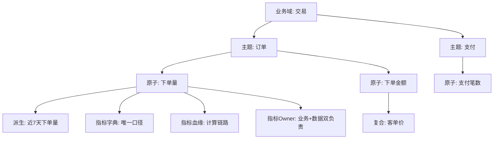

### 3.3 口径一致性保障

| 手段 | 做法 |
|------|------|
| 唯一计算逻辑 | 同一指标只在一个 DWS 层计算，ADS 只读不重算 |
| 指标字典 | 名称/口径/维度/更新频率/Owner 统一文档 |
| 指标血缘 | 从 ADS 回溯到 ODS 的完整链路 |
| 口径校验 | 新旧口径并行跑，差异归零后切流 |
| Owner 制 | 业务 Owner 定口径 + 数据 Owner 保质量 |

```
典型问题：业务 A 的 GMV 含退款，业务 B 的不含
  → 指标字典明确标注口径，禁止"同名不同义"
  → 口径变更走评审 + 影响分析（血缘）
```

### 3.4 指标平台能力

```
指标平台（如 Kyligence/自建/AthenaX）：
  指标注册（原子/派生/复合）
  指标编排（组合复用）
  指标查询（自动生成 SQL 下推引擎）
  指标监控（口径波动/异常告警）
```

---

## 四、数据 API 设计

### 4.1 API 类型

| 类型 | 接口形态 | 适用 | 例子 |
|------|----------|------|------|
| 明细查询 | GET /data/detail | 少量数据 | 查单用户近 30 天订单 |
| 聚合查询 | POST /data/aggregate | 报表/看板 | 近 7 天各城市 GMV |
| 人群圈选 | POST /data/crowd | 营销/推荐 | 导出高价值用户 |
| 数据推送 | Webhook/MQ | 下游订阅 | 订单状态变更通知 |
| 文件导出 | POST /data/export | 大批量 | 导出全量用户标签 |

### 4.2 API 设计原则

```
无状态：不依赖会话，每次独立鉴权
幂等：重复调用结果一致（防重复扣减/推送）
分页：大结果集 cursor 分页（优于 offset）
限流：按 AppKey/用户限流，防雪崩
脱敏：按用户权限自动脱敏
版本化：/v1/、/v2/ 兼容升级
缓存：热点结果 Redis 缓存（TTL 5min~1h）
```

### 4.3 数据服务架构

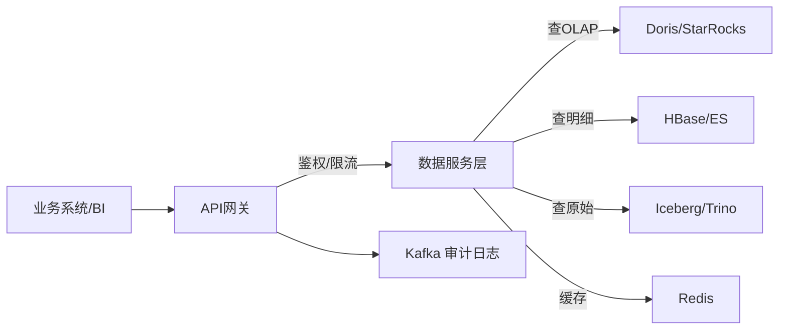

```
API 网关：统一鉴权、限流、路由、审计
数据服务层：封装查询逻辑，屏蔽底层存储差异
稳定性：熔断降级（缓存/排队）、SLA 监控、容量规划
```

---

## 五、语义层

### 5.1 语义层的作用

```
语义层 = 把物理表映射为业务可理解的"指标/维度"

作用：
  ① 屏蔽物理存储差异（不关心底层表结构）
  ② 统一口径（指标只定义一次）
  ③ 支撑自助分析（SQL/拖拽/自然语言都走语义层）
  ④ 权限控制（按指标/维度控制可见性）
```

### 5.2 语义层架构

```
物理表（DWD/DWS） → 逻辑模型（业务对象） → 指标/维度定义
  ↓
自助工具：SQL / 拖拽 BI / Text-to-SQL
  ↓
统一治理：口径/权限/血缘
```

### 5.3 Text-to-SQL 防幻觉

```
语义层约束：只能查询已定义的指标/维度
SQL 校验：语法+权限+成本（扫描量）校验
结果校验：行数/聚合值合理性检查
引用溯源：回答附数据来源
```

---

## 六、数据目录 / 数据地图

### 6.1 目录能力

| 能力 | 说明 |
|------|------|
| 资产搜索 | 按关键词/标签搜表/字段/指标 |
| 数据画像 | 表规模、更新频率、质量评分、热度 |
| 血缘追溯 | 上下游依赖、影响分析 |
| 标签体系 | 业务标签、安全分级、质量标签 |
| 数据预览 | 样本预览（脱敏后） |
| 申请审批 | 数据权限在线申请+审批流 |

### 6.2 目录架构

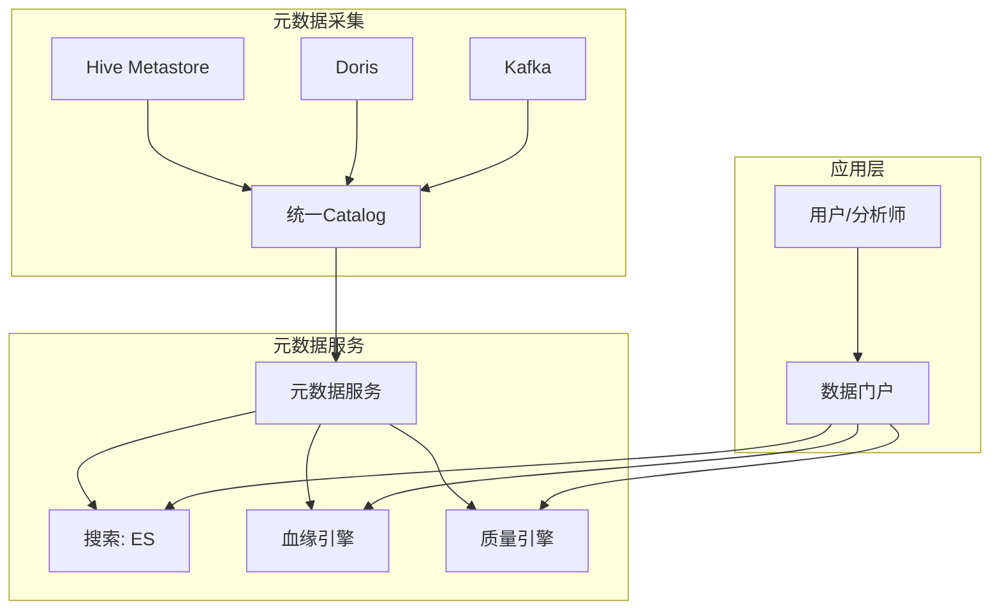

---

## 七、数据民主化与自助分析

### 7.1 自助层次

| 层次 | 用户 | 工具 | 数据团队介入 |
|------|------|------|-------------|
| L1 固定报表 | 运营/管理 | BI 报表（Grafana/Superset） | 开发报表 |
| L2 自助查询 | 分析师 | SQL（Hue/DBeaver） | 建表/优化 |
| L3 拖拽分析 | 业务 | 拖拽 BI（Tableau/PowerBI） | 建数据模型 |
| L4 智能分析 | 全员 | 自然语言（Text-to-SQL） | 维护语义层 |

```
民主化前提：语义层 + 治理保口径 + 权限受控
否则"自助"变成"各算各的、口径更乱"
```

### 7.2 组织与运营

```
数据团队转型：
  从"取数工具人"→"数据产品经理"（建资产、管口径、造工具）
运营机制：
  数据资产发布会/周报
  需求与反馈闭环（数据产品迭代）
  SLA 承诺与考核（响应时效、可用性）
```

---

## 八、Checklist

- [ ] 数据产品分层规划（L1-L4）与 Owner 明确。
- [ ] 指标体系：原子/派生/复合 + 指标字典 + 血缘。
- [ ] 口径唯一：单点计算 + 口径校验 + 变更评审。
- [ ] 数据 API：无状态/幂等/分页/限流/脱敏/版本化。
- [ ] 语义层落地：指标/维度定义 + 权限控制。
- [ ] 数据目录：搜索/画像/血缘/质量/申请审批。
- [ ] 自助分析分层 + Text-to-SQL 防幻觉。
- [ ] SLA 监控 + 熔断降级 + 审计。

---

## 数据API网关架构

### 网关核心能力

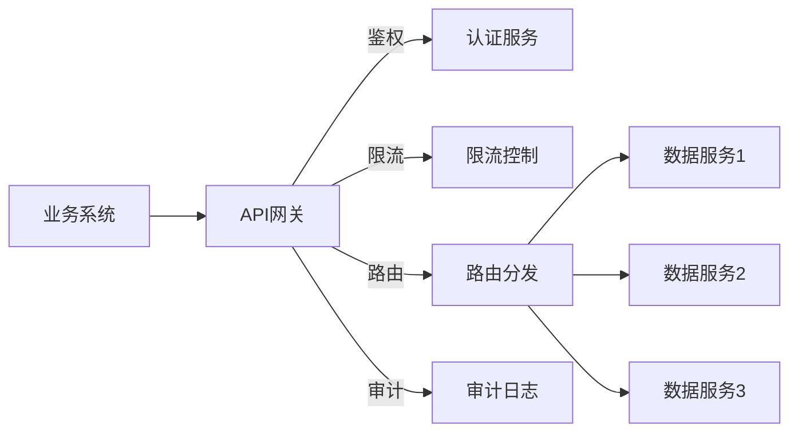

| 能力 | 说明 | 实现 |
|------|------|------|
| 认证 | AppKey/Token/OAuth2 | 网关层统一鉴权 |
| 限流 | QPS/并发控制 | 令牌桶/滑动窗口 |
| 路由 | 按版本/场景分发 | 策略路由 |
| 熔断 | 服务降级保护 | Sentinel/Hystrix |
| 审计 | 调用日志记录 | Kafka→ES |
| 监控 | 延迟/成功率/错误率 | Prometheus+Grafana |

### API版本化策略

```
版本策略：
  URL版本：/v1/data、/v2/data
  Header版本：Accept-Version: v1
  参数版本：?version=1

兼容性保证：
  新版本发布后旧版本保留3~6个月
  废弃版本提前30天通知
  文档同步更新（Swagger/OpenAPI）
```

## 语义层（Semantic Layer）

### 语义层架构

```
物理层：DWD/DWS/ADS表
  ↓
逻辑层：业务对象（Order、Customer、Product）
  ↓
语义层：指标/维度定义（GMV=SUM(amount)）
  ↓
应用层：SQL/BI/Text-to-SQL/自然语言

语义层作用：
  ① 屏蔽物理表差异（不关心底层表结构）
  ② 统一口径（指标只定义一次）
  ③ 支撑自助分析（SQL/拖拽/自然语言）
  ④ 权限控制（按指标/维度控制可见性）
```

### Metrics Store vs 数据仓库

| 维度 | 数据仓库 | Metrics Store |
|------|---------|--------------|
| 定义 | 物理表+ETL | 指标+维度逻辑定义 |
| 存储 | 实际数据 | 指标元数据+缓存 |
| 查询 | SQL直查 | 通过语义层查询 |
| 口径 | 分散在SQL中 | 统一定义管理 |
| 适用 | 数据开发 | 业务分析师 |

```
Metrics Store功能：
  指标注册：名称/口径/维度/Owner
  指标查询：自动生成SQL下推引擎
  指标监控：口径波动/异常告警
  指标血缘：从ADS回溯到ODS

工具：
  dbt Metrics：dbt内建指标层
  Cube.js：开源语义层
  Transform：商业Metrics Store
  自建：指标平台+语义层
```

## 指标定义与计算

### 指标分类体系

| 类型 | 定义 | 示例 | 计算 |
|------|------|------|------|
| 原子指标 | 不可再分的最小度量 | 订单金额、支付笔数 | SUM/COUNT |
| 派生指标 | 原子+修饰词+时间 | 近7天新用户GMV | 原子+筛选 |
| 复合指标 | 多指标运算 | 客单价=GMV/订单数 | 比值计算 |

```
命名规范：
  [业务域]_[主题]_[原子指标]_[修饰词]_[时间周期]
  如：trade_order_gmv_newuser_7d

维度标准化：
  时间：dt（日期）、hour（小时）
  地域：city、province、country
  渠道：app、web、offline
  设备：ios、android、pc
```

### 指标口径一致性

```
口径问题：
  业务A的GMV含退款，业务B的GMV不含退款
  → 同名不同义，决策混乱

解决方案：
  ① 指标字典：唯一口径定义（名称/公式/维度/Owner）
  ② 单点计算：同一指标只在DWS层计算一次
  ③ 口径校验：新旧口径并行跑，差异归零后切流
  ④ 变更评审：口径变更走评审+影响分析
  ⑤ Owner制：业务Owner定口径+数据Owner保质量
```

## 数据产品设计模式

### 产品层次

| 层次 | 产品形态 | 用户 | 例子 |
|------|----------|------|------|
| L1 | 原始数据表 | 数据开发 | ODS/DWD明细表 |
| L2 | 主题宽表/指标 | 分析师/BI | DWS汇总、ADS应用表 |
| L3 | 数据服务/API | 业务系统 | 数据接口、推送 |
| L4 | 数据应用 | 终端用户 | 看板、推荐、风控 |

### 设计原则

```
以用户为中心：从业务场景出发，不是从表出发
口径唯一：同一指标只在一处定义
自助优先：80%需求自助完成
可发现：有目录、有文档、有血缘
可信赖：有质量监控、有SLA、有Owner
可复用：一次建设，多处复用
```

## 自助分析与数据民主化

### 自助层次

| 层次 | 用户 | 工具 | 数据团队介入 |
|------|------|------|-------------|
| L1 固定报表 | 运营/管理 | BI报表 | 开发报表 |
| L2 自助查询 | 分析师 | SQL工具 | 建表/优化 |
| L3 拖拽分析 | 业务 | 拖拽BI | 建数据模型 |
| L4 智能分析 | 全员 | 自然语言 | 维护语义层 |

```
民主化前提：
  语义层：统一口径
  治理：保口径+权限受控
  否则"自助"变成"各算各的、口径更乱"
```

## 数据市场（Data Marketplace）

```
定位：数据资产的"应用商店"

功能：
  数据浏览：按分类/标签浏览数据产品
  数据订阅：在线申请数据权限
  数据交换：跨组织数据协作
  数据评价：使用反馈和评分
  计量计费：按调用量计费

与数据目录区别：
  数据目录：面向数据团队（技术视角）
  数据市场：面向业务用户（产品视角）
  互补：目录提供治理，市场提供交易
```

## 数据变现策略

| 策略 | 说明 | 案例 |
|------|------|------|
| 数据产品 | 封装为API/报告/标签 | 信用评分API |
| 数据服务 | 提供分析/洞察能力 | 营销洞察报告 |
| 数据合作 | 跨组织数据协作 | 联合建模 |
| 数据平台 | 提供数据处理能力 | 数据中台服务 |

```
变现路径：
  内部降本：减少重复开发、提高效率
  外部创收：数据产品/API对外销售
  生态协作：数据交换/联合建模

合规考虑：
  数据确权：明确数据所有权
  隐私保护：脱敏/匿名化处理
  合同约束：数据使用协议DPA
  审计追溯：数据使用日志
```

## 数据SLA定义

```
SLA要素：
  可用性：服务正常运行时间（99.9%）
  延迟：查询响应时间（<3s）
  吞吐：支持QPS（1000+）
  数据新鲜度：数据延迟（<5min）
  质量：数据准确率（99.9%）

SLA分级：
  P0（核心）：99.99%可用性，<1s延迟
  P1（重要）：99.9%可用性，<3s延迟
  P2（一般）：99%可用性，<10s延迟
  P3（低优）：95%可用性，<60s延迟

SLA监控：
  实时监控：Prometheus+Grafana
  告警：延迟/错误率超阈值告警
  报告：月度SLA达标率报告
```

## 数据服务版本化与治理

```
版本管理：
  API版本：/v1/、/v2/（URL或Header）
  文档版本：Swagger/OpenAPI自动同步
  变更日志：Breaking/Non-Breaking变更标注
  废弃策略：旧版本保留3~6个月

治理机制：
  审批流：API上线/变更走审批
  监控：调用链路追踪（Jaeger/SkyWalking）
  限流：按AppKey/用户限流
  降级：服务异常时降级到缓存/默认值

文档化：
  API文档：自动生成+人工补充
  数据字典：字段含义/口径/Owner
  使用示例：典型查询示例
  FAQ：常见问题汇总
```

---

## 指标口径冲突治理案例：同名字段不同算法

```text
事故背景：
  经营周会上，运营部 GMV = ¥2.3 亿，财务口径 GMV = ¥2.1 亿，
  差异 2000 万——两个团队各自报表都「没错」，但没人能解释差异。

排查时间线：
  D1 发现差异 → 双方各说各有理
  D2 血缘下钻：运营用 dws_trade_1d.gmv；财务用 ads_fin_gmv.gmv
  D3 算法 diff：财务口径扣除了「未支付取消单」+「B2B 大客户赊销」；
     运营口径含全额退款前金额
  D4 结论：同名不同义 + 无 Owner 裁决 → 各建各表
```

| 差异点 | 运营口径 | 财务口径 | 治理裁决 |
|--------|---------|---------|---------|
| 取消单 | 计入 | 剔除 | 拆成两个原子指标 |
| 退款 | 全额计 | 净额计 | 同上 |
| B2B 赊销 | 计入 | 收款确认后计 | 同上 |

```text
治理动作（可复制）：
① 强制改名：gmv_ops_gross / gmv_fin_net —— 禁止同名不同义
② 登记派生关系：两个指标共享原子指标 order_amount，
   仅修饰词不同（OneData 的价值此刻显现）
③ 设仲裁 Owner：跨部门指标由数据委员会指定唯一口径决策人
④ 报表标注：所有看板右上角展示口径摘要 + 字典链接
预防机制：
  新指标注册时系统强制做「名称相似度 + 算法哈希」查重，
  命中已有指标的必须引用而非新建
```

## Headless BI 与语义层（Cube.js / dbt Semantic Layer）

```
Headless BI = 把「指标定义 + 维度模型」做成无界面的服务层，
             BI 工具、API、AI 助手都消费同一份语义定义。

架构：dbt/Cube 定义文件（Git 管理）
      → 编译成查询计划 → 下推 OLAP 执行
      → 多端输出：REST/GraphQL API、Tableau、Text-to-SQL
```

| 维度 | Cube.js | dbt Semantic Layer |
|------|---------|--------------------|
| 定位 | 独立语义层服务（缓存/多租户强） | 绑定 dbt 转换工作流 |
| 定义语言 | JS Schema（data model as code） | YAML（MetricFlow） |
| 部署形态 | 常驻 API 服务 | dbt Cloud / CLI 导出 |
| 亮点 | pre-aggregation 自动加速 | 与 dbt 测试/文档血缘一体 |
| 适用 | 高并发数据 API + 多 BI | 已重度使用 dbt 的现代栈 |

```javascript
// Cube.js schema：口径即代码，一处定义处处一致
cube(`orders`, {
  sql: `SELECT * FROM dws_order_1d`,
  measures: {
    gmv: { sql: `pay_amount`, type: `sum` },
    orderCount: { sql: `order_id`, type: `countDistinct` },
  },
  dimensions: { city: { sql: `city`, type: `string` } },
});
```

选型提示：语义层的成败在「治理纪律」不在工具——所有下游只准走语义层取数，绕过者审计发现即通报；否则又退化回各写各 SQL。

## 数据服务 API 网关限流与鉴权

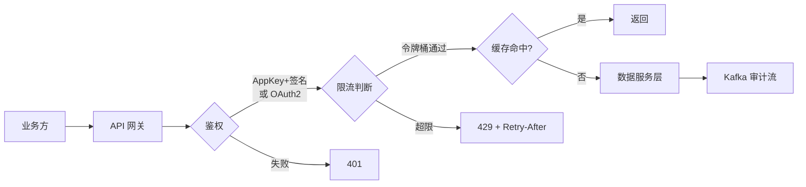

| 能力 | 实现 | 关键参数 |
|------|------|---------|
| 应用鉴权 | AppKey/AppSecret HMAC 签名 + 时间戳防重放 | 时钟偏差 ≤5min |
| 用户级鉴权 | OAuth2/JWT，行级权限随 token 下发 | 权限点最小化 |
| 限流算法 | 单机令牌桶 + Redis 分布式配额 | 按 AppKey×接口 两维 |
| 分级配额 | P0 合作方 > 内部核心 > 普通 | 超限降级到缓存快照 |
| 熔断降级 | Sentinel 规则：错误率>50% 熔断 | 兜底返回最近快照 |

```text
限流设计经验值（数据 API 特有）：
  明细导出类按「行数」限流而非仅 QPS（一次拉千万行照样打垮库）；
  聚合类按扫描量配额（防大范围查询）；
  大促前给核心合作方做压测扩容预案，配额动态上调留审批痕迹。
```

## 指标血缘与影响分析

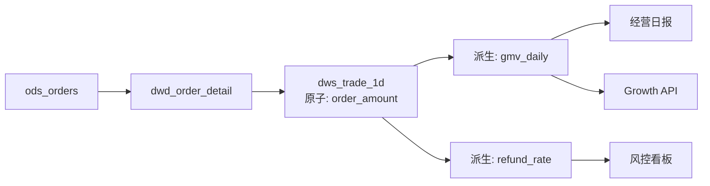

```text
两类核心场景：
① 影响分析（改之前）：把 dws_trade_1d.pay_amount 字段类型
   从 DECIMAL(18,2) 改 DECIMAL(20,4) →
   血缘自动列出受影响：2 个派生指标 + 1 个 API + 1 个日报，
   变更评审单自动 @ 所有下游 Owner

② 口径溯源（出问题之后）：经营日报 GMV 突跌 30% →
   沿指标血缘反查：gmv_daily ← dws_trade_1d ← dwd_order_detail
   → 定位到当日上游 CDC 断流 2 小时
验收标准：
  指标级血缘覆盖率 100%（指标平台强制登记），
  表级血缘自动采集覆盖 ≥95%，字段级 ≥80%
```

## 数据服务 SLA 分级承诺表

| SLA 等级 | 可用性 | P99 延迟 | 数据时效 | 故障响应 | 典型对象 |
|----------|:---:|:---:|:---:|:---:|----------|
| L0 核心交易 | 99.99% | <200ms | 秒级 | 7×24，15min 响应 | 支付风控特征 API |
| L1 重要业务 | 99.9% | <1s | 分钟级 | 5×8 + 值班，30min | 推荐召回、营销圈人 |
| L2 一般分析 | 99% | <3s | 小时级 | 工作时段，4h | BI 看板数据集 |
| L3 低优批量 | 95% | 分钟级~异步 | T+1 | 工单，1 工作日 | 报表导出、归档下载 |

```yaml
# SLA 监控规则示例（Prometheus）
groups:
- name: data-api-sla
  rules:
  - alert: L1LatencyBreach
    expr: histogram_quantile(0.99, sum(rate(api_latency_bucket{tier="L1"}[5m])) by (le)) > 1
    for: 10m
  - alert: FreshnessBreach
    expr: (time() - max(data_freshness_timestamp{table="dws_trade_1d"})) > 3600
```

配套机制：SLA 达标率月度公示并计入数据团队 OKR；连续两月不达标的 L0/L1 服务触发架构专项（缓存/降级/容量）；SLA 等级变更走正式评审，禁止「口头承诺无限高优」。

> 落地口诀：**口径冲突靠「拆原子指标 + 强制改名 + 仲裁 Owner」，语义层靠「定义即代码 + 只准走语义层」，网关靠「鉴权→限流→降级三道闸」，影响分析靠「指标血缘全覆盖」，服务承诺靠「分级 SLA + 月度公示」**。

---

## 指标定义规范（原子指标/派生指标/复合指标）

| 指标类型 | 定义 | 示例 | 管理要求 |
|----------|------|------|----------|
| 原子指标 | 不可再分的最小度量 | 订单金额、支付笔数 | 唯一口径+唯一计算逻辑 |
| 派生指标 | 原子+修饰词+时间 | 近7天新用户GMV | 由原子指标自动生成 |
| 复合指标 | 多指标运算 | 客单价=GMV/订单数 | 由原子/派生组合 |

```
命名规范：
  [业务域]_[主题]_[原子指标]_[修饰词]_[时间周期]
  如：trade_order_gmv_newuser_7d

维度标准化：
  时间：dt（日期）、hour（小时）
  地域：city、province、country
  渠道：app、web、offline
  设备：ios、android、pc
```

## 指标存储引擎选择（ClickHouse/Doris/Druid）

| 维度 | ClickHouse | Doris | Druid |
|------|-----------|-------|-------|
| 单表聚合 | 极快 | 快 | 快 |
| 高并发 QPS | 100~500 | 1000~10000 | 1000+ |
| 实时更新 | 弱 | 强（upsert） | 中 |
| 适用场景 | 日志/监控指标 | BI 指标/高并发 | 时序指标/大屏 |

```
选型：
  日志/监控指标 → ClickHouse（列压缩极优）
  BI 报表指标 → Doris/StarRocks（高并发+upsert）
  实时大屏指标 → Druid（预聚合+倒排索引）
```

## 数据服务 API 设计（REST/GraphQL/gRPC）

| 类型 | 优点 | 缺点 | 适用 |
|------|------|------|------|
| REST | 简单、生态广 | 过度/不足获取 | 通用 API |
| GraphQL | 灵活查询、按需获取 | 复杂度高 | 多端差异化需求 |
| gRPC | 高性能、强类型 | 调试难 | 微服务间调用 |

```
数据 API 设计原则：
  无状态：不依赖会话，每次独立鉴权
  幂等：重复调用结果一致
  分页：大结果集 cursor 分页（优于 offset）
  限流：按 AppKey/用户限流
  脱敏：按用户权限自动脱敏
  版本化：/v1/、/v2/ 兼容升级
```

## 数据服务版本管理与灰度策略

```
版本管理策略：
  URL 版本：/v1/data、/v2/data（推荐）
  Header 版本：Accept-Version: v1
  废弃策略：旧版本保留 3~6 个月
  Breaking 变更：必须新版本

灰度策略：
  Phase 1：内部测试（10% 流量）
  Phase 2：核心合作方（30% 流量）
  Phase 3：全量发布（100% 流量）
  
回滚：
  新版本异常 → 流量切回旧版本
  保留旧版本至少 30 天
```

## 指标口径冲突解决流程

```
冲突解决流程：

  1. 发现差异
    两个报表同指标数值不同
    → 差异 > 0.5% 触发告警
  
  2. 血缘下钻
    沿指标血缘反查：ADS ← DWD ← ODS
    → 定位差异来源（算法/数据源/时间范围）
  
  3. 口径仲裁
    数据委员会指定唯一口径决策人
    → 强制改名：gmv_ops_gross / gmv_fin_net
  
  4. 预防机制
    新指标注册时查重（名称相似度+算法哈希）
    命中已有指标必须引用而非新建
  
  5. 报表标注
    所有看板右上角展示口径摘要+字典链接
```

## 数据产品化思维（从需求到交付）

```
数据产品化四步：

  Step 1 需求理解
    业务场景 → 用户故事 → 验收标准
    关键：区分"需要"和"想要"

  Step 2 产品设计
    数据模型 → 指标定义 → SLA
    关键：口径唯一、可复用

  Step 3 开发交付
    ETL 开发 → 质量校验 → 上线
    关键：幂等、可测试

  Step 4 运营迭代
    使用监控 → 反馈收集 → 持续优化
    关键：数据资产化、度量 ROI
```

## 九、GMV 口径冲突治理案例

```text
GMV 口径冲突案例：

  业务方 A（运营）：GMV = 订单金额（含退款）
  业务方 B（财务）：GMV = 实付金额（扣除退款）
  业务方 C（管理层）：GMV = 实付金额 + 优惠券金额

  冲突原因：
    1. 不同部门定义不同
    2. 数据来源不同（订单表/支付表/财务表）
    3. 统计时间范围不同（下单时间/支付时间/确认时间）

  治理方案：
    1. 口径统一：数据委员会定义唯一 GMV 口径
    2. 指标注册：所有 GMV 相关指标注册到指标平台
    3. 血缘追踪：GMV 数据来源 + 加工逻辑透明化
    4. 报表标注：所有 GMV 看板标注口径定义
```

```sql
-- GMV 口径统一 SQL
-- 唯一口径：实付金额（扣除退款）
SELECT
  DATE(o.pay_time) AS stat_date,
  SUM(o.pay_amount) - COALESCE(r.refund_amount, 0) AS gmv
FROM orders o
LEFT JOIN (
  SELECT order_id, SUM(refund_amount) AS refund_amount
  FROM refunds
  GROUP BY order_id
) r ON o.order_id = r.order_id
WHERE o.status = 'paid'
GROUP BY DATE(o.pay_time);
```

## 十、语义层选型对比

| 维度 | dbt Semantic Layer | Cube.js | Looker |
|------|-------------------|---------|--------|
| 定义方式 | YAML（dbt 模型） | YAML/JS | LookML |
| 计算引擎 | dbt + 仓库 | 自有引擎 | 自有引擎 |
| 缓存 | 无（依赖仓库） | 内置多级缓存 | 内置缓存 |
| 部署 | dbt Cloud | 自托管/SaaS | SaaS |
| 社区 | 活跃 | 活跃 | 商业 |
| 适用 | dbt 生态 | 多数据源 | Looker 生态 |

```yaml
# dbt Semantic Layer 定义
# models/metrics.yml
version: 2
metrics:
  - name: gmv
    label: GMV（成交总额）
    type: sum
    sql: pay_amount
    description: 实付金额总和（扣除退款）

  - name: order_count
    label: 订单数
    type: count
    description: 有效订单数量

  - name: avg_order_value
    label: 客单价
    type: derived
    sql: "{{ metric('gmv') }} / {{ metric('order_count') }}"
    description: GMV / 订单数

entities:
  - name: order_id
    type: primary
    sql: order_id
```

## 十一、API 版本管理

```yaml
# API 版本管理策略
# 方式 1：URL 版本（推荐）
/api/v1/orders
/api/v2/orders

# 方式 2：Header 版本
Accept: application/vnd.myapp.v1+json

# 方式 3：查询参数版本
/api/orders?version=1
```

```java
// Spring MVC 版本管理
@RestController
@RequestMapping("/api/v1/orders")
public class OrderControllerV1 {
    @GetMapping
    public List<OrderV1> listOrders() { ... }
}

@RestController
@RequestMapping("/api/v2/orders")
public class OrderControllerV2 {
    @GetMapping
    public List<OrderV2> listOrders() { ... }
}

// 版本兼容策略：
// 1. 新版本发布后，旧版本保留 6 个月
// 2. 旧版本标记为 deprecated
// 3. 客户端迁移后，下线旧版本
```

## 十二、指标血缘追踪

```text
指标血缘追踪架构：

  指标定义（语义层）
    → 计算逻辑（SQL/dbt 模型）
      → 数据源（表/字段）
        → ETL 任务（Airflow/DolphinScheduler）

  血缘应用：
    1. 影响分析：字段变更影响哪些指标
    2. 根因分析：指标异常溯源到数据源
    3. 变更评估：数据源变更影响哪些指标
    4. 合规审计：指标计算逻辑可追溯
```

```sql
-- 指标血缘查询
SELECT
  metric_name,
  source_table,
  source_column,
  transform_logic,
  downstream_metrics
FROM metric_lineage
WHERE metric_name = 'gmv';

-- 输出：
-- metric_name: gmv
-- source_table: orders, refunds
-- source_column: pay_amount, refund_amount
-- transform_logic: SUM(pay_amount) - SUM(refund_amount)
-- downstream_metrics: daily_gmv, monthly_gmv, gmv_growth_rate
```

## 十三、数据产品化闭环

```text
数据产品化四步闭环：

  Step 1：需求理解
    业务场景 → 用户故事 → 验收标准
    关键：区分"需要"和"想要"

  Step 2：产品设计
    数据模型 → 指标定义 → SLA
    关键：口径唯一、可复用

  Step 3：开发交付
    ETL 开发 → 质量校验 → 上线
    关键：幂等、可测试

  Step 4：运营迭代
    使用监控 → 反馈收集 → 持续优化
    关键：数据资产化、度量 ROI

  闭环机制：
    1. 使用率监控：哪些指标/报表被频繁使用
    2. 反馈收集：用户满意度调研
    3. 迭代优化：低频指标下线，高频指标优化
    4. ROI 度量：数据投入产出比
```

## 十四、SLA 分级承诺

| SLA 级别 | 可用性 | 数据延迟 | 适用场景 |
|---------|--------|---------|---------|
| P0 | 99.99% | < 5 分钟 | 核心交易/风控 |
| P1 | 99.9% | < 15 分钟 | 业务报表/监控 |
| P2 | 99.5% | < 1 小时 | 分析查询/Ad-hoc |
| P3 | 99% | < 24 小时 | 历史数据/归档 |

```yaml
# SLA 监控配置
sla:
  gmv:
    level: P0
    availability: 99.99
    latency: 300  # 秒
    alert:
      channel: pagerduty
      severity: critical

  daily_report:
    level: P1
    availability: 99.9
    latency: 900  # 秒
    alert:
      channel: slack
      severity: warning
```

```text
SLA 承诺机制：
  1. 定义 SLA 级别（P0/P1/P2/P3）
  2. 监控 SLA 达成率（可用性+延迟）
  3. 告警通知（SLA 违规立即告警）
  4. 定期复盘（SLA 达成率报告）
  5. 持续优化（SLA 降级/升级）
```

## 指标对账机制

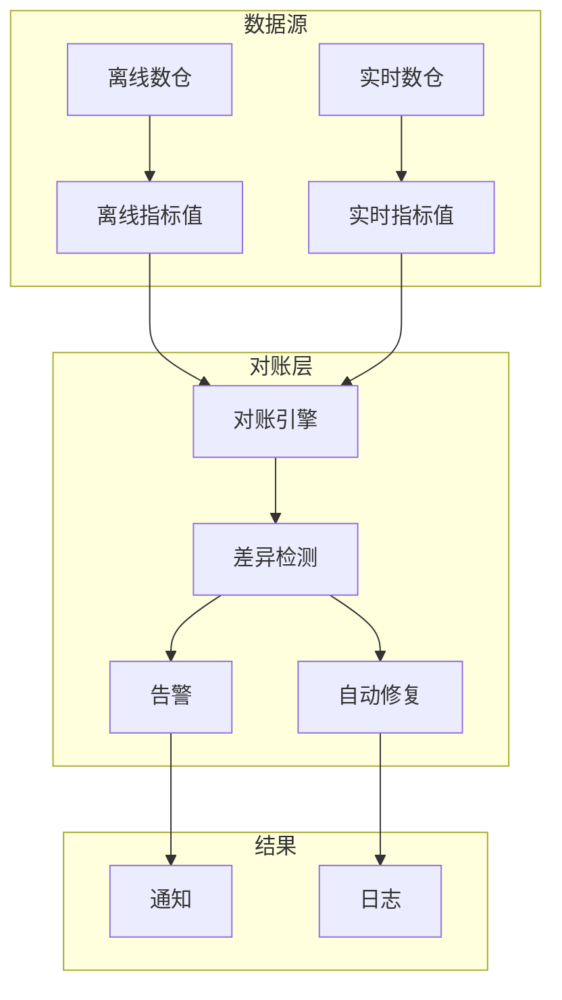

### 对账规则配置

| 对账维度 | 对账频率 | 差异阈值 | 处理方式 |
|----------|----------|----------|----------|
| 核心指标(GMV/UV) | 每5分钟 | < 1% | 自动修复 |
| 重要指标(转化率) | 每15分钟 | < 5% | 人工确认 |
| 一般指标(页面PV) | 每小时 | < 10% | 记录日志 |

### 对账SQL示例

```sql
-- 离线vs实时对账
SELECT 
    a.date,
    a.gmv AS offline_gmv,
    b.gmv AS realtime_gmv,
    ABS(a.gmv - b.gmv) / a.gmv * 100 AS diff_pct
FROM offline_metrics a
JOIN realtime_metrics b ON a.date = b.date
WHERE ABS(a.gmv - b.gmv) / a.gmv * 100 > 1;
```

## 元数据管理平台

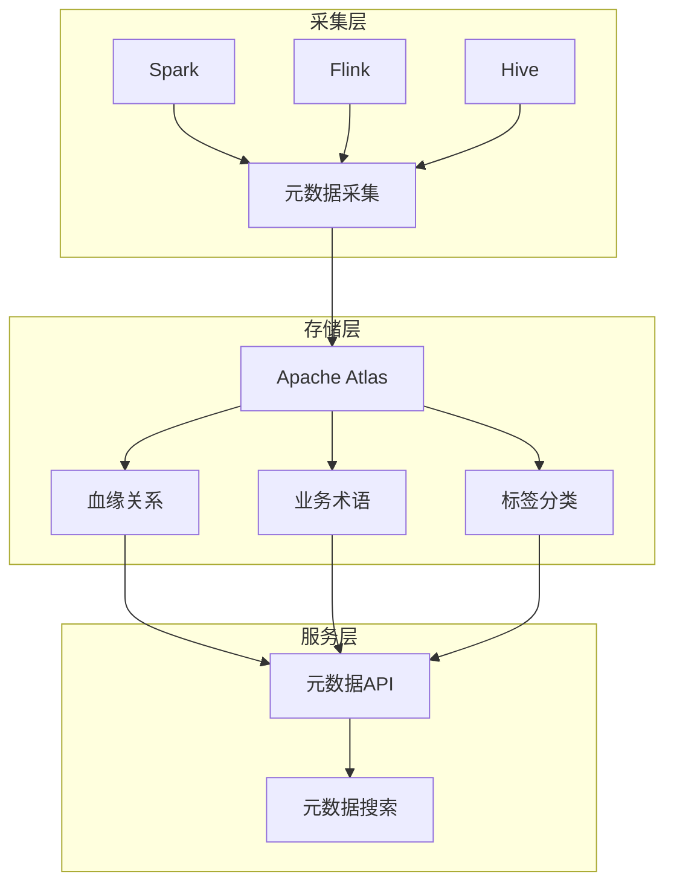

### 元数据管理核心能力

| 能力 | 说明 | 实现方式 |
|------|------|----------|
| 血缘追踪 | 数据从哪来到哪去 | Atlas Hook |
| 影响分析 | 字段变更影响范围 | 图计算 |
| 业务术语 | 统一业务口径 | 术语表 |
| 数据分类 | 敏感数据识别 | 自动分类 |
| 元数据搜索 | 快速定位数据 | Elasticsearch |

## 数据 API 设计规范

```yaml
# OpenAPI 3.0 规范
paths:
  /api/v1/metrics/{metric_name}:
    get:
      summary: 查询指标数据
      parameters:
        - name: metric_name
          in: path
          required: true
          schema:
            type: string
        - name: start_date
          in: query
          required: true
          schema:
            type: string
            format: date
        - name: end_date
          in: query
          required: true
          schema:
            type: string
            format: date
      responses:
        '200':
          description: 成功
          content:
            application/json:
              schema:
                type: object
                properties:
                  metric_name:
                    type: string
                  data:
                    type: array
                    items:
                      type: object
```

### API 设计原则

| 原则 | 说明 | 实现方式 |
|------|------|----------|
| 无状态 | 不存储会话状态 | Token认证 |
| 幂等 | 重复调用结果一致 | 请求ID去重 |
| 限流 | 防止过载 | 令牌桶/滑动窗口 |
| 版本化 | 向后兼容 | URL版本号(v1/v2) |
| 脱敏 | 敏感数据保护 | 字段级脱敏 |

## A/B 测试平台设计

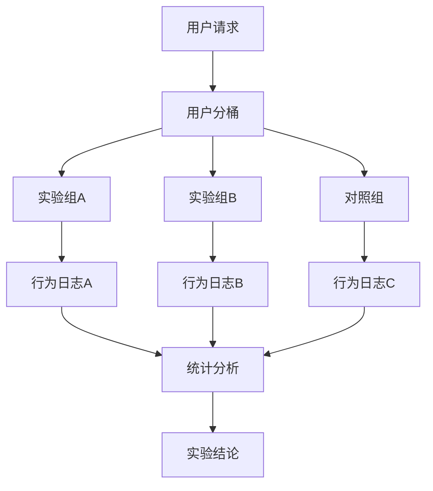

### A/B 测试核心指标

| 指标类型 | 指标示例 | 计算方式 |
|----------|----------|----------|
| 业务指标 | 转化率、GMV | 成功数/总数 |
| 技术指标 | 延迟、错误率 | 监控数据 |
| 用户体验 | 停留时长、跳出率 | 行为日志 |

### 分桶算法

```python
import hashlib

def get_bucket(user_id, experiment_id, bucket_count=100):
    """用户分桶算法"""
    key = f"{user_id}_{experiment_id}"
    hash_val = int(hashlib.md5(key.encode()).hexdigest(), 16)
    return hash_val % bucket_count

# 实验配置
def get_experiment_group(user_id, experiment_id):
    bucket = get_bucket(user_id, experiment_id)
    if bucket < 30:
        return "control"  # 30%对照组
    elif bucket < 60:
        return "group_a"  # 30%实验组A
    else:
        return "group_b"  # 40%实验组B
```

## 异常检测机制

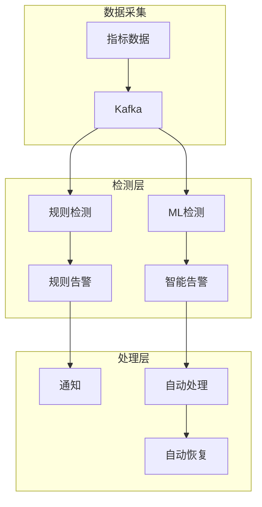

### 异常检测算法

| 算法 | 适用场景 | 优势 | 劣势 |
|------|----------|------|------|
| 3-sigma | 正态分布数据 | 简单快速 | 对异常值敏感 |
| 移动平均 | 趋势数据 | 平滑噪声 | 滞后性 |
| 季节性分解 | 周期性数据 | 捕捉周期 | 复杂度高 |
| 孤立森林 | 多维数据 | 无需标注 | 训练成本高 |
| LSTM | 时序数据 | 捕捉长期依赖 | 需要大量数据 |

### 告警规则配置示例

```yaml
# 告警规则配置
alerts:
  - name: GMV下降告警
    metric: gmv_rate
    condition: drop > 20%
    duration: 5m
    severity: critical
    notify: [sms, email, phone]
    
  - name: 延迟升高告警
    metric: api_latency_p99
    condition: > 1000ms
    duration: 3m
    severity: warning
    notify: [email, slack]
```

## 十五、指标一致性保障与口径管理

### 指标一致性校验机制

```
指标一致性保障：
  1. 口径唯一性
    - 每个指标有且只有一个官方定义（原子指标）
    - 派生指标 = 原子指标 + 统计周期 + 统计粒度 + 业务限定
    - 指标字典：记录每个指标的完整定义

  2. 数据源一致性
    - 同一指标在不同报表使用同一数据源
    - 指标血缘：追踪指标从原始数据到最终报表的链路
    - 对账机制：定期校验不同报表的同一指标

  3. 计算一致性
    - 统一 SQL 模板：避免不同团队重复造轮子
    - SQL 版本管理：所有指标 SQL 纳入 Git 管理
    - 自动化测试：指标 SQL 单元测试
```

### 元数据管理平台设计

| 功能模块 | 核心能力 | 技术实现 |
|----------|----------|----------|
| 技术元数据 | 表/字段/类型/分区 | Hive Metastore/Atlas |
| 业务元数据 | 指标定义/口径/负责人 | 自研元数据平台 |
| 血缘追踪 | 数据流向/依赖关系 | Atlas/DataHub |
| 质量监控 | 完整性/准确性/时效性 | 自研 + Grafana |
| 搜索发现 | 全文搜索/标签分类 | Elasticsearch |

### 数据 API 设计规范

| 规范 | 要求 | 示例 |
|------|------|------|
| 命名 | RESTful 风格 | GET /api/v1/metrics/{id} |
| 版本 | URL 路径版本 | /api/v1/, /api/v2/ |
| 分页 | 统一分页参数 | ?page=1&size=20 |
| 筛选 | 统一筛选参数 | ?filter=status:active |
| 排序 | 统一排序参数 | ?sort=create_time:desc |
| 错误码 | 统一错误格式 | {"code":400,"msg":"参数错误"} |

```json
// 数据 API 响应标准格式
{
  "code": 200,
  "msg": "success",
  "data": {
    "list": [...],
    "total": 100,
    "page": 1,
    "size": 20
  },
  "timestamp": 1704067200000
}
```

### A/B 测试平台核心设计

```
A/B 测试平台架构：
  流量分桶 → 用户分组 → 指标计算 → 统计检验

  流量分桶：
    - 用户 ID Hash → 分桶（均匀分布）
    - 支持多层流量隔离
    - 支持多实验并行

  指标计算：
    - 指标口径复用（指标管理平台）
    - 实验组 vs 对照组指标对比
    - 多维度下钻分析

  统计检验：
    - 均值检验：t-test / z-test
    - 比率检验：卡方检验
    - 置信区间：95% / 99%
    - 样本量计算：最小可检测效应
```

### 异常检测机制

| 检测方法 | 适用场景 | 优势 | 劣势 |
|----------|----------|------|------|
| 3-Sigma | 正态分布数据 | 简单直观 | 对异常值敏感 |
| IQR | 非正态数据 | 鲁棒性好 | 对多峰分布效果差 |
| 季节性分解 | 周期性数据 | 捕捉周期模式 | 对突变不敏感 |
| 隔离森林 | 高维数据 | 无监督 | 需调参 |
| LOF | 密度不均数据 | 发现局部异常 | 计算开销大 |

```python
# 指标异常检测示例（3-Sigma）
def detect_anomaly(values, threshold=3):
    mean = np.mean(values)
    std = np.std(values)
    anomalies = [v for v in values if abs(v - mean) > threshold * std]
    return anomalies

# 季节性分解
from statsmodels.tsa.seasonal import seasonal_decompose
result = seasonal_decompose(values, model='additive', period=7)
anomalies = np.where(np.abs(result.resid) > 3 * np.std(result.resid))[0]
```

## 十六、指标一致性保障体系

### 指标口径对齐矩阵

| 指标层级 | 定义位置 | 对齐方式 | 消费者 |
|----------|---------|---------|--------|
| 原子指标 | 指标平台 | SQL模板 | 数据开发 |
| 派生指标 | 指标平台 | 继承+修饰 | 分析师 |
| 复合指标 | 指标平台 | 公式引用 | 业务方 |
| 报表指标 | BI工具 | 口径绑定 | 决策层 |

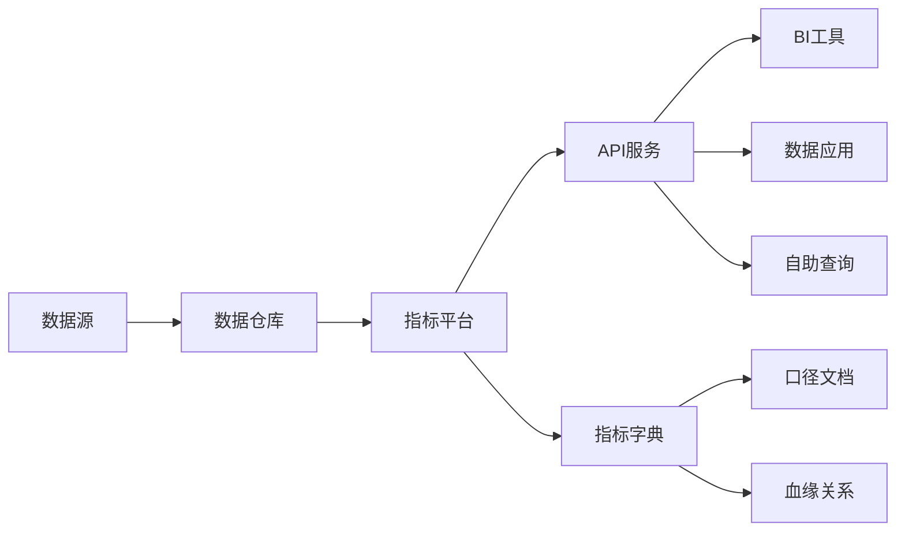

### 元数据管理框架

| 元数据类型 | 内容 | 管理工具 | 消费场景 |
|-----------|------|---------|---------|
| 技术元数据 | 表结构/字段类型 | DataHub/Atlas | 数据发现 |
| 业务元数据 | 指标口径/业务规则 | 指标平台 | 口径对齐 |
| 操作元数据 | 运行日志/调度记录 | Airflow/日志 | 运维监控 |
| 质量元数据 | 质量规则/检测结果 | GreatExpectations | 质量保障 |

```python
# 指标元数据注册示例
class MetricRegistry:
    def register(self, name, definition, formula, owner, sla):
        return {
            "name": name,
            "definition": definition,
            "formula": formula,
            "owner": owner,
            "sla": sla,
            "version": "1.0",
            "created_at": datetime.now()
        }

# 注册示例
registry.register(
    name="DAU",
    definition="当日独立用户数",
    formula="COUNT(DISTINCT user_id) WHERE event_date = CURRENT_DATE",
    owner="data-team",
    sla="T+1 10:00"
)
```

## 十七、指标 API 设计规范

### API 设计模式

| 模式 | 路径示例 | 说明 | 适用场景 |
|------|---------|------|---------|
| RESTful | /metrics/{name} | 标准REST | 通用 |
| GraphQL | /graphql | 灵活查询 | 复杂聚合 |
| SQL接口 | /query | 直接SQL | 高级用户 |
| SDK | 代码调用 | 类型安全 | 应用集成 |

```json
// 指标API响应规范
{
  "metric": {
    "name": "DAU",
    "definition": "当日独立用户数",
    "owner": "data-team"
  },
  "data": {
    "dimensions": {"platform": "iOS", "region": "CN"},
    "measures": {"value": 1234567},
    "time_range": {
      "start": "2026-01-01",
      "end": "2026-01-15"
    }
  },
  "metadata": {
    "query_time_ms": 45,
    "cache_hit": true,
    "freshness": "2026-01-15T10:00:00Z"
  }
}
```

### A/B 测试与指标关联

| 实验阶段 | 指标关联 | 分析维度 | 决策依据 |
|----------|---------|---------|---------|
| 假设验证 | 核心指标 | 实验组/对照组 | 统计显著性 |
| 效果评估 | 业务指标 | 多维度下钻 | ROI分析 |
| 长期跟踪 | 滞后指标 | 用户生命周期 | LTV变化 |

```python
# A/B测试指标分析
def analyze_experiment(control_group, treatment_group):
    # 计算提升度
    lift = (treatment_group.mean - control_group.mean) / control_group.mean
    
    # 统计检验
    t_stat, p_value = stats.ttest_ind(
        treatment_group.values, 
        control_group.values
    )
    
    # 置信区间
    ci_lower, ci_upper = stats.t.interval(
        0.95, 
        len(treatment_group)-1,
        loc=treatment_group.mean(),
        scale=stats.sem(treatment_group)
    )
    
    return {
        "lift": lift,
        "p_value": p_value,
        "significant": p_value < 0.05,
        "ci_95": (ci_lower, ci_upper)
    }
```

## 十八、异常检测与指标监控

### 异常检测算法对比

| 算法 | 原理 | 优点 | 缺点 | 适用场景 |
|------|------|------|------|---------|
| 3-Sigma | 均值±3倍标准差 | 简单 | 对异常值敏感 | 正态分布 |
| IQR | 四分位距 | 鲁棒 | 多峰效果差 | 偏态数据 |
| STL分解 | 季节+趋势+残差 | 捕捉周期 | 突变不敏感 | 周期数据 |
| Isolation Forest | 隔离异常点 | 无监督 | 需调参 | 高维数据 |
| LSTM | 时序预测 | 自动学习 | 计算开销大 | 复杂模式 |

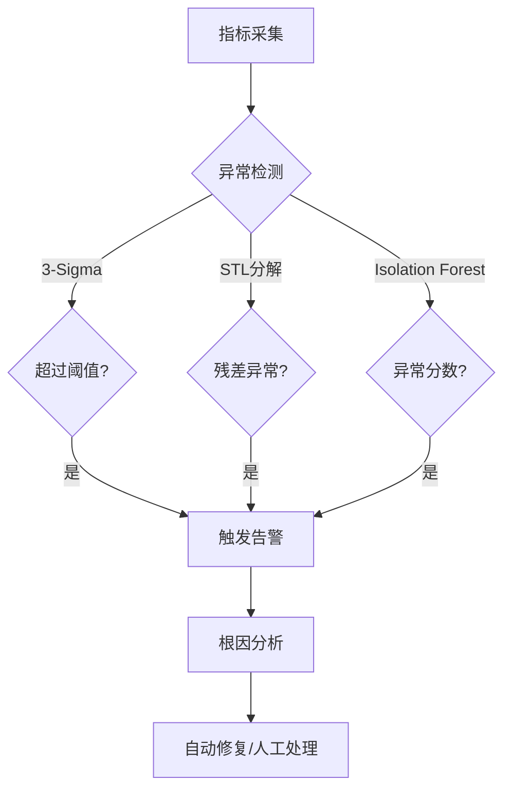

---

## 二十、指标一致性保障体系深入

### 20.1 指标口径对齐矩阵

```
指标口径对齐矩阵：
  维度：指标名称、计算逻辑、数据来源、更新频率、Owner
  
  示例：
    指标名称：GMV（成交总额）
    计算逻辑：SUM(订单金额) WHERE 状态='已支付'
    数据来源：trade.orders 表
    更新频率：T+1
    Owner：业务方-张三，数据方-李四
    
    口径变更流程：
      ① 业务方提出变更申请
      ② 数据方评估影响范围
      ③ 影响分析（血缘回溯）
      ④ 变更评审（业务+数据+技术）
      ⑤ 实施变更（新旧口径并行）
      ⑥ 验证差异（差异归零后切流）
```

### 20.2 指标校验规则

| 校验类型 | 规则 | 处理方式 |
|----------|------|---------|
| 范围校验 | 值在合理范围内 | 告警+人工确认 |
| 趋势校验 | 同比/环比波动<20% | 自动分析+告警 |
| 一致性校验 | 多口径差异<1% | 自动切流 |
| 完整性校验 | 数据缺失率<1% | 补数+告警 |
| 时效性校验 | 延迟<阈值 | 告警+优化 |

---

## 二十一、元数据管理框架深入

### 21.1 元数据分类

| 元数据类型 | 内容 | 用途 |
|------------|------|------|
| 技术元数据 | 表结构、字段类型、分区 | 开发参考 |
| 业务元数据 | 指标口径、业务定义 | 业务理解 |
| 操作元数据 | ETL 任务、调度信息 | 运维监控 |
| 质量元数据 | 质量规则、监控结果 | 质量保障 |
| 安全元数据 | 权限、脱敏规则 | 安全合规 |

### 21.2 元数据管理平台架构

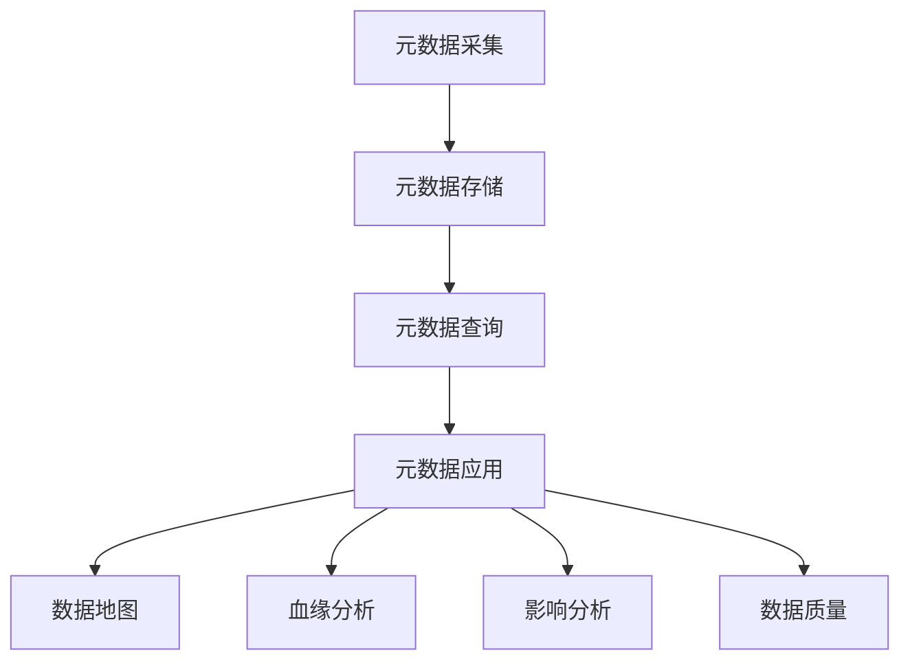

---

## 二十二、数据 API 设计规范深入

### 22.1 API 设计模式

```
数据 API 设计模式：
  ① RESTful API：标准 HTTP 方法
    GET /api/v1/metrics/gmv?start=2024-01-01&end=2024-01-31
    POST /api/v1/query
    {
      "sql": "SELECT SUM(amount) FROM orders WHERE date >= '2024-01-01'",
      "format": "json"
    }

  ② GraphQL API：灵活查询
    query {
      metrics(name: "gmv", startDate: "2024-01-01") {
        value
        trend
        comparison
      }
    }

  ③ gRPC API：高性能
    rpc GetMetric (MetricRequest) returns (MetricResponse);
```

### 22.2 API 安全设计

| 安全措施 | 说明 | 实现方式 |
|----------|------|---------|
| 认证 | 验证用户身份 | JWT/OAuth2 |
| 授权 | 控制访问权限 | RBAC/ABAC |
| 限流 | 防止滥用 | 令牌桶/滑动窗口 |
| 脱敏 | 保护敏感数据 | 字段级脱敏 |
| 审计 | 记录访问日志 | 日志+监控 |

---

## 二十三、A/B 测试平台核心设计深入

### 23.1 A/B 测试流程

```
A/B 测试流程：
  ① 实验设计：确定假设、指标、样本量
  ② 流量分配：随机分组（实验组/对照组）
  ③ 数据采集：埋点+日志
  ④ 统计分析：假设检验+置信区间
  ⑤ 决策：显著性判断+上线决策

  关键指标：
    主要指标：转化率、点击率
    次要指标：停留时间、跳出率
    护栏指标：错误率、性能指标
```

### 23.2 分桶算法

| 算法 | 原理 | 优点 | 缺点 |
|------|------|------|------|
| 哈希分桶 | 用户ID哈希取模 | 简单、均匀 | 新用户分组不均 |
| 一致性哈希 | 哈希环 | 扩缩容影响小 | 实现复杂 |
| 随机分组 | 随机数 | 完全随机 | 不可复现 |

---

## 二十四、异常检测与指标监控深入

### 24.1 异常检测算法对比

| 算法 | 原理 | 适用 | 优点 | 缺点 |
|------|------|------|------|------|
| 3σ 原则 | 均值±3倍标准差 | 正态分布 | 简单 | 对非正态无效 |
| IQR | 四分位距 | 任何分布 | 稳健 | 可能漏检 |
| 季节性分解 | 趋势+季节+残差 | 周期性数据 | 可解释 | 需要历史数据 |
| 孤立森林 | 随机森林 | 高维数据 | 无需标注 | 训练开销大 |
| LSTM | 深度学习 | 时序数据 | 精度高 | 需要大量数据 |

### 24.2 告警规则配置示例

```yaml
# 告警规则配置
alerts:
  - name: gmv_drop
    condition: gmv < 0.8 * avg_gmv_7d
    duration: 5m
    severity: critical
    action: notify_owner
    
  - name: latency_high
    condition: p99_latency > 1000ms
    duration: 10m
    severity: warning
    action: auto_scale
    
  - name: error_rate_high
    condition: error_rate > 0.01
    duration: 5m
    severity: critical
    action: rollback
```

---

## 二十五、指标服务 SLA 保障

### 25.1 SLA 指标定义

| SLA 指标 | 目标 | 计算方式 |
|----------|------|---------|
| 可用性 | 99.9% | 正常服务时间/总时间 |
| 延迟 P99 | <500ms | 99% 请求延迟 |
| 准确性 | 99.99% | 正确响应/总响应 |
| 时效性 | T+1 | 数据更新延迟 |

### 25.2 SLA 保障措施

```
SLA 保障措施：
  ① 冗余部署：多副本+多可用区
  ② 限流降级：防止过载
  ③ 缓存策略：热点数据缓存
  ④ 监控告警：实时监控+自动告警
  ⑤ 故障演练：定期演练+恢复
  ⑥ 应急预案：故障处理流程

  故障处理流程：
    ① 发现：监控告警
    ② 定位：日志分析+链路追踪
    ③ 恢复：降级/切换/重启
    ④ 复盘：根因分析+改进措施
```

## 十九、与其他板块的关系

- 场景设计/数据中台见「[14-大数据场景设计实战](14-大数据场景设计实战.md)」；
- 治理见「[12-数据治理与数据质量](12-数据治理与数据质量.md)」；
- OLAP 引擎见「[09-数据仓库与OLAP引擎](09-数据仓库与OLAP引擎.md)」；
- 数据湖格式见「[05-列式存储与数据湖格式](05-列式存储与数据湖格式.md)」；
- 安全权限见「[15-数据安全与隐私合规](15-数据安全与隐私合规.md)」；
- 技术选型见「[技术选型/04 主流技术域选型对比](../../技术选型/04-主流技术域选型对比.md)」。

> 一句话：**数据服务化 = 产品化（L1-L4）+ 指标管理（原子/派生/复合，口径唯一+字典+血缘）+ 数据 API（无状态/幂等/限流/脱敏）+ 语义层（屏蔽物理表、统一口径、防幻觉）+ 数据目录（可发现）+ 自助分析（分层民主化）——核心是"口径唯一 + 服务化"两条线，让业务自助、让数据可信、让团队从取数走向产品**。