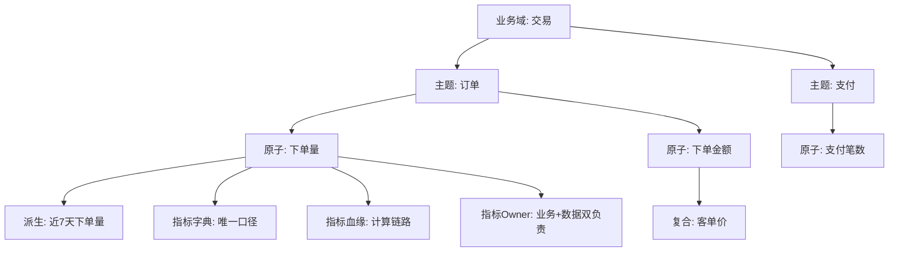
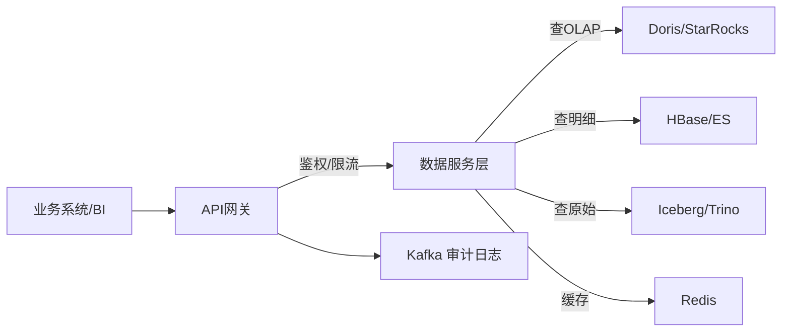
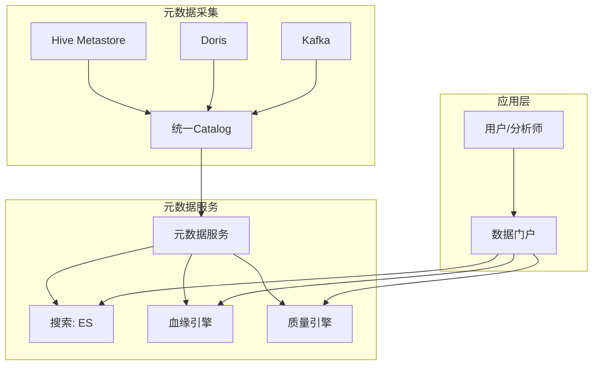
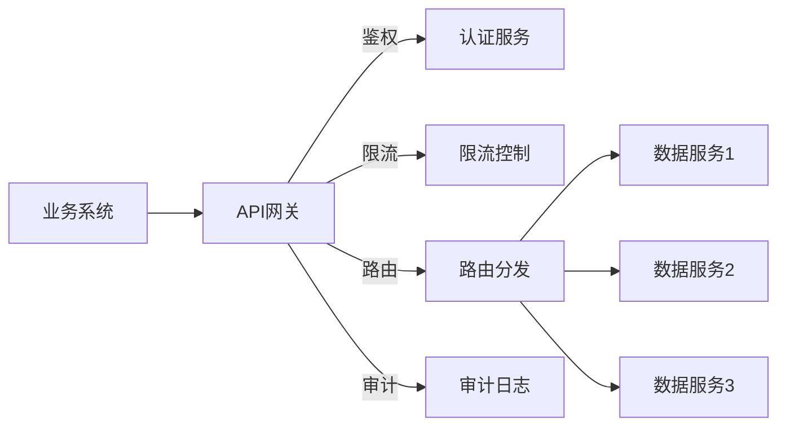

# 大数据 · 17 数据服务化与指标管理（数据产品化 / 指标体系 / 指标口径 / 数据API / 语义层 / 数据民主化 / 数据目录）

> 数据中台的最终价值不在"建了多少张表"，而在"业务能多快拿到可信的数据"。本文深入拆解**数据产品化层次、指标体系设计与口径管理、数据 API 设计、语义层、数据目录、自助分析与数据民主化**，并给出落地框架。

---

## 一、要解决的问题

| 痛点 | 说明 |
|------|------|
| 产能不足 | 数据团队排期长，业务需求爆炸 |
| 口径混乱 | 同一个"GMV"三个团队三个数——信任危机 |
| 取数困难 | 每次取数写 SQL，重复开发、响应慢 |
| 资产黑洞 | 表建了一堆，业务找不到、用不上 |
| 服务脆弱 | 数据 API 无 SLA、无限流、易被打垮 |

> 核心认知：**数据服务化 = 把表/指标/API 变成「可发现、可理解、可信赖、可复用」的数据产品**——关键抓手是「口径唯一（指标管理）」和「服务化（API/语义层）」两条线。

---

## 二、数据产品化

### 2.1 产品层次

| 层次 | 产品形态 | 用户 | 例子 |
|------|----------|------|------|
| L1 原始数据 | 湖/仓基础表 | 数据开发 | ODS/DWD 明细表 |
| L2 数据资产 | 主题宽表/指标 | 分析师/BI | DWS 汇总、ADS 应用表 |
| L3 数据服务 | API/报表/推送 | 业务系统/运营 | 数据接口、BI 报表、消息推送 |
| L4 数据应用 | 产品化应用 | 终端用户 | 数据看板、推荐、风控系统 |

### 2.2 产品设计原则

```
以用户为中心：从业务场景出发，不是从表出发
口径唯一：同一指标只在一处定义，多处引用
自助优先：80% 需求自助完成，20% 才找数据团队
可发现：有目录、有文档、有血缘
可信赖：有质量监控、有 SLA、有 Owner
可复用：一次建设，多处复用
```

### 2.3 数据资产化闭环

```
找数（扫描库表）→ 认数（Owner/口径/分级）→ 理数（血缘/依赖）
→ 用数（目录检索/订阅/API）→ 评数（热度/质量/价值）
```

---

## 三、指标体系与口径管理（核心）

### 3.1 指标分类

| 类型 | 定义 | 例子 | 管理要求 |
|------|------|------|----------|
| 原子指标 | 不可再分的最小度量 | 订单金额、支付笔数 | 口径文档+唯一计算逻辑 |
| 派生指标 | 原子+修饰词+时间 | 近 7 天新用户 GMV | 由原子指标自动生成 |
| 复合指标 | 多指标运算 | 客单价=GMV/订单数 | 由原子/派生组合 |

```
命名规范：[业务域]_[主题]_[原子指标]_[修饰词]_[时间周期]
  如 trade_order_gmv_newuser_7d
```

### 3.2 指标体系设计



### 3.3 口径一致性保障

| 手段 | 做法 |
|------|------|
| 唯一计算逻辑 | 同一指标只在一个 DWS 层计算，ADS 只读不重算 |
| 指标字典 | 名称/口径/维度/更新频率/Owner 统一文档 |
| 指标血缘 | 从 ADS 回溯到 ODS 的完整链路 |
| 口径校验 | 新旧口径并行跑，差异归零后切流 |
| Owner 制 | 业务 Owner 定口径 + 数据 Owner 保质量 |

```
典型问题：业务 A 的 GMV 含退款，业务 B 的不含
  → 指标字典明确标注口径，禁止"同名不同义"
  → 口径变更走评审 + 影响分析（血缘）
```

### 3.4 指标平台能力

```
指标平台（如 Kyligence/自建/AthenaX）：
  指标注册（原子/派生/复合）
  指标编排（组合复用）
  指标查询（自动生成 SQL 下推引擎）
  指标监控（口径波动/异常告警）
```

---

## 四、数据 API 设计

### 4.1 API 类型

| 类型 | 接口形态 | 适用 | 例子 |
|------|----------|------|------|
| 明细查询 | GET /data/detail | 少量数据 | 查单用户近 30 天订单 |
| 聚合查询 | POST /data/aggregate | 报表/看板 | 近 7 天各城市 GMV |
| 人群圈选 | POST /data/crowd | 营销/推荐 | 导出高价值用户 |
| 数据推送 | Webhook/MQ | 下游订阅 | 订单状态变更通知 |
| 文件导出 | POST /data/export | 大批量 | 导出全量用户标签 |

### 4.2 API 设计原则

```
无状态：不依赖会话，每次独立鉴权
幂等：重复调用结果一致（防重复扣减/推送）
分页：大结果集 cursor 分页（优于 offset）
限流：按 AppKey/用户限流，防雪崩
脱敏：按用户权限自动脱敏
版本化：/v1/、/v2/ 兼容升级
缓存：热点结果 Redis 缓存（TTL 5min~1h）
```

### 4.3 数据服务架构



```
API 网关：统一鉴权、限流、路由、审计
数据服务层：封装查询逻辑，屏蔽底层存储差异
稳定性：熔断降级（缓存/排队）、SLA 监控、容量规划
```

---

## 五、语义层

### 5.1 语义层的作用

```
语义层 = 把物理表映射为业务可理解的"指标/维度"

作用：
  ① 屏蔽物理存储差异（不关心底层表结构）
  ② 统一口径（指标只定义一次）
  ③ 支撑自助分析（SQL/拖拽/自然语言都走语义层）
  ④ 权限控制（按指标/维度控制可见性）
```

### 5.2 语义层架构

```
物理表（DWD/DWS） → 逻辑模型（业务对象） → 指标/维度定义
  ↓
自助工具：SQL / 拖拽 BI / Text-to-SQL
  ↓
统一治理：口径/权限/血缘
```

### 5.3 Text-to-SQL 防幻觉

```
语义层约束：只能查询已定义的指标/维度
SQL 校验：语法+权限+成本（扫描量）校验
结果校验：行数/聚合值合理性检查
引用溯源：回答附数据来源
```

---

## 六、数据目录 / 数据地图

### 6.1 目录能力

| 能力 | 说明 |
|------|------|
| 资产搜索 | 按关键词/标签搜表/字段/指标 |
| 数据画像 | 表规模、更新频率、质量评分、热度 |
| 血缘追溯 | 上下游依赖、影响分析 |
| 标签体系 | 业务标签、安全分级、质量标签 |
| 数据预览 | 样本预览（脱敏后） |
| 申请审批 | 数据权限在线申请+审批流 |

### 6.2 目录架构



---

## 七、数据民主化与自助分析

### 7.1 自助层次

| 层次 | 用户 | 工具 | 数据团队介入 |
|------|------|------|-------------|
| L1 固定报表 | 运营/管理 | BI 报表（Grafana/Superset） | 开发报表 |
| L2 自助查询 | 分析师 | SQL（Hue/DBeaver） | 建表/优化 |
| L3 拖拽分析 | 业务 | 拖拽 BI（Tableau/PowerBI） | 建数据模型 |
| L4 智能分析 | 全员 | 自然语言（Text-to-SQL） | 维护语义层 |

```
民主化前提：语义层 + 治理保口径 + 权限受控
否则"自助"变成"各算各的、口径更乱"
```

### 7.2 组织与运营

```
数据团队转型：
  从"取数工具人"→"数据产品经理"（建资产、管口径、造工具）
运营机制：
  数据资产发布会/周报
  需求与反馈闭环（数据产品迭代）
  SLA 承诺与考核（响应时效、可用性）
```

---

## 八、Checklist

- [ ] 数据产品分层规划（L1-L4）与 Owner 明确。
- [ ] 指标体系：原子/派生/复合 + 指标字典 + 血缘。
- [ ] 口径唯一：单点计算 + 口径校验 + 变更评审。
- [ ] 数据 API：无状态/幂等/分页/限流/脱敏/版本化。
- [ ] 语义层落地：指标/维度定义 + 权限控制。
- [ ] 数据目录：搜索/画像/血缘/质量/申请审批。
- [ ] 自助分析分层 + Text-to-SQL 防幻觉。
- [ ] SLA 监控 + 熔断降级 + 审计。

---

## 数据API网关架构

### 网关核心能力



| 能力 | 说明 | 实现 |
|------|------|------|
| 认证 | AppKey/Token/OAuth2 | 网关层统一鉴权 |
| 限流 | QPS/并发控制 | 令牌桶/滑动窗口 |
| 路由 | 按版本/场景分发 | 策略路由 |
| 熔断 | 服务降级保护 | Sentinel/Hystrix |
| 审计 | 调用日志记录 | Kafka→ES |
| 监控 | 延迟/成功率/错误率 | Prometheus+Grafana |

### API版本化策略

```
版本策略：
  URL版本：/v1/data、/v2/data
  Header版本：Accept-Version: v1
  参数版本：?version=1

兼容性保证：
  新版本发布后旧版本保留3~6个月
  废弃版本提前30天通知
  文档同步更新（Swagger/OpenAPI）
```

## 语义层（Semantic Layer）

### 语义层架构

```
物理层：DWD/DWS/ADS表
  ↓
逻辑层：业务对象（Order、Customer、Product）
  ↓
语义层：指标/维度定义（GMV=SUM(amount)）
  ↓
应用层：SQL/BI/Text-to-SQL/自然语言

语义层作用：
  ① 屏蔽物理表差异（不关心底层表结构）
  ② 统一口径（指标只定义一次）
  ③ 支撑自助分析（SQL/拖拽/自然语言）
  ④ 权限控制（按指标/维度控制可见性）
```

### Metrics Store vs 数据仓库

| 维度 | 数据仓库 | Metrics Store |
|------|---------|--------------|
| 定义 | 物理表+ETL | 指标+维度逻辑定义 |
| 存储 | 实际数据 | 指标元数据+缓存 |
| 查询 | SQL直查 | 通过语义层查询 |
| 口径 | 分散在SQL中 | 统一定义管理 |
| 适用 | 数据开发 | 业务分析师 |

```
Metrics Store功能：
  指标注册：名称/口径/维度/Owner
  指标查询：自动生成SQL下推引擎
  指标监控：口径波动/异常告警
  指标血缘：从ADS回溯到ODS

工具：
  dbt Metrics：dbt内建指标层
  Cube.js：开源语义层
  Transform：商业Metrics Store
  自建：指标平台+语义层
```

## 指标定义与计算

### 指标分类体系

| 类型 | 定义 | 示例 | 计算 |
|------|------|------|------|
| 原子指标 | 不可再分的最小度量 | 订单金额、支付笔数 | SUM/COUNT |
| 派生指标 | 原子+修饰词+时间 | 近7天新用户GMV | 原子+筛选 |
| 复合指标 | 多指标运算 | 客单价=GMV/订单数 | 比值计算 |

```
命名规范：
  [业务域]_[主题]_[原子指标]_[修饰词]_[时间周期]
  如：trade_order_gmv_newuser_7d

维度标准化：
  时间：dt（日期）、hour（小时）
  地域：city、province、country
  渠道：app、web、offline
  设备：ios、android、pc
```

### 指标口径一致性

```
口径问题：
  业务A的GMV含退款，业务B的GMV不含退款
  → 同名不同义，决策混乱

解决方案：
  ① 指标字典：唯一口径定义（名称/公式/维度/Owner）
  ② 单点计算：同一指标只在DWS层计算一次
  ③ 口径校验：新旧口径并行跑，差异归零后切流
  ④ 变更评审：口径变更走评审+影响分析
  ⑤ Owner制：业务Owner定口径+数据Owner保质量
```

## 数据产品设计模式

### 产品层次

| 层次 | 产品形态 | 用户 | 例子 |
|------|----------|------|------|
| L1 | 原始数据表 | 数据开发 | ODS/DWD明细表 |
| L2 | 主题宽表/指标 | 分析师/BI | DWS汇总、ADS应用表 |
| L3 | 数据服务/API | 业务系统 | 数据接口、推送 |
| L4 | 数据应用 | 终端用户 | 看板、推荐、风控 |

### 设计原则

```
以用户为中心：从业务场景出发，不是从表出发
口径唯一：同一指标只在一处定义
自助优先：80%需求自助完成
可发现：有目录、有文档、有血缘
可信赖：有质量监控、有SLA、有Owner
可复用：一次建设，多处复用
```

## 自助分析与数据民主化

### 自助层次

| 层次 | 用户 | 工具 | 数据团队介入 |
|------|------|------|-------------|
| L1 固定报表 | 运营/管理 | BI报表 | 开发报表 |
| L2 自助查询 | 分析师 | SQL工具 | 建表/优化 |
| L3 拖拽分析 | 业务 | 拖拽BI | 建数据模型 |
| L4 智能分析 | 全员 | 自然语言 | 维护语义层 |

```
民主化前提：
  语义层：统一口径
  治理：保口径+权限受控
  否则"自助"变成"各算各的、口径更乱"
```

## 数据市场（Data Marketplace）

```
定位：数据资产的"应用商店"

功能：
  数据浏览：按分类/标签浏览数据产品
  数据订阅：在线申请数据权限
  数据交换：跨组织数据协作
  数据评价：使用反馈和评分
  计量计费：按调用量计费

与数据目录区别：
  数据目录：面向数据团队（技术视角）
  数据市场：面向业务用户（产品视角）
  互补：目录提供治理，市场提供交易
```

## 数据变现策略

| 策略 | 说明 | 案例 |
|------|------|------|
| 数据产品 | 封装为API/报告/标签 | 信用评分API |
| 数据服务 | 提供分析/洞察能力 | 营销洞察报告 |
| 数据合作 | 跨组织数据协作 | 联合建模 |
| 数据平台 | 提供数据处理能力 | 数据中台服务 |

```
变现路径：
  内部降本：减少重复开发、提高效率
  外部创收：数据产品/API对外销售
  生态协作：数据交换/联合建模

合规考虑：
  数据确权：明确数据所有权
  隐私保护：脱敏/匿名化处理
  合同约束：数据使用协议DPA
  审计追溯：数据使用日志
```

## 数据SLA定义

```
SLA要素：
  可用性：服务正常运行时间（99.9%）
  延迟：查询响应时间（<3s）
  吞吐：支持QPS（1000+）
  数据新鲜度：数据延迟（<5min）
  质量：数据准确率（99.9%）

SLA分级：
  P0（核心）：99.99%可用性，<1s延迟
  P1（重要）：99.9%可用性，<3s延迟
  P2（一般）：99%可用性，<10s延迟
  P3（低优）：95%可用性，<60s延迟

SLA监控：
  实时监控：Prometheus+Grafana
  告警：延迟/错误率超阈值告警
  报告：月度SLA达标率报告
```

## 数据服务版本化与治理

```
版本管理：
  API版本：/v1/、/v2/（URL或Header）
  文档版本：Swagger/OpenAPI自动同步
  变更日志：Breaking/Non-Breaking变更标注
  废弃策略：旧版本保留3~6个月

治理机制：
  审批流：API上线/变更走审批
  监控：调用链路追踪（Jaeger/SkyWalking）
  限流：按AppKey/用户限流
  降级：服务异常时降级到缓存/默认值

文档化：
  API文档：自动生成+人工补充
  数据字典：字段含义/口径/Owner
  使用示例：典型查询示例
  FAQ：常见问题汇总
```

---

## 九、与其他板块的关系

- 场景设计/数据中台见「[14-大数据场景设计实战](14-大数据场景设计实战.md)」；
- 治理见「[12-数据治理与数据质量](12-数据治理与数据质量.md)」；
- OLAP 引擎见「[09-数据仓库与OLAP引擎](09-数据仓库与OLAP引擎.md)」；
- 数据湖格式见「[05-列式存储与数据湖格式](05-列式存储与数据湖格式.md)」；
- 安全权限见「[15-数据安全与隐私合规](15-数据安全与隐私合规.md)」；
- 技术选型见「[技术选型/04 主流技术域选型对比](../../技术选型/04-主流技术域选型对比.md)」。

> 一句话：**数据服务化 = 产品化（L1-L4）+ 指标管理（原子/派生/复合，口径唯一+字典+血缘）+ 数据 API（无状态/幂等/限流/脱敏）+ 语义层（屏蔽物理表、统一口径、防幻觉）+ 数据目录（可发现）+ 自助分析（分层民主化）——核心是"口径唯一 + 服务化"两条线，让业务自助、让数据可信、让团队从取数走向产品**。