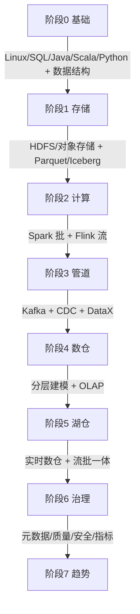
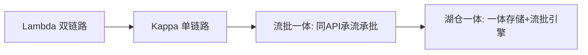
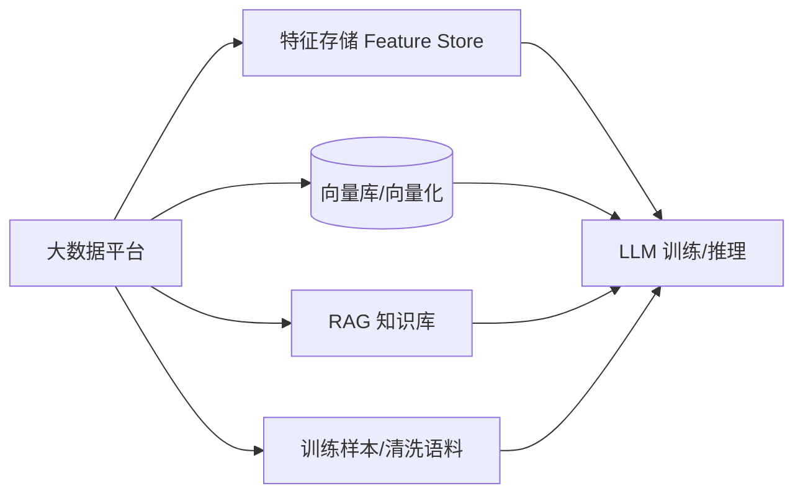

# 基础知识 · 大数据板块

> 大数据是从"海量多源数据"到"可信可消费资产"的能力工程。本板块覆盖**业务体系、技术体系、采集、存储、计算（批/流）、数仓与 OLAP、调度、实时数仓与湖仓一体、数据治理**，并附 2025–2026 新技术趋势与生态全景。

## 一、板块地图（13 篇）

| 篇 | 主题 | 关键内容 |
|----|------|---------|
| [01 概述与业务体系](01-概述与业务体系.md) | 概念与价值 | 4V、数据孤岛→资产、数据中台、六大场景、与大模型关系 |
| [02 技术体系与架构演进](02-技术体系与架构演进.md) | 全景与演进 | 技术栈地图、批 vs 流、Lambda/Kappa、流批一体、湖仓一体、存算分离 |
| [03 数据采集与同步](03-数据采集与同步.md) | 入口 | Flume、Sqoop、DataX、CDC（Canal/Debezium）、Kafka 中枢、binlog |
| [04 分布式存储与 HDFS](04-分布式存储与HDFS.md) | 存储底座 | HDFS 架构/读写/副本、对象存储、Kudu、小文件治理 |
| [05 列式存储与数据湖格式](05-列式存储与数据湖格式.md) | 表格式 | Parquet/ORC、Iceberg/Hudi/Delta/Paimon/DuckLake、COW/MOR、ACID/时间旅行 |
| [06 分布式 NoSQL 与 HBase](06-分布式NoSQL与HBase.md) | 宽表 NoSQL | LSM、Region/RegionServer、RowKey 设计、HBase vs Cassandra/Redis/Mongo/ES |
| [07 批处理计算：MapReduce 与 Spark](07-批处理计算：MapReduce与Spark.md) | 批计算 | MR 原理/shuffle、Spark RDD/DAG/内存/Tungsten、Hive 分区分桶 |
| [08 流处理计算：Flink](08-流处理计算：Flink.md) | 流计算 | 架构、时间/窗口/水印、状态后端、Checkpoint 精确一次、对比 Storm/Spark |
| [09 数据仓库与 OLAP 引擎](09-数据仓库与OLAP引擎.md) | 建模与分析 | 维度建模、ODS/DWD/DWS/ADS 分层、ClickHouse/Doris/StarRocks/Kylin/Druid |
| [10 资源调度：YARN 与 Kubernetes](10-资源调度：YARN与Kubernetes.md) | 调度 | YARN 架构/调度器、Spark/Flink on K8s、Airflow/DolphinScheduler |
| [11 实时数仓与湖仓一体](11-实时数仓与湖仓一体.md) | 实时+融合 | 实时数仓架构、湖仓一体、Paimon+Flink 流式湖仓、流批一体 |
| [12 数据治理与数据质量](12-数据治理与数据质量.md) | 治理 | DAMA/OneData、Atlas 元数据血缘、Griffin 质量、主数据、安全、指标 |
| [13 新技术趋势与生态全景](13-新技术趋势与生态全景.md) | 趋势 | 存算分离、湖仓一体、流批一体、向量化、AI/Data Agent、Serverless、生态地图 |

## 二、核心速览

- **架构终点形态**：对象存储（S3/OSS）+ 开放表格式（Iceberg/Paimon）+ 流批一体引擎（Flink/Spark）+ 多引擎查询（Trino/Doris/StarRocks）；统一 Catalog（Polaris/Nessie）。
- **批 vs 流**：批用 Spark/Hive（T+1 建模），流用 Flink（秒级风控/大屏）；新项目用流批一体消除双链路。
- **存储选型**：离线 HDFS/对象存储；实时 upsert 用 Paimon/Kudu；宽表点查用 HBase；消息缓冲用 Kafka。
- **OLAP 选型**：单表极致 ClickHouse，复杂高并发 StarRocks，轻量 Doris。
- **治理内建**：元数据（Atlas）+ 质量（Griffin）+ 安全（Ranger）+ 指标（OneData）从第一天做起。

## 三、学习路径

```
基础(Linux/SQL/Java/Scala) 
  → 存储(HDFS/对象存储 + Parquet/Iceberg) 
  → 计算(Spark 批 + Flink 流) 
  → 管道(Kafka + CDC + DataX) 
  → 数仓(分层建模 + OLAP) 
  → 湖仓(实时数仓 + 流批一体) 
  → 治理(元数据/质量/安全/指标) 
  → 趋势(云原生/Serverless/Data Agent)
```

## 四、参考来源

- Apache 项目官方文档：Hadoop/HDFS、Spark、Flink、Hive、HBase、Iceberg、Hudi、Delta、Paimon、Kafka、Atlas、Griffin、Ranger、YARN、Kylin、Druid、Pinot。
- 论文：Google GFS / MapReduce / BigTable、Databricks Lakehouse、Chandy-Lamport 快照。
- 方法/产品：阿里 OneData、DAMA-DMBOK、Databricks/Snowflake 实践、Dataphin/WeData/DataArts/Dataleap 治理平台（2025）、Onehouse 表格式三方对比（2025）、DuckLake 公告。

> 本板块与「基础知识」下的 MQ、ES体系、redis知识、mysql知识 等互为补充：MQ 讲消息队列、ES体系讲搜索、redis知识讲缓存、mysql知识讲关系库；大数据板块聚焦"海量数据的分布式采集/存储/计算/治理"全链路。

## 五、大数据学习路径路线图



- **阶段 0-2（打地基）**：先把"存储+计算"跑通——用 Spark 写 WordCount、用 Flink 算窗口聚合。
- **阶段 3-4（建管道）**：打通"采集→数仓"，能交付一张 ADS 报表。
- **阶段 5-7（上体系）**：做湖仓一体与治理，能独立设计一条生产级实时链路。

## 六、Lambda vs Kappa 深度对比

| 维度 | Lambda | Kappa |
|------|--------|-------|
| 链路数 | 2（批层+速度层） | 1（纯流） |
| 计算引擎 | 批(Spark)+流(Flink) | 仅流(Flink) |
| 存储 | HDFS+OLAP 双份 | Kafka 日志 + 一套 OLAP |
| 历史重算 | 批层直接重跑 | 重放 Kafka 长日志 |
| 代码维护 | 双份、易不一致 | 单份 |
| 准确性 | 高（全量校准） | 依赖流引擎精确一次 |
| 适用 | 离线准确+实时增量并存 | 实时为主、可重放 |

> 演进结论：新项目直接用**流批一体 / 湖仓一体**替代 Lambda 双链路，仅在"历史准确性要求极高且流引擎难实现"时保留 Lambda。

## 七、批流一体演进路线



- 关键转折：Flink 提出"**有界流即批**"，Spark Structured Streaming 用微批统一 API；存储侧用 Iceberg/Paimon 同时承接流写与批读，使"一套代码+一份存储"成为可能。

## 八、主流技术栈速查表

| 能力 | 首选 | 备选 |
|------|------|------|
| 批计算 | Spark | Hive on Tez、Flink Batch |
| 流计算 | Flink | Kafka Streams |
| 消息 | Kafka | Pulsar |
| 湖表格式 | Iceberg | Paimon（流式）、Delta、Hudi |
| OLAP | StarRocks | ClickHouse、Doris |
| 调度 | DolphinScheduler | Airflow |
| 资源 | Kubernetes | YARN（存量） |
| 治理 | Atlas+Griffin+Ranger | DataHub、OpenMetadata |

## 九、与 AI / LLM 数据基建的关系



- 大数据平台是 LLM 的**燃料厂**：清洗语料、构建特征、生成向量化数据、搭建 RAG 知识库。
- **NL2SQL / 数据问答**：用 LLM 把自然语言转 SQL，降低业务用数门槛（如 StarRocks/Chat2DB）。
- **Data Agent**：自主盘点资产、给优化建议，是治理与 AI 的结合点。
