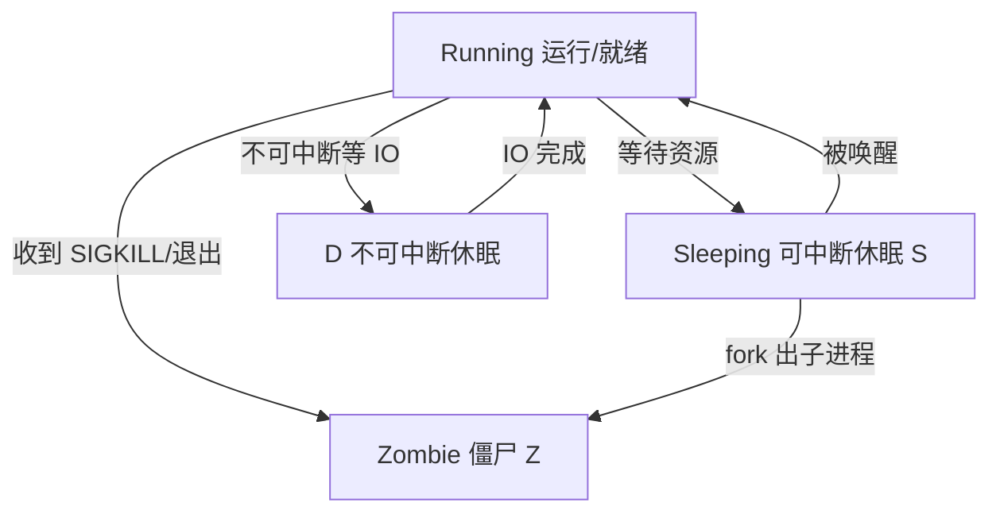
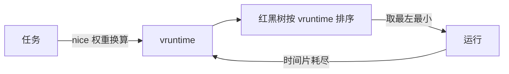
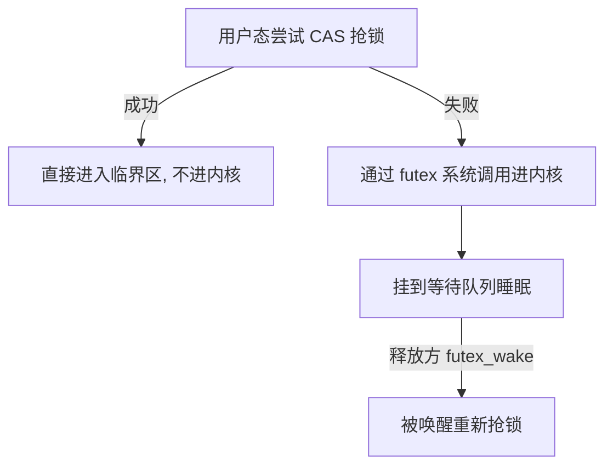
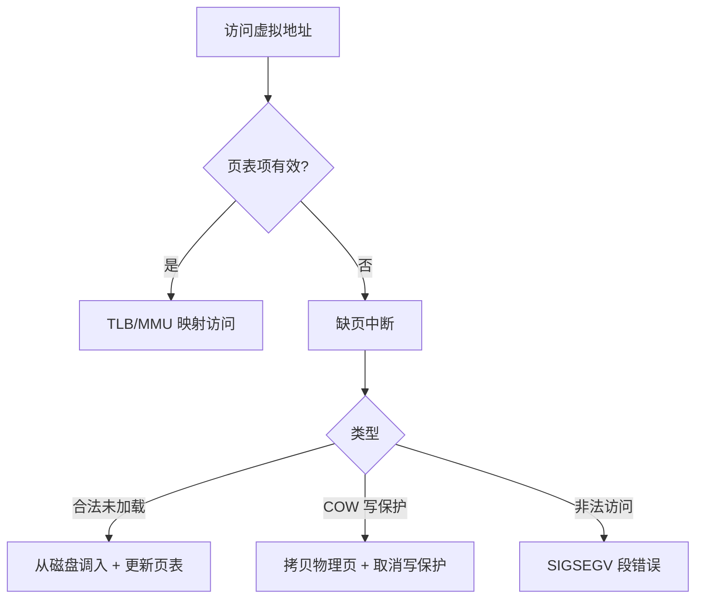
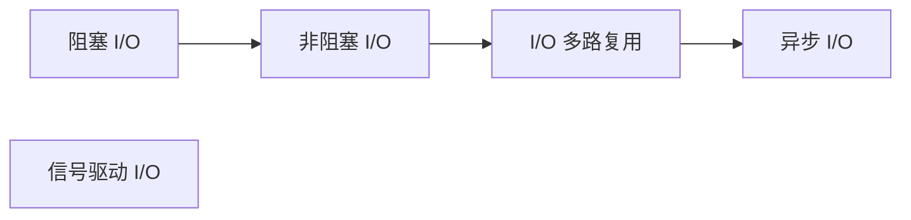
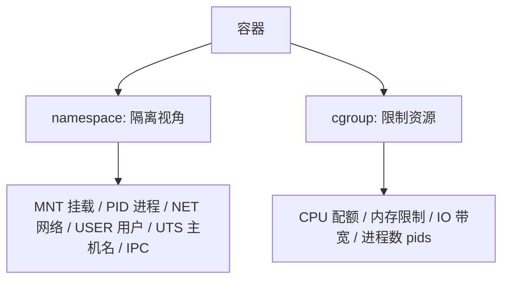

# 操作系统（深度原理）

> 操作系统是"资源的管理者 + 硬件的抽象层"：向上给应用一套干净稳定的接口（进程、文件、网络、内存），向下把 CPU、内存、磁盘、网卡的细节藏起来。本文从**后端工程师**视角深挖 OS 的六大支柱——**进程线程、CPU 调度、同步互斥、内存管理、文件系统、I/O 与网络**，并落到 Linux 真实机制与 Java 应用（线程、堆、Netty、容器）的对应关系。
>
> 与基础知识其他文档互补：底层硬件与编译链接见「[计算机原理](计算机原理.md)」、JVM 内存模型见「[Java虚拟机](Java虚拟机.md)」、Java 并发与锁见「[并发编程](并发编程.md)」、排查命令见「[Linux排查](Linux排查.md)」、网络协议见「[网络](网络.md)」。本文聚焦**内核机制与工程落地**。

---

## 一、操作系统是干什么的

### 1.1 三个本质职责

| 职责 | 含义 | 典型机制 |
|------|------|----------|
| **资源抽象** | 把杂乱硬件伪装成统一接口 | 文件（抽象磁盘）、进程（抽象 CPU/内存）、socket（抽象网卡） |
| **资源多路复用** | 一份硬件服务多个程序 | 时间复用（分时调度）、空间复用（虚拟内存、文件共享） |
| **隔离与安全** | 程序之间互不干扰、无法越权 | 用户态/内核态、虚拟地址空间、权限位 |

> 一句话：**OS 是"把一台机器变成一堆虚拟机器的管理程序"**——每个进程都以为自己独占整台机器。

### 1.2 用户态 / 内核态 / 系统调用


- **用户态（ring3）**：受限，不能直接访问硬件、不能执行特权指令。
- **内核态（ring0）**：完整权限，管理一切资源。
- **切换（syscall）**：应用发起**陷阱（trap/软中断）**陷入内核，执行系统调用（`read/write/fork/socket/mmap`），再返回用户态。
- **切换开销**：保存/恢复寄存器与上下文、权限位切换、可能污染 TLB/Cache。**频繁小粒度系统调用是大坑** → 用缓冲区/批量读写（如 `BufferedWriter`、`sendfile`、批量 SQL）。

> 口诀：**"系统调用是唯一合法入口；缓冲是为了少进内核。"**

### 1.3 内核架构流派

| 流派 | 特点 | 代表 |
|------|------|------|
| **宏内核（Monolithic）** | 全部内核服务放内核态，性能好，但一崩全崩 | Linux、Unix |
| **微内核（Micro）** | 只留最小核心，驱动/文件系统放用户态，稳定安全，但 IPC 慢 | QNX、L4、Minix |
| **混合内核** | 宏内核里融微内核思想（模块化、可卸载） | macOS(XNU)、Windows NT |

Linux 的**模块机制**（`insmod/rmmod`）是"可伸缩宏内核"：驱动可动态加载/卸载，兼顾性能与灵活性。

---

## 二、进程与线程

### 2.1 核心概念

| 概念 | 资源 | 切换成本 | 特点 |
|------|------|----------|------|
| **进程** | 独立地址空间 + PCB(task_struct) | 高（切页表/刷 TLB） | 资源分配的最小单位 |
| **线程** | 共享进程地址空间，独立栈/TLS/寄存器 | 中 | 调度的最小单位 |
| **协程/虚拟线程** | 用户态栈，不占内核资源 | 极低 | 由 runtime 调度（Go、Java Loom） |

Linux 中进程与线程都用 `task_struct` 表示（`clone()` 加共享标志即线程），没有独立"线程结构"。

### 2.2 进程状态机（Linux）



| 状态 | 含义 | 排查要点 |
|------|------|----------|
| R | 运行或就绪 | 正常 |
| S | 可中断休眠（等待） | 正常 |
| **D** | **不可中断休眠**（内核在等磁盘 IO 等） | 大量 D 说明磁盘 IO 卡住，`iostat` 看 wa% |
| Z | 僵尸（父进程未 wait 回收） | 父进程没 `wait`；查父子进程 |
| T | 停止（信号暂停） | 正常 |

### 2.3 fork / exec / COW

- **fork()**：复制父进程（成本高，用**写时复制 COW** 优化——父子共享物理页，只有一方写入才真正拷贝）。
- **exec()**：用新程序映像覆盖当前进程（保持 pid）。
- **wait()**：回收子进程，避免僵尸。
- **并发模型启示**：`fork` 出子进程处理连接（PPC/prefork）代价高、连接数有限，所以高并发服务转向**事件驱动 + 线程/协程**（见第七节 I/O）。

### 2.4 线程模型

| 模型 | 说明 | 代表 |
|------|------|------|
| 1:1（内核线程） | 用户线程映射内核线程，Java 默认 | Java Thread、Linux pthread |
| N:1（用户线程） | 多用户线程跑一个内核线程，一个阻塞全阻塞 | 早期绿色线程 |
| M:N | 多对多，折中但复杂 | 部分 runtime |

> **Java 线程 = 1 个内核线程**，创建销毁贵、阻塞会占内核栈。所以**线程池、协程（Java 21 虚拟线程 Loom）**是减少线程数/阻塞占用的关键。虚拟线程本质是运行在内核线程之上的海量用户态任务（M:N 思想）。

---

## 三、CPU 调度

### 3.1 调度目标

- **吞吐**（单位时间完成任务数）、**延迟**（响应快）、**公平**（不饿死）、**实时**（截止期保证）。目标互相冲突，需权衡。

### 3.2 Linux CFS（完全公平调度）

- 每个任务按**权重（nice 值）**换算成虚拟运行时间 `vruntime`，每次选 `vruntime` 最小的任务跑。
- 红黑树组织就绪队列，`O(log n)` 选取。
- **nice 每降 1，权重约 ×1.25**；nice 只是相对权重，不是绝对优先级。
- 组调度（cgroup CPU 子系统）：把"任务集合"当调度实体，保证容器/组内公平 → **容器 CPU 限制的基础**。



### 3.3 实时调度与优先级反转

- **SCHED_FIFO / SCHED_RR**：实时策略，低延迟场景（音视频）。
- **优先级反转**：高优先级任务等待低优先级任务释放锁 → 被中等优先级任务插队饿死。
- **解决**：**优先级继承（Priority Inheritance）**——低优先级任务临时提升到高优先级去快速释放锁（Linux `rt_mutex` 实现）。
- **优先级篡改/CPU 配额**：容器用 **CFS 带宽控制**（`cpu.cfs_quota_us/cpu.cfs_period_us`）限制 CPU 用量。

### 3.4 上下文切换的成本

- 切换线程：保存/恢复寄存器 + 栈指针 + 用户态/内核态来回，约**微秒级**，但真正的代价是**缓存污染**（L1/TLB 失效）。
- 切换进程：还要切页表（CR3/TLB flush），更贵。
- 大规模并发（万级线程）会因**频繁上下文切换**反而变慢 → 事件驱动/协程（减少线程数）的核心理由。
- 排查：`vmstat 1` 看 `cs`（上下文切换数）；`pidstat -w` 看进程级。

> 口诀：**"CFS 公平看 vruntime，红黑树里取最左；实时调度防反转，用优先级继承；并发上量先别加线程，事件驱动或协程。"**

---

## 四、同步与互斥

### 4.1 原子性与原语

- **原子操作**：`LOCK` 前缀指令（x86）/`ldxr-stxr`（ARM）——在硬件层面保证读-改-写不被打断（Java `Atomic*` 的 CAS 底层）。
- **内存屏障（Memory Barrier）**：约束 CPU/编译器重排，保证顺序/可见性（Java `volatile` 底层就有屏障）。
- **自旋锁**：忙等，不睡，适合临界区极短；持锁期间不允许被抢占（内核 `spinlock`）。
- **互斥量（mutex）**：竞争时睡眠，适合长临界区；持锁可被抢占。

| 原语 | 忙等/睡眠 | 适用 |
|------|-----------|------|
| 自旋锁 | 忙等 | 临界区纳秒级，多核（synchronized 轻量级锁自旋阶段） |
| mutex | 睡眠 | 临界区较长，竞争不激烈 |
| 读写锁 | 读共享/写互斥 | 读多写少 |
| 信号量 | 可计数 | 资源池、生产者消费者 |

### 4.2 futex（快速用户态锁）

Linux 主流锁的**内核地基**（Java `synchronized` 重量级、JUC `ReentrantLock` 的 park/unpark 都落在这里）：



- **快速路径**：锁空闲时只做一次用户态 CAS，**不陷入内核**，开销极低。
- **慢速路径**：真正冲突才系统调用阻塞。
- 这就是现代锁"看似无锁"的性能来源。

### 4.3 死锁、饥饿、活锁

- **死锁四必要条件**：互斥、占有并等待、不可剥夺、循环等待。
- **预防**：破坏任一条件（一次性申请、全局按序加锁——最常见）。
- **避免**：银行家算法（需预知资源需求，实践少）。
- **检测与恢复**：资源分配图找环；超时重试。
- **饥饿**：一直得不到调度（锁不公平）；**活锁**：不断让出又互相让（都在"礼貌谦让"却无进展，如重试碰撞）。

> 与 Java 的对应：`synchronized` 无锁→偏向锁→轻量级锁（CAS 自旋）→重量级锁（内核 mutex/futex），就是"先用户态快速路径、后内核阻塞"的经典演绎（详见「[并发编程](并发编程.md)」与「[源码系列/JVM与并发底层源码](../源码系列/JVM与并发底层源码.md)」）。

---

## 五、内存管理

### 5.1 虚拟地址空间布局（64 位 Linux）

```text
高地址 0x7FFFFFFFFFFF
┌────────────────────────┐
│ 内核空间（共享，权限保护）│ ← 用户态不可访问
├────────────────────────┤
│ 栈 Stack（向下生长，每线程独立）│
├────────────────────────┤
│ mmap 区域（动态库/大块映射）│ ← mmap 分配大内存
├────────────────────────┤
│ 堆 Heap（向上生长，brk）│ ← malloc 小内存
├────────────────────────┤
│ BSS（未初始化全局） │
├────────────────────────┤
│ 数据段（已初始化全局）│
├────────────────────────┤
│ 代码段 text │
└────────────────────────┘ 低地址
```

- 虚拟内存三大作用：**隔离**（进程互不可见）、**扩展**（可 > 物理内存）、**按需加载**（只把用到的页调入）。
- 地址翻译由 **MMU + 多级页表 + TLB（快表缓存）** 完成。

### 5.2 分页与页表深讲

- 页大小默认 **4KB**；多级页表（x86-64 四级）解决"单级页表太大"问题。
- **TLB**：页表缓存，命中 1 周期，未命中需逐级走页表（几十周期）。进程切换刷 TLB 是昂贵操作。
- **HugePage（大页）**：如 2MB/1GB 页，减少页表项、提升 TLB 命中率；**MySQL/ES/Redis 大内存场景**常开启（`vm.nr_hugepages`）。

### 5.3 分配器：伙伴系统 / slab / malloc

| 层 | 作用 |
|----|------|
| **伙伴系统** | 内核按 2 的幂次管理物理页，抗**外部碎片** |
| **slab** | 内核对象缓存（如 `task_struct`、inode），复用+少**内部碎片** |
| **malloc/brk/mmap** | 用户态堆：小分配走 `brk` 扩展堆，大分配（>128KB）走 `mmap`（独立匿名映射，释放即还给系统） |

- **外部碎片**：空闲但不连续，凑不成大块 → 伙伴系统合并相邻空闲页。
- **内部碎片**：分配单元内的浪费 → slab 按对象大小精确切分。

### 5.4 缺页与写时复制



- **按需调页（Demand Paging）**：只加载用到的页 → 程序启动快、内存省。
- **COW（写时复制）**：`fork()`、共享库、文件映射都靠它——共享只读页，写入才复制。Java 程序频繁 `fork`（如 Redis BGSAVE）时内存峰值翻倍，**需评估物理内存**。

### 5.5 OOM 与内存限制

- **OOM Killer**：内存耗尽时，内核按 `oom_score`（内存占用/存活时间/root 权重）杀进程。`dmesg | grep -i oom` 查凶手。
- **cgroup 内存限制**：容器/进程组可设 `memory.limit_in_bytes`；超限触发 OOM 或回收。
- **Java 在容器里的坑**：早期 JVM 用 `-Xmx` 不感知 cgroup，导致**容器被 OOM 杀掉**；JDK 10+ `UseContainerSupport` 默认感知，但**建议显式设置 `-Xmx` 并预留 headroom**（别让堆顶到 cgroup 上限）。

> 口诀：**"虚拟内存三作用：隔离扩展按需装；TLB 快表别打脸，大页 2M 省页表；外部碎片靠伙伴，内部碎片靠 slab；OOM 先看 dmesg，容器堆要留余量。"**

---

## 六、文件系统与存储

### 6.1 VFS 与核心对象

Linux 一切皆文件，通过 **VFS（虚拟文件系统）** 统一接口对接各类 FS：

| 对象 | 含义 |
|------|------|
| **超级块 super_block** | 整个文件系统的元信息（类型、大小、挂载点） |
| **inode** | 文件的元数据（权限、时间、数据块位置），不含文件名 |
| **dentry（目录项）** | 文件名 → inode 的映射，含路径缓存 |
| **file（文件描述符）** | 打开实例，含偏移量、读写模式 |

- **硬链接**：多个目录项指向同一 inode（同一个文件）；不能跨文件系统、不能链目录。
- **软链接**：独立 inode，内容是目标路径（类似快捷方式）；目标删除即失效。
- 硬链接数归零 + 无进程打开 → inode 才真正释放（这就是"文件删了但空间不释放"的根源，见 [Linux排查](Linux排查.md)）。

### 6.2 页缓存与写回

- **页缓存（Page Cache）**：读写文件先在内存缓存页，命中免磁盘 → 第二次读快。
- **脏页（Dirty）**：内存中已改未落盘，由 **writeback（pdflush）** 周期性刷盘。
- **崩溃一致性**：脏页未刷盘就掉电 → 数据丢失；**日志文件系统**（ext4 的 journal）用"先写日志、再写数据"保证崩溃可恢复。

### 6.3 零拷贝

传统 `read + write` 有 **4 次拷贝 + 4 次用户态/内核态切换**；零拷贝降到 2 次：

| 方式 | 拷贝次数 | 说明 |
|------|----------|------|
| read+write | 4（内核↔用户各 2） | 传统 |
| **mmap+write** | 3 | 省一次内核→用户拷贝，但 mmap 需 flush 且页错误开销 |
| **sendfile** | 2 | 文件→socket 零用户态参与（Java 见 `FileChannel.transferTo`） |
| **splice** | 2（管道） | 内核内搬运，可组合复杂路径 |

> 高吞吐文件服务（如 Nginx 静态、Kafka 日志、Netty 大文件）都用 **sendfile** 类机制。

### 6.4 文件描述符

- **fd 表**：进程级，`0/1/2` 为 stdin/stdout/stderr；每 `open` 一个 fd。
- 限制：`ulimit -n`（进程级）、`/proc/sys/fs/file-max`（系统级）。
- **泄漏**：不 close 导致 "too many open files"；排查 `lsof -p <pid> | wc -l`。

---

## 七、I/O 模型与网络（重点）

### 7.1 五种 I/O 模型



| 模型 | 阻塞点 | 特点 |
|------|--------|------|
| 阻塞 I/O | recv 阻塞到数据就绪 | 一连接一线程，并发低 |
| 非阻塞 I/O | 轮询返回 EAGAIN | 用户态忙轮询，浪费 CPU |
| **I/O 多路复用** | select/poll/epoll 等"一批 fd" | 一个线程管海量连接，**高并发主流** |
| 信号驱动 | SIGIO 通知就绪 | 少见 |
| 异步 I/O（AIO） | 内核完成才通知 | 真异步，Linux 支持弱，多用多路复用模拟 |

### 7.2 select / poll / epoll 深讲

| | select | poll | **epoll** |
|--|--------|------|-----------|
| 上限 | 1024（FD_SETSIZE） | 无 | 无 |
| 数据结构 | 位图 | 链表 | **红黑树 + 就绪链表** |
| 传递方式 | 每次拷贝全部 fd 进内核 | 同 | 内核只记录注册的 fd |
| 就绪通知 | 返回后需遍历全部 | 同 | **只返回就绪的 fd** |
| 触发模式 | LT | LT | **LT + ET（边缘触发）** |
| 性能 | O(n) | O(n) | **O(就绪数)** |

- **红黑树**：管理注册的所有 fd（增删 O(log n)）。
- **就绪链表**：只放有事件的 fd，`epoll_wait` 直接取走 → 连接数 100 万也不怕遍历。
- **LT（水平触发）**：数据没读完就一直通知（默认，简单安全）。
- **ET（边缘触发）**：只在"有数据→读空"的状态变化时通知一次（效率高，需一次读完，易漏）。
- **惊群**：多个线程 `epoll_wait` 同一 fd，一个事件唤醒全部 → Linux 4.5+ 提供 `EPOLLEXCLUSIVE` 缓解。

> 这就是 **Netty / Redis / Nginx 单线程（或少量线程）扛十万并发的底层原理**。Java 的 `Selector`（NIO）在 Linux 就是 epoll 封装；Netty 的 `EventLoop` 即"一个线程跑一个 Selector 循环"。

### 7.3 收包路径（一个网络包怎么到应用）


- **硬中断**：通知有包到，越短越好。
- **软中断 softirq**：内核线程 `ksoftirqd` 处理 TCP/IP 协议栈（`ksoftirqd/N` 高 CPU 常见于网络风暴）。
- **背压**：接收队列满 → 丢包/丢 UDP 包；调优看 `/proc/net/softnet_stat`、`net.core.somaxconn`、`net.ipv4.tcp_max_syn_backlog`。
- **高并发调优**：RPS/RFS 多队列、绑定网卡中断到多核（`irqbalance`/`smp_affinity`）。

---

## 八、进程间通信 IPC

| 方式 | 特点 | 适用 |
|------|------|------|
| **管道/PIPE** | 半双工字节流，父子/同血缘 | 命令串联、父子进程 |
| **FIFO（命名管道）** | 文件系统中，无血缘也可 | 少量通信 |
| **消息队列** | 内核缓冲的"消息"，有类型 | 小消息异步 |
| **信号量** | 计数同步原语 | 资源互斥 |
| **共享内存** | 最快，直接读写同一物理页 | 大数据量高频（Kafka/中间件常用） |
| **信号 Signal** | 异步通知（SIGKILL/SIGTERM/SIGINT） | 控制进程、优雅停机 |
| **Socket** | 跨主机也支持 | 通用网络通信 |

- **共享内存** 最常用作高性能 IPC（配合信号量/锁做同步）；Java 侧见 **mmap + FileChannel**（Kafka 日志分段、RocketMQ commitlog 都映射 mmap）。
- 对比表关键：**速度上 共享内存 > 管道/消息队列 > Socket**；跨机器只能用 Socket。

---

## 九、容器与虚拟化

### 9.1 namespace + cgroup = 容器



- **namespace**：让容器"看起来"是独立机器（独立的 PID 1、网络栈、文件系统、主机名）。
- **cgroup**：真正限制"能用多少"（CPU 时间片、内存上限、IOPS）。
- **overlayfs 镜像分层**：只读层共享 + 读写层增量 → 镜像复用、启动快。

### 9.2 容器对 Java 应用的影响（后端高频坑）

| 问题 | 说明 | 对策 |
|------|------|------|
| 堆不认识 cgroup | 老 JVM 按宿主机内存算 `-Xmx` | JDK 10+ `UseContainerSupport`；显式 `-Xmx` |
| CPU 限制与 CFS | 容器限制 n 核，JVM 默认按核数调线程池/GC 并行 | 显式设 `-XX:ActiveProcessorCount` |
| 线程数爆 | `-Xss` × 线程数 超内存 | 用线程池/虚拟线程，限制最大线程数 |
| swap 导致 GC 异常 | 容器开 swap，堆换出后 GC 卡顿 | 容器内关 swap，堆预留 headroom |

> 云原生容器资源与调度详见「[云原生/容器与Docker](../云原生/容器与Docker.md)」「[云原生/Kubernetes核心](../云原生/Kubernetes核心.md)」。

---

## 十、系统启动与运维底子

- **启动流程**：BIOS/UEFI → Bootloader（GRUB）→ 内核 → `init`（PID 1）→ systemd 并行拉起服务。
- **systemd**：现代 init，`systemctl`、`journalctl` 日志、target 依赖管理。
- **/proc 与 /sys**：内核状态的门面——`/proc/<pid>/stack`、`/proc/meminfo`、`/sys/fs/cgroup/` 等都是排查依据。
- **守护进程**：`fork` + `setsid` 脱离终端，`nohup`/`systemd service` 管理。

---

## 十一、Linux CFS 调度器深入

### 11.1 虚拟运行时间（vruntime）

```
CFS 核心：每个任务维护 vruntime（虚拟运行时间）
  nice 0 基准：实际运行 1ms → vruntime + 1ms
  nice -20（高优先级）：实际运行 1ms → vruntime + 0.3ms
  nice +19（低优先级）：实际运行 1ms → vruntime + 23.7ms

调度决策：每次选 vruntime 最小的任务运行
  → 高优先级任务 vruntime 增长慢 → 获得更多 CPU
  → 低优先级任务 vruntime 增长快 → 获得更少 CPU
```

### 11.2 组调度与 CFS 带宽控制

```
CFS 组调度：
  把进程组（cgroup）当调度实体
  组内公平分配，组间按权重分配
  → 容器 CPU 限制的基础

CFS 带宽控制（容器限流）：
  cpu.cfs_quota_us：周期内可用时间（微秒）
  cpu.cfs_period_us：周期长度（默认 100ms）
  
  示例：2 核容器
    quota=200000 period=100000 → 每 100ms 可用 200ms CPU
    → 限制为 2 核
```

## 十二、虚拟内存深入

### 12.1 多级页表

```
x86-64 四级页表：
  PGD → PUD → PMD → PTE → 物理页

好处：
  单级页表需要 2^47 × 8B = 1TB
  四级页表只在需要时分配下级页表
  → 节省内存（稀疏地址空间）
```

### 12.2 TLB 与大页

```
TLB（Translation Lookaside Buffer）：
  页表缓存，命中 1 周期，未命中需逐级查页表（几十周期）
  进程切换 → TLB 刷新（昂贵）

HugePage（大页）：
  2MB 或 1GB 页
  减少页表项数量
  提升 TLB 命中率
  MySQL/ES/Redis 大内存场景常开启

配置：
  echo 1024 > /proc/sys/vm/nr_hugepages  # 预分配 1024 个 2MB 大页
```

## 十三、文件系统深入

### 13.1 ext4 vs xfs 对比

| 维度 | ext4 | xfs |
|------|------|-----|
| 最大文件 | 16TB | 8EB |
| 最大卷 | 1EB | 8EB |
| 日志 | 有序日志 | 外部日志 |
| 碎片 | 有（长期使用） | 无（连续分配） |
| 适合 | 通用 | 大文件/高并发写 |
| 配额 | 支持 | 支持 |
| 在线扩容 | 是 | 是（不能缩） |

### 13.2 I/O 调度器

| 调度器 | 说明 | 适用 |
|--------|------|------|
| mq-deadline | 多队列截止期调度 | 通用（SSD/HDD） |
| bfq | 预算公平队列 | 桌面/交互 |
| kyber | 轻量级双队列 | 快速设备（NVMe SSD） |
| none | 无调度（直接下发） | 超快设备/虚拟化 |

```bash
# 查看当前调度器
cat /sys/block/sda/queue/scheduler

# 设置调度器
echo kyber > /sys/block/nvme0n1/queue/scheduler
```

## 十四、Linux Namespaces 与 Cgroups 深入

### 14.1 Namespaces 类型

| Namespace | 隔离内容 | 说明 |
|-----------|----------|------|
| PID | 进程 ID | 容器内 PID 1 |
| MNT | 挂载点 | 独立文件系统视图 |
| NET | 网络 | 独立网络栈（IP/端口） |
| UTS | 主机名 | 独立 hostname |
| IPC | 进程间通信 | 独立信号量/消息队列 |
| USER | 用户 | 独立 UID/GID |
| Cgroup | Cgroup 根 | 隐藏宿主 cgroup 层级 |

### 14.2 Cgroups v2

```
Cgroups v2（统一层级）：
  单一层级树（v1 有多个）
  统一资源控制（CPU/内存/IO/PID）
  压力阻滞信息（PSI）：监控资源压力

资源控制：
  cpu.max：CPU 带宽限制（quota/period）
  memory.max：内存上限
  memory.swap.max：swap 上限
  io.max：I/O 带宽限制
```

## 十五、容器内部原理

### 15.1 容器启动流程


### 15.2 OverlayFS

```
OverlayFS = 联合文件系统
  upperdir（读写层）：容器运行时写入
  lowerdir（只读层）：镜像层（可多个）
  merged（合并视图）：容器看到的统一视图

写时复制（COW）：
  修改 lowerdir 文件 → 复制到 upperdir → 修改 upperdir 副本
  → 镜像层共享，容器启动快
```

## 十六、Linux 网络栈

### 16.1 Netfilter/iptables

```
Netfilter = Linux 内核网络过滤框架
  PREROUTING：DNAT（目标地址转换）
  INPUT：入站流量过滤
  FORWARD：转发流量过滤
  OUTPUT：出站流量过滤
  POSTROUTING：SNAT（源地址转换）

iptables = Netfilter 的用户态工具
  -A：追加规则
  -t：指定表（filter/nat/mangle）
  -s/-d：源/目标地址
  -p：协议（tcp/udp/icmp）
  --dport：目标端口
```

### 16.2 收包路径深入


### 16.3 网络调优参数

| 参数 | 默认 | 建议 | 说明 |
|------|------|------|------|
| `net.core.somaxconn` | 128 | 1024~4096 | 全连接队列上限 |
| `net.ipv4.tcp_max_syn_backlog` | 128 | 1024~4096 | 半连接队列上限 |
| `net.ipv4.tcp_tw_reuse` | 0 | 1 | TIME_WAIT 复用 |
| `net.ipv4.ip_local_port_range` | 32768~60999 | 1024~65535 | 可用端口范围 |
| `net.core.netdev_max_backlog` | 1000 | 10000+ | 网卡接收队列 |

## 十七、I/O 调度器深入

### 17.1 I/O 调度器对比

| 调度器 | 算法 | 适用 | 特点 |
|--------|------|------|------|
| mq-deadline | 截止期优先 | HDD/SSD 通用 | 保证延迟 |
| bfq | 预算公平 | 桌面/交互 | 公平性好 |
| kyber | 双队列 | NVMe SSD | 轻量低延迟 |
| none | 无调度 | 超快设备 | 直接下发 |

### 17.2 I/O 调优

```bash
# 查看 I/O 统计
iostat -xz 1

# 关键指标
# %util：磁盘使用率（>80% 瓶颈）
# await：平均 I/O 等待时间（>10ms 异常）
# r/s w/s：读写 IOPS
```

## 十八、与其他板块的关系

- **计算机原理**：硬件组成/虚拟内存/Cache 的硬件底座，本文是其"内核视角"延伸。
- **Java虚拟机 / 并发编程**：JMM、synchronized 锁升级、AQS 都对应本文的 futex/内存屏障/原子操作。
- **Linux排查**：本文是"机制"，那里是"命令工具集"。
- **网络**：epoll/收包路径与 TCP 协议栈衔接（网络.md 有 PPC/prefork 演进）。
- **场景设计**：高并发 I/O 模型、线程模型选择依赖本文；生产问题定位依赖状态机/负载/IO。
- **源码系列**：Netty（epoll 封装）、Redis（单线程事件循环）、Kafka（零拷贝/mmap）、Tomcat（连接模型）都是本文机制的工程落地。
- **云原生**：namespace/cgroup/CFS 是容器调度的地基。

---

## 十二、速查表

| 主题 | 一句话 |
|------|--------|
| 系统调用 | 用户态→内核态唯一合法入口，缓冲减少切换 |
| 进程状态 | D 不可中断休眠=卡 IO；Z 僵尸=父未 wait |
| fork | COW 写时复制，父子共享页 |
| CFS | 按 vruntime 红黑树调度，nice 调权重 |
| 优先级反转 | 低优先级任务持锁 → 优先级继承解决 |
| futex | 用户态 CAS 快速路径 + 内核睡眠慢路径 |
| 死锁四条件 | 互斥/占有等待/不可剥夺/循环等待 |
| 页表/TLB | 多级页表省空间，TLB 缓存加速，大页提命中 |
| 碎片 | 外部碎片靠伙伴系统，内部碎片靠 slab |
| OOM | dmesg 查杀手，容器堆留余量 |
| VFS/inode | 一切皆文件；硬链接同 inode，软链接存路径 |
| 零拷贝 | sendfile 2 次拷贝，文件服务高吞吐关键 |
| epoll | 红黑树 + 就绪链表，O(就绪数)，支持 ET |
| 收包路径 | 网卡→ring→硬中断→softirq→socket 队列 |
| IPC | 共享内存最快；跨机只能 socket |
| 容器 | namespace 隔离视角 + cgroup 限制资源 |

---

## 面试高频问题（20+ 条）

1. **用户态和内核态的区别？** 权限不同；用户态不能碰硬件，系统调用陷入内核态执行特权指令。
2. **系统调用开销为什么大？** 上下文保存/恢复、权限切换、TLB/Cache 污染；用缓冲减少调用次数。
3. **进程和线程的区别？** 进程=资源分配单位（独立地址空间），线程=调度单位（共享地址空间）。
4. **进程有哪些状态？D 状态是什么？** R/S/D/T/Z；D 是不可中断休眠，多在等磁盘 IO，大量 D 是 IO 瓶颈。
5. **什么是僵尸进程？怎么处理？** 子进程退出父进程未 wait；父进程 wait/reap，否则由 init 收养。
6. **fork 后父子共享什么？** 共享物理页（COW），写入才复制；独立地址空间但内容相同。
7. **线程模型有哪些？Java 线程是哪种？** 1:1/N:1/M:N；Java 是 1:1 内核线程，虚拟线程是 M:N 思想。
8. **CFS 怎么调度？** vruntime 最小者优先，红黑树 O(log n)，nice 影响权重。
9. **什么是优先级反转？怎么解决？** 高优先级等低优先级持锁者，被中优先级插队；优先级继承。
10. **上下文切换成本？** 保存/恢复寄存器+页表，微秒级，核心代价是缓存/TLB 失效；线程多反而慢。
11. **自旋锁和互斥锁区别？** 自旋忙等不睡（临界区短/多核）；互斥睡眠（临界区长）。
12. **futex 是什么？** 用户态 CAS 快速路径，失败才系统调用睡眠；synchronized 重量级、AQS park 都基于它。
13. **死锁四条件？如何预防？** 互斥/占有并等待/不可剥夺/循环等待；破坏任一，如全局按序加锁。
14. **虚拟内存的作用？** 隔离、扩展（可超物理内存）、按需加载。
15. **TLB 是什么？大页有什么用？** 页表缓存；HugePage 减页表项、提命中，适合大内存服务。
16. **伙伴系统和 slab？** 伙伴按 2 幂管理物理页防外部碎片；slab 对象缓存防内部碎片。
17. **写时复制 COW？** fork/共享页写时才复制，省内存；注意 Redis BGSAVE 场景内存峰值。
18. **OOM 怎么排查？** dmesg | grep oom 看杀手与 oom_score；容器里注意 -Xmx 别顶到 cgroup 上限。
19. **硬链接和软链接区别？** 硬链接同 inode 是真身；软链接是路径引用，可跨 FS、目标删则失效。
20. **什么是零拷贝？** 免用户态参与（sendfile/splice），文件服务高吞吐关键。
21. **epoll 为什么快？** 红黑树管 fd + 就绪链表只返回就绪的；LT/ET 触发；O(就绪数)。
22. **select/poll/epoll 区别？** select 1024 上限位图 O(n)；poll 链表 O(n)；epoll 事件驱动 O(就绪数)。
23. **ET 和 LT 区别？** LT 不读完一直通知；ET 只在状态变化通知一次，需一次读空，防漏。
24. **一个网络包到应用的路径？** 网卡 DMA→ring→硬中断→软中断处理协议栈→socket 队列→应用 recv。
25. **Java 高并发为什么用 Netty 而不是一连接一线程？** 线程切换贵、内核栈占内存；epoll+事件循环线程少连接多。
26. **容器和虚拟机区别？** 容器共享内核（namespace+cgroup 隔离），虚拟化用独立内核（VM 隔离更强）。
27. **容器里 Java 内存的坑？** JVM 不感知 cgroup → UseContainerSupport/显式 -Xmx；CPU 配额影响 GC 并行度。
28. **IPC 有哪些？哪个最快？** 管道/消息队列/共享内存/信号量/信号/socket；共享内存最快，跨机用 socket。
