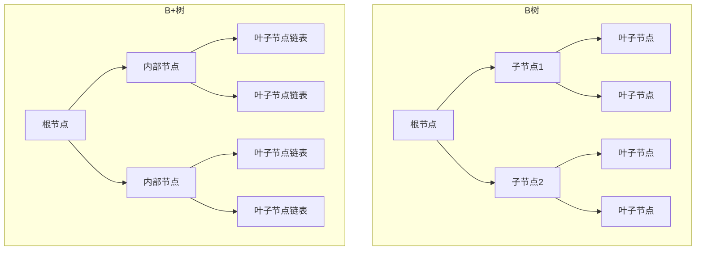

# 数据结构

本文包含：

1. ConcurrentHashMap
2. HashMap

## 1. ConcurrentHashMap

自我总结：注意了，只要你了解了 HashMap，那么其实 ConcurrentHashMap 的 put 和 get 你就知道了，get 一样，put 无非就是加了“锁”控制，sync、cas，包括保证可见性的 entry 的 value 为 volatile，核心需要掌握的是扩容和 size 的计算。

### 放入的流程

- 根据 key 计算出 hashcode。
- 判断是否需要进行初始化。
- 即为当前 key 定位出的 Node，如果为空表示当前位置可以写入数据，利用 CAS 尝试写入，失败则自旋保证成功。
- 如果当前位置的 hashcode == MOVED == -1，则需要进行扩容。
- 如果都不满足，则利用 synchronized 锁写入数据。
- 如果数量大于 TREEIFY_THRESHOLD 则要转换为红黑树。


> 图：ConcurrentHashMap 结构示意（一）


> 图：ConcurrentHashMap 结构示意（二）


> 图：ConcurrentHashMap 结构示意（三）

### 难点

#### 1. 扩容

[ConcurrentHashMap 扩容详解（CSDN）](https://blog.csdn.net/ZOKEKAI/article/details/90051567)

扩容是 ConcurrentHashMap 的核心，明白作者的意图就不觉得难了。扩容机制的触发有三个地方：

- 当更新元素（put or replace or remove…）时，哈希映射数组找到的节点的 hash 值等于 MOVED = -1，表示数组正在扩容，帮助扩容 helpTransfer。
- 当添加元素时，链表达到转红黑树的阈值，若此时数组长度小于 MIN_TREEIFY_CAPACITY = 64，则触发扩容 tryPresize。
- 当添加元素成功后，addCount 更新元素个数时，元素个数达到扩容阈值则触发扩容。

#### 2. addCount 元素计数

```java
private final void addCount(long x, int check) {
    CounterCell[] as; long b, s;
    // counterCells!=null，则直接在counterCells里加元素个数，
    // counterCells=null,则尝试修改baseCount，失败则修改counterCells。
    if ((as = counterCells) != null ||
        !U.compareAndSwapLong(this, BASECOUNT, b = baseCount, s = b + x)) {
        CounterCell a; long v; int m;
        // 初始化乐观的认为true即没有竞争
        boolean uncontended = true;
        // ThreadLocalRandom.getProbe() 相当于当前线程的hash值
        if (as == null || (m = as.length - 1) < 0 ||
            (a = as[ThreadLocalRandom.getProbe() & m]) == null ||
            !(uncontended =
              U.compareAndSwapLong(a, CELLVALUE, v = a.value, v + x))) {
            // 找到对应的格子不为null，则cas 该格子内的value+x
            // counterCells为空or对应格子为空or update格子失败uncontended=false，
            // 则进入fullAddCount，这个方法是一定会加成功的,但是加成功就立刻退出整个方法了，不判断扩容了？
            fullAddCount(x, uncontended);
            return;
        }
        // 从put走到addCount，check是一定>=2的，
        // 从computeIfAbsent到addCount，可能check =1，意为没有发生哈希冲突的添加元素，则不会检查扩容，
        // 毕竟扩容是个耗时的操作
        if (check <= 1)
            return;
        // 统计下元素总个数。
        s = sumCount();
    }
    // 替换节点和清空数组时，check=-1，只做元素个数递减，不会触发扩容检查，也不会缩容。
    if (check >= 0) {
        // 后面触发扩容可以先不看，后面会一起细说。
       // 触发扩容判断 代码省略
    }
}
```

addCount 较为复杂，单独拎出来讨论。一个简单的元素个数加减，如果让你来实现这个功能该如何做，一个 volatile 修饰的变量，然后 cas 加减？在竞争激烈的情况，cas 自旋可能会成为性能瓶颈，某些线程会因为 cas 计数失败而长时间自旋。

Doug Lea 是怎么做的呢？基础变量（baseCount）+ 数组（CounterCell[]）辅助计数。

作者的思路就是尽量避免竞争，cas 修改 baseCount 成功就不会再去修改 CounterCell[]，修改失败也不会自旋，以哈希映射的方式找到 CounterCell[] 对应位置的格子 cas 计数，依然失败就多次重复哈希映射找其他空闲格子，还失败就扩容 CounterCell[]，扩容之后都竞争不过其他线程，此时就进入自旋重复哈希映射，直到修改成功，虽然最终可能也会陷入不断自旋重试的情况，但是多个线程抢多个资源与多个线程抢一个资源相比，性能明显会好很多。

有个疑问，当不得已走到 fullAddCount()，这个方法是一定会修改元素个数成功的，但是成功就立刻退出整个 addCount 方法了，不再向后判断扩容？个人猜想：

- 假设走到 fullAddCount 是因为 CounterCell[] as 为空，那么外围的 if，就是 cas 修改 baseCount 失败了，说明有其他线程修改成功了，由它去检查是否扩容。
- 假设走到 fullAddCount 是因为 cas 修改 counterCell 失败，说明有其他线程修改成功，则由它去检查扩容。
- 既然都执行到 fullAddCount，这个方法流程上还是比较复杂的，可能较为耗时，作者意图应该是不想让客户端调用时间太长，既然有其他线程去检查扩容了，当前线程就结束吧，不要让调用者等太久。

fullAddCount 全力修改元素个数：

这个方法有些复杂，但是目的很单纯，就是一定要修改成功。自旋里可以分为三个大分支：

- counterCells 数组不为空，则哈希映射对应格子，多次失败后冲突升级触发扩容，依然不成功则重复哈希映射自旋。
- counterCells 数组为空，则初始化。
- 没有获取初始化的权利，则 cas 修改 baseCount。

如何统计所有元素个数呢？基数 baseCount + CounterCell[] 之和。

## 2. HashMap

```java
final Node getNode(int hash, Object key) {

    Node[] tab; Node first, e; int n; K k;

    // 1.对table进行校验：table不为空 && table长度大于0 &&
    // table索引位置(使用table.length - 1和hash值进行位与运算)的节点不为空
    if ((tab = table) != null && (n = tab.length) > 0 &&
        (first = tab[(n - 1) & hash]) != null) {

        // 2.检查first节点的hash值和key是否和入参的一样，如果一样则first即为目标节点，直接返回first节点
        if (first.hash == hash && // always check first node
            ((k = first.key) == key || (key != null && key.equals(k))))
            return first;

        // 3.如果first不是目标节点，并且first的next节点不为空则继续遍历
        if ((e = first.next) != null) {
            if (first instanceof TreeNode)
                // 4.如果是红黑树节点，则调用红黑树的查找目标节点方法getTreeNode
                return ((TreeNode)first).getTreeNode(hash, key);

            do {
                // 5.执行链表节点的查找，向下遍历链表, 直至找到节点的key和入参的key相等时,返回该节点
                if (e.hash == hash &&
                    ((k = e.key) == key || (key != null && key.equals(k))))
                    return e;
            } while ((e = e.next) != null);
        }
    }

    // 6.找不到符合的返回空
    return null;
}
```

```java
final V putVal(int hash, K key, V value, boolean onlyIfAbsent,
               boolean evict) {

    Node[] tab; Node p; int n, i;

    // 1.校验table是否为空或者length等于0，如果是则调用resize方法进行初始化
    if ((tab = table) == null || (n = tab.length) == 0)
        n = (tab = resize()).length;

    // 2.通过hash值计算索引位置，将该索引位置的头节点赋值给p，如果p为空则直接在该索引位置新增一个节点即可
    if ((p = tab[i = (n - 1) & hash]) == null)
        tab[i] = newNode(hash, key, value, null);
    else {
        // table表该索引位置不为空，则进行查找
        Node e; K k;

        // 3.判断p节点的key和hash值是否跟传入的相等，如果相等, 则p节点即为要查找的目标节点，将p节点赋值给e节点
        if (p.hash == hash &&
            ((k = p.key) == key || (key != null && key.equals(k))))
            e = p;

        // 4.判断p节点是否为TreeNode, 如果是则调用红黑树的putTreeVal方法查找目标节点
        else if (p instanceof TreeNode)
            e = ((TreeNode)p).putTreeVal(this, tab, hash, key, value);

        else {
            // 5.走到这代表p节点为普通链表节点，则调用普通的链表方法进行查找，使用binCount统计链表的节点数
            for (int binCount = 0; ; ++binCount) {
                // 6.如果p的next节点为空时，则代表找不到目标节点，则新增一个节点并插入链表尾部
                if ((e = p.next) == null) {
                    p.next = newNode(hash, key, value, null);

                    // 7.校验节点数是否超过8个，如果超过则调用treeifyBin方法将链表节点转为红黑树节点，
                    // 减一是因为循环是从p节点的下一个节点开始的
                    if (binCount >= TREEIFY_THRESHOLD - 1)
                        treeifyBin(tab, hash);
                    break;
                }

                // 8.如果e节点存在hash值和key值都与传入的相同，则e节点即为目标节点，跳出循环
                if (e.hash == hash &&
                    ((k = e.key) == key || (key != null && key.equals(k))))
                    break;

                p = e;  // 将p指向下一个节点
            }
        }

        // 9.如果e节点不为空，则代表目标节点存在，使用传入的value覆盖该节点的value，并返回oldValue
        if (e != null) {
            V oldValue = e.value;
            if (!onlyIfAbsent || oldValue == null)
                e.value = value;
            afterNodeAccess(e); // 用于LinkedHashMap
            return oldValue;
        }
    }

    ++modCount;

    // 10.如果插入节点后节点数超过阈值，则调用resize方法进行扩容
    if (++size > threshold)
        resize();
    afterNodeInsertion(evict);  // 用于LinkedHashMap
    return null;
}
```

```java
final Node[] resize() {
        Node[] oldTab = table;//保存旧数组
        int oldCap = (oldTab == null) ? 0 : oldTab.length;
        int oldThr = threshold;//保存旧阈值
        int newCap, newThr = 0;//创建新的数组大小、新的阈值
        if (oldCap > 0) {
            if (oldCap >= MAXIMUM_CAPACITY) {//判断当前数组大小是否达到最大值
                threshold = Integer.MAX_VALUE;
                return oldTab;
            }
            else if ((newCap = oldCap << 1) < MAXIMUM_CAPACITY &&
                     oldCap >= DEFAULT_INITIAL_CAPACITY)
                newThr = oldThr << 1; //扩容两倍的阈值
        }
        else if (oldThr > 0) // 初始化新的数组大小
            newCap = oldThr;
        else {//上面条件都不满足，则使用默认值
            newCap = DEFAULT_INITIAL_CAPACITY;
            newThr = (int)(DEFAULT_LOAD_FACTOR * DEFAULT_INITIAL_CAPACITY);
        }
        if (newThr == 0) {//初始化新的阈值
            float ft = (float)newCap * loadFactor;
            newThr = (newCap < MAXIMUM_CAPACITY && ft < (float)MAXIMUM_CAPACITY ?
                      (int)ft : Integer.MAX_VALUE);
        }
        threshold = newThr;//将新阈值赋值到当前对象
        @SuppressWarnings({"rawtypes","unchecked"})
              //创建一个newCap大小的数组Node
        Node[] newTab = (Node[])new Node[newCap];
        table = newTab;
        if (oldTab != null) {
            for (int j = 0; j < oldCap; ++j) {//遍历旧的数组
                Node e;
                if ((e = oldTab[j]) != null) {
                    oldTab[j] = null;//释放空间
                    if (e.next == null)
                      //如果旧数组中e后面没有元素，则直接计算新数组的位置存放
                        newTab[e.hash & (newCap - 1)] = e;
                    else if (e instanceof TreeNode)//如果是红黑树则单独处理
                        ((TreeNode)e).split(this, newTab, j, oldCap);
                    else {  //链表结构逻辑，解决hash冲突
                        Node loHead = null, loTail = null;
                        Node hiHead = null, hiTail = null;
                        Node next;
                        do {
                            next = e.next;
                            if ((e.hash & oldCap) == 0) {
                                if (loTail == null)
                                    loHead = e;
                                else
                                    loTail.next = e;
                                loTail = e;
                            }
                            else {
                                if (hiTail == null)
                                    hiHead = e;
                                else
                                    hiTail.next = e;
                                hiTail = e;
                            }
                        } while ((e = next) != null);
                        //原索引放入数组中
                        if (loTail != null) {
                            loTail.next = null;
                            newTab[j] = loHead;
                        }
                        //原索引+oldCap放入数组中
                        if (hiTail != null) {
                            hiTail.next = null;
                            newTab[j + oldCap] = hiHead;//jdk1.8优化的点
                        }
                    }
                }
            }
        }
        return newTab;
}
```

## 常见数据结构复杂度与场景

| 结构 | 插入 | 删除 | 查找 | 典型场景 |
| --- | --- | --- | --- | --- |
| 数组 | O(n) | O(n) | O(1)* | 连续存储、随机访问 |
| 链表 | O(1) | O(1) | O(n) | 频繁增删、LRU |
| 哈希表 | O(1)~ | O(1)~ | O(1)~ | 字典、缓存、去重 |
| 二叉搜索树 | O(log n) | O(log n) | O(log n) | 动态有序集合（退化风险） |
| 红黑树 | O(log n) | O(log n) | O(log n) | TreeMap、HashMap 桶转树 |
| 跳表 | O(log n) | O(log n) | O(log n) | Redis ZSet、LevelDB MemTable |
| 堆 | O(log n) | O(log n) | 最值 O(1) | 优先级队列、TopK |
| 平衡树(AVL) | O(log n) | O(log n) | O(log n) | 查询多、插入少 |
| 位图 | O(1) | O(1) | O(1) | 海量整型去重、布隆基 |

## 并查集（Union-Find / Disjoint Set）

用于**动态连通性**问题（朋友圈、岛屿、Kruskal 最小生成树）。核心两操作：

- `find(x)`：找根，带**路径压缩**（`parent[x] = find(parent[x])`）压平树；
- `union(a,b)`：按**秩/大小合并**，小树挂大树下，降低高度。

```java
int find(int x){ return parent[x]==x ? x : (parent[x]=find(parent[x])); }
void union(int a,int b){
    int ra=find(a), rb=find(b);
    if(ra==rb) return;
    if(rank[ra]<rank[rb]) parent[ra]=rb;
    else { parent[rb]=ra; if(rank[ra]==rank[rb]) rank[ra]++; }
}
```

两优化叠加后，`m` 次操作近乎 O(α(n))（反阿克曼，近似常数）。

## 树状数组（Fenwick Tree）

解决**前缀和/区间更新、单点/区间查询**，比线段树常数小、代码短：

- `lowbit(x) = x & -x`（取最低位 1）；
- `add(i, v)`：从 i 向上 `i += lowbit(i)` 累加；
- `prefix(i)`：从 i 向下 `i -= lowbit(i)` 求和；
- 区间和 `sum(l,r) = prefix(r) - prefix(l-1)`。

```java
int lowbit(int x){ return x & -x; }
void add(int i,int v){ for(;i<=n;i+=lowbit(i)) tree[i]+=v; }
int prefix(int i){ int s=0; for(;i>0;i-=lowbit(i)) s+=tree[i]; return s; }
```

区间更新+区间查询可用两个树状数组（差分思想）实现。

## 其他高频结构

- **跳表（Skip List）**：多层有序链表 + 随机层数，以 O(log n) 支持范围查询/排名；Redis ZSet 底层（数据多时）。
- **红黑树**：近似平衡二叉搜索树，插入/删除旋转次数有界；`TreeMap`、`HashMap` 链表过长转树。
- **布隆过滤器**：多个哈希位图，判断"一定不在 / 可能在"，有误判无漏报；用于缓存穿透拦截、爬虫去重。
- **Trie（前缀树）**：字符串公共前缀共享，用于自动补全、词频统计、IP 路由匹配。
- **线段树**：区间最值/求和修改，O(log n)，适合区间更新频繁场景。

---

# 第二轮深度优化：并查集实战 / 复杂度汇总 / 并发数据结构

> 前文已述树状数组、跳表、布隆过滤器、红黑树、线段树、Trie。本节补齐并查集实战、复杂度对比与并发数据结构。

## 一、并查集（Disjoint Set / Union-Find）

用于**动态连通性**：判断两点是否连通、合并两个集合。核心两操作：

- `find(x)`：找根，带**路径压缩**（递归/迭代把路径上节点直接挂到根，摊还近乎 O(1)）；
- `union(a,b)`：按**秩/大小合并**（小树挂大树，控制高度）。

```java
int[] parent = new int[n];
int[] rank = new int[n];
for (int i = 0; i < n; i++) parent[i] = i;
int find(int x){ while (parent[x] != x) { parent[x] = parent[parent[x]]; x = parent[x]; } return x; }
void union(int a, int b){
    int ra = find(a), rb = find(b);
    if (ra == rb) return;
    if (rank[ra] < rank[rb]) parent[ra] = rb;
    else { parent[rb] = ra; if (rank[ra] == rank[rb]) rank[ra]++; }
}
```

- **复杂度**：路径压缩 + 按秩合并 → 单次操作摊还 O(α(n))（反阿克曼，实际常数级）。
- **实战**：① 岛屿数量（网格连通块）；② 账户合并（相同邮箱归并）；③ 最小生成树 Kruskal（按边权排序，连通则跳过避免环）；④ 冗余连接（去环）；⑤ 朋友圈/团伙判定。

## 二、常见结构复杂度汇总

| 结构 | 查询 | 插入 | 删除 | 特色 |
| --- | --- | --- | --- | --- |
| 数组 | O(1) 随机 | O(n) | O(n) | 连续内存、缓存友好 |
| 链表 | O(n) | O(1) | O(1) | 增删方便 |
| 哈希表 | O(1) 均摊 | O(1) | O(1) | 无序、需好哈希 |
| 二叉搜索树(平衡) | O(log n) | O(log n) | O(log n) | 有序 |
| 红黑树 / AVL | O(log n) | O(log n) | O(log n) | 近平衡 |
| 跳表 | O(log n) | O(log n) | O(log n) | 范围/排名友好 |
| 堆 | O(1) 取最值 | O(log n) | O(log n) | 优先队列 |
| 树状数组 | O(log n) | O(log n) | — | 前缀和首选 |
| 线段树 | O(log n) | O(log n) | O(log n) | 区间修改/查询 |
| 并查集 | O(α(n)) | O(α(n)) | — | 动态连通 |
| 布隆过滤器 | O(k) 判存在 | O(k) | 不支持 | 有误判、省空间 |

## 三、并发数据结构（实战）

- **ConcurrentHashMap（JDK 1.8）**：丢掉分段锁，改为 `Node` 数组 + **CAS + synchronized**（只锁桶头节点），并发度更高；`size()`/`mappingCount()` 用 baseCount + CounterCell 分段累加，避免全局锁。`computeIfAbsent` 内部做原子，但**不要在里面做重操作**（会持锁）。
- **ConcurrentLinkedQueue**：Michael-Scott 无锁 CAS 链表，高并发入出队；无界，注意内存占用；`offer` 永不阻塞。适合生产者-消费者解耦。
- **阻塞队列（BlockingQueue）**：`ArrayBlockingQueue`（有界、单锁）、`LinkedBlockingQueue`（可选有界、双锁）、`SynchronousQueue`（不缓冲，直接交接，CachedThreadPool 用）、`PriorityBlockingQueue`（无界堆）。用于线程池与生产者-消费者。
- **ConcurrentSkipListMap/Set**：跳表 + 并发（CAS 写），支持**有序 + 范围查询**，接近 O(log n)；适合需要并发有序（如时间序事件表）。
- **StampedLock**：JDK 8 的读写锁增强，提供**乐观读**（读前拿 stamp，读后 `validate`，中途无写则免锁，有写则升级悲观读），读多写少场景下比 `ReentrantReadWriteLock` 更高吞吐；注意它是**不可重入**、写优先可能饿读。
- **CopyOnWriteArrayList/Set**：写时复制，读无锁、读多写极少场景极佳（如监听器列表）；写开销大、数据短暂不一致，慎用于频繁写。
- **权衡**：并发结构比同步包装（`Collections.synchronizedMap`）吞吐高，但语义更复杂（如 `ConcurrentHashMap` 的复合操作 `putIfAbsent` 后再算仍需原子方法或外部锁）。选错（如把 COW 用在写多场景）会严重退化。

## 四、图与经典算法

- **表示**：邻接表（省空间、遍历快、O(V+E)）/ 邻接矩阵（查边 O(1)、耗 O(V²)）。
- **遍历**：BFS（层序、无权最短路、连通块）、DFS（环检测、拓扑排序后序）。**拓扑排序**：Kahn（入度表，O(V+E)）或 DFS 后序反转；用于依赖编排/编译顺序。
- **最短路**：Dijkstra（堆优化 O((V+E)logV)，非负权）、Bellman-Ford（可负权、判负环 O(VE)）、Floyd（多源 O(V³)）。

## 五、字符串与哈希

- **KMP**：失配函数 `next` 利用已匹配信息避免主串回退，O(n+m)；适合子串匹配。**Trie**（前文）做前缀。**后缀数组/后缀自动机**：复杂子串统计（如不同子串数）。
- **哈希冲突解决**：链地址法（HashMap，冲突挂链表/树）、开放寻址（线性/二次探测/双重哈希，缓存友好）；好的哈希函数分散、低聚集；`String.hashCode` 是多项式滚动哈希。

## 六、堆与平衡树

- **堆**：数组实现完全二叉树，`PriorityQueue` 默认最小堆；`heapify` O(n)，插入/取最值 O(log n)；实战：TopK（最小堆维护 K 大）、中位数（双堆：大顶+小顶）、多路归并。
- **平衡树**：AVL（严格平衡、查询快、旋转多）/ 红黑树（近似平衡、插入删除旋转少，Java `TreeMap`/`TreeSet` 用）/ Treap（随机优先级，期望平衡，实现简单）。
- **二分答案**：答案具单调性时二分求最优（如"最少天数吃完香蕉""使最大值最小"），把"判断可行性"降到 O(log 范围)。

## 七、刷题/面试常见套路

- 滑动窗口（子串最长无重复）、双指针（有序数组两数之和）、前缀和 + 哈希（和为 k 的子数组）、回溯（子集/排列/组合）、并查集（连通）、单调栈（下一个更大元素）、拓扑排序（课程表）。核心是**选对结构 + 复杂度分析**。

## 八、实战心法

- **先分析后编码**：先问数据规模（n 多大）、操作类型（查询多还是更新多）、是否有序、是否允许近似，再选结构；不要拿起 HashMap 就写。
- **复杂度是底线也是上限**：面试/方案先给时间空间复杂度；O(n²) 在 n=1e5 必超时，需 O(n log n) 或 O(n)；空间换时间是常见权衡。
- **别重复造轮子**：JDK 已提供 `ConcurrentSkipListMap`、各种 `Queue`、`BitSet`；理解原理后优先用成熟实现，自研只在特殊需求时。

---

# 第三轮深度优化：线段树/布隆过滤器实战 / 数据结构在 DB 与 Redis 的真实应用 / 算法题选型决策表

## 一、线段树（Segment Tree）实战与复杂度

解决**区间查询 + 区间更新**（最值、求和、染色），`build`/`query`/`update` 均 O(log n)。

```java
// 区间求和 + 懒惰标记（区间加 lazy）
int[] tree = new int[4 * n];
int[] lazy = new int[4 * n];
void build(int p, int l, int r, int[] a){
    if (l == r) { tree[p] = a[l]; return; }
    int m = (l + r) >> 1;
    build(p<<1, l, m, a); build(p<<1|1, m+1, r, a);
    tree[p] = tree[p<<1] + tree[p<<1|1];
}
void push(int p, int l, int r){
    if (lazy[p] != 0){
        int m = (l + r) >> 1;
        tree[p<<1]   += lazy[p] * (m - l + 1); lazy[p<<1]   += lazy[p];
        tree[p<<1|1] += lazy[p] * (r - m);     lazy[p<<1|1] += lazy[p];
        lazy[p] = 0;
    }
}
int query(int p, int l, int r, int ql, int qr){
    if (ql <= l && r <= qr) return tree[p];
    push(p, l, r);
    int m = (l + r) >> 1, res = 0;
    if (ql <= m) res += query(p<<1, l, m, ql, qr);
    if (qr >  m) res += query(p<<1|1, m+1, r, ql, qr);
    return res;
}
void update(int p, int l, int r, int ql, int qr, int v){
    if (ql <= l && r <= qr) { tree[p] += v * (r-l+1); lazy[p] += v; return; }
    push(p, l, r);
    int m = (l + r) >> 1;
    if (ql <= m) update(p<<1, l, m, ql, qr, v);
    if (qr >  m) update(p<<1|1, m+1, r, ql, qr, v);
    tree[p] = tree[p<<1] + tree[p<<1|1];
}
```
- **复杂度**：单点/区间操作 O(log n)，空间 4n；带 `lazy` 的区间更新避免每次下沉，均摊 O(log n)。
- **实战**：① 区间最大值/求和（如某时段最高温度）；② 区间染色/覆盖（会议室占用、灯塔照亮）；③ 配合离散化做"扫描线"（矩形面积并）；④ 动态秩/逆序对。与树状数组对比：树状数组代码短常数小但只擅长前缀和类；线段树更通用（任意区间合并、最值）。

## 二、布隆过滤器（Bloom Filter）实战与复杂度

- **原理**：长度为 m 的位数组 + k 个独立哈希函数。插入：k 个位置置 1；查询：若 k 位全 1 则"可能存在"，任一位 0 则"一定不存在"。**有误判（false positive）无漏报**；不支持删除（除非 Counting Bloom）。
- **参数公式**：n 个元素、目标误判率 p → `m = -n*ln(p)/(ln2)^2`，`k = m/n * ln2`。如 n=1e7、p=0.01 → m≈9.6e7 bit≈12MB，k≈7。空间远小于 HashSet。
- **实战**：
  ```java
  // Guava BloomFilter
  BloomFilter<String> bf = BloomFilter.create(Funnels.stringFunnel(Charsets.UTF_8), 10_000_000, 0.01);
  bf.put("user:1001");
  if (bf.mightContain("user:1001")) { /* 可能存在，再查 DB 确认 */ }
  if (!bf.mightContain("user:9999")) { /* 一定不存在，直接返回，拦截缓存穿透 */ }
  ```
  - 缓存穿透拦截：查 DB 前先过布隆（非法 id 一定不存在，直接挡掉），合法但不存在的再缓存空值。
  - 爬虫/爬虫去重、HBase/RocksDB 的布隆块索引加速点查、Bigtable 行级存在性判断。
- **局限**：误判需下游兜底（DB 二次确认）；不支持删除导致"已删除元素仍判存在"；位数组固定，n 超预估误判率飙升，需预估容量。

## 三、跳表（Skip List）深入实战

- **结构**：多层有序链表，底层全量有序，上层按概率（如 1/2）晋升，形成"快速通道"。查询从顶层最右走，遇大值下沉。
- **复杂度**：查找/插入/删除期望 O(log n)，空间 O(n)。实现比平衡树简单（无旋转），并发友好。
- **实现要点（随机层数）**：
  ```java
  int randomLevel(){
      int lvl = 1;
      while (Math.random() < 0.5 && lvl < MAX_LVL) lvl++;
      return lvl;
  }
  ```
- **实战**：Redis `ZSet` 元素多（>128 且元素大）时底层用跳表，支持按 score 排名/范围（ZRANGEBYSCORE）；LevelDB/RocksDB `MemTable` 用跳表支持有序遍历；并发跳表（`ConcurrentSkipListMap`）支持高并发有序 + 范围查询。

## 四、数据结构在真实系统中的落地

### 4.1 数据库索引：B+ 树

- **为什么 B+ 树而非红黑树/哈希**：磁盘 IO 以页（16KB）为单位，B+ 树是多叉平衡树（扇出大、树高低，3 层即可存千万级），**所有数据在叶子节点且用双向链表串成有序**，范围查询/排序只需顺着叶子链表扫，无需回树。红黑树树太高（IO 多）、哈希不支持范围。
- **聚簇 vs 二级索引**：InnoDB 聚簇索引叶子存整行（按 PK 有序），二级索引叶子存 PK，回表需再查聚簇索引。覆盖索引（查询列都在索引里）免回表。
- **最左前缀**：联合索引 `(a,b,c)` 走 `a`、`a,b`、`a,b,c`，跳 a 或用范围中断后续列失效 → 索引设计按查询最左列序。
- **页分裂/合并**：插入导致页满分裂（可能短暂碎片），删除导致合并；自增 PK 顺序写避免频繁分裂，UUID 随机写易分裂。

### 4.2 Redis：跳表 / 压缩列表（ziplist/listpack）

- **ZSet**：元素少且小 → `listpack`（紧凑连续内存，省空间）；元素多/大 → `skiplist + dict`（跳表保有序支持范围，dict 保 O(1) 按 member 查 score）。`zset-max-listpack-entries`/`value` 控制阈值。
- **Hash/List/Set 小数据**：用 `listpack`（紧凑），超阈值转 `hashtable`/`linkedlist`/`intset→hashtable`。listpack 省内存但增删需整体重写，适合小数据；大数据转结构保操作效率。
- **选型启示**：内存型 KV 用紧凑编码省空间，但要在"空间"与"操作复杂度"间按数据规模切换结构——这是工程里**数据结构随规模演变**的典型。

## 五、算法题数据结构选型决策表

| 问题特征 | 首选结构 | 关键复杂度 | 典型题 |
| --- | --- | --- | --- |
| 动态连通 / 去环 / 合并集合 | 并查集 | O(α(n)) | 岛屿数量、账户合并、Kruskal |
| 前缀和 / 单点更新区间查 | 树状数组 | O(log n) | 区间和、逆序对 |
| 任意区间最值/求和/更新 | 线段树 | O(log n) | 区间染色、矩形面积并 |
| 有序 + 范围/排名查询 | 跳表 / 平衡树 | O(log n) | ZSet、中位数（双堆） |
| 存在性判断、省空间、可误判 | 布隆过滤器 | O(k) | 缓存穿透、去重 |
| TopK / 最值流 | 堆 | O(log n) | 前 K 大、多路归并 |
| 频次前缀 / 自动补全 | Trie | O(L) | 词频、搜素建议 |
| LRU 缓存 | 哈希 + 双向链表 | O(1) | LRU 实现 |
| 滑动窗口最值 | 单调栈/队列 | O(n) | 下一个更大元素 |
| 依赖编排 / 编译顺序 | 拓扑排序（图） | O(V+E) | 课程表 |
| 最短路径（非负权） | 堆优化 Dijkstra | O((V+E)logV) | 路径规划 |
| 子串匹配 | KMP / 哈希 | O(n+m) | 模式匹配 |

- **决策心法**：先问数据规模（n=1e5 必须 O(n log n) 或 O(n)）、操作类型（查询多/更新多/有序否/范围否）、是否允许近似与额外空间。再按表选结构，避免"拿起 HashMap 就写"导致 O(n²) 超时。

## 补充：各数据结构时间复杂度总表（均摊分析）

| 结构 | 插入（均摊） | 删除（均摊） | 查找 | 随机访问 | 范围查询 | 备注 |
|------|-------------|-------------|------|---------|---------|------|
| 数组 | O(n) | O(n) | O(n) | O(1) | O(n) | 连续内存，缓存友好 |
| 链表 | O(1) 头插 | O(1) 头删 | O(n) | O(n) | O(n) | 增删快，查找慢 |
| 哈希表 | O(1) 均摊 | O(1) 均摊 | O(1) 均摊 | N/A | O(n) | 最坏 O(n)（哈希冲突） |
| 红黑树 | O(log n) | O(log n) | O(log n) | N/A | O(log n) | TreeMap/TreeSet |
| 跳表 | O(log n) | O(log n) | O(log n) | N/A | O(log n) | Redis ZSet |
| 堆（二叉） | O(log n) | O(log n) | O(1) 最值 | N/A | O(n) | PriorityQueue |
| B+ 树 | O(log n) | O(log n) | O(log n) | N/A | O(log n+k) | 数据库索引 |
| 并查集 | O(α(n)) | O(α(n)) | — | N/A | N/A | 路径压缩+按秩合并 |
| 布隆过滤器 | O(k) | 不支持 | O(k) | N/A | N/A | 有误判无漏报 |
| 树状数组 | O(log n) | O(log n) | O(log n) | N/A | O(log n) | 前缀和首选 |
| 线段树 | O(log n) | O(log n) | O(log n) | N/A | O(log n) | 区间操作 |
| Trie | O(L) | O(L) | O(L) | N/A | O(L+子树) | L=字符串长度 |
| LRU 缓存 | O(1) | O(1) | O(1) | N/A | N/A | 哈希+双向链表 |
| LFU 缓存 | O(1) | O(1) | O(1) | N/A | N/A | 哈希+桶+双向链表 |

## 补充：跳表实现要点与 Redis zskiplist 对照

### 跳表核心结构

```
Level 3:  HEAD ──────────────────────────→ 90 → NIL
Level 2:  HEAD ────────→ 30 ─────────────→ 90 → NIL
Level 1:  HEAD → 10 → 30 → 50 → 70 → 90 → NIL
```

### 随机层数算法

```java
// 普通实现：概率 1/2 晋升
int randomLevel() {
    int lvl = 1;
    while (Math.random() < 0.5 && lvl < MAX_LEVEL)
        lvl++;
    return lvl;
}
```

### Redis zskiplist 对照

| 维度 | 标准跳表 | Redis zskiplist |
|------|---------|-----------------|
| 最大层数 | 32（理论最优） | 32（ZSKIPLIST_MAXLEVEL） |
| 晋升概率 | 1/2 | 1/4（每 4 个节点晋升 1 个） |
| 并发 | 需加锁 | 单线程无锁 |
| 后退指针 | 无 | 有（backward，支持 ZREVRANGE） |
| score | 通用 | 支持 double + 字典 member |
| 内存布局 | 指针分离 | 连续内存分配（ziplist 转换阈值） |

> **Redis 选择概率 1/4 的原因**：降低内存开销（层数更少），同时单线程无需考虑并发查询性能。

### 跳表 vs 红黑树

| 维度 | 跳表 | 红黑树 |
|------|------|--------|
| 实现复杂度 | 简单（纯链表） | 复杂（旋转平衡） |
| 范围查询 | O(log n+k)（链表遍历） | O(log n+k)（中序遍历） |
| 并发友好 | 高（CAS 写） | 低（旋转需全局锁） |
| 内存 | 稍多（多层指针） | 较少（仅节点指针） |
| 实际选择 | Redis ZSet、LevelDB MemTable | Java TreeMap/TreeSet |

## 补充：布隆过滤器误判率公式与参数选择

### 核心公式

对于 n 个元素、m 位数组、k 个哈希函数：

**误判率**：p ≈ (1 - e^(-kn/m))^k

**最优哈希函数数量**：k_opt = (m/n) × ln2 ≈ 0.693 × (m/n)

**给定目标误判率 p 和元素数量 n，所需位数组大小**：m = -n × ln(p) / (ln2)^2

### 参数选择速查表

| n（元素数） | p=0.01 所需位数 m | p=0.01 字节数 | p=0.001 所需位数 m | p=0.001 字节数 | 最优 k |
|------------|-------------------|--------------|-------------------|---------------|--------|
| 1,000 | 9,585 | 1.2KB | 14,377 | 1.8KB | 7 |
| 10,000 | 95,850 | 12KB | 143,771 | 18KB | 7 |
| 100,000 | 958,505 | 120KB | 1,437,710 | 180KB | 7 |
| 1,000,000 | 9,585,050 | 1.2MB | 14,377,100 | 1.8MB | 7 |
| 10,000,000 | 95,850,500 | 12MB | 143,771,000 | 18MB | 7 |

### 工程实践选择

```java
// Guava BloomFilter：n=1亿，误判率1%
BloomFilter<Long> bf = BloomFilter.create(
    Funnels.longFunnel(), 100_000_000, 0.01);
// 空间约 120MB（vs HashSet 约 800MB+）

// Redis 原生：BF.ADD / BF.EXISTS
// RedisBloom 模块自动优化 k 和 m
```

> **误判率 0.01（1%）是最常用折中**：每 100 次查询有 1 次误判（可由下游 DB 兜底），空间远小于 HashSet。

## 补充：LRU/LFU O(1) 设计差异

### LRU O(1) 实现

```java
class LRUCache {
    int capacity;
    Map<Integer, Node> map;  // O(1) 查找
    Node head, tail;          // 双向链表 O(1) 移动

    public void put(int key, int val) {
        if (map.containsKey(key)) {
            remove(map.get(key));       // O(1)
        } else if (map.size() == capacity) {
            remove(tail.prev);          // O(1) 淘汰最久
        }
        insert(new Node(key, val));     // O(1) 插入头部
        map.put(key, head);
    }

    public int get(int key) {
        if (!map.containsKey(key)) return -1;
        Node node = map.get(key);
        remove(node);                   // O(1) 移到头部
        insert(node);
        return node.val;
    }
}
```

### LFU O(1) 设计

LFU 比 LRU 复杂：需要维护频率计数，同时 O(1) 访问。

```java
class LFUCache {
    int capacity, minFreq;
    Map<Integer, Node> keyMap;         // key → node
    Map<Integer, LinkedHashSet<Integer>> freqMap;  // freq → keys（LRU 顺序）

    public void put(int key, int val) {
        if (keyMap.containsKey(key)) {
            // 更新值 + 增频
            remove(key);
            insert(key, val, getFreq(key) + 1);
        } else if (keyMap.size() == capacity) {
            // 淘汰最低频的第一个
            LinkedHashSet<Integer> minSet = freqMap.get(minFreq);
            int evictKey = minSet.iterator().next();
            minSet.remove(evictKey);
            keyMap.remove(evictKey);
            if (minSet.isEmpty()) minFreq++;
        }
        insert(key, val, 1);
    }
}
```

### LRU vs LFU 对比

| 维度 | LRU | LFU |
|------|-----|-----|
| 淘汰策略 | 最近最少使用 | 使用频率最低 |
| 实现 | 哈希+双向链表 | 哈希+双向链表+频率桶 |
| 数据结构 | 1个 Map + 1个链表 | 2个 Map + 多个 LinkedHashSet |
| 时间复杂度 | O(1) | O(1) |
| 缓存污染 | 一次性扫描会污染 | 抗扫描（频率累积） |
| 适用 | 通用缓存 | 频率倾斜明显场景（热点数据） |

## 补充：Trie 敏感词过滤应用

### Trie 敏感词过滤

```java
class SensitiveFilter {
    private final TrieNode root = new TrieNode();

    // 构建敏感词 Trie
    public void addWord(String word) {
        TrieNode node = root;
        for (char c : word.toCharArray()) {
            node.children.putIfAbsent(c, new TrieNode());
            node = node.children.get(c);
        }
        node.isEnd = true;
    }

    // 过滤文本中的敏感词
    public String filter(String text) {
        StringBuilder sb = new StringBuilder();
        int i = 0;
        while (i < text.length()) {
            TrieNode node = root;
            int j = i, matchLen = 0;
            while (j < text.length() && node.children.containsKey(text.charAt(j))) {
                node = node.children.get(text.charAt(j));
                if (node.isEnd) matchLen = j - i + 1;
                j++;
            }
            if (matchLen > 0) {
                sb.append("*".repeat(matchLen));
                i += matchLen;
            } else {
                sb.append(text.charAt(i));
                i++;
            }
        }
        return sb.toString();
    }
}
```

### DFA（确定有限自动机）优化

大规模敏感词场景，将 Trie 转为 DFA 状态机，一次扫描匹配所有敏感词：

| 方案 | 时间复杂度 | 适用 |
|------|-----------|------|
| 朴素遍历 | O(n × m × k) | n=文本长度，m=敏感词数，k=平均长度 |
| Trie | O(n × L) | L=最长敏感词长度 |
| DFA | O(n) | 最优，但预处理空间大 |

## 补充：堆在 Top-K 的工程实践

### 最小堆维护 Top-K 大元素

```java
// 用最小堆维护前 K 大元素
public int[] topK(int[] nums, int k) {
    PriorityQueue<Integer> minHeap = new PriorityQueue<>(k);
    for (int num : nums) {
        if (minHeap.size() < k) {
            minHeap.offer(num);
        } else if (num > minHeap.peek()) {
            minHeap.poll();
            minHeap.offer(num);
        }
    }
    return minHeap.stream().mapToInt(Integer::intValue).toArray();
}
// 时间：O(n log k)，空间：O(k)
```

### 多路归并（外部排序 Top-K）

```java
// 多个有序文件，取全局 Top-K
public List<Integer> mergeTopK(List<PriorityQueue<Integer>> heaps, int k) {
    PriorityQueue<int[]> pq = new PriorityQueue<>(Comparator.comparingInt(a -> a[0]));
    for (int i = 0; i < heaps.size(); i++) {
        if (!heaps.get(i).isEmpty()) {
            pq.offer(new int[]{heaps.get(i).poll(), i});
        }
    }
    List<Integer> result = new ArrayList<>();
    while (!pq.isEmpty() && result.size() < k) {
        int[] top = pq.poll();
        result.add(top[0]);
        if (!heaps.get(top[1]).isEmpty()) {
            pq.offer(new int[]{heaps.get(top[1]).poll(), top[1]});
        }
    }
    return result;
}
```

### Top-K 场景选型

| 场景 | 方案 | 复杂度 |
|------|------|--------|
| 内存中 N 个元素取 Top-K | 最小堆 | O(n log k) |
| 流式数据（无界） | 最小堆 | O(n log k) |
| 多路有序文件取 Top-K | 多路归并堆 | O(k log m) |
| 统计频率取 Top-K | 哈希计数+堆 | O(n + m log k) |
| 近似 Top-K | Count-Min Sketch | O(n) 但有误差 |

> **工程经验**：当 k 较小（如 Top-10）而 n 极大时，堆方案远优于全排序（O(n log n)）；流式场景只能用堆。

## 各数据结构时间复杂度总表（增/删/改/查 均摊）

| 结构 | 插入（均摊） | 删除（均摊） | 查找 | 随机访问 | 范围查询 | 空间 |
|------|-------------|-------------|------|---------|---------|------|
| 数组 | O(n) | O(n) | O(n) | O(1) | O(n) | O(n) |
| 链表 | O(1) 头插 | O(1) 头删 | O(n) | O(n) | O(n) | O(n) |
| 哈希表 | O(1) | O(1) | O(1) | N/A | O(n) | O(n) |
| 红黑树 | O(log n) | O(log n) | O(log n) | N/A | O(log n) | O(n) |
| 跳表 | O(log n) | O(log n) | O(log n) | N/A | O(log n) | O(n) |
| 堆（二叉） | O(log n) | O(log n) | O(1) 最值 | N/A | O(n) | O(n) |
| B+ 树 | O(log n) | O(log n) | O(log n) | N/A | O(log n+k) | O(n) |
| 并查集 | O(α(n)) | O(α(n)) | — | N/A | N/A | O(n) |
| 布隆过滤器 | O(k) | 不支持 | O(k) | N/A | N/A | O(m) |
| 树状数组 | O(log n) | O(log n) | O(log n) | N/A | O(log n) | O(n) |
| 线段树 | O(log n) | O(log n) | O(log n) | N/A | O(log n) | O(4n) |
| Trie | O(L) | O(L) | O(L) | N/A | O(L+子树) | O(ALPHABET×n×L) |
| LRU 缓存 | O(1) | O(1) | O(1) | N/A | N/A | O(n) |
| LFU 缓存 | O(1) | O(1) | O(1) | N/A | N/A | O(n) |

## 跳表实现要点与 Redis zskiplist 源码对照

### 跳表核心结构

```
Level 3:  HEAD ──────────────────────────→ 90 → NIL
Level 2:  HEAD ────────→ 30 ─────────────→ 90 → NIL
Level 1:  HEAD → 10 → 30 → 50 → 70 → 90 → NIL
```

### 随机层数算法

```java
int randomLevel() {
    int lvl = 1;
    while (Math.random() < 0.5 && lvl < MAX_LEVEL)
        lvl++;
    return lvl;
}
```

### Redis zskiplist 对照

| 维度 | 标准跳表 | Redis zskiplist |
|------|---------|-----------------|
| 最大层数 | 32 | 32（ZSKIPLIST_MAXLEVEL） |
| 晋升概率 | 1/2 | 1/4（每 4 个节点晋升 1 个） |
| 并发 | 需加锁 | 单线程无锁 |
| 后退指针 | 无 | 有（backward，支持 ZREVRANGE） |
| score | 通用 | 支持 double + 字典 member |

> Redis 选择概率 1/4：降低内存开销（层数更少），单线程无需考虑并发查询性能。

### 跳表 vs 红黑树

| 维度 | 跳表 | 红黑树 |
|------|------|--------|
| 实现复杂度 | 简单（纯链表） | 复杂（旋转平衡） |
| 范围查询 | O(log n+k) | O(log n+k) |
| 并发友好 | 高（CAS 写） | 低（旋转需全局锁） |
| 实际选择 | Redis ZSet、LevelDB MemTable | Java TreeMap/TreeSet |

## 布隆过滤器误判率公式推导与参数选择表

### 核心公式

```
对于 n 个元素、m 位数组、k 个哈希函数：

误判率：p ≈ (1 - e^(-kn/m))^k

最优哈希函数数量：k_opt = (m/n) × ln2 ≈ 0.693 × (m/n)

给定目标误判率 p 和元素数量 n，所需位数组大小：
m = -n × ln(p) / (ln2)^2
```

### 参数选择速查表

| n（元素数） | p=0.01 所需位数 m | p=0.01 字节数 | p=0.001 所需位数 m | 最优 k |
|------------|-------------------|--------------|-------------------|--------|
| 1,000 | 9,585 | 1.2KB | 14,377 | 7 |
| 10,000 | 95,850 | 12KB | 143,771 | 7 |
| 100,000 | 958,505 | 120KB | 1,437,710 | 7 |
| 1,000,000 | 9,585,050 | 1.2MB | 14,377,100 | 7 |
| 10,000,000 | 95,850,500 | 12MB | 143,771,000 | 7 |

> 误判率 0.01（1%）是最常用折中：每 100 次查询有 1 次误判，空间远小于 HashSet。

## LRU/LFU O(1) 实现差异

### LRU O(1) 实现

```java
class LRUCache {
    int capacity;
    Map<Integer, Node> map;  // O(1) 查找
    Node head, tail;          // 双向链表 O(1) 移动

    public void put(int key, int val) {
        if (map.containsKey(key)) {
            remove(map.get(key));       // O(1)
        } else if (map.size() == capacity) {
            remove(tail.prev);          // O(1) 淘汰最久
        }
        insert(new Node(key, val));     // O(1) 插入头部
        map.put(key, head);
    }

    public int get(int key) {
        if (!map.containsKey(key)) return -1;
        Node node = map.get(key);
        remove(node);                   // O(1) 移到头部
        insert(node);
        return node.val;
    }
}
```

### LFU O(1) 设计

```java
class LFUCache {
    int capacity, minFreq;
    Map<Integer, Node> keyMap;
    Map<Integer, LinkedHashSet<Integer>> freqMap;  // freq → keys

    public void put(int key, int val) {
        if (keyMap.containsKey(key)) {
            remove(key);
            insert(key, val, getFreq(key) + 1);
        } else if (keyMap.size() == capacity) {
            LinkedHashSet<Integer> minSet = freqMap.get(minFreq);
            int evictKey = minSet.iterator().next();
            minSet.remove(evictKey);
            keyMap.remove(evictKey);
            if (minSet.isEmpty()) minFreq++;
        }
        insert(key, val, 1);
    }
}
```

### LRU vs LFU 对比

| 维度 | LRU | LFU |
|------|-----|-----|
| 淘汰策略 | 最近最少使用 | 使用频率最低 |
| 实现 | 哈希+双向链表 | 哈希+双向链表+频率桶 |
| 缓存污染 | 一次性扫描会污染 | 抗扫描（频率累积） |
| 适用 | 通用缓存 | 频率倾斜明显场景 |

## Trie 在敏感词过滤的应用场景与实现

### Trie 敏感词过滤

```java
class SensitiveFilter {
    private final TrieNode root = new TrieNode();

    public void addWord(String word) {
        TrieNode node = root;
        for (char c : word.toCharArray()) {
            node.children.putIfAbsent(c, new TrieNode());
            node = node.children.get(c);
        }
        node.isEnd = true;
    }

    public String filter(String text) {
        StringBuilder sb = new StringBuilder();
        int i = 0;
        while (i < text.length()) {
            TrieNode node = root;
            int j = i, matchLen = 0;
            while (j < text.length() && node.children.containsKey(text.charAt(j))) {
                node = node.children.get(text.charAt(j));
                if (node.isEnd) matchLen = j - i + 1;
                j++;
            }
            if (matchLen > 0) {
                sb.append("*".repeat(matchLen));
                i += matchLen;
            } else {
                sb.append(text.charAt(i));
                i++;
            }
        }
        return sb.toString();
    }
}
```

| 方案 | 时间复杂度 | 适用 |
|------|-----------|------|
| 朴素遍历 | O(n × m × k) | 小规模 |
| Trie | O(n × L) | 中规模 |
| DFA（确定有限自动机） | O(n) | 大规模 |

## 堆在 Top-K 场景的工程实践

### 最小堆维护 Top-K 大元素

```java
public int[] topK(int[] nums, int k) {
    PriorityQueue<Integer> minHeap = new PriorityQueue<>(k);
    for (int num : nums) {
        if (minHeap.size() < k) {
            minHeap.offer(num);
        } else if (num > minHeap.peek()) {
            minHeap.poll();
            minHeap.offer(num);
        }
    }
    return minHeap.stream().mapToInt(Integer::intValue).toArray();
}
// 时间：O(n log k)，空间：O(k)
```

### Top-K 场景选型

| 场景 | 方案 | 复杂度 |
|------|------|--------|
| 内存中 N 个元素取 Top-K | 最小堆 | O(n log k) |
| 流式数据（无界） | 最小堆 | O(n log k) |
| 多路有序文件取 Top-K | 多路归并堆 | O(k log m) |
| 统计频率取 Top-K | 哈希计数+堆 | O(n + m log k) |
| 近似 Top-K | Count-Min Sketch | O(n) 但有误差 |

---

## 红黑树深入理解

```java
// 红黑树性质
// 1. 每个节点是红色或黑色
// 2. 根节点是黑色
// 3. 叶子节点（NIL）是黑色
// 4. 红色节点的两个子节点都是黑色
// 5. 从根到叶子的每条路径包含相同数量的黑色节点

// 红黑树 vs AVL树
// | 特性 | 红黑树 | AVL树 |
// |------|--------|-------|
// | 平衡度 | 不严格平衡 | 严格平衡 |
// | 查找 | O(log n) | O(log n) |
// | 插入 | O(log n) | O(log n) |
// | 删除 | O(log n) | O(log n) |
// | 旋转次数 | 最多2次 | 最多O(log n) |
```

### 红黑树应用场景

| 场景 | 说明 | 数据结构 |
|------|------|----------|
| Java TreeMap | 有序映射 | 红黑树 |
| Linux CFS | 进程调度 | 红黑树 |
| epoll | 事件驱动 | 红黑树 |
| Nginx | 定时器 | 红黑树 |

## B树与B+树对比



### B树 vs B+树

| 特性 | B树 | B+树 |
|------|-----|------|
| 数据存储 | 所有节点 | 只有叶子 |
| 叶子连接 | 无 | 链表连接 |
| 查询效率 | 不稳定 | 稳定O(log n) |
| 范围查询 | 需中序遍历 | 高效 |
| 适用场景 | 数据库索引 | 文件系统/数据库 |

## 图算法汇总

```java
// Dijkstra 最短路径
public void dijkstra(Map<String, List<Edge>> graph, String start) {
    Map<String, Integer> dist = new HashMap<>();
    PriorityQueue<Node> pq = new PriorityQueue<>((a, b) -> a.dist - b.dist);
    
    dist.put(start, 0);
    pq.offer(new Node(start, 0));
    
    while (!pq.isEmpty()) {
        Node node = pq.poll();
        for (Edge edge : graph.get(node.name)) {
            int newDist = dist.get(node.name) + edge.weight;
            if (newDist < dist.getOrDefault(edge.to, Integer.MAX_VALUE)) {
                dist.put(edge.to, newDist);
                pq.offer(new Node(edge.to, newDist));
            }
        }
    }
}

// 拓扑排序
public List<String> topologicalSort(Map<String, List<String>> graph) {
    Map<String, Integer> inDegree = new HashMap<>();
    Queue<String> queue = new LinkedList<>();
    List<String> result = new ArrayList<>();
    
    // 计算入度
    for (String node : graph.keySet()) {
        inDegree.putIfAbsent(node, 0);
        for (String neighbor : graph.get(node)) {
            inDegree.merge(neighbor, 1, Integer::sum);
        }
    }
    
    // 入度为0的节点入队
    for (Map.Entry<String, Integer> entry : inDegree.entrySet()) {
        if (entry.getValue() == 0) {
            queue.offer(entry.getKey());
        }
    }
    
    // BFS处理
    while (!queue.isEmpty()) {
        String node = queue.poll();
        result.add(node);
        for (String neighbor : graph.get(node)) {
            inDegree.merge(neighbor, -1, Integer::sum);
            if (inDegree.get(neighbor) == 0) {
                queue.offer(neighbor);
            }
        }
    }
    
    return result;
}
```

### 图算法复杂度

| 算法 | 时间复杂度 | 适用场景 |
|------|-----------|----------|
| Dijkstra | O((V+E)logV) | 单源最短路径 |
| Bellman-Ford | O(VE) | 负权边 |
| Floyd | O(V^3) | 全源最短路径 |
| Kruskal | O(ElogE) | 最小生成树 |
| Prim | O(V^2) | 最小生成树 |

## 动态规划模板

```java
// 背包问题
public int knapsack(int[] weights, int[] values, int capacity) {
    int n = weights.length;
    int[] dp = new int[capacity + 1];
    
    for (int i = 0; i < n; i++) {
        for (int w = capacity; w >= weights[i]; w--) {
            dp[w] = Math.max(dp[w], dp[w - weights[i]] + values[i]);
        }
    }
    
    return dp[capacity];
}

// 最长公共子序列
public int lcs(String text1, String text2) {
    int m = text1.length(), n = text2.length();
    int[][] dp = new int[m + 1][n + 1];
    
    for (int i = 1; i <= m; i++) {
        for (int j = 1; j <= n; j++) {
            if (text1.charAt(i - 1) == text2.charAt(j - 1)) {
                dp[i][j] = dp[i - 1][j - 1] + 1;
            } else {
                dp[i][j] = Math.max(dp[i - 1][j], dp[i][j - 1]);
            }
        }
    }
    
    return dp[m][n];
}
```

### DP问题类型

| 问题类型 | 状态定义 | 转移方程 |
|----------|----------|----------|
| 01背包 | dp[i][w] | max(dp[i-1][w], dp[i-1][w-wi]+vi) |
| 完全背包 | dp[i][w] | max(dp[i-1][w], dp[i][w-wi]+vi) |
| LCS | dp[i][j] | if相等则dp[i-1][j-1]+1 |
| 编辑距离 | dp[i][j] | min(删除/插入/替换) |

## 排序算法对比

```java
// 快速排序
public void quickSort(int[] arr, int left, int right) {
    if (left < right) {
        int pivot = partition(arr, left, right);
        quickSort(arr, left, pivot - 1);
        quickSort(arr, pivot + 1, right);
    }
}

private int partition(int[] arr, int left, int right) {
    int pivot = arr[right];
    int i = left - 1;
    for (int j = left; j < right; j++) {
        if (arr[j] < pivot) {
            swap(arr, ++i, j);
        }
    }
    swap(arr, i + 1, right);
    return i + 1;
}
```

### 排序算法复杂度

| 算法 | 平均时间 | 最坏时间 | 空间 | 稳定性 |
|------|----------|----------|------|--------|
| 快速排序 | O(n log n) | O(n^2) | O(log n) | 不稳定 |
| 归并排序 | O(n log n) | O(n log n) | O(n) | 稳定 |
| 堆排序 | O(n log n) | O(n log n) | O(1) | 不稳定 |
| 插入排序 | O(n^2) | O(n^2) | O(1) | 稳定 |
| 冒泡排序 | O(n^2) | O(n^2) | O(1) | 稳定 |

## 图算法

### 图遍历算法

```java
// DFS 深度优先搜索
public void dfs(int node, boolean[] visited, Map<Integer, List<Integer>> graph) {
    visited[node] = true;
    System.out.print(node + " ");
    
    for (int neighbor : graph.getOrDefault(node, new ArrayList<>())) {
        if (!visited[neighbor]) {
            dfs(neighbor, visited, graph);
        }
    }
}

// BFS 广度优先搜索
public void bfs(int start, Map<Integer, List<Integer>> graph) {
    Queue<Integer> queue = new LinkedList<>();
    Set<Integer> visited = new HashSet<>();
    
    queue.offer(start);
    visited.add(start);
    
    while (!queue.isEmpty()) {
        int node = queue.poll();
        System.out.print(node + " ");
        
        for (int neighbor : graph.getOrDefault(node, new ArrayList<>())) {
            if (!visited.contains(neighbor)) {
                queue.offer(neighbor);
                visited.add(neighbor);
            }
        }
    }
}
```

### 最短路径算法

| 算法 | 适用场景 | 时间复杂度 | 特点 |
|------|----------|------------|------|
| Dijkstra | 非负权图 | O(V²) 或 O((V+E)logV) | 贪心 |
| Bellman-Ford | 负权图 | O(VE) | 检测负环 |
| Floyd-Warshall | 全源最短路 | O(V³) | 动态规划 |
| A* | 启发式搜索 | O(E) | 启发函数 |

### 最小生成树算法

| 算法 | 原理 | 时间复杂度 | 适用场景 |
|------|------|------------|----------|
| Prim | 贪心扩展 | O(V²) 或 O(ElogV) | 稠密图 |
| Kruskal | 边排序合并 | O(ElogE) | 稀疏图 |

## 树的高级结构

### B+ 树与红黑树对比

```
B+ 树：
  多路平衡搜索树
  叶子节点形成链表
  支持范围查询
  适用：磁盘 IO 密集场景（数据库索引）

红黑树：
  二叉搜索树
  自平衡（旋转+变色）
  不支持高效范围查询
  适用：内存中动态数据（TreeMap）
```

### 树结构对比

| 特性 | B+ 树 | 红黑树 | AVL 树 |
|------|-------|--------|--------|
| 阶数 | 多路 | 二叉 | 二叉 |
| 平衡 | 完美平衡 | 近似平衡 | 严格平衡 |
| 范围查询 | 高效（叶子链表） | 低效 | 低效 |
| 插入删除 | O(log n) | O(log n) | O(log n) |
| 适用场景 | 磁盘索引 | 内存动态数据 | 内存静态数据 |

## 高级数据结构

### 跳表（Skip List）

```
跳表：
  多层链表结构
  支持 O(log n) 查找
  Redis Sorted Set 底层实现

  结构：
    Level 3:  1 ──────────────────→ 9
    Level 2:  1 ────→ 5 ──────────→ 9
    Level 1:  1 ─→ 3 ─→ 5 ─→ 7 ─→ 9

  查找：从最高层开始，逐层下降
  插入：随机层数，维护平衡
```

### 布隆过滤器（Bloom Filter）

```
布隆过滤器：
  概率型数据结构
  判断元素是否可能存在
  100% 准确判断不存在
  有误判率（false positive）

  原理：
    k 个哈希函数
    m 位数组
    插入：k 个哈希值对应位置设为 1
    查询：k 个位置都为 1 → 可能存在

  应用：
    缓存穿透防护
    垃圾邮件过滤
    URL 去重
```

---

## 数据结构深度实战补充

### 红黑树 vs AVL 树选型决策

| 维度 | 红黑树 | AVL 树 |
|------|--------|--------|
| 平衡策略 | 近似平衡（最长路径≤2倍最短） | 严格平衡（高度差≤1） |
| 旋转次数 | 插入最多2次，删除最多3次 | 插入/删除最多O(log n)次 |
| 查找性能 | O(log n)（略慢于AVL） | O(log n)（最优） |
| 插入/删除性能 | 更优（旋转少） | 略差（旋转多） |
| 内存开销 | 每节点1bit颜色位 | 每节点1int平衡因子 |
| 适用场景 | 频繁插入/删除（Java TreeMap） | 查询密集且数据稳定 |

```java
// 红黑树旋转示意（左旋）
//        x                    y
//       / \                  / \
//      a   y      →        x   c
//         / \             / \
//        b   c           a   b

// 红黑树颜色变换（插入修复）
// 父叔双红 → 父叔变黑，祖父变红，上移检查
```

### B+ 树在数据库索引中的落地

```text
InnoDB B+ 树索引结构：

Page Size = 16KB
非叶子节点（Key Only）：
  ├── 每个 key 约 8-12 字节
  └── 一个 16KB 页可存 ~1200 个 key
  └── 3 层 B+ 树可存 1200^3 ≈ 17.28 亿行

叶子节点（Key + Row Data / PK）：
  ├── 聚簇索引：叶子存整行数据
  ├── 二级索引：叶子存主键值（回表查聚簇索引）
  └── 叶子间双向链表：范围查询高效

页分裂触发条件：
  ├── 插入导致页满（16KB已满）
  ├── 自增PK：顺序写，极少分裂
  └── UUID随机PK：随机写，频繁分裂 → 碎片+性能下降
```

### 跳表在 LevelDB/RocksDB 中的 MemTable 实现

```text
LevelDB MemTable 结构：
  └── 跳表（SkipList）存储有序 KV

写入流程：
  1. 写入 MemTable（跳表，O(log n)）
  2. MemTable 满（默认 4MB）→ 转为 Immutable MemTable
  3. 后台线程 Flush 到磁盘（SSTable 文件）
  4. SSTable 之间 Compaction 合并

跳表优势（对比红黑树）：
  ├── 实现简单（无旋转逻辑）
  ├── 并发友好（CAS 写入，无需全局锁）
  ├── 范围查询高效（底层链表顺序遍历）
  └── 内存局部性好（链表节点可连续分配）
```

### 布隆过滤器在 HBase/RocksDB 中的索引加速

```text
HBase 布隆过滤器：
  ├── 存储位置：每个 StoreFile（SSTable）对应一个布隆过滤器
  ├── 查询流程：
  │   1. 读请求先查布隆过滤器
  │   2. 判断"一定不在"→ 直接跳过该 StoreFile
  │   3. 判断"可能存在"→ 继续查索引块
  ├── 效果：避免无效磁盘 IO，提升读性能
  └── 参数：误判率 1% 时，每个 key 约 10 bit

RocksDB 布隆过滤器配置：
  ├── 全量布隆：每个 SSTable 一个
  ├── 前缀布隆：按 key 前缀过滤（范围查询加速）
  └── 适合场景：Point Lookup（点查）密集
```

### LRU Cache 在 Java 中的完整实现

```java
public class LRUCache<K, V> {
    private final int capacity;
    private final Map<K, Node<K, V>> map;
    private final Node<K, V> head, tail;

    public LRUCache(int capacity) {
        this.capacity = capacity;
        this.map = new HashMap<>();
        this.head = new Node<>(0, 0);
        this.tail = new Node<>(0, 0);
        head.next = tail;
        tail.prev = head;
    }

    public V get(K key) {
        if (!map.containsKey(key)) return null;
        Node<K, V> node = map.get(key);
        moveToHead(node);
        return node.value;
    }

    public void put(K key, V value) {
        if (map.containsKey(key)) {
            Node<K, V> node = map.get(key);
            node.value = value;
            moveToHead(node);
        } else {
            Node<K, V> node = new Node<>(key, value);
            map.put(key, node);
            addToHead(node);
            if (map.size() > capacity) {
                Node<K, V> evict = removeTail();
                map.remove(evict.key);
            }
        }
    }

    private void moveToHead(Node<K, V> node) {
        removeNode(node);
        addToHead(node);
    }

    private void addToHead(Node<K, V> node) {
        node.prev = head;
        node.next = head.next;
        head.next.prev = node;
        head.next = node;
    }

    private void removeNode(Node<K, V> node) {
        node.prev.next = node.next;
        node.next.prev = node.prev;
    }

    private Node<K, V> removeTail() {
        Node<K, V> node = tail.prev;
        removeNode(node);
        return node;
    }

    static class Node<K, V> {
        K key;
        V value;
        Node<K, V> prev, next;
        Node(K k, V v) { key = k; value = v; }
    }
}
```

### LFU Cache 在 Java 中的完整实现

```java
public class LFUCache<K, V> {
    private final int capacity;
    private int minFreq;
    private final Map<K, Node<K, V>> keyMap;
    private final Map<Integer, LinkedHashMap<K, V>> freqMap;

    public LFUCache(int capacity) {
        this.capacity = capacity;
        this.keyMap = new HashMap<>();
        this.freqMap = new HashMap<>();
    }

    public V get(K key) {
        if (!keyMap.containsKey(key)) return null;
        Node<K, V> node = keyMap.get(key);
        increaseFreq(key, node.value);
        return node.value;
    }

    public void put(K key, V value) {
        if (capacity == 0) return;
        if (keyMap.containsKey(key)) {
            keyMap.get(key).value = value;
            increaseFreq(key, value);
        } else {
            if (keyMap.size() >= capacity) evict();
            Node<K, V> node = new Node<>(key, value, 1);
            keyMap.put(key, node);
            freqMap.computeIfAbsent(1, k -> new LinkedHashMap<>()).put(key, value);
            minFreq = 1;
        }
    }

    private void increaseFreq(K key, V value) {
        Node<K, V> node = keyMap.get(key);
        int oldFreq = node.freq;
        node.freq++;
        freqMap.get(oldFreq).remove(key);
        if (freqMap.get(oldFreq).isEmpty()) {
            freqMap.remove(oldFreq);
            if (minFreq == oldFreq) minFreq++;
        }
        freqMap.computeIfAbsent(node.freq, k -> new LinkedHashMap<>()).put(key, value);
    }

    private void evict() {
        LinkedHashMap<K, V> minFreqMap = freqMap.get(minFreq);
        K evictKey = minFreqMap.keySet().iterator().next();
        minFreqMap.remove(evictKey);
        keyMap.remove(evictKey);
    }

    static class Node<K, V> {
        K key;
        V value;
        int freq;
        Node(K k, V v, int f) { key = k; value = v; freq = f; }
    }
}
```

### 数据结构选型速查

| 场景 | 首选结构 | 理由 |
|------|---------|------|
| 缓存（通用） | HashMap + 双向链表（LRU） | O(1) 访问 + O(1) 淘汰 |
| 缓存（热点倾斜） | HashMap + 频率桶（LFU） | 抗扫描，保护热点 |
| 有序缓存/范围查询 | 跳表（ConcurrentSkipListMap） | O(log n) 有序 + 并发安全 |
| 数据库索引 | B+ 树 | 磁盘 IO 友好，范围查询高效 |
| 海量数据存在性判断 | 布隆过滤器 | 省空间，O(k) 查询 |
| 动态连通/去环 | 并查集 | O(α(n)) 摊还，近乎常数 |
| 前缀和/区间和 | 树状数组 | 代码短，常数小 |
| 区间最值/更新 | 线段树 | 通用区间操作 |
| Top-K/优先级 | 堆（PriorityQueue） | O(log n) 插入，O(1) 最值 |
| 字符串前缀匹配 | Trie | O(L) 查询，L=字符串长度 |
| 敏感词过滤 | Trie/DFA | 一次扫描匹配所有 |
| 高并发写入 | ConcurrentHashMap（CAS+synchronized） | 桶级锁，并发度高 |
| 高并发无锁队列 | ConcurrentLinkedQueue | Michael-Scott 无锁算法 |

## B+树 vs LSM 树深度对比

### 写入与查询性能对比

| 维度 | B+树 | LSM树 |
|------|------|-------|
| 写入性能 | 随机写，较慢 | 顺序写，极快 |
| 读取性能 | 稳定 O(log n) | 需查多层，可能慢 |
| 写放大 | 低 | 高（Compaction） |
| 读放大 | 低 | 高（多层查找） |
| 空间放大 | 低 | 中等 |
| 适用场景 | 读多写少 | 写多读少 |

### LSM 树 Compaction 策略

```text
Leveled Compaction（RocksDB 默认）：
  L0: [SSTable1, SSTable2, ...]
  L1: [SSTable] → 触发合并到 L2
  L2: [SSTable] → 触发合并到 L3
  优点：读放大低，空间放大小
  缺点：写放大高

Size-Tiered Compaction（Cassandra 默认）：
  策略：相同大小的 SSTable 合并
  优点：写放大低
  缺点：读放大高，空间放大高

 FIFO Compaction：
  策略：只保留最新的 SSTable
  适用：TTL 数据、时序数据
  优点：无 Compaction 开销
  缺点：数据丢失风险
```

---

## 跳表（Skip List）原理与实现

### 跳表结构

```text
Level 3:  1 ──────────────────→ 9
Level 2:  1 ────→ 4 ──────────→ 9
Level 1:  1 ──→ 3 ──→ 4 ──→ 7 → 9
Level 0:  1 → 2 → 3 → 4 → 5 → 7 → 8 → 9
```

### 跳表特性

| 特性 | 说明 |
|------|------|
| 查找时间 | O(log n) 平均 |
| 插入时间 | O(log n) 平均 |
| 删除时间 | O(log n) 平均 |
| 空间复杂度 | O(n) 平均 |
| 实现难度 | 比红黑树简单 |
| 并发性能 | 优于红黑树（分段锁） |

```java
// Redis 有序集合底层实现
// 跳表 + 哈希表
// ZADD key score member
// 跳表支持范围查询：ZRANGEBYSCORE key min max
```

---

## 红黑树 vs AVL 树对比

| 维度 | 红黑树 | AVL 树 |
|------|--------|--------|
| 平衡策略 | 近似平衡 | 严格平衡 |
| 查找性能 | O(log n) | O(log n)（略快） |
| 插入性能 | O(log n)（旋转少） | O(log n)（旋转多） |
| 删除性能 | O(log n)（旋转少） | O(log n)（旋转多） |
| 空间开销 | 每节点1位颜色 | 每节点1个平衡因子 |
| 应用场景 | TreeMap/TreeSet | 数据库索引 |

```text
红黑树 vs AVL 选择：
  - 频繁插入/删除：红黑树（旋转少）
  - 频繁查找：AVL（更严格平衡）
  - 内存敏感：红黑树（空间小）
  - 通用场景：红黑树（JDK 默认选择）
```

---

## 布隆过滤器深度解析

### 布隆过滤器原理

```text
布隆过滤器：
  1. 初始化一个 m 位的位数组，全为0
  2. 添加元素：用 k 个哈希函数计算位置，设为1
  3. 查询元素：检查 k 个位置是否全为1
     - 全为1：可能存在（有误判）
     - 有0：一定不存在

  特点：
    - 不支持删除
    - 误判率可调
    - 空间效率极高
```

### 布隆过滤器参数选择

| 参数 | 公式 | 说明 |
|------|------|------|
| m（位数组大小） | m = -(n * ln(p)) / (ln(2)^2) | n=元素数，p=误判率 |
| k（哈希函数数） | k = (m/n) * ln(2) | 最优哈希函数数 |
| 误判率 p | p = (1 - e^(-kn/m))^k | 可接受的误判率 |

```java
// Google Guava 布隆过滤器
BloomFilter<String> filter = BloomFilter.create(
    Funnels.stringFunnel(Charset.defaultCharset()),
    1000000,  // 预期元素数
    0.001     // 误判率
);

filter.put("hello");
filter.mightContain("hello");  // true
filter.mightContain("world");  // false（大概率）
```

---

## 一致性哈希算法详解

### 一致性哈希环

```text
一致性哈希环：
  0 ────────────────── 2^32-1
  │                    │
  │   Node A           │
  │      ↓             │
  │   Hash(A)          │
  │                    │
  │         Node B     │
  │            ↓       │
  │         Hash(B)    │
  │                    │
  │   Node C           │
  │      ↓             │
  │   Hash(C)          │

  虚拟节点：
    每个物理节点映射多个虚拟节点
    解决数据倾斜问题
    建议 100-200 个虚拟节点/物理节点
```

### 一致性哈希 vs 普通哈希

| 维度 | 普通哈希 | 一致性哈希 |
|------|---------|-----------|
| 节点变化 | 全量重新映射 | 只影响相邻节点 |
| 数据迁移 | 大量 | 少量 |
| 负载均衡 | 均匀 | 需要虚拟节点 |
| 实现复杂度 | 简单 | 较复杂 |
| 应用场景 | 缓存分片 | 分布式缓存/数据库 |

---

## 堆（Heap）与优先队列

### 堆的性质

```text
最大堆：
  父节点 >= 子节点
  根节点是最大值

最小堆：
  父节点 <= 子节点
  根节点是最小值

数组表示：
  父节点 i：左子 2i+1，右子 2i+2
  子节点 i：父节点 (i-1)/2
```

### 堆操作时间复杂度

| 操作 | 时间复杂度 | 说明 |
|------|-----------|------|
| 插入 | O(log n) | 上浮操作 |
| 删除最大/最小 | O(log n) | 下沉操作 |
| 查看最大/最小 | O(1) | 直接访问根 |
| 建堆 | O(n) | 自底向上 |
| 堆排序 | O(n log n) | 不稳定排序 |

```java
// Java PriorityQueue
PriorityQueue<Integer> minHeap = new PriorityQueue<>();
PriorityQueue<Integer> maxHeap = new PriorityQueue<>(Collections.reverseOrder());

// Top-K 问题
public int[] topK(int[] nums, int k) {
    PriorityQueue<Integer> pq = new PriorityQueue<>();
    for (int num : nums) {
        pq.offer(num);
        if (pq.size() > k) pq.poll();
    }
    // pq 中就是 Top-K
}
```

---

## K-D Tree 与空间索引

### K-D Tree 结构

```text
K-D Tree（2维）：
         (7,2)
        /     \
    (5,4)     (9,6)
    /   \       \
 (2,3) (6,1)   (8,1)

  每层按不同维度分割
  第0层：x轴
  第1层：y轴
  第2层：x轴
  ...
```

### K-D Tree 操作

| 操作 | 平均时间 | 最坏时间 |
|------|---------|---------|
| 构建 | O(n log n) | O(n^2) |
| 插入 | O(log n) | O(n) |
| 删除 | O(log n) | O(n) |
| 最近邻搜索 | O(log n) | O(n) |
| 范围查询 | O(√n + k) | O(n) |

```python
# K-D Tree 最近邻搜索
from scipy.spatial import KDTree
import numpy as np

points = np.array([[1,2], [3,4], [5,6], [7,8]])
tree = KDTree(points)

# 查找最近邻
dist, idx = tree.query([3.5, 4.5])
print(f"最近点: {points[idx]}, 距离: {dist}")
```

---

## 图存储结构对比

### 图数据库存储模型

| 模型 | 代表 | 特点 | 适用场景 |
|------|------|------|---------|
| 邻接矩阵 | 内存图 | 空间 O(V^2) | 稠密图 |
| 邻接表 | Neo4j | 空间 O(V+E) | 稀疏图 |
| 边列表 | CSV/文本 | 简单 | 批量分析 |
| CSR/CSC | 图计算 | 高效遍历 | 图算法 |

### 图遍历算法

| 算法 | 时间复杂度 | 空间复杂度 | 适用场景 |
|------|-----------|-----------|---------|
| BFS | O(V+E) | O(V) | 最短路径 |
| DFS | O(V+E) | O(V) | 连通性 |
| Dijkstra | O((V+E)log V) | O(V) | 单源最短路 |
| A* | O(E) | O(V) | 启发式搜索 |

---

## 哈希冲突解决方案

### 冲突解决方法对比

| 方法 | 原理 | 优点 | 缺点 |
|------|------|------|------|
| 链地址法 | 冲突元素链表 | 简单、负载因子高 | 缓存不友好 |
| 开放定址法 | 线性/二次探测 | 缓存友好 | 负载因子低 |
| 再哈希法 | 多个哈希函数 | 分布均匀 | 计算开销 |
| 建立公共溢出区 | 溢出区存储 | 简单 | 空间浪费 |

### 哈希表负载因子

```text
负载因子 α = 元素数 / 桶数

  JDK HashMap 默认 α = 0.75
    α 太小：空间浪费
    α 太大：冲突增多，性能下降

  扩容策略：
    1. 创建 2 倍大小的新数组
    2. 重新计算每个元素的位置
    3. 时间复杂度 O(n)，但均摊 O(1)

  线程安全：
    - HashMap：非线程安全
    - Hashtable：synchronized，性能差
    - ConcurrentHashMap：分段锁，并发度高
```

---

## 数据结构深度对比与实现

### B+树 vs LSM树深度对比

| 维度 | B+树 | LSM树 |
|------|------|-------|
| 写入性能 | 中 | 高 |
| 读取性能 | 高 | 中 |
| 空间利用 | 中 | 高 |
| 写放大 | 低 | 高 |
| 读放大 | 低 | 高 |
| 空间放大 | 低 | 中 |
| 适用场景 | 读多写少 | 写多读少 |

### 跳表（Skip List）原理与实现

```java
// 跳表节点定义
class SkipListNode {
    int key;
    int value;
    SkipListNode[] forward;
    
    public SkipListNode(int key, int value, int level) {
        this.key = key;
        this.value = value;
        this.forward = new SkipListNode[level + 1];
    }
}

// 跳表核心操作
public class SkipList {
    private SkipListNode header;
    private int level;
    private int size;
    
    public void insert(int key, int value) {
        SkipListNode[] update = new SkipListNode[level + 1];
        SkipListNode current = header;
        
        for (int i = level; i >= 0; i--) {
            while (current.forward[i] != null && current.forward[i].key < key) {
                current = current.forward[i];
            }
            update[i] = current;
        }
        
        int newLevel = randomLevel();
        if (newLevel > level) {
            level = newLevel;
        }
        
        SkipListNode newNode = new SkipListNode(key, value, newLevel);
        for (int i = 0; i <= newLevel; i++) {
            newNode.forward[i] = update[i].forward[i];
            update[i].forward[i] = newNode;
        }
        size++;
    }
}
```

### 红黑树 vs AVL树对比

| 维度 | 红黑树 | AVL树 |
|------|--------|-------|
| 平衡条件 | 宽松 | 严格 |
| 旋转次数 | 最多2次 | O(log n) |
| 查找性能 | O(log n) | O(log n) |
| 插入性能 | 快 | 慢 |
| 删除性能 | 快 | 慢 |
| 适用场景 | 频繁插入删除 | 频繁查找 |

### 布隆过滤器深度解析

| 参数 | 说明 | 计算公式 |
|------|------|----------|
| 位数组大小 | 决定误判率 | m = -n*ln(p)/(ln2)^2 |
| 哈希函数数量 | 平衡误判率和性能 | k = m/n * ln2 |
| 插入数量 | 影响误判率 | n |
| 误判率 | 预期误判率 | p = (1-e^(-kn/m))^k |

### 一致性哈希算法详解

```java
// 一致性哈希实现
public class ConsistentHash<T> {
    private final TreeMap<Long, T> ring = new TreeMap<>();
    private final int numberOfReplicas;
    
    public ConsistentHash(int numberOfReplicas, Collection<T> nodes) {
        this.numberOfReplicas = numberOfReplicas;
        for (T node : nodes) {
            add(node);
        }
    }
    
    public void add(T node) {
        for (int i = 0; i < numberOfReplicas; i++) {
            long hash = hash(node.toString() + i);
            ring.put(hash, node);
        }
    }
    
    public T get(Object key) {
        long hash = hash(key.toString());
        Map.Entry<Long, T> entry = ring.ceilingEntry(hash);
        if (entry == null) {
            entry = ring.firstEntry();
        }
        return entry.getValue();
    }
}
```

### 堆（Heap）与优先队列

| 堆类型 | 特点 | 适用场景 |
|--------|------|----------|
| 二叉堆 | 完全二叉树 | 通用 |
| 斐波那契堆 | 减少合并操作 | 图算法 |
| 二项堆 | 合并操作高效 | 合并操作多 |
| 最大堆 | 父节点大于子节点 | 优先队列 |
| 最小堆 | 父节点小于子节点 | 优先队列 |

### K-D Tree与空间索引

| 维度 | K-D Tree | R-Tree | 四叉树 |
|------|----------|--------|--------|
| 查询 | O(√n) | O(log n) | O(log n) |
| 插入 | O(log n) | O(log n) | O(log n) |
| 空间 | O(n) | O(n) | O(n) |
| 适用场景 | 低维空间 | 地理数据 | 2D空间 |

### 图存储结构对比

| 结构 | 适用场景 | 空间 | 查询 |
|------|----------|------|------|
| 邻接矩阵 | 稠密图 | O(n²) | O(1) |
| 邻接表 | 稀疏图 | O(n+e) | O(degree) |
| 十字链表 | 有向图 | O(n+e) | O(degree) |
| 邻接多重表 | 无向图 | O(n+e) | O(degree) |

### 哈希冲突解决方案

| 方案 | 说明 | 优点 | 缺点 |
|------|------|------|------|
| 链地址法 | 冲突元素链表 | 简单 | 冲突多时性能差 |
| 开放定址法 | 冲突后探测下一位置 | 缓存友好 | 有聚集问题 |
| 再哈希法 | 使用另一个哈希函数 | 分布均匀 | 计算开销大 |
| 建立公共溢出区 | 冲突元素放入溢出区 | 简单 | 溢出区可能很大 |

### 数据结构选型指南

| 场景 | 推荐结构 | 原因 |
|------|----------|------|
| 频繁查找 | 哈希表 | O(1)查找 |
| 有序数据 | 红黑树/AVL树 | 有序遍历 |
| 范围查询 | B+树 | 范围查询高效 |
| 写密集 | LSM树 | 写入性能高 |
| 去重 | 布隆过滤器 | 空间效率高 |
| 缓存淘汰 | LRU/LFU | 缓存策略 |

### 最佳实践清单

| 实践 | 说明 | 优先级 |
|------|------|--------|
| 选型分析 | 根据场景选择结构 | 高 |
| 性能测试 | 压测验证性能 | 高 |
| 内存优化 | 选择合适的数据结构 | 中 |
| 并发考虑 | 线程安全实现 | 高 |
| 序列化 | 考虑序列化需求 | 中 |

## 数据结构选型指南

### 选型决策树

```
数据结构选型：
  1. 查询需求
     → 快速查找 → 哈希表
     → 有序查找 → 二叉搜索树
     → 范围查询 → B+树

  2. 插入需求
     → 频繁插入 → 链表
     → 有序插入 → 平衡树
     → 批量插入 → 跳表

  3. 空间需求
     → 内存紧张 → 压缩存储
     → 磁盘存储 → B+树

  4. 并发需求
     → 高并发 → 无锁结构
     → 低并发 → 锁结构
```

### 数据结构对比表

| 数据结构 | 查询 | 插入 | 删除 | 适用场景 |
|----------|------|------|------|----------|
| 数组 | O(n) | O(n) | O(n) | 随机访问 |
| 链表 | O(n) | O(1) | O(1) | 频繁插入删除 |
| 哈希表 | O(1) | O(1) | O(1) | 快速查找 |
| 二叉搜索树 | O(log n) | O(log n) | O(log n) | 有序数据 |
| B+树 | O(log n) | O(log n) | O(log n) | 磁盘存储 |
| 跳表 | O(log n) | O(log n) | O(log n) | 并发场景 |

---

> 参考：
> - 《算法导论》(CLRS)
> - 《数据结构与算法分析》(Weiss)

