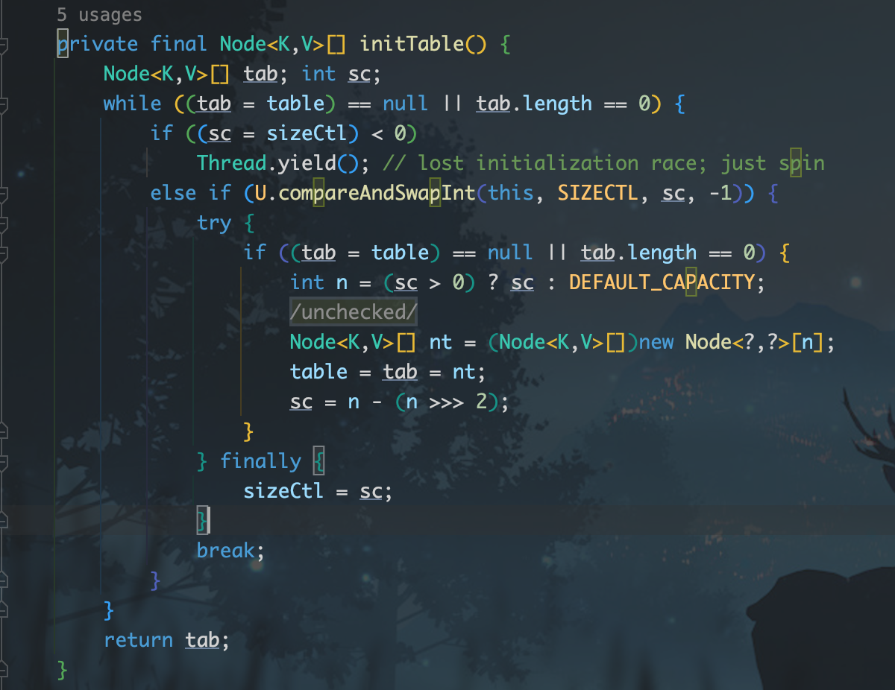
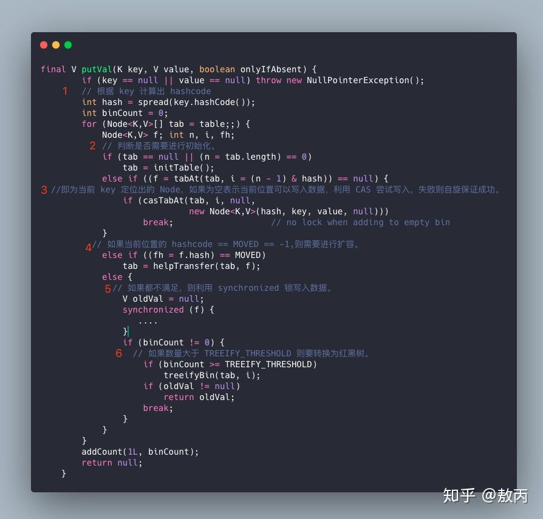
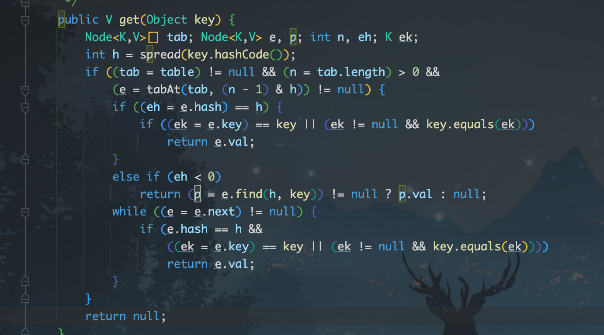

# 数据结构

本文包含：

1. ConcurrentHashMap
2. HashMap

## 1. ConcurrentHashMap

自我总结：注意了，只要你了解了 HashMap，那么其实 ConcurrentHashMap 的 put 和 get 你就知道了，get 一样，put 无非就是加了“锁”控制，sync、cas，包括保证可见性的 entry 的 value 为 volatile，核心需要掌握的是扩容和 size 的计算。

### 放入的流程

- 根据 key 计算出 hashcode。
- 判断是否需要进行初始化。
- 即为当前 key 定位出的 Node，如果为空表示当前位置可以写入数据，利用 CAS 尝试写入，失败则自旋保证成功。
- 如果当前位置的 hashcode == MOVED == -1，则需要进行扩容。
- 如果都不满足，则利用 synchronized 锁写入数据。
- 如果数量大于 TREEIFY_THRESHOLD 则要转换为红黑树。



> 图：ConcurrentHashMap 结构示意（一）



> 图：ConcurrentHashMap 结构示意（二）



> 图：ConcurrentHashMap 结构示意（三）

### 难点

#### 1. 扩容

[ConcurrentHashMap 扩容详解（CSDN）](https://blog.csdn.net/ZOKEKAI/article/details/90051567)

扩容是 ConcurrentHashMap 的核心，明白作者的意图就不觉得难了。扩容机制的触发有三个地方：

- 当更新元素（put or replace or remove…）时，哈希映射数组找到的节点的 hash 值等于 MOVED = -1，表示数组正在扩容，帮助扩容 helpTransfer。
- 当添加元素时，链表达到转红黑树的阈值，若此时数组长度小于 MIN_TREEIFY_CAPACITY = 64，则触发扩容 tryPresize。
- 当添加元素成功后，addCount 更新元素个数时，元素个数达到扩容阈值则触发扩容。

#### 2. addCount 元素计数

```java
private final void addCount(long x, int check) {
    CounterCell[] as; long b, s;
    // counterCells!=null，则直接在counterCells里加元素个数，
    // counterCells=null,则尝试修改baseCount，失败则修改counterCells。
    if ((as = counterCells) != null ||
        !U.compareAndSwapLong(this, BASECOUNT, b = baseCount, s = b + x)) {
        CounterCell a; long v; int m;
        // 初始化乐观的认为true即没有竞争
        boolean uncontended = true;
        // ThreadLocalRandom.getProbe() 相当于当前线程的hash值
        if (as == null || (m = as.length - 1) < 0 ||
            (a = as[ThreadLocalRandom.getProbe() & m]) == null ||
            !(uncontended =
              U.compareAndSwapLong(a, CELLVALUE, v = a.value, v + x))) {
            // 找到对应的格子不为null，则cas 该格子内的value+x
            // counterCells为空or对应格子为空or update格子失败uncontended=false，
            // 则进入fullAddCount，这个方法是一定会加成功的,但是加成功就立刻退出整个方法了，不判断扩容了？
            fullAddCount(x, uncontended);
            return;
        }
        // 从put走到addCount，check是一定>=2的，
        // 从computeIfAbsent到addCount，可能check =1，意为没有发生哈希冲突的添加元素，则不会检查扩容，
        // 毕竟扩容是个耗时的操作
        if (check <= 1)
            return;
        // 统计下元素总个数。
        s = sumCount();
    }
    // 替换节点和清空数组时，check=-1，只做元素个数递减，不会触发扩容检查，也不会缩容。
    if (check >= 0) {
        // 后面触发扩容可以先不看，后面会一起细说。
       // 触发扩容判断 代码省略
    }
}
```

addCount 较为复杂，单独拎出来讨论。一个简单的元素个数加减，如果让你来实现这个功能该如何做，一个 volatile 修饰的变量，然后 cas 加减？在竞争激烈的情况，cas 自旋可能会成为性能瓶颈，某些线程会因为 cas 计数失败而长时间自旋。

Doug Lea 是怎么做的呢？基础变量（baseCount）+ 数组（CounterCell[]）辅助计数。

作者的思路就是尽量避免竞争，cas 修改 baseCount 成功就不会再去修改 CounterCell[]，修改失败也不会自旋，以哈希映射的方式找到 CounterCell[] 对应位置的格子 cas 计数，依然失败就多次重复哈希映射找其他空闲格子，还失败就扩容 CounterCell[]，扩容之后都竞争不过其他线程，此时就进入自旋重复哈希映射，直到修改成功，虽然最终可能也会陷入不断自旋重试的情况，但是多个线程抢多个资源与多个线程抢一个资源相比，性能明显会好很多。

有个疑问，当不得已走到 fullAddCount()，这个方法是一定会修改元素个数成功的，但是成功就立刻退出整个 addCount 方法了，不再向后判断扩容？个人猜想：

- 假设走到 fullAddCount 是因为 CounterCell[] as 为空，那么外围的 if，就是 cas 修改 baseCount 失败了，说明有其他线程修改成功了，由它去检查是否扩容。
- 假设走到 fullAddCount 是因为 cas 修改 counterCell 失败，说明有其他线程修改成功，则由它去检查扩容。
- 既然都执行到 fullAddCount，这个方法流程上还是比较复杂的，可能较为耗时，作者意图应该是不想让客户端调用时间太长，既然有其他线程去检查扩容了，当前线程就结束吧，不要让调用者等太久。

fullAddCount 全力修改元素个数：

这个方法有些复杂，但是目的很单纯，就是一定要修改成功。自旋里可以分为三个大分支：

- counterCells 数组不为空，则哈希映射对应格子，多次失败后冲突升级触发扩容，依然不成功则重复哈希映射自旋。
- counterCells 数组为空，则初始化。
- 没有获取初始化的权利，则 cas 修改 baseCount。

如何统计所有元素个数呢？基数 baseCount + CounterCell[] 之和。

## 2. HashMap

```java
final Node getNode(int hash, Object key) {

    Node[] tab; Node first, e; int n; K k;

    // 1.对table进行校验：table不为空 && table长度大于0 &&
    // table索引位置(使用table.length - 1和hash值进行位与运算)的节点不为空
    if ((tab = table) != null && (n = tab.length) > 0 &&
        (first = tab[(n - 1) & hash]) != null) {

        // 2.检查first节点的hash值和key是否和入参的一样，如果一样则first即为目标节点，直接返回first节点
        if (first.hash == hash && // always check first node
            ((k = first.key) == key || (key != null && key.equals(k))))
            return first;

        // 3.如果first不是目标节点，并且first的next节点不为空则继续遍历
        if ((e = first.next) != null) {
            if (first instanceof TreeNode)
                // 4.如果是红黑树节点，则调用红黑树的查找目标节点方法getTreeNode
                return ((TreeNode)first).getTreeNode(hash, key);

            do {
                // 5.执行链表节点的查找，向下遍历链表, 直至找到节点的key和入参的key相等时,返回该节点
                if (e.hash == hash &&
                    ((k = e.key) == key || (key != null && key.equals(k))))
                    return e;
            } while ((e = e.next) != null);
        }
    }

    // 6.找不到符合的返回空
    return null;
}
```

```java
final V putVal(int hash, K key, V value, boolean onlyIfAbsent,
               boolean evict) {

    Node[] tab; Node p; int n, i;

    // 1.校验table是否为空或者length等于0，如果是则调用resize方法进行初始化
    if ((tab = table) == null || (n = tab.length) == 0)
        n = (tab = resize()).length;

    // 2.通过hash值计算索引位置，将该索引位置的头节点赋值给p，如果p为空则直接在该索引位置新增一个节点即可
    if ((p = tab[i = (n - 1) & hash]) == null)
        tab[i] = newNode(hash, key, value, null);
    else {
        // table表该索引位置不为空，则进行查找
        Node e; K k;

        // 3.判断p节点的key和hash值是否跟传入的相等，如果相等, 则p节点即为要查找的目标节点，将p节点赋值给e节点
        if (p.hash == hash &&
            ((k = p.key) == key || (key != null && key.equals(k))))
            e = p;

        // 4.判断p节点是否为TreeNode, 如果是则调用红黑树的putTreeVal方法查找目标节点
        else if (p instanceof TreeNode)
            e = ((TreeNode)p).putTreeVal(this, tab, hash, key, value);

        else {
            // 5.走到这代表p节点为普通链表节点，则调用普通的链表方法进行查找，使用binCount统计链表的节点数
            for (int binCount = 0; ; ++binCount) {
                // 6.如果p的next节点为空时，则代表找不到目标节点，则新增一个节点并插入链表尾部
                if ((e = p.next) == null) {
                    p.next = newNode(hash, key, value, null);

                    // 7.校验节点数是否超过8个，如果超过则调用treeifyBin方法将链表节点转为红黑树节点，
                    // 减一是因为循环是从p节点的下一个节点开始的
                    if (binCount >= TREEIFY_THRESHOLD - 1)
                        treeifyBin(tab, hash);
                    break;
                }

                // 8.如果e节点存在hash值和key值都与传入的相同，则e节点即为目标节点，跳出循环
                if (e.hash == hash &&
                    ((k = e.key) == key || (key != null && key.equals(k))))
                    break;

                p = e;  // 将p指向下一个节点
            }
        }

        // 9.如果e节点不为空，则代表目标节点存在，使用传入的value覆盖该节点的value，并返回oldValue
        if (e != null) {
            V oldValue = e.value;
            if (!onlyIfAbsent || oldValue == null)
                e.value = value;
            afterNodeAccess(e); // 用于LinkedHashMap
            return oldValue;
        }
    }

    ++modCount;

    // 10.如果插入节点后节点数超过阈值，则调用resize方法进行扩容
    if (++size > threshold)
        resize();
    afterNodeInsertion(evict);  // 用于LinkedHashMap
    return null;
}
```

```java
final Node[] resize() {
        Node[] oldTab = table;//保存旧数组
        int oldCap = (oldTab == null) ? 0 : oldTab.length;
        int oldThr = threshold;//保存旧阈值
        int newCap, newThr = 0;//创建新的数组大小、新的阈值
        if (oldCap > 0) {
            if (oldCap >= MAXIMUM_CAPACITY) {//判断当前数组大小是否达到最大值
                threshold = Integer.MAX_VALUE;
                return oldTab;
            }
            else if ((newCap = oldCap << 1) < MAXIMUM_CAPACITY &&
                     oldCap >= DEFAULT_INITIAL_CAPACITY)
                newThr = oldThr << 1; //扩容两倍的阈值
        }
        else if (oldThr > 0) // 初始化新的数组大小
            newCap = oldThr;
        else {//上面条件都不满足，则使用默认值
            newCap = DEFAULT_INITIAL_CAPACITY;
            newThr = (int)(DEFAULT_LOAD_FACTOR * DEFAULT_INITIAL_CAPACITY);
        }
        if (newThr == 0) {//初始化新的阈值
            float ft = (float)newCap * loadFactor;
            newThr = (newCap < MAXIMUM_CAPACITY && ft < (float)MAXIMUM_CAPACITY ?
                      (int)ft : Integer.MAX_VALUE);
        }
        threshold = newThr;//将新阈值赋值到当前对象
        @SuppressWarnings({"rawtypes","unchecked"})
              //创建一个newCap大小的数组Node
        Node[] newTab = (Node[])new Node[newCap];
        table = newTab;
        if (oldTab != null) {
            for (int j = 0; j < oldCap; ++j) {//遍历旧的数组
                Node e;
                if ((e = oldTab[j]) != null) {
                    oldTab[j] = null;//释放空间
                    if (e.next == null)
                      //如果旧数组中e后面没有元素，则直接计算新数组的位置存放
                        newTab[e.hash & (newCap - 1)] = e;
                    else if (e instanceof TreeNode)//如果是红黑树则单独处理
                        ((TreeNode)e).split(this, newTab, j, oldCap);
                    else {  //链表结构逻辑，解决hash冲突
                        Node loHead = null, loTail = null;
                        Node hiHead = null, hiTail = null;
                        Node next;
                        do {
                            next = e.next;
                            if ((e.hash & oldCap) == 0) {
                                if (loTail == null)
                                    loHead = e;
                                else
                                    loTail.next = e;
                                loTail = e;
                            }
                            else {
                                if (hiTail == null)
                                    hiHead = e;
                                else
                                    hiTail.next = e;
                                hiTail = e;
                            }
                        } while ((e = next) != null);
                        //原索引放入数组中
                        if (loTail != null) {
                            loTail.next = null;
                            newTab[j] = loHead;
                        }
                        //原索引+oldCap放入数组中
                        if (hiTail != null) {
                            hiTail.next = null;
                            newTab[j + oldCap] = hiHead;//jdk1.8优化的点
                        }
                    }
                }
            }
        }
        return newTab;
}
```
