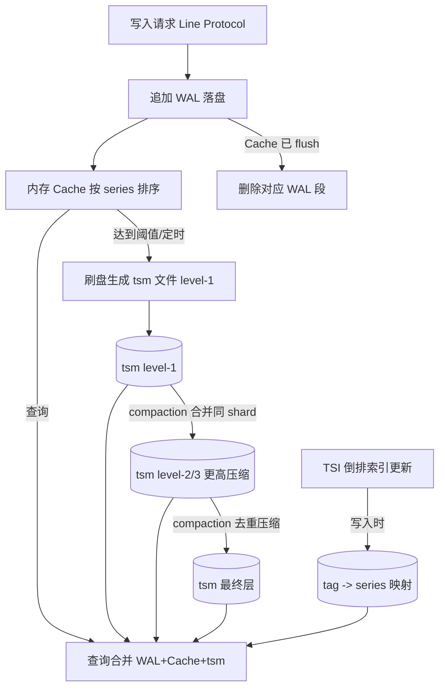
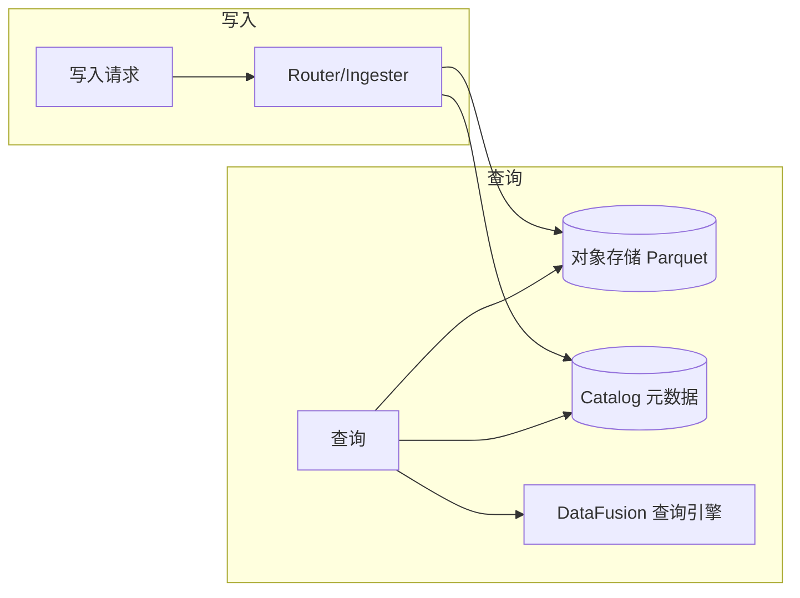
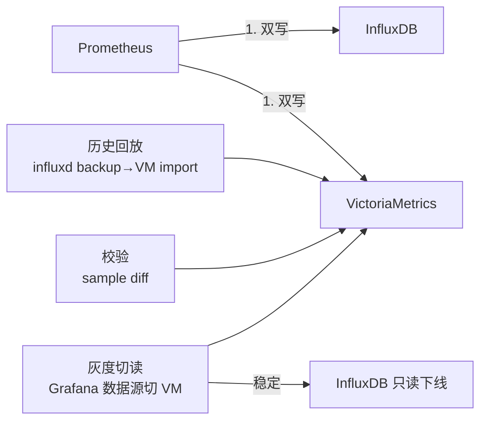
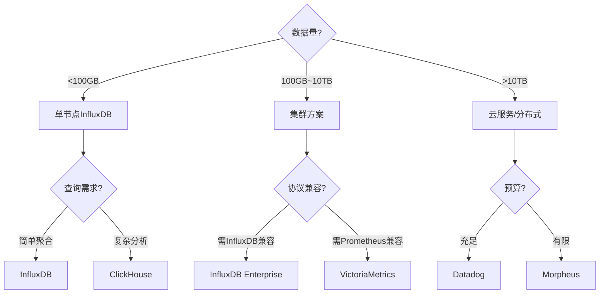
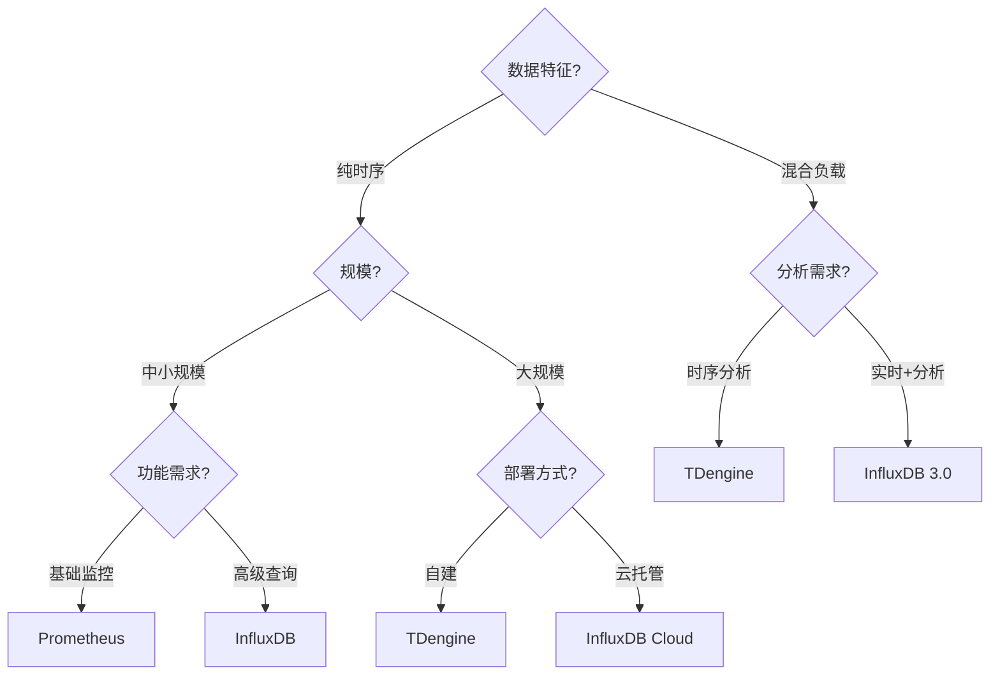
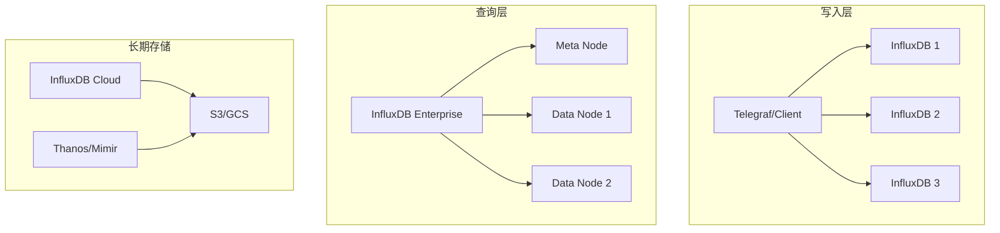

# InfluxDB 详解

> 时序库板块子文档。概述见 [README](./README.md)。

InfluxDB 是目前最流行的开源时序数据库之一，由 InfluxData 用 Go 语言开发，专为**高吞吐指标写入 + 时间区间聚合查询**设计。本文覆盖 v1.x 与 v2.x/IOx 的关键差异、数据模型、读写、存储引擎与实战。

---

## 1. 定位与适用场景

### 1.1 定位

- 面向 **metrics（监控指标）** 与 **IoT 设备数据** 的专用 TSDB。
- 强调：高写入吞吐、按时间的高效聚合、类 SQL 查询、自带保留策略与连续查询（降采样）。
- 生态完善：Telegraf（采集）、Chronograf（早期可视）、Kapacitor（告警）、Grafana 集成度高。

### 1.2 适用场景

| 场景 | 说明 |
|------|------|
| 服务器 / 容器监控 | CPU、内存、网络指标采集与可视化 |
| 应用指标（APM） | QPS、延迟、错误率 |
| IoT 传感器 | 温度、湿度、压力等高频上报 |
| 实时仪表盘 | 配合 Grafana 做近实时监控大屏 |
| 短期分析与告警 | 基于 CQ/Task 做阈值告警与降采样 |

### 1.3 不适用

- 需要强事务、跨表 JOIN 的复杂业务 → 用关系型。
- 需要全文检索、文档型灵活结构 → Elasticsearch / MongoDB。
- 超长周期（年）需要极低成本的极冷归档 → 可降采样后落对象存储或列式数仓。

---

## 2. 数据模型

### 2.1 v1.x 模型

层级关系（自顶向下）：

```text
database
 └── retention policy (RP)        # 数据保留策略
      └── measurement             # 指标（类似表）
           ├── tag set            # 维度键值对（索引）
           ├── field set          # 数值（不索引）
           └── timestamp          # 时间戳
```

- **database**：逻辑库。
- **retention policy**：数据保留规则，可为一个库配置多个 RP。
- **measurement**：指标集合名。
- **tag**：字符串维度，**可索引**、可过滤/分组；取值应有限。
- **field**：数值，支持 float/int/string/bool，**不索引**。
- **timestamp**：默认纳秒精度，可选 RFC3339 / epoch。

### 2.2 v2.x / IOx 模型

v2.x 引入「桶（bucket）」概念，合并了 database + RP 的语义；v3（IOx 引擎）底层改为 **Parquet + Catalog（基于 Apache Arrow DataFusion）**，用对象存储做持久化，更利于云原生与 SQL 分析。

```text
organization
 └── bucket          # 相当于 database + 默认 RP 的合体
      └── measurement
           ├── tag set
           ├── field set
           └── timestamp
```

| 维度 | v1.x (TSM) | v2.x / IOx (v3) |
|------|------------|-----------------|
| 顶层对象 | database | bucket |
| 存储格式 | TSM 自研文件 | Parquet + Catalog |
| 查询语言 | InfluxQL + Flux | Flux + SQL（IOx 支持 SQL） |
| 引擎目标 | 单机高性能 | 分布式、对象存储、分析友好 |

### 2.3 tag vs field 关键区别（必读）

| 比较项 | tag | field |
|--------|-----|-------|
| 类型 | 字符串 | float/int/string/bool |
| 是否索引 | **是**（进 TSI 倒排索引） | **否** |
| 能否 WHERE 过滤 | 能，且高效 | 能，但需扫数据 |
| 能否 GROUP BY | 能 | 不能 |
| 能否聚合 | 不能（维度） | 能（sum/mean/max…） |
| 基数要求 | **必须低基数** | 可高基数 |
| 典型例子 | host、region、app | cpu_usage、mem_used |

> 记忆口诀：**「要过滤分组用 tag，要算数用 field；tag 是维度，field 是数值。」**

---

## 3. 写入

### 3.1 Line Protocol（行协议）

InfluxDB 的写入文本格式：

```text
<measurement>[,<tag_key>=<tag_value>[,...]] <field_key>=<field_value>[,...] [<timestamp>]
```

规则：

- measurement 与 tag set 之间用逗号，tag set 与 field set 之间用空格。
- 多个 field 用逗号分隔。
- tag value、field string 值需避免空格与逗号（必要时用双引号）。
- field value：数值默认 float；int 加 `i`（如 `42i`）；bool 用 `true/false`；string 用双引号。
- timestamp 为纳秒 epoch（可选，缺省用服务器时间）。

示例：

```text
cpu,host=web-01,region=cn-hz usage=83.5,load=1.2 1670000000000000000
mem,host=web-01 used=1024i,total=4096i
weather,city=hangzhou temp=21.3,desc="sunny"
```

### 3.2 写入方式一：CLI（v1）

```bash
# 写入单点
influx -database metrics -execute 'INSERT cpu,host=web-01,region=cn-hz usage=83.5'

# 从文件批量写
influx -database metrics -import -path /tmp/data.lineproto -precision s
```

### 3.3 写入方式二：HTTP API（v1）

```bash
# 写数据库 metrics，精确到秒
curl -i -XPOST 'http://localhost:8086/write?db=metrics&precision=s' \
  --data-binary 'cpu,host=web-01,region=cn-hz usage=83.5 1670000000'

# 批量（多行）
curl -i -XPOST 'http://localhost:8086/write?db=metrics' \
  --data-binary 'cpu,host=web-01 usage=83.5
cpu,host=web-02 usage=55.0
mem,host=web-01 used=1024i'
```

### 3.4 写入方式三：Telegraf（采集代理）

`telegraf.conf` 片段：

```toml
[[inputs.cpu]]
  percpu = false
  totalcpu = true
  collect_interval = "10s"

[[outputs.influxdb]]
  urls = ["http://localhost:8086"]
  database = "metrics"
  # v2 用如下配置
  # bucket = "metrics"
  # org = "my-org"
  # token = "$INFLUX_TOKEN"
```

### 3.5 写入方式四：v2 HTTP（bucket + token）

```bash
curl -i -XPOST 'http://localhost:8086/api/v2/write?org=my-org&bucket=metrics&precision=s' \
  -H "Authorization: Token <YOUR_TOKEN>" \
  --data-binary 'cpu,host=web-01 usage=83.5 1670000000'
```

> 实战建议：写入尽量**批量 + 并发 + 固定 schema**；避免每条一个 HTTP 请求。使用 gzip 压缩 body 可显著降低网络开销。

---

## 4. 查询

### 4.1 InfluxQL（类 SQL，v1 主力）

基础结构：

```sql
SELECT <field 或 聚合> FROM <measurement>
WHERE <tag 过滤> AND time >= <...>
GROUP BY time(<窗口>), <tag>
FILL(<填充策略>)
ORDER BY time DESC
LIMIT <n>
```

示例 1：查询某主机最近 1 小时 CPU，按 5 分钟聚合均值：

```sql
SELECT mean("usage") AS "avg_usage"
FROM "cpu"
WHERE "host" = 'web-01' AND time >= now() - 1h
GROUP BY time(5m), "region"
FILL(null)
```

示例 2：多 tag 过滤 + 时间区间：

```sql
SELECT max("usage")
FROM "cpu"
WHERE "region" = 'cn-hz' AND "host" =~ /web-.*/ AND time >= '2026-07-28T00:00:00Z' AND time <= '2026-07-28T23:59:59Z'
GROUP BY time(1h)
```

示例 3：`fill()` 处理空窗口（null / 0 / previous / linear）：

```sql
SELECT mean("usage") FROM "cpu"
WHERE time >= now() - 6h
GROUP BY time(10m) FILL(previous)
```

常用聚合：`mean`、`sum`、`count`、`min`、`max`、`median`、`percentile`、`stddev`、`first`、`last`、`difference`、`derivative`（求速率）。

### 4.2 Flux（v2 函数式管道）

Flux 是 InfluxData 自研的数据脚本语言，基于管道（`|>`）操作，能力比 InfluxQL 强（可跨 bucket、做变换、调用外部数据源）。

```js
from(bucket: "metrics")
  |> range(start: -1h)
  |> filter(fn: (r) => r._measurement == "cpu" and r.host == "web-01")
  |> filter(fn: (r) => r._field == "usage")
  |> aggregateWindow(every: 5m, fn: mean, createEmpty: true)
  |> yield(name: "avg_usage")
```

关键算子：

- `from(bucket:)`：指定数据源。
- `range(start:, stop:)`：时间窗口。
- `filter(fn:)`：行级过滤（替代 WHERE）。
- `aggregateWindow(every:, fn:)`：按时间窗口聚合（替代 `GROUP BY time()`）。
- `group(columns:)` / `pivot()` / `join()`：分组与关联。
- `map()` / `fill()` / `window()`：变换。

### 4.3 InfluxQL vs Flux 差异

| 维度 | InfluxQL | Flux |
|------|----------|------|
| 风格 | 声明式类 SQL | 函数式管道 |
| 跨 bucket/源 | 弱 | 强（可 join 多源） |
| 复杂变换 | 有限 | 丰富（map/filter/reduce） |
| 学习成本 | 低（会 SQL 即可） | 中高 |
| 性能 | 成熟稳定 | 早期偏慢，IOx 下改善 |
| 生态 | v1 主流 | v2/v3 推荐，IOx 还支持 SQL |

---

## 5. 存储引擎 TSM Tree

InfluxDB v1/v2（非 IOx）使用自研的 **TSM（Time-Structured Merge Tree）** 引擎。

### 5.1 核心组件

| 组件 | 作用 |
|------|------|
| **WAL（Write-Ahead Log）** | 写入先追加到 WAL，崩溃可恢复，保证持久性 |
| **Cache（内存缓存）** | 内存中按 series 排序的待落盘点，查询会合并 WAL+Cache+磁盘 |
| **TSI（Time Series Index）** | 磁盘化倒排索引，支撑 tag 高效检索与高基数 |
| **tsm file** | 不可变的有序数据文件（列式压缩存储 field） |
| **Compaction** | 后台合并 tsm 文件、压缩、去重、生成下采样 |

### 5.2 写入与 Compaction 流程



要点：

- 写入路径是**顺序追加**，因此吞吐极高。
- Cache 满或 WAL 过大触发 flush，生成不可变 tsm 文件。
- Compaction 后台进行：合并小文件、按 series 排序、应用 Delta/XOR 压缩、删除过期/重复点。
- TSI 让 tag 过滤无需扫描全部 series，是支撑高基数查询的关键。

---

## 6. 保留策略 RP、连续查询 CQ、Shard Group

### 6.1 保留策略（Retention Policy）

定义数据保存时长与 shard 时长：

```sql
-- 创建 RP：保留 30 天，shard group 1 天，设为默认
CREATE RETENTION POLICY "rp_30d" ON "metrics"
DURATION 30d REPLICATION 1 SHARD DURATION 1d DEFAULT;

-- 修改保留时长
ALTER RETENTION POLICY "rp_30d" ON "metrics" DURATION 90d;
```

### 6.2 Shard Group Duration

shard group 是数据按时间分片的单位，决定单个 shard 覆盖的时间跨度（如 1d / 7d）。设得太小会产生过多 shard；太大则过期粒度粗。经验：

| 保留时长 | 建议 shard duration |
|----------|---------------------|
| < 2 天 | 1h / 1d |
| 2 天 ~ 6 月 | 1d |
| > 6 月 | 7d |

### 6.3 连续查询 CQ（降采样）

CQ 在后台定时把原始高精度数据聚合成粗粒度并写入目标 RP，实现降采样与空间节省。

```sql
-- 每 30 天把 1 分钟数据聚合为 1 小时均值，写入 rp_1y
CREATE CONTINUOUS QUERY "cq_cpu_1h" ON "metrics"
BEGIN
  SELECT mean("usage") AS "usage_avg"
  INTO "metrics"."rp_1y"."cpu_1h"
  FROM "metrics"."rp_30d"."cpu"
  GROUP BY time(1h), *
END;
```

查询长期趋势时改读 `cpu_1h` 即可，既快又省。

> v2 中 CQ 被 **Tasks（Flux 任务）+ 通知/检查** 取代，但思想一致：定时聚合 → 落新 bucket。

---

## 7. 集群与高可用

| 版本 | 集群能力 | 说明 |
|------|----------|------|
| **v1 OSS** | 单机 | 开源版无原生集群，靠副本/备份 |
| **v1 Enterprise** | 原生集群（meta + data 节点） | 商业版，支持分片与副本 |
| **v2 单机** | 单机 | 开源 OSS 仍是单机为主 |
| **v3 IOx** | 云原生分布式 | 基于对象存储 + Catalog，列式 Parquet，支持水平扩展与 SQL |

IOx 架构核心变化：



特点：计算与存储分离，持久层用廉价的对象存储（S3/OSS），元数据用 Catalog，天然适合云上弹性伸缩。

---

## 8. 与 Prometheus 对接

InfluxDB 可作为 Prometheus 的 **远程存储（remote write/read）** 后端，解决 Prometheus 本地 TSDB 长期存储成本高的问题。

`prometheus.yml` 配置：

```yaml
remote_write:
  - url: "http://localhost:8086/api/v1/prom/write?db=metrics&rp=rp_30d"
    # v2: url: http://localhost:8086/api/v2/write?org=my-org&bucket=metrics
    queue_config:
      max_samples_per_send: 1000
      batch_send_deadline: 5s

remote_read:
  - url: "http://localhost:8086/api/v1/prom/read?db=metrics"
```

- Prometheus 采集的指标（label 模型）写入 InfluxDB 后，measurement 即指标名，label 即 tag。
- 也可反向：用 InfluxDB 收集，Grafana 同时连 Prometheus 与 InfluxDB 做统一看板。
- 大流量场景更推荐 **VictoriaMetrics** 作为 Prom 长期存储（压缩率更高、资源更省）。

---

## 9. 部署与实战建议、常见踩坑

### 9.1 部署建议

`influxdb.conf` 关键项（v1 示例）：

```toml
[data]
  dir = "/var/lib/influxdb/data"
  wal-dir = "/var/lib/influxdb/wal"
  # 索引类型：tsi1 支持更高基数
  index-version = "tsi1"
  # 缓存阈值，达到则 flush
  cache-max-memory-size = "1g"
  max-series-per-database = 0   # 0 表示不限，但需自行控制基数

[retention]
  enabled = true
```

Docker 快速启动：

```bash
docker run -d --name influxdb \
  -p 8086:8086 \
  -v $PWD/influxdb:/var/lib/influxdb \
  influxdb:1.8
```

### 9.2 实战建议清单

1. **固定 schema，批量写入**，每批数百~数千点，并发控制合理。
2. **tag 基数前置评估**：序列数 = measurement × tag 取值笛卡尔积，上线前估算。
3. **分层 RP + CQ 降采样**：原始短保留、聚合长保留。
4. **监控 InfluxDB 自身**：series cardinality、shard 数、compaction 耗时、WAL 大小。
5. **查询加时间下界**：务必 `WHERE time >= ...`，否则全量扫。

### 9.3 三大经典踩坑

| 坑 | 现象 | 根因 | 解决 |
|----|------|------|------|
| **tag cardinality 爆炸** | 内存暴涨、写入变慢、OOM | 把 request_id/user_id 等高基数字符串设为 tag | 改为 field；或用哈希分桶降基数 |
| **字段当 tag 用** | 无法聚合、存储膨胀 | 把本应聚合的数值设成 tag | 数值一律放 field |
| **RP 误设** | 数据莫名其妙消失 / 磁盘爆满 | RP 过短导致误删，或过长无降采样 | 按冷热分层配置多 RP + CQ |

> 反例：`weather,city=hangzhou,user_id=12345 temp=21.3` —— `user_id` 是超高基数，绝不可作 tag。应写成 `weather,city=hangzhou temp=21.3,user_id="12345"`（`user_id` 作 field，若确实需要）。

---

## 10. 与其他 TSDB 简短对比

| 对比项 | InfluxDB | Prometheus | TimescaleDB | TDengine | VictoriaMetrics |
|--------|----------|------------|-------------|----------|-----------------|
| 查询语言 | InfluxQL/Flux/SQL(IOx) | PromQL | SQL | SQL | PromQL/MetricSQL |
| 集群 | OSS 单机，IOx 云原生 | 联邦/远程写 | PG 复制 | 原生分布式 | 集群版 |
| 压缩 | 强 | 中 | 中 | 极强 | 极强 |
| 生态 | Telegraf 成熟 | 云原生标配 | PG 生态 | 国产 IoT | Prom 兼容 |
| 优势 | 易用、监控/IoT 友好 | K8s 监控事实标准 | 关系+时序一体 | 海量设备 | 省资源、大流量 |
| 劣势 | OSS 无原生集群 | 长保留贵 | 时序能力弱于专用 | 生态偏国内 | PromQL 学习曲线 |

**选型一句话**：

> 要开箱即用做监控/IoT → InfluxDB；已在 K8s 用 Prom → 配 VictoriaMetrics 做长期存储；偏 SQL 且要 JOIN → TimescaleDB；设备海量+国产化 → TDengine。

---

## 参考

- 官方文档：<https://docs.influxdata.com/>
- FB Gorilla 论文（XOR 压缩）：*Gorilla: A Fast, Scalable, In-Memory Time Series Database*
- 板块概述：[时序库 README](./README.md)

---

## 11. 运维实战与性能调优

### 11.1 集群运维（IOx 云原生）

IOx 引擎下 InfluxDB 走向「计算存储分离」：Router/Ingester 接收写入并写对象存储（S3/OSS），Catalog 记录元数据，Querier 基于 DataFusion 查询 Parquet。

```bash
# docker 启动 IOx（单机伪集群，便于验证）
docker run -d --name influxdb-iox \
  -p 8086:8086 -p 8082:8082 \
  -e INFLUXDB_IOX_OBJECT_STORE=file \
  -e INFLUXDB_IOX_DB_DIR=/var/lib/influxdb-iox \
  influxdb:3.0-iox
```

运维要点：
- **对象存储是持久层**，其可用性与延迟直接决定写入吞吐，建议用高可靠 OSS/S3 并监控 4xx/5xx。
- **Catalog 后端**（Postgres/SQLite）是关键元数据，需备份与高可用。
- 水平扩展 = 加 Ingester/Querier 实例 + 共享同一对象存储与 Catalog。

### 11.2 Shard 规划

shard group duration 决定单个 shard 的时间跨度，影响过期粒度与文件数：

```sql
-- 写入密集场景：保留 90 天，shard 7 天，减少 shard 数量
CREATE RETENTION POLICY "rp_90d" ON "metrics"
DURATION 90d REPLICATION 1 SHARD DURATION 7d DEFAULT;
```

| 保留时长 | shard duration | 说明 |
|----------|----------------|------|
| < 2d | 1h/1d | 避免 shard 过多 |
| 2d~6M | 1d | 默认均衡 |
| > 6M | 7d | 降低文件与 compaction 压力 |

> 反例：保留 1 年却用 1h shard → 产生 8760 个 shard，元数据与查询规划开销剧增。

### 11.3 Cardinality 治理

```bash
# 查看各 measurement 的 series 数（诊断基数）
influx -database metrics -execute 'SHOW SERIES CARDINALITY'
influx -database metrics -execute 'SHOW MEASUREMENT CARDINALITY'

# 查看具体高基数 tag 组合
influx -database metrics -execute 'SHOW TAG VALUES CARDINALITY FROM "cpu" WITH KEY = "host"'
```

治理手段：
- 把 `request_id`、`user_id` 等高基数列从 tag 移到 field。
- 用连续查询/Task 做降采样，聚合后只保留低频维度。
- 设置 `max-series-per-database` 上限做硬性熔断（需评估业务）。
- 定期 `DROP SERIES WHERE ...` 清理已退场设备序列，回收索引。

### 11.4 备份与恢复

```bash
# 离线备份整个 InfluxDB 数据目录（停机或低峰）
influxd backup /tmp/influxdb-backup

# 备份指定数据库
influxd backup -database metrics /tmp/metrics-backup

# 恢复
influxd restore -database metrics -metadir /var/lib/influxdb/meta \
  -datadir /var/lib/influxdb/data /tmp/metrics-backup
```

> 生产建议：结合对象存储做定期 `influxd backup` + 二进制目录快照；IOx 下直接备份对象存储 bucket 与 Catalog 库即可。

### 11.5 与 Grafana / Telegraf 全链路

```toml
# telegraf.conf：采集并写 InfluxDB + 同时暴露 Prometheus 端点
[[outputs.influxdb]]
  urls = ["http://influxdb:8086"]
  database = "metrics"

[[outputs.prometheus_client]]
  listen = ":9273"
```

```json
// Grafana 数据源配置（influxdb 数据源）
{
  "name": "InfluxDB",
  "type": "influxdb",
  "url": "http://influxdb:8086",
  "database": "metrics",
  "access": "proxy"
}
```

全链路健康 checklist：
- [ ] Telegraf `flush` 间隔与 batch 大小匹配写入峰值。
- [ ] Grafana 查询带时间下界，避免全量扫。
- [ ] 监控 Telegraf `write.errors`、InfluxDB `writeReq` 延迟。

### 11.6 常见故障排查

| 症状 | 可能根因 | 排查/处置 |
|------|----------|-----------|
| 写入延迟飙升 | cardinality 爆炸 / WAL 堆积 | `SHOW SERIES CARDINALITY`；扩容或降基数 |
| 内存 OOM | 高基数 tag / cache 过大 | 降基数；调小 `cache-max-memory-size` |
| 查询超时 | 全量扫 / shard 过多 | 加 `time >=` 下界；调整 shard duration |
| 数据消失 | RP 误设过短 | 检查 RP；重配多 RP + CQ |
| compaction 卡住 | 磁盘 IO 瓶颈 | 监控 `compactions.active`；换 SSD |

### 11.7 迁移与升级

- **v1 → v2**：用 `influx_inspect export` 导出 line protocol，再 v2 CLI 导入；注意 database→bucket 映射。
- **v1 → IOx(v3)**：通过远程读/双写过渡；IOx 支持 SQL，旧 Flux 脚本需评估迁移成本。
- 大版本升级前必须备份 meta + data 目录，并在隔离环境验证查询兼容性。

---

## 12. 第三轮深度实战（基准 / 迁移 / 告警 / 流计算 / 成本 / 排障 SOP）

### 12.1 性能基准（TSBS 实测数字 / 推导）

TSBS `cpu-only` 场景（每主机 100 指标，单机 NVMe）公开结论区间：

| 指标 | InfluxDB TSM 2.x | 说明 |
|------|------------------|------|
| 写入吞吐 | ~20~50 万 metrics/s | 批量+并发，纳秒精度下略降 |
| 单点查询 P99 | < 10 ms | 带时间下界、命中 TSI |
| 大范围聚合 | 中 | shard 多则慢，需降采样 |
| 压缩比 | 4~10:1 | Delta/XOR + Snappy |

推导公式（用于自测预估）：

```text
目标吞吐(点/s) = 主机数 × 100(指标) / scrape_interval(s)
例：1000 主机、10s 抓 → 1000×100/10 = 1,000,000 点/s
→ 需分布式 IOx 或双写分流，单机 TSM 易到天花板
```

建议：上线前用 TSBS 在自身机型跑 `cpu-only`+`devops`，记录 `inserts/s`、磁盘、查询 P99，作为容量基线。

### 12.2 迁移实战：InfluxDB → VictoriaMetrics 双写切换 SOP

适用：用 InfluxDB 做 Prom 远程存储，想换 VM 省成本。



SOP 步骤：
1. **双写**：Prometheus `remote_write` 同时指向 InfluxDB 与 VM；VM 开启 `-dedup.minScrapeInterval` 防重复。
2. **回放**：用 `influxd backup` 导出历史，经 line protocol 写入 VM（VM 兼容 Influx 行协议 `/write`）。
3. **校验**：用脚本抽样比对两库同一 `(metric, labels, ts)` 的值，允许浮点误差 < 1e-6。
4. **切读**：Grafana 数据源先 5% 看板切 VM，观察 48h 无缺数/抖动。
5. **下线**：InfluxDB 置只读，观察 7 天，确认后停写释放资源。

```yaml
# prometheus.yml 双写片段
remote_write:
  - url: http://influxdb:8086/api/v1/prom/write?db=metrics
  - url: http://vminsert:8480/insert/0/prometheus/api/v1/write
    queue_config: { max_samples_per_send: 10000, capacity: 100000 }
```

### 12.3 与监控 / Grafana 全链路告警规则示例

Grafana 统一告警（InfluxDB 数据源 + Flux 阈值检查）：

```yaml
# grafana 告警规则（unified alerting，HTTP 配置示意）
apiVersion: 1
groups:
  - name: influxdb_cpu_alert
    rules:
      - alert: HighCPU
        expr: |
          from(bucket:"metrics") |> range(start:-5m)
          |> filter(fn:(r)=> r._measurement=="cpu" and r._field=="usage")
          |> mean() |> filter(fn:(r)=> r._value > 85)
        for: 5m
        labels: { severity: warning }
        annotations:
          summary: "主机 {{ $labels.host }} CPU 持续 >85%"
```

Kapacitor 阈值（TICK 脚本片段）：

```js
stream
  |from().measurement('cpu').where(lambda: "host" == 'web-01')
  |alert()
    .warn(lambda: "usage" > 80)
    .crit(lambda: "usage" > 90)
    .slack()
```

全链路健康 Checklist：
- [ ] Telegraf `flush` 间隔匹配峰值；`write.errors` = 0。
- [ ] InfluxDB `writeReq` 延迟 P99 < 1s；WAL 不持续增长。
- [ ] Grafana 查询均带 `time >=` 下界，避免全量扫。

### 12.4 与 Flink / Spark 实时计算联动代码

Spark 读 InfluxDB 2.x（Scala，使用 influxdb-spark 或 JDBC）：

```scala
// 通过 DataFrame 读取 InfluxDB（2.x Flux 结果）
val df = spark.read
  .format("influxdb")
  .option("url", "http://influxdb:8086")
  .option("token", sys.env("INFLUX_TOKEN"))
  .option("org", "my-org")
  .option("query", """from(bucket:"metrics")|>range(start:-1h)|>filter(r=>r._measurement=="cpu")""")
  .load()
df.groupBy("host").avg("_value").show()
```

Flink SQL 将聚合结果写回 InfluxDB（行协议 sink）：

```sql
CREATE TABLE influx_sink (
  host STRING,
  avg_cpu DOUBLE,
  window_end TIMESTAMP(3)
) WITH (
  'connector' = 'influxdb',
  'url' = 'http://influxdb:8086',
  'database' = 'metrics',
  'measurement' = 'cpu_agg'
);
INSERT INTO influx_sink
SELECT host, AVG(usage), TUMBLE_END(ts, INTERVAL '1' MINUTE)
FROM cpu_stream GROUP BY host, TUMBLE(ts, INTERVAL '1' MINUTE);
```

联动要点：Flink 侧做窗口聚合/富化后再落 InfluxDB，减少查询期 JOIN；明细与聚合分 measurement 存储。

### 12.5 成本优化（冷热分层 / 降采样 / 保留策略）

```sql
-- 多档 RP：原始 30d 热，1m 聚合 90d，1h 聚合 1y
CREATE RETENTION POLICY "rp_hot"  ON metrics DURATION 30d  REPLICATION 1 SHARD DURATION 1d DEFAULT;
CREATE RETENTION POLICY "rp_90d"  ON metrics DURATION 90d  REPLICATION 1 SHARD DURATION 7d;
CREATE RETENTION POLICY "rp_1y"   ON metrics DURATION 365d REPLICATION 1 SHARD DURATION 7d;

CREATE CONTINUOUS QUERY "cq_1m" ON metrics
BEGIN
  SELECT mean("usage") INTO "metrics"."rp_90d"."cpu_1m"
  FROM "metrics"."rp_hot"."cpu" GROUP BY time(1m), *
END;

CREATE CONTINUOUS QUERY "cq_1h" ON metrics
BEGIN
  SELECT mean("usage") INTO "metrics"."rp_1y"."cpu_1h"
  FROM "metrics"."rp_90d"."cpu_1m" GROUP BY time(1h), *
END;
```

IOx 下直接把 Parquet 落对象存储（S3/OSS），热数据用 SSD、冷数据用对象存储，成本降至块存储 1/10 量级。

### 12.6 生产排障 SOP

**Cardinality 治理 SOP**
- [ ] `SHOW SERIES CARDINALITY` 定位高基数 measurement。
- [ ] 把 `request_id`/`user_id` 等从 tag 移至 field；如必须保留，用 `hash(user_id)%100` 分桶。
- [ ] 设 `max-series-per-database` 硬上限做熔断；`DROP SERIES` 清理退场设备。

**写入拒绝（write rejected / 429）SOP**
- [ ] 查 `SHOW STATS` 的 `writeErrors`、WAL 大小、磁盘剩余。
- [ ] 升 `cache-max-memory-size` 或加节点；临时降抓取频率缓解。
- [ ] IOx 查对象存储 4xx/5xx，必要时提 IO/限流。

**查询超时 SOP**
- [ ] 确认查询带 `time >=` 下界；缩小时间窗与 tag 过滤。
- [ ] 调整 shard duration（避免 1 年数据用 1h shard）。
- [ ] 大查询走聚合 RP，避免对 `rp_hot` 做跨月明细扫。

---

## 二十三、InfluxDB 3.0 架构演进

### 23.1 架构变化

| 维度 | InfluxDB 1.x | InfluxDB 2.x | InfluxDB 3.0 |
|------|--------------|--------------|--------------|
| 存储引擎 | TSI + WAL | TSI + WAL | Apache Arrow + DataFusion |
| 查询语言 | InfluxQL | Flux | SQL + InfluxQL |
| 存储格式 | TSM | TSM | Parquet（对象存储） |
| 扩展性 | 单节点 | 单节点 | 分布式（IOx） |
| 部署模式 | 单节点 | 单节点 | 云原生（SaaS） |

### 23.2 InfluxDB 3.0 核心特性

```text
InfluxDB 3.0（IOx）：
  - 基于 Apache Arrow 内存格式
  - 使用 DataFusion 查询引擎
  - Parquet 格式存储到对象存储（S3/GCS）
  - 支持 SQL 查询
  - 列式存储，压缩比高
  - 流式写入，实时查询
```

## 二十四、Flux vs InfluxQL 对比

| 特性 | InfluxQL | Flux |
|------|----------|------|
| 语法风格 | SQL-like | 函数式 |
| 聚合函数 | 基础聚合 | 丰富聚合+转换 |
| 跨数据源 | 不支持 | 支持（多数据源联合查询） |
| 脚本能力 | 无 | 支持脚本 |
| 学习曲线 | 低 | 高 |
| 性能 | 高（优化好） | 中（需优化） |

```flux
// Flux 查询示例
from(bucket: "mydb")
  |> range(start: -1h)
  |> filter(fn: (r) => r._measurement == "cpu")
  |> filter(fn: (r) => r._field == "usage_idle")
  |> aggregateWindow(every: 5m, fn: mean)
  |> yield(name: "mean")
```

## 二十五、Continuous Query 与降采样

### 25.1 降采样策略

| 时间粒度 | 保留策略 | 适用 |
|----------|----------|------|
| 原始数据 | rp_hot（7天） | 实时查询 |
| 5分钟聚合 | rp_warm（30天） | 近期分析 |
| 1小时聚合 | rp_cold（1年） | 历史趋势 |
| 1天聚合 | rp_archive（永久） | 长期归档 |

### 25.2 降采样配置

```sql
-- 创建降采样任务
CREATE CONTINUOUS QUERY "cq_cpu_5m" ON "mydb"
BEGIN
  SELECT mean("usage_idle") AS "usage_idle_mean"
  INTO "rp_warm"."cpu_5m"
  FROM "cpu"
  GROUP BY time(5m), "host"
END

-- 创建降采样任务（1小时）
CREATE CONTINUOUS QUERY "cq_cpu_1h" ON "mydb"
BEGIN
  SELECT mean("usage_idle_mean") AS "usage_idle_mean"
  INTO "rp_cold"."cpu_1h"
  FROM "rp_warm"."cpu_5m"
  GROUP BY time(1h), "host"
END
```

## 二十六、InfluxDB 集群方案

| 方案 | 说明 | 适用 |
|------|------|------|
| InfluxDB Enterprise | 官方集群版 | 大规模生产 |
| InfluxDB Cloud | SaaS托管 | 云原生 |
| InfluxDB 3.0 IOx | 新架构分布式 | 未来方向 |
| 单节点+外部扩展 | Thanos/VictoriaMetrics | 替代方案 |

## 二十七、时序库选型决策树



## 二十八、性能调优清单

| 调优点 | 方法 | 效果 |
|--------|------|------|
| Shard Duration | 按查询时间范围调整 | 减少扫描数据 |
| 压缩算法 | 使用Zstandard | 提高压缩比 |
| 缓存大小 | 增加TSM缓存 | 提高读性能 |
| 并行查询 | 启用并行执行 | 加速复杂查询 |
| 索引优化 | 使用时间索引 | 加速时间范围查询 |

---

## 二十九、InfluxDB 3.0 架构演进（IOx / Parquet / 对象存储）

### 29.1 架构演进

| 版本 | 存储引擎 | 架构 | 特点 |
|------|---------|------|------|
| 1.x | TSM | 单机 | 简单、有限扩展 |
| 2.x | TSM | 单机/集群 | 增强查询、任务 |
| 3.0 | IOx+Parquet | 分布式 | 云原生、列存、对象存储 |

### 29.2 InfluxDB 3.0 核心组件

```text
InfluxDB 3.0 架构：
  IOx（查询引擎）：
    - Apache Arrow 列存格式
    - DataFusion 查询引擎
    - 支持 SQL 和 InfluxQL
  
  Parquet（存储格式）：
    - 列式存储
    - 高压缩比
    - 列式查询优化
  
  对象存储（S3/GCS）：
    - 成本低
    - 无限扩展
    - 持久化保障

数据流：
  写入 → Arrow → WAL → Parquet → 对象存储
  查询 → Arrow → DataFusion → 结果
```

## 三十、Flux 查询语言与 InfluxQL 对比

### 30.1 查询语言对比

| 维度 | InfluxQL | Flux |
|------|---------|------|
| 语法风格 | SQL-like | 函数式 |
| 功能范围 | 基础查询+聚合 | 高级分析+脚本 |
| 跨数据源 | 有限 | 支持多数据源 |
| 学习曲线 | 低 | 中 |
| 性能 | 高（优化好） | 中（通用引擎） |

### 30.2 Flux 查询示例

```flux
// Flux 查询：按小时聚合
from(bucket: "my-bucket")
  |> range(start: -1h)
  |> filter(fn: (r) => r._measurement == "cpu")
  |> filter(fn: (r) => r._field == "usage_user")
  |> aggregateWindow(every: 1h, fn: mean)
  |> yield(name: "mean")

// Flux 跨数据源查询
from(bucket: "my-bucket")
  |> range(start: -1d)
  |> filter(fn: (r) => r._measurement == "sensor")
  |> join(tables: {temp: temperature, humidity: humidity})
  |> map(fn: (r) => ({_time: r._time, temp: r._value_temp, hum: r._value_humidity}))
```

## 三十一、连续查询（Continuous Query）vs Task 实现降采样

### 31.1 降采样方式对比

| 方式 | InfluxDB 版本 | 原理 | 适用 |
|------|--------------|------|------|
| Continuous Query | 1.x/2.x | 后台自动聚合 | 传统架构 |
| Task | 2.x/3.0 | Flux 脚本定时执行 | 现代架构 |

### 31.2 实现示例

```sql
-- Continuous Query（InfluxDB 1.x）
CREATE CONTINUOUS QUERY "cpu_1h" ON "mydb"
BEGIN
  SELECT MEAN("usage_user") AS "avg_user"
  INTO "cpu_1h"
  FROM "cpu"
  GROUP BY time(1h), *
END
```

```flux
// Flux Task（InfluxDB 2.x/3.0）
option task = {name: "downsample_cpu", every: 1h}

from(bucket: "my-bucket")
  |> range(start: -task.every)
  |> filter(fn: (r) => r._measurement == "cpu")
  |> aggregateWindow(every: 1h, fn: mean)
  |> to(bucket: "downsampled-bucket", org: "my-org")
```

## 三十二、InfluxDB 集群方案（Kubernetes Operator / K8s 部署）

### 32.1 集群部署方式

| 方式 | 架构 | 适用 |
|------|------|------|
| 单机 | 单节点 | 开发/测试 |
| K8s Operator | 分布式集群 | 生产环境 |
| InfluxDB Cloud | 全托管 SaaS | 云原生 |

### 32.2 InfluxDB Kubernetes Operator

```yaml
# InfluxDB 集群部署
apiVersion: influxdata.com/v1alpha1
kind: InfluxDB
metadata:
  name: influxdb-cluster
spec:
  size: 3
  image: influxdb:3.0
  storage:
    size: 100Gi
    storageClassName: fast-ssd
  resources:
    requests:
      cpu: "2"
      memory: "4Gi"
    limits:
      cpu: "4"
      memory: "8Gi"
```

## 三十三、InfluxDB vs Prometheus vs TDengine 选型决策树

### 33.1 选型决策树



### 33.2 选型对比

| 维度 | Prometheus | InfluxDB | TDengine |
|------|-----------|----------|----------|
| 数据模型 | 指标 | 指标+事件 | 超级表 |
| 查询语言 | PromQL | InfluxQL/Flux | SQL |
| 存储引擎 | 本地TSDB | TSM/IOx | 时序引擎 |
| 扩展性 | 联邦/Thanos | 单机/集群 | 原生集群 |
| 适用场景 | K8s监控 | IoT/DevOps | 大规模IoT |

## InfluxDB TSM 引擎深度优化

### TSM 存储结构

```text
TSM（Time-Structured Merge Tree）存储结构：
  写入路径：
    Point → WAL（预写日志）→ Cache（内存缓存）
    Cache 满/定时刷盘 → TSM 文件（磁盘）

  TSM 文件结构：
    ┌─────────────────────────────────┐
    │ Header（魔数+版本）              │
    ├─────────────────────────────────┤
    │ Block 1: 时间序列 A 数据块       │
    │ Block 2: 时间序列 B 数据块       │
    │ ...                              │
    │ Block N: 时间序列 N 数据块       │
    ├─────────────────────────────────┤
    │ Index（稀疏索引）               │
    ├─────────────────────────────────┤
    │ Footer（索引偏移量）             │
    └─────────────────────────────────┘

  Compaction 流程：
    Level 0: 小 TSM 文件 → 合并 → Level 1
    Level 1: 中等文件 → 合并 → Level 2
    Level 2: 大文件 → 合并 → Level 3（最终形态）
```

### TSM 调优参数

| 参数 | 默认值 | 推荐值 | 说明 |
|------|--------|--------|------|
| cache-snapshot-memory-size | 25MB | 64MB | Cache 快照内存大小 |
| cache-snapshot-write-cold-duration | 10m | 5m | 冷数据刷盘间隔 |
| compact-throughput | 48MB/s | 64MB/s | Compaction 吞吐限制 |
| compact-throughput-burst | 48MB/s | 128MB/s | Compaction 突发吞吐 |
| max-concurrent-compactions | 0 | 2 | 最大并发 Compaction 数 |
| tsm1-wal-fsync-delay | 0s | 100ms | WAL fsync 延迟 |

```toml
# influxdb.conf 调优配置
[data]
  cache-snapshot-memory-size = "64m"
  cache-snapshot-write-cold-duration = "5m"
  compact-throughput = "64m"
  compact-throughput-burst = "128m"
  max-concurrent-compactions = 2
  max-index-log-file-size = "1m"
  series-id-set-cache-size = 100
```

## Continuous Query 与 Task 对比

### CQ（1.x）vs Task（2.x）

| 维度 | Continuous Query | Task |
|------|-----------------|------|
| 版本 | InfluxDB 1.x | InfluxDB 2.x |
| 语法 | InfluxQL | Flux |
| 调度 | 自动 | Cron 表达式 |
| 灵活性 | 低（仅聚合） | 高（任意 Flux 脚本） |
| 监控 | 有限 | 内置任务日志 |
| 资源控制 | 无 | 可限制执行时间 |

```flux
// Flux Task 示例：每 5 分钟聚合一次 CPU 使用率
option task = {name: "cpu_5m_avg", every: 5m}

from(bucket: "metrics")
  |> range(start: -10m)
  |> filter(fn: (r) => r._measurement == "cpu" and r._field == "usage_user")
  |> aggregateWindow(every: 5m, fn: mean, createEmpty: false)
  |> to(bucket: "metrics_agg", org: "myorg")
```

```sql
-- InfluxQL Continuous Query 示例（1.x）
CREATE CONTINUOUS QUERY "cq_cpu_5m" ON "metrics"
BEGIN
  SELECT mean("usage_user") INTO "cpu_5m" FROM "cpu"
  GROUP BY time(5m), *
END
```

## InfluxDB 高可用与集群方案

### HA 部署架构



| 方案 | 版本 | 扩展方式 | 适用场景 |
|------|------|---------|---------|
| 单机 + 副本 | OSS | 无 | 开发测试 |
| Enterprise 集群 | Enterprise | 水平扩展 | 生产中等规模 |
| InfluxDB Cloud | Cloud | 自动扩展 | 大规模云部署 |
| InfluxDB + Thanos | OSS + Thanos | 对象存储 | 长期存储 |

### Kubernetes Operator 部署

```yaml
# influxdb-cluster Helm values
apiVersion: v1
kind: ConfigMap
metadata:
  name: influxdb-config
data:
  influxdb.conf: |
    [data]
      cache-max-memory-size = "1g"
      cache-snapshot-memory-size = "256m"
      max-concurrent-compactions = 4
    [coordinator]
      max-concurrent-queries = 20
      query-timeout = "30s"
    [retention]
      enabled = true

---
apiVersion: apps/v1
kind: StatefulSet
metadata:
  name: influxdb
spec:
  replicas: 3
  serviceName: influxdb
  selector:
    matchLabels:
      app: influxdb
  template:
    spec:
      containers:
      - name: influxdb
        image: influxdb:2.7
        ports:
        - containerPort: 8086
        volumeMounts:
        - name: data
          mountPath: /var/lib/influxdb2
  volumeClaimTemplates:
  - metadata:
      name: data
    spec:
      accessModes: ["ReadWriteOnce"]
      resources:
        requests:
          storage: 50Gi
```

## InfluxDB 数据导入导出

### 大批量数据迁移

```bash
# influx CLI 导出
influx backup /backup/path --host http://localhost:8086 --org myorg --bucket mybucket

# influx CLI 导入
influx restore /backup/path --host http://localhost:8086 --org myorg --bucket mybucket

# Line Protocol 批量导入
cat data.lp | influx write --bucket mybucket --precision ns

# 文件格式（Line Protocol）
# measurement,tag1=val1,tag2=val2 field1=123,field2="abc" 1640995200000000000
```

```python
# Python 批量导入示例
from influxdb_client import InfluxDBClient, Point, WritePrecision
from influxdb_client.client.write_api import SYNCHRONOUS

client = InfluxDBClient(url="http://localhost:8086", token="my-token", org="myorg")
write_api = client.write_api(write_options=SYNCHRONOUS)

points = []
for i in range(100000):
    point = Point("sensor") \
        .tag("device", f"device_{i % 100}") \
        .field("temperature", 20 + i * 0.01) \
        .field("humidity", 50 + i * 0.005) \
        .time(i, WritePrecision.MS)
    points.append(point)

# 分批写入（每批 5000 条）
for batch_start in range(0, len(points), 5000):
    batch = points[batch_start:batch_start + 5000]
    write_api.write(bucket="mybucket", record=batch)
```

## 三十四、InfluxDB 性能优化（Retention Policy / Shard Duration）

### 34.1 性能优化策略

| 策略 | 做法 | 效果 |
|------|------|------|
| Retention Policy | 自动过期旧数据 | 减少存储量 |
| Shard Duration | 按时间分片 | 减少扫描数据 |
| 压缩 | 启用压缩算法 | 减少存储空间 |
| 索引优化 | 时间索引 | 加速时间查询 |

### 34.2 配置示例

```sql
-- 创建 Retention Policy
CREATE RETENTION POLICY "7d" ON "mydb" 
  DURATION 7d REPLICATION 1 DEFAULT;

-- 创建 Shard Group
CREATE SUBSCRIPTION "sub" ON "mydb"."default" 
  DESTINATIONS ALL 'http://other-influxdb:8086';

-- InfluxDB 2.x 保留规则
influx delete --bucket my-bucket \
  --start 1970-01-01T00:00:00Z \
  --stop $(date -d '30 days ago' +%Y-%m-%dT%H:%M:%SZ)
```

## InfluxDB 最佳实践

| 实践 | 说明 | 收益 |
|------|------|------|
| 合理设计 Measurement | 避免高基数标签 | 减少存储压力 |
| 使用时间分区 | retention policy 自动清理 | 控制数据量 |
| 预计算连续查询 | CQ 自动聚合 | 查询加速 |
| 合理配置 Shard Group | 按时间窗口分片 | 写入均衡 |
| 使用 TSI 索引 | 倒排索引加速查询 | 查询性能 |

## InfluxQL 常用查询

```sql
-- 查询最近1小时数据
SELECT * FROM cpu WHERE time > now() - 1h

-- 按5分钟聚合
SELECT mean(usage_idle) FROM cpu WHERE time > now() - 1h GROUP BY time(5m)

-- 按主机分组
SELECT mean(usage_idle) FROM cpu WHERE time > now() - 1h GROUP BY host

-- 降采样（保留策略）
SELECT mean(usage_idle) INTO "cpu_5m" FROM cpu WHERE time > now() - 1h GROUP BY time(5m)

-- 连续查询
CREATE CONTINUOUS QUERY "cq_cpu_5m" ON "telegraf"
BEGIN
  SELECT mean(usage_idle) INTO "cpu_5m" FROM "cpu" GROUP BY time(5m), host
END
```

## Flux 脚本示例

```flux
// 查询最近1小时数据
from(bucket: "telegraf")
  |> range(start: -1h)
  |> filter(fn: (r) => r._measurement == "cpu")
  |> filter(fn: (r) => r._field == "usage_idle")
  |> aggregateWindow(every: 5m, fn: mean)
  |> yield(name: "mean")

// 多数据源合并
from(bucket: "telegraf")
  |> range(start: -1h)
  |> filter(fn: (r) => r._measurement == "cpu" or r._measurement == "memory")
  |> pivot(rowKey: ["_time"], columnKey: ["_field"], valueColumn: "_value")
  |> yield(name: "merged")
```

## InfluxDB 常见问题排查

### 写入失败排查

```
写入失败排查：
  1. 检查连接
     → 网络是否通畅
     → 端口是否开放
     → 认证是否正确

  2. 检查数据格式
     → Line Protocol 格式
     → 时间戳精度
     → 字段类型

  3. 检查存储
     → 磁盘空间
     → 保留策略
     → Shard 状态

  4. 检查日志
     → 错误日志
     → 慢查询日志
```

### 查询性能优化

| 优化项 | 方法 | 效果 |
|--------|------|------|
| 时间范围 | 缩小查询范围 | 减少数据量 |
| 聚合查询 | 使用 GROUP BY | 减少返回数据 |
| 索引优化 | 合理设计 measurement | 加速查询 |
| 缓存 | 使用连续查询 | 预计算 |

## InfluxDB 与其他时序库对比

| 维度 | InfluxDB | Prometheus | VictoriaMetrics |
|------|----------|------------|-----------------|
| 数据模型 | Measurement | Metric | Metric |
| 查询语言 | InfluxQL/Flux | PromQL | PromQL |
| 适用场景 | IoT/DevOps | 监控 | 监控 |
| 高可用 | Enterprise | 联邦 | 集群 |
| 许可证 | MIT/OSS | Apache 2.0 | Apache 2.0 |

## InfluxDB 版本对比

| 版本 | 功能 | 适用场景 | 许可证 |
|------|------|----------|--------|
| InfluxDB OSS | 基础功能 | 开发/测试 | MIT |
| InfluxDB Enterprise | 高可用/集群 | 生产环境 | 商业 |
| InfluxDB Cloud | 全托管 | 云环境 | 按量付费 |

### 版本选择建议

```
版本选择：
  开发/测试 → OSS
  生产环境 → Enterprise 或 Cloud
  小规模 → OSS
  大规模 → Enterprise 或 Cloud
  需要高可用 → Enterprise 或 Cloud
```

## InfluxDB 最佳实践总结

### 实践清单

| 实践 | 说明 | 收益 |
|------|------|------|
| 合理设计数据模型 | 避免高基数 | 查询高效 |
| 使用连续查询 | 预计算聚合 | 查询加速 |
| 合理配置保留策略 | 自动清理数据 | 控制存储 |
| 监控关键指标 | 写入/查询/存储 | 及时发现问题 |
| 定期维护 | 数据压缩/清理 | 性能稳定 |

### 常见问题处理

| 问题 | 排查步骤 | 解决方案 |
|------|----------|----------|
| 写入失败 | 检查连接/数据格式 | 修复连接/格式 |
| 查询慢 | 检查索引/数据量 | 优化查询/索引 |
| 存储满 | 检查保留策略/清理 | 扩容/清理 |
| 高可用故障 | 检查节点状态 | 重启/恢复 |

## InfluxDB 资源规划

### 资源规划建议

| 资源类型 | 规划方法 | 说明 |
|----------|----------|------|
| CPU | 按写入/QPS规划 | 写入密集型需更多CPU |
| 内存 | 按series数规划 | 每series约2-4KB |
| 磁盘 | 按数据量/保留期规划 | 考虑压缩比 |
| 网络 | 按写入/查询带宽规划 | 高并发需万兆网络 |

### 容量规划公式

```
容量规划：
  存储量 = 写入速率 × 数据大小 × 保留期
  内存 = series数 × 4KB
  CPU = 写入QPS / 10万

  示例：
    写入速率：10万点/秒
    数据大小：100字节/点
    保留期：30天
    
    存储量 = 10万 × 100 × 86400 × 30 = 25TB
    内存 = 100万series × 4KB = 4GB
    CPU = 10万 / 10万 = 1核
```
