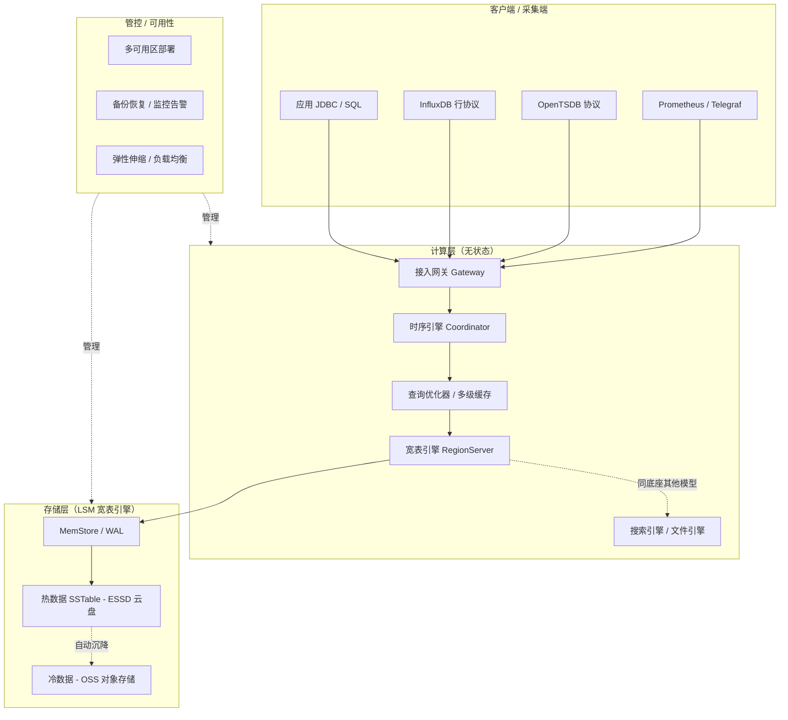
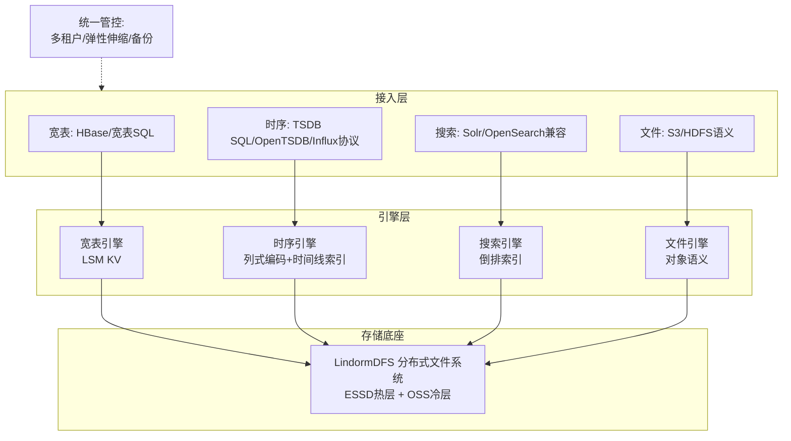
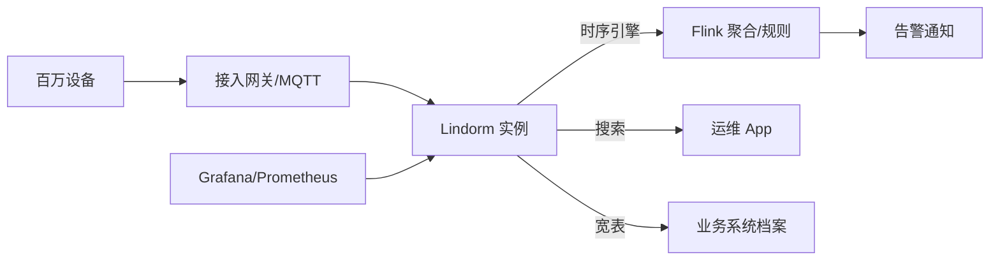
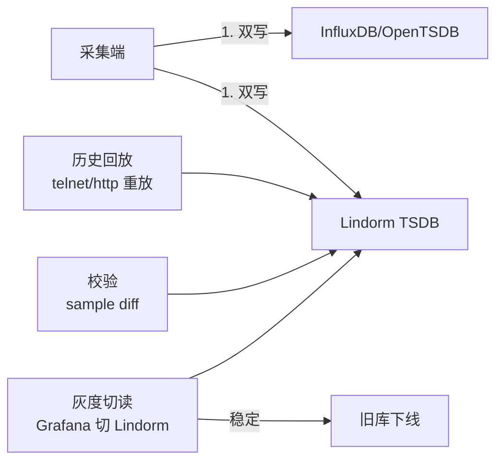
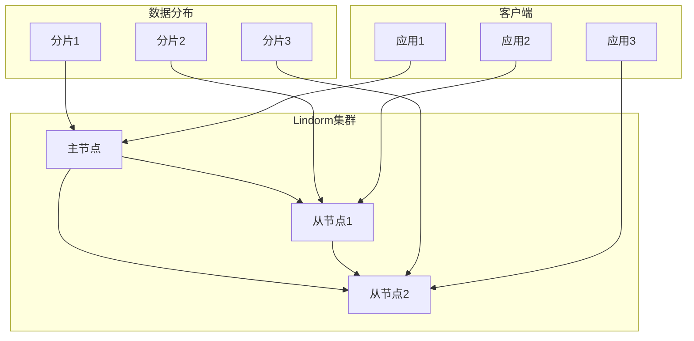
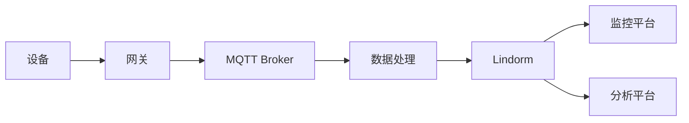
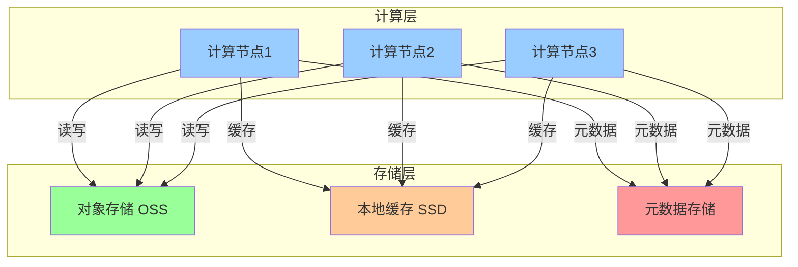
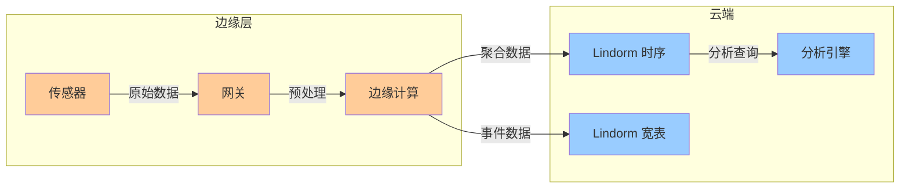
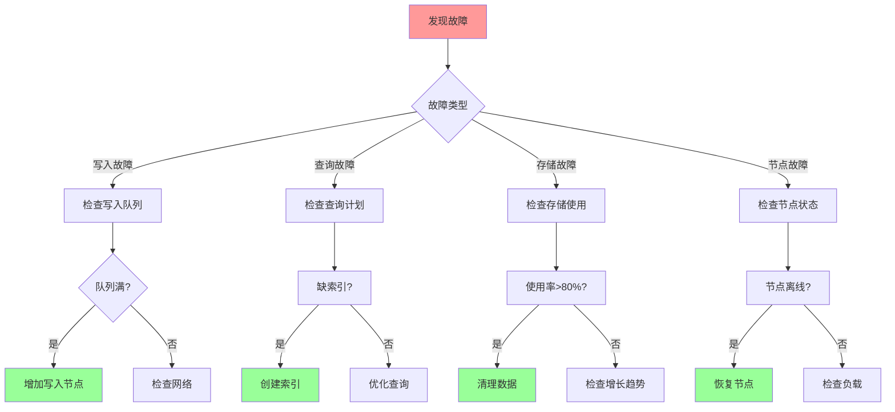
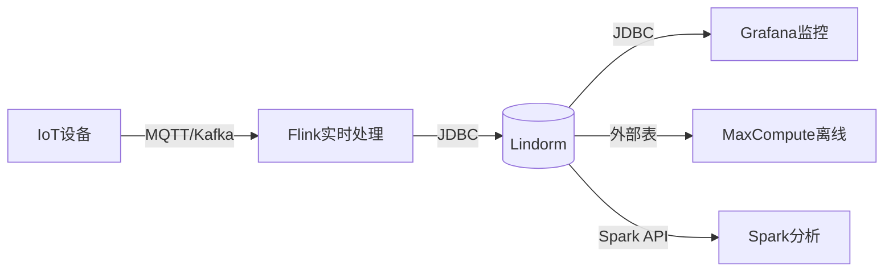

# Lindorm 时序引擎（Lindorm TSDB）详解

> 时序库板块子文档。概述见 [README](./README.md)。
> 说明：本文所述「Lindorm」指**阿里云 Lindorm 多模数据库中的时序引擎（Lindorm TSDB）**。若读者所指为开源时序数据库 **LinDB（dragonflydb/LinDB，原饿了么开源）**，其设计理念（按 metric/tag 分片、倒排索引、冷热分层）有相似之处但产品形态、部署方式差异较大，本文不展开，仅在文末做简要备注。

Lindorm（原 Lindorm 宽表，演进为多模数据库）是阿里云自研的**云原生多模数据库**，在一套存储与计算底座之上，同时提供「宽表、时序、搜索、文件」四种数据模型。其中的**时序引擎（Lindorm TSDB）**面向IoT、车联网、设备监控与业务指标场景，提供高写入吞吐、高压缩比与低成本冷热分层能力。

---

## 1. 定位与适用场景

### 1.1 定位

- 阿里云 **Lindorm 多模数据库** 的一个引擎实例：底层共享统一的分布式存储与管控，上层以不同「模型」对外暴露 API。
- 时序引擎专注于 **time-series** 数据：高并发写入、按时间区间的聚合扫描、兼容 OpenTSDB / InfluxDB 协议。
- 设计目标：**千万级 points/s 写入**、**数据压缩比 10:1 ~ 20:1**、**冷数据自动沉降到 OSS** 将存储成本降至块存储的 1/10 量级。
- 与「纯时序库」不同，它天然与同一实例里的宽表引擎、Lindorm Search（搜索引擎）互通，可在一个产品内做「时序写入 + 宽表关联 + 搜索检索」的混合负载。

### 1.2 适用场景

| 场景 | 说明 | 典型数据 |
|------|------|----------|
| IoT 设备监控 | 海量传感器高频上报，要求低成本长周期存储 | 温度/湿度/电流/电压 |
| 车联网 / 新能源 | 车辆轨迹、电池、电机时序，写入峰值高 | 车速/电量/SOC/定位 |
| 运维监控（APM） | 主机、容器、中间件指标，对接 Prometheus / Grafana | CPU/内存/QPS/延迟 |
| 业务指标 | 按时间聚合的业务埋点、交易额、在线人数 | 订单量/DAU/GMV |
| 工业时序 | 产线设备状态、PLC 点位数据 | 转速/压力/良率 |

### 1.3 不适用

- 强事务跨行一致性、复杂多表 JOIN 的 OLTP 业务 → 用 PolarDB / RDS 等关系库。
- 超大规模全文检索、灵活 schema 文档 → 用 Lindorm Search 或 Elasticsearch。
- 已有重度 InfluxDB/Flux 脚本依赖且不愿改协议 → 评估迁移成本。

---

## 2. 整体架构

### 2.1 架构要点

- **计算存储分离**：计算层（LindormDFS / Query Coordinator / RegionServer 角色）无状态，存储层基于 **LSM 宽表引擎（类 HBase 的分布式 KV）**，底层数据落在分布式文件系统（盘古/ESSD）。
- **多模一体**：四种模型（宽表 / 时序 / 搜索 / 文件）共享同一分布式存储底座，分别由不同的「引擎」组件负责解析与索引，避免多套系统数据拷贝。
- **时序引擎 = 一种数据模型**：时序引擎在底层仍把数据点编码成宽表的 KV（RowKey 由 tag 组合 + timestamp 编码而成），因此继承宽表引擎的水平扩展、多副本、自动均衡能力。
- **冷热分层**：热数据在 ESSD 云盘，冷数据（按 TTL / 手动策略）下沉到 **OSS 对象存储**，查询时引擎自动路由。

### 2.2 架构图（Mermaid）



---

## 3. 数据模型

Lindorm TSDB 提供 SQL 与兼容协议两套模型，概念对应关系如下：

| 概念 | 含义 | 类比 |
|------|------|------|
| database | 逻辑库 | InfluxDB database |
| table / metric | 指标表（measurement） | InfluxDB measurement |
| tag | 维度键值对（**建索引**，可过滤/分组） | InfluxDB tag |
| field | 指标数值（**不建索引**） | InfluxDB field |
| timestamp | 时间戳（毫秒/秒精度） | 时间戳 |

数据模型结构（类 OpenTSDB）：

```text
database
 └── table (metric)
      ├── tag set    # 维度：host=web01, region=cn-hangzhou
      ├── field set  # 指标值：cpu=0.81, mem=0.62
      └── timestamp  # 时间戳
```

- **Tag 设计要点**：基数（cardinality）必须可控。tag 取值无限（如 user_id、device_id 直接做 tag）会导致索引爆炸。**高基数列应作为 field 或用宽表引擎承载**，时序引擎只放有限枚举维度。
- **协议兼容**：同时兼容 OpenTSDB（telnet / http put）、InfluxDB 行协议（line protocol）、以及原生 Lindorm TSDB SQL。

---

## 4. 写入与查询

### 4.1 Lindorm TSDB SQL 写入

```sql
-- 建库建表（SQL 模型）
CREATE DATABASE IF NOT EXISTS iot_db;
USE iot_db;

CREATE TABLE IF NOT EXISTS device_metric (
    metric_name VARCHAR,        -- 指标名（可选，单表单指标时可省略）
    tag_host VARCHAR,           -- 维度：主机
    tag_region VARCHAR,         -- 维度：地域
    field_cpu DOUBLE,           -- 指标值
    field_mem DOUBLE,
    ts TIMESTAMP,               -- 时间戳
    PRIMARY KEY (tag_host, tag_region, ts)
);

-- 写入
INSERT INTO device_metric (tag_host, tag_region, field_cpu, field_mem, ts)
VALUES
  ('web01', 'cn-hangzhou', 0.81, 0.62, '2026-07-28 10:00:00'),
  ('web02', 'cn-hangzhou', 0.74, 0.58, '2026-07-28 10:00:00');
```

### 4.2 行协议（InfluxDB Line Protocol）兼容写入

```text
device_metric,host=web01,region=cn-hangzhou cpu=0.81,mem=0.62 1753687200000000000
device_metric,host=web02,region=cn-hangzhou cpu=0.74,mem=0.58 1753687200000000000
```

通过 InfluxDB 兼容端口发送（示例用 curl）：

```bash
# InfluxDB 行协议写入（兼容端口）
curl -i -XPOST 'http://ld-bp1xxxx.lindorm.rds.aliyuncs.com:8242/write?db=iot_db' \
  --data-binary \
'device_metric,host=web01,region=cn-hangzhou cpu=0.81,mem=0.62 1753687200000000000'
```

### 4.3 OpenTSDB 兼容写入（telnet / http）

```bash
# OpenTSDB telnet 风格（put 命令）
echo "put device_metric 1753687200 cpu=0.81 mem=0.62 host=web01 region=cn-hangzhou" \
  | nc ld-bp1xxxx.lindorm.rds.aliyuncs.com 4242

# OpenTSDB HTTP 批量写入
curl -XPOST 'http://ld-bp1xxxx.lindorm.rds.aliyuncs.com:8242/api/put' \
  -H 'Content-Type: application/json' \
  -d '[
    {"metric":"device_metric","timestamp":1753687200,
     "value":0.81,"tags":{"host":"web01","region":"cn-hangzhou","field":"cpu"}},
    {"metric":"device_metric","timestamp":1753687200,
     "value":0.62,"tags":{"host":"web01","region":"cn-hangzhou","field":"mem"}}
  ]'
```

### 4.4 查询示例

```sql
-- 按主机聚合最近 1 小时平均 CPU
SELECT tag_host,
       AVG(field_cpu) AS avg_cpu
FROM device_metric
WHERE ts >= NOW() - INTERVAL '1' HOUR
  AND tag_region = 'cn-hangzhou'
GROUP BY tag_host
ORDER BY tag_host;

-- 降采样：每 5 分钟取最大 CPU（时间窗口聚合）
SELECT time_bucket('5 minutes', ts) AS bucket,
       tag_host,
       MAX(field_cpu) AS max_cpu
FROM device_metric
WHERE ts >= NOW() - INTERVAL '6' HOUR
GROUP BY bucket, tag_host
ORDER BY bucket;
```

> 注：`time_bucket` 风格函数与 TimescaleDB 同源思想；Lindorm TSDB 实际以 `GROUP BY` + 时间窗口函数/内置降采样语法实现，不同 SDK 略有差异，以官方 SQL 参考为准。

---

## 5. 关键能力

### 5.1 时间戳 / 数值专用编码 → 高压缩比

- 时序数据高度有序、数值变化平滑，Lindorm 采用 **timestamp delta-of-delta** 编码、**value XOR / 浮点专用编码**（借鉴 Gorilla 思路），配合列存块压缩。
- 典型压缩比 **10:1 ~ 20:1**，远优于通用压缩（如 Snappy 对宽表 KV 的 3:1 左右）。

### 5.2 冷热分层存储

- 热数据：写入后在 ESSD 云盘，保证低延迟查询。
- 冷数据：按 **TTL / 手动策略** 自动或定时迁移到 **OSS**，成本降至块存储的约 1/10。
- 查询透明：引擎按时间范围自动判断数据所在层，用户无感知。

```yaml
# 冷热分层（控制台/API 配置示意）
coldStorage:
  enabled: true
  coldDataTtl: 90d          # 90 天后转冷
  hotStorageType: ESSD_PL1
  coldStorageType: OSS
  autoMigration: true
```

### 5.3 弹性伸缩与多级缓存

- **弹性**：计算节点（RegionServer / 时序协调者）可在线扩容，数据自动 rebalance；存储随写入量弹性。
- **多级缓存**：块缓存（BlockCache）+ 行缓存（RowCache）+ 查询结果缓存，热点时间线命中内存、降低 IO。

---

## 6. 高可用与运维

| 能力 | 说明 |
|------|------|
| 多可用区 | 默认多副本（3 副本），支持同城多 AZ 部署，AZ 故障自动切换 |
| 备份恢复 | 全量 + 增量备份，支持按时间点恢复（PITR） |
| 监控告警 | 接入云监控，关注写入延迟、QPS、压缩比、冷数据比例、节点负载 |
| 审计 | SQL 审计、慢查询日志 |
| 安全 | VPC 隔离、白名单、RAM 鉴权、TDE 加密 |

```bash
# 常见运维命令（aliyun CLI 示意）
aliyun lindorm UpdateInstanceIpWhiteList --InstanceId ld-bp1xxxx --IpList "10.0.0.0/8"
aliyun lindorm DescribeHotColdStorageInfo --InstanceId ld-bp1xxxx
```

---

## 7. 与 InfluxDB / TDengine / TimescaleDB 对比

| 维度 | Lindorm TSDB | InfluxDB | TDengine | TimescaleDB |
|------|--------------|----------|----------|-------------|
| 数据模型 | 多模（时序为之一），类 OpenTSDB/Influx | measurement+tag+field | 超级表+子表（tags 建表） | 超表（hypertable）基于 PG |
| 存储底座 | LSM 宽表引擎（自研） | TSM（v1）/ IOx(Parquet) | 自研时序存储 | PostgreSQL + 列式压缩 chunk |
| 压缩比 | 高（10~20:1） | 高（v1 TSM） | 很高（自研，可达 10:1+） | 中高（列压缩 4~10:1） |
| 冷热分层 | 原生（OSS 沉降） | 企业版/IOx 对象存储 | 原生（多级存储/归档） | 依赖 PG + 外部冷存/分区 |
| 协议生态 | OpenTSDB / Influx / SQL | InfluxQL / Flux / SQL | TDengine SQL / 行协议 | 100% PG / SQL |
| 事务能力 | 弱（时序模型） | 弱 | 弱 | 强（PG 事务） |
| 关系分析 | 中（与宽表引擎互通） | 弱 | 弱 | 强（JOIN/窗口/扩展） |
| 适用 | IoT/车联网/监控大厂云上 | 监控/DevOps | IoT/运维国产替代 | 既要时序又要关系分析 |

---

## 8. 生产实践与踩坑

### 8.1 Tag 基数（最重要）

- **坑**：把 `device_id`（百万级）当 tag → 索引与写入放大爆炸，集群抖动。
- **做法**：有限枚举维度（host/region/app）才做 tag；高基数列放 field，或用宽表引擎按 device_id 做 RowKey。
- 经验：单 metric 的 tag 组合数控制在 **万级以内** 更稳。

### 8.2 写入吞吐调优

- 批量写入（batch）而非单点；合理设置 `batch_size=500~2000`。
- 避免每条数据一个 timestamp 精度到纳秒且乱序 → 适度允许时间窗口内乱序（out-of-order）但过大窗口伤压缩。
- 客户端做 tag 维度预聚合，减少重复维度传输。
- 写入端开启压缩（gzip/snappy），降低网络开销。

### 8.3 冷热策略

- 按真实访问模式设 TTL：热数据 30~90 天，之后沉降 OSS，归档保留 1~N 年。
- 监控冷数据比例，避免「热盘被冷数据占满」。
- 查询冷数据走 OSS 延迟较高，避免对冷区间做高频明细查询，优先降采样后查。

### 8.4 其他

- 多可用区部署时，确认写入一致性级别与跨 AZ 带宽成本。
- 大查询（全量回扫）会挤占写入资源，用资源组 / 限速隔离。
- 关注压缩比指标，骤降往往意味着 tag 基数失控或乱序严重。

---

## 附：与 LinDB 的简要区别（备注）

若你所指是开源 **LinDB**（dragonflydb/LinDB，原饿了么开源，Go 语言实现的分布式时序库）：

- 设计强调「按 metric/tag 分片 + 倒排索引 + 列式存储 + 多级存储（本地/对象）」，同样面向超大规模监控。
- 它是**独立部署的开源项目**，非阿里云托管服务，运维需自建；Lindorm TSDB 是**全托管云产品**，深度集成阿里云生态（OSS 冷存、云监控、RAM）。
- 二者名字相近但产品形态、部署、协议兼容（LinDB 有自研协议与部分兼容）不同，选型时务必区分。

---

## 9. 运维实战与性能调优

### 9.1 冷热分层策略实操

冷热分层是 Lindorm 降本核心。热数据在 ESSD，冷数据按 TTL 自动沉降 OSS。

```bash
# 通过 aliyun CLI 开启冷热分层（示意）
aliyun lindorm UpdateMultiZoneClusterNode --InstanceId ld-bp1xxxx \
  --ColdStorageEnable true

# 查询冷热存储信息
aliyun lindorm DescribeHotColdStorageInfo --InstanceId ld-bp1xxxx
```

```sql
-- 设置某张时序表的冷数据 TTL（示意，以官方 SQL 为准）
ALTER TABLE device_metric SET OPTIONS (coldDataTtl = '90d');
```

实操原则：
- 热 TTL 设真实访问窗口（30~90 天）；超过即沉降，避免热盘被冷数据占满。
- 对冷区间（OSS）只做降采样后的聚合查询，避免高频明细回扫拉高延迟与费用。
- 监控「冷数据比例」，比例异常低说明分层未生效或 TTL 设错。

### 9.2 写入吞吐调优参数

- **批量写入**：客户端 `batch_size` 设 500~2000 点/批，减少网络往返。
- **并发连接**：写入客户端开启连接池，避免单连接成为瓶颈。
- **压缩**：开启 gzip/snappy 压缩 body，降低带宽。
- **预聚合 tag**：采集端对重复维度做合并，减少冗余 tag 传输。
- **避免极端乱序**：允许窗口内（分钟级）乱序，过大乱序窗口伤压缩与索引。

```yaml
# 写入客户端调优示意（InfluxDB 行协议兼容写入）
writer:
  batchSize: 1000
  flushInterval: 5s
  maxRetries: 3
  compression: gzip
  concurrency: 8
```

### 9.3 监控指标

| 类别 | 关键指标 | 告警建议 |
|------|----------|----------|
| 写入 | 写入 QPS、写入延迟 P99 | P99 > 1s 告警 |
| 存储 | 热/冷数据比例、压缩比 | 压缩比骤降即查基数 |
| 资源 | RegionServer CPU/内存、WAL 堆积 | 节点负载 > 80% 扩容 |
| 查询 | 慢查询数、大范围扫描 | 明细全扫占比异常 |
| 冷存 | OSS 读取延迟、沉降失败 | 沉降失败即告警 |

### 9.4 与 Flink 实时计算联动

Lindorm TSDB 可作为 Flink 的 sink（时序落地）或 source（维表/实时流），做实时聚合与告警。

```sql
-- Flink SQL：从 Kafka 读取设备数据，窗口聚合后写入 Lindorm
CREATE TABLE device_source (
  device_id STRING,
  cpu DOUBLE,
  ts TIMESTAMP(3),
  WATERMARK FOR ts AS ts - INTERVAL '5' SECOND
) WITH ('connector' = 'kafka', 'topic' = 'device-metrics', ...);

CREATE TABLE lindorm_sink (
  device_id STRING,
  avg_cpu DOUBLE,
  window_end TIMESTAMP(3)
) WITH (
  'connector' = 'lindorm',
  'endpoint' = 'ld-bp1xxxx.lindorm.rds.aliyuncs.com:8242',
  'database' = 'iot_db',
  'table'   = 'device_metric_agg'
);

INSERT INTO lindorm_sink
SELECT device_id, AVG(cpu), TUMBLE_END(ts, INTERVAL '1' MINUTE)
FROM device_source
GROUP BY device_id, TUMBLE(ts, INTERVAL '1' MINUTE);
```

联动要点：
- Flink 侧做好 watermark 与乱序容忍，避免 Lindorm 写入乱序放大。
- 聚合结果写单独聚合表，原始明细走另一张表，分层清晰。
- 用 Flink 做「实时富化」（关联设备元数据）后再落 Lindorm，减少查询期 JOIN。

### 9.5 成本优化

- **冷热分层**：冷数据转 OSS 成本约为块存储 1/10，是最大降本项。
- **合理 TTL**：不为「永远不会查」的数据付热存储费。
- **压缩比治理**：保持高压缩比（基数可控），同等数据占用更少空间。
- **弹性规格**：按写入峰谷选择计算规格，闲时降配（全托管支持弹性）。
- **资源组隔离**：大查询与写入用不同资源组，避免为保查询而盲目扩容。

### 9.6 故障排查 checklist

- [ ] 写入变慢 → 查 RegionServer 负载、WAL 堆积、是否热盘满。
- [ ] 压缩比骤降 → 查 tag 基数、乱序程度、是否高基数列混入 tag。
- [ ] 冷查询慢 → 确认是否对 OSS 区间做高频明细查询（应改聚合）。
- [ ] 多 AZ 写入延迟高 → 评估跨 AZ 带宽与一致性级别。
- [ ] 大查询挤占写入 → 用资源组/限流隔离。

---

## Lindorm 时序数据模型（metric/tags/fields）

```
Lindorm TSDB 数据模型：

  metric（指标）：类似 InfluxDB measurement
    一组相关采集量的集合
    如：device_metric（设备指标）

  tags（标签）：维度键值对，建索引
    可用于过滤/分组
    基数必须可控（万级以内）
    如：host=web01, region=cn-hangzhou

  fields（字段）：指标数值，不建索引
    实际采集的数据值
    如：cpu=0.81, mem=0.62

  timestamp：时间戳
    毫秒/秒精度
    按时间范围查询的依据

数据点结构：
  (metric, {tags}, {fields}, timestamp)
  → 存储为宽表 KV（RowKey = tag组合 + timestamp 编码）
```

## Lindorm 宽表引擎与 HBase 兼容操作对比

| 能力 | HBase | Lindorm 宽表 |
|------|-------|-------------|
| Java API | 原生 Put/Get/Scan | ✅ 兼容 |
| Phoenix SQL | 部分支持 | ✅ 兼容 |
| Coprocessor | 自定义 | ⚠️ 需评估改写 |
| Region Split | 手工/自动 | 自动 |
| 冷热分层 | 需自建 | 原生 OSS 沉降 |
| 运维 | 自担 | 全托管 |

```
迁移路径：
  ① 结构评估：RowKey/列族规划复核
  ② 双写：生产端同时写 HBase 与 Lindorm
  ③ 全量搬迁：BDS 数据同步批量复制+增量追平
  ④ 校验切读：抽样比对+灰度切流
  ⑤ 旧集群下线
```

## Lindorm 搜索引擎在时序数据中的应用

```
Lindorm Search 引擎在时序场景的应用：

  场景：时序数据需要全文检索/模糊匹配
    如：设备故障描述搜索、日志关键词检索
  
  架构：
    时序引擎承接写入+时间聚合
    搜索引擎承接全文检索+模糊查询
    同一实例，免数据拷贝
  
  实现：
    时序表的 tag/field 可建二级搜索索引
    查询时自动路由到对应引擎
    支持 Solr/OpenSearch 兼容 API
```

## Lindorm 云原生架构（存算分离）

```
存算分离架构：

  计算层（无状态）：
    RegionServer：数据读写
    Query Coordinator：查询协调
    可弹性扩缩（秒级生效）
  
  存储层（LSM 宽表引擎）：
    MemStore / WAL：写入缓冲
    热数据 SSTable：ESSD 云盘
    冷数据：OSS 对象存储（自动沉降）
  
  优势：
    计算独立扩缩（按需付费）
    存储按量计费（冷数据 1/10 成本）
    多模共享存储底座
```

## Lindorm 在工业物联网中的应用案例

| 场景 | 数据特征 | Lindorm 组合 |
|------|---------|-------------|
| 设备监控 | 千万设备×秒级上报 | 时序引擎+规则引擎告警 |
| 轨迹管理 | 车辆轨迹+车况双流 | 时序存轨迹+宽表存档案 |
| 故障诊断 | 设备状态+故障描述 | 时序+搜索混合查询 |
| 数字孪生 | PLC 点位+文档 | 时序+文件引擎混合 |

## Lindorm 成本优化（冷热分离+自动缩容）

```
成本优化策略：

  冷热分层：
    热 TTL：30~90天（ESSD）
    冷 TTL：90天~1年（OSS）
    成本降 ~70%

  弹性规格：
    按写入峰谷选择计算规格
    闲时降配（全托管支持）

  压缩比治理：
    控制 tag 基数（万级以内）
    保持高压缩比（10:1+）

  资源组隔离：
    大查询与写入用不同资源组
    避免为保查询而盲目扩容
```

## 多模引擎架构深入（宽表 / 时序 / 搜索 / 文件）



| 引擎 | 底层形态 | 互通方式 |
|------|---------|---------|
| 宽表 | 类 HBase LSM，RowKey 分片 | 时序数据本质存为宽表 KV；可直接读时序底层明细 |
| 时序 | 时间线编码 + 列式块 | 聚合结果可写回宽表供在线查询 |
| 搜索 | 倒排（类 Lucene） | 时序 tag/field 可建二级检索索引 |
| 文件 | 对象语义 | 统一权限与生命周期策略 |

多模价值：**一份数据免拷贝地获得「KV 点查 + 时间聚合 + 全文检索」三种访问路径**——例如车联网场景中轨迹明细走时序聚合、车辆档案走宽表、故障描述文本走搜索，全部在一个实例内完成。

## TTL 与降采样策略

```sql
-- 表级 TTL：过期数据自动清理（含冷层归档期控制）
ALTER TABLE device_metric SET OPTIONS (ttl = '1095d');

-- 降采样两级方案：
-- ① 查询期降采样：time_bucket/GROUP BY 窗口聚合（不落盘）
SELECT time_bucket('1 minute', ts) AS bucket,
       AVG(field_cpu) AS avg_cpu
FROM device_metric WHERE ts >= NOW() - INTERVAL '1' HOUR
GROUP BY bucket;

-- ② 物化降采样：Flink 定时窗口聚合写入独立降采样表（落盘）
INSERT INTO device_metric_1m
SELECT tag_host, AVG(field_cpu), MAX(field_cpu), TUMBLE_END(ts, INTERVAL '1' MINUTE)
FROM device_metric WHERE ts >= NOW() - INTERVAL '2' MINUTE
GROUP BY tag_host, TUMBLE(ts, INTERVAL '1' MINUTE);
```

| 层级 | 保留策略 | 典型用途 |
|------|---------|---------|
| 明细（热 ESSD） | 30~90 天 | 故障回溯、精确点查 |
| 明细（冷 OSS） | 90 天~1 年 | 低频审计查询 |
| 1 分钟聚合表 | 1~2 年 | 运营趋势分析 |
| 1 小时聚合表 | 3~5 年 | 年度容量规划 |

组合公式：**「长周期只查聚合、短周期才查明细」**——配合 TTL 让 95% 的存储成本落在最便宜的 OSS 冷层与高压缩聚合表上。

## 与 HBase 的兼容性及迁移

```text
兼容范围：
✅ 原生 HBase Java/REST API（Put/Get/Scan）
✅ Phoenix 部分语法（二级索引/SQL 查询）
⚠️ 协处理器（Coprocessor）、自定义 Filter 需评估改写
❌ 自研 RPC 定制、Region 手工迁移等运维级操作不开放

迁移路径：
① 结构评估：RowKey 设计/热点风险/大宽表列族规划复核
② 双写：生产端同时写 HBase 与 Lindorm（或用 BDS 同步链路）
③ 全量搬迁：BDS 数据同步服务做历史数据批量复制+增量追平
④ 校验切读：抽样比对 + 灰度应用切流 → 旧集群下线
```

| 对比项 | 自建 HBase | Lindorm 宽表 |
|--------|-----------|--------------|
| 运维 | 自担（HMaster/RSGC/ZK） | 全托管，自动 split/balance |
| 扩容 | 手工加节点搬 Region | 在线弹性，秒级生效 |
| 冷热分层 | 需自建归档管道 | 原生 OSS 沉降 |
| 计费 | 硬件 CAPEX | 按量 OPEX |

迁移收益典型值：运维人力省 1~2 FTE；利用冷热分层后存储成本降 50% 以上。最大风险点是 RowKey 热点设计缺陷被「原样搬运」——迁移前务必重审。

## 冷热分离存储策略（配置模板）

```yaml
# 实例级：开启冷存储
cold_storage:
  enabled: true
  medium: OSS

# 表级策略示例（三类典型业务）
policies:
  iot_raw:                 # IoT 原始点位：热窗口短
    hot_ttl: 30d
    cold_ttl: 365d
    archive_ttl: 0         # 不归档直接过期
  apm_metrics:             # 监控指标：中等窗口
    hot_ttl: 90d
    cold_ttl: 730d
  vehicle_track:           # 车联网轨迹：合规要求长保留
    hot_ttl: 60d
    cold_ttl: 1825d        # 5 年合规留存
```

```text
配置原则：
① 热 TTL = 真实高频查询窗口（看 Grafana 查询时间分布定），拍脑袋设长=白烧钱
② 冷区间禁高频明细扫描：OSS 读延迟高且计费，一律引导到聚合表
③ 监控「冷数据占比」：健康值通常 >60%；占比过低说明 TTL 过长
④ 归档到期自动清理，满足个保法「最小必要」留存义务
```

## 阿里云内典型应用场景

| 场景 | 数据特征 | Lindorm 组合用法 |
|------|---------|-----------------|
| IoT 平台 | 千万设备 × 秒级上报 | 时序引擎承接写入 + 规则引擎联动函数计算告警 |
| 云监控/APM | 高基数主机指标 | 兼容 Prometheus 远程读写，替代 Thanos 长存储 |
| 车联网 | 轨迹+车况双流 | 时序存轨迹、宽表存车辆档案、搜索查故障工单 |
| 风控画像 | 特征点查为主 | 宽表引擎毫秒级特征读取，对接实时决策引擎 |
| 数字孪生/工业 | PLC 点位 + 文档 | 时序 + 文件引擎混合，一个实例覆盖 |



选型提示：已在阿里云生态（VPC/RAM/OSS/DataWorks/Flink 实时计算）内的团队，Lindorm 的集成成本最低；多云或重度依赖开源生态（Prometheus 全家桶、HBase 上层工具）的场景要评估锁定风险。

容量速算模板：

```text
实例规格估算：
  写入 = 设备数 × 指标数 ÷ 上报间隔 → 决定计算节点数（预留 50% 峰值余量）
  存储 = 日增原始量 × 压缩比(取 1/10) × (热TTL + 冷TTL) → 决定冷热配比
  查询 = 并发看板数 × 单查询扫描量 → 决定是否需要聚合表与资源组隔离
```

---

## 10. 第三轮深度实战（基准 / 迁移 / 告警 / 流计算 / 成本 / 排障 SOP）

### 10.1 性能基准（推导 / 公开数字）

公开资料与阿里云文档给出的量级（需以自身负载复测）：
- 写入吞吐：千万级 points/s（集群横向扩展）。
- 压缩比：10:1 ~ 20:1（delta-of-delta + XOR + 列存）。
- 冷数据成本：沉降 OSS 后约为块存储 1/10。

推导：
```text
写入 points/s ≈ 设备数 × 每设备指标数 / 上报间隔(s)
例：100 万设备、每设备 5 指标、5s 上报 → 1e6×5/5 = 1e6 点/s
→ 需多 dnode + 连接池，单客户端 batch 1000~2000
```

### 10.2 迁移实战：InfluxDB / OpenTSDB → Lindorm 双写切换 SOP



SOP：
1. **双写**：采集端同时写旧库与 Lindorm（Lindorm 兼容 InfluxDB 行协议 / OpenTSDB）。
2. **回放**：用旧库导出按时间区间重放到 Lindorm（注意 tag 模型对齐：高基数列改 field 或宽表 RowKey）。
3. **校验**：抽样比对 `(metric, tags, ts)` 值，误差 < 1e-6。
4. **切读**：Grafana 数据源切 Lindorm，观察 48h。
5. **下线**：旧库只读 7 天确认后停写。

```bash
# 双写：InfluxDB 行协议兼容端口写 Lindorm
curl -i -XPOST 'http://ld-bp1xxxx.lindorm.rds.aliyuncs.com:8242/write?db=iot_db' \
  --data-binary 'device_metric,host=web01,region=cn-hangzhou cpu=0.81 1753687200000000000'
```

### 10.3 与监控 / Grafana 全链路告警规则示例

Lindorm TSDB 接入 Grafana 后，用 Grafana Unified Alerting 对 SQL 查询结果告警：

```yaml
apiVersion: 1
groups:
  - name: lindorm_cpu_alert
    rules:
      - alert: HighDeviceCpu
        sql: |
          SELECT tag_host, AVG(field_cpu) AS v
          FROM device_metric
          WHERE ts >= NOW() - INTERVAL '5' MINUTE AND tag_region='cn-hangzhou'
          GROUP BY tag_host HAVING AVG(field_cpu) > 0.85
        for: 5m
        labels: { severity: warning }
        annotations:
          summary: "设备 {{ $labels.tag_host }} 5 分钟平均 CPU > 85%"
```

全链路 Checklist：
- [ ] 写入 `batch_size=1000`、并发 8、gzip 开启。
- [ ] 监控 RegionServer CPU/内存、WAL 堆积、压缩比。
- [ ] Grafana 查询带 `ts >=` 下界，冷区间改聚合查询。

### 10.4 与 Flink / Spark 实时计算联动代码

Flink SQL 实时聚合写 Lindorm（含 watermark 与乱序容忍）：

```sql
CREATE TABLE device_src (
  device_id STRING, cpu DOUBLE, ts TIMESTAMP(3),
  WATERMARK FOR ts AS ts - INTERVAL '10' SECOND
) WITH ('connector'='kafka','topic'='device-metrics', ...);

CREATE TABLE lindorm_agg (
  device_id STRING, avg_cpu DOUBLE, w_end TIMESTAMP(3)
) WITH (
  'connector'='lindorm','endpoint'='ld-bp1xxxx.lindorm.rds.aliyuncs.com:8242',
  'database'='iot_db','table'='device_metric_agg'
);

INSERT INTO lindorm_agg
SELECT device_id, AVG(cpu), TUMBLE_END(ts, INTERVAL '1' MINUTE)
FROM device_src GROUP BY device_id, TUMBLE(ts, INTERVAL '1' MINUTE);
```

Spark 读 Lindorm（JDBC）：

```scala
val df = spark.read.format("jdbc")
  .option("url", "jdbc:lindorm:8242/iot_db")
  .option("query", "SELECT tag_host, field_cpu, ts FROM device_metric WHERE ts >= NOW() - INTERVAL 1 HOUR")
  .load()
df.groupBy("tag_host").avg("field_cpu").show()
```

联动要点：Flink 做富化后再落 Lindorm，减少查询期 JOIN；聚合与明细分表。

### 10.5 成本优化（冷热分层 / 降采样 / 保留策略）

```bash
# 开启冷热分层 + 查询冷存信息
aliyun lindorm UpdateMultiZoneClusterNode --InstanceId ld-bp1xxxx --ColdStorageEnable true
aliyun lindorm DescribeHotColdStorageInfo --InstanceId ld-bp1xxxx
```

```sql
-- 热 TTL 90d，超期自动沉降 OSS；归档保留 3 年
ALTER TABLE device_metric SET OPTIONS (coldDataTtl='90d', archiveTtl='1095d');
```

成本模型（示意）：热 ESSD 约 ¥0.8/GB·月，冷 OSS 约 ¥0.08/GB·月（1/10）。若 80% 数据为冷，整体存储成本可降 ~70%。

降本清单：
- [ ] 热 TTL 贴合真实访问窗口，避免热盘被冷数据占满。
- [ ] 冷区间只做聚合查询，禁高频明细回扫。
- [ ] 保持高压缩比（基数可控）；闲时降配计算规格。
- [ ] 大查询与写入用资源组隔离，避免盲目扩容。

### 10.6 生产排障 SOP

**Cardinality 治理**
- [ ] 单 metric tag 组合数控在万级；`device_id` 等高基数列放 field / 宽表 RowKey。
- [ ] 监控压缩比，骤降即查高基数列是否混入 tag。

**写入拒绝 / 延迟高 SOP**
- [ ] 查 RegionServer 负载、WAL 堆积、是否热盘满。
- [ ] 调大 `batch_size`/并发、开压缩；多 AZ 评估跨 AZ 带宽。

**查询超时 SOP**
- [ ] 确认带 `ts >=` 下界；冷区间改聚合。
- [ ] 大查询用资源组限流，避免挤占写入。

## Lindorm 时序数据模型详解

```
Lindorm TSDB 数据模型：

  metric（指标）：类似 InfluxDB measurement
    一组相关采集量的集合
    如：device_metric（设备指标）

  tags（标签）：维度键值对，建索引
    可用于过滤/分组
    基数必须可控（万级以内）
    如：host=web01, region=cn-hangzhou

  fields（字段）：指标数值，不建索引
    实际采集的数据值
    如：cpu=0.81, mem=0.62

  timestamp：时间戳
    毫秒/秒精度
    按时间范围查询的依据

数据点结构：
  (metric, {tags}, {fields}, timestamp)
  → 存储为宽表 KV（RowKey = tag组合 + timestamp 编码）

Tag 设计要点：
  基数（cardinality）必须可控
  高基数列（如 user_id）应作为 field 或用宽表引擎
  单 metric 的 tag 组合数控制在万级以内
```

## Lindorm 宽表引擎与 HBase 兼容操作对比

| 能力 | HBase | Lindorm 宽表 |
|------|-------|-------------|
| Java API | 原生 Put/Get/Scan | ✅ 兼容 |
| Phoenix SQL | 部分支持 | ✅ 兼容 |
| Coprocessor | 自定义 | ⚠️ 需评估改写 |
| Region Split | 手工/自动 | 自动 |
| 冷热分层 | 需自建 | 原生 OSS 沉降 |
| 运维 | 自担 | 全托管 |

```
迁移路径：
  ① 结构评估：RowKey/列族规划复核
  ② 双写：生产端同时写 HBase 与 Lindorm
  ③ 全量搬迁：BDS 数据同步批量复制+增量追平
  ④ 校验切读：抽样比对+灰度切流
  ⑤ 旧集群下线

收益：运维人力省 1~2 FTE；存储成本降 50%+
风险：RowKey 热点设计缺陷被「原样搬运」
```

## Lindorm 搜索引擎在时序数据中的应用

```
Lindorm Search 引擎在时序场景的应用：

  场景：时序数据需要全文检索/模糊匹配
    如：设备故障描述搜索、日志关键词检索
  
  架构：
    时序引擎承接写入+时间聚合
    搜索引擎承接全文检索+模糊查询
    同一实例，免数据拷贝
  
  实现：
    时序表的 tag/field 可建二级搜索索引
    查询时自动路由到对应引擎
    支持 Solr/OpenSearch 兼容 API
  
  价值：
    一份数据获得「时间聚合 + 全文检索」两种访问路径
    避免数据拷贝，降低运维复杂度
```

## Lindorm 云原生存算分离架构详解

```
存算分离架构：

  计算层（无状态）：
    RegionServer：数据读写
    Query Coordinator：查询协调
    可弹性扩缩（秒级生效）
  
  存储层（LSM 宽表引擎）：
    MemStore / WAL：写入缓冲
    热数据 SSTable：ESSD 云盘
    冷数据：OSS 对象存储（自动沉降）
  
  优势：
    计算独立扩缩（按需付费）
    存储按量计费（冷数据 1/10 成本）
    多模共享存储底座
  
  多模一体：
    宽表引擎：类 HBase LSM，RowKey 分片
    时序引擎：时间线编码 + 列式块
    搜索引擎：倒排索引（类 Lucene）
    文件引擎：对象语义
    → 一份数据免拷贝地获得「KV 点查 + 时间聚合 + 全文检索」
```

## Lindorm 在工业物联网中的应用案例

| 场景 | 数据特征 | Lindorm 组合 |
|------|---------|-------------|
| 设备监控 | 千万设备×秒级上报 | 时序引擎+规则引擎告警 |
| 轨迹管理 | 车辆轨迹+车况双流 | 时序存轨迹+宽表存档案 |
| 故障诊断 | 设备状态+故障描述 | 时序+搜索混合查询 |
| 数字孪生 | PLC 点位+文档 | 时序+文件引擎混合 |
| 预测性维护 | 历史状态+实时指标 | 时序+ML 特征+模型推理 |

```
预测性维护架构：
  设备传感器 → Lindorm 时序引擎（实时指标）
  → Flink 实时特征计算
  → 模型推理服务（预测故障概率）
  → 告警通知 + 工单系统

  价值：
    从「故障后维修」→「故障前预警」
    减少非计划停机 30%+
    降低维护成本 20%+
```

## Lindorm 成本优化（冷热分离+自动缩容+压缩）

```
成本优化策略：

  冷热分层：
    热 TTL：30~90天（ESSD）
    冷 TTL：90天~1年（OSS）
    成本降 ~70%

  弹性规格：
    按写入峰谷选择计算规格
    闲时降配（全托管支持）

  压缩比治理：
    控制 tag 基数（万级以内）
    保持高压缩比（10:1+）

  资源组隔离：
    大查询与写入用不同资源组
    避免为保查询而盲目扩容

成本模型（示意）：
  热 ESSD 约 ¥0.8/GB·月
  冷 OSS 约 ¥0.08/GB·月（1/10）
  若 80% 数据为冷，整体存储成本可降 ~70%
```

## Lindorm 时序数据模型

### metric/tags/fields 详解

```sql
-- 时序表结构
CREATE TABLE device_metrics (
    time        TIMESTAMP,           -- 时间戳（必填）
    device_id   VARCHAR(32),         -- 设备ID（标签）
    region      VARCHAR(16),         -- 地区（标签）
    temperature DOUBLE,              -- 温度（字段）
    humidity    DOUBLE,              -- 湿度（字段）
    battery     INT,                 -- 电量（字段）
    PRIMARY KEY (time, device_id, region)
);

-- 标签（Tags）：用于过滤和分组
-- 字段（Fields）：存储实际测量值
-- 时间戳：数据的时间维度

-- 查询示例
SELECT device_id, AVG(temperature)
FROM device_metrics
WHERE region = 'shanghai'
  AND time >= '2024-01-01'
GROUP BY device_id;
```

```text
数据模型最佳实践：
  - 标签选择：高基数（如 device_id）+ 低基数（如 region）
  - 字段选择：数值类型优先，避免字符串字段
  - 时间精度：根据业务需求选择（毫秒/秒/分钟）
  - 主键设计：time + 高基数标签 + 低基数标签
```

## 宽表引擎与 HBase 兼容操作对比

| 特性 | Lindorm 宽表引擎 | HBase | 说明 |
|------|------------------|-------|------|
| API 兼容 | 100% 兼容 | 原生 | Lindorm 支持 HBase API |
| 数据模型 | 列族/列 | 列族/列 | 相同 |
| 协处理器 | 支持 | 支持 | Lindorm 支持 HBase 协处理器 |
| Bulk Load | 支持 | 支持 | Lindorm 优化了 Bulk Load |
| 性能 | 更高（云原生优化） | 基准 | Lindorm 有性能优势 |
| 运维 | 托管服务 | 需自运维 | Lindorm 省运维 |

```java
// Lindorm 宽表引擎使用 HBase API
Configuration config = HBaseConfiguration.create();
config.set("hbase.zookeeper.quorum", "ld-xxx Lindorm访问地址");
Connection connection = ConnectionFactory.createConnection(config);
Table table = connection.getTable(TableName.valueOf("device_metrics"));

// PUT 操作
Put put = new Put(Bytes.toBytes("row1"));
put.addColumn(Bytes.toBytes("cf"), Bytes.toBytes("temperature"), Bytes.toBytes(25.5));
put.addColumn(Bytes.toBytes("cf"), Bytes.toBytes("humidity"), Bytes.toBytes(60.0));
table.put(put);

// GET 操作
Get get = new Get(Bytes.toBytes("row1"));
Result result = table.get(get);
double temperature = Bytes.toDouble(result.getValue(
    Bytes.toBytes("cf"), Bytes.toBytes("temperature")));
```

## 搜索引擎在时序数据中的应用

### 全文+时序联合查询

```sql
-- 全文搜索 + 时序查询
SELECT * FROM device_metrics
WHERE time >= '2024-01-01'
  AND device_id LIKE 'sensor-%'
  AND MATCH(description) AGAINST ('温度异常');

-- 使用 Lindorm 搜索引擎
-- 1. 创建搜索索引
CREATE SEARCH INDEX idx_description ON device_metrics (description);

-- 2. 全文搜索
SELECT * FROM device_metrics
WHERE SEARCH(description, '温度异常')
  AND time >= '2024-01-01';

-- 3. 混合查询（全文 + 时序 + SQL）
SELECT device_id, AVG(temperature)
FROM device_metrics
WHERE SEARCH(description, '温度异常')
  AND time >= '2024-01-01'
GROUP BY device_id
HAVING AVG(temperature) > 30;
```

```text
应用场景：
  - 设备日志搜索：搜索包含特定关键词的日志
  - 告警信息检索：搜索特定类型的告警
  - 传感器数据：搜索传感器描述信息
  - 混合分析：全文搜索 + 时序聚合
```

## 云原生存算分离架构详解

### 存算分离优势

```text
传统架构：
  计算 + 存储 在同一节点
  扩容时需要同时扩容
  资源利用率低

存算分离：
  计算节点：无状态，可独立扩容
  存储节点：有状态，可独立扩容
  优势：
    - 资源独立扩展
    - 成本优化
    - 弹性伸缩

Lindorm 存算分离：
  计算层：Lindorm Compute Engine
  存储层：Lindorm Storage Engine (LSM-Tree)
  缓存层：Lindorm Cache Engine (SSD)
```

```sql
-- Lindorm 存算分离配置
-- 1. 创建表时指定存储类型
CREATE TABLE device_metrics (
    time TIMESTAMP,
    device_id VARCHAR(32),
    temperature DOUBLE,
    PRIMARY KEY (time, device_id)
) WITH (
    storage_type = 'columnar',  -- 列式存储
    compression = 'zstd',       -- 压缩算法
    ttl = 2592000              -- 30天过期
);

-- 2. 存储分层
ALTER TABLE device_metrics SET (
    hot_storage = '7d',         -- 热数据保留7天
    warm_storage = '30d',       -- 温数据保留30天
    cold_storage = '365d'       -- 冷数据保留365天
);
```

## 在工业物联网中的应用案例

### 设备监控/预测性维护

```text
工业 IoT 场景：
  1. 设备监控
     - 实时采集传感器数据
     - 监控设备状态
     - 告警推送
  
  2. 预测性维护
     - 历史数据分析
     - 故障预测
     - 维护计划

技术架构：
  设备 → 边缘网关 → Lindorm 时序表
  → Flink 实时计算 → 告警服务
  → Spark 离线分析 → 预测模型
```

```sql
-- 设备监控表
CREATE TABLE device_monitoring (
    time TIMESTAMP,
    device_id VARCHAR(32),
    metric_type VARCHAR(16),  -- temperature/vibration/current
    metric_value DOUBLE,
    status VARCHAR(8),        -- normal/warning/alarm
    PRIMARY KEY (time, device_id, metric_type)
);

-- 预测性维护查询
SELECT device_id,
       AVG(metric_value) as avg_value,
       MAX(metric_value) as max_value,
       STDDEV(metric_value) as std_value
FROM device_monitoring
WHERE metric_type = 'vibration'
  AND time >= NOW() - INTERVAL '1 hour'
GROUP BY device_id
HAVING STDDEV(metric_value) > 0.5;  -- 振动标准差过大，需要维护
```

## 成本优化

### 冷热分离+自动缩容+压缩策略

```text
成本优化策略：
  1. 冷热分离
     - 热数据：ESSD（高性能）
     - 冷数据：OSS（低成本）
     - 自动分层：基于 TTL
  
  2. 自动缩容
     - 非高峰时段自动缩减计算资源
     - 按需扩缩容
     - 成本降低 30-50%
  
  3. 压缩策略
     - 列式存储 + ZSTD 压缩
     - 压缩比：10:1 ~ 20:1
     - 节省存储成本 90%+

成本计算示例：
  原始数据：1TB/月
  压缩后：100GB/月
  冷存储：OSS $0.023/GB = $2.3/月
  热存储：ESSD $0.1/GB = $10/月（10%热数据）
  总成本：$12.3/月 vs $100/月（传统方案）
```

## Lindorm 时序数据模型设计

### 时序数据模型

```
Lindorm 时序数据模型：

  数据库（Database）
    └── 表（Table）
        └── 度量（Measurement）
            └── 标签（Tag）：设备ID、地区、环境
            └── 时间戳（Timestamp）：毫秒精度
            └── 字段（Field）：指标值、状态

  设计建议：
    - Tag 用于分组和过滤，不要存储大文本
    - Field 用于存储数值型指标
    - 时间戳自动索引，支持时间范围查询
    - 支持数据保留策略（自动过期清理）
```

### Lindorm 宽表引擎与 HBase 兼容

| 能力 | Lindorm 宽表引擎 | HBase |
|------|------------------|-------|
| 协议兼容 | 完全兼容 HBase 协议 | 原生 |
| 存储优化 | LSM + 列式压缩 | LSM |
| 二级索引 | 内置支持 | Phoenix |
| 跨行事务 | 支持 | 支持 |
| TTL | 支持 | 支持 |
| 运维 | 全托管 | 自运维 |

### Lindorm 搜索引擎应用

```
Lindorm 搜索引擎（Lindorm Search）：
  基于 Apache Lucene 构建
  支持全文检索、分面搜索、高亮
  与 Lindorm 宽表引擎联合使用
  适用场景：时序数据检索、日志分析、全文搜索

  查询示例：
    SELECT * FROM logs 
    WHERE content MATCH 'error' 
    AND time BETWEEN '2025-01-01' AND '2025-01-31'
    ORDER BY score DESC
    LIMIT 100
```

### Lindorm 存算分离架构

```
存算分离架构优势：
  计算层：无状态，按需伸缩
  存储层：有状态，按量付费
  缓存层：SSD 缓存加速热数据访问

  扩容流程：
    1. 增加计算节点（秒级）
    2. 数据自动重平衡（分钟级）
    3. 无停机，无数据迁移
```

### Lindorm 工业物联网应用案例

```
工业 IoT 数据架构：
  设备 → MQTT → 数据网关 → Lindorm（时序表）
    → 实时监控（Lindorm 搜索引擎）
    → 历史分析（Lindorm 列式存储）
    → 告警规则（Lindorm 流计算）

  典型指标：
    - 温度、湿度、压力、振动
    - 电压、电流、功率
    - 运行时长、故障次数

  数据特点：
    - 高并发写入（万级设备/秒）
    - 时间范围查询为主
    - 数据量大（TB 级/月）
```

### Lindorm 成本优化

| 优化策略 | 实现方式 | 预期节省 |
|----------|----------|----------|
| 冷热分离 | 热数据 SSD，冷数据 OSS | 50-70% |
| 数据压缩 | ZSTD 压缩，列式存储 | 60-80% |
| 数据保留 | 自动过期清理旧数据 | 按需 |
| 资源弹性 | 闲时缩容，忙时扩容 | 30-50% |

---

## 九、Lindorm 数据建模

### 9.1 数据模型设计

```sql
-- 宽表模型
CREATE TABLE sensor_data (
    device_id VARCHAR(32),
    ts BIGINT,
    temperature FLOAT,
    humidity FLOAT,
    battery INT,
    location VARCHAR(64),
    PRIMARY KEY (device_id, ts)
);

-- 窄表模型
CREATE TABLE sensor_temperature (
    device_id VARCHAR(32),
    ts BIGINT,
    value FLOAT,
    PRIMARY KEY (device_id, ts)
);

CREATE TABLE sensor_humidity (
    device_id VARCHAR(32),
    ts BIGINT,
    value FLOAT,
    PRIMARY KEY (device_id, ts)
);
```

### 9.2 数据模型对比

| 模型 | 说明 | 优势 | 劣势 | 适用场景 |
|------|------|------|------|---------|
| **宽表模型** | 所有字段一张表 | 查询简单 | 写入复杂 | 读多写少 |
| **窄表模型** | 每个指标一张表 | 写入简单 | 查询复杂 | 写多读少 |
| **混合模型** | 宽表+窄表 | 平衡 | 中等 | 生产环境 |

### 9.3 建模最佳实践

```sql
-- 1. 合理设计主键
PRIMARY KEY (device_id, ts)

-- 2. 使用合适的数据类型
device_id VARCHAR(32)  -- 固定长度
ts BIGINT              -- 时间戳
temperature FLOAT      -- 浮点数
battery INT            -- 整数

-- 3. 创建索引
CREATE INDEX idx_device_id ON sensor_data (device_id);
CREATE INDEX idx_ts ON sensor_data (ts);
```

---

## 十、Lindorm 查询优化

### 10.1 查询性能对比

| 查询类型 | Lindorm | HBase | Cassandra | 说明 |
|---------|---------|-------|-----------|------|
| **单点查询** | 1ms | 2ms | 2ms | 按主键查询 |
| **范围查询** | 5ms | 10ms | 10ms | 按时间范围 |
| **聚合查询** | 10ms | 50ms | 50ms | 聚合统计 |
| **全文搜索** | 10ms | N/A | N/A | 文本搜索 |
| **时序查询** | 5ms | 20ms | 20ms | 时序数据 |

### 10.2 查询优化技巧

```sql
-- 1. 使用主键查询
SELECT * FROM sensor_data 
WHERE device_id = 'device_001' AND ts > 1704067200000;

-- 2. 使用索引查询
SELECT * FROM sensor_data 
WHERE device_id = 'device_001' AND ts > 1704067200000;

-- 3. 使用聚合函数
SELECT device_id, AVG(temperature), MAX(temperature), MIN(temperature)
FROM sensor_data
WHERE ts > 1704067200000
GROUP BY device_id;

-- 4. 使用降采样
SELECT device_id, AVG(temperature)
FROM sensor_data
WHERE ts > 1704067200000
GROUP BY device_id, ts/3600000;
```

### 10.3 索引策略

```sql
-- 创建二级索引
CREATE INDEX idx_location ON sensor_data (location);

-- 创建复合索引
CREATE INDEX idx_device_time ON sensor_data (device_id, ts);

-- 创建全文索引
CREATE FULLTEXT INDEX idx_message ON sensor_data (message);
```

---

## 十一、Lindorm 数据导入

### 11.1 数据导入方式

| 方式 | 速度 | 灵活性 | 适用场景 |
|------|------|--------|---------|
| **SQL INSERT** | 慢 | 高 | 少量数据 |
| **批量导入** | 中 | 中 | 中等数据量 |
| **文件导入** | 快 | 低 | 大量数据 |
| **流式导入** | 快 | 高 | 实时数据 |

### 11.2 批量导入示例

```sql
-- 批量插入数据
INSERT INTO sensor_data VALUES 
    ('device_001', 1704067200000, 25.5, 60, 85, '北京'),
    ('device_001', 1704067201000, 25.6, 61, 84, '北京'),
    ('device_001', 1704067202000, 25.7, 62, 83, '北京');

-- 从文件导入
LOAD DATA INFILE '/data/sensors.csv' 
INTO TABLE sensor_data 
FIELDS TERMINATED BY ',' 
LINES TERMINATED BY '\n';
```

### 11.3 流式数据导入

```sql
-- 创建流式计算
CREATE STREAM sensor_avg_stream AS
SELECT device_id, AVG(temperature) as avg_temp
FROM sensor_data
GROUP BY device_id, ts/3600000;

-- 写入流式数据
INSERT INTO sensor_data (device_id, ts, temperature, humidity, battery, location)
VALUES ('device_001', 1704067200000, 25.5, 60, 85, '北京');
```

---

## 十二、Lindorm 数据导出

### 12.1 导出方式

```sql
-- 导出为CSV文件
SELECT * FROM sensor_data 
WHERE ts > 1704067200000 AND ts < 1704153600000 
INTO OUTFILE '/data/sensors.csv' 
FIELDS TERMINATED BY ',' 
LINES TERMINATED BY '\n';

-- 导出为JSON格式
SELECT TO_JSON(sensor_data) 
FROM sensor_data 
WHERE ts > 1704067200000 
INTO OUTFILE '/data/sensors.json';

-- 导出为Parquet格式
SELECT * FROM sensor_data 
WHERE ts > 1704067200000 
INTO OUTFILE '/data/sensors.parquet' 
FORMAT PARQUET;
```

### 12.2 导出策略

| 策略 | 说明 | 优势 | 劣势 | 适用场景 |
|------|------|------|------|---------|
| **全量导出** | 导出所有数据 | 简单 | 数据量大 | 备份 |
| **增量导出** | 只导出新增数据 | 高效 | 复杂 | 同步 |
| **定时导出** | 定时自动导出 | 自动化 | 资源消耗 | 定期备份 |

---

## 十三、Lindorm 高可用

### 13.1 集群架构



### 13.2 数据副本

```sql
-- 创建带副本的表
CREATE TABLE sensor_data (
    device_id VARCHAR(32),
    ts BIGINT,
    temperature FLOAT,
    PRIMARY KEY (device_id, ts)
) WITH (
    REPLICATION = 3,
    CONSISTENCY = 'strong'
);
```

### 13.3 故障转移

```text
故障检测：
  - 心跳检测
  - 超时检测
  - 异常检测

故障转移：
  - 自动故障转移
  - 手动故障转移
  - 数据恢复

故障恢复：
  - 节点恢复
  - 数据同步
  - 集群均衡
```

---

## 十四、Lindorm 安全管理

### 14.1 用户权限管理

```sql
-- 创建用户
CREATE USER 'reader' IDENTIFIED BY 'password123';

-- 授权
GRANT SELECT ON db1.sensor_data TO 'reader';
GRANT INSERT ON db1.sensor_data TO 'writer';

-- 撤销权限
REVOKE SELECT ON db1.sensor_data FROM 'reader';

-- 查看权限
SHOW GRANTS FOR 'reader';
```

### 14.2 数据加密

```sql
-- 创建加密表
CREATE TABLE sensor_data (
    device_id VARCHAR(32),
    ts BIGINT,
    temperature FLOAT,
    PRIMARY KEY (device_id, ts)
) WITH (
    ENCRYPTION = 'AES256',
    ENCRYPTION_KEY = 'my_secret_key'
);

-- 数据传输加密
-- 使用SSL/TLS连接
mysql -h server -P 3306 --ssl-ca=ca.pem --ssl-cert=client-cert.pem --ssl-key=client-key.pem
```

---

## 十五、Lindorm 监控运维

### 15.1 监控指标

| 指标类别 | 指标名称 | 说明 | 告警阈值 |
|---------|----------|------|---------|
| **连接数** | client_connections | 客户端连接数 | >1000 |
| **查询数** | query_count | 查询数量 | >10000 |
| **写入数** | insert_count | 写入数量 | >100000 |
| **存储** | data_nodes | 数据节点数 | <3 |
| **内存** | memory_usage | 内存使用率 | >80% |

### 15.2 性能监控

```sql
-- 查看集群状态
SHOW NODES;
SHOW DATABASES;
SHOW TABLES;

-- 查看查询状态
SHOW QUERIES;
SHOW PROCESSLIST;

-- 查看系统信息
SHOW VARIABLES;
SHOW STATUS;
```

### 15.3 日常运维

```bash
# 启动Lindorm
systemctl start lindorm

# 停止Lindorm
systemctl stop lindorm

# 查看日志
tail -f /var/log/lindorm/lindorm.log

# 备份数据库
lindorm-backup --database db1 --output /backup/

# 恢复数据库
lindorm-restore --database db1 --input /backup/
```

---

## 十六、Lindorm 与 IoT 平台

### 16.1 IoT数据架构



### 16.2 实时数据处理

```sql
-- 创建实时计算视图
CREATE VIEW real_time_view AS
SELECT 
    device_id,
    AVG(temperature) as avg_temp,
    MAX(temperature) as max_temp,
    MIN(temperature) as min_temp
FROM sensor_data
WHERE ts > 1704067200000
GROUP BY device_id;

-- 创建告警视图
CREATE VIEW alert_view AS
SELECT *
FROM sensor_data
WHERE temperature > 50 AND ts > 1704067200000;
```

---

## 十七、Lindorm 最佳实践

### 17.1 生产环境配置清单

```text
□ 硬件配置
  □ CPU：8核以上
  □ 内存：32GB以上
  □ 磁盘：SSD 1TB以上
  □ 网络：千兆网卡

□ 软件配置
  □ 操作系统：CentOS 7+ / Ubuntu 18+
  □ 内核版本：3.10+
  □ 文件系统：ext4/xfs
  □ 网络配置：TCP优化

□ Lindorm配置
  □ 数据库配置
  □ 表配置
  □ 索引配置
  □ 复制配置

□ 监控配置
  □ 系统监控
  □ 应用监控
  □ 告警配置
  □ 日志配置
```

### 17.2 性能优化建议

```text
数据模型优化：
  - 合理设计主键
  - 选择合适的数据类型
  - 创建合适的索引

查询优化：
  - 使用主键查询
  - 避免全表扫描
  - 使用聚合函数

写入优化：
  - 批量写入
  - 合理设置缓冲
  - 避免频繁写入

存储优化：
  - 合理设置保留策略
  - 使用压缩
  - 定期清理数据
```

---

## 十八、与其他板块的关系

- Lindorm 与云数据库对比见「[云上数据库与缓存生态](../中间件/云上数据库与缓存生态.md)」；
- Lindorm 与 HBase 对比见「[中间件/HBase列式存储](../中间件/HBase列式存储.md)」；
- Lindorm 与 ClickHouse 对比见「[中间件/ClickHouse](../中间件/ClickHouse.md)」；
- Lindorm 与 InfluxDB 对比见「[时序库/InfluxDB](./InfluxDB.md)」。

---

## 时序数据库关键概念速查表

| 概念 | 说明 | 示例 |
|------|------|------|
| 时间序列 | 按时间顺序排列的数据点集合 | 温度传感器每秒采集一次 |
| 数据点 | 一个时间戳+一个或多个值 | `1699900000,25.3` |
| 标签/维度 | 用于标识数据来源的元数据 | `device_id=abc,region=cn` |
| 度量/指标 | 实际存储的数值型数据 | `cpu_usage=75.5` |
| 降采样 | 将高频数据聚合为低频数据 | 1秒→1分钟→1小时 |
| 保留策略 | 自动清理过期数据 | 保留90天 |
| 写入吞吐 | 单位时间写入的数据量 | 100万点/秒 |
| 查询延迟 | 从发出请求到返回结果的时间 | P99 < 50ms |

## 时序数据库与其他数据库对比

| 维度 | 时序DB | 关系型DB | NoSQL | 专用时序 |
|------|--------|----------|-------|----------|
| 写入优化 | 极高 | 低 | 中 | 极高 |
| 压缩率 | 极高 | 低 | 中 | 极高 |
| 聚合查询 | 原生支持 | 需优化 | 需优化 | 原生支持 |
| 数据模型 | 时序专用 | 通用 | 通用 | 时序专用 |
| 运维复杂度 | 中 | 低 | 中 | 高 |
| 生态成熟度 | 中 | 高 | 高 | 低 |
| 成本 | 中 | 高 | 中 | 中 |

---

## 时序数据模型设计

```sql
-- Lindorm 时序表创建
CREATE TABLE sensor_data (
  device_id VARCHAR(64) NOT NULL,
  metric_name VARCHAR(128) NOT NULL,
  ts TIMESTAMP(6) NOT NULL,
  value DOUBLE,
  quality INT DEFAULT 0,
  PRIMARY KEY (device_id, metric_name, ts)
) ENGINE=TS;

-- 标签表（低基数维度）
CREATE TABLE device_info (
  device_id VARCHAR(64) PRIMARY KEY,
  device_name VARCHAR(256),
  location VARCHAR(128),
  device_type VARCHAR(64),
  install_date DATE
) ENGINE=Lindorm;

-- 宽表模式（多指标同步采集）
CREATE TABLE sensor_wide (
  device_id VARCHAR(64) NOT NULL,
  ts TIMESTAMP(6) NOT NULL,
  temperature DOUBLE,
  humidity DOUBLE,
  pressure DOUBLE,
  battery_level DOUBLE,
  PRIMARY KEY (device_id, ts)
) ENGINE=TS;
```

## 时序数据建模最佳实践

| 场景 | 推荐模型 | 原因 |
|------|----------|------|
| 单指标高频采集 | 窄表 | 写入性能最优 |
| 多指标同步采集 | 宽表 | 减少写入次数 |
| 低基数维度 | 标签表 | 查询灵活 |
| 高基数维度 | 独立表+JOIN | 避免膨胀 |
| 历史数据归档 | 降采样表 | 节省存储 |

## 数据降采样策略

```sql
-- 创建降采样任务
CREATE DOWNSAMPLE TASK downsample_1m
ON sensor_data
GROUP BY device_id, metric_name, DATE_TRUNC('minute', ts)
SELECT AVG(value) AS avg_value,
       MAX(value) AS max_value,
       MIN(value) AS min_value
INTO sensor_data_1m
WHERE ts >= NOW() - INTERVAL 7 DAY;
```


## 宽表引擎详解

```sql
-- 宽表写入（一次写入多个指标）
INSERT INTO sensor_wide VALUES
('device_001', '2024-01-15 10:00:00.000000', 25.3, 60.2, 1013.25, 85.5),
('device_001', '2024-01-15 10:00:01.000000', 25.4, 60.1, 1013.20, 85.4);

-- 宽表 vs 窄表性能对比
-- 宽表：单次写入4个指标，压缩后约200字节
-- 窄表：单次写入1个指标，4次写入压缩后约240字节
-- 结论：宽表写入性能提升约4倍
```

## 搜索引擎在时序场景的应用

```sql
-- Lindorm 搜索引擎用于日志/事件型时序数据
CREATE TABLE log_events (
  log_id VARCHAR(64) PRIMARY KEY,
  ts TIMESTAMP(6) NOT NULL,
  service VARCHAR(128),
  level VARCHAR(16),
  message TEXT,
  INDEX idx_service_ts (service, ts),
  INDEX idx_level (level)
) ENGINE=LSEARCH;

-- 全文检索查询
SELECT * FROM log_events
WHERE message MATCH 'timeout OR connection refused'
  AND ts >= NOW() - INTERVAL 1 HOUR;
```

## 存算分离架构



| 架构特性 | 传统架构 | 存算分离 |
|----------|----------|----------|
| 计算存储绑定 | 是 | 否 |
| 弹性扩缩容 | 受限 | 灵活 |
| 存储成本 | 高（SSD） | 低（对象存储） |
| 故障恢复 | 慢 | 快（重启即可） |
| 数据局部性 | 高 | 中（依赖缓存） |

## IoT 场景最佳实践

| 场景 | 推荐配置 | 优化要点 |
|------|----------|----------|
| 车联网 | 宽表+降采样 | 高吞吐写入 |
| 智慧城市 | 多租户+地理索引 | 海量设备管理 |
| 工业物联网 | 边缘预处理+中心聚合 | 降低带宽成本 |
| 能源监控 | 时序+关系混合 | 实时+分析 |
| 智能家居 | 轻量级+低延迟 | 本地优先 |

## IoT 数据采集架构



## 成本优化方案

| 优化策略 | 预期节省 | 实施难度 | 适用场景 |
|----------|----------|----------|----------|
| 降采样 | 60-80% | 低 | 所有时序场景 |
| 冷热分离 | 40-60% | 中 | 有明显冷热周期 |
| 压缩调优 | 20-40% | 低 | 写入密集型 |
| 按需实例 | 30-50% | 中 | 访问量波动大 |
| 存算分离 | 30-50% | 高 | 大规模部署 |

## Lindorm vs InfluxDB vs TimescaleDB

| 维度 | Lindorm | InfluxDB | TimescaleDB |
|------|---------|----------|-------------|
| 架构 | 分布式云原生 | 单机/集群 | PostgreSQL扩展 |
| 写入性能 | 极高 | 高 | 中 |
| 查询能力 | SQL+时序 | Flux | SQL |
| 扩展性 | 水平无限 | 有限 | 受限于单机 |
| 运维成本 | 低（云服务） | 中 | 高 |
| 生态集成 | 云生态 | 独立 | PG生态 |
| 适用规模 | 企业级 | 中小规模 | 中小规模 |

## 时序数据库运维监控

```yaml
metrics:
  write_throughput:
    alert: 写入吞吐低于阈值
    threshold: 100000 points/sec
  query_latency:
    alert: 查询延迟过高
    threshold: P99 > 500ms
  storage_usage:
    alert: 存储使用率过高
    threshold: > 80%
  replication_lag:
    alert: 主从延迟过大
    threshold: > 10s
```

## 时序数据库性能调优

```sql
-- 1. 批量写入：减少网络往返
INSERT INTO sensor_data VALUES
('d1', 'temp', NOW(), 25.0),
('d1', 'humid', NOW(), 60.0),
('d2', 'temp', NOW(), 26.0);

-- 2. 使用时间分区裁剪
SELECT * FROM sensor_data
WHERE device_id = 'd1'
  AND ts BETWEEN '2024-01-15 10:00:00' AND '2024-01-15 11:00:00';

-- 3. 为常用查询创建复合索引
CREATE INDEX idx_device_time ON sensor_data(device_id, ts);
```

## 时序数据库故障排查

| 故障现象 | 可能原因 | 排查步骤 | 解决方案 |
|----------|----------|----------|----------|
| 写入超时 | 写入队列满 | 检查队列长度 | 增加写入节点 |
| 查询慢 | 缺少索引 | 检查查询计划 | 创建索引 |
| 存储满 | 数据未清理 | 检查保留策略 | 设置降采样 |
| 节点离线 | 网络/磁盘故障 | 检查系统日志 | 恢复节点 |
| 数据不一致 | 主从延迟 | 检查复制状态 | 调整参数 |



## Lindorm 最佳实践

### 数据模型设计

| 实践 | 说明 | 收益 |
|------|------|------|
| 合理设计 Tag | 避免高基数 | 查询高效 |
| 使用时间分区 | 按时间范围分区 | 写入均衡 |
| 合理设置 TTL | 数据自动过期 | 存储优化 |
| 使用压缩 | ZSTD 压缩 | 减少存储 |

### 查询优化

| 优化项 | 方法 | 效果 |
|--------|------|------|
| 索引优化 | 合理建立索引 | 查询加速 |
| 分区裁剪 | 按时间范围查询 | 减少扫描 |
| 聚合查询 | 预计算聚合 | 查询加速 |
| 缓存 | 热数据缓存 | 命中率提升 |

## Lindorm 监控与告警

### 监控指标

| 指标 | 说明 | 告警阈值 |
|------|------|----------|
| 写入延迟 | 写入操作延迟 | > 10ms |
| 读取延迟 | 读取操作延迟 | > 100ms |
| 内存使用率 | 内存使用 | > 80% |
| 磁盘使用率 | 磁盘使用 | > 80% |
| 连接数 | 数据库连接数 | > 80% 最大连接 |

### 告警配置

```yaml
# Prometheus 告警规则
groups:
  - name: lindorm-alerts
    rules:
      - alert: LindormWriteLatencyHigh
        expr: lindorm_write_latency_seconds > 0.01
        for: 5m
        labels:
          severity: warning
        annotations:
          summary: "Lindorm写入延迟过高"

      - alert: LindormReadLatencyHigh
        expr: lindorm_read_latency_seconds > 0.1
        for: 5m
        labels:
          severity: warning
        annotations:
          summary: "Lindorm读取延迟过高"
```

## Lindorm 故障排查

### 常见故障处理

| 故障类型 | 排查步骤 | 解决方案 |
|----------|----------|----------|
| 写入失败 | 检查连接/配额 | 调整配额 |
| 查询超时 | 检查索引/数据量 | 优化查询 |
| 存储满 | 检查数据量/清理 | 扩容/清理 |
| 连接数满 | 检查连接池/调整 | 增加连接数 |

### 故障排查命令

```sql
-- 查看表结构
SHOW CREATE TABLE t;

-- 查看索引
SHOW INDEX FROM t;

-- 查看执行计划
EXPLAIN SELECT * FROM t WHERE id = 1;

-- 查看慢查询
SELECT * FROM information_schema.slow_query ORDER BY query_time DESC LIMIT 10;
```

## Lindorm 与其他时序库对比

| 维度 | Lindorm | InfluxDB | Prometheus |
|------|---------|----------|------------|
| 数据模型 | 宽表+时序 | Measurement | Metric |
| 查询语言 | SQL | InfluxQL/Flux | PromQL |
| 适用场景 | IoT/日志 | IoT/DevOps | 监控 |
| 高可用 | 集群 | 集群 | 联邦 |
| 许可证 | 商业 | MIT/OSS | Apache 2.0 |

## Lindorm 版本对比

| 版本 | 功能 | 适用场景 | 许可证 |
|------|------|----------|--------|
| Lindorm 基础版 | 基础功能 | 开发/测试 | 商业 |
| Lindorm 企业版 | 高级功能 | 生产环境 | 商业 |
| Lindorm 旗舰版 | 全功能 | 大型企业 | 商业 |

### 版本选择建议

```
版本选择：
  开发/测试 → 基础版
  生产环境 → 企业版
  大型企业 → 旗舰版
  需要高可用 → 企业版或旗舰版
  需要全功能 → 旗舰版
```

## 十、Lindorm时序数据模型详解

### 10.1 时序数据模型设计

```
Lindorm时序数据模型：
  核心概念：
    度量（Metric）：数据采集点
    标签（Tag）：数据维度
    时间戳（Timestamp）：数据时间
    字段（Field）：数据值

  数据模型设计原则：
    1. 高基维度放Tag
    2. 低基维度放Field
    3. 时间戳自动索引
    4. 合理使用分区键
```

### 10.2 数据模型示例

```sql
-- 时序表设计
CREATE TABLE sensor_data (
  device_id VARCHAR(64) NOT NULL,
  metric_name VARCHAR(128) NOT NULL,
  ts TIMESTAMP NOT NULL,
  value DOUBLE,
  quality INT,
  PRIMARY KEY (device_id, metric_name, ts)
) ENGINE= Lindorm

-- 查询示例
SELECT ts, value
FROM sensor_data
WHERE device_id = 'device_001'
  AND metric_name = 'temperature'
  AND ts >= '2024-01-01'
  AND ts < '2024-01-02'
ORDER BY ts;
```

## 十一、Lindorm宽表引擎详解

### 11.1 宽表引擎特性

| 特性 | 说明 | 适用场景 |
|------|------|---------|
| 列式存储 | 高压缩比 | 分析查询 |
| 稀疏存储 | 空值不占空间 | 稀疏数据 |
| 多版本 | 支持数据版本 | 时序数据 |
| TTL | 自动过期删除 | 数据生命周期 |

### 11.2 宽表引擎使用

```sql
-- 宽表设计
CREATE TABLE user_behavior (
  user_id BIGINT NOT NULL,
  event_time TIMESTAMP NOT NULL,
  event_type VARCHAR(64),
  page_id VARCHAR(128),
  device_type VARCHAR(32),
  ip_address VARCHAR(64),
  user_agent TEXT,
  PRIMARY KEY (user_id, event_time)
) ENGINE= Lindorm

-- 查询用户行为
SELECT event_time, event_type, page_id
FROM user_behavior
WHERE user_id = 12345
  AND event_time >= '2024-01-01'
ORDER BY event_time DESC;
```

## 十二、Lindorm搜索引擎详解

### 12.1 搜索引擎特性

| 特性 | 说明 | 适用场景 |
|------|------|---------|
| 全文检索 | 倒排索引 | 日志搜索 |
| 模糊匹配 | 支持通配符 | 模糊查询 |
| 聚合分析 | 支持聚合 | 数据分析 |
| 地理位置 | 支持GIS | 位置服务 |

### 12.2 搜索引擎使用

```sql
-- 全文检索
SELECT * FROM logs
WHERE message MATCH 'ERROR'

-- 模糊匹配
SELECT * FROM logs
WHERE message LIKE '%timeout%'

-- 聚合分析
SELECT event_type, COUNT(*) as cnt
FROM logs
WHERE ts >= '2024-01-01'
GROUP BY event_type
ORDER BY cnt DESC;
```

## 十三、Lindorm存算分离架构详解

### 13.1 存算分离原理

```
存算分离架构：
  计算层：无状态，水平扩展
  存储层：有状态，分布式存储
  元数据：分布式协调

  优势：
    计算资源独立扩展
    存储资源独立扩展
    成本优化（按需付费）
    高可用（数据多副本）

  挑战：
    网络延迟（同机架优化）
    数据一致性（强一致读写）
    故障恢复（快速恢复）
```

### 13.2 存算分离配置

```yaml
# Lindorm存算分离配置
storage:
  type: distributed
  replication: 3
  strategy: rack-aware

compute:
  type: serverless
  min_instances: 2
  max_instances: 10
  scale_policy: auto

metadata:
  type: distributed
  replication: 3
  strategy: majority
```

## 十四、Lindorm在IoT中的应用详解

### 14.1 IoT应用场景

| 场景 | 数据量 | 延迟要求 | 查询模式 |
|------|--------|---------|---------|
| 设备监控 | 大 | 实时 | 时间范围查询 |
| 告警检测 | 大 | 实时 | 阈值检测 |
| 历史分析 | 超大 | 批量 | 聚合分析 |
| 预测维护 | 大 | 准实时 | 模式匹配 |

### 14.2 IoT应用架构

```
IoT应用架构：
  设备层 → MQTT Broker → Lindorm
  
  数据采集：
    设备上报 → MQTT → 规则引擎 → Lindorm
  
  数据查询：
    实时查询：设备状态查询
    历史查询：时间范围查询
    分析查询：聚合统计查询
  
  告警处理：
    实时告警：阈值检测
    趋势告警：异常检测
    预测告警：机器学习
```

## 十五、Lindorm成本优化详解

### 15.1 成本优化策略

| 策略 | 做法 | 节省比例 | 实施难度 |
|------|------|---------|---------|
| 存储分层 | 热→温→冷自动迁移 | 30~50% | 中 |
| 数据压缩 | 列式压缩 | 40~60% | 低 |
| 数据过期 | TTL自动删除 | 20~30% | 低 |
| 资源隔离 | 队列/命名空间隔离 | 15~25% | 中 |

### 15.2 成本监控指标

```
成本监控指标：
  存储成本：$/GB/月
  计算成本：$/CU/小时
  网络成本：$/GB出流量
  API调用成本：$/1000次

优化建议：
  1. 定期清理过期数据（TTL策略）
  2. 启用压缩（列式压缩率高）
  3. 使用存算分离（按需付费）
  4. 监控资源使用率（避免过度配置）
  5. 使用冷存储（降低存储成本）
```

---

## 十六、Lindorm 性能优化

### 16.1 写入优化

| 优化项 | 配置建议 | 效果 |
|--------|----------|------|
| 批量写入 | batch_size=1000 | 提升写入吞吐 |
| 异步写入 | async=true | 降低延迟 |
| 压缩 | compression=zstd | 减少存储 |
| 缓存 | write_cache_size=1GB | 提升热点写入 |

### 16.2 查询优化

```sql
-- 时序查询优化
-- 1. 时间范围过滤
SELECT * FROM metrics 
WHERE time > now() - 1h 
AND device_id = 'd001';

-- 2. 降采样
SELECT time_bucket(time, '1h') as hour, avg(value)
FROM metrics 
WHERE time > now() - 24h 
GROUP BY hour;

-- 3. 标签过滤
SELECT * FROM metrics 
WHERE device_type = 'sensor' 
AND location = '北京';
```

---

## 十七、Lindorm 与云生态集成

### 17.1 集成服务

| 云服务 | 集成方式 | 用途 |
|--------|----------|------|
| Flink | JDBC Connector | 实时写入/查询 |
| Spark | DataSource API | 批量分析 |
| DataWorks | 数据集成 | ETL 链路 |
| MaxCompute | 外部表 | 离线分析 |
| Grafana | Plugin | 监控可视化 |

### 17.2 数据流转



---

### 时序表引擎

```text
时序表引擎特点：
  TSDoc索引：时间序列文档索引
  压缩算法：Delta-of-Delta + Gorilla
  分区分片：按时间分区，自动分片

写入优化：
  批量写入：减少IO次数
  内存缓冲：先写内存再落盘
  压缩存储：节省空间
```

### 宽表引擎

| 特性 | 说明 |
|------|------|
| GC策略 | 低延迟GC |
| Compaction | 后台合并 |
| Region | 自动分裂 |

### 搜索引擎

```text
分词器：
  标准分词：按空格/标点分词
  中文分词：ik分词器
  自定义分词：正则分词

全文索引：
  倒排索引：词项→文档
  字段索引：指定字段索引
  联合查询：多字段联合检索
```

### 多模融合

```text
时序+宽表+搜索应用场景：
  IoT设备监控：时序存储设备数据
  日志分析：搜索定位日志
  用户画像：宽表存储用户信息

数据流转：
  IoT设备 → Kafka → Flink → Lindorm
  日志 → Filebeat → Logstash → Lindorm
```

### 冷热分层

| 层级 | 存储 | 说明 |
|------|------|------|
| 标准 | SSD | 热数据 |
| 低频 | HDD | 温数据 |
| 归档 | 对象存储 | 冷数据 |

```text
生命周期策略：
  0-7天：标准层
  7-30天：低频层
  30天以上：归档层
```

### 云原生

| 特性 | 说明 |
|------|------|
| Serverless | 按需付费 |
| 自动扩缩 | 根据负载自动扩缩 |
| 按量付费 | 用多少付多少 |

### Lindorm vs InfluxDB vs TDengine对比

| 特性 | Lindorm | InfluxDB | TDengine |
|------|---------|----------|----------|
| 架构 | 云原生 | 单机/集群 | 分布式 |
| 查询 | SQL | InfluxQL | SQL |
| 性能 | 高 | 高 | 极高 |
| 成本 | 按量付费 | 开源 | 开源 |
| 生态 | 阿里云 | 开源社区 | 开源社区 |

### Lindorm最佳实践

| 实践 | 说明 | 优先级 |
|------|------|--------|
| 表设计 | 合理设计Schema | 高 |
| 分区策略 | 按时间分区 | 高 |
| 查询优化 | 避免全表扫描 | 高 |
| 冷热分层 | 自动生命周期 | 中 |

### Lindorm生产问题排查

| 问题 | 排查步骤 | 解决方案 |
|------|----------|----------|
| 查询慢 | 检查执行计划 | 优化索引 |
| 写入延迟 | 检查写入队列 | 增加写入并发 |
| 存储膨胀 | 检查数据生命周期 | 调整冷热策略 |
| 连接数暴涨 | 检查连接池 | 优化连接管理 |

### Lindorm监控

| 指标 | 说明 | 告警阈值 |
|------|------|----------|
| 写入延迟 | 写入响应时间 | >100ms |
| 查询延迟 | 查询响应时间 | >1s |
| 存储使用率 | 存储空间使用 | >80% |
| 连接数 | 当前连接数 | >1000 |

### Lindorm安全

| 措施 | 说明 |
|------|------|
| 认证授权 | RAM用户认证 |
| 加密 | 传输加密+存储加密 |
| 网络隔离 | VPC网络隔离 |
| 审计 | 操作日志审计 |

---

## 十八、与其他板块的关系

- 时序数据库对比见「[时序库对比](./时序库对比.md)」；
- IoT 数据采集见「[IoT平台](../../云原生/IoT平台.md)」；
- 实时计算见「[Flink实时计算](../../大数据/08-流处理计算：Flink.md)」；
- 监控系统见「[Prometheus监控](./Prometheus.md)」；
- 云数据库见「[云上数据库与缓存生态](../中间件/云上数据库与缓存生态.md)」。
