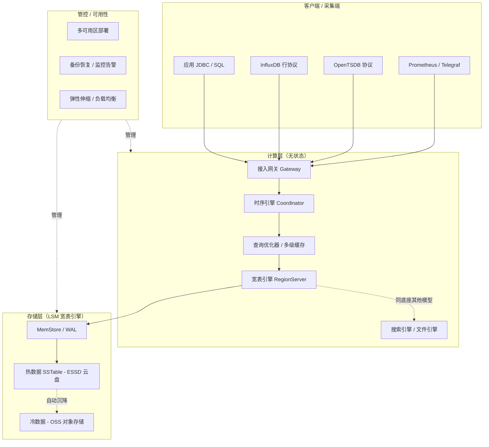
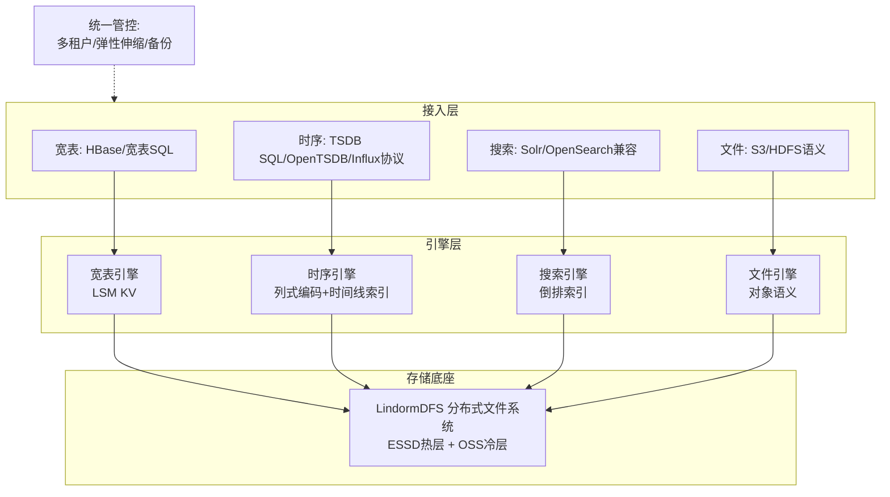
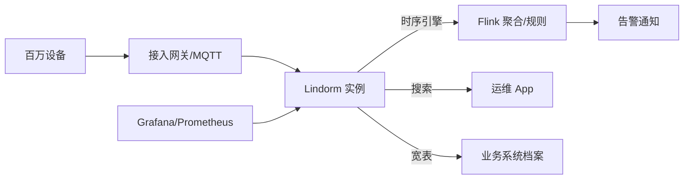
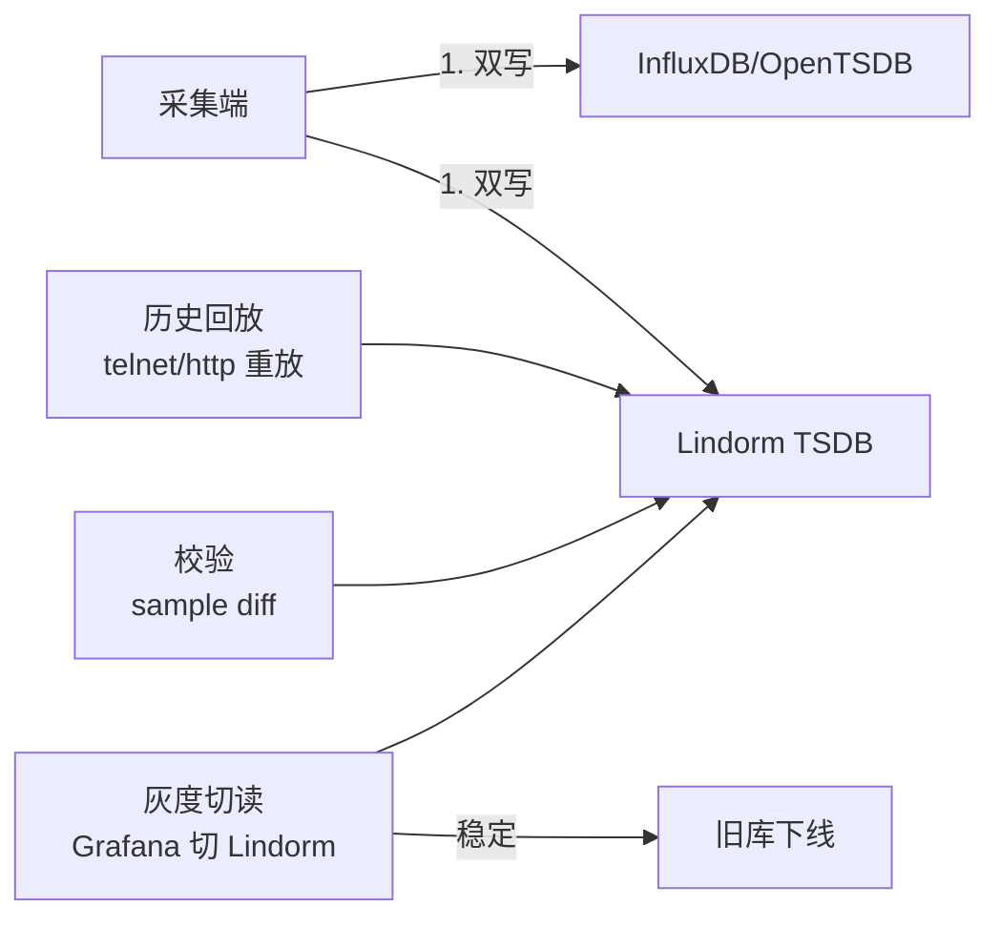

# Lindorm 时序引擎（Lindorm TSDB）详解

> 时序库板块子文档。概述见 [README](./README.md)。
> 说明：本文所述「Lindorm」指**阿里云 Lindorm 多模数据库中的时序引擎（Lindorm TSDB）**。若读者所指为开源时序数据库 **LinDB（dragonflydb/LinDB，原饿了么开源）**，其设计理念（按 metric/tag 分片、倒排索引、冷热分层）有相似之处但产品形态、部署方式差异较大，本文不展开，仅在文末做简要备注。

Lindorm（原 Lindorm 宽表，演进为多模数据库）是阿里云自研的**云原生多模数据库**，在一套存储与计算底座之上，同时提供「宽表、时序、搜索、文件」四种数据模型。其中的**时序引擎（Lindorm TSDB）**面向IoT、车联网、设备监控与业务指标场景，提供高写入吞吐、高压缩比与低成本冷热分层能力。

---

## 1. 定位与适用场景

### 1.1 定位

- 阿里云 **Lindorm 多模数据库** 的一个引擎实例：底层共享统一的分布式存储与管控，上层以不同「模型」对外暴露 API。
- 时序引擎专注于 **time-series** 数据：高并发写入、按时间区间的聚合扫描、兼容 OpenTSDB / InfluxDB 协议。
- 设计目标：**千万级 points/s 写入**、**数据压缩比 10:1 ~ 20:1**、**冷数据自动沉降到 OSS** 将存储成本降至块存储的 1/10 量级。
- 与「纯时序库」不同，它天然与同一实例里的宽表引擎、Lindorm Search（搜索引擎）互通，可在一个产品内做「时序写入 + 宽表关联 + 搜索检索」的混合负载。

### 1.2 适用场景

| 场景 | 说明 | 典型数据 |
|------|------|----------|
| IoT 设备监控 | 海量传感器高频上报，要求低成本长周期存储 | 温度/湿度/电流/电压 |
| 车联网 / 新能源 | 车辆轨迹、电池、电机时序，写入峰值高 | 车速/电量/SOC/定位 |
| 运维监控（APM） | 主机、容器、中间件指标，对接 Prometheus / Grafana | CPU/内存/QPS/延迟 |
| 业务指标 | 按时间聚合的业务埋点、交易额、在线人数 | 订单量/DAU/GMV |
| 工业时序 | 产线设备状态、PLC 点位数据 | 转速/压力/良率 |

### 1.3 不适用

- 强事务跨行一致性、复杂多表 JOIN 的 OLTP 业务 → 用 PolarDB / RDS 等关系库。
- 超大规模全文检索、灵活 schema 文档 → 用 Lindorm Search 或 Elasticsearch。
- 已有重度 InfluxDB/Flux 脚本依赖且不愿改协议 → 评估迁移成本。

---

## 2. 整体架构

### 2.1 架构要点

- **计算存储分离**：计算层（LindormDFS / Query Coordinator / RegionServer 角色）无状态，存储层基于 **LSM 宽表引擎（类 HBase 的分布式 KV）**，底层数据落在分布式文件系统（盘古/ESSD）。
- **多模一体**：四种模型（宽表 / 时序 / 搜索 / 文件）共享同一分布式存储底座，分别由不同的「引擎」组件负责解析与索引，避免多套系统数据拷贝。
- **时序引擎 = 一种数据模型**：时序引擎在底层仍把数据点编码成宽表的 KV（RowKey 由 tag 组合 + timestamp 编码而成），因此继承宽表引擎的水平扩展、多副本、自动均衡能力。
- **冷热分层**：热数据在 ESSD 云盘，冷数据（按 TTL / 手动策略）下沉到 **OSS 对象存储**，查询时引擎自动路由。

### 2.2 架构图（Mermaid）



---

## 3. 数据模型

Lindorm TSDB 提供 SQL 与兼容协议两套模型，概念对应关系如下：

| 概念 | 含义 | 类比 |
|------|------|------|
| database | 逻辑库 | InfluxDB database |
| table / metric | 指标表（measurement） | InfluxDB measurement |
| tag | 维度键值对（**建索引**，可过滤/分组） | InfluxDB tag |
| field | 指标数值（**不建索引**） | InfluxDB field |
| timestamp | 时间戳（毫秒/秒精度） | 时间戳 |

数据模型结构（类 OpenTSDB）：

```text
database
 └── table (metric)
      ├── tag set    # 维度：host=web01, region=cn-hangzhou
      ├── field set  # 指标值：cpu=0.81, mem=0.62
      └── timestamp  # 时间戳
```

- **Tag 设计要点**：基数（cardinality）必须可控。tag 取值无限（如 user_id、device_id 直接做 tag）会导致索引爆炸。**高基数列应作为 field 或用宽表引擎承载**，时序引擎只放有限枚举维度。
- **协议兼容**：同时兼容 OpenTSDB（telnet / http put）、InfluxDB 行协议（line protocol）、以及原生 Lindorm TSDB SQL。

---

## 4. 写入与查询

### 4.1 Lindorm TSDB SQL 写入

```sql
-- 建库建表（SQL 模型）
CREATE DATABASE IF NOT EXISTS iot_db;
USE iot_db;

CREATE TABLE IF NOT EXISTS device_metric (
    metric_name VARCHAR,        -- 指标名（可选，单表单指标时可省略）
    tag_host VARCHAR,           -- 维度：主机
    tag_region VARCHAR,         -- 维度：地域
    field_cpu DOUBLE,           -- 指标值
    field_mem DOUBLE,
    ts TIMESTAMP,               -- 时间戳
    PRIMARY KEY (tag_host, tag_region, ts)
);

-- 写入
INSERT INTO device_metric (tag_host, tag_region, field_cpu, field_mem, ts)
VALUES
  ('web01', 'cn-hangzhou', 0.81, 0.62, '2026-07-28 10:00:00'),
  ('web02', 'cn-hangzhou', 0.74, 0.58, '2026-07-28 10:00:00');
```

### 4.2 行协议（InfluxDB Line Protocol）兼容写入

```text
device_metric,host=web01,region=cn-hangzhou cpu=0.81,mem=0.62 1753687200000000000
device_metric,host=web02,region=cn-hangzhou cpu=0.74,mem=0.58 1753687200000000000
```

通过 InfluxDB 兼容端口发送（示例用 curl）：

```bash
# InfluxDB 行协议写入（兼容端口）
curl -i -XPOST 'http://ld-bp1xxxx.lindorm.rds.aliyuncs.com:8242/write?db=iot_db' \
  --data-binary \
'device_metric,host=web01,region=cn-hangzhou cpu=0.81,mem=0.62 1753687200000000000'
```

### 4.3 OpenTSDB 兼容写入（telnet / http）

```bash
# OpenTSDB telnet 风格（put 命令）
echo "put device_metric 1753687200 cpu=0.81 mem=0.62 host=web01 region=cn-hangzhou" \
  | nc ld-bp1xxxx.lindorm.rds.aliyuncs.com 4242

# OpenTSDB HTTP 批量写入
curl -XPOST 'http://ld-bp1xxxx.lindorm.rds.aliyuncs.com:8242/api/put' \
  -H 'Content-Type: application/json' \
  -d '[
    {"metric":"device_metric","timestamp":1753687200,
     "value":0.81,"tags":{"host":"web01","region":"cn-hangzhou","field":"cpu"}},
    {"metric":"device_metric","timestamp":1753687200,
     "value":0.62,"tags":{"host":"web01","region":"cn-hangzhou","field":"mem"}}
  ]'
```

### 4.4 查询示例

```sql
-- 按主机聚合最近 1 小时平均 CPU
SELECT tag_host,
       AVG(field_cpu) AS avg_cpu
FROM device_metric
WHERE ts >= NOW() - INTERVAL '1' HOUR
  AND tag_region = 'cn-hangzhou'
GROUP BY tag_host
ORDER BY tag_host;

-- 降采样：每 5 分钟取最大 CPU（时间窗口聚合）
SELECT time_bucket('5 minutes', ts) AS bucket,
       tag_host,
       MAX(field_cpu) AS max_cpu
FROM device_metric
WHERE ts >= NOW() - INTERVAL '6' HOUR
GROUP BY bucket, tag_host
ORDER BY bucket;
```

> 注：`time_bucket` 风格函数与 TimescaleDB 同源思想；Lindorm TSDB 实际以 `GROUP BY` + 时间窗口函数/内置降采样语法实现，不同 SDK 略有差异，以官方 SQL 参考为准。

---

## 5. 关键能力

### 5.1 时间戳 / 数值专用编码 → 高压缩比

- 时序数据高度有序、数值变化平滑，Lindorm 采用 **timestamp delta-of-delta** 编码、**value XOR / 浮点专用编码**（借鉴 Gorilla 思路），配合列存块压缩。
- 典型压缩比 **10:1 ~ 20:1**，远优于通用压缩（如 Snappy 对宽表 KV 的 3:1 左右）。

### 5.2 冷热分层存储

- 热数据：写入后在 ESSD 云盘，保证低延迟查询。
- 冷数据：按 **TTL / 手动策略** 自动或定时迁移到 **OSS**，成本降至块存储的约 1/10。
- 查询透明：引擎按时间范围自动判断数据所在层，用户无感知。

```yaml
# 冷热分层（控制台/API 配置示意）
coldStorage:
  enabled: true
  coldDataTtl: 90d          # 90 天后转冷
  hotStorageType: ESSD_PL1
  coldStorageType: OSS
  autoMigration: true
```

### 5.3 弹性伸缩与多级缓存

- **弹性**：计算节点（RegionServer / 时序协调者）可在线扩容，数据自动 rebalance；存储随写入量弹性。
- **多级缓存**：块缓存（BlockCache）+ 行缓存（RowCache）+ 查询结果缓存，热点时间线命中内存、降低 IO。

---

## 6. 高可用与运维

| 能力 | 说明 |
|------|------|
| 多可用区 | 默认多副本（3 副本），支持同城多 AZ 部署，AZ 故障自动切换 |
| 备份恢复 | 全量 + 增量备份，支持按时间点恢复（PITR） |
| 监控告警 | 接入云监控，关注写入延迟、QPS、压缩比、冷数据比例、节点负载 |
| 审计 | SQL 审计、慢查询日志 |
| 安全 | VPC 隔离、白名单、RAM 鉴权、TDE 加密 |

```bash
# 常见运维命令（aliyun CLI 示意）
aliyun lindorm UpdateInstanceIpWhiteList --InstanceId ld-bp1xxxx --IpList "10.0.0.0/8"
aliyun lindorm DescribeHotColdStorageInfo --InstanceId ld-bp1xxxx
```

---

## 7. 与 InfluxDB / TDengine / TimescaleDB 对比

| 维度 | Lindorm TSDB | InfluxDB | TDengine | TimescaleDB |
|------|--------------|----------|----------|-------------|
| 数据模型 | 多模（时序为之一），类 OpenTSDB/Influx | measurement+tag+field | 超级表+子表（tags 建表） | 超表（hypertable）基于 PG |
| 存储底座 | LSM 宽表引擎（自研） | TSM（v1）/ IOx(Parquet) | 自研时序存储 | PostgreSQL + 列式压缩 chunk |
| 压缩比 | 高（10~20:1） | 高（v1 TSM） | 很高（自研，可达 10:1+） | 中高（列压缩 4~10:1） |
| 冷热分层 | 原生（OSS 沉降） | 企业版/IOx 对象存储 | 原生（多级存储/归档） | 依赖 PG + 外部冷存/分区 |
| 协议生态 | OpenTSDB / Influx / SQL | InfluxQL / Flux / SQL | TDengine SQL / 行协议 | 100% PG / SQL |
| 事务能力 | 弱（时序模型） | 弱 | 弱 | 强（PG 事务） |
| 关系分析 | 中（与宽表引擎互通） | 弱 | 弱 | 强（JOIN/窗口/扩展） |
| 适用 | IoT/车联网/监控大厂云上 | 监控/DevOps | IoT/运维国产替代 | 既要时序又要关系分析 |

---

## 8. 生产实践与踩坑

### 8.1 Tag 基数（最重要）

- **坑**：把 `device_id`（百万级）当 tag → 索引与写入放大爆炸，集群抖动。
- **做法**：有限枚举维度（host/region/app）才做 tag；高基数列放 field，或用宽表引擎按 device_id 做 RowKey。
- 经验：单 metric 的 tag 组合数控制在 **万级以内** 更稳。

### 8.2 写入吞吐调优

- 批量写入（batch）而非单点；合理设置 `batch_size=500~2000`。
- 避免每条数据一个 timestamp 精度到纳秒且乱序 → 适度允许时间窗口内乱序（out-of-order）但过大窗口伤压缩。
- 客户端做 tag 维度预聚合，减少重复维度传输。
- 写入端开启压缩（gzip/snappy），降低网络开销。

### 8.3 冷热策略

- 按真实访问模式设 TTL：热数据 30~90 天，之后沉降 OSS，归档保留 1~N 年。
- 监控冷数据比例，避免「热盘被冷数据占满」。
- 查询冷数据走 OSS 延迟较高，避免对冷区间做高频明细查询，优先降采样后查。

### 8.4 其他

- 多可用区部署时，确认写入一致性级别与跨 AZ 带宽成本。
- 大查询（全量回扫）会挤占写入资源，用资源组 / 限速隔离。
- 关注压缩比指标，骤降往往意味着 tag 基数失控或乱序严重。

---

## 附：与 LinDB 的简要区别（备注）

若你所指是开源 **LinDB**（dragonflydb/LinDB，原饿了么开源，Go 语言实现的分布式时序库）：

- 设计强调「按 metric/tag 分片 + 倒排索引 + 列式存储 + 多级存储（本地/对象）」，同样面向超大规模监控。
- 它是**独立部署的开源项目**，非阿里云托管服务，运维需自建；Lindorm TSDB 是**全托管云产品**，深度集成阿里云生态（OSS 冷存、云监控、RAM）。
- 二者名字相近但产品形态、部署、协议兼容（LinDB 有自研协议与部分兼容）不同，选型时务必区分。

---

## 9. 运维实战与性能调优

### 9.1 冷热分层策略实操

冷热分层是 Lindorm 降本核心。热数据在 ESSD，冷数据按 TTL 自动沉降 OSS。

```bash
# 通过 aliyun CLI 开启冷热分层（示意）
aliyun lindorm UpdateMultiZoneClusterNode --InstanceId ld-bp1xxxx \
  --ColdStorageEnable true

# 查询冷热存储信息
aliyun lindorm DescribeHotColdStorageInfo --InstanceId ld-bp1xxxx
```

```sql
-- 设置某张时序表的冷数据 TTL（示意，以官方 SQL 为准）
ALTER TABLE device_metric SET OPTIONS (coldDataTtl = '90d');
```

实操原则：
- 热 TTL 设真实访问窗口（30~90 天）；超过即沉降，避免热盘被冷数据占满。
- 对冷区间（OSS）只做降采样后的聚合查询，避免高频明细回扫拉高延迟与费用。
- 监控「冷数据比例」，比例异常低说明分层未生效或 TTL 设错。

### 9.2 写入吞吐调优参数

- **批量写入**：客户端 `batch_size` 设 500~2000 点/批，减少网络往返。
- **并发连接**：写入客户端开启连接池，避免单连接成为瓶颈。
- **压缩**：开启 gzip/snappy 压缩 body，降低带宽。
- **预聚合 tag**：采集端对重复维度做合并，减少冗余 tag 传输。
- **避免极端乱序**：允许窗口内（分钟级）乱序，过大乱序窗口伤压缩与索引。

```yaml
# 写入客户端调优示意（InfluxDB 行协议兼容写入）
writer:
  batchSize: 1000
  flushInterval: 5s
  maxRetries: 3
  compression: gzip
  concurrency: 8
```

### 9.3 监控指标

| 类别 | 关键指标 | 告警建议 |
|------|----------|----------|
| 写入 | 写入 QPS、写入延迟 P99 | P99 > 1s 告警 |
| 存储 | 热/冷数据比例、压缩比 | 压缩比骤降即查基数 |
| 资源 | RegionServer CPU/内存、WAL 堆积 | 节点负载 > 80% 扩容 |
| 查询 | 慢查询数、大范围扫描 | 明细全扫占比异常 |
| 冷存 | OSS 读取延迟、沉降失败 | 沉降失败即告警 |

### 9.4 与 Flink 实时计算联动

Lindorm TSDB 可作为 Flink 的 sink（时序落地）或 source（维表/实时流），做实时聚合与告警。

```sql
-- Flink SQL：从 Kafka 读取设备数据，窗口聚合后写入 Lindorm
CREATE TABLE device_source (
  device_id STRING,
  cpu DOUBLE,
  ts TIMESTAMP(3),
  WATERMARK FOR ts AS ts - INTERVAL '5' SECOND
) WITH ('connector' = 'kafka', 'topic' = 'device-metrics', ...);

CREATE TABLE lindorm_sink (
  device_id STRING,
  avg_cpu DOUBLE,
  window_end TIMESTAMP(3)
) WITH (
  'connector' = 'lindorm',
  'endpoint' = 'ld-bp1xxxx.lindorm.rds.aliyuncs.com:8242',
  'database' = 'iot_db',
  'table'   = 'device_metric_agg'
);

INSERT INTO lindorm_sink
SELECT device_id, AVG(cpu), TUMBLE_END(ts, INTERVAL '1' MINUTE)
FROM device_source
GROUP BY device_id, TUMBLE(ts, INTERVAL '1' MINUTE);
```

联动要点：
- Flink 侧做好 watermark 与乱序容忍，避免 Lindorm 写入乱序放大。
- 聚合结果写单独聚合表，原始明细走另一张表，分层清晰。
- 用 Flink 做「实时富化」（关联设备元数据）后再落 Lindorm，减少查询期 JOIN。

### 9.5 成本优化

- **冷热分层**：冷数据转 OSS 成本约为块存储 1/10，是最大降本项。
- **合理 TTL**：不为「永远不会查」的数据付热存储费。
- **压缩比治理**：保持高压缩比（基数可控），同等数据占用更少空间。
- **弹性规格**：按写入峰谷选择计算规格，闲时降配（全托管支持弹性）。
- **资源组隔离**：大查询与写入用不同资源组，避免为保查询而盲目扩容。

### 9.6 故障排查 checklist

- [ ] 写入变慢 → 查 RegionServer 负载、WAL 堆积、是否热盘满。
- [ ] 压缩比骤降 → 查 tag 基数、乱序程度、是否高基数列混入 tag。
- [ ] 冷查询慢 → 确认是否对 OSS 区间做高频明细查询（应改聚合）。
- [ ] 多 AZ 写入延迟高 → 评估跨 AZ 带宽与一致性级别。
- [ ] 大查询挤占写入 → 用资源组/限流隔离。

---

## 多模引擎架构深入（宽表 / 时序 / 搜索 / 文件）



| 引擎 | 底层形态 | 互通方式 |
|------|---------|---------|
| 宽表 | 类 HBase LSM，RowKey 分片 | 时序数据本质存为宽表 KV；可直接读时序底层明细 |
| 时序 | 时间线编码 + 列式块 | 聚合结果可写回宽表供在线查询 |
| 搜索 | 倒排（类 Lucene） | 时序 tag/field 可建二级检索索引 |
| 文件 | 对象语义 | 统一权限与生命周期策略 |

多模价值：**一份数据免拷贝地获得「KV 点查 + 时间聚合 + 全文检索」三种访问路径**——例如车联网场景中轨迹明细走时序聚合、车辆档案走宽表、故障描述文本走搜索，全部在一个实例内完成。

## TTL 与降采样策略

```sql
-- 表级 TTL：过期数据自动清理（含冷层归档期控制）
ALTER TABLE device_metric SET OPTIONS (ttl = '1095d');

-- 降采样两级方案：
-- ① 查询期降采样：time_bucket/GROUP BY 窗口聚合（不落盘）
SELECT time_bucket('1 minute', ts) AS bucket,
       AVG(field_cpu) AS avg_cpu
FROM device_metric WHERE ts >= NOW() - INTERVAL '1' HOUR
GROUP BY bucket;

-- ② 物化降采样：Flink 定时窗口聚合写入独立降采样表（落盘）
INSERT INTO device_metric_1m
SELECT tag_host, AVG(field_cpu), MAX(field_cpu), TUMBLE_END(ts, INTERVAL '1' MINUTE)
FROM device_metric WHERE ts >= NOW() - INTERVAL '2' MINUTE
GROUP BY tag_host, TUMBLE(ts, INTERVAL '1' MINUTE);
```

| 层级 | 保留策略 | 典型用途 |
|------|---------|---------|
| 明细（热 ESSD） | 30~90 天 | 故障回溯、精确点查 |
| 明细（冷 OSS） | 90 天~1 年 | 低频审计查询 |
| 1 分钟聚合表 | 1~2 年 | 运营趋势分析 |
| 1 小时聚合表 | 3~5 年 | 年度容量规划 |

组合公式：**「长周期只查聚合、短周期才查明细」**——配合 TTL 让 95% 的存储成本落在最便宜的 OSS 冷层与高压缩聚合表上。

## 与 HBase 的兼容性及迁移

```text
兼容范围：
✅ 原生 HBase Java/REST API（Put/Get/Scan）
✅ Phoenix 部分语法（二级索引/SQL 查询）
⚠️ 协处理器（Coprocessor）、自定义 Filter 需评估改写
❌ 自研 RPC 定制、Region 手工迁移等运维级操作不开放

迁移路径：
① 结构评估：RowKey 设计/热点风险/大宽表列族规划复核
② 双写：生产端同时写 HBase 与 Lindorm（或用 BDS 同步链路）
③ 全量搬迁：BDS 数据同步服务做历史数据批量复制+增量追平
④ 校验切读：抽样比对 + 灰度应用切流 → 旧集群下线
```

| 对比项 | 自建 HBase | Lindorm 宽表 |
|--------|-----------|--------------|
| 运维 | 自担（HMaster/RSGC/ZK） | 全托管，自动 split/balance |
| 扩容 | 手工加节点搬 Region | 在线弹性，秒级生效 |
| 冷热分层 | 需自建归档管道 | 原生 OSS 沉降 |
| 计费 | 硬件 CAPEX | 按量 OPEX |

迁移收益典型值：运维人力省 1~2 FTE；利用冷热分层后存储成本降 50% 以上。最大风险点是 RowKey 热点设计缺陷被「原样搬运」——迁移前务必重审。

## 冷热分离存储策略（配置模板）

```yaml
# 实例级：开启冷存储
cold_storage:
  enabled: true
  medium: OSS

# 表级策略示例（三类典型业务）
policies:
  iot_raw:                 # IoT 原始点位：热窗口短
    hot_ttl: 30d
    cold_ttl: 365d
    archive_ttl: 0         # 不归档直接过期
  apm_metrics:             # 监控指标：中等窗口
    hot_ttl: 90d
    cold_ttl: 730d
  vehicle_track:           # 车联网轨迹：合规要求长保留
    hot_ttl: 60d
    cold_ttl: 1825d        # 5 年合规留存
```

```text
配置原则：
① 热 TTL = 真实高频查询窗口（看 Grafana 查询时间分布定），拍脑袋设长=白烧钱
② 冷区间禁高频明细扫描：OSS 读延迟高且计费，一律引导到聚合表
③ 监控「冷数据占比」：健康值通常 >60%；占比过低说明 TTL 过长
④ 归档到期自动清理，满足个保法「最小必要」留存义务
```

## 阿里云内典型应用场景

| 场景 | 数据特征 | Lindorm 组合用法 |
|------|---------|-----------------|
| IoT 平台 | 千万设备 × 秒级上报 | 时序引擎承接写入 + 规则引擎联动函数计算告警 |
| 云监控/APM | 高基数主机指标 | 兼容 Prometheus 远程读写，替代 Thanos 长存储 |
| 车联网 | 轨迹+车况双流 | 时序存轨迹、宽表存车辆档案、搜索查故障工单 |
| 风控画像 | 特征点查为主 | 宽表引擎毫秒级特征读取，对接实时决策引擎 |
| 数字孪生/工业 | PLC 点位 + 文档 | 时序 + 文件引擎混合，一个实例覆盖 |



选型提示：已在阿里云生态（VPC/RAM/OSS/DataWorks/Flink 实时计算）内的团队，Lindorm 的集成成本最低；多云或重度依赖开源生态（Prometheus 全家桶、HBase 上层工具）的场景要评估锁定风险。

容量速算模板：

```text
实例规格估算：
  写入 = 设备数 × 指标数 ÷ 上报间隔 → 决定计算节点数（预留 50% 峰值余量）
  存储 = 日增原始量 × 压缩比(取 1/10) × (热TTL + 冷TTL) → 决定冷热配比
  查询 = 并发看板数 × 单查询扫描量 → 决定是否需要聚合表与资源组隔离
```

---

## 10. 第三轮深度实战（基准 / 迁移 / 告警 / 流计算 / 成本 / 排障 SOP）

### 10.1 性能基准（推导 / 公开数字）

公开资料与阿里云文档给出的量级（需以自身负载复测）：
- 写入吞吐：千万级 points/s（集群横向扩展）。
- 压缩比：10:1 ~ 20:1（delta-of-delta + XOR + 列存）。
- 冷数据成本：沉降 OSS 后约为块存储 1/10。

推导：
```text
写入 points/s ≈ 设备数 × 每设备指标数 / 上报间隔(s)
例：100 万设备、每设备 5 指标、5s 上报 → 1e6×5/5 = 1e6 点/s
→ 需多 dnode + 连接池，单客户端 batch 1000~2000
```

### 10.2 迁移实战：InfluxDB / OpenTSDB → Lindorm 双写切换 SOP



SOP：
1. **双写**：采集端同时写旧库与 Lindorm（Lindorm 兼容 InfluxDB 行协议 / OpenTSDB）。
2. **回放**：用旧库导出按时间区间重放到 Lindorm（注意 tag 模型对齐：高基数列改 field 或宽表 RowKey）。
3. **校验**：抽样比对 `(metric, tags, ts)` 值，误差 < 1e-6。
4. **切读**：Grafana 数据源切 Lindorm，观察 48h。
5. **下线**：旧库只读 7 天确认后停写。

```bash
# 双写：InfluxDB 行协议兼容端口写 Lindorm
curl -i -XPOST 'http://ld-bp1xxxx.lindorm.rds.aliyuncs.com:8242/write?db=iot_db' \
  --data-binary 'device_metric,host=web01,region=cn-hangzhou cpu=0.81 1753687200000000000'
```

### 10.3 与监控 / Grafana 全链路告警规则示例

Lindorm TSDB 接入 Grafana 后，用 Grafana Unified Alerting 对 SQL 查询结果告警：

```yaml
apiVersion: 1
groups:
  - name: lindorm_cpu_alert
    rules:
      - alert: HighDeviceCpu
        sql: |
          SELECT tag_host, AVG(field_cpu) AS v
          FROM device_metric
          WHERE ts >= NOW() - INTERVAL '5' MINUTE AND tag_region='cn-hangzhou'
          GROUP BY tag_host HAVING AVG(field_cpu) > 0.85
        for: 5m
        labels: { severity: warning }
        annotations:
          summary: "设备 {{ $labels.tag_host }} 5 分钟平均 CPU > 85%"
```

全链路 Checklist：
- [ ] 写入 `batch_size=1000`、并发 8、gzip 开启。
- [ ] 监控 RegionServer CPU/内存、WAL 堆积、压缩比。
- [ ] Grafana 查询带 `ts >=` 下界，冷区间改聚合查询。

### 10.4 与 Flink / Spark 实时计算联动代码

Flink SQL 实时聚合写 Lindorm（含 watermark 与乱序容忍）：

```sql
CREATE TABLE device_src (
  device_id STRING, cpu DOUBLE, ts TIMESTAMP(3),
  WATERMARK FOR ts AS ts - INTERVAL '10' SECOND
) WITH ('connector'='kafka','topic'='device-metrics', ...);

CREATE TABLE lindorm_agg (
  device_id STRING, avg_cpu DOUBLE, w_end TIMESTAMP(3)
) WITH (
  'connector'='lindorm','endpoint'='ld-bp1xxxx.lindorm.rds.aliyuncs.com:8242',
  'database'='iot_db','table'='device_metric_agg'
);

INSERT INTO lindorm_agg
SELECT device_id, AVG(cpu), TUMBLE_END(ts, INTERVAL '1' MINUTE)
FROM device_src GROUP BY device_id, TUMBLE(ts, INTERVAL '1' MINUTE);
```

Spark 读 Lindorm（JDBC）：

```scala
val df = spark.read.format("jdbc")
  .option("url", "jdbc:lindorm:8242/iot_db")
  .option("query", "SELECT tag_host, field_cpu, ts FROM device_metric WHERE ts >= NOW() - INTERVAL 1 HOUR")
  .load()
df.groupBy("tag_host").avg("field_cpu").show()
```

联动要点：Flink 做富化后再落 Lindorm，减少查询期 JOIN；聚合与明细分表。

### 10.5 成本优化（冷热分层 / 降采样 / 保留策略）

```bash
# 开启冷热分层 + 查询冷存信息
aliyun lindorm UpdateMultiZoneClusterNode --InstanceId ld-bp1xxxx --ColdStorageEnable true
aliyun lindorm DescribeHotColdStorageInfo --InstanceId ld-bp1xxxx
```

```sql
-- 热 TTL 90d，超期自动沉降 OSS；归档保留 3 年
ALTER TABLE device_metric SET OPTIONS (coldDataTtl='90d', archiveTtl='1095d');
```

成本模型（示意）：热 ESSD 约 ¥0.8/GB·月，冷 OSS 约 ¥0.08/GB·月（1/10）。若 80% 数据为冷，整体存储成本可降 ~70%。

降本清单：
- [ ] 热 TTL 贴合真实访问窗口，避免热盘被冷数据占满。
- [ ] 冷区间只做聚合查询，禁高频明细回扫。
- [ ] 保持高压缩比（基数可控）；闲时降配计算规格。
- [ ] 大查询与写入用资源组隔离，避免盲目扩容。

### 10.6 生产排障 SOP

**Cardinality 治理**
- [ ] 单 metric tag 组合数控在万级；`device_id` 等高基数列放 field / 宽表 RowKey。
- [ ] 监控压缩比，骤降即查高基数列是否混入 tag。

**写入拒绝 / 延迟高 SOP**
- [ ] 查 RegionServer 负载、WAL 堆积、是否热盘满。
- [ ] 调大 `batch_size`/并发、开压缩；多 AZ 评估跨 AZ 带宽。

**查询超时 SOP**
- [ ] 确认带 `ts >=` 下界；冷区间改聚合。
- [ ] 大查询用资源组限流，避免挤占写入。
