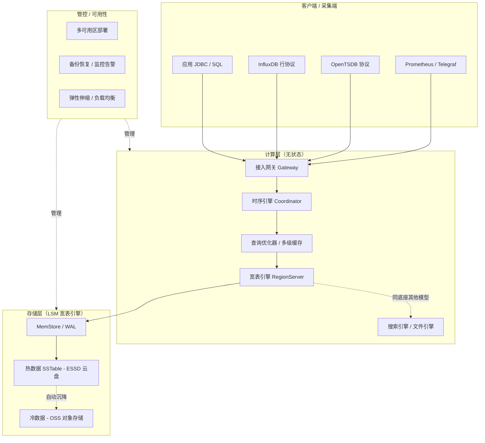

# Lindorm 时序引擎（Lindorm TSDB）详解

> 时序库板块子文档。概述见 [README](./README.md)。
> 说明：本文所述「Lindorm」指**阿里云 Lindorm 多模数据库中的时序引擎（Lindorm TSDB）**。若读者所指为开源时序数据库 **LinDB（dragonflydb/LinDB，原饿了么开源）**，其设计理念（按 metric/tag 分片、倒排索引、冷热分层）有相似之处但产品形态、部署方式差异较大，本文不展开，仅在文末做简要备注。

Lindorm（原 Lindorm 宽表，演进为多模数据库）是阿里云自研的**云原生多模数据库**，在一套存储与计算底座之上，同时提供「宽表、时序、搜索、文件」四种数据模型。其中的**时序引擎（Lindorm TSDB）**面向IoT、车联网、设备监控与业务指标场景，提供高写入吞吐、高压缩比与低成本冷热分层能力。

---

## 1. 定位与适用场景

### 1.1 定位

- 阿里云 **Lindorm 多模数据库** 的一个引擎实例：底层共享统一的分布式存储与管控，上层以不同「模型」对外暴露 API。
- 时序引擎专注于 **time-series** 数据：高并发写入、按时间区间的聚合扫描、兼容 OpenTSDB / InfluxDB 协议。
- 设计目标：**千万级 points/s 写入**、**数据压缩比 10:1 ~ 20:1**、**冷数据自动沉降到 OSS** 将存储成本降至块存储的 1/10 量级。
- 与「纯时序库」不同，它天然与同一实例里的宽表引擎、Lindorm Search（搜索引擎）互通，可在一个产品内做「时序写入 + 宽表关联 + 搜索检索」的混合负载。

### 1.2 适用场景

| 场景 | 说明 | 典型数据 |
|------|------|----------|
| IoT 设备监控 | 海量传感器高频上报，要求低成本长周期存储 | 温度/湿度/电流/电压 |
| 车联网 / 新能源 | 车辆轨迹、电池、电机时序，写入峰值高 | 车速/电量/SOC/定位 |
| 运维监控（APM） | 主机、容器、中间件指标，对接 Prometheus / Grafana | CPU/内存/QPS/延迟 |
| 业务指标 | 按时间聚合的业务埋点、交易额、在线人数 | 订单量/DAU/GMV |
| 工业时序 | 产线设备状态、PLC 点位数据 | 转速/压力/良率 |

### 1.3 不适用

- 强事务跨行一致性、复杂多表 JOIN 的 OLTP 业务 → 用 PolarDB / RDS 等关系库。
- 超大规模全文检索、灵活 schema 文档 → 用 Lindorm Search 或 Elasticsearch。
- 已有重度 InfluxDB/Flux 脚本依赖且不愿改协议 → 评估迁移成本。

---

## 2. 整体架构

### 2.1 架构要点

- **计算存储分离**：计算层（LindormDFS / Query Coordinator / RegionServer 角色）无状态，存储层基于 **LSM 宽表引擎（类 HBase 的分布式 KV）**，底层数据落在分布式文件系统（盘古/ESSD）。
- **多模一体**：四种模型（宽表 / 时序 / 搜索 / 文件）共享同一分布式存储底座，分别由不同的「引擎」组件负责解析与索引，避免多套系统数据拷贝。
- **时序引擎 = 一种数据模型**：时序引擎在底层仍把数据点编码成宽表的 KV（RowKey 由 tag 组合 + timestamp 编码而成），因此继承宽表引擎的水平扩展、多副本、自动均衡能力。
- **冷热分层**：热数据在 ESSD 云盘，冷数据（按 TTL / 手动策略）下沉到 **OSS 对象存储**，查询时引擎自动路由。

### 2.2 架构图（Mermaid）



---

## 3. 数据模型

Lindorm TSDB 提供 SQL 与兼容协议两套模型，概念对应关系如下：

| 概念 | 含义 | 类比 |
|------|------|------|
| database | 逻辑库 | InfluxDB database |
| table / metric | 指标表（measurement） | InfluxDB measurement |
| tag | 维度键值对（**建索引**，可过滤/分组） | InfluxDB tag |
| field | 指标数值（**不建索引**） | InfluxDB field |
| timestamp | 时间戳（毫秒/秒精度） | 时间戳 |

数据模型结构（类 OpenTSDB）：

```text
database
 └── table (metric)
      ├── tag set    # 维度：host=web01, region=cn-hangzhou
      ├── field set  # 指标值：cpu=0.81, mem=0.62
      └── timestamp  # 时间戳
```

- **Tag 设计要点**：基数（cardinality）必须可控。tag 取值无限（如 user_id、device_id 直接做 tag）会导致索引爆炸。**高基数列应作为 field 或用宽表引擎承载**，时序引擎只放有限枚举维度。
- **协议兼容**：同时兼容 OpenTSDB（telnet / http put）、InfluxDB 行协议（line protocol）、以及原生 Lindorm TSDB SQL。

---

## 4. 写入与查询

### 4.1 Lindorm TSDB SQL 写入

```sql
-- 建库建表（SQL 模型）
CREATE DATABASE IF NOT EXISTS iot_db;
USE iot_db;

CREATE TABLE IF NOT EXISTS device_metric (
    metric_name VARCHAR,        -- 指标名（可选，单表单指标时可省略）
    tag_host VARCHAR,           -- 维度：主机
    tag_region VARCHAR,         -- 维度：地域
    field_cpu DOUBLE,           -- 指标值
    field_mem DOUBLE,
    ts TIMESTAMP,               -- 时间戳
    PRIMARY KEY (tag_host, tag_region, ts)
);

-- 写入
INSERT INTO device_metric (tag_host, tag_region, field_cpu, field_mem, ts)
VALUES
  ('web01', 'cn-hangzhou', 0.81, 0.62, '2026-07-28 10:00:00'),
  ('web02', 'cn-hangzhou', 0.74, 0.58, '2026-07-28 10:00:00');
```

### 4.2 行协议（InfluxDB Line Protocol）兼容写入

```text
device_metric,host=web01,region=cn-hangzhou cpu=0.81,mem=0.62 1753687200000000000
device_metric,host=web02,region=cn-hangzhou cpu=0.74,mem=0.58 1753687200000000000
```

通过 InfluxDB 兼容端口发送（示例用 curl）：

```bash
# InfluxDB 行协议写入（兼容端口）
curl -i -XPOST 'http://ld-bp1xxxx.lindorm.rds.aliyuncs.com:8242/write?db=iot_db' \
  --data-binary \
'device_metric,host=web01,region=cn-hangzhou cpu=0.81,mem=0.62 1753687200000000000'
```

### 4.3 OpenTSDB 兼容写入（telnet / http）

```bash
# OpenTSDB telnet 风格（put 命令）
echo "put device_metric 1753687200 cpu=0.81 mem=0.62 host=web01 region=cn-hangzhou" \
  | nc ld-bp1xxxx.lindorm.rds.aliyuncs.com 4242

# OpenTSDB HTTP 批量写入
curl -XPOST 'http://ld-bp1xxxx.lindorm.rds.aliyuncs.com:8242/api/put' \
  -H 'Content-Type: application/json' \
  -d '[
    {"metric":"device_metric","timestamp":1753687200,
     "value":0.81,"tags":{"host":"web01","region":"cn-hangzhou","field":"cpu"}},
    {"metric":"device_metric","timestamp":1753687200,
     "value":0.62,"tags":{"host":"web01","region":"cn-hangzhou","field":"mem"}}
  ]'
```

### 4.4 查询示例

```sql
-- 按主机聚合最近 1 小时平均 CPU
SELECT tag_host,
       AVG(field_cpu) AS avg_cpu
FROM device_metric
WHERE ts >= NOW() - INTERVAL '1' HOUR
  AND tag_region = 'cn-hangzhou'
GROUP BY tag_host
ORDER BY tag_host;

-- 降采样：每 5 分钟取最大 CPU（时间窗口聚合）
SELECT time_bucket('5 minutes', ts) AS bucket,
       tag_host,
       MAX(field_cpu) AS max_cpu
FROM device_metric
WHERE ts >= NOW() - INTERVAL '6' HOUR
GROUP BY bucket, tag_host
ORDER BY bucket;
```

> 注：`time_bucket` 风格函数与 TimescaleDB 同源思想；Lindorm TSDB 实际以 `GROUP BY` + 时间窗口函数/内置降采样语法实现，不同 SDK 略有差异，以官方 SQL 参考为准。

---

## 5. 关键能力

### 5.1 时间戳 / 数值专用编码 → 高压缩比

- 时序数据高度有序、数值变化平滑，Lindorm 采用 **timestamp delta-of-delta** 编码、**value XOR / 浮点专用编码**（借鉴 Gorilla 思路），配合列存块压缩。
- 典型压缩比 **10:1 ~ 20:1**，远优于通用压缩（如 Snappy 对宽表 KV 的 3:1 左右）。

### 5.2 冷热分层存储

- 热数据：写入后在 ESSD 云盘，保证低延迟查询。
- 冷数据：按 **TTL / 手动策略** 自动或定时迁移到 **OSS**，成本降至块存储的约 1/10。
- 查询透明：引擎按时间范围自动判断数据所在层，用户无感知。

```yaml
# 冷热分层（控制台/API 配置示意）
coldStorage:
  enabled: true
  coldDataTtl: 90d          # 90 天后转冷
  hotStorageType: ESSD_PL1
  coldStorageType: OSS
  autoMigration: true
```

### 5.3 弹性伸缩与多级缓存

- **弹性**：计算节点（RegionServer / 时序协调者）可在线扩容，数据自动 rebalance；存储随写入量弹性。
- **多级缓存**：块缓存（BlockCache）+ 行缓存（RowCache）+ 查询结果缓存，热点时间线命中内存、降低 IO。

---

## 6. 高可用与运维

| 能力 | 说明 |
|------|------|
| 多可用区 | 默认多副本（3 副本），支持同城多 AZ 部署，AZ 故障自动切换 |
| 备份恢复 | 全量 + 增量备份，支持按时间点恢复（PITR） |
| 监控告警 | 接入云监控，关注写入延迟、QPS、压缩比、冷数据比例、节点负载 |
| 审计 | SQL 审计、慢查询日志 |
| 安全 | VPC 隔离、白名单、RAM 鉴权、TDE 加密 |

```bash
# 常见运维命令（aliyun CLI 示意）
aliyun lindorm UpdateInstanceIpWhiteList --InstanceId ld-bp1xxxx --IpList "10.0.0.0/8"
aliyun lindorm DescribeHotColdStorageInfo --InstanceId ld-bp1xxxx
```

---

## 7. 与 InfluxDB / TDengine / TimescaleDB 对比

| 维度 | Lindorm TSDB | InfluxDB | TDengine | TimescaleDB |
|------|--------------|----------|----------|-------------|
| 数据模型 | 多模（时序为之一），类 OpenTSDB/Influx | measurement+tag+field | 超级表+子表（tags 建表） | 超表（hypertable）基于 PG |
| 存储底座 | LSM 宽表引擎（自研） | TSM（v1）/ IOx(Parquet) | 自研时序存储 | PostgreSQL + 列式压缩 chunk |
| 压缩比 | 高（10~20:1） | 高（v1 TSM） | 很高（自研，可达 10:1+） | 中高（列压缩 4~10:1） |
| 冷热分层 | 原生（OSS 沉降） | 企业版/IOx 对象存储 | 原生（多级存储/归档） | 依赖 PG + 外部冷存/分区 |
| 协议生态 | OpenTSDB / Influx / SQL | InfluxQL / Flux / SQL | TDengine SQL / 行协议 | 100% PG / SQL |
| 事务能力 | 弱（时序模型） | 弱 | 弱 | 强（PG 事务） |
| 关系分析 | 中（与宽表引擎互通） | 弱 | 弱 | 强（JOIN/窗口/扩展） |
| 适用 | IoT/车联网/监控大厂云上 | 监控/DevOps | IoT/运维国产替代 | 既要时序又要关系分析 |

---

## 8. 生产实践与踩坑

### 8.1 Tag 基数（最重要）

- **坑**：把 `device_id`（百万级）当 tag → 索引与写入放大爆炸，集群抖动。
- **做法**：有限枚举维度（host/region/app）才做 tag；高基数列放 field，或用宽表引擎按 device_id 做 RowKey。
- 经验：单 metric 的 tag 组合数控制在 **万级以内** 更稳。

### 8.2 写入吞吐调优

- 批量写入（batch）而非单点；合理设置 `batch_size=500~2000`。
- 避免每条数据一个 timestamp 精度到纳秒且乱序 → 适度允许时间窗口内乱序（out-of-order）但过大窗口伤压缩。
- 客户端做 tag 维度预聚合，减少重复维度传输。
- 写入端开启压缩（gzip/snappy），降低网络开销。

### 8.3 冷热策略

- 按真实访问模式设 TTL：热数据 30~90 天，之后沉降 OSS，归档保留 1~N 年。
- 监控冷数据比例，避免「热盘被冷数据占满」。
- 查询冷数据走 OSS 延迟较高，避免对冷区间做高频明细查询，优先降采样后查。

### 8.4 其他

- 多可用区部署时，确认写入一致性级别与跨 AZ 带宽成本。
- 大查询（全量回扫）会挤占写入资源，用资源组 / 限速隔离。
- 关注压缩比指标，骤降往往意味着 tag 基数失控或乱序严重。

---

## 附：与 LinDB 的简要区别（备注）

若你所指是开源 **LinDB**（dragonflydb/LinDB，原饿了么开源，Go 语言实现的分布式时序库）：

- 设计强调「按 metric/tag 分片 + 倒排索引 + 列式存储 + 多级存储（本地/对象）」，同样面向超大规模监控。
- 它是**独立部署的开源项目**，非阿里云托管服务，运维需自建；Lindorm TSDB 是**全托管云产品**，深度集成阿里云生态（OSS 冷存、云监控、RAM）。
- 二者名字相近但产品形态、部署、协议兼容（LinDB 有自研协议与部分兼容）不同，选型时务必区分。
