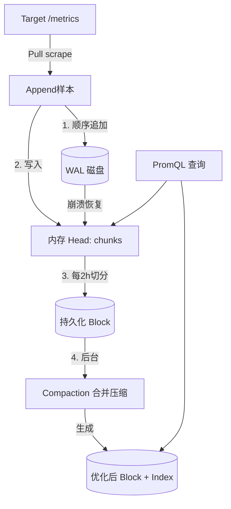
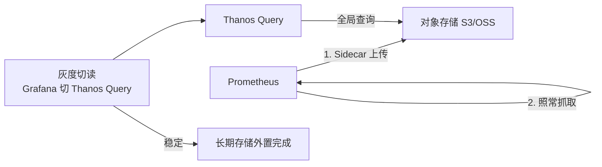

# Prometheus 与本地 TSDB

> Prometheus 是**云原生监控的事实标准**。其自带的本地 TSDB（Time Series Database）并非独立服务端，而是 Prometheus 监控系统的**存储组件**。

---

## 1. 定位与适用场景

Prometheus 是一套**完整的监控系统**（采集 + 存储 + 查询 + 告警），而非单纯的数据库。它的存储引擎被称为 **Prometheus TSDB**，以 Go 实现，作为 Prometheus Server 进程内的一部分运行。

| 维度 | 说明 |
| --- | --- |
| 项目归属 | CNCF 毕业项目，SoundCloud 起源 |
| 语言 | Go |
| 角色 | 监控系统（抓取、存储、查询、告警一体化） |
| 存储形态 | 进程内本地 TSDB（磁盘目录 + WAL） |
| 数据模型 | metric name + label 集合 + 时间戳 + 值 |
| 典型场景 | Kubernetes / 微服务可观测性、指标监控、告警 |
| 局限 | 单机本地存储，不适合超大规模长期存储 |

关键点：**TSDB 是 Prometheus 的本地存储引擎**，通常不把 Prometheus 当作「独立时序数据库服务」对外提供写入 API（虽支持 remote_write/remote_read 对接外部存储）。

---

## 2. 数据模型

### 2.1 metric + label

每个时间序列由 **metric name** 与一组 **label（键值对）** 唯一标识：

```
<metric_name>{<label1>=<v1>, <label2>=<v2>, ...}  <timestamp> <value>
```

示例：

```
http_requests_total{method="POST", handler="/api/v1/login", code="200"} 1467106610 1027
```

- metric name 描述「测量什么」（如 `http_requests_total`）。
- label 提供**多维维度切片**（method、handler、code），是 PromQL 灵活查询的基础。
- 同一 metric name + label 组合 + 递增时间戳 = 一条时间线（time series）。

### 2.2 Pull 拉取模型 + 服务发现

- Prometheus 主动 **Pull（拉取）** 目标暴露的 `/metrics` HTTP 端点，而非被动接收推送。
- 通过 **服务发现**（Kubernetes、Consul、文件、EC2 等）动态获取抓取目标列表。
- 拉取间隔（`scrape_interval`）控制采样频率，直接决定数据量与实时性。

```yaml
# prometheus.yml 抓取配置
scrape_configs:
  - job_name: 'node'
    scrape_interval: 15s
    static_configs:
      - targets: ['node-exporter:9100']
  - job_name: 'k8s-pods'
    kubernetes_sd_configs:
      - role: pod
```

---

## 3. 本地 TSDB 存储机制

### 3.1 写入路径：WAL + 内存 Head + 持久化 Block

1. **WAL（Write-Ahead Log）**：样本先追加写入 WAL（顺序写），保证崩溃可恢复。
2. **内存 Head**：最近样本在内存的 Head 中按时间序列组织（chunks），支持即时查询。
3. **持久化 Block**：Head 中样本按时间（默认 2 小时）切成不可变的 **block** 落盘，block 内样本被**压缩（chunk encoding）**。

### 3.2 Compaction（压缩合并）

- 落盘 block 会后台做 **compaction**：合并小 block、提升压缩率、构建索引。
- 还有 **vertical compaction** 将重叠时间范围的 block 合并，减少查询需打开的文件数。

### 3.3 时间分块目录结构

数据目录形如：

```
./data
├── wal/
│   ├── 000001      # 预写日志段
│   └── 000002
├── chunks_head/    # 内存 head 落盘中的 chunk
├── 01HX.../        # block (2h)
│   ├── chunks/     # 压缩后的样本数据
│   │   └── 000001
│   ├── index       # 倒排索引 (label -> series)
│   ├── meta.json   # block 元信息
│   └── tombstones  # 删除标记
├── 01HY.../
└── lock
```

### 3.4 写入/存储流程图（Mermaid）



---

## 4. 远程读写（对接长期存储）

Prometheus 本地存储**不适合长期、大数据量**保存，原因：

- 单机磁盘容量有限，无原生横向分片；
- 查询跨大量 block 时内存/IO 压力大；
- 历史数据高可用弱（单点）。

因此 Prometheus 提供 **remote_write / remote_read** 把数据外溢到专业时序库：

```yaml
# prometheus.yml
remote_write:
  - url: http://victoriametrics:8480/insert/0/prometheus/api/v1/write
remote_read:
  - url: http://victoriametrics:8480/select/0/prometheus/api/v1/read
```

| 外部存储 | 角色 |
| --- | --- |
| VictoriaMetrics | 高压缩长期存储，PromQL 兼容 |
| Thanos | Sidecar + 对象存储，全局查询/长期保留 |
| Cortex / Mimir | 水平扩展、对象存储后端 |
| TDengine | 海量设备指标（通过 adapter 兼容） |

**为何本地不适合长期大数据量**：TSDB 的 block 模型在超长跨度、超多序列下会导致索引膨胀、compaction 成本陡增、单机成为瓶颈；将这些交给专门设计的分布式时序库更稳妥。

---

## 5. PromQL 简介

PromQL 是 Prometheus 的查询语言，面向「时间序列集合」运算。

### 5.1 常用算子

```promql
# 瞬时向量选择
node_memory_MemFree_bytes

# 区间向量（过去5分钟）
rate(http_requests_total[5m])

# 算术 / 比较 / 聚合
sum(rate(http_requests_total[5m])) by (code)
node_cpu_seconds_total{mode!="idle"} > 0.5
```

### 5.2 rate / irate

```promql
# rate：区间内的平均每秒增长率（自动处理 counter 重置）
rate(http_requests_total[5m])

# irate：仅用区间最后两个点计算瞬时增长率，更灵敏但更易抖
irate(http_requests_total[5m])
```

### 5.3 聚合

```promql
# 求和、平均、分位、最大
sum without(instance) (rate(cpu_usage[5m]))
avg by (pod) (container_cpu_usage_seconds_total)
quantile by (le) (0.95, latency_seconds_bucket)
max_over_time(node_load5[1h])
```

---

## 6. 局限与最佳实践

### 6.1 局限

| 局限 | 说明 |
| --- | --- |
| 单机容量 | 本地 TSDB 非分布式，受单机磁盘/内存限制 |
| 长期存储弱 | 默认保留期短（如 15d），历史查询成本高 |
| 高基数敏感 | label 基数爆炸会拖垮内存与查询 |
| 数据持久性 | 单点，需配合外部存储/备份 |

### 6.2 最佳实践

- **长期存储外置**：用 remote_write 对接 VictoriaMetrics / Thanos / Mimir。
- **控制基数**：避免把 `user_id`、`trace_id`、`request_id` 等高基数字段作为 label。
- **合理 scrape_interval**：不必所有指标 10s 抓一次，低频指标放宽间隔。
- **联邦 / 分片（Federation）**：大规模用 `federation` 让上层 Prometheus 聚合下层，或用 Thanos/Cortex 做全局视图。
- **记录规则（Recording Rules）**：把常用重查询预计算为新的时间序列，降低查询开销。

```yaml
# recording rules 示例
groups:
  - name: example
    rules:
      - record: job:http_requests:rate5m
        expr: sum by (job) (rate(http_requests_total[5m]))
```

---

## 7. 在「监控场景」中的定位对比

| 维度 | Prometheus(本地TSDB) | VictoriaMetrics | Thanos | Cortex/Mimir |
| --- | --- | --- | --- | --- |
| 角色 | 监控+存储一体化 | 长期存储/独立TSDB | 全局查询+长期 | 分布式长期存储 |
| 存储位置 | 本地磁盘 | 本地磁盘 | 对象存储 | 对象存储 |
| 水平扩展 | 弱（联邦） | 强（cluster） | 强 | 强 |
| PromQL | 原生 | 兼容(超集) | 兼容 | 兼容 |
| 部署复杂度 | 极低 | 低 | 中 | 高 |
| 适用规模 | 中小/单集群 | 中~大 | 大（多集群统一） | 大（多租户） |

**结论**：Prometheus 是监控的**采集与查询入口**，本地 TSDB 负责短期热数据；长期、大规模、跨集群统一视图应交给 VictoriaMetrics / Thanos / Mimir 等专门存储，二者是**互补而非替代**关系。

---

## 8. 小结

Prometheus 的本地 TSDB 是一个**嵌入式、面向监控优化**的时序存储：WAL 保可靠、内存 Head 保实时、2 小时 block + compaction 保压缩与查询效率。它最适合作为云原生监控的「短期热存储 + 查询引擎」，而通过 remote_write 把长期数据卸载到 VictoriaMetrics / Thanos / TDengine 等专业时序库，才能既保住 PromQL 生态又撑起规模化与持久化需求。

---

## 9. 运维实战与性能调优

### 9.1 长期存储外置方案对比

| 方案 | 机制 | 优点 | 缺点 |
|------|------|------|------|
| VictoriaMetrics | remote_write + 本地盘 | 简单、低延迟、高压缩 | 需自管磁盘 |
| Thanos Sidecar | 本地 block 上传对象存储 | 多集群统一、全局视图 | 对象存储延迟、组件多 |
| Cortex / Mimir | remote_write + 对象存储 | 多租户、水平扩展 | 部署复杂 |
| 双 Prom + 远端 | remote_write 到另一 Prom | 快速验证 | 非真正长期方案 |

### 9.2 Federation 分层

联邦让上层 Prometheus 从下层 Prom 拉取**已聚合**的结果，避免全量数据上卷。

```yaml
# 上层 Prometheus 的 federation 配置
scrape_configs:
  - job_name: 'federate'
    honor_labels: true
    metrics_path: '/federate'
    params:
      'match[]':
        - '{job="node"}'          # 只拉聚合后的时间序列
        - 'sum:node_cpu:rate5m'
    static_configs:
      - targets: ['prom-low-1:9090', 'prom-low-2:9090']
```

原则：联邦只传递聚合指标（如 `sum:xxx`），不传递原始高基数序列。

### 9.3 Record Rules 预计算

把高频重查询物化为新时间序列，查询时直接读结果：

```yaml
groups:
  - name: cpu_rules
    interval: 30s
    rules:
      - record: sum:node_cpu:rate5m
        expr: sum by (instance) (rate(node_cpu_seconds_total[5m]))
      - record: job:http_requests:rate5m
        expr: sum by (job) (rate(http_requests_total[5m]))
```

> record rule 极大降低 Grafana 面板与告警的重复计算；注意 rule 自身也会产生 series，避免 rule 输出高基数。

### 9.4 高可用（双写 / Thanos Sidecar）

**双写 HA**：两份 Prometheus 抓取同一目标，remote_write 到同一后端，查询层去重。

```yaml
# 两个 Prom 实例都配同样的 remote_write，VM 侧开启 dedup
remote_write:
  - url: http://vminsert:8480/insert/0/prometheus/api/v1/write
```

**Thanos Sidecar**：每个 Prom 旁挂 sidecar，上传 block 到对象存储，Query 组件做全局查询。

```yaml
# thanos sidecar 与 prometheus 同 pod
args:
  - sidecar
  - --prometheus.url=http://localhost:9090
  - --objstore.config-file=/etc/thanos/s3.yml
```

### 9.5 大规模下的分片

单 Prometheus 实例建议活跃 series 控制在 **200 万~500 万** 以内；超出则分片：

- **按功能分片**：node / k8s / blackbox 各一个 Prom。
- **按租户/业务分片**：每业务线独立 Prom，上层联邦或 Thanos 聚合。
- **Hashmod 分片**：用 `hashmod` relabel 把目标均分到 N 个 Prom 实例。

```yaml
# 按目标 hash 分 3 片中的第 0 片
relabel_configs:
  - source_labels: [__address__]
    modulus: 3
    target_label: __tmp_shard
    action: hashmod
  - source_labels: [__tmp_shard]
    regex: 0
    action: keep
```

### 9.6 故障排查 checklist

- [ ] 内存涨/OOM → 查 label 基数（target 数 × metrics × labels）。
- [ ] TSDB 加载慢/重启久 → 查 block 数量、head series 数、WAL 重放。
- [ ] 查询超时 → 是否全量扫、是否缺 record rule、区间是否过大。
- [ ] 数据缺口 → 查 scrape 失败、remote_write 队列堆积、去重配置。
- [ ] 磁盘满 → 查 retention、compaction 是否卡住、cardinality 是否失控。

---

## 10. 第三轮深度实战（基准 / 迁移 / 告警 / 流计算 / 成本 / 排障 SOP）

### 10.1 Prometheus TSDB Compaction 深入

```
Compaction 类型：
  Level 1：Head → Block（每 2 小时）
  Level 2：合并小 Block（1~4 小时块 → 更大块）
  Level 3：合并中等 Block（多天块 → 月级块）
  Level 4：大块合并（月级 → 季度级）

Compaction 策略：
  - 时间窗口：2 小时 head → block
  - 合并阈值：block 数量 > N 时触发合并
  - 压缩率：提升 2~5 倍
  - 索引重建：合并后重建倒排索引
```

### 10.2 Prometheus Exemplars

```
Exemplars 用途：
  关联指标与链路追踪
  在指标中嵌入 traceId
  从指标跳转到具体 Trace

示例：
  http_request_duration_seconds_bucket{le="0.5"} 1234 # {traceId="abc123"}

配置：
  remote_write:
    - url: http://thanos-receive:19291/api/v1/receive
      send_exemplars: true
```

### 10.3 Prometheus Native Histograms

```
Native Histograms：
  原生直方图，无需预定义桶
  自动调整桶边界
  更精确的分位数计算
  更小的存储空间

使用：
  在应用中使用 histogram 和 native histogram
  Prometheus 自动识别并存储
  PromQL 查询直方图数据
```

### 10.4 Prometheus Remote Write/Read 深入

```yaml
# remote_write 高级配置
remote_write:
  - url: http://victoriametrics:8480/insert/0/prometheus/api/v1/write
    queue_config:
      max_samples_per_send: 10000
      batch_send_deadline: 5s
      min_shards: 1
      max_shards: 200
      capacity: 100000
    write_relabel_configs:
      - source_labels: [__name__]
        regex: 'go_.*'
        action: drop
    send_timeout: 30s
    queue_config:
      max_samples_per_send: 10000
```

### 10.5 Thanos Store Gateway 深入

```
Thanos Store Gateway：
  对象存储的缓存层
  缓存热门数据到本地
  减少对象存储访问

配置：
  storegateway:
    - --data-dir=/data
    --objstore.config-file=/etc/thanos/s3.yml
    --index-cache-size=500MB
    --chunk-pool-size=2GB
```

### 10.6 Thanos Compactor

```
Thanos Compactor：
  对象存储数据压缩
  降采样（5m/1h 块）
  保留策略管理

配置：
  compactor:
    - --data-dir=/data
    --objstore.config-file=/etc/thanos/s3.yml
    --retention.resolution-raw=30d
    --retention.resolution-5m=90d
    --retention.resolution-1h=365d
```

### 10.7 Thanos Ruler

```
Thanos Ruler：
  分布式告警/记录规则
  基于 Thanos Query 查询
  高可用告警

配置：
  ruler:
    - --data-dir=/data
    --objstore.config-file=/etc/thanos/s3.yml
    --query=thanos-query:10901
    --rule-file=/etc/thanos/rules/*.yml
```

### 10.8 kube-prometheus-stack 深入

```
kube-prometheus-stack 组件：
  Prometheus Operator：管理 Prometheus 实例
  Grafana：可视化
  Alertmanager：告警管理
  Node Exporter：节点指标
  kube-state-metrics：K8s 资源指标
  Prometheus Adapter：自定义指标

部署：
  helm install kube-prometheus-stack prometheus-community/kube-prometheus-stack

配置：
  Prometheus：
    retention: 15d
    resources: { requests: { memory: 2Gi } }
  Grafana：
    adminPassword: admin
  Alertmanager：
    config: { ... }
```

---

## 11. 速查表（扩展）

### 10.1 性能基准（推导 / 公开数字）

- 写入吞吐：单实例受内存/ compaction 约束，活跃 series 建议 ≤ 200~500 万。
- 压缩：1~2 B/点（约 1~3:1），弱于专用 TSDB。
- 查询：热数据低延迟；跨月多 block 高延迟。

推导：
```text
日磁盘(GB) ≈ samples/s × 86400 × 2B / 1024³
例：1000 samples/s → 1000×86400×2/1e9 ≈ 0.17 GB/天（压缩后，实际更高因索引）
```

### 10.2 迁移实战：Prometheus → Thanos 双写切换 SOP



SOP：
1. **挂载 Sidecar**：每个 Prom 旁挂 Thanos Sidecar，上传 block 到对象存储。
2. **部署 Query**：Thanos Query 聚合各 Prom + 对象存储，提供全局 PromQL。
3. **灰度切读**：Grafana 数据源先 5% 切 Thanos Query，比对与本地一致。
4. **降本地保留**：本地 retention 从 15d 降到 7d，历史走 Thanos。
5. **多 Prom 分片**：超规模按 hashmod 分片，上层 Thanos 统一。

```yaml
# thanos sidecar
args: [sidecar, --prometheus.url=http://localhost:9090, --objstore.config-file=/etc/thanos/s3.yml]
# 降本地保留
global: { external_labels: { cluster: a } }
storage: { tsdb: { retention: 7d } }
```

### 10.3 与监控 / Grafana 全链路告警规则示例

Alertmanager + recording rules 全链路：

```yaml
# alert rules
groups:
  - name: instance_down
    rules:
      - alert: InstanceDown
        expr: up == 0
        for: 5m
        labels: { severity: critical }
        annotations: { summary: "实例 {{ $labels.instance }} 宕机" }
      - record: instance:cpu:rate5m
        expr: 100 - (avg by(instance) (rate(node_cpu_seconds_total{mode="idle"}[5m])) * 100)
```

全链路 Checklist：
- [ ] Alertmanager 路由正确（email/钉钉/Slack）。
- [ ] recording rule 输出非高基数；rule 自身 series 受控。
- [ ] 长期查询走 Thanos/VM，本地只保热数据。

### 10.4 与 Flink / Spark 实时计算联动代码

Prometheus 作源：通过 remote_write 适配把样本送入 Kafka，Flink 消费富化。

```bash
# 用 prometheus-remote-write 适配（如自研/开源）把 remote_write 转 Kafka
# Prometheus 侧：
remote_write:
  - url: http://adapter:9090/api/v1/write   # adapter 写 Kafka topic metrics
```

Flink SQL 消费：
```sql
CREATE TABLE prom_src (
  metric STRING, instance STRING, value DOUBLE, ts TIMESTAMP(3)
) WITH ('connector'='kafka','topic'='metrics', ...);

INSERT INTO agg_sink
SELECT metric, instance, AVG(value), TUMBLE_END(ts, INTERVAL '1' MINUTE)
FROM prom_src GROUP BY metric, instance, TUMBLE(ts, INTERVAL '1' MINUTE);
```

Spark 读（通过 Thanos Query HTTP）：
```scala
// 用 HTTP 客户端访问 Thanos Query /api/v1/query_range，解析 JSON 为 DataFrame
```

联动要点：remote_write 到适配层实现「采集即流」；富化后再落 TSDB/数仓。

### 10.5 成本优化（长期存储外置 / 降采样 / 保留）

- **外置长期存储**：remote_write 到 VM/Thanos，本地只保 7~15d 热数据，省本地盘。
- **降采样**：用 recording rule 预聚合，长期只查聚合序列；Thanos `downsampling` 自动生成 5m/1h 块。
- **保留分层**：本地 7d → VM 12 月 → 对象存储归档。

```yaml
# 本地保留收紧
storage: { tsdb: { retention: 7d } }
# remote_write 到 VM 长期
remote_write:
  - url: http://vminsert:8480/insert/0/prometheus/api/v1/write
```

## 九、Prometheus 联邦与远程存储

### 联邦集群架构

```
Prometheus 联邦架构：
  层级设计：
    ├── 全局 Prometheus（Federation）
    │   ├── 抓取各区域 Prometheus
    │   ├── 全局视图
    │   └── 跨区域聚合
    ├── 区域 Prometheus
    │   ├── 抓取区域指标
    │   └── 本地存储
    └── 应用实例
        └── 暴露 metrics

  联邦查询：
    /federate?match[]={job="app"}

  优点：
    ├── 水平扩展：每区域独立 Prometheus
    ├── 降低单点压力
    └── 故障隔离

  缺点：
    ├── 数据延迟：联邦间隔影响
    ├── 存储重复：区域和全局都存储
    └── 管理复杂：需要维护多实例
```

### 远程存储方案

```
Prometheus 远程存储：
  1. Thanos
     ├── 对象存储：S3/GCS/OSS
     ├── 全局查询：Thanos Query
     ├── 降采样：Thanos Compactor
     └── 数据完整性校验

  2. Cortex
     ├── 对象存储后端
     ├── 多租户支持
     ├── 水平扩展
     └── 与 Grafana 深度集成

  3. VictoriaMetrics
     ├── 高性能写入
     ├── 压缩存储
     ├── 兼容 Prometheus API
     └── 单机/集群模式

  4. Mimir（Grafana）
     ├── 基于 Cortex 改进
     ├── 无限基数支持
     ├── 原生 Grafana 集成
     └── 生产级稳定性

配置示例（Thanos Sidecar）：
  prometheus:
    --storage.tsdb.path=/prometheus
    --storage.tsdb.min-block-duration=2h
    --storage.tsdb.max-block-duration=2h

  thanos sidecar:
    --tsdb.path=/prometheus
    --objstore.config-file=bucket.yml
    --prometheus.url=http://localhost:9090
```

## 十、Prometheus 高可用部署

### 高可用架构

```
Prometheus 高可用方案：
  方案 1：主备复制
    ├── 主 Prometheus 抓取指标
    ├── 备 Prometheus 复制主数据
    ├── 故障时切换到备
    └── 适用：小规模部署

  方案 2：联邦集群
    ├── 多个 Prometheus 实例
    ├── 联邦 Prometheus 聚合
    ├── 负载均衡
    └── 适用：中等规模

  方案 3：Thanos/Cortex
    ├── 多 Prometheus 写入对象存储
    ├── 全局查询层
    ├── 无限扩展
    └── 适用：大规模生产

部署配置：
  # Prometheus 配置
  global:
    scrape_interval: 15s
    evaluation_interval: 15s

  # 服务发现
  scrape_configs:
    - job_name: 'kubernetes-pods'
      kubernetes_sd_configs:
        - role: pod
      relabel_configs:
        - source_labels: [__meta_kubernetes_pod_annotation_prometheus_io_scrape]
          action: keep
          regex: true
```

### Prometheus 性能调优

```
Prometheus 性能调优：
  1. 抓取优化
     ├── scrape_interval：15s（默认）→ 根据需求调整
     ├── scrape_timeout：10s（默认）→ 根据目标调整
     ├── sample_limit：5000（默认）→ 控制单目标样本数
     └── metric_relabel_configs：预过滤不需要的指标

  2. 存储优化
     ├── retention：90d（默认）→ 根据存储容量调整
     ├── storage.tsdb.min-block-duration：2h
     ├── storage.tsdb.max-block-duration：2h
     └── storage.tsdb.wal-compression：启用 WAL 压缩

  3. 查询优化
     ├── recording rules：预计算常用查询
     ├── query timeout：2m（默认）
     ├── query max samples：50000000
     └── 避免高基数标签

  4. 资源限制
     ├── CPU：2-4 核（生产环境）
     ├── 内存：4-16 GB（根据时间序列数）
     ├── 磁盘：SSD，IOPS > 10000
     └── 网络：1 Gbps+

  5. 监控 Prometheus 自身
     ├── prometheus 目标：抓取 Prometheus 自身
     ├── 指标：prometheus_tsdb_*、prometheus_rule_group_*
     └── 告警：高内存、高 CPU、抓取失败
```

## 十一、Prometheus 与 Kubernetes 集成

### Kubernetes 服务发现

```
Prometheus Kubernetes 服务发现：
  1. Pod 发现
     role: pod
     元数据：
       __meta_kubernetes_pod_name
       __meta_kubernetes_pod_label_xxx
       __meta_kubernetes_namespace
       __meta_kubernetes_pod_annotation_prometheus_io_scrape

  2. Service 发现
     role: service
     元数据：
       __meta_kubernetes_service_name
       __meta_kubernetes_service_label_xxx
       __meta_kubernetes_namespace

  3. Endpoints 发现
     role: endpoints
     元数据：
       __meta_kubernetes_endpoint_port_name
       __meta_kubernetes_endpoint_port_protocol

  4. Node 发现
     role: node
     元数据：
       __meta_kubernetes_node_name
       __meta_kubernetes_node_label_xxx

配置示例：
  scrape_configs:
    - job_name: 'kubernetes-pods'
      kubernetes_sd_configs:
        - role: pod
      relabel_configs:
        - source_labels: [__meta_kubernetes_pod_annotation_prometheus_io_scrape]
          action: keep
          regex: true
        - source_labels: [__meta_kubernetes_pod_annotation_prometheus_io_path]
          action: replace
          target_label: __metrics_path__
          regex: (.+)
        - source_labels: [__address__, __meta_kubernetes_pod_annotation_prometheus_io_port]
          action: replace
          target_label: __address__
          regex: ([^:]+)(?::\d+)?;(\d+)
          replacement: $1:$2
```

### Prometheus Operator

```
Prometheus Operator 架构：
  组件：
    ├── Prometheus Operator：管理 Prometheus 资源
    ├── Prometheus：Prometheus 实例
    ├── Alertmanager：告警管理器
    ├── Grafana：可视化
    └── ServiceMonitor：定义抓取目标

  CRD 资源：
    ├── Prometheus：Prometheus 实例配置
    ├── ServiceMonitor：定义抓取目标
    ├── PrometheusRule：定义告警规则
    └── Alertmanager：Alertmanager 实例配置

  配置示例：
    apiVersion: monitoring.coreos.com/v1
    kind: ServiceMonitor
    metadata:
      name: my-app
    spec:
      selector:
        matchLabels:
          app: my-app
      endpoints:
        - port: http
          path: /metrics
          interval: 15s

    apiVersion: monitoring.coreos.com/v1
    kind: PrometheusRule
    metadata:
      name: my-app-rules
    spec:
      groups:
        - name: my-app
          rules:
            - alert: HighErrorRate
              expr: rate(http_requests_total{status=~"5.."}[5m]) > 0.1
              for: 5m
              labels:
                severity: critical
              annotations:
                summary: "高错误率告警"
```

## 十二、Prometheus 告警最佳实践

### 告警规则设计

```yaml
# 告警规则模板
groups:
  - name: infrastructure
    rules:
      # 实例宕机
      - alert: InstanceDown
        expr: up == 0
        for: 1m
        labels:
          severity: critical
        annotations:
          summary: "实例宕机"
          description: "实例 {{ $labels.instance }} 已宕机超过 1 分钟"

      # CPU 使用率过高
      - alert: HighCpuUsage
        expr: 100 - (avg by(instance) (irate(node_cpu_seconds_total{mode="idle"}[5m])) * 100) > 80
        for: 5m
        labels:
          severity: warning
        annotations:
          summary: "CPU 使用率过高"
          description: "实例 {{ $labels.instance }} CPU 使用率超过 80%"

      # 内存使用率过高
      - alert: HighMemoryUsage
        expr: (1 - node_memory_MemAvailable_bytes / node_memory_MemTotal_bytes) * 100 > 85
        for: 5m
        labels:
          severity: warning
        annotations:
          summary: "内存使用率过高"
          description: "实例 {{ $labels.instance }} 内存使用率超过 85%"

      # 磁盘使用率过高
      - alert: HighDiskUsage
        expr: (1 - node_filesystem_avail_bytes{fstype!~"tmpfs|fuse.lxcfs"} / node_filesystem_size_bytes) * 100 > 85
        for: 5m
        labels:
          severity: warning
        annotations:
          summary: "磁盘使用率过高"
          description: "实例 {{ $labels.instance }} 磁盘使用率超过 85%"

  - name: application
    rules:
      # HTTP 错误率过高
      - alert: HighHttpErrorRate
        expr: sum(rate(http_requests_total{status=~"5.."}[5m])) / sum(rate(http_requests_total[5m])) > 0.05
        for: 5m
        labels:
          severity: critical
        annotations:
          summary: "HTTP 错误率过高"
          description: "HTTP 5xx 错误率超过 5%"

      # 响应时间过长
      - alert: HighResponseTime
        expr: histogram_quantile(0.95, rate(http_request_duration_seconds_bucket[5m])) > 1
        for: 5m
        labels:
          severity: warning
        annotations:
          summary: "响应时间过长"
          description: "P95 响应时间超过 1 秒"
```

### 告警路由与通知

```yaml
# Alertmanager 配置
global:
  resolve_timeout: 5m
  smtp_smarthost: 'smtp.example.com:587'
  smtp_from: 'alertmanager@example.com'
  smtp_auth_username: 'alertmanager@example.com'
  smtp_auth_password: 'password'

route:
  receiver: 'default'
  group_by: ['alertname', 'cluster', 'service']
  group_wait: 30s
  group_interval: 5m
  repeat_interval: 4h
  routes:
    - match:
        severity: critical
      receiver: 'critical'
      group_wait: 10s
    - match:
        severity: warning
      receiver: 'warning'

receivers:
  - name: 'default'
    email_configs:
      - to: 'team@example.com'

  - name: 'critical'
    webhook_configs:
      - url: 'http://alert-handler:8080/critical'
        send_resolved: true

  - name: 'warning'
    email_configs:
      - to: 'team@example.com'
        send_resolved: true

inhibit_rules:
  - source_match:
      severity: 'critical'
    target_match:
      severity: 'warning'
    equal: ['alertname', 'instance']
```

### 10.6 生产排障 SOP

**Cardinality 治理**
- [ ] `curl localhost:9090/api/v1/status/tsdb` 看 TopN 高基 metric。
- [ ] `metric_relabel_configs` 丢弃 `user_id`/`trace_id` 等高基 label。
- [ ] 单实例 series > 500 万即分片（hashmod）。

**写入拒绝 / OOM SOP**
- [ ] OOM → 砍基数、升内存、降 scrape 频率。
- [ ] WAL 重放慢/重启久 → 查 block 数、head series。

**查询超时 SOP**
- [ ] 是否全量扫、区间过大；加 recording rule。
- [ ] 远程读（remote_read）延迟高 → 查后端 VM/Thanos 状态。
