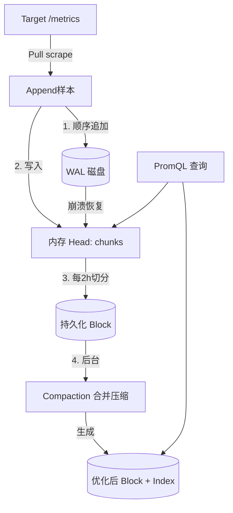

# Prometheus 与本地 TSDB

> Prometheus 是**云原生监控的事实标准**。其自带的本地 TSDB（Time Series Database）并非独立服务端，而是 Prometheus 监控系统的**存储组件**。

---

## 1. 定位与适用场景

Prometheus 是一套**完整的监控系统**（采集 + 存储 + 查询 + 告警），而非单纯的数据库。它的存储引擎被称为 **Prometheus TSDB**，以 Go 实现，作为 Prometheus Server 进程内的一部分运行。

| 维度 | 说明 |
| --- | --- |
| 项目归属 | CNCF 毕业项目，SoundCloud 起源 |
| 语言 | Go |
| 角色 | 监控系统（抓取、存储、查询、告警一体化） |
| 存储形态 | 进程内本地 TSDB（磁盘目录 + WAL） |
| 数据模型 | metric name + label 集合 + 时间戳 + 值 |
| 典型场景 | Kubernetes / 微服务可观测性、指标监控、告警 |
| 局限 | 单机本地存储，不适合超大规模长期存储 |

关键点：**TSDB 是 Prometheus 的本地存储引擎**，通常不把 Prometheus 当作「独立时序数据库服务」对外提供写入 API（虽支持 remote_write/remote_read 对接外部存储）。

---

## 2. 数据模型

### 2.1 metric + label

每个时间序列由 **metric name** 与一组 **label（键值对）** 唯一标识：

```
<metric_name>{<label1>=<v1>, <label2>=<v2>, ...}  <timestamp> <value>
```

示例：

```
http_requests_total{method="POST", handler="/api/v1/login", code="200"} 1467106610 1027
```

- metric name 描述「测量什么」（如 `http_requests_total`）。
- label 提供**多维维度切片**（method、handler、code），是 PromQL 灵活查询的基础。
- 同一 metric name + label 组合 + 递增时间戳 = 一条时间线（time series）。

### 2.2 Pull 拉取模型 + 服务发现

- Prometheus 主动 **Pull（拉取）** 目标暴露的 `/metrics` HTTP 端点，而非被动接收推送。
- 通过 **服务发现**（Kubernetes、Consul、文件、EC2 等）动态获取抓取目标列表。
- 拉取间隔（`scrape_interval`）控制采样频率，直接决定数据量与实时性。

```yaml
# prometheus.yml 抓取配置
scrape_configs:
  - job_name: 'node'
    scrape_interval: 15s
    static_configs:
      - targets: ['node-exporter:9100']
  - job_name: 'k8s-pods'
    kubernetes_sd_configs:
      - role: pod
```

---

## 3. 本地 TSDB 存储机制

### 3.1 写入路径：WAL + 内存 Head + 持久化 Block

1. **WAL（Write-Ahead Log）**：样本先追加写入 WAL（顺序写），保证崩溃可恢复。
2. **内存 Head**：最近样本在内存的 Head 中按时间序列组织（chunks），支持即时查询。
3. **持久化 Block**：Head 中样本按时间（默认 2 小时）切成不可变的 **block** 落盘，block 内样本被**压缩（chunk encoding）**。

### 3.2 Compaction（压缩合并）

- 落盘 block 会后台做 **compaction**：合并小 block、提升压缩率、构建索引。
- 还有 **vertical compaction** 将重叠时间范围的 block 合并，减少查询需打开的文件数。

### 3.3 时间分块目录结构

数据目录形如：

```
./data
├── wal/
│   ├── 000001      # 预写日志段
│   └── 000002
├── chunks_head/    # 内存 head 落盘中的 chunk
├── 01HX.../        # block (2h)
│   ├── chunks/     # 压缩后的样本数据
│   │   └── 000001
│   ├── index       # 倒排索引 (label -> series)
│   ├── meta.json   # block 元信息
│   └── tombstones  # 删除标记
├── 01HY.../
└── lock
```

### 3.4 写入/存储流程图（Mermaid）



---

## 4. 远程读写（对接长期存储）

Prometheus 本地存储**不适合长期、大数据量**保存，原因：

- 单机磁盘容量有限，无原生横向分片；
- 查询跨大量 block 时内存/IO 压力大；
- 历史数据高可用弱（单点）。

因此 Prometheus 提供 **remote_write / remote_read** 把数据外溢到专业时序库：

```yaml
# prometheus.yml
remote_write:
  - url: http://victoriametrics:8480/insert/0/prometheus/api/v1/write
remote_read:
  - url: http://victoriametrics:8480/select/0/prometheus/api/v1/read
```

| 外部存储 | 角色 |
| --- | --- |
| VictoriaMetrics | 高压缩长期存储，PromQL 兼容 |
| Thanos | Sidecar + 对象存储，全局查询/长期保留 |
| Cortex / Mimir | 水平扩展、对象存储后端 |
| TDengine | 海量设备指标（通过 adapter 兼容） |

**为何本地不适合长期大数据量**：TSDB 的 block 模型在超长跨度、超多序列下会导致索引膨胀、compaction 成本陡增、单机成为瓶颈；将这些交给专门设计的分布式时序库更稳妥。

---

## 5. PromQL 简介

PromQL 是 Prometheus 的查询语言，面向「时间序列集合」运算。

### 5.1 常用算子

```promql
# 瞬时向量选择
node_memory_MemFree_bytes

# 区间向量（过去5分钟）
rate(http_requests_total[5m])

# 算术 / 比较 / 聚合
sum(rate(http_requests_total[5m])) by (code)
node_cpu_seconds_total{mode!="idle"} > 0.5
```

### 5.2 rate / irate

```promql
# rate：区间内的平均每秒增长率（自动处理 counter 重置）
rate(http_requests_total[5m])

# irate：仅用区间最后两个点计算瞬时增长率，更灵敏但更易抖
irate(http_requests_total[5m])
```

### 5.3 聚合

```promql
# 求和、平均、分位、最大
sum without(instance) (rate(cpu_usage[5m]))
avg by (pod) (container_cpu_usage_seconds_total)
quantile by (le) (0.95, latency_seconds_bucket)
max_over_time(node_load5[1h])
```

---

## 6. 局限与最佳实践

### 6.1 局限

| 局限 | 说明 |
| --- | --- |
| 单机容量 | 本地 TSDB 非分布式，受单机磁盘/内存限制 |
| 长期存储弱 | 默认保留期短（如 15d），历史查询成本高 |
| 高基数敏感 | label 基数爆炸会拖垮内存与查询 |
| 数据持久性 | 单点，需配合外部存储/备份 |

### 6.2 最佳实践

- **长期存储外置**：用 remote_write 对接 VictoriaMetrics / Thanos / Mimir。
- **控制基数**：避免把 `user_id`、`trace_id`、`request_id` 等高基数字段作为 label。
- **合理 scrape_interval**：不必所有指标 10s 抓一次，低频指标放宽间隔。
- **联邦 / 分片（Federation）**：大规模用 `federation` 让上层 Prometheus 聚合下层，或用 Thanos/Cortex 做全局视图。
- **记录规则（Recording Rules）**：把常用重查询预计算为新的时间序列，降低查询开销。

```yaml
# recording rules 示例
groups:
  - name: example
    rules:
      - record: job:http_requests:rate5m
        expr: sum by (job) (rate(http_requests_total[5m]))
```

---

## 7. 在「监控场景」中的定位对比

| 维度 | Prometheus(本地TSDB) | VictoriaMetrics | Thanos | Cortex/Mimir |
| --- | --- | --- | --- | --- |
| 角色 | 监控+存储一体化 | 长期存储/独立TSDB | 全局查询+长期 | 分布式长期存储 |
| 存储位置 | 本地磁盘 | 本地磁盘 | 对象存储 | 对象存储 |
| 水平扩展 | 弱（联邦） | 强（cluster） | 强 | 强 |
| PromQL | 原生 | 兼容(超集) | 兼容 | 兼容 |
| 部署复杂度 | 极低 | 低 | 中 | 高 |
| 适用规模 | 中小/单集群 | 中~大 | 大（多集群统一） | 大（多租户） |

**结论**：Prometheus 是监控的**采集与查询入口**，本地 TSDB 负责短期热数据；长期、大规模、跨集群统一视图应交给 VictoriaMetrics / Thanos / Mimir 等专门存储，二者是**互补而非替代**关系。

---

## 8. 小结

Prometheus 的本地 TSDB 是一个**嵌入式、面向监控优化**的时序存储：WAL 保可靠、内存 Head 保实时、2 小时 block + compaction 保压缩与查询效率。它最适合作为云原生监控的「短期热存储 + 查询引擎」，而通过 remote_write 把长期数据卸载到 VictoriaMetrics / Thanos / TDengine 等专业时序库，才能既保住 PromQL 生态又撑起规模化与持久化需求。

---

## 9. 运维实战与性能调优

### 9.1 长期存储外置方案对比

| 方案 | 机制 | 优点 | 缺点 |
|------|------|------|------|
| VictoriaMetrics | remote_write + 本地盘 | 简单、低延迟、高压缩 | 需自管磁盘 |
| Thanos Sidecar | 本地 block 上传对象存储 | 多集群统一、全局视图 | 对象存储延迟、组件多 |
| Cortex / Mimir | remote_write + 对象存储 | 多租户、水平扩展 | 部署复杂 |
| 双 Prom + 远端 | remote_write 到另一 Prom | 快速验证 | 非真正长期方案 |

### 9.2 Federation 分层

联邦让上层 Prometheus 从下层 Prom 拉取**已聚合**的结果，避免全量数据上卷。

```yaml
# 上层 Prometheus 的 federation 配置
scrape_configs:
  - job_name: 'federate'
    honor_labels: true
    metrics_path: '/federate'
    params:
      'match[]':
        - '{job="node"}'          # 只拉聚合后的时间序列
        - 'sum:node_cpu:rate5m'
    static_configs:
      - targets: ['prom-low-1:9090', 'prom-low-2:9090']
```

原则：联邦只传递聚合指标（如 `sum:xxx`），不传递原始高基数序列。

### 9.3 Record Rules 预计算

把高频重查询物化为新时间序列，查询时直接读结果：

```yaml
groups:
  - name: cpu_rules
    interval: 30s
    rules:
      - record: sum:node_cpu:rate5m
        expr: sum by (instance) (rate(node_cpu_seconds_total[5m]))
      - record: job:http_requests:rate5m
        expr: sum by (job) (rate(http_requests_total[5m]))
```

> record rule 极大降低 Grafana 面板与告警的重复计算；注意 rule 自身也会产生 series，避免 rule 输出高基数。

### 9.4 高可用（双写 / Thanos Sidecar）

**双写 HA**：两份 Prometheus 抓取同一目标，remote_write 到同一后端，查询层去重。

```yaml
# 两个 Prom 实例都配同样的 remote_write，VM 侧开启 dedup
remote_write:
  - url: http://vminsert:8480/insert/0/prometheus/api/v1/write
```

**Thanos Sidecar**：每个 Prom 旁挂 sidecar，上传 block 到对象存储，Query 组件做全局查询。

```yaml
# thanos sidecar 与 prometheus 同 pod
args:
  - sidecar
  - --prometheus.url=http://localhost:9090
  - --objstore.config-file=/etc/thanos/s3.yml
```

### 9.5 大规模下的分片

单 Prometheus 实例建议活跃 series 控制在 **200 万~500 万** 以内；超出则分片：

- **按功能分片**：node / k8s / blackbox 各一个 Prom。
- **按租户/业务分片**：每业务线独立 Prom，上层联邦或 Thanos 聚合。
- **Hashmod 分片**：用 `hashmod` relabel 把目标均分到 N 个 Prom 实例。

```yaml
# 按目标 hash 分 3 片中的第 0 片
relabel_configs:
  - source_labels: [__address__]
    modulus: 3
    target_label: __tmp_shard
    action: hashmod
  - source_labels: [__tmp_shard]
    regex: 0
    action: keep
```

### 9.6 故障排查 checklist

- [ ] 内存涨/OOM → 查 label 基数（target 数 × metrics × labels）。
- [ ] TSDB 加载慢/重启久 → 查 block 数量、head series 数、WAL 重放。
- [ ] 查询超时 → 是否全量扫、是否缺 record rule、区间是否过大。
- [ ] 数据缺口 → 查 scrape 失败、remote_write 队列堆积、去重配置。
- [ ] 磁盘满 → 查 retention、compaction 是否卡住、cardinality 是否失控。
