# Prometheus 与本地 TSDB

> Prometheus 是**云原生监控的事实标准**。其自带的本地 TSDB（Time Series Database）并非独立服务端，而是 Prometheus 监控系统的**存储组件**。

---

## 1. 定位与适用场景

Prometheus 是一套**完整的监控系统**（采集 + 存储 + 查询 + 告警），而非单纯的数据库。它的存储引擎被称为 **Prometheus TSDB**，以 Go 实现，作为 Prometheus Server 进程内的一部分运行。

| 维度 | 说明 |
| --- | --- |
| 项目归属 | CNCF 毕业项目，SoundCloud 起源 |
| 语言 | Go |
| 角色 | 监控系统（抓取、存储、查询、告警一体化） |
| 存储形态 | 进程内本地 TSDB（磁盘目录 + WAL） |
| 数据模型 | metric name + label 集合 + 时间戳 + 值 |
| 典型场景 | Kubernetes / 微服务可观测性、指标监控、告警 |
| 局限 | 单机本地存储，不适合超大规模长期存储 |

关键点：**TSDB 是 Prometheus 的本地存储引擎**，通常不把 Prometheus 当作「独立时序数据库服务」对外提供写入 API（虽支持 remote_write/remote_read 对接外部存储）。

---

## 2. 数据模型

### 2.1 metric + label

每个时间序列由 **metric name** 与一组 **label（键值对）** 唯一标识：

```
<metric_name>{<label1>=<v1>, <label2>=<v2>, ...}  <timestamp> <value>
```

示例：

```
http_requests_total{method="POST", handler="/api/v1/login", code="200"} 1467106610 1027
```

- metric name 描述「测量什么」（如 `http_requests_total`）。
- label 提供**多维维度切片**（method、handler、code），是 PromQL 灵活查询的基础。
- 同一 metric name + label 组合 + 递增时间戳 = 一条时间线（time series）。

### 2.2 Pull 拉取模型 + 服务发现

- Prometheus 主动 **Pull（拉取）** 目标暴露的 `/metrics` HTTP 端点，而非被动接收推送。
- 通过 **服务发现**（Kubernetes、Consul、文件、EC2 等）动态获取抓取目标列表。
- 拉取间隔（`scrape_interval`）控制采样频率，直接决定数据量与实时性。

```yaml
# prometheus.yml 抓取配置
scrape_configs:
  - job_name: 'node'
    scrape_interval: 15s
    static_configs:
      - targets: ['node-exporter:9100']
  - job_name: 'k8s-pods'
    kubernetes_sd_configs:
      - role: pod
```

---

## 3. 本地 TSDB 存储机制

### 3.1 写入路径：WAL + 内存 Head + 持久化 Block

1. **WAL（Write-Ahead Log）**：样本先追加写入 WAL（顺序写），保证崩溃可恢复。
2. **内存 Head**：最近样本在内存的 Head 中按时间序列组织（chunks），支持即时查询。
3. **持久化 Block**：Head 中样本按时间（默认 2 小时）切成不可变的 **block** 落盘，block 内样本被**压缩（chunk encoding）**。

### 3.2 Compaction（压缩合并）

- 落盘 block 会后台做 **compaction**：合并小 block、提升压缩率、构建索引。
- 还有 **vertical compaction** 将重叠时间范围的 block 合并，减少查询需打开的文件数。

### 3.3 时间分块目录结构

数据目录形如：

```
./data
├── wal/
│   ├── 000001      # 预写日志段
│   └── 000002
├── chunks_head/    # 内存 head 落盘中的 chunk
├── 01HX.../        # block (2h)
│   ├── chunks/     # 压缩后的样本数据
│   │   └── 000001
│   ├── index       # 倒排索引 (label -> series)
│   ├── meta.json   # block 元信息
│   └── tombstones  # 删除标记
├── 01HY.../
└── lock
```

### 3.4 写入/存储流程图（Mermaid）

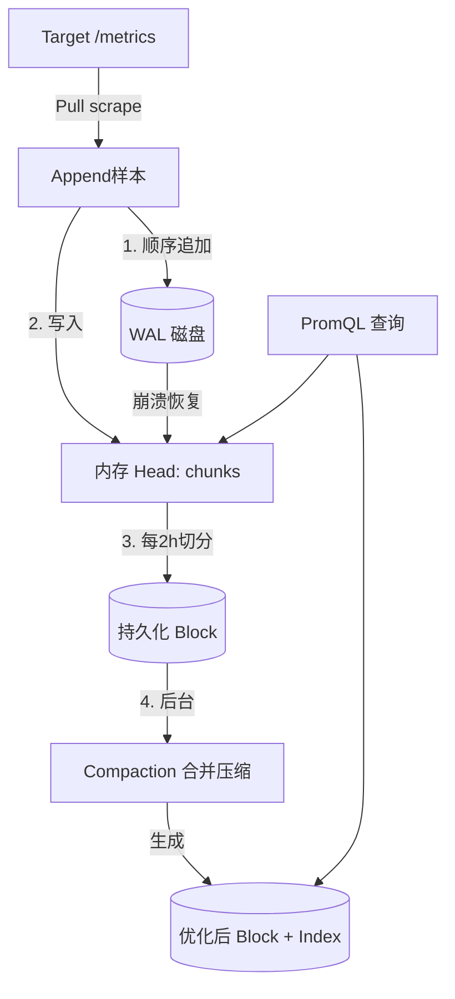

---

## 4. 远程读写（对接长期存储）

Prometheus 本地存储**不适合长期、大数据量**保存，原因：

- 单机磁盘容量有限，无原生横向分片；
- 查询跨大量 block 时内存/IO 压力大；
- 历史数据高可用弱（单点）。

因此 Prometheus 提供 **remote_write / remote_read** 把数据外溢到专业时序库：

```yaml
# prometheus.yml
remote_write:
  - url: http://victoriametrics:8480/insert/0/prometheus/api/v1/write
remote_read:
  - url: http://victoriametrics:8480/select/0/prometheus/api/v1/read
```

| 外部存储 | 角色 |
| --- | --- |
| VictoriaMetrics | 高压缩长期存储，PromQL 兼容 |
| Thanos | Sidecar + 对象存储，全局查询/长期保留 |
| Cortex / Mimir | 水平扩展、对象存储后端 |
| TDengine | 海量设备指标（通过 adapter 兼容） |

**为何本地不适合长期大数据量**：TSDB 的 block 模型在超长跨度、超多序列下会导致索引膨胀、compaction 成本陡增、单机成为瓶颈；将这些交给专门设计的分布式时序库更稳妥。

---

## 5. PromQL 简介

PromQL 是 Prometheus 的查询语言，面向「时间序列集合」运算。

### 5.1 常用算子

```promql
# 瞬时向量选择
node_memory_MemFree_bytes

# 区间向量（过去5分钟）
rate(http_requests_total[5m])

# 算术 / 比较 / 聚合
sum(rate(http_requests_total[5m])) by (code)
node_cpu_seconds_total{mode!="idle"} > 0.5
```

### 5.2 rate / irate

```promql
# rate：区间内的平均每秒增长率（自动处理 counter 重置）
rate(http_requests_total[5m])

# irate：仅用区间最后两个点计算瞬时增长率，更灵敏但更易抖
irate(http_requests_total[5m])
```

### 5.3 聚合

```promql
# 求和、平均、分位、最大
sum without(instance) (rate(cpu_usage[5m]))
avg by (pod) (container_cpu_usage_seconds_total)
quantile by (le) (0.95, latency_seconds_bucket)
max_over_time(node_load5[1h])
```

---

## 6. 局限与最佳实践

### 6.1 局限

| 局限 | 说明 |
| --- | --- |
| 单机容量 | 本地 TSDB 非分布式，受单机磁盘/内存限制 |
| 长期存储弱 | 默认保留期短（如 15d），历史查询成本高 |
| 高基数敏感 | label 基数爆炸会拖垮内存与查询 |
| 数据持久性 | 单点，需配合外部存储/备份 |

### 6.2 最佳实践

- **长期存储外置**：用 remote_write 对接 VictoriaMetrics / Thanos / Mimir。
- **控制基数**：避免把 `user_id`、`trace_id`、`request_id` 等高基数字段作为 label。
- **合理 scrape_interval**：不必所有指标 10s 抓一次，低频指标放宽间隔。
- **联邦 / 分片（Federation）**：大规模用 `federation` 让上层 Prometheus 聚合下层，或用 Thanos/Cortex 做全局视图。
- **记录规则（Recording Rules）**：把常用重查询预计算为新的时间序列，降低查询开销。

```yaml
# recording rules 示例
groups:
  - name: example
    rules:
      - record: job:http_requests:rate5m
        expr: sum by (job) (rate(http_requests_total[5m]))
```

---

## 7. 在「监控场景」中的定位对比

| 维度 | Prometheus(本地TSDB) | VictoriaMetrics | Thanos | Cortex/Mimir |
| --- | --- | --- | --- | --- |
| 角色 | 监控+存储一体化 | 长期存储/独立TSDB | 全局查询+长期 | 分布式长期存储 |
| 存储位置 | 本地磁盘 | 本地磁盘 | 对象存储 | 对象存储 |
| 水平扩展 | 弱（联邦） | 强（cluster） | 强 | 强 |
| PromQL | 原生 | 兼容(超集) | 兼容 | 兼容 |
| 部署复杂度 | 极低 | 低 | 中 | 高 |
| 适用规模 | 中小/单集群 | 中~大 | 大（多集群统一） | 大（多租户） |

**结论**：Prometheus 是监控的**采集与查询入口**，本地 TSDB 负责短期热数据；长期、大规模、跨集群统一视图应交给 VictoriaMetrics / Thanos / Mimir 等专门存储，二者是**互补而非替代**关系。

---

## 8. 小结

Prometheus 的本地 TSDB 是一个**嵌入式、面向监控优化**的时序存储：WAL 保可靠、内存 Head 保实时、2 小时 block + compaction 保压缩与查询效率。它最适合作为云原生监控的「短期热存储 + 查询引擎」，而通过 remote_write 把长期数据卸载到 VictoriaMetrics / Thanos / TDengine 等专业时序库，才能既保住 PromQL 生态又撑起规模化与持久化需求。

---

## 9. 运维实战与性能调优

### 9.1 长期存储外置方案对比

| 方案 | 机制 | 优点 | 缺点 |
|------|------|------|------|
| VictoriaMetrics | remote_write + 本地盘 | 简单、低延迟、高压缩 | 需自管磁盘 |
| Thanos Sidecar | 本地 block 上传对象存储 | 多集群统一、全局视图 | 对象存储延迟、组件多 |
| Cortex / Mimir | remote_write + 对象存储 | 多租户、水平扩展 | 部署复杂 |
| 双 Prom + 远端 | remote_write 到另一 Prom | 快速验证 | 非真正长期方案 |

### 9.2 Federation 分层

联邦让上层 Prometheus 从下层 Prom 拉取**已聚合**的结果，避免全量数据上卷。

```yaml
# 上层 Prometheus 的 federation 配置
scrape_configs:
  - job_name: 'federate'
    honor_labels: true
    metrics_path: '/federate'
    params:
      'match[]':
        - '{job="node"}'          # 只拉聚合后的时间序列
        - 'sum:node_cpu:rate5m'
    static_configs:
      - targets: ['prom-low-1:9090', 'prom-low-2:9090']
```

原则：联邦只传递聚合指标（如 `sum:xxx`），不传递原始高基数序列。

### 9.3 Record Rules 预计算

把高频重查询物化为新时间序列，查询时直接读结果：

```yaml
groups:
  - name: cpu_rules
    interval: 30s
    rules:
      - record: sum:node_cpu:rate5m
        expr: sum by (instance) (rate(node_cpu_seconds_total[5m]))
      - record: job:http_requests:rate5m
        expr: sum by (job) (rate(http_requests_total[5m]))
```

> record rule 极大降低 Grafana 面板与告警的重复计算；注意 rule 自身也会产生 series，避免 rule 输出高基数。

### 9.4 高可用（双写 / Thanos Sidecar）

**双写 HA**：两份 Prometheus 抓取同一目标，remote_write 到同一后端，查询层去重。

```yaml
# 两个 Prom 实例都配同样的 remote_write，VM 侧开启 dedup
remote_write:
  - url: http://vminsert:8480/insert/0/prometheus/api/v1/write
```

**Thanos Sidecar**：每个 Prom 旁挂 sidecar，上传 block 到对象存储，Query 组件做全局查询。

```yaml
# thanos sidecar 与 prometheus 同 pod
args:
  - sidecar
  - --prometheus.url=http://localhost:9090
  - --objstore.config-file=/etc/thanos/s3.yml
```

### 9.5 大规模下的分片

单 Prometheus 实例建议活跃 series 控制在 **200 万~500 万** 以内；超出则分片：

- **按功能分片**：node / k8s / blackbox 各一个 Prom。
- **按租户/业务分片**：每业务线独立 Prom，上层联邦或 Thanos 聚合。
- **Hashmod 分片**：用 `hashmod` relabel 把目标均分到 N 个 Prom 实例。

```yaml
# 按目标 hash 分 3 片中的第 0 片
relabel_configs:
  - source_labels: [__address__]
    modulus: 3
    target_label: __tmp_shard
    action: hashmod
  - source_labels: [__tmp_shard]
    regex: 0
    action: keep
```

### 9.6 故障排查 checklist

- [ ] 内存涨/OOM → 查 label 基数（target 数 × metrics × labels）。
- [ ] TSDB 加载慢/重启久 → 查 block 数量、head series 数、WAL 重放。
- [ ] 查询超时 → 是否全量扫、是否缺 record rule、区间是否过大。
- [ ] 数据缺口 → 查 scrape 失败、remote_write 队列堆积、去重配置。
- [ ] 磁盘满 → 查 retention、compaction 是否卡住、cardinality 是否失控。

---

## 10. 第三轮深度实战（基准 / 迁移 / 告警 / 流计算 / 成本 / 排障 SOP）

### 10.1 Prometheus TSDB Compaction 深入

```
Compaction 类型：
  Level 1：Head → Block（每 2 小时）
  Level 2：合并小 Block（1~4 小时块 → 更大块）
  Level 3：合并中等 Block（多天块 → 月级块）
  Level 4：大块合并（月级 → 季度级）

Compaction 策略：
  - 时间窗口：2 小时 head → block
  - 合并阈值：block 数量 > N 时触发合并
  - 压缩率：提升 2~5 倍
  - 索引重建：合并后重建倒排索引
```

### 10.2 Prometheus Exemplars

```
Exemplars 用途：
  关联指标与链路追踪
  在指标中嵌入 traceId
  从指标跳转到具体 Trace

示例：
  http_request_duration_seconds_bucket{le="0.5"} 1234 # {traceId="abc123"}

配置：
  remote_write:
    - url: http://thanos-receive:19291/api/v1/receive
      send_exemplars: true
```

### 10.3 Prometheus Native Histograms

```
Native Histograms：
  原生直方图，无需预定义桶
  自动调整桶边界
  更精确的分位数计算
  更小的存储空间

使用：
  在应用中使用 histogram 和 native histogram
  Prometheus 自动识别并存储
  PromQL 查询直方图数据
```

### 10.4 Prometheus Remote Write/Read 深入

```yaml
# remote_write 高级配置
remote_write:
  - url: http://victoriametrics:8480/insert/0/prometheus/api/v1/write
    queue_config:
      max_samples_per_send: 10000
      batch_send_deadline: 5s
      min_shards: 1
      max_shards: 200
      capacity: 100000
    write_relabel_configs:
      - source_labels: [__name__]
        regex: 'go_.*'
        action: drop
    send_timeout: 30s
    queue_config:
      max_samples_per_send: 10000
```

### 10.5 Thanos Store Gateway 深入

```
Thanos Store Gateway：
  对象存储的缓存层
  缓存热门数据到本地
  减少对象存储访问

配置：
  storegateway:
    - --data-dir=/data
    --objstore.config-file=/etc/thanos/s3.yml
    --index-cache-size=500MB
    --chunk-pool-size=2GB
```

### 10.6 Thanos Compactor

```
Thanos Compactor：
  对象存储数据压缩
  降采样（5m/1h 块）
  保留策略管理

配置：
  compactor:
    - --data-dir=/data
    --objstore.config-file=/etc/thanos/s3.yml
    --retention.resolution-raw=30d
    --retention.resolution-5m=90d
    --retention.resolution-1h=365d
```

### 10.7 Thanos Ruler

```
Thanos Ruler：
  分布式告警/记录规则
  基于 Thanos Query 查询
  高可用告警

配置：
  ruler:
    - --data-dir=/data
    --objstore.config-file=/etc/thanos/s3.yml
    --query=thanos-query:10901
    --rule-file=/etc/thanos/rules/*.yml
```

### 10.8 kube-prometheus-stack 深入

```
kube-prometheus-stack 组件：
  Prometheus Operator：管理 Prometheus 实例
  Grafana：可视化
  Alertmanager：告警管理
  Node Exporter：节点指标
  kube-state-metrics：K8s 资源指标
  Prometheus Adapter：自定义指标

部署：
  helm install kube-prometheus-stack prometheus-community/kube-prometheus-stack

配置：
  Prometheus：
    retention: 15d
    resources: { requests: { memory: 2Gi } }
  Grafana：
    adminPassword: admin
  Alertmanager：
    config: { ... }
```

---

## 11. 速查表（扩展）

### 10.1 性能基准（推导 / 公开数字）

- 写入吞吐：单实例受内存/ compaction 约束，活跃 series 建议 ≤ 200~500 万。
- 压缩：1~2 B/点（约 1~3:1），弱于专用 TSDB。
- 查询：热数据低延迟；跨月多 block 高延迟。

推导：
```text
日磁盘(GB) ≈ samples/s × 86400 × 2B / 1024³
例：1000 samples/s → 1000×86400×2/1e9 ≈ 0.17 GB/天（压缩后，实际更高因索引）
```

### 10.2 迁移实战：Prometheus → Thanos 双写切换 SOP

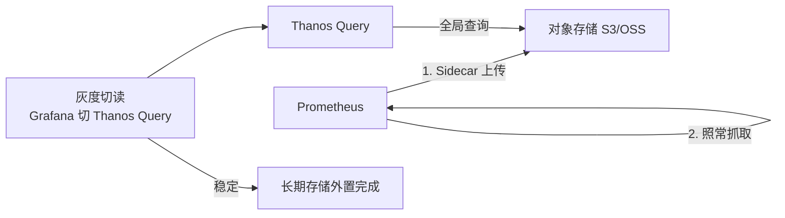

SOP：
1. **挂载 Sidecar**：每个 Prom 旁挂 Thanos Sidecar，上传 block 到对象存储。
2. **部署 Query**：Thanos Query 聚合各 Prom + 对象存储，提供全局 PromQL。
3. **灰度切读**：Grafana 数据源先 5% 切 Thanos Query，比对与本地一致。
4. **降本地保留**：本地 retention 从 15d 降到 7d，历史走 Thanos。
5. **多 Prom 分片**：超规模按 hashmod 分片，上层 Thanos 统一。

```yaml
# thanos sidecar
args: [sidecar, --prometheus.url=http://localhost:9090, --objstore.config-file=/etc/thanos/s3.yml]
# 降本地保留
global: { external_labels: { cluster: a } }
storage: { tsdb: { retention: 7d } }
```

### 10.3 与监控 / Grafana 全链路告警规则示例

Alertmanager + recording rules 全链路：

```yaml
# alert rules
groups:
  - name: instance_down
    rules:
      - alert: InstanceDown
        expr: up == 0
        for: 5m
        labels: { severity: critical }
        annotations: { summary: "实例 {{ $labels.instance }} 宕机" }
      - record: instance:cpu:rate5m
        expr: 100 - (avg by(instance) (rate(node_cpu_seconds_total{mode="idle"}[5m])) * 100)
```

全链路 Checklist：
- [ ] Alertmanager 路由正确（email/钉钉/Slack）。
- [ ] recording rule 输出非高基数；rule 自身 series 受控。
- [ ] 长期查询走 Thanos/VM，本地只保热数据。

### 10.4 与 Flink / Spark 实时计算联动代码

Prometheus 作源：通过 remote_write 适配把样本送入 Kafka，Flink 消费富化。

```bash
# 用 prometheus-remote-write 适配（如自研/开源）把 remote_write 转 Kafka
# Prometheus 侧：
remote_write:
  - url: http://adapter:9090/api/v1/write   # adapter 写 Kafka topic metrics
```

Flink SQL 消费：
```sql
CREATE TABLE prom_src (
  metric STRING, instance STRING, value DOUBLE, ts TIMESTAMP(3)
) WITH ('connector'='kafka','topic'='metrics', ...);

INSERT INTO agg_sink
SELECT metric, instance, AVG(value), TUMBLE_END(ts, INTERVAL '1' MINUTE)
FROM prom_src GROUP BY metric, instance, TUMBLE(ts, INTERVAL '1' MINUTE);
```

Spark 读（通过 Thanos Query HTTP）：
```scala
// 用 HTTP 客户端访问 Thanos Query /api/v1/query_range，解析 JSON 为 DataFrame
```

联动要点：remote_write 到适配层实现「采集即流」；富化后再落 TSDB/数仓。

### 10.5 成本优化（长期存储外置 / 降采样 / 保留）

- **外置长期存储**：remote_write 到 VM/Thanos，本地只保 7~15d 热数据，省本地盘。
- **降采样**：用 recording rule 预聚合，长期只查聚合序列；Thanos `downsampling` 自动生成 5m/1h 块。
- **保留分层**：本地 7d → VM 12 月 → 对象存储归档。

```yaml
# 本地保留收紧
storage: { tsdb: { retention: 7d } }
# remote_write 到 VM 长期
remote_write:
  - url: http://vminsert:8480/insert/0/prometheus/api/v1/write
```

## 九、Prometheus 联邦与远程存储

### 联邦集群架构

```
Prometheus 联邦架构：
  层级设计：
    ├── 全局 Prometheus（Federation）
    │   ├── 抓取各区域 Prometheus
    │   ├── 全局视图
    │   └── 跨区域聚合
    ├── 区域 Prometheus
    │   ├── 抓取区域指标
    │   └── 本地存储
    └── 应用实例
        └── 暴露 metrics

  联邦查询：
    /federate?match[]={job="app"}

  优点：
    ├── 水平扩展：每区域独立 Prometheus
    ├── 降低单点压力
    └── 故障隔离

  缺点：
    ├── 数据延迟：联邦间隔影响
    ├── 存储重复：区域和全局都存储
    └── 管理复杂：需要维护多实例
```

### 远程存储方案

```
Prometheus 远程存储：
  1. Thanos
     ├── 对象存储：S3/GCS/OSS
     ├── 全局查询：Thanos Query
     ├── 降采样：Thanos Compactor
     └── 数据完整性校验

  2. Cortex
     ├── 对象存储后端
     ├── 多租户支持
     ├── 水平扩展
     └── 与 Grafana 深度集成

  3. VictoriaMetrics
     ├── 高性能写入
     ├── 压缩存储
     ├── 兼容 Prometheus API
     └── 单机/集群模式

  4. Mimir（Grafana）
     ├── 基于 Cortex 改进
     ├── 无限基数支持
     ├── 原生 Grafana 集成
     └── 生产级稳定性

配置示例（Thanos Sidecar）：
  prometheus:
    --storage.tsdb.path=/prometheus
    --storage.tsdb.min-block-duration=2h
    --storage.tsdb.max-block-duration=2h

  thanos sidecar:
    --tsdb.path=/prometheus
    --objstore.config-file=bucket.yml
    --prometheus.url=http://localhost:9090
```

## 十、Prometheus 高可用部署

### 高可用架构

```
Prometheus 高可用方案：
  方案 1：主备复制
    ├── 主 Prometheus 抓取指标
    ├── 备 Prometheus 复制主数据
    ├── 故障时切换到备
    └── 适用：小规模部署

  方案 2：联邦集群
    ├── 多个 Prometheus 实例
    ├── 联邦 Prometheus 聚合
    ├── 负载均衡
    └── 适用：中等规模

  方案 3：Thanos/Cortex
    ├── 多 Prometheus 写入对象存储
    ├── 全局查询层
    ├── 无限扩展
    └── 适用：大规模生产

部署配置：
  # Prometheus 配置
  global:
    scrape_interval: 15s
    evaluation_interval: 15s

  # 服务发现
  scrape_configs:
    - job_name: 'kubernetes-pods'
      kubernetes_sd_configs:
        - role: pod
      relabel_configs:
        - source_labels: [__meta_kubernetes_pod_annotation_prometheus_io_scrape]
          action: keep
          regex: true
```

### Prometheus 性能调优

```
Prometheus 性能调优：
  1. 抓取优化
     ├── scrape_interval：15s（默认）→ 根据需求调整
     ├── scrape_timeout：10s（默认）→ 根据目标调整
     ├── sample_limit：5000（默认）→ 控制单目标样本数
     └── metric_relabel_configs：预过滤不需要的指标

  2. 存储优化
     ├── retention：90d（默认）→ 根据存储容量调整
     ├── storage.tsdb.min-block-duration：2h
     ├── storage.tsdb.max-block-duration：2h
     └── storage.tsdb.wal-compression：启用 WAL 压缩

  3. 查询优化
     ├── recording rules：预计算常用查询
     ├── query timeout：2m（默认）
     ├── query max samples：50000000
     └── 避免高基数标签

  4. 资源限制
     ├── CPU：2-4 核（生产环境）
     ├── 内存：4-16 GB（根据时间序列数）
     ├── 磁盘：SSD，IOPS > 10000
     └── 网络：1 Gbps+

  5. 监控 Prometheus 自身
     ├── prometheus 目标：抓取 Prometheus 自身
     ├── 指标：prometheus_tsdb_*、prometheus_rule_group_*
     └── 告警：高内存、高 CPU、抓取失败
```

## 十一、Prometheus 与 Kubernetes 集成

### Kubernetes 服务发现

```
Prometheus Kubernetes 服务发现：
  1. Pod 发现
     role: pod
     元数据：
       __meta_kubernetes_pod_name
       __meta_kubernetes_pod_label_xxx
       __meta_kubernetes_namespace
       __meta_kubernetes_pod_annotation_prometheus_io_scrape

  2. Service 发现
     role: service
     元数据：
       __meta_kubernetes_service_name
       __meta_kubernetes_service_label_xxx
       __meta_kubernetes_namespace

  3. Endpoints 发现
     role: endpoints
     元数据：
       __meta_kubernetes_endpoint_port_name
       __meta_kubernetes_endpoint_port_protocol

  4. Node 发现
     role: node
     元数据：
       __meta_kubernetes_node_name
       __meta_kubernetes_node_label_xxx

配置示例：
  scrape_configs:
    - job_name: 'kubernetes-pods'
      kubernetes_sd_configs:
        - role: pod
      relabel_configs:
        - source_labels: [__meta_kubernetes_pod_annotation_prometheus_io_scrape]
          action: keep
          regex: true
        - source_labels: [__meta_kubernetes_pod_annotation_prometheus_io_path]
          action: replace
          target_label: __metrics_path__
          regex: (.+)
        - source_labels: [__address__, __meta_kubernetes_pod_annotation_prometheus_io_port]
          action: replace
          target_label: __address__
          regex: ([^:]+)(?::\d+)?;(\d+)
          replacement: $1:$2
```

### Prometheus Operator

```
Prometheus Operator 架构：
  组件：
    ├── Prometheus Operator：管理 Prometheus 资源
    ├── Prometheus：Prometheus 实例
    ├── Alertmanager：告警管理器
    ├── Grafana：可视化
    └── ServiceMonitor：定义抓取目标

  CRD 资源：
    ├── Prometheus：Prometheus 实例配置
    ├── ServiceMonitor：定义抓取目标
    ├── PrometheusRule：定义告警规则
    └── Alertmanager：Alertmanager 实例配置

  配置示例：
    apiVersion: monitoring.coreos.com/v1
    kind: ServiceMonitor
    metadata:
      name: my-app
    spec:
      selector:
        matchLabels:
          app: my-app
      endpoints:
        - port: http
          path: /metrics
          interval: 15s

    apiVersion: monitoring.coreos.com/v1
    kind: PrometheusRule
    metadata:
      name: my-app-rules
    spec:
      groups:
        - name: my-app
          rules:
            - alert: HighErrorRate
              expr: rate(http_requests_total{status=~"5.."}[5m]) > 0.1
              for: 5m
              labels:
                severity: critical
              annotations:
                summary: "高错误率告警"
```

## Prometheus 标签最佳实践

### 标签命名规范

| 规则 | 正确示例 | 错误示例 |
|------|---------|---------|
| 使用 snake_case | `http_requests_total` | `httpRequestsTotal` |
| 以 `_total` 结尾（Counter） | `requests_total` | `requests` |
| 以 `_seconds` 结尾（Duration） | `request_duration_seconds` | `request_duration_ms` |
| 避免高基数 label | `method="GET"` | `user_id="12345"` |
| label 值有限枚举 | `status="200"` | `trace_id="abc123"` |

### 高基数标签识别与治理

```text
高基数标签（High Cardinality）：
  定义：label 值的可能取值数量过多（> 1000）
  后果：内存暴涨、查询变慢、TSDB 膨胀

  常见高基数 label：
    user_id / customer_id / trace_id / request_id
    session_id / transaction_id / correlation_id
    原始 URL（含参数）/ User-Agent

  治理方法：
    1. metric_relabel_configs 丢弃高基数 label
    2. 使用 label_replace 提取有限枚举
    3. 将高基数数据存入追踪系统（Jaeger/Zipkin）
    4. 监控：prometheus_tsdb_head_series 指标
```

```yaml
# metric_relabel_configs 丢弃高基数 label
scrape_configs:
  - job_name: 'my-app'
    metric_relabel_configs:
      - source_labels: [__name__]
        regex: 'http_requests_total'
        target_label: trace_id
        action: labeldrop
      - source_labels: [user_id]
        regex: '.*'
        action: labeldrop
```

## Recording Rules 编写模式

### 聚合规则模式

```yaml
groups:
  - name: aggregation_rules
    interval: 30s
    rules:
      # 模式1：多维度聚合
      - record: job:http_requests:rate5m
        expr: sum by (job) (rate(http_requests_total[5m]))
      
      # 模式2：预计算分位数
      - record: instance:request_duration:p99
        expr: |
          histogram_quantile(0.99, 
            sum by (instance, le) (rate(http_request_duration_seconds_bucket[5m])))
      
      # 模式3：多级录制（依赖其他 recording rule）
      - record: job:request_duration:p99:rate5m
        expr: avg by (job) (instance:request_duration:p99)
```

### 预计算模式对比

| 模式 | 适用场景 | 示例 | 优点 |
|------|---------|------|------|
| 聚合预计算 | 高频查询 | `sum by (job) (rate(...))` | 查询快、资源省 |
| 分位数预计算 | P99/P95 延迟 | `histogram_quantile(0.99, ...)` | 避免重复计算 |
| 多级录制 | 复杂派生指标 | 依赖其他 recording rule | 模块化、易维护 |
| 时间窗口预计算 | 多时间窗口查询 | `avg_over_time(...[1h])` | 灵活查询 |

### Recording Rule 最佳实践

```text
Recording Rule 设计原则：
  1. 输出非高基数：rule 输出的 series 数量受控
  2. 命名规范：{输出指标}:{输入指标}:{操作}
     示例：job:http_requests:rate5m
  3. 独立 rule group：避免一个 group 太大
  4. 合理 interval：interval ≥ scrape_interval
  5. 监控 rule 执行耗时：prometheus_rule_group_duration_seconds
```

## Alerting Rules 最佳实践

### SLO Burn Rate 告警

```yaml
# SLO Burn Rate 告警（基于错误预算）
groups:
  - name: slo_alerts
    rules:
      # 5 分钟窗口，burn rate > 14.4x（1% SLO 的 5 分钟预算）
      - alert: HighErrorBudgetBurn_5m
        expr: |
          (
            1 - sum(rate(http_requests_total{status=~"5.."}[5m]))
            / sum(rate(http_requests_total[5m]))
          ) > 14.4 * 0.01
        for: 2m
        labels:
          severity: critical
        annotations:
          summary: "5 分钟窗口错误预算消耗过快"
      
      # 1 小时窗口，burn rate > 3x
      - alert: HighErrorBudgetBurn_1h
        expr: |
          (
            1 - sum(rate(http_requests_total{status=~"5.."}[1h]))
            / sum(rate(http_requests_total[1h]))
          ) > 3 * 0.01
        for: 15m
        labels:
          severity: warning
```

### 多窗口告警策略

```text
多窗口告警（Multi-Window Alert）：
  短窗口：快速检测突发问题（5m）
  长窗口：确认趋势持续（1h）
  组合条件：短窗口 AND 长窗口 同时触发

  优势：
    - 减少误报：短窗口告警需长窗口确认
    - 检测灵敏：短窗口快速发现异常
    - 趋势确认：长窗口过滤瞬时抖动
```

```yaml
# 多窗口告警示例
groups:
  - name: multi_window_alerts
    rules:
      # 短窗口：5 分钟错误率 > 5%
      - alert: HighErrorRate_5m
        expr: |
          sum(rate(http_requests_total{status=~"5.."}[5m]))
          / sum(rate(http_requests_total[5m])) > 0.05
        for: 1m
        labels:
          severity: warning
      
      # 长窗口：1 小时错误率 > 1%
      - alert: HighErrorRate_1h
        expr: |
          sum(rate(http_requests_total{status=~"5.."}[1h]))
          / sum(rate(http_requests_total[1h])) > 0.01
        for: 15m
        labels:
          severity: critical
```

## Thanos Store Gateway 内部原理

### Store Gateway 架构

```text
Thanos Store Gateway 架构：
┌─────────────────────┐    ┌─────────────────────┐    ┌──────────────┐
│  对象存储 S3/GCS    │ ←  │  Store Gateway      │ ←  │  Thanos Query│
│  (长期数据)         │    │  (缓存层)           │    │  (全局查询)  │
└─────────────────────┘    └─────────────────────┘    └──────────────┘
                                  │
                                  ├── Index Cache（索引缓存）
                                  ├── Chunk Pool（数据块池）
                                  └── Metadata Cache（元数据缓存）
```

### 缓存策略

| 缓存类型 | 内容 | 大小建议 | 作用 |
|---------|------|---------|------|
| **Index Cache** | 倒排索引 | 500MB-2GB | 加速标签查询 |
| **Chunk Pool** | 压缩数据块 | 2-8GB | 减少对象存储读取 |
| **Metadata Cache** | block meta.json | 100-500MB | 减少元数据请求 |

```yaml
# Store Gateway 配置
storegateway:
  - --data-dir=/data
  - --objstore.config-file=/etc/thanos/s3.yml
  - --index-cache-size=500MB
  - --chunk-pool-size=2GB
  - --sync-interval=3m
  - --min-time=-2w
```

## Thanos Compactor 调优

### 降采样策略

```text
Thanos Compactor 降采样：
  原始数据：保留 30 天（resolution-raw）
  5 分钟降采样：保留 90 天（resolution-5m）
  1 小时降采样：保留 365 天（resolution-1h）

  降采样作用：
    - 减少存储空间：1h 块比 raw 块小 10-100 倍
    - 加速长期查询：查询 1 年数据用 1h 块
    - 降低成本：对象存储费用减少
```

```yaml
# Compactor 配置
compactor:
  - --data-dir=/data
  - --objstore.config-file=/etc/thanos/s3.yml
  - --retention.resolution-raw=30d
  - --retention.resolution-5m=90d
  - --retention.resolution-1h=365d
  - --compact.resolution-interval=1h
  - --downsample.resolution-interval=1h
```

### 块合并与资源限制

```text
Compactor 资源调优：
┌──────────────────────┬────────────────────────────────────────────┐
│ 参数                  │ 说明                                        │
├──────────────────────┼────────────────────────────────────────────┤
│ --compact.concurrency│ 并发合并块数（默认 1）                      │
│ --downsample.concurrency │ 并发降采样数（默认 1）               │
│ --compaction-interval │ 合并间隔（默认 30m）                       │
│ --retention.resolution-raw │ 原始数据保留期                      │
│ --delete-delay       │ 删除延迟（等待一致性检查）                  │
└──────────────────────┴────────────────────────────────────────────┘

调优建议：
  1. 大规模集群：增大 --compact.concurrency=4
  2. 对象存储限流：降低 --compaction-interval=1h
  3. 存储成本：缩短 --retention.resolution-raw=15d
  4. 监控：thanos_compact_group_compactions_total
```

## Prometheus 容量规划公式

### 容量计算公式

```text
存储容量计算：
  每样本大小 = 1-2 字节（压缩后）
  日写入量 = 活跃 series 数 × 每秒采样点数 × 86400
  日存储 = 日写入量 × 每样本大小
  
  示例：
    活跃 series = 100 万
    scrape_interval = 15s → 每秒采样点 = 100万/15 ≈ 66666
    日写入量 = 66666 × 86400 ≈ 57.6 亿样本
    日存储 = 57.6亿 × 2B ≈ 11.5 GB/天（压缩后）
    
  月存储 = 日存储 × 保留天数
    = 11.5 GB × 30 天 = 345 GB
```

### 容量规划对照表

| 活跃 series | scrape_interval | 日写入量 | 日存储 | 月存储（30d） |
|------------|----------------|---------|-------|--------------|
| 10 万 | 15s | 5760 万 | 1.15 GB | 34.5 GB |
| 50 万 | 15s | 2.88 亿 | 5.75 GB | 172.5 GB |
| 100 万 | 15s | 5.76 亿 | 11.5 GB | 345 GB |
| 200 万 | 15s | 11.52 亿 | 23 GB | 690 GB |
| 500 万 | 15s | 28.8 亿 | 57.6 GB | 1.73 TB |

### 容量规划建议

```text
Prometheus 容量规划 Checklist：
  1. 计算活跃 series 数（当前 + 预估增长）
  2. 确定 scrape_interval（15s/30s/60s）
  3. 计算日存储需求（每样本 1-2 字节）
  4. 确定保留期（本地 7-15 天，长期外置）
  5. 预留 30% 冗余（compaction/WAL/索引）
  6. 监控：prometheus_tsdb_head_series
  7. 告警：series 数 > 80% 阈值
```

## 十二、Prometheus 告警最佳实践

### 告警规则设计

```yaml
# 告警规则模板
groups:
  - name: infrastructure
    rules:
      # 实例宕机
      - alert: InstanceDown
        expr: up == 0
        for: 1m
        labels:
          severity: critical
        annotations:
          summary: "实例宕机"
          description: "实例 {{ $labels.instance }} 已宕机超过 1 分钟"

      # CPU 使用率过高
      - alert: HighCpuUsage
        expr: 100 - (avg by(instance) (irate(node_cpu_seconds_total{mode="idle"}[5m])) * 100) > 80
        for: 5m
        labels:
          severity: warning
        annotations:
          summary: "CPU 使用率过高"
          description: "实例 {{ $labels.instance }} CPU 使用率超过 80%"

      # 内存使用率过高
      - alert: HighMemoryUsage
        expr: (1 - node_memory_MemAvailable_bytes / node_memory_MemTotal_bytes) * 100 > 85
        for: 5m
        labels:
          severity: warning
        annotations:
          summary: "内存使用率过高"
          description: "实例 {{ $labels.instance }} 内存使用率超过 85%"

      # 磁盘使用率过高
      - alert: HighDiskUsage
        expr: (1 - node_filesystem_avail_bytes{fstype!~"tmpfs|fuse.lxcfs"} / node_filesystem_size_bytes) * 100 > 85
        for: 5m
        labels:
          severity: warning
        annotations:
          summary: "磁盘使用率过高"
          description: "实例 {{ $labels.instance }} 磁盘使用率超过 85%"

  - name: application
    rules:
      # HTTP 错误率过高
      - alert: HighHttpErrorRate
        expr: sum(rate(http_requests_total{status=~"5.."}[5m])) / sum(rate(http_requests_total[5m])) > 0.05
        for: 5m
        labels:
          severity: critical
        annotations:
          summary: "HTTP 错误率过高"
          description: "HTTP 5xx 错误率超过 5%"

      # 响应时间过长
      - alert: HighResponseTime
        expr: histogram_quantile(0.95, rate(http_request_duration_seconds_bucket[5m])) > 1
        for: 5m
        labels:
          severity: warning
        annotations:
          summary: "响应时间过长"
          description: "P95 响应时间超过 1 秒"
```

### 告警路由与通知

```yaml
# Alertmanager 配置
global:
  resolve_timeout: 5m
  smtp_smarthost: 'smtp.example.com:587'
  smtp_from: 'alertmanager@example.com'
  smtp_auth_username: 'alertmanager@example.com'
  smtp_auth_password: 'password'

route:
  receiver: 'default'
  group_by: ['alertname', 'cluster', 'service']
  group_wait: 30s
  group_interval: 5m
  repeat_interval: 4h
  routes:
    - match:
        severity: critical
      receiver: 'critical'
      group_wait: 10s
    - match:
        severity: warning
      receiver: 'warning'

receivers:
  - name: 'default'
    email_configs:
      - to: 'team@example.com'

  - name: 'critical'
    webhook_configs:
      - url: 'http://alert-handler:8080/critical'
        send_resolved: true

  - name: 'warning'
    email_configs:
      - to: 'team@example.com'
        send_resolved: true

inhibit_rules:
  - source_match:
      severity: 'critical'
    target_match:
      severity: 'warning'
    equal: ['alertname', 'instance']
```

### 10.6 生产排障 SOP

**Cardinality 治理**
- [ ] `curl localhost:9090/api/v1/status/tsdb` 看 TopN 高基 metric。
- [ ] `metric_relabel_configs` 丢弃 `user_id`/`trace_id` 等高基 label。
- [ ] 单实例 series > 500 万即分片（hashmod）。

**写入拒绝 / OOM SOP**
- [ ] OOM → 砍基数、升内存、降 scrape 频率。
- [ ] WAL 重放慢/重启久 → 查 block 数、head series。

**查询超时 SOP**
- [ ] 是否全量扫、区间过大；加 recording rule。
- [ ] 远程读（remote_read）延迟高 → 查后端 VM/Thanos 状态。

## 标签命名规范

### 高基数避免

```
标签命名规范：
  1. 避免高基数标签：
     ❌ user_id, trace_id, request_id, session_id
     ✅ user_group, service, method, status_code

  2. 标签值枚举化：
     ❌ /api/users/12345  → 标签值无限
     ✅ /api/users/{id}   → 标签值有限

  3. 标签长度限制：
     标签名 ≤ 64 字节
     标签值 ≤ 16KB

  4. 命名规范：
     使用 snake_case
     不使用特殊字符
     以 _unit/_total 结尾（Counter）
```

### 高基数治理

| 策略 | 方法 | 效果 |
|------|------|------|
| 标签丢弃 | metric_relabel_configs | 减少 series 数 |
| 标签聚合 | Recording Rules | 预计算聚合 |
| 采样 | 按 service 采样 | 减少数据量 |
| 分片 | hashmod 分片 | 分散负载 |

## Recording Rules 预计算

### 聚合预计算

```yaml
# recording_rules.yml
groups:
  - name: http_requests
    rules:
      # 预计算 QPS（每分钟）
      - record: http_requests:rate5m
        expr: sum(rate(http_requests_total[5m])) by (service, method)

      # 预计算 P99 延迟
      - record: http_request_duration_seconds:p99
        expr: histogram_quantile(0.99, sum(rate(http_request_duration_seconds_bucket[5m])) by (le, service))

      # 预计算错误率
      - record: http_requests:error_rate
        expr: sum(rate(http_requests_total{status=~"5.."}[5m])) by (service)
        / sum(rate(http_requests_total[5m])) by (service)
```

### Recording Rules 最佳实践

| 实践 | 说明 | 收益 |
|------|------|------|
| 分层聚合 | 先 service 级，再 cluster 级 | 查询快 |
| 合理间隔 | 1m/5m/15m 三级 | 平衡精度与性能 |
| 命名规范 | metric:operation[window] | 可读性 |
| 限量 | 单 group ≤ 500 rules | 避免 OOM |

## Alerting Rules 多窗口 burn rate

### SLO burn rate 告警

```yaml
# slo_alerts.yml
groups:
  - name: slo-burn-rate
    rules:
      # 5 分钟窗口 burn rate > 14.4x（1小时 SLO 消耗）
      - alert: HighErrorBurnRate5m
        expr: |
          sum(rate(http_requests_total{status=~"5.."}[5m])) by (service)
          / sum(rate(http_requests_total[5m])) by (service) > 0.144
        for: 2m
        labels:
          severity: critical
        annotations:
          summary: "SLO 5分钟burn rate过高"

      # 1 小时窗口 burn rate > 3x（6小时 SLO 消耗）
      - alert: HighErrorBurnRate1h
        expr: |
          sum(rate(http_requests_total{status=~"5.."}[1h])) by (service)
          / sum(rate(http_requests_total[1h])) by (service) > 0.03
        for: 15m
        labels:
          severity: warning
```

## Thanos Store Gateway 缓存与索引分片

### Store Gateway 架构

```text
Thanos Store Gateway：
  职责：从对象存储加载 TSDB blocks
  缓存：索引缓存 + 数据块缓存
  索引分片：按 block 时间范围分片

  缓存配置：
    index-cache-size: 500MB
    chunk-cache-size: 512MB
    max-sample-count: 10000
```

### Store Gateway 调优

| 参数 | 默认值 | 建议值 | 说明 |
|------|--------|--------|------|
| index-cache-size | 500MB | 1-2GB | 索引缓存 |
| chunk-cache-size | 512MB | 1-2GB | 数据块缓存 |
| sync-interval | 3m | 1m | 同步间隔 |

## Thanos Compactor 降采样与块合并

### Compactor 配置

```text
Thanos Compactor：
  降采样（Downsampling）：
    5m 原始数据 → 1h 降采样（保留 30 天）
    1h 降采样 → 5m 降采样（保留 365 天）

  块合并（Compaction）：
    小块合并成大块（减少查询时扫描块数）
    保留策略：按时间窗口删除旧块

  配置：
    --retention.raw-resolution=30d
    --retention.resolution-1h=365d
    --retention.resolution-5m=365d
```

## Prometheus 告警最佳实践详解

### 告警规则设计

```yaml
# 告警规则模板
groups:
  - name: infrastructure
    rules:
      # 实例宕机
      - alert: InstanceDown
        expr: up == 0
        for: 1m
        labels:
          severity: critical
        annotations:
          summary: "实例宕机"
          description: "实例 {{ $labels.instance }} 已宕机超过 1 分钟"

      # CPU 使用率过高
      - alert: HighCpuUsage
        expr: 100 - (avg by(instance) (irate(node_cpu_seconds_total{mode="idle"}[5m])) * 100) > 80
        for: 5m
        labels:
          severity: warning
        annotations:
          summary: "CPU 使用率过高"
          description: "实例 {{ $labels.instance }} CPU 使用率超过 80%"

      # 内存使用率过高
      - alert: HighMemoryUsage
        expr: (1 - node_memory_MemAvailable_bytes / node_memory_MemTotal_bytes) * 100 > 85
        for: 5m
        labels:
          severity: warning
        annotations:
          summary: "内存使用率过高"
          description: "实例 {{ $labels.instance }} 内存使用率超过 85%"

      # 磁盘使用率过高
      - alert: HighDiskUsage
        expr: (1 - node_filesystem_avail_bytes{fstype!~"tmpfs|fuse.lxcfs"} / node_filesystem_size_bytes) * 100 > 85
        for: 5m
        labels:
          severity: warning
        annotations:
          summary: "磁盘使用率过高"
          description: "实例 {{ $labels.instance }} 磁盘使用率超过 85%"

  - name: application
    rules:
      # HTTP 错误率过高
      - alert: HighHttpErrorRate
        expr: sum(rate(http_requests_total{status=~"5.."}[5m])) / sum(rate(http_requests_total[5m])) > 0.05
        for: 5m
        labels:
          severity: critical
        annotations:
          summary: "HTTP 错误率过高"
          description: "HTTP 5xx 错误率超过 5%"

      # 响应时间过长
      - alert: HighResponseTime
        expr: histogram_quantile(0.95, rate(http_request_duration_seconds_bucket[5m])) > 1
        for: 5m
        labels:
          severity: warning
        annotations:
          summary: "响应时间过长"
          description: "P95 响应时间超过 1 秒"
```

### 告警路由与通知

```yaml
# Alertmanager 配置
global:
  resolve_timeout: 5m
  smtp_smarthost: 'smtp.example.com:587'
  smtp_from: 'alertmanager@example.com'
  smtp_auth_username: 'alertmanager@example.com'
  smtp_auth_password: 'password'

route:
  receiver: 'default'
  group_by: ['alertname', 'cluster', 'service']
  group_wait: 30s
  group_interval: 5m
  repeat_interval: 4h
  routes:
    - match:
        severity: critical
      receiver: 'critical'
      group_wait: 10s
    - match:
        severity: warning
      receiver: 'warning'

receivers:
  - name: 'default'
    email_configs:
      - to: 'team@example.com'

  - name: 'critical'
    webhook_configs:
      - url: 'http://alert-handler:8080/critical'
        send_resolved: true

  - name: 'warning'
    email_configs:
      - to: 'team@example.com'
        send_resolved: true

inhibit_rules:
  - source_match:
      severity: 'critical'
    target_match:
      severity: 'warning'
    equal: ['alertname', 'instance']
```

## Thanos Store Gateway 详解

### Store Gateway 架构

```text
Thanos Store Gateway 架构：
┌─────────────────────┐    ┌─────────────────────┐    ┌──────────────┐
│  对象存储 S3/GCS    │ ←  │  Store Gateway      │ ←  │  Thanos Query│
│  (长期数据)         │    │  (缓存层)           │    │  (全局查询)  │
└─────────────────────┘    └─────────────────────┘    └──────────────┘
                                  │
                                  ├── Index Cache（索引缓存）
                                  ├── Chunk Pool（数据块池）
                                  └── Metadata Cache（元数据缓存）
```

### 缓存策略

| 缓存类型 | 内容 | 大小建议 | 作用 |
|---------|------|---------|------|
| **Index Cache** | 倒排索引 | 500MB-2GB | 加速标签查询 |
| **Chunk Pool** | 压缩数据块 | 2-8GB | 减少对象存储读取 |
| **Metadata Cache** | block meta.json | 100-500MB | 减少元数据请求 |

```yaml
# Store Gateway 配置
storegateway:
  - --data-dir=/data
  - --objstore.config-file=/etc/thanos/s3.yml
  - --index-cache-size=500MB
  - --chunk-pool-size=2GB
  - --sync-interval=3m
  - --min-time=-2w
```

## Thanos Compactor 详解

### 降采样策略

```text
Thanos Compactor 降采样：
  原始数据：保留 30 天（resolution-raw）
  5 分钟降采样：保留 90 天（resolution-5m）
  1 小时降采样：保留 365 天（resolution-1h）

  降采样作用：
    - 减少存储空间：1h 块比 raw 块小 10-100 倍
    - 加速长期查询：查询 1 年数据用 1h 块
    - 降低成本：对象存储费用减少
```

```yaml
# Compactor 配置
compactor:
  - --data-dir=/data
  - --objstore.config-file=/etc/thanos/s3.yml
  - --retention.resolution-raw=30d
  - --retention.resolution-5m=90d
  - --retention.resolution-1h=365d
  - --compact.resolution-interval=1h
  - --downsample.resolution-interval=1h
```

### 块合并与资源限制

```text
Compactor 资源调优：
┌──────────────────────┬────────────────────────────────────────────┐
│ 参数                  │ 说明                                        │
├──────────────────────┼────────────────────────────────────────────┤
│ --compact.concurrency│ 并发合并块数（默认 1）                      │
│ --downsample.concurrency │ 并发降采样数（默认 1）               │
│ --compaction-interval │ 合并间隔（默认 30m）                       │
│ --retention.resolution-raw │ 原始数据保留期                      │
│ --delete-delay       │ 删除延迟（等待一致性检查）                  │
└──────────────────────┴────────────────────────────────────────────┘

调优建议：
  1. 大规模集群：增大 --compact.concurrency=4
  2. 对象存储限流：降低 --compaction-interval=1h
  3. 存储成本：缩短 --retention.resolution-raw=15d
  4. 监控：thanos_compact_group_compactions_total
```

## Prometheus 容量规划公式

```
容量规划公式：

存储容量：
  每秒样本数 = series 数 × scrape 间隔倒数
  每天存储 = 每秒样本数 × 8 字节 × 86400 秒 × 压缩系数(0.4)
  
  示例：
    100 万 series，15s scrape
    每秒 = 100万 / 15 = 66667 样本/秒
    每天 = 66667 × 8 × 86400 × 0.4 = 184GB/天

  内存容量：
    每 series 约 2-4KB 内存
    100 万 series ≈ 2-4GB 内存

  CPU 容量：
    每 10 万 series 约 1 CPU
    100 万 series ≈ 10 CPU
```

---

## 二十、Prometheus 高可用架构

### 20.1 高可用方案

| 方案 | 说明 | 优缺点 |
|------|------|--------|
| 双写 | 两个 Prometheus 同时采集 | 简单但资源浪费 |
| 联邦 | 多个 Prometheus 联邦到中心 | 可扩展但复杂 |
| Thanos | 全局视图+长期存储 | 功能强但运维复杂 |
| Cortex | 多租户+长期存储 | 云原生但学习成本高 |

### 20.2 Thanos 架构

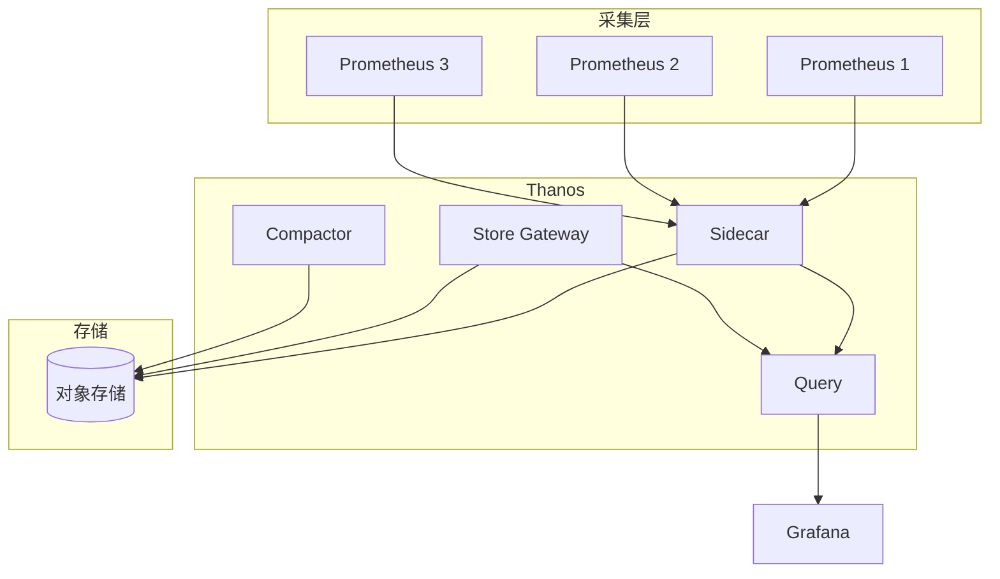

---

## 二十一、Prometheus 与 Kubernetes

### 21.1 Kubernetes 集成

| 组件 | 说明 | 部署方式 |
|------|------|----------|
| kube-state-metrics | K8s 对象指标 | Deployment |
| node-exporter | 节点指标 | DaemonSet |
| cAdvisor | 容器指标 | 内置 |
| metrics-server | 资源指标 | Deployment |

### 21.2 Kubernetes 配置

```yaml
# kube-state-metrics 部署
apiVersion: apps/v1
kind: Deployment
metadata:
  name: kube-state-metrics
spec:
  replicas: 1
  selector:
    matchLabels:
      app: kube-state-metrics
  template:
    spec:
      containers:
        - name: kube-state-metrics
          image: registry.k8s.io/kube-state-metrics/kube-state-metrics:v2.10.0
          args:
            - --metric-labels=app
            - --metric-annotations=app
```

---

## 二十二、Prometheus 告警深入

### 22.1 告警规则设计

| 规则类型 | 说明 | 示例 |
|----------|------|------|
| 阈值告警 | 超过阈值触发 | CPU > 80% |
| 趋势告警 | 趋势预测触发 | 预测1小时后磁盘满 |
| 异常检测 | ML 异常检测 | 突然下降 |
| 组合告警 | 多条件组合 | CPU高且内存高 |

### 22.2 告警规则示例

```yaml
groups:
  - name: node-alerts
    rules:
      - alert: NodeHighCPU
        expr: 100 - (avg by(instance) (irate(node_cpu_seconds_total{mode="idle"}[5m])) * 100) > 80
        for: 10m
        labels:
          severity: warning
        annotations:
          summary: "节点CPU使用率过高"
          description: "节点 {{ $labels.instance }} CPU使用率超过80%，当前值 {{ $value }}%"
          
      - alert: NodeDiskSpaceLow
        expr: (node_filesystem_avail_bytes{mountpoint="/"} / node_filesystem_size_bytes{mountpoint="/"}) * 100 < 20
        for: 5m
        labels:
          severity: critical
        annotations:
          summary: "节点磁盘空间不足"
          description: "节点 {{ $labels.instance }} 磁盘剩余空间不足20%"
```

---

## Prometheus 与 Prometheus Federation 联邦

### 联邦架构设计

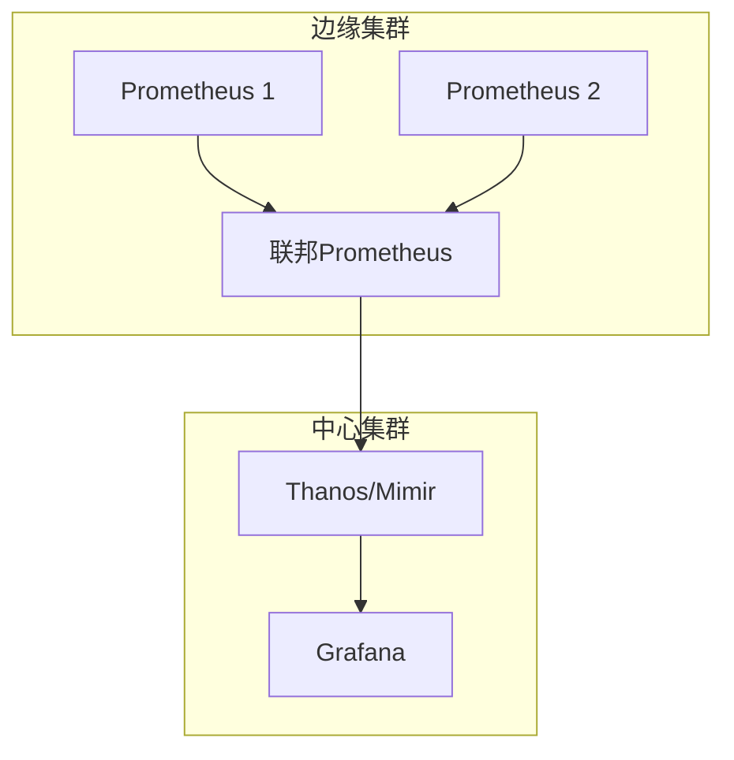

### 联邦配置示例

```yaml
# 联邦 Prometheus 配置
scrape_configs:
  - job_name: 'federate'
    honor_labels: true
    metrics_path: '/federate'
    params:
      'match[]':
        - '{job=~".+"}'
        - '{__name__=~"job:.*"}'
    static_configs:
      - targets:
        - 'prometheus-1:9090'
        - 'prometheus-2:9090'
```

### 指标聚合规则

```yaml
# 联邦聚合规则
groups:
  - name: federated_rules
    rules:
      - record: job:http_requests:rate5m
        expr: sum(rate(http_requests_total[5m])) by (job)
      
      - record: instance:node_cpu:avg5m
        expr: avg(rate(node_cpu_seconds_total[5m])) by (instance)
```

## Prometheus 高可用部署方案

### Thanos 架构

```text
Thanos 组件：
  Sidecar：上传 Prometheus 数据到对象存储
  Store Gateway：查询对象存储中的历史数据
  Query：聚合多 Prometheus 数据源
  Compactor：压缩和降采样历史数据
  Ruler：全局告警规则评估

数据流：
  Prometheus → Sidecar → 对象存储（S3/GCS）
  Thanos Query → Store Gateway → 对象存储
  Grafana → Thanos Query
```

### 高可用方案对比

| 方案 | 数据冗余 | 查询高可用 | 历史数据 | 复杂度 |
|------|----------|-----------|----------|--------|
| 双写 | 有 | 有 | 有限 | 低 |
| Thanos | 有 | 有 | 无限 | 中 |
| Mimir | 有 | 有 | 无限 | 高 |
| VictoriaMetrics | 有 | 有 | 无限 | 中 |

## 补充：标签命名规范

### 标签命名最佳实践

```text
标签命名规则：
  1. 使用小写字母和下划线
     ├── ✅ http_requests_total
     └── ❌ HTTP_Requests_Total

  2. 使用有意义的名称
     ├── ✅ http_request_duration_seconds
     └── ❌ duration

  3. 使用基础单位后缀
     ├── _seconds：时间（秒）
     ├── _bytes：大小（字节）
     ├── _total：计数器
     └── _info：信息

  4. 避免高基数标签
     ├── ✅ method, status
     └── ❌ user_id, request_id
```

### 标签命名示例

| 指标类型 | 正确命名 | 错误命名 | 说明 |
|----------|----------|----------|------|
| 计数器 | http_requests_total | http_requests | 使用 _total 后缀 |
| 直方图 | http_request_duration_seconds_bucket | duration_bucket | 使用 _seconds 后缀 |
| 仪表盘 | cpu_usage_percent | cpu_usage | 使用 _percent 后缀 |
| 信息 | build_info | build | 使用 _info 后缀 |

---

## 补充：Recording Rules

### Recording Rules 配置

```yaml
# recording_rules.yml
groups:
  - name: http_requests
    rules:
      - record: job:http_requests:rate5m
        expr: sum(rate(http_requests_total[5m])) by (job)
      
      - record: job:http_requests:error:rate5m
        expr: sum(rate(http_requests_total{status=~"5.."}[5m])) by (job)
      
      - record: job:http_requests:duration:p99
        expr: histogram_quantile(0.99, sum(rate(http_request_duration_seconds_bucket[5m])) by (le))
```

### Recording Rules 用途

```text
Recording Rules 用途：
  1. 预计算常用查询
     ├── 减少查询时计算
     ├── 提高查询性能
     └── 简化复杂查询

  2. 创建聚合指标
     ├── 跨服务聚合
     ├── 跨时间聚合
     └── 跨维度聚合

  3. 优化告警规则
     ├── 简化告警表达式
     ├── 提高告警准确性
     └── 减少告警噪音
```

---

## 补充：Alerting Rules

### Alerting Rules 配置

```yaml
# alerting_rules.yml
groups:
  - name: alerting_rules
    rules:
      - alert: HighErrorRate
        expr: job:http_requests:error:rate5m > 0.05
        for: 5m
        labels:
          severity: warning
        annotations:
          summary: "High error rate detected"
          description: "Error rate is {{ $value | humanizePercentage }}"

      - alert: HighLatency
        expr: job:http_requests:duration:p99 > 1
        for: 5m
        labels:
          severity: critical
        annotations:
          summary: "High latency detected"
          description: "P99 latency is {{ $value }}s"

      - alert: ServiceDown
        expr: up == 0
        for: 1m
        labels:
          severity: critical
        annotations:
          summary: "Service is down"
          description: "Service {{ $labels.instance }} is down"
```

### Alerting Rules 最佳实践

```text
Alerting Rules 最佳实践：
  1. 告警分级
     ├── critical：服务不可用
     ├── warning：性能下降
     └── info：信息通知

  2. 告警阈值
     ├── 基于历史数据
     ├── 考虑业务波动
     └── 避免告警风暴

  3. 告警抑制
     ├── 相关告警合并
     ├── 低优先级抑制
     └── 维护窗口静默

  4. 告警通知
     ├── 多渠道通知
     ├── 升级机制
     └── 确认机制
```

---

## 补充：Thanos Store/Compactor

### Thanos Store 配置

```yaml
# Thanos Store 配置
- type: THANOS-SIDECAR
  name: thanos-sidecar
  config:
    url: http://sidecar:10901
    min_time: 2d

- type: THANOS-STORE
  name: thanos-store
  config:
    url: http://store:10901
    min_time: 2d
    max_time: 30d
```

### Thanos Compactor 配置

```yaml
# Thanos Compactor 配置
- type: THANOS-COMPACTOR
  name: thanos-compactor
  config:
    url: http://compactor:10902
    retention.resolution-raw: 30d
    retention.resolution-downsampled: 1y
    retention.deletion-delay: 48h
```

### Thanos 组件对比

| 组件 | 功能 | 部署位置 | 说明 |
|------|------|----------|------|
| Sidecar | 上传数据 | Prometheus 旁 | 实时上传 |
| Store Gateway | 查询历史 | 独立部署 | 查询对象存储 |
| Query | 聚合查询 | 独立部署 | 聚合多源 |
| Compactor | 压缩数据 | 独立部署 | 降采样压缩 |
| Ruler | 规则评估 | 独立部署 | 全局告警 |

---

## 补充：容量规划

### 容量规划公式

```text
容量规划公式：
  1. 存储容量
     ├── 原始数据 = 采样频率 × 时间跨度 × 指标数 × 样本大小
     ├── 压缩后 = 原始数据 × 压缩比（约 10%）
     └── 保留期 = 压缩后数据 × 保留天数

  2. 内存容量
     ├── 内存 = 并发查询数 × 单查询内存
     └── 建议：内存 = 存储容量 × 1-2%

  3. CPU 容量
     ├── CPU = 查询 QPS × 单查询 CPU 时间
     └── 建议：CPU = 内存（GB）× 0.5-1

  4. 网络容量
     ├── 网络 = 采样频率 × 指标数 × 样本大小
     └── 建议：网络 = 存储容量 × 0.1-0.2
```

### 容量规划示例

| 场景 | 指标数 | 采样频率 | 保留天数 | 存储容量 |
|------|--------|----------|----------|----------|
| 小规模 | 100 | 15s | 15天 | 10GB |
| 中规模 | 1000 | 15s | 30天 | 100GB |
| 大规模 | 10000 | 15s | 30天 | 1TB |
| 超大规模 | 100000 | 15s | 30天 | 10TB |

---

## 补充：联邦

### 联邦配置

```yaml
# 联邦配置
scrape_configs:
  - job_name: 'federate'
    honor_labels: true
    metrics_path: '/federate'
    params:
      'match[]':
        - '{job=~".+"}'
    static_configs:
      - targets:
          - 'prometheus-1:9090'
          - 'prometheus-2:9090'
          - 'prometheus-3:9090'
```

### 联邦架构

```text
联邦架构：
  ├── 全局 Prometheus
  │   ├── 聚合所有子 Prometheus
  │   ├── 全局视图
  │   └── 全局告警

  ├── 子 Prometheus
  │   ├── 采集本地指标
  │   ├── 本地告警
  │   └── 数据上报

  └── 数据流
      ├── 子 Prometheus → 全局 Prometheus
      ├── 全局 Prometheus → Grafana
      └── 全局 Prometheus → Alertmanager
```

---

## 补充：Alertmanager

### Alertmanager 配置

```yaml
# alertmanager.yml
global:
  resolve_timeout: 5m

route:
  group_by: ['alertname', 'cluster', 'service']
  group_wait: 10s
  group_interval: 10s
  repeat_interval: 12h
  receiver: 'web.hook'
  routes:
    - match:
        severity: critical
      receiver: 'pager'
    - match:
        severity: warning
      receiver: 'slack'

receivers:
  - name: 'web.hook'
    webhook_configs:
      - url: 'http://webhook:5001/'
  - name: 'pager'
    pagerduty_configs:
      - routing_key: '<key>'
  - name: 'slack'
    slack_configs:
      - api_url: '<url>'
        channel: '#alerts'
        title: '{{ .GroupLabels.alertname }}'
        text: '{{ .CommonAnnotations.description }}'
```

### Alertmanager 最佳实践

```text
Alertmanager 最佳实践：
  1. 告警分组
     ├── 按告警名称分组
     ├── 按集群分组
     └── 按服务分组

  2. 告警静默
     ├── 维护窗口静默
     ├── 已知问题静默
     └── 测试环境静默

  3. 告警抑制
     ├── 低优先级抑制
     ├── 相关告警合并
     └── 重复告警抑制

  4. 告警升级
     ├── 分级通知
     ├── 升级机制
     └── 确认机制
```

---

## 补充：vs VictoriaMetrics 对比

### 性能对比

| 维度 | Prometheus | VictoriaMetrics |
|------|------------|-----------------|
| 存储效率 | 中 | 高（压缩比更好） |
| 查询性能 | 中 | 高（查询更快） |
| 内存使用 | 高 | 低 |
| 高可用 | 需要联邦 | 原生支持 |
| 长期存储 | 需要 Thanos | 原生支持 |
| 云原生 | 标准 | 更好 |

### 选型建议

```text
选型决策：
  1. 标准部署 → Prometheus
  2. 高性能需求 → VictoriaMetrics
  3. 长期存储 → VictoriaMetrics
  4. 高可用需求 → VictoriaMetrics
  5. 云原生环境 → VictoriaMetrics
  6. 成本敏感 → VictoriaMetrics
```

---

## 补充：最佳实践

### 监控最佳实践

```text
监控最佳实践：
  1. 四大黄金信号
     ├── 延迟：请求处理时间
     ├── 流量：请求吞吐量
     ├── 错误：错误率
     └── 饱和度：资源使用率

  2. USE 方法
     ├── Utilization：资源使用率
     ├── Saturation：资源饱和度
     └── Errors：错误计数

  3. RED 方法
     ├── Rate：请求速率
     ├── Errors：错误率
     └── Duration：请求延迟

  4. SLI/SLO/SLA
     ├── SLI：服务级别指标
     ├── SLO：服务级别目标
     └── SLA：服务级别协议
```

### 告警最佳实践

```text
告警最佳实践：
  1. 告警分级
     ├── P0：服务不可用
     ├── P1：性能严重下降
     ├── P2：性能轻微下降
     └── P3：信息通知

  2. 告警阈值
     ├── 基于历史数据
     ├── 考虑业务波动
     └── 避免告警风暴

  3. 告警通知
     ├── 多渠道通知
     ├── 升级机制
     └── 确认机制

  4. 告警响应
     ├── 响应流程
     ├── 处理流程
     └── 复盘流程
```

---

## 补充：生产问题排查

### 常见问题

| 问题 | 原因 | 解决方案 |
|------|------|----------|
| 查询超时 | 数据量大/查询复杂 | 优化查询/增加资源 |
| 内存溢出 | 并发查询/大数据量 | 限制并发/增加内存 |
| 磁盘满 | 数据量增长 | 扩容/清理旧数据 |
| 告警风暴 | 阈值设置不当 | 调整阈值/抑制告警 |
| 数据丢失 | 采集间隔/网络 | 调整采集间隔/优化网络 |

### 排查流程

```bash
# 1. 检查服务状态
curl -s http://localhost:9090/-/healthy

# 2. 检查存储状态
curl -s http://localhost:9090/api/v1/status/tsdb

# 3. 检查查询性能
curl -s 'http://localhost:9090/api/v1/query?query=up'

# 4. 检查告警状态
curl -s http://localhost:9090/api/v1/alerts

# 5. 检查日志
journalctl -u prometheus -f
```

---

## 补充：Recording Rules 高级用法

### 多维度聚合规则

```yaml
groups:
  - name: multi_dimension_rules
    interval: 30s
    rules:
      # 按 namespace 和 pod 聚合 CPU 使用率
      - record: namespace_pod_cpu_usage:ratio
        expr: |
          sum(rate(container_cpu_usage_seconds_total{container!="POD"}[5m])) by (namespace, pod)
          /
          sum(container_spec_cpu_quota{container!="POD"} / container_spec_cpu_period{container!="POD"}) by (namespace, pod)

      # 跨集群聚合
      - record: cluster:memory_usage:ratio
        expr: |
          sum(node_memory_MemTotal_bytes - node_memory_MemAvailable_bytes) by (cluster)
          /
          sum(node_memory_MemTotal_bytes) by (cluster)

      # 时间窗口比较（同比）
      - record: api_error_rate:week_over_week
        expr: |
          sum(rate(http_requests_total{code=~"5.."}[5m])) by (service)
          /
          sum(rate(http_requests_total[5m])) by (service)
          /
          (
            sum(rate(http_requests_total{code=~"5.."}[5m] offset 7d)) by (service)
            /
            sum(rate(http_requests_total[5m] offset 7d)) by (service)
          )
```

### Recording Rules 性能优化

| 优化策略 | 说明 | 适用场景 |
|----------|------|----------|
| 合理设置 interval | 避免过于频繁计算 | 高基数指标 |
| 预计算高频查询 | 减少即时计算 | Grafana Dashboard |
| 分层聚合 | 原始→中间→最终 | 复杂多层聚合 |
| 限制规则数量 | 单组不超过数百条 | 大规模集群 |
| 使用 and/without | 减少标签维度 | 多维度交叉 |

### Rule 文件组织结构

```text
rules/
├── base/
│   ├── node_recording.yml        # 节点基础指标
│   ├── container_recording.yml   # 容器基础指标
│   └── k8s_recording.yml         # K8s 基础指标
├── intermediate/
│   ├── service_slo.yml           # 服务 SLO 中间指标
│   └── cluster_health.yml        # 集群健康中间指标
├── alerting/
│   ├── node_alerts.yml           # 节点告警规则
│   ├── service_alerts.yml        # 服务告警规则
│   └── infra_alerts.yml          # 基础设施告警规则
└── custom/
    └── business_metrics.yml      # 业务自定义指标
```

## 补充：Alerting Rules 高级模式

### 多窗口多条件告警

```yaml
groups:
  - name: multi_window_alerts
    rules:
      # 快速恢复 + 慢速触发（避免误报）
      - alert: HighErrorRateMultiWindow
        expr: |
          sum(rate(http_requests_total{code=~"5.."}[5m])) by (service)
          / sum(rate(http_requests_total[5m])) by (service)
          > 0.05
        for: 2m
        labels:
          severity: warning
        annotations:
          summary: "服务 {{ $labels.service }} 错误率超过 5%（5分钟窗口）"

      - alert: HighErrorRatePersistent
        expr: |
          sum(rate(http_requests_total{code=~"5.."}[30m])) by (service)
          / sum(rate(http_requests_total[30m])) by (service)
          > 0.1
        for: 10m
        labels:
          severity: critical
        annotations:
          summary: "服务 {{ $labels.service }} 错误率持续超过 10%（30分钟窗口）"

      # 恢复条件：错误率低于阈值持续一段时间
      - alert: HighErrorRateRecovery
        expr: |
          sum(rate(http_requests_total{code=~"5.."}[5m])) by (service)
          / sum(rate(http_requests_total[5m])) by (service)
          < 0.01
        for: 5m
        labels:
          severity: info
        annotations:
          summary: "服务 {{ $labels.service }} 错误率已恢复至 1% 以下"
```

### 预测性告警

```yaml
# 基于趋势预测
- alert: DiskSpacePredictedFull
  expr: |
    predict_linear(
      node_filesystem_avail_bytes{mountpoint="/"}[7d],
      7 * 24 * 3600
    ) < 0
  for: 1h
  labels:
    severity: warning
  annotations:
    summary: "磁盘预计 7 天后耗尽"
    description: "当前可用 {{ $value | humanize1024 }}B，预测线性趋势"

# 基于季节性预测
- alert: TrafficAnomalyPredicted
  expr: |
    (
      sum(rate(http_requests_total[1h])) by (service)
      - avg_over_time(sum(rate(http_requests_total[1h])) by (service) [7d:1h] offset 168h)
    )
    /
    avg_over_time(sum(rate(http_requests_total[1h])) by (service) [7d:1h] offset 168h)
    > 2
  for: 30m
  labels:
    severity: warning
  annotations:
    summary: "服务 {{ $labels.service }} 流量异常偏高（相比上周同期）"
```

### 告警规则模板

| 告警类型 | PromQL 模板 | 持续时间 | 严重级别 |
|----------|-------------|----------|----------|
| 服务不可用 | `up == 0` | 1m | critical |
| 高错误率 | `rate(errors[5m]) / rate(total[5m]) > 0.05` | 5m | warning |
| 高延迟 | `histogram_quantile(0.99, rate(duration_bucket[5m])) > 1` | 10m | warning |
| 预测磁盘满 | `predict_linear(disk_avail[7d], 7d*24*3600) < 0` | 1h | warning |
| 流量异常 | `rate(current[1h]) / avg_over_time(rate(current[1h])[7d:1h]) > 2` | 30m | info |

## 补充：Thanos 集成架构

### Thanos 核心组件

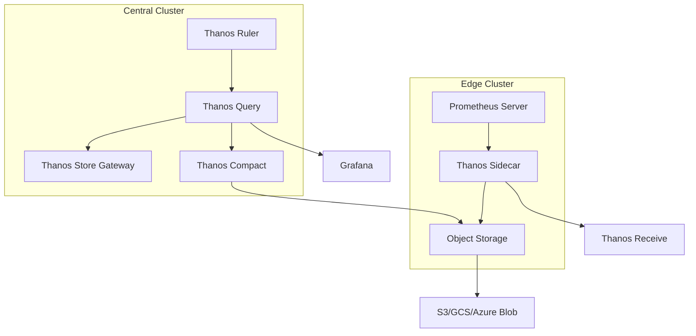

### Thanos 配置示例

```yaml
# prometheus 配置（启用 remote_write）
global:
  external_labels:
    cluster: production
    replica: prometheus-0
  remote_write:
    - url: http://thanos-receive:19291/api/v1/receive

# Thanos Sidecar 启动参数
thanos sidecar \
  --tsdb.path=/prometheus \
  --prometheus.url=http://localhost:9090 \
  --objstore.config-file=/etc/thanos/bucket.yml \
  --shipper.upload-compacted \
  --http-address=0.0.0.0:10902

# Thanos Query 启动参数
thanos query \
  --http-address=0.0.0.0:10902 \
  --query.replica-label=replica \
  --store=dnssrv+_grpc._tcp.thanos-sidecar.thanos.svc.cluster.local \
  --store=dnssrv+_grpc._tcp.thanos-store.thanos.svc.cluster.local
```

### Thanos vs 原生 Prometheus 对比

| 维度 | 原生 Prometheus | Thanos |
|------|-----------------|--------|
| 存储时长 | 本地磁盘（15天） | 对象存储（永久） |
| 高可用 | Federation（复杂） | Sidecar（简单） |
| 全局查询 | 不支持 | Thanos Query |
| 数据压缩 | 手动 | 自动（Compact） |
| 降采样 | 不支持 | 自动 5m/1h 降采样 |
| 成本 | 高（SSD） | 低（对象存储） |

## 补充：容量规划

### 存储容量计算

```text
存储容量 = 指标数量 × 采样点大小 × 保留期 × 副本数

计算公式：
  1. 指标数量 = series_count × samples_per_scrape
  2. 采样点大小 ≈ 1-2 字节（压缩后）
  3. 保留期 = 15 天（默认）
  4. 副本数 = HA 部署数量

示例计算：
  series_count = 100,000
  samples_per_scrape = 1（每 15 秒一个样本）
  采样频率 = 1/15s = 5760 samples/day/series
  15 天 = 5760 × 15 = 86,400 samples/series
  压缩后 ≈ 86,400 × 1.5 bytes = 129,600 bytes/series ≈ 127 KB/series
  总存储 = 100,000 × 127 KB ≈ 12.7 GB
  加上索引和 WAL ≈ 20 GB
```

### 资源配置参考

| 指标数量 | CPU | 内存 | 存储 | 网络 |
|----------|-----|------|------|------|
| < 10万 | 2核 | 4GB | 50GB | 100Mbps |
| 10-50万 | 4核 | 8GB | 200GB | 1Gbps |
| 50-100万 | 8核 | 16GB | 500GB | 1Gbps |
| > 100万 | 16核+ | 32GB+ | 1TB+ | 10Gbps |

### 水平扩展方案

```mermaid
graph TB
    subgraph 方案一：Federation
        A[Prometheus-0] --> E[Federation]
        B[Prometheus-1] --> E
        C[Prometheus-2] --> E
        E --> F[Grafana]
    end
    
    subgraph 方案二：Thanos
        G[Prometheus-0 + Sidecar] --> H[Thanos Query]
        I[Prometheus-1 + Sidecar] --> H
        J[Prometheus-2 + Sidecar] --> H
        H --> K[Grafana]
    end
```

## 补充：Federation 聚合

### Federation 配置

```yaml
# prometheus.yml 聚合层配置
scrape_configs:
  - job_name: 'federate'
    honor_labels: true
    metrics_path: '/federate'
    params:
      'match[]':
        - '{job=~".+"}'
        - '{__name__=~"job:.*"}'
    static_configs:
      - targets:
          - 'prometheus-0:9090'
          - 'prometheus-1:9090'
          - 'prometheus-2:9090'
```

### Federation 架构模式

| 模式 | 说明 | 适用场景 |
|------|------|----------|
| 单层联邦 | 直接聚合 | 小规模（< 5个实例） |
| 双层联邦 | 边缘+中心 | 中大规模 |
| 层级联邦 | 多级聚合 | 跨地域部署 |

### Federation 查询优化

```yaml
# 聚合规则（减少数据量）
groups:
  - name: federation_rules
    rules:
      # 只聚合核心指标
      - record: job:http_requests:rate5m
        expr: sum(rate(http_requests_total[5m])) by (job, code)

      # 使用 and/without 减少标签
      - record: node:cpu:utilization
        expr: 1 - avg(rate(node_cpu_seconds_total{mode="idle"}[5m])) by (instance)

      # 预计算 SLO 指标
      - record: service:slo:availability
        expr: |
          sum(rate(http_requests_total{code!~"5.."}[30d])) by (service)
          /
          sum(rate(http_requests_total[30d])) by (service)
```

## 补充：Prometheus 自监控

### 自身健康指标

```yaml
# Prometheus 自监控告警
groups:
  - name: prometheus_self_monitoring
    rules:
      # Prometheus 实例宕机
      - alert: PrometheusDown
        expr: up{job="prometheus"} == 0
        for: 1m
        labels:
          severity: critical
        annotations:
          summary: "Prometheus 实例 {{ $labels.instance }} 宕机"

      # 采集延迟过高
      - alert: PrometheusScrapeDurationHigh
        expr: prometheus_target_sync_length_seconds{quantile="0.99"} > 30
        for: 5m
        labels:
          severity: warning
        annotations:
          summary: "Prometheus 采集延迟过高（P99 > 30s）"

      # WAL 写入延迟
      - alert: PrometheusWALWriteLatencyHigh
        expr: rate(prometheus_tsdb_wal_fsync_duration_seconds_sum[5m]) > 0.1
        for: 5m
        labels:
          severity: warning
        annotations:
          summary: "Prometheus WAL 写入延迟过高"

      # 存储空间不足
      - alert: PrometheusStorageSpaceLow
        expr: prometheus_tsdb_storage_blocks_bytes / (1024*1024*1024) > 50
        for: 1h
        labels:
          severity: warning
        annotations:
          summary: "Prometheus 存储空间使用超过 50GB"
```

### 自监控仪表板指标

| 指标 | 说明 | 告警阈值 |
|------|------|----------|
| `prometheus_config_last_reload_successful` | 配置重载状态 | == 0 |
| `prometheus_tsdb_head_series` | 活跃时间序列数 | > 500k |
| `prometheus_tsdb_head_chunks` | 内存中 chunks 数 | > 100万 |
| `prometheus_rule_evaluation_duration_seconds` | 规则评估耗时 | P99 > 10s |
| `prometheus_notification_queue_length` | 告警通知队列长度 | > 100 |

## 补充：多集群监控方案

### 方案对比

| 方案 | 架构 | 优点 | 缺点 |
|------|------|------|------|
| Federation | 边缘→中心聚合 | 简单 | 数据不完整 |
| Thanos | Sidecar+Query | 全局视图 | 架构复杂 |
| Cortex | 远程写入 | 水平扩展 | 运维复杂 |
| VictoriaMetrics | 远程写入 | 高性能 | 生态较小 |

### 多集群 Thanos 架构

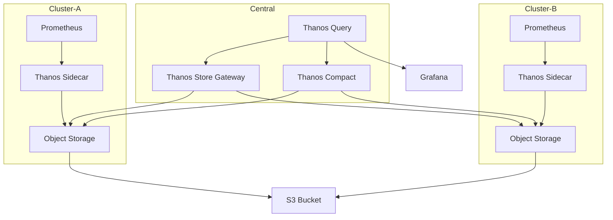

### 跨集群查询配置

```yaml
# Thanos Query 跨集群查询
thanos query \
  --http-address=0.0.0.0:10902 \
  --query.replica-label=replica \
  --store=dnssrv+_grpc._tcp.thanos-sidecar-cluster-a.thanos.svc.cluster.local \
  --store=dnssrv+_grpc._tcp.thanos-sidecar-cluster-b.thanos.svc.cluster.local \
  --store=dnssrv+_grpc._tcp.thanos-store.thanos.svc.cluster.local

# 使用 ExternalLabels 区分集群
global:
  external_labels:
    cluster: production-us-east
    replica: prometheus-0
```

## 补充：生产问题排查

### 高级排查技巧

```bash
# 1. 检查时间序列基数
curl -s 'http://localhost:9090/api/v1/label/__name__/values' | jq '.data | length'

# 2. 检查指标内存占用
curl -s 'http://localhost:9090/api/v1/status/tsdb' | jq '.data.seriesCountByMetricName[:10]'

# 3. 检查规则评估性能
curl -s 'http://localhost:9090/api/v1/rules' | jq '.data.groups[] | {name: .name, interval: .interval, rules: [.rules[] | {name: .name, duration: .duration}]}' | head -100

# 4. 检查采集目标状态
curl -s 'http://localhost:9090/api/v1/targets' | jq '.data.activeTargets[] | select(.health != "up") | {instance: .labels.instance, health: .health, lastError: .lastError}'

# 5. 检查告警队列
curl -s 'http://localhost:9090/api/v1/alerts' | jq '.data.alerts | length'
```

### 性能调优参数

| 参数 | 默认值 | 推荐值 | 说明 |
|------|--------|--------|------|
| `--storage.tsdb.retention.time` | 15d | 30-90d | 数据保留时长 |
| `--storage.tsdb.retention.size` | 0 | 按需设置 | 按大小保留 |
| `--storage.tsdb.wal-compression` | false | true | WAL 压缩 |
| `--query.timeout` | 2m | 5m | 查询超时 |
| `--query.max-samples` | 5000000 | 10000000 | 最大样本数 |
| `--rule.evaluation-interval` | 1m | 30s | 规则评估间隔 |

---

## 二十三、Prometheus 高级特性

### 23.1 服务发现配置

```yaml
# 服务发现配置
scrape_configs:
  # Kubernetes服务发现
  - job_name: 'kubernetes-pods'
    kubernetes_sd_configs:
      - role: pod
    relabel_configs:
      - source_labels: [__meta_kubernetes_pod_annotation_prometheus_io_scrape]
        action: keep
        regex: true
      - source_labels: [__meta_kubernetes_pod_annotation_prometheus_io_path]
        action: replace
        target_label: __metrics_path__
        regex: (.+)
      
  # 文件服务发现
  - job_name: 'file-sd'
    file_sd_configs:
      - files:
        - '/etc/prometheus/targets/*.json'
        refresh_interval: 5m
      
  # DNS服务发现
  - job_name: 'dns-sd'
    dns_sd_configs:
      - names: ['_prometheus._tcp.example.com']
        type: SRV
        refresh_interval: 30s
```

### 23.2 服务发现模式对比

| 模式 | 说明 | 优势 | 劣势 | 适用场景 |
|------|------|------|------|---------|
| **静态配置** | 手动配置目标 | 简单 | 不灵活 | 简单环境 |
| **文件发现** | 从文件读取目标 | 灵活 | 需要工具 | 动态环境 |
| **Kubernetes发现** | 从K8s API读取 | 自动化 | 复杂 | K8s环境 |
| **DNS发现** | 从DNS记录读取 | 简单 | 依赖DNS | 传统环境 |
| **Consul发现** | 从Consul读取 | 灵活 | 依赖Consul | 微服务 |

### 23.3 服务发现流程

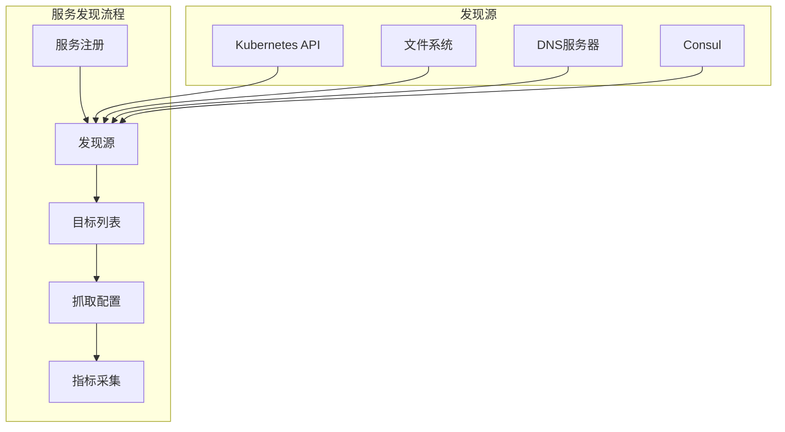

---

## 二十四、Prometheus 告警规则

### 24.1 告警规则语法

```yaml
# 告警规则配置
groups:
  - name: application-alerts
    rules:
      # 基础告警
      - alert: HighErrorRate
        expr: rate(http_requests_total{status=~"5.."}[5m]) > 0.1
        for: 2m
        labels:
          severity: critical
          team: backend
        annotations:
          summary: "高错误率告警"
          description: "HTTP请求错误率超过10%"
          
      # 预测性告警
      - alert: DiskSpacePrediction
        expr: predict_linear(node_filesystem_free_bytes[1h], 3600*24) < 0
        for: 30m
        labels:
          severity: warning
          team: infrastructure
        annotations:
          summary: "磁盘空间预测告警"
          description: "预计24小时内磁盘空间将耗尽"
          
      # 异常检测告警
      - alert: AnomalyDetected
        expr: abs(avg_over_time(http_request_duration_seconds[1h]) - avg_over_time(http_request_duration_seconds[1d])) > 2*stddev_over_time(http_request_duration_seconds[1d])
        for: 10m
        labels:
          severity: warning
          team: backend
        annotations:
          summary: "异常检测告警"
          description: "HTTP请求延迟出现异常"
```

### 24.2 告警规则最佳实践

```text
# 告警规则设计原则
1. 明确性：告警描述清晰明确
2. 可操作性：告警包含处理建议
3. 分级：根据严重程度分级
4. 抑制：避免告警风暴
5. 升级：设置告警升级机制

# 告警规则示例
- 基础设施告警：CPU、内存、磁盘、网络
- 应用告警：错误率、延迟、吞吐量
- 业务告警：订单量、支付成功率
- 安全告警：登录失败、权限异常
```

### 24.3 告警处理流程

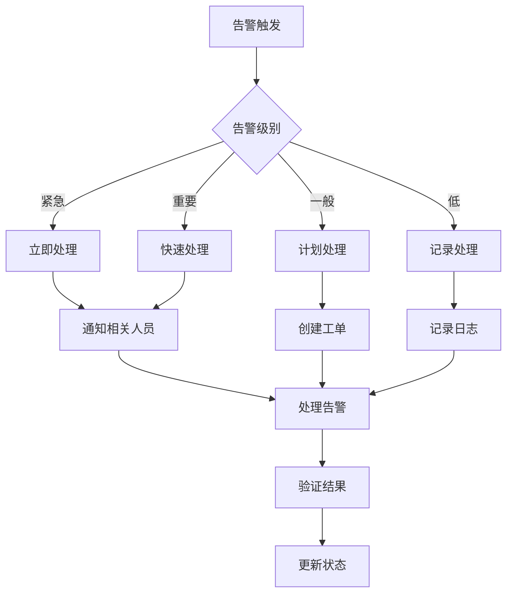

---

## 二十五、Prometheus 数据保留

### 25.1 数据保留策略

```yaml
# 数据保留配置
storage:
  tsdb:
    # 按时间保留
    retention.time: 30d
    
    # 按大小保留
    retention.size: 50GB
    
    # WAL压缩
    wal-compression: true

# 数据清理配置
cleanup:
  # 自动清理过期数据
  auto: true
  
  # 清理间隔
  interval: 1h
```

### 25.2 数据保留策略对比

| 策略 | 说明 | 优势 | 劣势 | 适用场景 |
|------|------|------|------|---------|
| **按时间保留** | 保留固定时间数据 | 简单 | 可能浪费存储 | 时间敏感 |
| **按大小保留** | 保留固定大小数据 | 精确 | 需要计算 | 存储敏感 |
| **混合保留** | 时间+大小 | 平衡 | 复杂 | 生产环境 |
| **无限保留** | 保留所有数据 | 完整 | 存储压力大 | 审计需求 |

### 25.3 数据归档策略

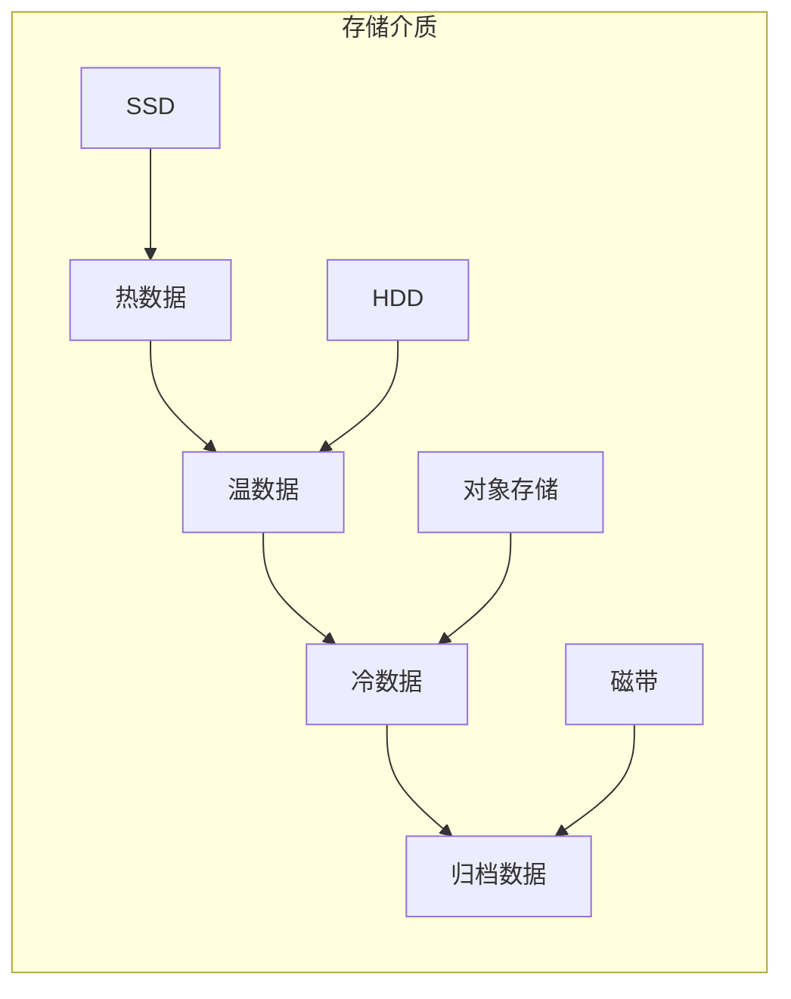

---

## 二十六、Prometheus 性能优化

### 26.1 性能优化配置

```yaml
# 性能优化配置
global:
  # 抓取间隔
  scrape_interval: 15s
  
  # 评估间隔
  evaluation_interval: 15s
  
  # 查询超时
  query_timeout: 2m

# 存储优化
storage:
  tsdb:
    # WAL压缩
    wal-compression: true
    
    # 内存限制
    memory_limit: 4GB

# 查询优化
query:
  # 最大并发查询
  max_concurrent: 20
  
  # 最大样本数
  max_samples: 5000000
```

### 26.2 性能监控指标

| 指标 | 说明 | 目标值 |
|------|------|--------|
| **prometheus_tsdb_head_series** | 活跃时间序列数 | <100万 |
| **prometheus_tsdb_head_chunks** | 活跃数据块数 | <1000万 |
| **prometheus_query_duration_seconds** | 查询延迟 | <1s |
| **prometheus_rule_evaluation_duration_seconds** | 规则评估延迟 | <1s |

### 26.3 性能优化建议

```text
数据模型优化：
  - 减少高基数标签
  - 使用标签重写
  - 避免过多标签值

抓取优化：
  - 合理设置抓取间隔
  - 使用抓取限制
  - 优化抓取配置

查询优化：
  - 使用记录规则
  - 避免复杂查询
  - 使用查询缓存

存储优化：
  - 启用WAL压缩
  - 合理设置保留策略
  - 定期清理数据
```

---

## 二十七、Prometheus 安全管理

### 27.1 认证与授权

```yaml
# 认证配置
global:
  # 基本认证
  basic_auth:
    username: admin
    password: secret
    
  # TLS认证
  tls_config:
    cert_file: /path/to/cert.pem
    key_file: /path/to/key.pem

# 授权配置
authorization:
  # RBAC配置
  type: RBAC
  
  # 角色配置
  roles:
    - name: admin
      permissions: ["read", "write"]
    - name: viewer
      permissions: ["read"]
```

### 27.2 网络安全

```yaml
# 网络安全配置
server:
  # 监听地址
  listen_address: "0.0.0.0:9090"
  
  # TLS配置
  tls_config:
    cert_file: /path/to/cert.pem
    key_file: /path/to/key.pem
    
  # 访问控制
  access_control:
    allow:
      - "192.168.1.0/24"
      - "10.0.0.0/8"
    deny:
      - "0.0.0.0/0"
```

### 27.3 数据安全

```text
# 数据安全措施
传输安全：
  - 使用TLS加密传输
  - 证书验证
  - 密钥管理

存储安全：
  - 加密存储数据
  - 访问控制
  - 审计日志

访问安全：
  - 用户认证
  - 权限控制
  - 操作审计
```

---

## 二十八、Prometheus 与 Grafana 集成

### 28.1 数据源配置

```yaml
# Grafana数据源配置
apiVersion: 1

datasources:
  - name: Prometheus
    type: prometheus
    access: proxy
    url: http://prometheus:9090
    isDefault: true
    editable: false
```

### 28.2 仪表板设计

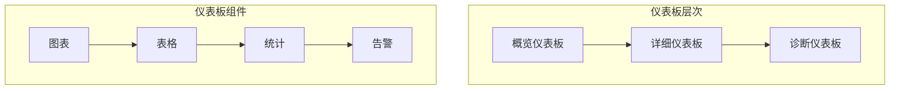

### 28.3 仪表板最佳实践

```text
# 仪表板设计原则
1. 简洁性：避免信息过载
2. 层次性：从概览到详细
3. 可操作性：包含告警和操作
4. 一致性：统一风格和格式
5. 可维护性：便于更新和维护

# 仪表板组件选择
- 图表：趋势分析、对比分析
- 表格：详细数据、列表信息
- 统计：关键指标、状态信息
- 告警：异常检测、实时告警
```

---

## 二十九、Prometheus 与 Kubernetes

### 29.1 Kubernetes监控架构

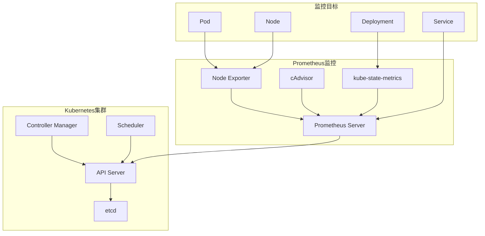

### 29.2 Kubernetes监控配置

```yaml
# Kubernetes监控配置
apiVersion: monitoring.coreos.com/v1
kind: Prometheus
metadata:
  name: prometheus
spec:
  replicas: 2
  serviceAccountName: prometheus
  resources:
    requests:
      memory: 2Gi
    limits:
      memory: 4Gi
  serviceMonitorSelector:
    matchLabels:
      team: frontend
  ruleSelector:
    matchLabels:
      role: prometheus-rules
```

### 29.3 Kubernetes监控指标

| 指标类型 | 指标名称 | 说明 |
|---------|----------|------|
| **Pod指标** | pod_cpu_usage | Pod CPU使用率 |
| **Pod指标** | pod_memory_usage | Pod内存使用率 |
| **Node指标** | node_cpu_usage | Node CPU使用率 |
| **Node指标** | node_memory_usage | Node内存使用率 |
| **Service指标** | service_requests_total | Service请求总数 |
| **Deployment指标** | deployment_replicas | Deployment副本数 |

---

## 三十、Prometheus 最佳实践

### 30.1 生产环境配置清单

```text
□ 高可用配置
  □ Prometheus实例数：2+
  □ 数据复制：启用
  □ 负载均衡：配置

□ 存储配置
  □ 存储类型：本地存储/远程存储
  □ 数据保留：按时间/按大小
  □ 备份策略：定期备份

□ 安全配置
  □ 认证：基本认证/TLS认证
  □ 授权：RBAC配置
  □ 网络安全：防火墙/ACL

□ 监控配置
  □ 自监控：监控Prometheus自身
  □ 告警配置：关键告警规则
  □ 仪表板配置：Grafana仪表板
```

### 30.2 性能优化建议

```text
数据模型优化：
  - 减少高基数标签
  - 使用标签重写
  - 避免过多标签值

抓取优化：
  - 合理设置抓取间隔
  - 使用抓取限制
  - 优化抓取配置

查询优化：
  - 使用记录规则
  - 避免复杂查询
  - 使用查询缓存

存储优化：
  - 启用WAL压缩
  - 合理设置保留策略
  - 定期清理数据
```

---

## 三十一、与其他板块的关系

- 可观测性三支柱见「[云上可观测性体系](../中间件/云上可观测性体系.md)」；
- 日志采集见「[日志采集与传输](../中间件/日志采集与传输.md)」；
- 链路追踪见「[SkyWalking](../中间件/链路追踪SkyWalking.md)」；
- 告警通知见「[Alertmanager](./Alertmanager.md)」；
- 可视化见「[Grafana](./Grafana.md)」。
