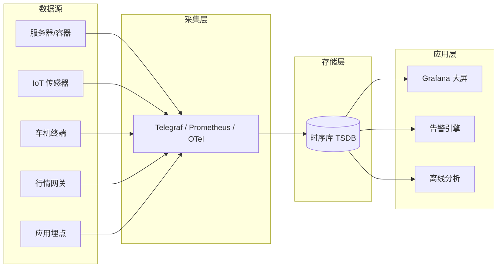
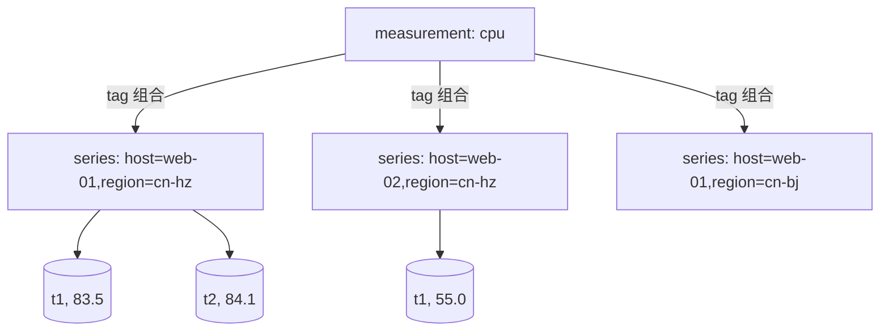
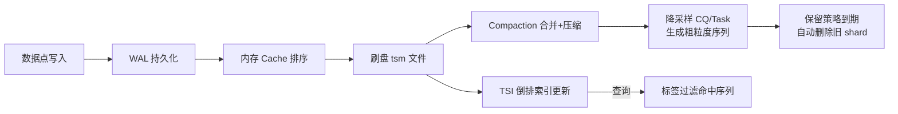
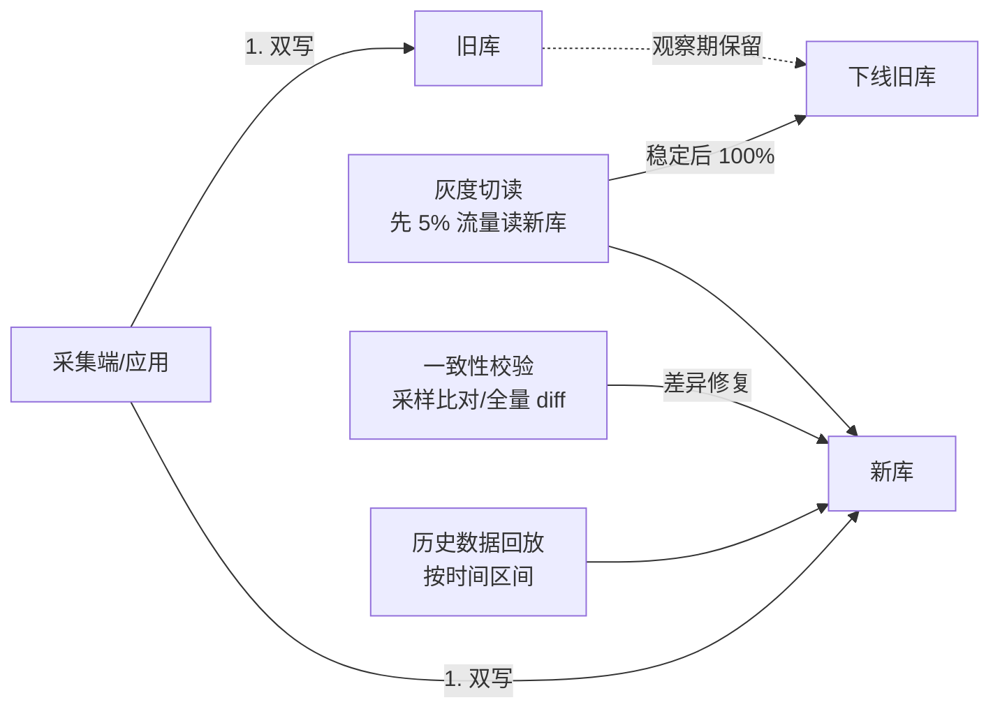
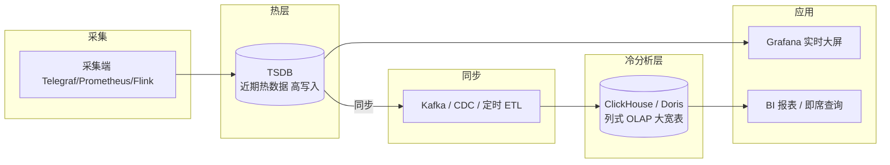
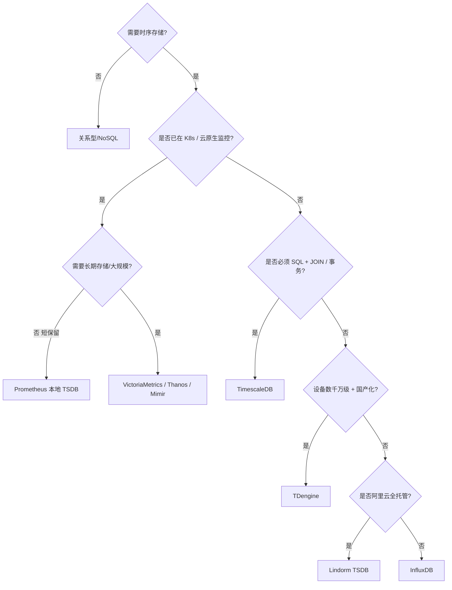
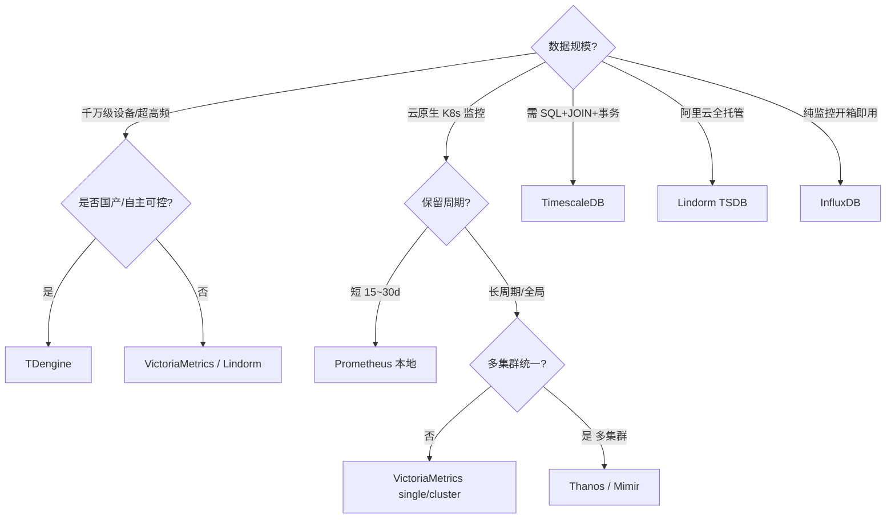

# 时序库（TSDB）板块

> 本板块聚焦时间序列数据库（Time Series Database, TSDB）的原理、选型与实战。
> 子文档：[InfluxDB 详解](./InfluxDB.md)

---

## 1. 什么是时序数据

**时序数据（Time Series Data）** 是指按时间顺序产生、每个数据点都带有时间戳（timestamp）的数据集合。它记录的是某个被观测对象在一系列时间点的状态或度量值。

一条最朴素的时序数据可表示为三元组：

```text
<指标名(measurement), 时间戳(timestamp), 数值(value)>
```

在真实场景中，为了支持多维检索，还会带上若干「标签（tag）」：

```text
<measurement=cpu, host=web-01, region=cn-hangzhou, t=2026-07-28T10:00:00Z, value=83.5>
```

### 1.1 时序数据的六大特征

| 特征 | 说明 | 对存储/查询的影响 |
|------|------|------------------|
| **写多读少** | 数据持续高频写入，读取多为聚合后的区间查询，而非单点 | 优化写入吞吐优先于事务一致性 |
| **按时间递增** | 时间戳天然单调递增，极少更新历史点 | 可顺序追加写，用 LSM / 列式追加 |
| **高吞吐写入** | 监控、IoT 每秒可能产生百万级数据点 | 需要批量、缓冲、WAL |
| **天然冷热** | 越新的数据访问越频繁，越旧越冷 | 分层存储、降采样、保留策略 |
| **维度标签多** | 同一指标有 host、region、app 等多维标签 | 需要倒排索引支撑标签检索 |
| **不可变性** | 历史点一旦写入几乎不更新 | 可用仅追加（append-only）结构，压缩友好 |

> 补充：时序数据往往具有**强局部性**（同一序列相邻点的时间戳、数值变化很小），这一特性是高压缩算法（Delta、XOR 等）能够生效的前提。

### 1.2 典型场景

- **监控指标（Metrics）**：服务器 CPU、内存、磁盘、网络；Kubernetes Pod 指标；通过 Prometheus / Grafana 体系采集。
- **IoT / 工业物联网**：传感器温度、湿度、压力、振动；设备心跳。
- **车联网（TSP）**：车辆位置、速度、电量、CAN 总线信号。
- **金融行情（Tick）**：股票/期货逐笔成交、盘口快照、K 线。
- **APM（应用性能监控）**：Trace、Span 时延、QPS、错误率。
- **能源/电力**：智能电表读数、光伏发电功率。



---

## 2. 时序库核心概念

不同 TSDB 的术语略有差异，但内核一致。以 InfluxDB 为例：

| 概念 | 别名（其他库） | 含义 | 是否索引 |
|------|----------------|------|----------|
| **measurement** | metric / table | 指标名，一类数据的逻辑集合 | 否（类似表名） |
| **tag / label** | dimension / label | 维度，字符串键值对，用于过滤、分组 | **是（可索引）** |
| **field / value** | value | 实际数值，可多个，支持 float/int/bool/string | **否（不索引）** |
| **timestamp** | time | 数据点时间，纳秒级 | 是（按时间分区） |

### 2.1 tag（标签）与 field（字段）的区别（核心）

这是理解 TSDB 的第一原则：

- **tag** 是有**有限取值、需要被 WHERE 过滤和 GROUP BY 分组**的维度。例如 `host=web-01`、`region=cn-hz`。它们被写入**倒排索引**，支持高效检索，但取值基数（cardinality）过大会拖垮索引。
- **field** 是**不断变化、需要被聚合（sum/mean/max）**的数值。例如 `cpu_usage=83.5`、`mem_used=1024`。它们**不进索引**，只存原始值，查询时按需计算。

> ⚠️ 经典反模式：把 `request_id`、`user_id` 这类**高基数字符串**设为 tag —— 会导致「tag cardinality 爆炸」，内存与索引急剧膨胀。它们应作为 field 或干脆不存。

### 2.2 点（Point）与序列（Series）

- **Point（数据点）**：一条 `measurement + tag set + field set + timestamp` 的完整记录。
- **Series（时间序列）**：由 `measurement + 全部 tag 的取值组合` 唯一确定的数据流。例如 `cpu,host=web-01,region=cn-hz` 是一个 series，`cpu,host=web-02,region=cn-hz` 是另一个 series。



> 一个库的「序列数量」≈ measurement 数 × 各 tag 取值笛卡尔积。**序列基数（series cardinality）** 是 TSDB 最重要的容量指标，远高于「数据点总数」。

---

## 3. 数据模型演进对比

| 维度 | 关系表（行存，如 MySQL） | 列式存储（如 Parquet/ClickHouse） | 时序专有模型（如 InfluxDB/TDengine） |
|------|--------------------------|-----------------------------------|--------------------------------------|
| 写入方式 | 随机写 + 行级更新 | 批量追加写 | 批量、仅追加、分区 |
| 主键/索引 | B+Tree 主键 + 二级索引 | 稀疏索引 + 跳数索引 | 时间分区 + 标签倒排索引 |
| 时间戳处理 | 普通列 | 普通列 | 一等公民，强制有序 |
| 压缩 | 一般（行内压缩弱） | 好（同列同质高压缩） | **极好**（Delta/XOR 针对时序） |
| 冷热分层 | 弱 | 中 | 强（RP + downsampling） |
| 典型查询 | 点查、JOIN、事务 | 大宽表聚合 | 按时间区间 + 标签过滤 + 降采样 |
| 事务一致性 | 强（ACID） | 弱/最终 | 弱（通常不更新历史） |
| 适用负载 | OLTP | OLAP 大宽表 | 高吞吐指标写入 + 区间聚合 |

**结论**：关系库适合「需要更新、需要 JOIN、少量写入」；列式库适合「离线分析大宽表」；时序专有模型专为「恒定高写入 + 时间区间聚合 + 标签过滤」而生。

---

## 4. 关键技术

### 4.1 LSM / 列式存储

- **LSM-Tree（Log-Structured Merge-Tree）**：写入先落 WAL，再进内存 MemTable，达到阈值后刷成有序的不可变文件（SSTable/tsm），后台做 compaction 合并。优点是写入吞吐极高，缺点是读放大（需合并多层）。InfluxDB 的 TSM、Cassandra、RocksDB 均属此类。
- **列式存储**：同一列的数据连续存放，类型相同，压缩率远高于行存。时序数据每个 field 本身就是一列，天然适合列式。

### 4.2 倒排索引（标签检索）

为支持 `WHERE region='cn-hz'`，TSDB 为每个 tag value 维护一个「序列 ID 列表」，查询时直接求交集，不必扫全表。InfluxDB 的 **TSI（Time Series Index）** 即是磁盘化的倒排索引。

### 4.3 时间分区（Shard / Partition）

数据按时间切成 shard（如按天/按周）。新数据只写最新 shard，旧 shard 可被压缩、降采样、过期。查询只命中相关 shard，避免全量扫描。

### 4.4 降采样（Downsampling）

原始数据精度高、体量大。随数据变冷，按时间窗口聚合成更粗粒度：

```
1s 原始 → 1m 均值 → 1h 均值 → 1d 均值
```

降采样既节省空间，又加速长期查询。在 InfluxDB 中由 CQ（连续查询）/ Task 实现，在 Prometheus 中由 recording rule + downsample 实现。

### 4.5 保留策略（Retention Policy）

定义数据存活时长，到期后自动删除（drop shard）。典型配置：`raw 7d, 1m 90d, 1h 1y`。

### 4.6 高压缩算法

| 算法 | 针对 | 思想 |
|------|------|------|
| **Delta-of-Delta** | 时间戳 | 先算相邻时间差，再算差的差，多为 0 → 用变长编码（如 Simple8b） |
| **XOR / Gorilla** | 浮点值 | 与前一个点 XOR，存变化的比特位与偏移，FB 的 Gorilla 论文实现 1.37 bytes/点 |
| **RLE（游程编码）** | 重复值 | 连续相同值记为 `(值, 次数)` |
| **字典编码** | tag 字符串 | 高频字符串映射为短整数 ID |



---

## 5. 主流时序库全景与选型

| 产品 | 数据模型 | 实现语言 | 集群/分布式 | 压缩 | 典型适用场景 |
|------|----------|----------|-------------|------|--------------|
| **InfluxDB** | measurement/tag/field | Go | OSS 单机；Enterprise/IOx 集群 | 强（TSM + Gorilla） | 监控、IoT 指标，生态成熟 |
| **TimescaleDB** | 关系表 + 超表（hypertable） | C（PG 扩展） | 基于 PostgreSQL 流复制/Patroni | 中（PG 原生+压缩列） | 既需要时序又需要 SQL/JOIN 的团队 |
| **TDengine** | 一张表一个设备（一张超级表） | C | 原生分布式 | 极强（自研） | 国产 IoT、车联网、海量设备 |
| **Lindorm（阿里云）** | 宽表 + 时序引擎 | Java/C++ | 云原生全托管 | 强 | 阿里云上的云原生监控/IoT |
| **VictoriaMetrics** | 类 Prometheus（label） | Go | 单节点 + 集群版 | 极强（比 Prom 省空间） | Prometheus 高性能替代、大流量 |
| **Prometheus** | metric + label | Go | 单机为主（联邦/远程写扩展） | 中（chunks） | 云原生监控事实标准，短保留 |
| **OpenTSDB** | metric + tags | Java | 依赖 HBase | 中 | 已有 Hadoop/HBase 体系的老牌监控 |
| **Apache Druid** | 列式 datasource | Java | 原生分布式 | 强 | 实时 OLAP + 时序混合分析 |

### 5.1 选型速查

- 已上云原生、监控系统 → **Prometheus + VictoriaMetrics**（长期存储）或 **Thanos**。
- 纯指标监控、要开箱即用 → **InfluxDB**。
- 既想写 SQL 又想存时序、有 PG 技术栈 → **TimescaleDB**。
- 设备数极多（千万级）、国产化诉求 → **TDengine**。
- 已在阿里云、要全托管 → **Lindorm TSDB**。
- 实时多维分析与时序混合 → **Druid / ClickHouse（时序表引擎）**。

---

## 6. 何时用 TSDB，何时用关系型 / NoSQL

| 判断维度 | 选 TSDB | 选关系型（MySQL/PG） | 选 NoSQL（Mongo/HBase） |
|----------|---------|----------------------|--------------------------|
| 数据形态 | 指标/事件流，带时间戳、维度标签 | 业务实体，需更新、JOIN | 半结构化文档 / 宽行 |
| 读写比 | 写 >> 读 | 读写均衡 | 读写均衡 |
| 是否需要更新历史 | 几乎不更新 | 频繁 UPDATE | 偶尔更新 |
| 查询模式 | 时间区间 + 标签过滤 + 聚合 | 事务、点查、复杂关联 | 按 key 查、文档检索 |
| 是否需要 ACID | 不需要 | 需要 | 弱一致可接受 |
| 数据规模 | 百万~百亿点/天 | 千万~亿级行 | 亿~百亿级 |
| 典型例子 | CPU 监控、电表读数 | 订单、账户 | 用户画像、日志 |

**一句话决策**：

> 如果你的问题长这样——「某个维度组合在一段时间内的指标如何变化 / 聚合」——就用 TSDB；如果长这样——「这笔订单的状态要改、要和另一张表关联」——就用关系型；如果是「按 ID 存取、结构多变」，才考虑 NoSQL。

---

## 7. 本板块导航

- [InfluxDB 详解](./InfluxDB.md) —— 数据模型、写入、查询（InfluxQL/Flux）、TSM 存储引擎、保留策略、集群、与 Prometheus 对接、踩坑与实战。

---

## 8. 运维与容量规划通用方法

无论选用哪款 TSDB，运维与容量规划都可抽象为同一套方法论。核心指标只有三个：**写入吞吐（points/s）**、**序列基数（series cardinality）**、**数据保留时长（retention）**；三者共同决定 CPU、内存、磁盘与网络。

### 8.1 容量估算公式（经验模型）

```text
# 1) 写入吞吐
写入 points/s ≈ 采集目标数 × 每目标指标数 × 每指标样本维度数 / 抓取间隔(s)

# 2) 序列基数（最重要的容量因子）
series 总数 ≈ Σ (每个 measurement 的 tag 取值笛卡尔积)
注意：基数 ≈ 数据点数的「阶」，比点数本身更决定内存/索引开销

# 3) 磁盘占用（日增量，压缩后经验值）
日磁盘(GB) ≈ 活跃 series 数 × 每 series 每日点 × 每点字节(0.5~3B) / 1024³

# 4) 内存占用（索引 + 缓存）
内存(GB) ≈ 活跃 series 数 × (2~8 KB)
```

> 经验阈值：**单实例活跃 series 超过 500 万~1000 万** 时，绝大多数 OSS 单机引擎会出现明显抖动，应考虑分片/集群或降采样。

### 8.2 容量规划 checklist

- [ ] 上线前用真实 tag 组合估算 series 基数，而非只看「设备数」。
- [ ] 按冷热分层设定多档 retention（raw 7~30d，聚合 90d~1y，归档更久）。
- [ ] 预留 30%~50% 磁盘与内存余量应对突发写入/查询。
- [ ] WAL / 热数据选 SSD；冷数据与归档可用大容量盘或对象存储。
- [ ] 设定 compaction / merge 的 CPU 配额，避免与写入争抢。
- [ ] 提前规划扩容路径（加节点 / 加分片 / 双写迁移）。

### 8.3 通用监控指标

| 类别 | 关键指标 | 告警建议 |
|------|----------|----------|
| 写入 | 写入 QPS、写入延迟 P99、WAL 堆积 | P99 > 1s 或 WAL 持续增长即告警 |
| 基数 | series cardinality、新 series 增速 | 日增 > 20% 触发基数审查 |
| 存储 | 磁盘使用率、compaction 耗时、压缩比 | 磁盘 > 80%、压缩比骤降告警 |
| 查询 | 查询延迟、慢查询数、内存占用 | 大范围扫描占比异常升高 |
| 集群 | 节点存活、分片均衡、副本延迟 | 节点掉线 / 分片倾斜 > 30% |

---

## 9. 数据建模最佳实践（避免 cardinality 爆炸）

cardinality 爆炸是 TSDB 生产事故第一大来源。根本原则：**tag/label 只放「低基数、有限枚举、需要过滤/分组」的维度**；高基数字符串一律放 field 或作为行键/子表名。

### 9.1 四大反模式

| 反模式 | 例子 | 后果 | 正确做法 |
|--------|------|------|----------|
| 高基数字符串做 tag | `user_id=123456` 做 label | 每用户一条新序列，内存爆炸 | 放 field 或干脆不存 |
| 把 request/trace id 当维度 | `trace_id=abc` | 序列数随请求线性增长 | 仅存日志/追踪系统 |
| 用浮点/时间戳做 tag | `latency=0.83` 做 tag | 取值近乎无限 | latency 必须放 field |
| tag 值含随机后缀 | `host=web-01-<pod-hash>` | 实例重建即新序列 | 用稳定标识（deployment 名） |

### 9.2 降基数常用手段

- **预聚合**：在采集端（Telegraf processor / Prometheus recording rule）先 group，减少高精度序列数。
- **分桶（bucketize）**：对必放的高基数列做哈希分桶，如 `user_bucket = hash(user_id) % 100`，用 100 个桶近似。
- **降采样 + 丢弃**：原始高精度只保留短时，长期只留聚合。
- **把维度移出 TSDB**：用户画像、订单明细本就不是时序库的活，交给关系库/数仓。

### 9.3 基数诊断（通用思路）

```bash
# Prometheus / VM：查看 Top N 高基数 metric
curl -s 'http://localhost:9090/api/v1/status/tsdb' | jq '.data.seriesCountByMetricName[0:10]'

# InfluxDB：查看 measurement 级别 series 数
influx -database metrics -execute 'SHOW SERIES CARDINALITY'

# TDengine：查看子表（设备）数量级
taos> SELECT COUNT(*) FROM information_schema.ins_tables;
```

---

## 10. 迁移与双写方案

从旧系统（InfluxDB v1、OpenTSDB、关系库）迁移到新 TSDB，推荐「双写 + 回放 + 灰度切读 + 校验」四步走，避免数据断层。



### 10.1 迁移 checklist

- [ ] 明确迁移窗口与回滚方案（保留旧库一个观察期）。
- [ ] 对齐数据模型：tag/field、精度、时区、单位。
- [ ] 历史数据回放脚本按时间分片，错峰执行避免冲击。
- [ ] 双写阶段监控两库写入一致性与延迟差。
- [ ] 用采样 diff 校验数值误差（界定浮点/压缩允许的微小误差阈值）。
- [ ] 灰度切读，先只读新库看板，确认无缺数再全量切换。
- [ ] 旧库进入只读并最终下线，释放资源。

---

## 11. 与数仓/湖仓联动做 OLAP

TSDB 擅长「高吞吐写入 + 时间区间聚合 + 近期热数据」，但**多维即席分析、大宽表 JOIN、复杂 OLAP** 并非其强项。业界通行做法：「**TSDB 做热/短期存储，ClickHouse / Doris 做冷/分析存储**」的分层架构。



### 11.1 同步链路选型

| 链路 | 适用 | 说明 |
|------|------|------|
| Kafka Connect / 客户端双写 | 实时性要求高 | TSDB 与数仓同时消费同一数据流 |
| 定时 ETL（如 Airflow） | T+1 报表 | 夜间把降采样结果搬运到数仓 |
| CDC / WAL 订阅 | 变更敏感 | TDengine 订阅、InfluxDB 订阅 |
| Flink / Spark 流处理 | 需清洗/富化 | 同步中做维度补全、窗口聚合 |

> 要点：不要把「需要 JOIN 业务表、做复杂 GROUP BY、跨月即席查询」的负载压给 TSDB；这类交给 ClickHouse/Doris，TSDB 专注监控与实时指标。

---

## 12. 选型决策树（Mermaid）



---

## 13. 各库性能基准参考（公开 benchmark 结论）

> 以下为社区/厂商公开 benchmark 的**结论性参考**，非绝对数值；实际请以自己的硬件与负载压测为准。

| 维度 | InfluxDB | TimescaleDB | TDengine | VictoriaMetrics | Prometheus(本地) |
|------|----------|-------------|----------|-----------------|------------------|
| 写入吞吐 | 高（单机百万点/s） | 中（受 PG 约束） | 极高（官方称数千万点/s） | 极高（省资源） | 中（单实体内） |
| 压缩比 | 高（数倍于 Prom） | 中高（4~10:1） | 极高（~10:1） | 极高（省 3~7x） | 中（1~2B/点） |
| 查询延迟 | 中 | 中（SQL 灵活） | 低（单设备快） | 低 | 低（热数据） |
| 水平扩展 | IOx/企业版 | multinode（版本相关） | 原生集群 | cluster 天然 | 需外部存储 |
| 资源效率 | 中 | 中（PG 内存占用） | 高 | 最高 | 中 |

- **TDengine 官方 benchmark**：同等硬件下写入吞吐与压缩比常优于 InfluxDB，强调「一设备一子表」建模红利。
- **VictoriaMetrics 官方对比**：相较 Prometheus 本地 TSDB，磁盘占用通常降至 1/3~1/7，查询更快、内存更省。
- **TimescaleDB**：胜在 SQL 完整性与关系分析，而非极限吞吐；benchmark 体现「时序+关系混合」独特价值。
- **InfluxDB IOx**：转 Parquet + 对象存储后，分析型查询与云原生弹性显著改善，单机 TSM 仍是监控成熟稳定之选。

---

## 14. 第三轮深度补充：Benchmark 实测数字、增强选型、联邦查询、基数工程规范、成本估算

> 本节为第三轮深度优化新增，聚焦可落地的基准数字、选型框架、与数仓联邦、基数工程规范与成本模型。请勿与第 11~13 节基础结论混淆：本节给出**带来源标注的公开实测区间**与**可直接套用的公式/Checklist**。

### 14.1 业界公开 Benchmark 对比（TSBS 实测数字）

TSBS（Time Series Benchmark Suite，Timescale 开源）是社区最常被引用的时序库压测工具，常用场景为 `cpu-only`（每主机 100 指标）与 `devops`（多指标混合）。以下为**厂商/社区公开结论的汇总区间**，真实数值随硬件/版本/参数浮动，生产前务必以自身负载复测：

| 维度 | InfluxDB (TSM, 单机) | TimescaleDB (压缩+连续聚合) | TDengine (社区版) | VictoriaMetrics (cluster) | Prometheus (本地) |
|------|----------------------|------------------------------|-------------------|---------------------------|-------------------|
| 写入吞吐(公开区间) | ~20~50 万 metrics/s | ~10~30 万 metrics/s | 官方宣称数百万~千万 metrics/s | 官方宣称单节点 ~150~200 万 metrics/s | ~10~30 万 samples/s |
| 压缩比 | 4~10:1 | 4~10:1（列压） | 10:1 量级 | 比 Prom 省 3~7× | 1~2 B/点（≈ 1~3:1） |
| 查询延迟（点查/短区间） | 低~中 | 中（SQL 灵活） | 低（单设备） | 低 | 低（热数据） |
| 查询延迟（跨月大范围） | 中 | 中（依赖聚合表） | 中 | 低（本地盘） | 高（block 多） |

来源标注：
- TSBS 原始仓库：<https://github.com/timescale/tsbs>，其 README 给出 InfluxDB/TimescaleDB 多轮对比。
- VictoriaMetrics 官方 benchmarking 博客（对比 Prom/Thanos/Influx）：<https://victoriametrics.com/blog/>。
- TDengine 官方 benchmark 白皮书（对比 InfluxDB/OpenTSDB）。
- 注意：厂商数字常用于宣传，建议用 TSBS 在**自身机型**上跑 `cpu-only` 与 `devops` 两组，记录 `inserts/s`、`rows/s`、磁盘占用、查询 P99。

### 14.2 增强选型决策框架（Mermaid，成本/规模视角）



成本排序（由低到高大致）：VictoriaMetrics（省资源）≈ TDengine（省硬件）< InfluxDB < TimescaleDB（PG 内存）< 托管云产品（按量计费、含运维溢价）。

### 14.3 TSDB 与 OLAP 数仓分工与联邦查询

原则：**热/实时在 TSDB，冷/分析在 ClickHouse/Doris**。联邦查询常见两种落地：

1. **查询联邦（Query Federation）**：Grafana 同时挂 TSDB 与 ClickHouse 数据源，近期大屏走 TSDB，历史 BI 走数仓；或用 `clickhouse` 的 `mysql()`/`postgresql()` 外表直接 JOIN TSDB 导出的聚合结果。
2. **存储联邦（Pipeline Federation）**：TSDB → Kafka → Flink 清洗 → ClickHouse 物化视图，做跨月即席分析。

```sql
-- ClickHouse 通过 Kafka 表引擎消费 TSDB 同步出的指标流（示意）
CREATE TABLE tsdb_metrics_kafka (
  ts DateTime,
  metric String,
  host String,
  val Float64
) ENGINE = Kafka('kafka:9092', 'tsdb_metrics', 'cg_olap', 'JSONEachRow');

CREATE TABLE metrics_olap
ENGINE = MergeTree
PARTITION BY toYYYYMM(ts)
ORDER BY (metric, host, ts)
AS SELECT ts, metric, host, val FROM tsdb_metrics_kafka;

-- 联邦：把 TSDB 的聚合结果（通过 PG FDW 暴露）与 ClickHouse 明细 JOIN
-- 在 PostgreSQL/TimescaleDB 侧：
-- SELECT m.metric, ck.avg_val FROM metrics_agg m
-- JOIN clickhouse_remote('SELECT host, avg(val) FROM metrics_olap GROUP BY host') ck USING (host);
```

### 14.4 避免 tag cardinality 爆炸的工程规范（SOP）

把基数治理前移到**研发流程**，而非上线后救火：

- [ ] **Schema 评审卡点**：新增 metric/label 需经 DBA/SRE 评审，禁止 `user_id`/`request_id`/`trace_id`/浮点/时间戳作 label。
- [ ] **命名与基数预算**：每个 metric 标注「预期基数上限」（如 `host` ≤ 5000），纳入监控告警。
- [ ] **CI 静态检查**：在 Prometheus 规则/linter（`promtool` + 自定义）中拦截高基数 label 模式。
- [ ] **采集端约束**：Telegraf `tagpass/tagdrop`、Prometheus `metric_relabel_configs` 丢弃无用高基 label。
- [ ] **运行时熔断**：设置 `max-series-per-database`（InfluxDB）/ `cardinality_limit`（VM 企业）硬性上限。
- [ ] **定期巡检**：周级跑 `seriesCountByMetricName` TopN，环比 > 20% 自动建工单。

### 14.5 容量规划公式与成本估算

```text
# 核心公式（与第 8 节一致，这里给出可直接填数的模板）
写入 points/s = 采集目标数 × 每目标指标数 × 标签组合数 / 抓取间隔(s)
活跃 series   = Σ(每 measurement 的 tag 笛卡尔积)
日磁盘(GB)    = 活跃 series × 每 series 每日点 × 每点字节(VM 0.5~1.5B / Prom 1~3B) / 1024³
内存(GB)      ≈ 活跃 series × (1~8 KB)   # VM/TDengine 偏低，Prom/Influx 偏高
```

成本估算示例（单机 Prometheus → 迁 VM，1000 samples/s，保留 12 月）：

| 项 | Prometheus 本地 | VictoriaMetrics |
|----|-----------------|-----------------|
| 日增量 | ~3 GB | ~1.5 GB |
| 12 月磁盘 | ~1.1 TB | ~0.55 TB（省 ~50%） |
| 内存（500 万 series） | ~30 GB | ~12 GB |

> 结论：同等规模下，VM 类高压缩引擎通常可把磁盘与内存砍到 Prom 的 1/3~1/2；若再叠加降采样（长期只留 1m/1h 聚合）与对象存储归档，年成本可再降 40%~70%。
