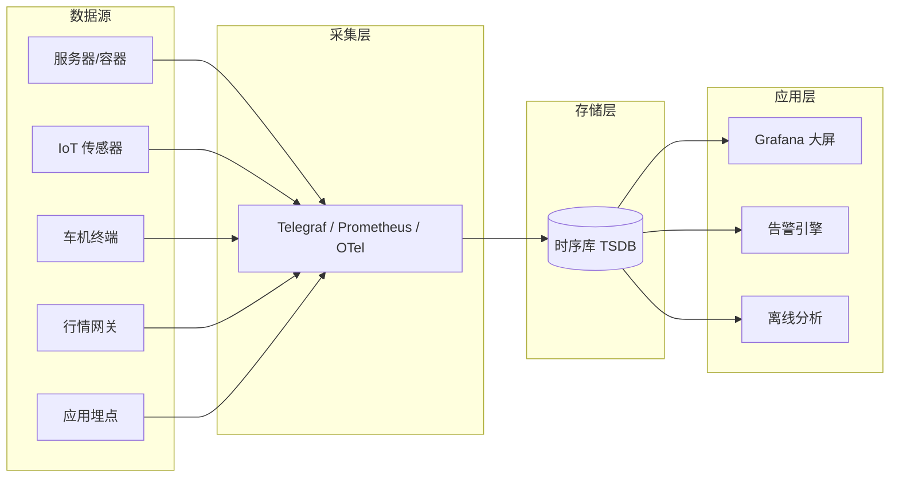
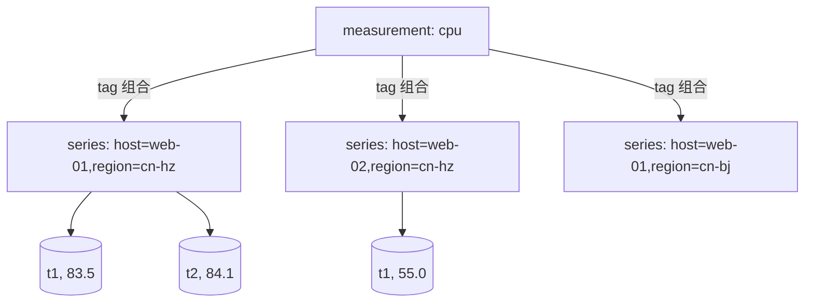
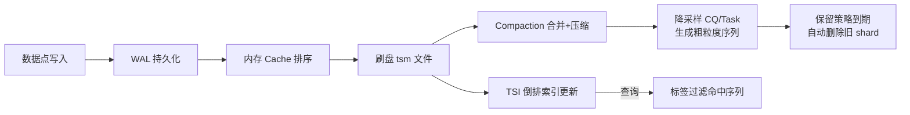

# 时序库（TSDB）板块

> 本板块聚焦时间序列数据库（Time Series Database, TSDB）的原理、选型与实战。
> 子文档：[InfluxDB 详解](./InfluxDB.md)

---

## 1. 什么是时序数据

**时序数据（Time Series Data）** 是指按时间顺序产生、每个数据点都带有时间戳（timestamp）的数据集合。它记录的是某个被观测对象在一系列时间点的状态或度量值。

一条最朴素的时序数据可表示为三元组：

```text
<指标名(measurement), 时间戳(timestamp), 数值(value)>
```

在真实场景中，为了支持多维检索，还会带上若干「标签（tag）」：

```text
<measurement=cpu, host=web-01, region=cn-hangzhou, t=2026-07-28T10:00:00Z, value=83.5>
```

### 1.1 时序数据的六大特征

| 特征 | 说明 | 对存储/查询的影响 |
|------|------|------------------|
| **写多读少** | 数据持续高频写入，读取多为聚合后的区间查询，而非单点 | 优化写入吞吐优先于事务一致性 |
| **按时间递增** | 时间戳天然单调递增，极少更新历史点 | 可顺序追加写，用 LSM / 列式追加 |
| **高吞吐写入** | 监控、IoT 每秒可能产生百万级数据点 | 需要批量、缓冲、WAL |
| **天然冷热** | 越新的数据访问越频繁，越旧越冷 | 分层存储、降采样、保留策略 |
| **维度标签多** | 同一指标有 host、region、app 等多维标签 | 需要倒排索引支撑标签检索 |
| **不可变性** | 历史点一旦写入几乎不更新 | 可用仅追加（append-only）结构，压缩友好 |

> 补充：时序数据往往具有**强局部性**（同一序列相邻点的时间戳、数值变化很小），这一特性是高压缩算法（Delta、XOR 等）能够生效的前提。

### 1.2 典型场景

- **监控指标（Metrics）**：服务器 CPU、内存、磁盘、网络；Kubernetes Pod 指标；通过 Prometheus / Grafana 体系采集。
- **IoT / 工业物联网**：传感器温度、湿度、压力、振动；设备心跳。
- **车联网（TSP）**：车辆位置、速度、电量、CAN 总线信号。
- **金融行情（Tick）**：股票/期货逐笔成交、盘口快照、K 线。
- **APM（应用性能监控）**：Trace、Span 时延、QPS、错误率。
- **能源/电力**：智能电表读数、光伏发电功率。



---

## 2. 时序库核心概念

不同 TSDB 的术语略有差异，但内核一致。以 InfluxDB 为例：

| 概念 | 别名（其他库） | 含义 | 是否索引 |
|------|----------------|------|----------|
| **measurement** | metric / table | 指标名，一类数据的逻辑集合 | 否（类似表名） |
| **tag / label** | dimension / label | 维度，字符串键值对，用于过滤、分组 | **是（可索引）** |
| **field / value** | value | 实际数值，可多个，支持 float/int/bool/string | **否（不索引）** |
| **timestamp** | time | 数据点时间，纳秒级 | 是（按时间分区） |

### 2.1 tag（标签）与 field（字段）的区别（核心）

这是理解 TSDB 的第一原则：

- **tag** 是有**有限取值、需要被 WHERE 过滤和 GROUP BY 分组**的维度。例如 `host=web-01`、`region=cn-hz`。它们被写入**倒排索引**，支持高效检索，但取值基数（cardinality）过大会拖垮索引。
- **field** 是**不断变化、需要被聚合（sum/mean/max）**的数值。例如 `cpu_usage=83.5`、`mem_used=1024`。它们**不进索引**，只存原始值，查询时按需计算。

> ⚠️ 经典反模式：把 `request_id`、`user_id` 这类**高基数字符串**设为 tag —— 会导致「tag cardinality 爆炸」，内存与索引急剧膨胀。它们应作为 field 或干脆不存。

### 2.2 点（Point）与序列（Series）

- **Point（数据点）**：一条 `measurement + tag set + field set + timestamp` 的完整记录。
- **Series（时间序列）**：由 `measurement + 全部 tag 的取值组合` 唯一确定的数据流。例如 `cpu,host=web-01,region=cn-hz` 是一个 series，`cpu,host=web-02,region=cn-hz` 是另一个 series。



> 一个库的「序列数量」≈ measurement 数 × 各 tag 取值笛卡尔积。**序列基数（series cardinality）** 是 TSDB 最重要的容量指标，远高于「数据点总数」。

---

## 3. 数据模型演进对比

| 维度 | 关系表（行存，如 MySQL） | 列式存储（如 Parquet/ClickHouse） | 时序专有模型（如 InfluxDB/TDengine） |
|------|--------------------------|-----------------------------------|--------------------------------------|
| 写入方式 | 随机写 + 行级更新 | 批量追加写 | 批量、仅追加、分区 |
| 主键/索引 | B+Tree 主键 + 二级索引 | 稀疏索引 + 跳数索引 | 时间分区 + 标签倒排索引 |
| 时间戳处理 | 普通列 | 普通列 | 一等公民，强制有序 |
| 压缩 | 一般（行内压缩弱） | 好（同列同质高压缩） | **极好**（Delta/XOR 针对时序） |
| 冷热分层 | 弱 | 中 | 强（RP + downsampling） |
| 典型查询 | 点查、JOIN、事务 | 大宽表聚合 | 按时间区间 + 标签过滤 + 降采样 |
| 事务一致性 | 强（ACID） | 弱/最终 | 弱（通常不更新历史） |
| 适用负载 | OLTP | OLAP 大宽表 | 高吞吐指标写入 + 区间聚合 |

**结论**：关系库适合「需要更新、需要 JOIN、少量写入」；列式库适合「离线分析大宽表」；时序专有模型专为「恒定高写入 + 时间区间聚合 + 标签过滤」而生。

---

## 4. 关键技术

### 4.1 LSM / 列式存储

- **LSM-Tree（Log-Structured Merge-Tree）**：写入先落 WAL，再进内存 MemTable，达到阈值后刷成有序的不可变文件（SSTable/tsm），后台做 compaction 合并。优点是写入吞吐极高，缺点是读放大（需合并多层）。InfluxDB 的 TSM、Cassandra、RocksDB 均属此类。
- **列式存储**：同一列的数据连续存放，类型相同，压缩率远高于行存。时序数据每个 field 本身就是一列，天然适合列式。

### 4.2 倒排索引（标签检索）

为支持 `WHERE region='cn-hz'`，TSDB 为每个 tag value 维护一个「序列 ID 列表」，查询时直接求交集，不必扫全表。InfluxDB 的 **TSI（Time Series Index）** 即是磁盘化的倒排索引。

### 4.3 时间分区（Shard / Partition）

数据按时间切成 shard（如按天/按周）。新数据只写最新 shard，旧 shard 可被压缩、降采样、过期。查询只命中相关 shard，避免全量扫描。

### 4.4 降采样（Downsampling）

原始数据精度高、体量大。随数据变冷，按时间窗口聚合成更粗粒度：

```
1s 原始 → 1m 均值 → 1h 均值 → 1d 均值
```

降采样既节省空间，又加速长期查询。在 InfluxDB 中由 CQ（连续查询）/ Task 实现，在 Prometheus 中由 recording rule + downsample 实现。

### 4.5 保留策略（Retention Policy）

定义数据存活时长，到期后自动删除（drop shard）。典型配置：`raw 7d, 1m 90d, 1h 1y`。

### 4.6 高压缩算法

| 算法 | 针对 | 思想 |
|------|------|------|
| **Delta-of-Delta** | 时间戳 | 先算相邻时间差，再算差的差，多为 0 → 用变长编码（如 Simple8b） |
| **XOR / Gorilla** | 浮点值 | 与前一个点 XOR，存变化的比特位与偏移，FB 的 Gorilla 论文实现 1.37 bytes/点 |
| **RLE（游程编码）** | 重复值 | 连续相同值记为 `(值, 次数)` |
| **字典编码** | tag 字符串 | 高频字符串映射为短整数 ID |



---

## 5. 主流时序库全景与选型

| 产品 | 数据模型 | 实现语言 | 集群/分布式 | 压缩 | 典型适用场景 |
|------|----------|----------|-------------|------|--------------|
| **InfluxDB** | measurement/tag/field | Go | OSS 单机；Enterprise/IOx 集群 | 强（TSM + Gorilla） | 监控、IoT 指标，生态成熟 |
| **TimescaleDB** | 关系表 + 超表（hypertable） | C（PG 扩展） | 基于 PostgreSQL 流复制/Patroni | 中（PG 原生+压缩列） | 既需要时序又需要 SQL/JOIN 的团队 |
| **TDengine** | 一张表一个设备（一张超级表） | C | 原生分布式 | 极强（自研） | 国产 IoT、车联网、海量设备 |
| **Lindorm（阿里云）** | 宽表 + 时序引擎 | Java/C++ | 云原生全托管 | 强 | 阿里云上的云原生监控/IoT |
| **VictoriaMetrics** | 类 Prometheus（label） | Go | 单节点 + 集群版 | 极强（比 Prom 省空间） | Prometheus 高性能替代、大流量 |
| **Prometheus** | metric + label | Go | 单机为主（联邦/远程写扩展） | 中（chunks） | 云原生监控事实标准，短保留 |
| **OpenTSDB** | metric + tags | Java | 依赖 HBase | 中 | 已有 Hadoop/HBase 体系的老牌监控 |
| **Apache Druid** | 列式 datasource | Java | 原生分布式 | 强 | 实时 OLAP + 时序混合分析 |

### 5.1 选型速查

- 已上云原生、监控系统 → **Prometheus + VictoriaMetrics**（长期存储）或 **Thanos**。
- 纯指标监控、要开箱即用 → **InfluxDB**。
- 既想写 SQL 又想存时序、有 PG 技术栈 → **TimescaleDB**。
- 设备数极多（千万级）、国产化诉求 → **TDengine**。
- 已在阿里云、要全托管 → **Lindorm TSDB**。
- 实时多维分析与时序混合 → **Druid / ClickHouse（时序表引擎）**。

---

## 6. 何时用 TSDB，何时用关系型 / NoSQL

| 判断维度 | 选 TSDB | 选关系型（MySQL/PG） | 选 NoSQL（Mongo/HBase） |
|----------|---------|----------------------|--------------------------|
| 数据形态 | 指标/事件流，带时间戳、维度标签 | 业务实体，需更新、JOIN | 半结构化文档 / 宽行 |
| 读写比 | 写 >> 读 | 读写均衡 | 读写均衡 |
| 是否需要更新历史 | 几乎不更新 | 频繁 UPDATE | 偶尔更新 |
| 查询模式 | 时间区间 + 标签过滤 + 聚合 | 事务、点查、复杂关联 | 按 key 查、文档检索 |
| 是否需要 ACID | 不需要 | 需要 | 弱一致可接受 |
| 数据规模 | 百万~百亿点/天 | 千万~亿级行 | 亿~百亿级 |
| 典型例子 | CPU 监控、电表读数 | 订单、账户 | 用户画像、日志 |

**一句话决策**：

> 如果你的问题长这样——「某个维度组合在一段时间内的指标如何变化 / 聚合」——就用 TSDB；如果长这样——「这笔订单的状态要改、要和另一张表关联」——就用关系型；如果是「按 ID 存取、结构多变」，才考虑 NoSQL。

---

## 7. 本板块导航

- [InfluxDB 详解](./InfluxDB.md) —— 数据模型、写入、查询（InfluxQL/Flux）、TSM 存储引擎、保留策略、集群、与 Prometheus 对接、踩坑与实战。
