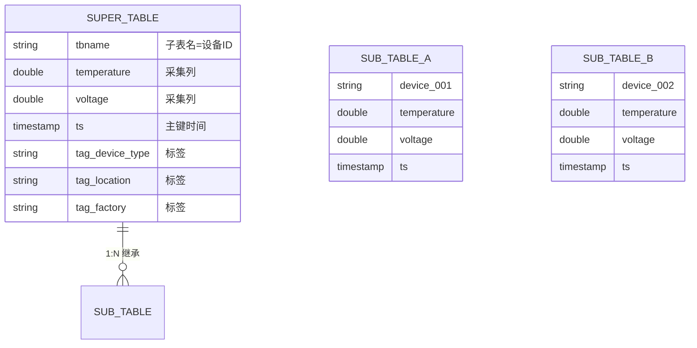
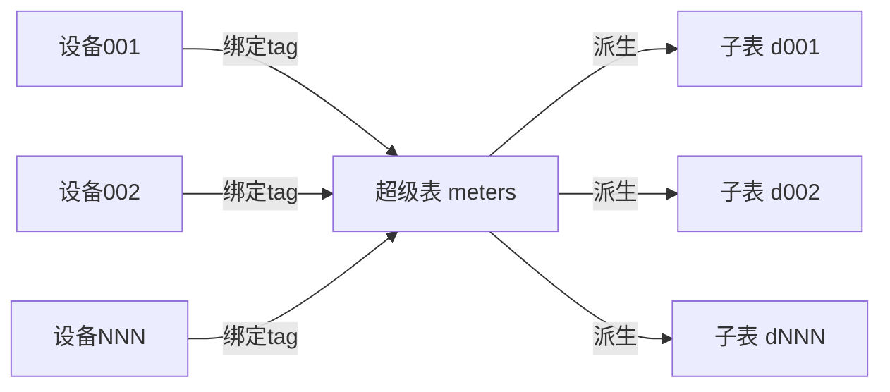
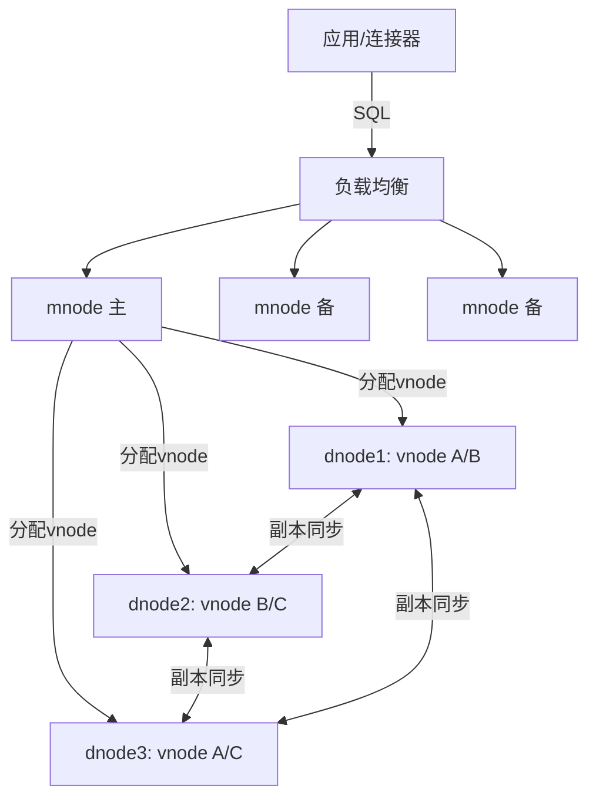

# TDengine 时序数据库

> 涛思数据（TaosData）自研的高性能国产时序数据库，主打 IoT / 工业互联网 / 车联网等海量设备指标的采集、存储与分析。

---

## 1. 定位与适用场景

TDengine 是**国产自研**的时序数据库（Time-Series Database），核心设计目标是在**写多读少、设备数量巨大、单设备数据按时间追加**的场景下，用远低于通用数据库的硬件成本实现十倍甚至百倍的吞吐。

| 维度 | 说明 |
| --- | --- |
| 开发方 | 涛思数据 TaosData，创始人陶建辉 |
| 开源协议 | AGPL-3.0（社区版）；企业版闭源增强 |
| 语言 | 核心 C 语言实现，性能与内存可控 |
| 典型场景 | 物联网、工业互联网、车联网、电力、能源、运维监控 |
| 数据特征 | 设备多（千万级）、每个设备按时间戳持续产生指标、极少更新删除 |
| 核心卖点 | 超级表模型、列式存储、十倍压缩、一写多读、SQL 兼容 |

与通用关系型数据库相比，TDengine 针对「一个设备一条时间线」的建模做了深度优化；与传统 NoSQL 时序库相比，它提供**标准 SQL 接口**，降低学习与集成门槛。

---

## 2. 数据模型特色：超级表 + 子表

### 2.1 核心概念

TDengine 最显著的模型创新是**超级表（Super Table / STABLE）+ 子表（Sub Table）**。

- **超级表**：定义数据的「结构模板」，包含采集量（列，动态变化的数据，如温度、电压）和**标签（tag，静态或缓慢变化的元数据，如设备型号、厂商、地区、所属车间）**。
- **子表**：每张子表对应**一个具体设备/采集点**。子表在创建时继承自某个超级表的结构，并绑定一组 tag 取值。一张设备一张子表是 TDengine 的推荐建模方式。
- **标签（tag）**：不参与高频写入，仅用于多维检索与分组。例如 `location='北京'`、`device_type='sensor-A'`。

### 2.2 与关系表的本质区别

| 对比项 | 关系表 | TDengine 超级表/子表 |
| --- | --- | --- |
| 建模视角 | 一张表存一类实体 | 一个超级表管一类设备，一个子表对应一台设备 |
| 元数据 | 每行列都冗余存储 | tag 只存一次，在超级表层面统一管理 |
| 物理分布 | 一张表一个文件段 | 每张子表映射到 vnode，按设备分片 |
| 多维过滤 | WHERE 条件扫全表 | 先按 tag 过滤定位子表，再扫时间范围 |
| 写入路径 | 随机写 | 单设备时间线顺序追加写 |

### 2.3 数据模型图（Mermaid）





---

## 3. 写入与查询（SQL 扩展示例）

TDengine 兼容标准 SQL，并加入时序扩展（时间聚合窗口、降采样等）。

### 3.1 创建超级表与子表

```sql
-- 创建超级表：采集量用普通列，元数据用 tag
CREATE STABLE IF NOT EXISTS meters (
    ts TIMESTAMP,
    current FLOAT,
    voltage INT,
    phase FLOAT
) TAGS (
    location BINARY(64),
    group_id INT
);

-- 为一台设备创建子表，并指定 tag 值
CREATE TABLE IF NOT EXISTS d1001 USING meters TAGS ('北京', 1);
CREATE TABLE IF NOT EXISTS d1002 USING meters TAGS ('上海', 2);

-- 也可写入时自动建子表（auto create table）
INSERT INTO d1003 USING meters TAGS ('广州', 3) VALUES ('2026-07-28 10:00:00', 10.2, 220, 0.3);
```

### 3.2 写入数据（一张设备一张子表，顺序追加）

```sql
INSERT INTO d1001 VALUES
  ('2026-07-28 10:00:00', 10.2, 220, 0.31),
  ('2026-07-28 10:00:10', 10.5, 221, 0.30),
  ('2026-07-28 10:00:20', 10.1, 219, 0.32);

INSERT INTO d1002 VALUES
  ('2026-07-28 10:00:00', 12.4, 223, 0.28),
  ('2026-07-28 10:00:10', 12.1, 222, 0.29);
```

### 3.3 按时间聚合（降采样 / 窗口查询）

```sql
-- 对某设备按 10 秒窗口求平均电流
SELECT _WSTART, AVG(current)
FROM d1001
INTERVAL(10s)
FILL(PREV);

-- 跨子表按 tag 聚合：统计每个 group 的平均电压
SELECT group_id, AVG(voltage)
FROM meters
WHERE ts >= NOW - 1h
INTERVAL(1m);

-- 按 location 标签分组求最大值
SELECT location, MAX(voltage)
FROM meters
WHERE location IN ('北京', '上海')
GROUP BY location;
```

> 要点：`INTERVAL` 是 TDengine 的时间窗口函数，`FILL` 指定空窗口填充策略（PREV / NULL / VALUE），这是时序降采样的核心语法。

---

## 4. 存储引擎

TDengine 的存储设计围绕「**单设备时间线顺序写、列式压缩、按时间分片**」展开。

### 4.1 文件分类

| 文件类型 | 作用 |
| --- | --- |
| 数据文件（.data） | 采集量按列分块存储（列式块），高压缩 |
| 标签文件（.head / tag） | 存储每张子表的 tag 值，构建 tag 索引 |
| 元数据文件 | 超级表/子表结构、vnode 信息 |
| WAL（预写日志） | 写入先落盘 WAL，保证崩溃可恢复 |

### 4.2 列式块存储

同一子表同一时间段的某一列（如 `current`）被连续存储为一个**数据块（block）**，块内采用列式编码（delta、RLE、压缩算法）。优点：

- 单设备查询只读取相关列，I/O 最小；
- 列内同质数据压缩比极高（官方称可达 1/10 磁盘占用）。

### 4.3 按时间分片（vnode）

- 数据在逻辑上按**时间**切分为多个**数据文件段（file set）**，每段覆盖一个时间范围。
- 数据库由多个 **vnode（虚拟数据节点）** 组成，每张子表被哈希映射到某个 vnode。vnode 是复制、负载均衡、恢复的基本单位。

### 4.4 一写多读

- 单 vnode 内采用**单写者（single-writer）**模型，写入顺序追加，避免随机写与锁竞争。
- 查询读取可以是多读（读不影响写），配合副本实现读写分离；在集群中通过多副本做到「一写多读」的高吞吐。

---

## 5. 集群架构

### 5.1 角色划分

| 角色 | 职责 |
| --- | --- |
| mnode（管理节点） | 管理集群元数据、负载均衡、vnode 分配、高可用选主（通常 3 副本） |
| vnode（数据节点） | 实际存储数据分片，处理写入与查询 |
| dnode（物理节点） | 一台物理/虚拟服务器进程，可承载多个 vnode/mnode |

### 5.2 集群架构图（Mermaid）



### 5.3 高可用与负载均衡

- **mnode 高可用**：多个 mnode 组成 Raft 类选主，元数据强一致。
- **vnode 副本**：每个 vnode 可配 1~3 副本，主副本接受写入并同步到从副本。
- **负载均衡**：新增 dnode 后，mnode 可将 vnode 在节点间迁移，实现容量再平衡。

### 5.4 企业版 vs 社区版

| 能力 | 社区版 | 企业版 |
| --- | --- | --- |
| 集群管理 | 支持（基础） | 完整高可用、平滑扩缩容 |
| 数据订阅（Topic） | 有限 | 完整 |
| 流式计算 | 基础 | 增强 |
| 安全/审计/加密 | 无 | 支持 |
| 技术支持 | 社区 | 商业 SLA |
| 可视化运维平台 | 无 | TDengine Enterprise / Explorer |

---

## 6. 生态与集成

TDengine 提供多层接入能力，便于融入大数据与流处理体系。

| 组件 | 说明 |
| --- | --- |
| taosAdapter | 提供 REST / WebSocket 接口，兼容 InfluxDB 行协议，便于旧系统迁移 |
| JDBC / 各语言连接器 | Java、Go、Python、C/C++、Rust、Node.js 等 |
| Kafka | 通过 connector 或 taosAdapter 从 Kafka 消费写入 |
| Spark / Flink | 通过 JDBC 或自定义 source/sink 做批流计算 |
| Grafana | 官方插件，直接展示 TDengine 数据 |
| 告警 | 配合 TDengine 的连续查询/订阅实现阈值告警 |

### 6.1 REST / WebSocket 示例

```bash
# 通过 taosAdapter 的 REST 接口执行 SQL
curl -H "Authorization: Basic $(echo -n root:taosdata | base64)" \
  -d "select count(*) from meters" \
  http://localhost:6041/rest/sql
```

### 6.2 InfluxDB 行协议写入（兼容）

```bash
# taosAdapter 监听 6041，兼容 InfluxDB line protocol
curl -i -XPOST "http://localhost:6041/influxdb/v1/write?db=test" \
  --data-binary 'meters,location=北京,group_id=1 current=10.2,voltage=220,phase=0.31 1467106610000000000'
```

---

## 7. 与 InfluxDB / TimescaleDB 对比

| 维度 | TDengine | InfluxDB | TimescaleDB |
| --- | --- | --- | --- |
| 数据模型 | 超级表+子表(tag) | measurement+tag+field | 关系表+超表(hypertable) |
| 查询语言 | SQL 扩展 | InfluxQL / Flux | 标准 SQL（PG 插件） |
| 存储引擎 | 自研列式+C | 自研 TSM | 基于 PostgreSQL |
| 压缩比 | 极高（约 1/10） | 高 | 中（依赖 PG 压缩） |
| 集群 | 原生（mnode+vnode） | 2.x 企业集群 / 3.x 开源集群 | 原生（PG 生态+扩展） |
| 写入性能 | 极高（单写者模型） | 高 | 中（受 PG 限制） |
| 部署复杂度 | 中 | 低（单机简单） | 中（依赖 PG） |
| 国产/自主可控 | 是 | 否 | 否 |
| 典型场景 | 海量设备 IoT | 监控/DevOps | 既要时序又要关系查询 |

---

## 8. 生产实践与踩坑

### 8.1 超级表设计

- **按设备类型维度建超级表**，不要所有设备塞进一张超级表。例如 `meters`、`cars`、`sensors_env` 分别建表，tag 集合不同，避免列稀疏。
- **tag 数量适中**：tag 会影响标签索引体积与查询计划，建议单超级表 tag 数 < 10~16 个。

### 8.2 tag 基数（cardinality）

- tag 组合基数过高（如把设备 ID 当 tag）会让标签索引膨胀，查询变慢。正确做法是**设备 ID 作为子表名（tbname），tag 只放低基数的分组维度**（location、type、factory）。
- 反例：`TAGS(device_id)` 且 device_id 有千万取值 → 标签索引灾难。应 `CREATE TABLE device_xxxx USING meters TAGS(...)`。

### 8.3 vnode 规划

- vnode 数量决定并行度与分片粒度。一般建议单 dnode 上 vnode 数 ≈  CPU 核数的 1~2 倍，但单 vnode 不能太小（太小元数据开销大）也不能太大（迁移/恢复慢）。
- 经验值：单库总 vnode 控制在数百级别；单 vnode 数据量在几十 GB 量级较健康。

### 8.4 乱序写入（out-of-order）

- TDengine 假设单设备数据**基本按时间递增**。大量乱序（旧时间戳数据迟到）会导致：
  - 写放大（需要回写到已封闭的 block）；
  - 压缩率下降；
  - 查询需要合并更多文件段。
- 应对：在采集端做时间排序/缓冲；设置合理的 `maxrows`/`minrows` 与落盘策略；对迟到数据容忍窗口做评估，必要时用独立归档表。

### 8.5 其他注意点

- **WAL 与磁盘**：WAL 建议放高性能盘（SSD），数据文件可分层到容量盘。
- **保留策略**：使用 `KEEP` 参数控制数据生命周期，过期数据自动删除，避免磁盘无限增长。
- **副本一致性**：写入强一致会带来延迟，对延迟敏感场景可评估异步副本影响。
- **监控自身**：关注 vnode 分布均衡度、WAL 堆积、慢查询（全表扫子表）等运维指标。

---

## 9. 小结

TDengine 凭借**超级表模型 + 列式时序存储 + 单写者追加 + 原生集群**，在海量设备指标场景下做到了极高的写入吞吐与压缩比，且提供 SQL 接口降低门槛，是国产时序库的代表。其建模精髓在于「**一设备一子表、tag 做维度、时间做主键**」，把握这一点即可避开绝大多数性能坑。

---

## 10. 运维实战与性能调优

### 10.1 vnode 规划

vnode 是 TDengine 复制、均衡、恢复的基本单位，规划直接影响并行度与恢复时间。

```bash
# 建库时指定 vnode 数与副本数（按节点规模）
taos> CREATE DATABASE iot KEEP 365 DAYS 10 BLOCKS 6 VGROUPS 32 REPLICA 3;

# 查看 vnode 分布，确认均衡
taos> SHOW VGROUPS;
taos> SELECT * FROM information_schema.ins_vnodes;
```

经验：
- 单 dnode 上 vnode 数 ≈ CPU 核数 1~2 倍，但不宜过多（元数据开销）。
- 单 vnode 数据量几十 GB 量级较健康；过小迁移/恢复频繁，过大恢复慢。
- 总 vnode 数控制在数百级；扩 dnode 后由 mnode 自动 rebalance。

### 10.2 超级表设计反模式

| 反模式 | 后果 | 正确做法 |
|--------|------|----------|
| 所有设备塞一张超级表 | 列稀疏、tag 过多 | 按设备类型分多张 STABLE |
| `TAGS(device_id)` 且千万取值 | 标签索引灾难 | device_id 作子表名 tbname |
| 高频变化量放 tag | tag 不压缩、写放大 | 只把静态/慢变元数据放 tag |
| tag 数 > 16 | 索引体积大 | 单 STABLE tag < 10~16 个 |

```sql
-- 正确：按设备类型建超级表，device_id 作为子表名
CREATE STABLE IF NOT EXISTS meters (ts TIMESTAMP, current FLOAT, voltage INT)
  TAGS (location BINARY(64), group_id INT);
CREATE TABLE d1001 USING meters TAGS ('北京', 1);
```

### 10.3 乱序与补数

TDengine 假设单设备时间递增。迟到数据（补数）处理：

```sql
-- 补数：直接 INSERT 历史时间戳数据（会触发回写已封闭 block）
INSERT INTO d1001 VALUES ('2026-07-20 10:00:00', 9.8, 218, 0.30);

-- 大批量补数建议：独立归档子表 + 离线导入，避免冲击在线写入
```

应对策略：
- 采集端做时间排序/缓冲，尽量顺序写。
- 评估乱序容忍窗口；超窗口的迟到数据走独立补数流程。
- 频繁补数会降压缩率，必要时对补数表单独配置更宽松的落盘策略。

### 10.4 企业版特性

| 能力 | 社区版 | 企业版 |
|------|--------|--------|
| 集群扩缩容 | 基础 | 平滑、可视化平台 |
| 数据订阅（Topic） | 有限 | 完整，可做 CDC |
| 流式计算 | 基础 | 增强窗口/聚合 |
| 安全审计/加密/TDE | 无 | 支持 |
| 可视化运维（Explorer） | 无 | 提供 |

企业版数据订阅可与 Kafka / Flink 打通，做实时下游分发。

### 10.5 与 Kafka / Flink 集成实战

```bash
# Kafka → TDengine：用 taosAdapter 的 InfluxDB 兼容接口承接（迁移成本低）
curl -i -XPOST "http://tdengine:6041/influxdb/v1/write?db=iot" \
  --data-binary 'meters,location=北京,group_id=1 current=10.2,voltage=220 1467106610000000000'
```

```sql
-- Flink SQL sink 到 TDengine（通过 JDBC）
CREATE TABLE td_sink (
  tbname STRING,
  ts TIMESTAMP(3),
  current DOUBLE,
  voltage INT
) WITH (
  'connector' = 'jdbc',
  'url' = 'jdbc:TAOS-RS://tdengine:6041/iot',
  'table-name' = 'meters',
  'sink.parallelism' = '4'
);
```

集成要点：
- 用 taosAdapter 的 InfluxDB 兼容接口承接 Kafka Connect，迁移成本低。
- Flink 聚合结果写超级表聚合子表，明细写设备子表，分层清晰。
- 企业版 Topic 订阅可做「写入即分发」的实时管道，替代部分 ETL。

### 10.6 故障排查 checklist

- [ ] 写入慢 → 查 WAL 堆积、vnode 分布是否倾斜、磁盘 IO。
- [ ] 压缩比低 → 查乱序程度、是否高基数列误放 tag。
- [ ] 查询慢 → 是否全表扫子表（缺 tag 过滤）、是否跨大时间范围。
- [ ] 副本不同步 → 查 dnode 存活、网络分区、mnode 选主。
- [ ] 磁盘涨 → 查 `KEEP` 保留策略、过期数据是否清理。
