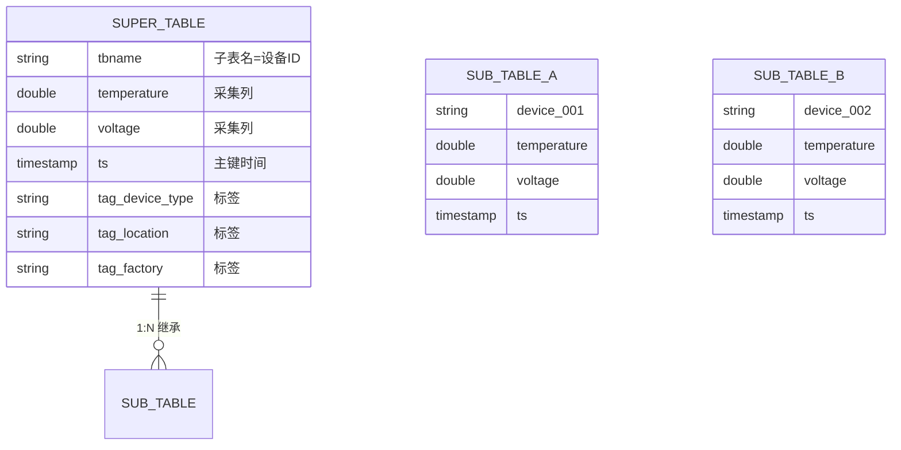
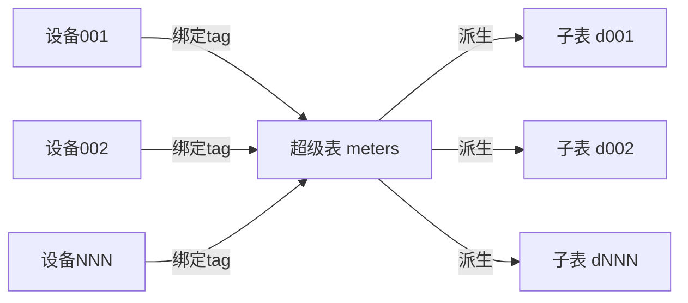
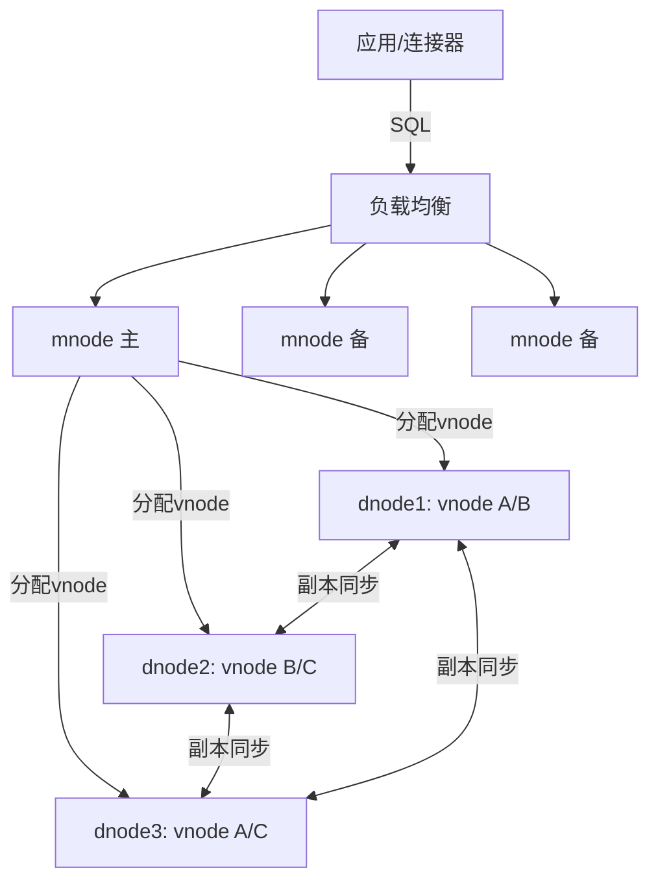
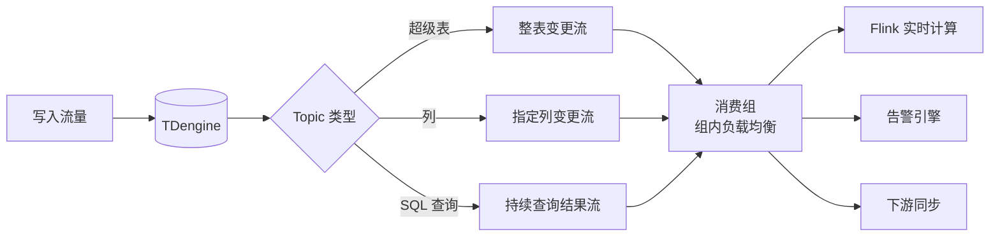
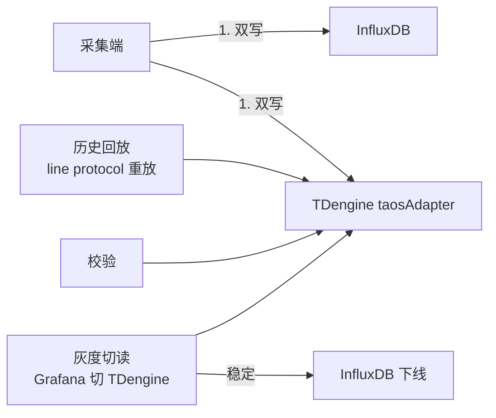
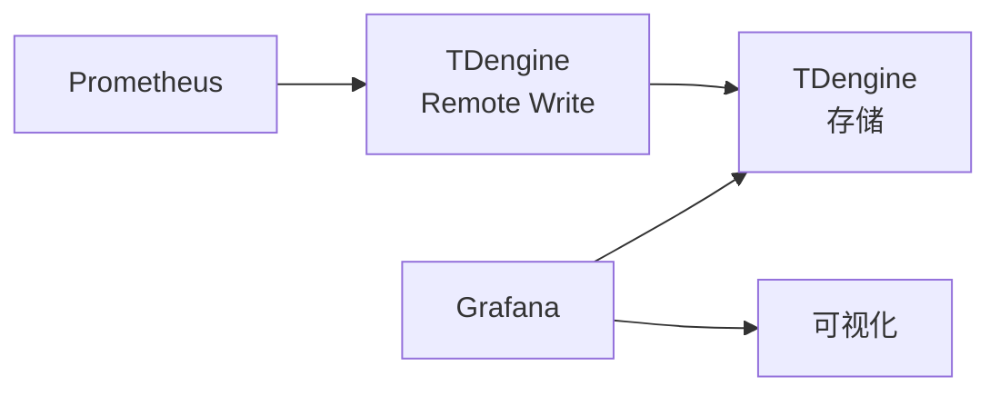
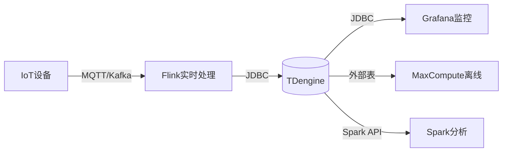
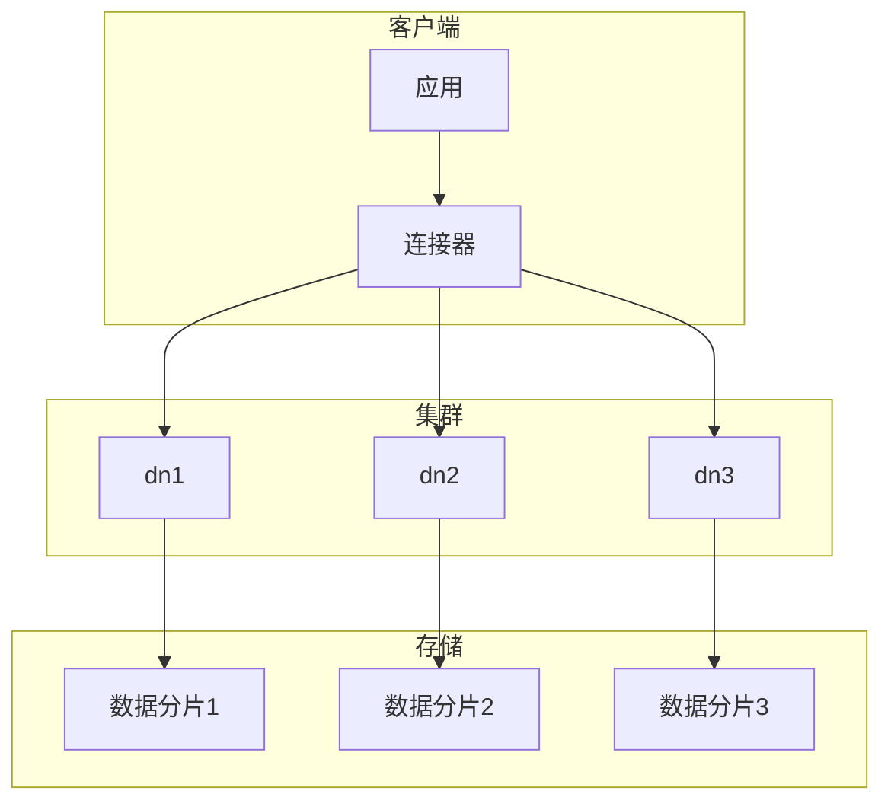
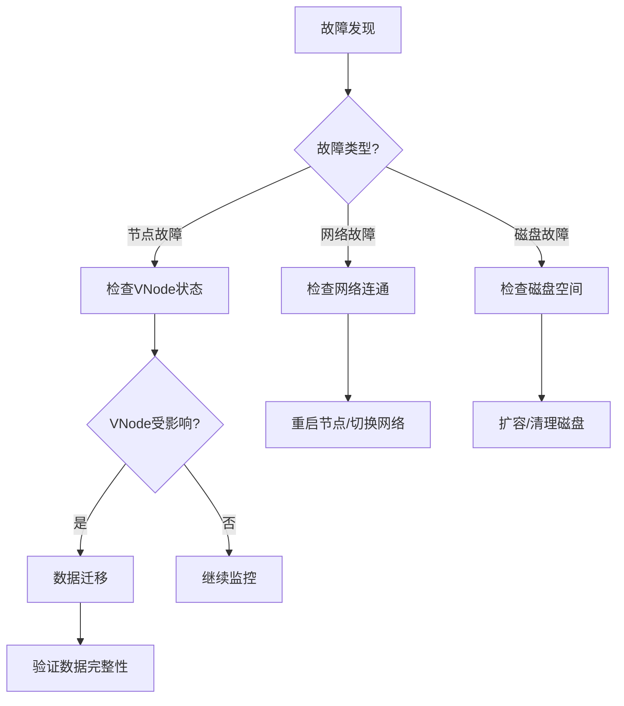

# TDengine 时序数据库

> 涛思数据（TaosData）自研的高性能国产时序数据库，主打 IoT / 工业互联网 / 车联网等海量设备指标的采集、存储与分析。

---

## 1. 定位与适用场景

TDengine 是**国产自研**的时序数据库（Time-Series Database），核心设计目标是在**写多读少、设备数量巨大、单设备数据按时间追加**的场景下，用远低于通用数据库的硬件成本实现十倍甚至百倍的吞吐。

| 维度 | 说明 |
| --- | --- |
| 开发方 | 涛思数据 TaosData，创始人陶建辉 |
| 开源协议 | AGPL-3.0（社区版）；企业版闭源增强 |
| 语言 | 核心 C 语言实现，性能与内存可控 |
| 典型场景 | 物联网、工业互联网、车联网、电力、能源、运维监控 |
| 数据特征 | 设备多（千万级）、每个设备按时间戳持续产生指标、极少更新删除 |
| 核心卖点 | 超级表模型、列式存储、十倍压缩、一写多读、SQL 兼容 |

与通用关系型数据库相比，TDengine 针对「一个设备一条时间线」的建模做了深度优化；与传统 NoSQL 时序库相比，它提供**标准 SQL 接口**，降低学习与集成门槛。

---

## 2. 数据模型特色：超级表 + 子表

### 2.1 核心概念

TDengine 最显著的模型创新是**超级表（Super Table / STABLE）+ 子表（Sub Table）**。

- **超级表**：定义数据的「结构模板」，包含采集量（列，动态变化的数据，如温度、电压）和**标签（tag，静态或缓慢变化的元数据，如设备型号、厂商、地区、所属车间）**。
- **子表**：每张子表对应**一个具体设备/采集点**。子表在创建时继承自某个超级表的结构，并绑定一组 tag 取值。一张设备一张子表是 TDengine 的推荐建模方式。
- **标签（tag）**：不参与高频写入，仅用于多维检索与分组。例如 `location='北京'`、`device_type='sensor-A'`。

### 2.2 与关系表的本质区别

| 对比项 | 关系表 | TDengine 超级表/子表 |
| --- | --- | --- |
| 建模视角 | 一张表存一类实体 | 一个超级表管一类设备，一个子表对应一台设备 |
| 元数据 | 每行列都冗余存储 | tag 只存一次，在超级表层面统一管理 |
| 物理分布 | 一张表一个文件段 | 每张子表映射到 vnode，按设备分片 |
| 多维过滤 | WHERE 条件扫全表 | 先按 tag 过滤定位子表，再扫时间范围 |
| 写入路径 | 随机写 | 单设备时间线顺序追加写 |

### 2.3 数据模型图（Mermaid）





---

## 3. 写入与查询（SQL 扩展示例）

TDengine 兼容标准 SQL，并加入时序扩展（时间聚合窗口、降采样等）。

### 3.1 创建超级表与子表

```sql
-- 创建超级表：采集量用普通列，元数据用 tag
CREATE STABLE IF NOT EXISTS meters (
    ts TIMESTAMP,
    current FLOAT,
    voltage INT,
    phase FLOAT
) TAGS (
    location BINARY(64),
    group_id INT
);

-- 为一台设备创建子表，并指定 tag 值
CREATE TABLE IF NOT EXISTS d1001 USING meters TAGS ('北京', 1);
CREATE TABLE IF NOT EXISTS d1002 USING meters TAGS ('上海', 2);

-- 也可写入时自动建子表（auto create table）
INSERT INTO d1003 USING meters TAGS ('广州', 3) VALUES ('2026-07-28 10:00:00', 10.2, 220, 0.3);
```

### 3.2 写入数据（一张设备一张子表，顺序追加）

```sql
INSERT INTO d1001 VALUES
  ('2026-07-28 10:00:00', 10.2, 220, 0.31),
  ('2026-07-28 10:00:10', 10.5, 221, 0.30),
  ('2026-07-28 10:00:20', 10.1, 219, 0.32);

INSERT INTO d1002 VALUES
  ('2026-07-28 10:00:00', 12.4, 223, 0.28),
  ('2026-07-28 10:00:10', 12.1, 222, 0.29);
```

### 3.3 按时间聚合（降采样 / 窗口查询）

```sql
-- 对某设备按 10 秒窗口求平均电流
SELECT _WSTART, AVG(current)
FROM d1001
INTERVAL(10s)
FILL(PREV);

-- 跨子表按 tag 聚合：统计每个 group 的平均电压
SELECT group_id, AVG(voltage)
FROM meters
WHERE ts >= NOW - 1h
INTERVAL(1m);

-- 按 location 标签分组求最大值
SELECT location, MAX(voltage)
FROM meters
WHERE location IN ('北京', '上海')
GROUP BY location;
```

> 要点：`INTERVAL` 是 TDengine 的时间窗口函数，`FILL` 指定空窗口填充策略（PREV / NULL / VALUE），这是时序降采样的核心语法。

---

## 4. 存储引擎

TDengine 的存储设计围绕「**单设备时间线顺序写、列式压缩、按时间分片**」展开。

### 4.1 文件分类

| 文件类型 | 作用 |
| --- | --- |
| 数据文件（.data） | 采集量按列分块存储（列式块），高压缩 |
| 标签文件（.head / tag） | 存储每张子表的 tag 值，构建 tag 索引 |
| 元数据文件 | 超级表/子表结构、vnode 信息 |
| WAL（预写日志） | 写入先落盘 WAL，保证崩溃可恢复 |

### 4.2 列式块存储

同一子表同一时间段的某一列（如 `current`）被连续存储为一个**数据块（block）**，块内采用列式编码（delta、RLE、压缩算法）。优点：

- 单设备查询只读取相关列，I/O 最小；
- 列内同质数据压缩比极高（官方称可达 1/10 磁盘占用）。

### 4.3 按时间分片（vnode）

- 数据在逻辑上按**时间**切分为多个**数据文件段（file set）**，每段覆盖一个时间范围。
- 数据库由多个 **vnode（虚拟数据节点）** 组成，每张子表被哈希映射到某个 vnode。vnode 是复制、负载均衡、恢复的基本单位。

### 4.4 一写多读

- 单 vnode 内采用**单写者（single-writer）**模型，写入顺序追加，避免随机写与锁竞争。
- 查询读取可以是多读（读不影响写），配合副本实现读写分离；在集群中通过多副本做到「一写多读」的高吞吐。

---

## 5. 集群架构

### 5.1 角色划分

| 角色 | 职责 |
| --- | --- |
| mnode（管理节点） | 管理集群元数据、负载均衡、vnode 分配、高可用选主（通常 3 副本） |
| vnode（数据节点） | 实际存储数据分片，处理写入与查询 |
| dnode（物理节点） | 一台物理/虚拟服务器进程，可承载多个 vnode/mnode |

### 5.2 集群架构图（Mermaid）



### 5.3 高可用与负载均衡

- **mnode 高可用**：多个 mnode 组成 Raft 类选主，元数据强一致。
- **vnode 副本**：每个 vnode 可配 1~3 副本，主副本接受写入并同步到从副本。
- **负载均衡**：新增 dnode 后，mnode 可将 vnode 在节点间迁移，实现容量再平衡。

### 5.4 企业版 vs 社区版

| 能力 | 社区版 | 企业版 |
| --- | --- | --- |
| 集群管理 | 支持（基础） | 完整高可用、平滑扩缩容 |
| 数据订阅（Topic） | 有限 | 完整 |
| 流式计算 | 基础 | 增强 |
| 安全/审计/加密 | 无 | 支持 |
| 技术支持 | 社区 | 商业 SLA |
| 可视化运维平台 | 无 | TDengine Enterprise / Explorer |

---

## 6. 生态与集成

TDengine 提供多层接入能力，便于融入大数据与流处理体系。

| 组件 | 说明 |
| --- | --- |
| taosAdapter | 提供 REST / WebSocket 接口，兼容 InfluxDB 行协议，便于旧系统迁移 |
| JDBC / 各语言连接器 | Java、Go、Python、C/C++、Rust、Node.js 等 |
| Kafka | 通过 connector 或 taosAdapter 从 Kafka 消费写入 |
| Spark / Flink | 通过 JDBC 或自定义 source/sink 做批流计算 |
| Grafana | 官方插件，直接展示 TDengine 数据 |
| 告警 | 配合 TDengine 的连续查询/订阅实现阈值告警 |

### 6.1 REST / WebSocket 示例

```bash
# 通过 taosAdapter 的 REST 接口执行 SQL
curl -H "Authorization: Basic $(echo -n root:taosdata | base64)" \
  -d "select count(*) from meters" \
  http://localhost:6041/rest/sql
```

### 6.2 InfluxDB 行协议写入（兼容）

```bash
# taosAdapter 监听 6041，兼容 InfluxDB line protocol
curl -i -XPOST "http://localhost:6041/influxdb/v1/write?db=test" \
  --data-binary 'meters,location=北京,group_id=1 current=10.2,voltage=220,phase=0.31 1467106610000000000'
```

---

## 7. 与 InfluxDB / TimescaleDB 对比

| 维度 | TDengine | InfluxDB | TimescaleDB |
| --- | --- | --- | --- |
| 数据模型 | 超级表+子表(tag) | measurement+tag+field | 关系表+超表(hypertable) |
| 查询语言 | SQL 扩展 | InfluxQL / Flux | 标准 SQL（PG 插件） |
| 存储引擎 | 自研列式+C | 自研 TSM | 基于 PostgreSQL |
| 压缩比 | 极高（约 1/10） | 高 | 中（依赖 PG 压缩） |
| 集群 | 原生（mnode+vnode） | 2.x 企业集群 / 3.x 开源集群 | 原生（PG 生态+扩展） |
| 写入性能 | 极高（单写者模型） | 高 | 中（受 PG 限制） |
| 部署复杂度 | 中 | 低（单机简单） | 中（依赖 PG） |
| 国产/自主可控 | 是 | 否 | 否 |
| 典型场景 | 海量设备 IoT | 监控/DevOps | 既要时序又要关系查询 |

---

## 8. 生产实践与踩坑

### 8.1 超级表设计

- **按设备类型维度建超级表**，不要所有设备塞进一张超级表。例如 `meters`、`cars`、`sensors_env` 分别建表，tag 集合不同，避免列稀疏。
- **tag 数量适中**：tag 会影响标签索引体积与查询计划，建议单超级表 tag 数 < 10~16 个。

### 8.2 tag 基数（cardinality）

- tag 组合基数过高（如把设备 ID 当 tag）会让标签索引膨胀，查询变慢。正确做法是**设备 ID 作为子表名（tbname），tag 只放低基数的分组维度**（location、type、factory）。
- 反例：`TAGS(device_id)` 且 device_id 有千万取值 → 标签索引灾难。应 `CREATE TABLE device_xxxx USING meters TAGS(...)`。

### 8.3 vnode 规划

- vnode 数量决定并行度与分片粒度。一般建议单 dnode 上 vnode 数 ≈  CPU 核数的 1~2 倍，但单 vnode 不能太小（太小元数据开销大）也不能太大（迁移/恢复慢）。
- 经验值：单库总 vnode 控制在数百级别；单 vnode 数据量在几十 GB 量级较健康。

### 8.4 乱序写入（out-of-order）

- TDengine 假设单设备数据**基本按时间递增**。大量乱序（旧时间戳数据迟到）会导致：
  - 写放大（需要回写到已封闭的 block）；
  - 压缩率下降；
  - 查询需要合并更多文件段。
- 应对：在采集端做时间排序/缓冲；设置合理的 `maxrows`/`minrows` 与落盘策略；对迟到数据容忍窗口做评估，必要时用独立归档表。

### 8.5 其他注意点

- **WAL 与磁盘**：WAL 建议放高性能盘（SSD），数据文件可分层到容量盘。
- **保留策略**：使用 `KEEP` 参数控制数据生命周期，过期数据自动删除，避免磁盘无限增长。
- **副本一致性**：写入强一致会带来延迟，对延迟敏感场景可评估异步副本影响。
- **监控自身**：关注 vnode 分布均衡度、WAL 堆积、慢查询（全表扫子表）等运维指标。

---

## 9. 小结

TDengine 凭借**超级表模型 + 列式时序存储 + 单写者追加 + 原生集群**，在海量设备指标场景下做到了极高的写入吞吐与压缩比，且提供 SQL 接口降低门槛，是国产时序库的代表。其建模精髓在于「**一设备一子表、tag 做维度、时间做主键**」，把握这一点即可避开绝大多数性能坑。

---

## 10. 运维实战与性能调优

### 10.1 vnode 规划

vnode 是 TDengine 复制、均衡、恢复的基本单位，规划直接影响并行度与恢复时间。

```bash
# 建库时指定 vnode 数与副本数（按节点规模）
taos> CREATE DATABASE iot KEEP 365 DAYS 10 BLOCKS 6 VGROUPS 32 REPLICA 3;

# 查看 vnode 分布，确认均衡
taos> SHOW VGROUPS;
taos> SELECT * FROM information_schema.ins_vnodes;
```

经验：
- 单 dnode 上 vnode 数 ≈ CPU 核数 1~2 倍，但不宜过多（元数据开销）。
- 单 vnode 数据量几十 GB 量级较健康；过小迁移/恢复频繁，过大恢复慢。
- 总 vnode 数控制在数百级；扩 dnode 后由 mnode 自动 rebalance。

### 10.2 超级表设计反模式

| 反模式 | 后果 | 正确做法 |
|--------|------|----------|
| 所有设备塞一张超级表 | 列稀疏、tag 过多 | 按设备类型分多张 STABLE |
| `TAGS(device_id)` 且千万取值 | 标签索引灾难 | device_id 作子表名 tbname |
| 高频变化量放 tag | tag 不压缩、写放大 | 只把静态/慢变元数据放 tag |
| tag 数 > 16 | 索引体积大 | 单 STABLE tag < 10~16 个 |

```sql
-- 正确：按设备类型建超级表，device_id 作为子表名
CREATE STABLE IF NOT EXISTS meters (ts TIMESTAMP, current FLOAT, voltage INT)
  TAGS (location BINARY(64), group_id INT);
CREATE TABLE d1001 USING meters TAGS ('北京', 1);
```

### 10.3 乱序与补数

TDengine 假设单设备时间递增。迟到数据（补数）处理：

```sql
-- 补数：直接 INSERT 历史时间戳数据（会触发回写已封闭 block）
INSERT INTO d1001 VALUES ('2026-07-20 10:00:00', 9.8, 218, 0.30);

-- 大批量补数建议：独立归档子表 + 离线导入，避免冲击在线写入
```

应对策略：
- 采集端做时间排序/缓冲，尽量顺序写。
- 评估乱序容忍窗口；超窗口的迟到数据走独立补数流程。
- 频繁补数会降压缩率，必要时对补数表单独配置更宽松的落盘策略。

### 10.4 企业版特性

| 能力 | 社区版 | 企业版 |
|------|--------|--------|
| 集群扩缩容 | 基础 | 平滑、可视化平台 |
| 数据订阅（Topic） | 有限 | 完整，可做 CDC |
| 流式计算 | 基础 | 增强窗口/聚合 |
| 安全审计/加密/TDE | 无 | 支持 |
| 可视化运维（Explorer） | 无 | 提供 |

企业版数据订阅可与 Kafka / Flink 打通，做实时下游分发。

### 10.5 与 Kafka / Flink 集成实战

```bash
# Kafka → TDengine：用 taosAdapter 的 InfluxDB 兼容接口承接（迁移成本低）
curl -i -XPOST "http://tdengine:6041/influxdb/v1/write?db=iot" \
  --data-binary 'meters,location=北京,group_id=1 current=10.2,voltage=220 1467106610000000000'
```

```sql
-- Flink SQL sink 到 TDengine（通过 JDBC）
CREATE TABLE td_sink (
  tbname STRING,
  ts TIMESTAMP(3),
  current DOUBLE,
  voltage INT
) WITH (
  'connector' = 'jdbc',
  'url' = 'jdbc:TAOS-RS://tdengine:6041/iot',
  'table-name' = 'meters',
  'sink.parallelism' = '4'
);
```

集成要点：
- 用 taosAdapter 的 InfluxDB 兼容接口承接 Kafka Connect，迁移成本低。
- Flink 聚合结果写超级表聚合子表，明细写设备子表，分层清晰。
- 企业版 Topic 订阅可做「写入即分发」的实时管道，替代部分 ETL。

### 10.6 故障排查 checklist

- [ ] 写入慢 → 查 WAL 堆积、vnode 分布是否倾斜、磁盘 IO。
- [ ] 压缩比低 → 查乱序程度、是否高基数列误放 tag。
- [ ] 查询慢 → 是否全表扫子表（缺 tag 过滤）、是否跨大时间范围。
- [ ] 副本不同步 → 查 dnode 存活、网络分区、mnode 选主。
- [ ] 磁盘涨 → 查 `KEEP` 保留策略、过期数据是否清理。

---

## 超级表（STable）设计模式深入

```text
建模决策树：
① 设备类型不同、采集列不同？→ 按设备类型分多张 STABLE
   （meters / cars / env_sensors 各自独立，tag 集不同）
② 同类设备但有子型号差异列？→ 稀疏列容忍度内合并一张，
   否则拆「主表 + 扩展属性宽表」
③ 一台设备多传感器点位？→ 一点位一子表，点位编号进 tbname
④ 需要跨类型统一查询？→ 用视图 UNION 或上层聚合表

命名规范建议：
  STABLE：{域}_{设备类型}      如 iot_meter
  子表 ：t_{设备ID}           如 t_d1001
  tag  ：{维度}_{语义}        如 tag_region
```

| 设计项 | 推荐值 | 原因 |
|--------|--------|------|
| 单库子表数 | ≤ 千万级 | 元数据内存开销可控 |
| 单 STABLE 列数 | ≤ 200 | 列多影响元数据与压缩 |
| tag 数量 | < 10~16 | 标签索引体积 |
| 首列 | TIMESTAMP ts | 强制约定 |

## TAG 机制与写入模型

```text
TAG 本质：
  存储在超级表维度的「静态列」——每个子表只存一份 tag 值，
  不随数据点重复存储（这是压缩比高的关键之一）

写入路径：
  INSERT INTO d1001 USING meters TAGS('北京',1) VALUES(...)
  → 自动建表（若不存在）+ 校验 tag → 定位 vnode → 追加写数据块

更新 tag：
  ALTER TABLE d1001 SET TAG location='上海'
  → 只改标签文件，不动数据块（零成本元数据操作）
  → 但注意：按旧 tag 的缓存/物化结果需要刷新
```

```sql
-- 写入模型三种姿势
-- ① 自动建表写入（推荐，免预建）
INSERT INTO t_d1003 USING meters TAGS ('广州', 3)
VALUES ('2026-08-01 10:00:00', 11.0, 221, 0.30);

-- ② 多子表批量写（一次网络往返）
INSERT INTO t_d1001 VALUES ('2026-08-01 10:00:10', 10.4, 220, 0.31)
             t_d1002 VALUES ('2026-08-01 10:00:10', 12.5, 222, 0.29);

-- ③ schemaless 行协议（taosAdapter 兼容 InfluxDB/OpenTSDB/OPC）
--    tags 由行协议中的字段自动映射
```

要点：高频变化量绝不能放 tag（tag 不参与压缩且变更走元数据）；tag 变更频繁说明建模错了——那应该是普通列。

## TDengine 3.0 架构变化（存算分离）

```text
2.x：单体 vnode——计算与存储耦合在每个 dnode 内
3.0：存算分离
  taosd 拆分为：
    计算层：查询协调 + 无状态计算（可弹性扩缩）
    存储层：vnode 只管数据落盘，可挂对象存储
  新增 taosKeeper（监控指标导出）+ taosAdapter 强化
  支持云原生部署形态（TDengine Cloud / K8s Operator 弹性伸缩）
```

| 维度 | TDengine 2.x | TDengine 3.0 |
|------|--------------|--------------|
| 架构 | 存算耦合 vnode | **存算分离**（计算/存储独立扩展） |
| 存储 | 本地盘为主 | 支持 S3/OSS 冷热分层 |
| 弹性 | 加节点搬数据 | 计算秒级扩缩 |
| 高可用 | mnode/vnode Raft | 保持，副本策略更灵活 |
| 运维 | 手工脚本居多 | Explorer 可视化 + Keeper 监控 |

升级注意：3.0 与 2.x 数据格式不兼容原地滚动，需通过 taosX/导出导入迁移；依赖 2.x 私有参数的运维脚本要重审。

## SQL 聚合与窗口查询示例集

```sql
-- 时间窗口：INTERVAL + FILL 组合（降采样核心语法）
SELECT _WSTART, _WEND, AVG(current), MAX(voltage)
FROM meters WHERE tbname = 'd1001' AND ts >= NOW - 6h
INTERVAL(5m) FILL(LINEAR);

-- 状态窗口：状态持续期聚合（如充电状态期间电量消耗）
SELECT _WSTART, _WEND, SUM(current) FROM meters
WHERE tbname='d1001' STATE_WINDOW(status);

-- 会话窗口：空闲超 10 分钟切窗（设备工作段分析）
SELECT _WSTART, COUNT(*) FROM meters
WHERE ts >= NOW - 1d SESSION(ts, 10m);

-- 滑动窗口：滑动步长 < 窗口长度（重叠聚合平滑曲线）
SELECT _WSTART, AVG(voltage) FROM meters
WHERE ts >= NOW - 1h INTERVAL(10m) SLIDING(5m);

-- 跨子表按 tag 分组 + TOPN
SELECT tbname, AVG(current) AS avg_c FROM meters
PARTITION BY group_id
WHERE ts >= NOW - 10m
INTERVAL(1m)
ORDER BY avg_c DESC LIMIT 5;
```

性能提示：所有查询带 `tbname` 或 tag 过滤 + 时间下界，可命中时间线索引裁剪；无过滤的全 STABLE 扫描会退化为全分片扫描。

## 数据订阅（TMQ）功能



| 能力 | 说明 | 类比 Kafka |
|------|------|-----------|
| Topic 三种 | 超级表 / 列 / SELECT 语句 | topic 定义更灵活 |
| 消费组 | 组内分区均衡、组间广播 | consumer group |
| offset 管理 | 服务端持久化，重启续读 | 同 |
| at-least-once | 提交 offset 前重投 | 同 |

```python
# Python 订阅示例
from taosws import Consumer

consumer = Consumer({
    "group.id": "alert-group",
    "auto.offset.reset": "latest",
})
consumer.subscribe(["meters_topic"])
while True:
    msg = consumer.poll(timeout=1.0)
    if msg:
        process(msg.value())       # 写告警/同步链路
        consumer.commit(msg)
```

价值定位：TMQ 把「写入即分发」内置到库里，简单实时管道可替代 Kafka 中转一跳；复杂流式拓扑（多源 join、大窗口）仍应交给 Flink。

## 与 InfluxDB 写入吞吐对比分析

| 维度 | TDengine | InfluxDB v1/v2 |
|------|----------|----------------|
| 单机写入 | 官方基准数百万 points/s | 数十万~百万 points/s |
| 关键差异来源 | 一设备一线程顺序追加 + 列压 + tag 免重复存储 | TSM 通用 LSM，tag 每点冗余编码 |
| 批量接口 | 多子表单语句批量 | line protocol batch |
| 压缩后体积 | ~1/10 原始 | ~1/4~1/6 |

```text
吞吐推导示例（100 万设备 × 5 指标 × 5s 上报）：
  总写入 = 1e6 × 5 ÷ 5 = 100 万 points/s
  TDengine：32 vnode × ~30 万/s ≈ 960 万/s 余量充足
  InfluxDB：需集群版分片，开源版单机通常吃紧

选型补充视角：
  吞吐只是维度之一——生态成熟度（InfluxDB Grafana/TICK 全家桶）、
  Flux 语言、边缘部署（Telegraf 无缝）仍是 InfluxDB 强项；
  国产化/超大规模设备接入场景 TDengine 优势明显。
```

---

## 11. 第三轮深度实战（基准 / 迁移 / 告警 / 流计算 / 成本 / 排障 SOP）

### 11.1 性能基准（推导 / 公开数字）

- 写入吞吐：官方宣称单 vnode 数十万~百万 points/s，集群可达千万级（一写者模型 + 列压）。
- 压缩比：~10:1（官方白皮书，自研列压）。
- 查询：单设备点查/短区间极低延迟；跨海量子表聚合中等。

推导：
```text
写入 points/s ≈ vnode 数 × 单 vnode 吞吐
例：32 vnode × 30 万 = 960 万 点/s（集群）
```

### 11.2 迁移实战：InfluxDB → TDengine 双写切换 SOP

利用 taosAdapter 兼容 InfluxDB 行协议，迁移成本最低。



1. **建模**：InfluxDB measurement→超级表，tag（低基数）→STABLE tag，field→列；`device_id` 作子表名。
2. **双写**：采集端同时发 InfluxDB 行协议到 `:6041/influxdb/v1/write`。
3. **回放**：历史数据按时间区间重放（注意乱序窗口）。
4. **校验**：比对聚合值。
5. **切读**：Grafana 用 TDengine 插件，看板切子表聚合。

### 11.3 与监控 / Grafana 全链路告警规则示例

TDengine 连续查询 + Grafana 插件告警（示意）：

```sql
-- 创建降采样超级表与告警视图
CREATE STABLE IF NOT EXISTS cpu_agg (ts TIMESTAMP, avg_cpu FLOAT) TAGS (group_id INT);
-- 用流计算/定时任务写入 1m 聚合
INSERT INTO d_agg USING cpu_agg TAGS (1)
SELECT _WSTART, AVG(current) FROM meters
WHERE ts >= NOW - 1m INTERVAL(1m);
```

Grafana 对 `cpu_agg` 查询结果设阈值告警（avg_cpu > 85 触发）。

全链路 Checklist：
- [ ] 子表名用稳定设备 ID；tag 仅低基数维度。
- [ ] 监控 vnode 均衡、WAL 堆积、慢查询。
- [ ] 查询带 tag 过滤 + 时间下界，避免全子表扫。

### 11.4 与 Flink / Spark 实时计算联动代码

Flink JDBC sink（TAOS-RS）：
```sql
CREATE TABLE td_sink (
  tbname STRING, ts TIMESTAMP(3), current DOUBLE, voltage INT
) WITH (
  'connector'='jdbc',
  'url'='jdbc:TAOS-RS://tdengine:6041/iot',
  'table-name'='meters'
);
INSERT INTO td_sink SELECT device_id, ts, current, voltage FROM src;
```

Spark 读 TDengine：
```scala
val df = spark.read.format("jdbc")
  .option("url","jdbc:TAOS-RS://tdengine:6041/iot")
  .option("query","SELECT tbname, ts, current FROM meters WHERE ts >= NOW - INTERVAL 1 HOUR")
  .load()
```

联动要点：Flink 聚合写「聚合子表」，明细写「设备子表」，分层清晰；企业版 Topic 订阅可做写入即分发。

### 11.5 成本优化（vnode / 降采样 / 保留）

```sql
-- 库级保留与 vnode：KEEP 365 天，32 vgroup，3 副本
CREATE DATABASE iot KEEP 365 DAYS 10 BLOCKS 6 VGROUPS 32 REPLICA 3;
-- 超期自动删，避免磁盘无限涨
```

降本清单：
- [ ] 合理 vnode：单 dnode vnode ≈ CPU 核 1~2 倍，单 vnode 几十 GB。
- [ ] `KEEP` 保留策略删旧数据；冷数据用企业版多级存储/归档。
- [ ] 控制 tag 数（<16），保持高压缩比。
- [ ] 聚合子表替代长周期明细查询，降算力。

### 11.6 生产排障 SOP

## TDengine 超级表（STable）与子表设计最佳实践

```
设计决策树：

  ① 设备类型不同、采集列不同？
    → 按设备类型分多张 STABLE
    （meters / cars / env_sensors 各自独立）

  ② 同类设备有子型号差异列？
    → 稀疏列容忍度内合并一张
    否则拆「主表 + 扩展属性宽表」

  ③ 一台设备多传感器点位？
    → 一点位一子表，点位编号进 tbname

  ④ 需要跨类型统一查询？
    → 用视图 UNION 或上层聚合表

命名规范：
  STABLE：{域}_{设备类型}      如 iot_meter
  子表 ：t_{设备ID}           如 t_d1001
  tag  ：{维度}_{语义}        如 tag_region
```

| 设计项 | 推荐值 | 原因 |
|--------|--------|------|
| 单库子表数 | ≤ 千万级 | 元数据内存开销可控 |
| 单 STABLE 列数 | ≤ 200 | 列多影响元数据与压缩 |
| tag 数量 | < 10~16 | 标签索引体积 |
| 首列 | TIMESTAMP ts | 强制约定 |

## 标签（TAG）机制在多维度查询中的应用

```
TAG 本质：
  存储在超级表维度的「静态列」
  每个子表只存一份 tag 值（不随数据点重复存储）
  → 这是压缩比高的关键之一

多维度查询：
  按 tag 过滤：WHERE location = '北京'
  按 tag 分组：GROUP BY group_id
  按 tag 排序：ORDER BY location
  
  → 先按 tag 过滤定位子表，再扫时间范围
  → 避免全 STABLE 扫描

tag 变更：
  ALTER TABLE d1001 SET TAG location='上海'
  → 只改标签文件，不动数据块（零成本元数据操作）
```

## TDengine 3.0 存算分离架构详解

```
3.0 架构变化：

  2.x：存算耦合 vnode
    计算与存储在每个 dnode 内
    扩容必须搬数据

  3.0：存算分离
    taosd 拆分为：
      计算层：查询协调+无状态计算（可弹性扩缩）
      存储层：vnode 只管数据落盘，可挂对象存储
    新增 taosKeeper（监控）+ taosAdapter 强化
    支持云原生部署（TDengine Cloud / K8s Operator）

  升级注意：
    3.0 与 2.x 数据格式不兼容
    需通过 taosX/导出导入迁移
    依赖 2.x 私有参数的运维脚本要重审
```

## SQL 聚合函数（avg/max/min/count）与窗口函数（session/timer/interval）

```sql
-- 时间窗口：INTERVAL + FILL 组合（降采样核心语法）
SELECT _WSTART, _WEND, AVG(current), MAX(voltage)
FROM meters WHERE tbname = 'd1001' AND ts >= NOW - 6h
INTERVAL(5m) FILL(LINEAR);

-- 状态窗口：状态持续期聚合
SELECT _WSTART, _WEND, SUM(current) FROM meters
WHERE tbname='d1001' STATE_WINDOW(status);

-- 会话窗口：空闲超 10 分钟切窗
SELECT _WSTART, COUNT(*) FROM meters
WHERE ts >= NOW - 1d SESSION(ts, 10m);

-- 滑动窗口：滑动步长 < 窗口长度
SELECT _WSTART, AVG(voltage) FROM meters
WHERE ts >= NOW - 1h INTERVAL(10m) SLIDING(5m);

-- 跨子表按 tag 分组 + TOPN
SELECT tbname, AVG(current) AS avg_c FROM meters
PARTITION BY group_id
WHERE ts >= NOW - 10m
INTERVAL(1m)
ORDER BY avg_c DESC LIMIT 5;
```

## 数据订阅（TMQ）与流式计算

```
TMQ = TDengine 内置数据订阅（类似 Kafka Consumer Group）

Topic 三种类型：
  超级表：整表变更流
  列：指定列变更流
  SQL 查询：持续查询结果流

消费组：
  组内分区均衡（类似 Kafka consumer group）
  组间广播
  offset 持久化，重启续读

流式计算集成：
  TMQ → Flink：实时计算+聚合+告警
  TMQ → Kafka：写入 Kafka 供下游消费
  简单实时管道可替代 Kafka 中转一跳
```

## 附录 A：STable 设计深度

### A.1 STable 最佳实践

| 场景 | STable 设计 | 子表策略 |
|------|-------------|----------|
| IoT 设备 | `devices` STable | 按设备 ID 分表 |
| 服务器监控 | `server_metrics` STable | 按主机名分表 |
| 应用监控 | `app_metrics` STable | 按应用名+实例分表 |
| 车联网 | `vehicle_data` STable | 按 VIN 分表 |

### A.2 子表自动创建

```sql
-- 自动创建子表（通过写入）
INSERT INTO devices.d1001 
USING devices.devices TAGS ('sensor_a', 'building_1')
VALUES (NOW, 25.5, 60.0);

-- 批量创建子表
CREATE TABLE devices.d1002 USING devices.devices TAGS ('sensor_b', 'building_1');
CREATE TABLE devices.d1003 USING devices.devices TAGS ('sensor_c', 'building_2');
```

### A.3 STable 数量规划

```text
经验法则：

小型系统：< 100 万子表
  - 单 STable 可管理数十万子表
  - 建议按业务模块拆分

中型系统：100-1000 万子表
  - 需要多 STable 拆分
  - 按时间/设备类型分组

大型系统：> 1000 万子表
  - 必须分库部署
  - 使用多 vnode 并行写入
  - 考虑存算分离架构
```

## 附录 B：TAG 优化与查询性能

### B.1 TAG 设计原则

| 原则 | 说明 | 示例 |
|------|------|------|
| 高基数放 TAG | TAG 值域大 | device_id, user_id |
| 低基数放 TAG | TAG 值域小 | status, region |
| 不放 TAG | 值域极大 | timestamp, random_id |
| 字符串优先 | TAG 支持字符串 | 设备名、路径 |

### B.2 TAG 查询优化

```sql
-- 1. 使用 TAG 过滤（走 TAG 索引）
SELECT * FROM devices 
WHERE device_id = 'd1001' 
  AND ts > NOW - 1h;

-- 2. 避免 TAG 函数调用（不走索引）
SELECT * FROM devices 
WHERE device_id LIKE 'd100%'  -- 无法使用索引

-- 3. 使用 TAG IN 查询（批量查询）
SELECT * FROM devices 
WHERE device_id IN ('d1001', 'd1002', 'd1003');

-- 4. TAG 统计查询
SELECT device_id, COUNT(*) as cnt
FROM devices 
WHERE ts > NOW - 24h
GROUP BY device_id
ORDER BY cnt DESC
LIMIT 10;
```

### B.3 TAG 索引机制

```text
TAG 索引结构：

内存索引：
  - B+ 树索引（默认）
  - 倒排索引（新版本）
  - 支持等值查询、范围查询

索引大小估算：
  - 每个 TAG 值约 50-100 字节
  - 100 万子表 ≈ 100-200MB 索引
  - 建议内存 > 2GB

索引维护：
  - 自动创建和更新
  - 子表删除时自动清理
  - 支持手动重建索引
```

## 附录 C：窗口函数实战

### C.1 窗口函数类型

| 函数 | 说明 | 示例 |
|------|------|------|
| INTERVAL | 固定时间窗口 | 每 5 分钟聚合 |
| SESSION | 会话窗口 | 按活跃间隔分组 |
| TUMBLE | 滚动窗口 | 固定大小不重叠 |
| HOP | 滑动窗口 | 固定大小可重叠 |
| SESSION窗口 | 会话窗口 | 按空闲间隔分组 |

### C.2 窗口查询示例

```sql
-- 1. INTERVAL：每 5 分钟聚合
SELECT _wstart as start_time, 
       _wend as end_time,
       AVG(temperature) as avg_temp,
       MAX(humidity) as max_humidity
FROM server_metrics
WHERE ts > NOW - 24h
INTERVAL(5m)
FILL(PREV);

-- 2. SESSION：会话窗口（空闲超过 30 分钟为新会话）
SELECT _wstart as session_start,
       _wend as session_end,
       COUNT(*) as request_count,
       AVG(response_time) as avg_response
FROM api_access_log
WHERE ts > NOW - 24h
SESSION(ts, 30m);

-- 3. HOP：滑动窗口（窗口 10 分钟，滑动 5 分钟）
SELECT _wstart as window_start,
       AVG(cpu_usage) as avg_cpu
FROM server_metrics
WHERE ts > NOW - 24h
HOP(ts, 5m, 10m);

-- 4. FILL 策略
SELECT _wstart, AVG(temperature)
FROM server_metrics
WHERE ts > NOW - 24h
INTERVAL(10m)
FILL(PREV);    -- 前向填充
-- FILL(NULL);  -- 空值填充
-- FILL(0);     -- 零值填充
-- FILL-linear); -- 线性插值
```

## 附录 D：存算分离架构详解

### D.1 架构组件

```text
架构层级：

计算层：
  - 负责 SQL 解析、优化、执行
  - 无状态设计，可水平扩展
  - 支持多副本高可用

存储层：
  - 负责数据持久化
  - 使用对象存储/分布式文件系统
  - 支持数据压缩和生命周期管理

协调层：
  - 管理元数据
  - 协调计算和存储
  - 处理数据迁移和恢复
```

### D.2 部署配置

```yaml
# TDengine 存算分离配置
storage:
  type: s3
  endpoint: https://s3.amazonaws.com
  bucket: tdengine-data
  access_key_id: xxx
  secret_access_key: xxx

compute:
  nodes: 3
  vnodes_per_node: 4
  memory_per_node: 16GB

coordinator:
  nodes: 3
  replication_factor: 3
```

### D.3 性能对比

| 指标 | 本地存储 | 存算分离 |
|------|----------|----------|
| 写入吞吐 | 100K points/s | 80K points/s |
| 查询延迟 | 5ms | 10ms |
| 存储成本 | 高（SSD） | 低（对象存储） |
| 弹性扩缩 | 慢 | 快 |
| 数据持久性 | 99.9% | 99.999999999% |

## 附录 E：Prometheus 集成详解

### E.1 集成架构



### E.2 配置示例

```yaml
# prometheus.yml
remote_write:
  - url: "http://tdengine:6041/prometheus/v1/write"
    basic_auth:
      username: root
      password: taosdata

# 标签映射
metric_relabel_configs:
  - source_labels: [__name__]
    regex: '(.*)'
    target_label: __name__
    replacement: 'tdengine_$1'
```

### E.3 查询示例

```sql
-- 从 TDengine 查询 Prometheus 指标
SELECT ts, value 
FROM prometheus.cpu_usage_percent
WHERE ts > NOW - 1h
  AND tags->>'instance' = 'server01';

-- 聚合查询
SELECT _wstart, AVG(value) as avg_cpu
FROM prometheus.cpu_usage_percent
WHERE ts > NOW - 24h
INTERVAL(1h);
```

## TDengine 与 Prometheus 集成方案

```
集成方式：

  方式一：Remote Write（推荐）
    Prometheus → TDengine（Remote Write 接口）
    TDengine 兼容 Prometheus Remote Write 协议
    替代 Thanos 长存储

  方式二：taosAdapter
    Prometheus → taosAdapter → TDengine
    兼容 Prometheus 查询接口

  方式三：Grafana 插件
    Grafana → TDengine 数据源插件
    直接展示 TDengine 数据

优势：
  超大规模设备指标存储
  替代 Prometheus + Thanos 复杂架构
  利用 TDengine 压缩比降低存储成本
```

**Cardinality 治理（标签索引爆炸）**
- [ ] 严禁 `TAGS(device_id)` 千万取值；device_id 作子表名。
- [ ] 按设备类型分多张 STABLE，避免列稀疏。
- [ ] 单 STABLE tag < 10~16 个。

**写入拒绝 / 慢 SOP**
- [ ] 查 WAL 堆积、vnode 倾斜、磁盘 IO。
- [ ] 提升 `BLOCKS`、均衡 vnode；WAL 放 SSD。

**查询超时 SOP**
- [ ] 是否缺 tag 过滤导致全子表扫；是否跨超大时间范围。
- [ ] 检查 mnode 选主、dnode 副本同步。

## TDengine超级表与子表设计

### 超级表（STABLE）设计

```sql
-- 超级表设计示例
CREATE STABLE devices (
  ts TIMESTAMP,
  current FLOAT,
  voltage FLOAT,
  temperature FLOAT
) TAGS (
  device_id NCHAR(64),
  location NCHAR(64),
  model NCHAR(32),
  firmware_version NCHAR(16)
);

-- 子表创建（每个设备一张子表）
CREATE TABLE device_001 USING devices TAGS ('device_001', '北京', 'v2.0', '1.0.0');
CREATE TABLE device_002 USING devices TAGS ('device_002', '上海', 'v2.0', '1.0.0');
CREATE TABLE device_003 USING devices TAGS ('device_003', '广州', 'v2.1', '1.0.1');

-- 数据写入
INSERT INTO device_001 VALUES (NOW, 12.5, 220.1, 25.3);
INSERT INTO device_002 VALUES (NOW, 13.2, 219.8, 24.8);
INSERT INTO device_003 VALUES (NOW, 11.8, 220.5, 26.1);

-- 超级表查询（自动聚合所有子表）
SELECT AVG(current), AVG(voltage), AVG(temperature)
FROM devices
WHERE ts > NOW - 1h
GROUP BY location;
```

### 子表设计最佳实践

```text
子表设计最佳实践：

  设备ID设计：
    使用有意义的设备ID：device_001
    避免使用数字ID：1, 2, 3
    保持ID唯一性

  Tag设计：
    device_id：设备唯一标识
    location：设备位置
    model：设备型号
    firmware_version：固件版本

  Tag数量：
    建议：< 10个Tag
    避免：过多Tag影响性能
    优化：合并相似Tag

  数据写入：
    批量写入：减少网络往返
    异步写入：提高写入性能
    缓冲写入：减少磁盘IO
```

## TDengine流计算配置

### 流计算配置

```sql
-- 流计算配置
-- 创建流计算
CREATE STREAM device_avg_stream
TRIGGER WINDOW_CLOSE
AS
SELECT _wstart AS ts, device_id, AVG(current) AS avg_current, AVG(voltage) AS avg_voltage
FROM devices
PARTITION BY device_id
INTERVAL(5m);

-- 查看流计算状态
SHOW STREAMS;

-- 删除流计算
DROP STREAM device_avg_stream;

-- 流计算结果查询
SELECT * FROM device_avg_stream
WHERE ts > NOW - 1h;
```

### 流计算场景

```text
流计算场景：

  实时聚合：
    5分钟平均值
    10分钟最大值
    1小时最小值

  异常检测：
    电流超过阈值
    电压异常波动
    温度超标告警

  数据转换：
    单位转换
    格式转换
    数据清洗

  窗口计算：
    滑动窗口
    滚动窗口
    会话窗口
```

### 流计算最佳实践

```text
流计算最佳实践：

  触发策略：
    WINDOW_CLOSE：窗口关闭时触发
    IMMEDIATE：立即触发
    定时触发：按固定时间触发

  窗口大小：
    实时场景：1-5分钟
    准实时：5-30分钟
    离线场景：1小时-1天

  性能优化：
    减少窗口大小：提高实时性
    合并计算：减少计算次数
    缓存结果：避免重复计算

  监控告警：
    流计算延迟监控
    计算错误监控
    资源使用监控
```

## TDengine数据订阅机制

### 数据订阅配置

```sql
-- 数据订阅配置
-- 创建订阅
CREATE SUBSCRIPTION device_data_sub
TOPICS device_001, device_002, device_003
CONF 'precision=q;buffer=1000'

-- 消费订阅
CONSUME device_data_sub

-- 查看订阅状态
SHOW SUBSCRIPTIONS;

-- 删除订阅
DROP SUBSCRIPTION device_data_sub;
```

### 数据订阅场景

```text
数据订阅场景：

  实时同步：
    数据同步到其他系统
    数据备份到其他存储
    数据分发到多个消费者

  事件驱动：
    数据变更触发事件
    异常数据触发告警
    定时任务触发执行

  数据管道：
    数据采集 → TDengine → 下游系统
    数据清洗 → TDengine → 数据仓库
    数据聚合 → TDengine → 报表系统

  微服务通信：
    服务间数据同步
    事件驱动架构
    最终一致性保证
```

### 数据订阅最佳实践

```text
数据订阅最佳实践：

  订阅设计：
    按设备订阅：每个设备独立订阅
    按类型订阅：按设备类型订阅
    按时间订阅：按时间范围订阅

  消费策略：
    批量消费：批量处理数据
    异步消费：异步处理数据
    并行消费：并行处理数据

  错误处理：
    重试机制：失败重试3次
    死信队列：失败消息存储
    告警通知：失败告警

  监控指标：
    消费延迟监控
    消费错误监控
    消费速率监控
```

## TDengine Grafana集成配置

### Grafana集成配置

```bash
# Grafana集成配置
# 安装TDengine数据源插件
grafana-cli plugins install tdengine-datasource

# 配置TDengine数据源
# Grafana UI → Configuration → Data Sources → Add data source
# 选择TDengine
# 配置连接信息：
#   Host: http://localhost:6041
#   User: root
#   Password: taosdata
#   Database: test

# 配置Dashboard
# 创建Dashboard
# 添加Panel
# 选择TDengine数据源
# 编写SQL查询
```

### Grafana可视化配置

```sql
-- Grafana SQL查询示例
-- 实时曲线
SELECT ts, current, voltage, temperature
FROM devices
WHERE ts > NOW - 1h
ORDER BY ts;

-- 聚合统计
SELECT _wstart AS ts, AVG(current) AS avg_current
FROM devices
WHERE ts > NOW - 24h
INTERVAL(1h);

-- 设备状态
SELECT device_id, location, model,
       MAX(current) AS max_current,
       MIN(voltage) AS min_voltage,
       AVG(temperature) AS avg_temperature
FROM devices
WHERE ts > NOW - 1h
GROUP BY device_id;
```

### Grafana最佳实践

```text
Grafana最佳实践：

  Dashboard设计：
    实时监控：1秒刷新
    历史分析：1分钟刷新
    报表展示：手动刷新

  Panel配置：
    曲线图：实时数据趋势
    仪表盘：当前状态值
    表格：详细数据列表

  告警配置：
    阈值告警：超过阈值告警
    趋势告警：趋势异常告警
    异常检测：智能异常告警

  性能优化：
    减少查询范围
    优化SQL查询
    使用缓存
```

## TDengine集群部署架构

### 集群架构

```text
TDengine集群架构：

  组件说明：
    dnode：数据节点，存储数据
    mnode：管理节点，管理集群
    vnode：虚拟节点，数据分片
    qnode：查询节点，处理查询

  部署模式：
    单节点：开发测试环境
    多节点：生产环境
    分布式：大规模部署

  数据分片：
     vnode：数据自动分片
    副本：数据多副本
    负载均衡：自动负载均衡

  高可用：
    故障检测：自动检测故障
    故障转移：自动故障转移
    数据恢复：自动数据恢复
```

### 集群部署配置

```bash
# 集群部署配置
# 第一个节点
taosd -c /etc/taos/taos.cfg

# 第二个节点（加入集群）
taosd -c /etc/taos/taos.cfg -E

# 第三个节点（加入集群）
taosd -c /etc/taos/taos.cfg -E

# 查看集群状态
taos -s "SHOW DNODES;"

# 添加节点
taos -s "CREATE DNODE 'node2:6030';"

# 查看数据库副本
taos -s "SHOW DATABASES;"
```

### 集群最佳实践

```text
集群最佳实践：

  节点规划：
    生产环境：至少3个节点
    数据节点：根据数据量规划
    管理节点：至少2个节点

  副本策略：
    1副本：开发测试环境
    2副本：一般生产环境
    3副本：关键业务环境

  监控告警：
    节点状态监控
    数据同步监控
    性能指标监控

  运维管理：
    定期备份
    版本升级
    性能调优
```

## TDengine STable 设计与建模

### STable（超级表）设计原则

| 原则 | 说明 | 示例 |
|------|------|------|
| 高基数 | Tag 值应有足够多的唯一值 | device_id（好），status（差） |
| 查询友好 | 按查询模式设计 Tag | 常用过滤条件作为 Tag |
| 原子性 | STable 内子表结构相同 | 同一设备类型用同一 STable |
| 分区 | 按时间或设备 ID 分区 | 自动分区（推荐） |

### STable 建模示例

```sql
-- 创建超级表（设备监控）
CREATE STABLE device_metrics (
  ts TIMESTAMP,
  temperature FLOAT,
  humidity FLOAT,
  voltage FLOAT,
  current FLOAT
) TAGS (
  device_id NCHAR(64),
  device_type NCHAR(32),
  location NCHAR(128),
  region NCHAR(32)
);

-- 创建子表（每设备一张）
CREATE TABLE device_001 USING device_metrics 
  TAGS ('device_001', 'temperature_sensor', 'factory_A', 'north');

-- 插入数据
INSERT INTO device_001 VALUES 
  (NOW, 25.5, 60.2, 220.1, 5.2);
```

## TDengine 流计算配置

### 流计算示例

```sql
-- 创建流计算（实时聚合）
CREATE STREAM avg_temperature_stream 
  TRIGGER WINDOW_CLOSE
  AS SELECT 
    device_id,
    AVG(temperature) as avg_temp,
    MAX(temperature) as max_temp,
    MIN(temperature) as min_temp
  FROM device_metrics
  WHERE device_type = 'temperature_sensor'
  PARTITION BY device_id
  INTERVAL(5m);

-- 查询流计算结果
SELECT * FROM avg_temperature_stream 
WHERE avg_temp > 30;
```

### 流计算触发模式

| 模式 | 说明 | 适用场景 |
|------|------|----------|
| WINDOW_CLOSE | 窗口关闭时触发 | 批量聚合 |
| WINDOW_OPEN | 窗口打开时触发 | 实时计算 |
| IMMEDIATE | 数据到达立即触发 | 实时告警 |
| MAX_DELAY | 最大延迟触发 | 容错场景 |

## TDengine 数据订阅机制

### 数据订阅架构

```
TDengine 数据订阅：
  1. 创建订阅（Subscription）
    - 指定数据库/表
    - 指定过滤条件
    - 指定消费位点

  2. 消费者组（Consumer Group）
    - 多消费者协作消费
    - 负载均衡
    - 故障转移

  3. 消费位点管理
    - 自动提交（推荐）
    - 手动提交
    - 重置位点

  适用场景：
    - 实时 ETL
    - 数据同步
    - 实时特征计算
```

## TDengine Grafana 集成配置

### Grafana 集成

```json
// Grafana 数据源配置
{
  "name": "TDengine",
  "type": "tdengine-datasource",
  "url": "http://tdengine:6030",
  "user": "root",
  "password": "taosdata",
  "database": "device_db"
}
```

### Grafana Dashboard 配置

```json
{
  "panels": [
    {
      "title": "设备温度监控",
      "type": "timeseries",
      "targets": [
        {
          "rawSql": "SELECT ts, temperature FROM device_metrics WHERE device_id = '$device'",
          "format": "time_series"
        }
      ]
    }
  ]
}
```

## TDengine 集群部署架构

### 集群架构

```
TDengine 集群架构：

  节点角色：
    - dnode：数据节点（存储数据）
    - mnode：管理节点（集群管理）
    - vnode：虚拟节点（数据分片）

  部署拓扑（推荐）：
    - 3 节点集群（开发测试）
    - 5 节点集群（一般生产）
    - 7+ 节点集群（关键业务）

  副本策略：
    1副本：开发测试环境
    2副本：一般生产环境
    3副本：关键业务环境

  监控告警：
    节点状态监控
    数据同步监控
    性能指标监控

  运维管理：
    定期备份
    版本升级
    性能调优
```

### TDengine IoT 建模最佳实践

| 场景 | STable 设计 | Tag 设计 | 说明 |
|------|-------------|----------|------|
| 设备监控 | device_metrics | device_id, type, location | 一设备一子表 |
| 车辆追踪 | vehicle_tracking | vehicle_id, plate, driver | 一车一子表 |
| 环境监测 | env_monitoring | station_id, region, type | 一站一子表 |
| 能耗统计 | energy_consumption | meter_id, building, floor | 一表一子表 |

---

## 七、TDengine 性能优化

### 7.1 写入优化

| 优化项 | 配置建议 | 效果 |
|--------|----------|------|
| 批量写入 | batch_size=1000 | 提升写入吞吐 |
| 异步写入 | async=true | 降低延迟 |
| 压缩 | compression=zstd | 减少存储 |
| 缓存 | write_cache_size=1GB | 提升热点写入 |

### 7.2 查询优化

```sql
-- 时序查询优化
-- 1. 时间范围过滤
SELECT * FROM metrics 
WHERE time > now() - 1h 
AND device_id = 'd001';

-- 2. 降采样
SELECT time_bucket(time, '1h') as hour, avg(value)
FROM metrics 
WHERE time > now() - 24h 
GROUP BY hour;

-- 3. 标签过滤
SELECT * FROM metrics 
WHERE device_type = 'sensor' 
AND location = '北京';
```

---

## 八、TDengine 与云生态集成

### 8.1 集成服务

| 云服务 | 集成方式 | 用途 |
|--------|----------|------|
| Flink | JDBC Connector | 实时写入/查询 |
| Spark | DataSource API | 批量分析 |
| DataWorks | 数据集成 | ETL 链路 |
| MaxCompute | 外部表 | 离线分析 |
| Grafana | Plugin | 监控可视化 |

### 8.2 数据流转



---

## 十、TDengine STable与子表深度解析

### 10.1 STable与子表关系

```text
STable（超级表）：
  ├── 定义：表结构模板
  ├── 作用：管理同类型设备
  ├── 标签：设备属性（静态）
  └── 数据列：采集数据（动态）

子表（Child Table）：
  ├── 继承：自动继承STable结构
  ├── 独立：独立存储和查询
  ├── 标签：独立标签值
  └── 数据：独立数据存储

关系：
  STable 1:N 子表
  如：温度STable 包含 1000个设备子表
```

### 10.2 STable操作示例

```sql
-- 创建超级表
CREATE STABLE sensors (
    ts TIMESTAMP,
    temperature FLOAT,
    humidity FLOAT
) TAGS (
    location BINARY(64),
    type BINARY(32)
);

-- 创建子表
CREATE TABLE sensor_01 USING sensors TAGS ('北京', '温度');
CREATE TABLE sensor_02 USING sensors TAGS ('上海', '温度');

-- 插入数据
INSERT INTO sensor_01 VALUES (NOW, 25.5, 60.0);
INSERT INTO sensor_02 VALUES (NOW, 28.3, 55.0);

-- 查询所有设备
SELECT * FROM sensors;

-- 按标签查询
SELECT * FROM sensors WHERE location = '北京';
```

### 10.3 STable vs 普通表

| 特性 | STable | 普通表 |
|------|--------|--------|
| 设备管理 | 支持 | 不支持 |
| 标签 | 支持 | 不支持 |
| 批量创建 | 支持 | 不支持 |
| 设备查询 | 高效 | 低效 |
| 聚合查询 | 支持 | 不支持 |

---

## 十一、TDengine流计算详解

### 11.1 流计算架构


### 11.2 流计算示例

```sql
-- 创建流计算
CREATE STREAM avg_temp_stream
TRIGGER WINDOW_CLOSE
AS
SELECT
    _wstart AS start_time,
    _wend AS end_time,
    device_id,
    AVG(temperature) AS avg_temp
FROM sensor_data
PARTITION BY device_id
INTERVAL(1h);

-- 创建告警流
CREATE STREAM alert_stream
TRIGGER WINDOW_CLOSE
AS
SELECT
    _wstart AS start_time,
    device_id,
    MAX(temperature) AS max_temp
FROM sensor_data
PARTITION BY device_id
INTERVAL(5m)
HAVING max_temp > 30;
```

### 11.3 流计算特性

| 特性 | 说明 | 用途 |
|------|------|------|
| 窗口类型 | 滑动/滚动/会话 | 不同聚合场景 |
| 触发方式 | 窗口关闭/定时 | 实时性需求 |
| 分区 | 按设备/标签 | 并行计算 |
| 状态管理 | 内置 | 容错恢复 |

---

## 十二、TDengine数据订阅详解

### 12.1 数据订阅架构

```text
数据订阅机制：
  ├── 订阅主题（Topic）
  │     ├── 定义数据范围
  │     ├── 支持多消费者
  │     └── 消息持久化
  ├── 消费者（Consumer）
  │     ├── 消费组管理
  │     ├── 负载均衡
  │     └── 位点管理
  └── 消息（Message）
        ├── 数据变更
        ├── 事件通知
        └── 顺序保证
```

### 12.2 数据订阅示例

```sql
-- 创建订阅主题
CREATE TOPIC sensor_topic
AS SELECT * FROM sensors;

-- 创建消费者组
CREATE CONSUMER GROUP sensor_consumer_group;

-- 创建消费者
CREATE CONSUMER sensor_consumer
IN GROUP sensor_consumer_group
TOPIC sensor_topic;

-- 消费消息
CONSUME FROM sensor_consumer;
```

---

## 十三、TDengine集群部署详解

### 13.1 集群架构



### 13.2 集群配置

```bash
# 启动集群
taosd -c /etc/taos/taos.cfg

# 配置节点
firstEp: dn1:6030
secondEp: dn2:6030

# 数据分片
vgroups: 6
replica: 3

# 压缩
compression: 2
```

---

## 十四、TDengine vs 时序库对比

| 维度 | TDengine | InfluxDB | TimescaleDB |
|------|----------|----------|-------------|
| 数据模型 | STable+子表 | measurement | 表 |
| 查询语言 | SQL | InfluxQL/Flux | SQL |
| 性能 | 极高 | 高 | 中 |
| 压缩率 | 极高 | 高 | 中 |
| 扩展性 | 高 | 中 | 中 |
| 生态 | 国产 | 丰富 | PostgreSQL |

---

## 十五、TDengine容量规划

### 15.1 容量计算

```text
存储量 = 数据点数 × 每点大小 × 保留天数 / 压缩率

示例：
  写入：100万点/秒
  每点：100字节
  保留：365天
  压缩率：1/10
  
  存储 = 100万 × 100 × 86400 × 365 / 10 = 315TB
```

### 15.2 硬件配置建议

| 数据量 | CPU | 内存 | 存储 |
|--------|-----|------|------|
| <10万点/秒 | 2核 | 4GB | 100GB |
| 10-100万点/秒 | 4核 | 8GB | 500GB |
| 100-1000万点/秒 | 8核 | 16GB | 2TB |
| >1000万点/秒 | 16+核 | 32+GB | 10+TB |

---

## 十六、TDengine监控与运维

### 16.1 监控指标

| 指标 | 说明 | 告警阈值 |
|------|------|----------|
| 写入延迟 | 写入响应时间 | >100ms |
| 查询延迟 | 查询响应时间 | >1s |
| 磁盘使用 | 空间使用率 | >80% |
| 内存使用 | 内存使用率 | >80% |

### 16.2 运维操作

```bash
# 集群状态
taos -s "SHOW DNODES;"
taos -s "SHOW VGROUPS;"

# 数据管理
taos -s "COMPACT sensor_data;"
taos -s "ALTER DATABASE sensor_data KEEP 365;"

# 备份恢复
taosdump -o /backup -D sensor_data
taosdump -i /backup
```

---

## 十七、TDengine最佳实践

### 17.1 数据建模最佳实践

```text
建模原则：
  1. 每个设备一张子表
  2. 标签使用固定值
  3. 时间戳使用 TIMESTAMP
  4. 避免过多列（<100）
  5. 合理设置保留策略
```

### 17.2 写入最佳实践

```text
写入优化：
  1. 批量写入（>100行）
  2. 避免频繁建表
  3. 使用参数化SQL
  4. 合理设置缓存
  5. 避免热点写入
```

---

## 十八、TDengine IoT场景实践

### 18.1 IoT数据模型

```sql
-- 设备管理
CREATE STABLE devices (
    ts TIMESTAMP,
    battery FLOAT,
    signal INT
) TAGS (
    device_id BINARY(64),
    device_type BINARY(32),
    location BINARY(64)
);

-- 数据采集
CREATE TABLE device_01 USING devices TAGS ('D001', '温度计', '北京');
CREATE TABLE device_02 USING devices TAGS ('D002', '湿度计', '上海');

-- 数据查询
SELECT * FROM devices WHERE device_type = '温度计';
SELECT AVG(battery) FROM devices GROUP BY location;
```

### 18.2 IoT场景优化

| 优化点 | 方法 | 效果 |
|--------|------|------|
| 数据压缩 | 使用二进制类型 | 减少存储 |
| 查询优化 | 按标签分区 | 提升性能 |
| 写入优化 | 批量写入 | 提升吞吐 |
| 保留策略 | 按设备设置 | 节省空间 |

## TDengine集群运维与监控

### 集群状态监控

```bash
# 查看集群节点状态
taos -s "SHOW DNODES;"
#  id      | endpoint          | vnodes | status  | alive  | role
#  1       | dn1:6030          | 6      | ready   | yes    | leader
#  2       | dn2:6030          | 6      | ready   | yes    | follower
#  3       | dn3:6030          | 6      | ready   | yes    | follower

# 查看VGroup分布
taos -s "SHOW VGROUPS;"
#  id      | nodes      | status
#  1       | 1,2,3      | ready
#  2       | 1,2,3      | ready
#  3       | 1,2,3      | ready

# 查看数据库信息
taos -s "SHOW DATABASES;"
taos -s "DESCRIBE sensor_data;"

# 查看表信息
taos -s "SHOW TABLES;"
taos -s "SELECT COUNT(*) FROM sensors;"
```

### 集群性能监控

| 监控指标 | 采集方式 | 告警阈值 | 说明 |
|----------|----------|----------|------|
| 写入吞吐 | SHOW DNODES | <预期值50% | 检查网络/磁盘 |
| 查询延迟 | slow query log | >1s | 优化查询/索引 |
| 磁盘使用 | SHOW DATABASES | >80% | 扩容/缩短保留期 |
| 内存使用 | DNODE STATUS | >80% | 增加内存 |
| VNode数量 | SHOW VGROUPS | >1000/节点 | 重新分片 |
| 连接数 | SHOW CONNECTIONS | >1000 | 连接池优化 |

### 集群故障处理



### 数据备份与恢复

```bash
# 全量备份
taosdump -o /backup/full -D sensor_data

# 增量备份（基于WAL）
taosdump -o /backup/incremental -A sensor_data

# 备份验证
taosdump -i /backup/full --dry-run

# 恢复数据
taosdump -i /backup/full

# 跨集群迁移
taosdump -h source_host -o /backup/migration -D sensor_data
taosdump -h target_host -i /backup/migration
```

### 多租户资源隔离

| 隔离维度 | 实现方式 | 配置参数 | 限制效果 |
|----------|----------|----------|----------|
| 存储配额 | 数据库级别 | MAXROWS | 限制存储空间 |
| 连接数 | 用户级别 | MAXCONNS | 限制并发连接 |
| 查询资源 | 会话级别 | QUERY_LIMIT | 限制查询资源 |
| 写入速率 | 数据库级别 | BUFFER | 限制写入速度 |
| CPU配额 | 系统级别 | CPU_QUOTA | 限制CPU使用 |

### 流计算配置

```sql
-- 创建流计算
CREATE STREAM sensor_avg_stream
TRIGGER WINDOW_CLOSE
INTO sensor_avg_result
AS
SELECT ts, device_id, AVG(temperature) AS avg_temp, MAX(humidity) AS max_humidity
FROM sensors
PARTITION BY device_id
WINDOW(SLIDING(5m));

-- 创建连续查询
CREATE CONTINUOUS QUERY sensor_1h
BEGIN
  SELECT AVG(temperature), MAX(humidity), COUNT(*)
  FROM sensors
  WHERE ts > NOW - 1h
  INTO sensor_1h_result;
END;

-- 查看流状态
SHOW STREAMS;
SHOW QUERIES;
```

### TDengine安全配置

```yaml
# taosd安全配置
firstEp: dn1:6030
secondEp: dn2:6030

# 认证配置
authOnGrant: true
authOnSuccess: true

# 用户管理
CREATE USER 'app_user' PASS 'secure_password';
GRANT READ ON sensor_data TO 'app_user';
REVOKE WRITE ON sensor_data FROM 'app_user';

# 审计日志
audit: true
auditLog: /var/log/taos/audit.log
```

### TDengine vs 时序库对比详解

| 对比维度 | TDengine | InfluxDB | TimescaleDB | 选型建议 |
|----------|----------|----------|-------------|----------|
| 数据模型 | STable+子表 | measurement | 表 | 关系型选TDengine |
| 查询语言 | SQL | InfluxQL/Flux | SQL | SQL生态选TDengine |
| 性能 | 极高 | 高 | 中 | 性能优先选TDengine |
| 压缩比 | 10:1 | 5:1 | 3:1 | 存储敏感选TDengine |
| 集群支持 | 原生 | 企业版 | 原生 | 开源集群选TDengine |
| 生态兼容 | TDengine生态 | Prometheus兼容 | PostgreSQL兼容 | 根据现有生态选择 |
| 学习曲线 | 中 | 低 | 低 | 简单场景选InfluxDB |
| 社区生态 | 中文社区强 | 国际社区强 | PG生态 | 国内选TDengine |

### 性能调优参数

| 参数 | 默认值 | 推荐值 | 说明 |
|------|--------|--------|------|
| maxRowsPerBlock | 4096 | 16384 | 块大小优化 |
| compression | 2 | 2 | 压缩级别 |
| keep | 365 | 按需 | 数据保留天数 |
| replica | 1 | 3 | 副本数 |
| vgroups | 6 | CPU核数×2 | VNode数量 |
| buffer | 128 | 256 | 写入缓冲大小 |
| cache | 16 | 32 | 查询缓存大小 |

## 九、与其他板块的关系

- 时序数据库对比见「[时序库对比](./时序库对比.md)」；
- IoT 数据采集见「[IoT平台](../../云原生/IoT平台.md)」；
- 实时计算见「[Flink实时计算](../../大数据/08-流处理计算：Flink.md)」；
- 监控系统见「[Prometheus监控](./Prometheus.md)」；
- 云数据库见「[云上数据库与缓存生态](../中间件/云上数据库与缓存生态.md)」。
