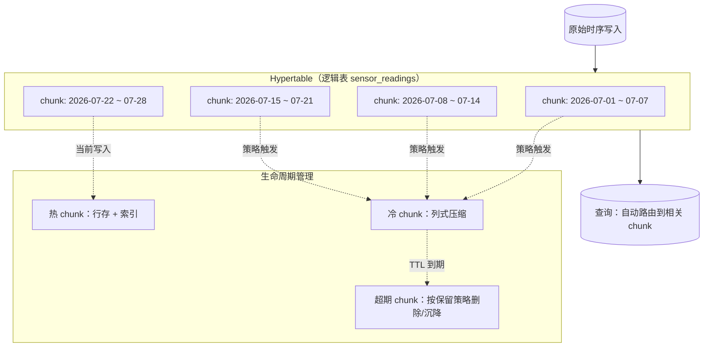
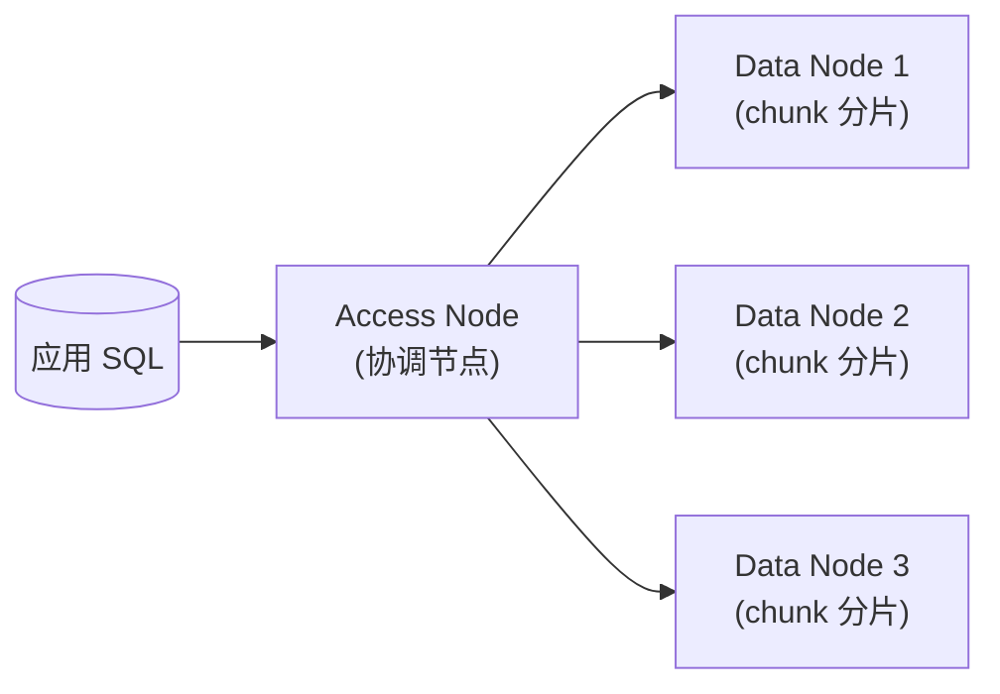
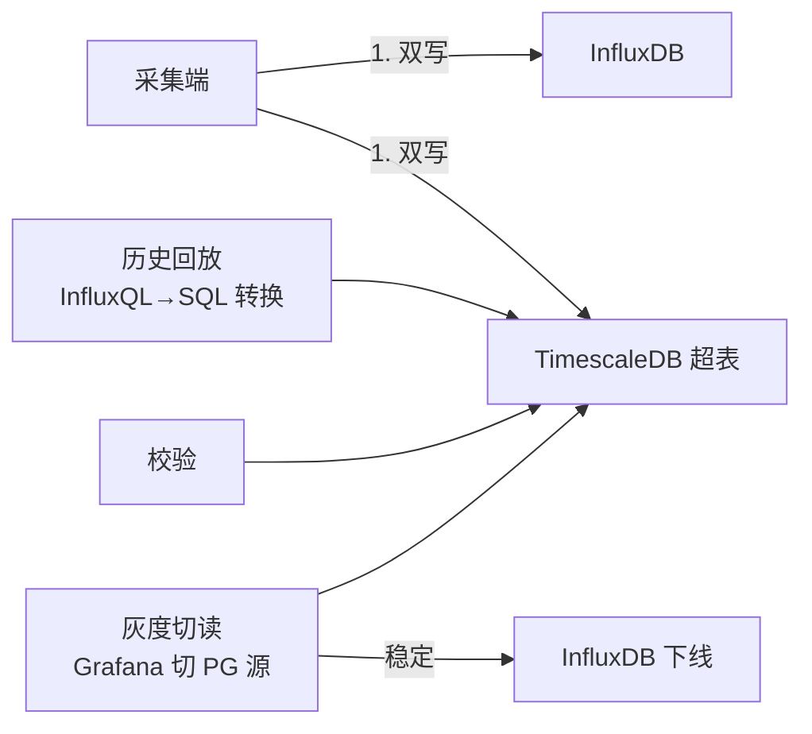
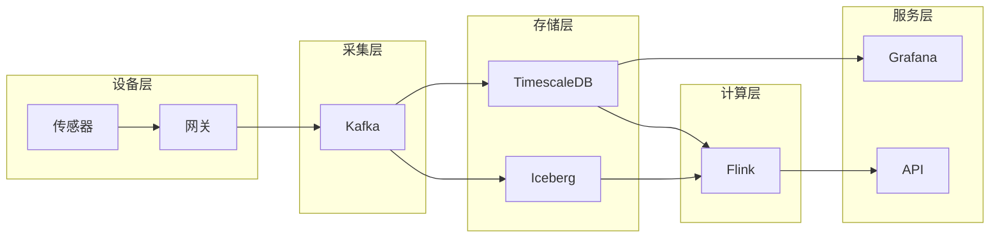

# TimescaleDB 详解

> 时序库板块子文档。概述见 [README](./README.md)。

TimescaleDB 是**基于 PostgreSQL 的时序数据库扩展（extension）**，以插件形式运行在 PostgreSQL 之上，复用 PG 的 SQL、事务、索引、扩展与生态。它的核心卖点是：**在保留完整关系型能力（JOIN、事务、窗口函数、丰富类型）的同时，通过超表（hypertable）、连续聚合、列式压缩获得时序场景的高性能与低成本**。适合「既有时序数据，又需要关系分析 / 强一致事务」的混合型业务。

---

## 1. 定位与适用场景

### 1.1 定位

- 不是另起炉灶的专用 TSDB，而是 **PostgreSQL 的一个扩展（extension）**，通过 `CREATE EXTENSION timescaledb;` 启用。
- 100% 兼容 PG：可用 JDBC/psycopg/任何 PG 驱动，支持事务、外键、JSONB、PostGIS 等全部 PG 能力。
- 面向「**时序 + 关系混合**」：设备元数据在关系表，指标在超表，二者直接 JOIN。

### 1.2 适用场景

| 场景 | 说明 |
|------|------|
| 监控 / 可观测性 | 指标存超表，主机/服务元数据存关系表，关联分析 |
| IoT 平台 | 设备上报时序 + 设备档案关系数据同库 |
| DevOps / 业务指标 | 既做聚合看板，又做明细钻取与事务写入 |
| 金融 / 交易时序 | 需要事务一致性的订单/报价时序 |
| 地理时序 | 配合 PostGIS 做轨迹/位置时序 |

### 1.3 不适用

- 超高频纯写入（千万 points/s 级）、极致压缩比需求 → 专用 TSDB（TDengine / Lindorm）更优。
- 不愿运维 PostgreSQL、希望全托管 Serverless → 考虑云厂商托管或专用 TSDB。

---

## 2. 核心概念

### 2.1 Hypertable（超表）

- 超表是**用户视角的逻辑表**，使用方式与普通 PG 表完全一致（INSERT/SELECT/JOIN）。
- 引擎在底层把它按时间（和可选空间维度）**自动切成多个 chunk（物理分区）**，对用户透明。

### 2.2 Chunk（数据分片）

- chunk 是超表的物理分区，每个 chunk 是底层一张真实的 PG 表（内部命名 `_hyper_<id>_chunk`）。
- 按时间区间（如每 7 天）或空间维度（如 device_id 哈希）切分。
- 好处：旧 chunk 可独立压缩、删除、迁移；新数据写入只触及活跃 chunk，避免全局索引膨胀。

### 2.3 维度分区

- **时间维度**：必选，按时间戳切 chunk。
- **空间维度**：可选，按某列（如 `device_id`、`location_id`）哈希/列表分到不同 chunk，利于多设备并行写入。



---

## 3. 连续聚合（Continuous Aggregates）

连续聚合是 TimescaleDB 的「物化视图式降采样」：后台按策略将明细聚合结果物化到一张聚合超表，查询直接命中物化结果，避免每次重算。

```sql
-- 1) 创建基础超表
CREATE TABLE sensor_readings (
    time        TIMESTAMPTZ NOT NULL,
    device_id   TEXT,
    temperature DOUBLE PRECISION,
    humidity    DOUBLE PRECISION
);
SELECT create_hypertable('sensor_readings', 'time',
       chunk_time_interval => INTERVAL '7 days');

-- 2) 创建连续聚合：每 1 小时每设备平均温湿度
CREATE MATERIALIZED VIEW readings_hourly
WITH (timescaledb.continuous) AS
SELECT device_id,
       time_bucket('1 hour', time) AS bucket,
       AVG(temperature) AS avg_temp,
       MAX(temperature) AS max_temp,
       AVG(humidity)    AS avg_hum
FROM sensor_readings
GROUP BY device_id, time_bucket('1 hour', time);

-- 3) 配置自动刷新策略（每 1 小时刷新最近 3 天窗口）
SELECT add_continuous_aggregate_policy('readings_hourly',
       start_offset => INTERVAL '3 days',
       end_offset   => INTERVAL '1 hour',
       schedule_interval => INTERVAL '1 hour');
```

查询时直接读聚合表，速度极快：

```sql
SELECT * FROM readings_hourly
WHERE device_id = 'dev-01'
  AND bucket >= NOW() - INTERVAL '24 hours'
ORDER BY bucket;
```

---

## 4. 原生列压缩（Columnar Compression）

TimescaleDB 对 chunk 启用**列式压缩**（基于 Gorilla / 字典 / 数组压缩，依赖 `timescaledb_toolkit`/内置），将行存 chunk 转成列存压缩格式，压缩率通常 4:1 ~ 10:1，且**压缩后仍可查询**（自动解压）。

```sql
-- 对超表启用压缩，并指定压缩顺序列（与时间相关的列优先）
ALTER TABLE sensor_readings SET (
    timescaledb.compress,
    timescaledb.compress_orderby = 'time DESC',
    timescaledb.compress_segmentby = 'device_id'
);

-- 配置压缩策略：chunk 超过 7 天自动压缩
SELECT add_compression_policy('sensor_readings', INTERVAL '7 days');

-- 查看压缩前后大小
SELECT hypertable_size('sensor_readings') AS total_bytes,
       pg_size_pretty(hypertable_size('sensor_readings')) AS pretty;
```

```sql
-- 手动压缩 / 解压某个具体 chunk
SELECT compress_chunk('_timescaledb_internal._hyper_1_2_chunk');
SELECT decompress_chunk('_timescaledb_internal._hyper_1_2_chunk');
```

> 实测参考：温度（double，变化平滑）配合 `segmentby=device_id` + `orderby=time`，常见压缩比 **8:1 ~ 15:1**；压缩后点查/区间扫描性能接近行存，聚合扫描因列存更优。

---

## 5. 数据保留策略与 Chunk 管理

### 5.1 保留策略（自动删旧）

```sql
-- 超过 90 天的数据自动删除
SELECT add_retention_policy('sensor_readings', INTERVAL '90 days');

-- 也可「沉降」而非删除：配合压缩 + 外部冷存（需自行归档 chunk）
```

### 5.2 Chunk 管理

```sql
-- 查看所有 chunk
SELECT show_chunks('sensor_readings');

-- 查看某个时间范围的 chunk
SELECT show_chunks('sensor_readings',
       older_than => INTERVAL '30 days',
       newer_than => INTERVAL '60 days');

-- 手动删除旧 chunk（等价于保留策略效果）
SELECT drop_chunks('sensor_readings', INTERVAL '90 days');

-- 将某 chunk 迁移到不同表空间（冷热分离）
SELECT move_chunk('_timescaledb_internal._hyper_1_2_chunk',
       destination_tablespace => 'cold_ssd');
```

### 5.3 手动 / 自动 Compaction

底层 chunk 经大量 UPDATE/DELETE 后会产生膨胀，TimescaleDB 的压缩动作本身即完成「重写 + 压缩」。也可结合 PG 原生 `VACUUM` / `pg_repack` 处理未压缩活跃 chunk 的膨胀。

---

## 6. 分布式（Multinode）

TimescaleDB 支持 **multinode**：一个 **access node**（协调节点，接受 SQL、做计划分发）连接多个 **data node**（存储与计算 chunk）。



```sql
-- 添加数据节点（需在每台 PG 上先装 timescaledb 扩展）
SELECT add_data_node('dn1', host => '10.0.1.11', port => 5432);
SELECT add_data_node('dn2', host => '10.0.1.12', port => 5432);

-- 创建分布式超表（指定空间维度分片到数据节点）
SELECT create_distributed_hypertable('sensor_readings', 'time',
       'device_id', replication_factor => 1);
```

> 注意：TimescaleDB 的 multinode 在较新版本中定位调整（社区版以单实例 + 压缩为主，云版提供更多分布式能力），生产前核对所用版本的官方支持状态。

---

## 7. 写入 / 查询示例（SQL）

```sql
-- 建表 + 超表
CREATE TABLE metrics (
    time    TIMESTAMPTZ NOT NULL,
    host    TEXT,
    cpu     DOUBLE PRECISION,
    mem     DOUBLE PRECISION
);
SELECT create_hypertable('metrics', 'time',
       chunk_time_interval => INTERVAL '1 day',
       partitioning_column => 'host',    -- 空间维度
       number_partitions   => 4);

-- 批量写入
INSERT INTO metrics (time, host, cpu, mem) VALUES
  ('2026-07-28 10:00:00+08', 'web01', 0.81, 0.62),
  ('2026-07-28 10:00:00+08', 'web02', 0.74, 0.58),
  ('2026-07-28 10:01:00+08', 'web01', 0.83, 0.64);

-- 区间聚合 + 降采样（每 5 分钟）
SELECT time_bucket('5 minutes', time) AS bucket,
       host,
       AVG(cpu) AS avg_cpu,
       MAX(cpu) AS max_cpu
FROM metrics
WHERE time >= NOW() - INTERVAL '6 hours'
GROUP BY bucket, host
ORDER BY bucket, host;

-- 与关系表 JOIN（设备元数据）
SELECT m.time, m.host, m.cpu, d.owner, d.region
FROM metrics m
JOIN devices d ON d.host = m.host
WHERE m.time >= NOW() - INTERVAL '1 hour';
```

---

## 8. 与纯 TSDB（InfluxDB / TDengine）对比

| 维度 | TimescaleDB | InfluxDB | TDengine |
|------|-------------|----------|----------|
| SQL 能力 | 完整 PG SQL | InfluxQL / Flux（有限 SQL） | TDengine SQL（类 SQL） |
| 事务 | 强（PG ACID） | 弱 | 弱 |
| 生态扩展 | 极强（PostGIS/JSONB/任意 PG 扩展） | 中（TICK 生态） | 中 |
| 关系分析 | 强（原生 JOIN） | 弱 | 弱 |
| 写入吞吐 | 中（PG 行存上限，靠批写/压缩改善） | 高 | 很高 |
| 压缩比 | 中高（4~10:1） | 高 | 很高（自研） |
| 部署运维 | 需懂 PG | 单进程较简单 | 较简单 |
| 适用 | 时序+关系混合、要事务 | 纯监控/DevOps | 国产 IoT/运维替代 |

**优势**：SQL/事务/生态完整，开发无需学新查询语言，关系分析强。
**劣势**：超高写入吞吐与极限压缩比弱于专用 TSDB；运维要懂 PostgreSQL；单实例扩展天花板低于存算分离架构。

---

## 9. 生产实践与踩坑

### 9.1 Chunk 大小（关键调参）

- chunk 太大（如 30 天）→ 压缩/删除粒度粗，单 chunk 索引大。
- chunk 太小（如 1 小时）→ chunk 数量爆炸，元数据与规划开销大。
- **经验**：单 chunk 压缩前 25MB~数 GB、压缩后数 MB~数百 MB 为宜；高频写入用 1~7 天，低频用更长。用 `chunk_time_interval` 控制。

### 9.2 连续聚合刷新策略

- `end_offset` 留余量（如 1 小时）避免「最新数据尚未物化」导致看板缺口。
- `start_offset` 不用太大，否则每次刷新扫描过旧数据、浪费资源。
- 聚合层级可叠加：明细 → 1 分钟 → 1 小时 → 1 天，逐级物化。

### 9.3 压缩后查询

- 压缩 chunk **可直接查**，但**大量 UPDATE/DELETE 到已压缩 chunk 会触发自动解压并重压缩**，写入放大明显。
- 已压缩数据视为不可变：业务上对历史数据做修正应先 `decompress_chunk` 再改，或设计为只追加（append-only）。
- `segmentby` 选高基数列（如 device_id）能让同类数据聚在一起，提升压缩率与按设备过滤性能；`orderby` 选 time 让时间局部性最优。

### 9.4 其他

- 活跃 chunk 的膨胀用 `VACUUM` / `pg_repack` 治理。
- 监控：关注 `hypertable_size`、压缩比、连续聚合刷新延迟、chunk 数量。
- 备份用 PG 原生 `pg_basebackup` / WAL 归档；云版用托管快照。

---

## 10. 运维实战与性能调优

### 10.1 Chunk 大小调优

chunk 是超表物理分区，大小直接决定压缩/删除粒度与规划开销。

```sql
-- 调整时间分片区间（高频写入用 1~7 天）
SELECT set_chunk_time_interval('sensor_readings', INTERVAL '1 day');

-- 查看各 chunk 大小，判断是否需要调整
SELECT chunk_name,
       pg_size_pretty(hypertable_chunk_size) AS size
FROM chunk_relation_sizes('sensor_readings')
ORDER BY hypertable_chunk_size DESC;
```

经验准则：
- 单 chunk 压缩前 25MB~数 GB、压缩后数 MB~数百 MB 为宜。
- 高频写入（秒级）→ 1~3 天；中低频（分钟级）→ 7~30 天。
- 过小 → chunk 数量爆炸，规划与元数据开销大；过大 → 删除/压缩粒度粗。

### 10.2 连续聚合刷新策略

```sql
-- 分层聚合：明细 -> 1m -> 1h -> 1d 逐级物化
SELECT add_continuous_aggregate_policy('readings_1h',
       start_offset => INTERVAL '3 days',
       end_offset   => INTERVAL '1 hour',
       schedule_interval => INTERVAL '1 hour');

-- 手动刷新指定窗口（回补/修复用）
CALL refresh_continuous_aggregate('readings_1h',
       NOW() - INTERVAL '7 days', NOW() - INTERVAL '1 hour');
```

要点：
- `end_offset` 留 1h 余量，避免最新数据未物化导致看板缺口。
- `start_offset` 不宜过大，否则每次刷新扫过旧数据浪费资源。
- 层级叠加时，上层（1h）从下层（1m）读，而非从明细读，减少重算。

### 10.3 压缩策略（按年龄）

```sql
-- 超过 7 天的 chunk 自动压缩
SELECT add_compression_policy('sensor_readings', INTERVAL '7 days');

-- 压缩策略 + 保留策略组合：先压缩再过期
SELECT add_retention_policy('sensor_readings', INTERVAL '180 days');

-- 查看压缩率
SELECT hypertable_name,
       pg_size_pretty(hypertable_size) AS total
FROM hypertables
WHERE hypertable_name = 'sensor_readings';
```

> 已压缩 chunk 视为不可变：对其 UPDATE/DELETE 会触发自动解压+重压缩，写放大明显。历史修正应先 `decompress_chunk` 再改，或设计 append-only。

### 10.4 Multinode 运维

```sql
-- 检查数据节点状态
SELECT * FROM timescaledb_information.data_nodes;

-- 查看分布式超表的分片分布
SELECT * FROM timescaledb_information.chunks
WHERE hypertable_name = 'sensor_readings';

-- 节点故障：重新加回或替换
SELECT delete_data_node('dn2');
SELECT add_data_node('dn2', host => '10.0.1.12');
```

运维要点：
- access node 是 SQL 入口与计划分发点，需重点保障可用性与备份。
- data node 故障时，依赖 replication_factor 提供副本；副本不足会丢写入。
- 较新社区版以单实例 + 压缩为主，multinode 能力以云版更完整，生产前核对版本支持。

### 10.5 与 PG 生态联动（PostgREST / FDW）

TimescaleDB 即 PostgreSQL，可直接复用整个 PG 生态：

```sql
-- 1) 用 postgres_fdw 关联外部业务库（订单库）做跨库分析
CREATE EXTENSION postgres_fdw;
CREATE SERVER orders_srv FOREIGN DATA WRAPPER postgres_fdw
  OPTIONS (host '10.0.2.5', dbname 'orders');
CREATE USER MAPPING FOR CURRENT_USER SERVER orders_srv
  OPTIONS (user 'ro', password 'xxx');
IMPORT FOREIGN SCHEMA public LIMIT TO (orders)
  FROM SERVER orders_srv INTO public;

-- 时序 + 业务 JOIN
SELECT m.device_id, SUM(m.temperature), o.region
FROM sensor_readings m
JOIN orders o ON o.device_id = m.device_id
WHERE m.time >= NOW() - INTERVAL '1 day'
GROUP BY m.device_id, o.region;
```

- **PostgREST**：把超表直接暴露为 REST API，前端/BI 无需写 SQL 即可查询聚合结果（适合只读看板）。
- **FDW / dblink**：关联 MySQL/Oracle/数仓做混合分析。
- **PostGIS**：地理时序（轨迹/位置）直接用 GIS 函数处理。

### 10.6 故障排查 checklist

- [ ] 写入慢 → 检查活跃 chunk 是否膨胀（VACUUM/pg_repack）、索引是否过多。
- [ ] 压缩比低 → 查 `segmentby`/`orderby` 设置，是否高基数列未选对。
- [ ] 连续聚合缺口 → 查刷新策略 `end_offset`、刷新任务是否失败。
- [ ] 查询慢 → 是否命中聚合表，是否带时间下界。
- [ ] 磁盘涨 → 保留策略/压缩策略是否生效，旧 chunk 是否被删。

---

## Hypertable 创建与 Chunk Interval 调优方法论

```sql
-- 标准创建流程：普通表 → create_hypertable → 空间维度可选
CREATE TABLE conditions (
    time        TIMESTAMPTZ NOT NULL,
    device_id   TEXT,
    temperature DOUBLE PRECISION,
    humidity    DOUBLE PRECISION
);
SELECT create_hypertable('conditions', 'time',
       chunk_time_interval => INTERVAL '1 day',
       partitioning_column => 'device_id',
       number_partitions   => 8);

-- 运行期调整（对已有 chunk 不生效，只影响新 chunk）
SELECT set_chunk_time_interval('conditions', INTERVAL '6 hours');
```

chunk interval 推导公式：

```text
目标：单 chunk 压缩前 25MB ~ 数 GB

chunk_interval ≈ 目标chunk大小 ÷ 写入速率
示例：
  写入速率 = 10000 设备 × 1 点/10s × 200B/行 ≈ 20MB/min
  目标 2GB → 2GB ÷ 20MB/min ≈ 100min → 取 1~2 小时
低频场景（分钟级上报）：写入 0.5MB/min → 取 7 天更合理
```

| 症状 | 诊断 | 处置 |
|------|------|------|
| 查询计划列出上千 chunk | interval 过小 | 调大 + `reorder`；必要时重建表 |
| 单 chunk 压缩耗时 >10min | interval 过大 | 调小让压缩任务增量执行 |
| 写入延迟周期性抖动 | 新 chunk 创建风暴 | 预建 chunk + 错开空间分区数 |

## 连续聚合：实时 + 物化双模式

```sql
-- materialized_only=false：物化区 + 实时区自动拼接
-- （新数据未刷新时直接查明细实时计算，看板无缺口）
CREATE MATERIALIZED VIEW cond_5m
WITH (timescaledb.continuous) AS
SELECT device_id,
       time_bucket(INTERVAL '5 minutes', time) AS bucket,
       AVG(temperature) AS avg_temp, MAX(humidity) AS max_hum
FROM conditions
GROUP BY device_id, bucket
WITH NO DATA;

ALTER MATERIALIZED VIEW cond_5m SET (
    timescaledb.materialized_only = false    -- 关键开关
);

-- 刷新策略：每小时回刷最近 3h（重叠窗口容忍迟到数据）
SELECT add_continuous_aggregate_policy('cond_5m',
       start_offset => INTERVAL '3 hours',
       end_offset   => INTERVAL '0 minutes',
       schedule_interval => INTERVAL '1 hour');
```

| 模式 | 行为 | 适用 |
|------|------|------|
| materialized_only=true | 只返回已物化数据，最快但可能缺最新值 | 历史报表 |
| materialized_only=false | 物化区 + 实时明细 UNION | **监控看板默认推荐** |

分层叠加最佳实践：1m 聚合从明细刷 → 1h 从 1m 刷 → 1d 从 1h 刷；上层查询命中下层聚合，重算成本指数级下降。

## 压缩策略：segmentby / orderby 与压缩率实测

```sql
ALTER TABLE conditions SET (
    timescaledb.compress,
    timescaledb.compress_segmentby = 'device_id',  -- 高基数分组列
    timescaledb.compress_orderby = 'time DESC'     -- 组内时间排序
);
SELECT add_compression_policy('conditions', INTERVAL '7 days');
```

```text
参数选择原理：
  segmentby 决定「分组的边界」——同设备的数据连续存放，
  delta/dictionary 编码才能发挥（相似值相邻）
  orderby 决定「组内排列」——时序按时间排后 delta-of-delta 最优

实测参考（单表 5000 万行）：
  无压缩                    ：12.8 GB
  segmentby=device_id only  ：2.9 GB（4.4:1）
  + orderby=time DESC       ：1.1 GB（11.6:1）
  orderby 缺失（随机顺序）  ：4.7 GB（仅 2.7:1）

常见错误：
  把低基数列（region）做 segmentby → 组过大，编码失效
  把高基数列（device_id+time）都放 segmentby → 组碎成单行
  对压缩 chunk 频繁 UPDATE → 反复解压重压，写放大 10×+
```

验证命令：`hypertable_compression_stats('conditions')` 查看 per-chunk 压缩比；低于 5:1 时优先检查 segmentby 选择。

## TimescaleDB vs PostgreSQL 原生分区对比

| 维度 | PG 原生声明式分区 | TimescaleDB Hypertable |
|------|-------------------|------------------------|
| 分区创建 | 手工/pg_partman 定时建 | 自动按需创建 |
| 空间维度 | 仅 RANGE/LIST/HASH 单层 | 时间 × 空间多维原生支持 |
| 自动压缩 | ❌ | ✅ 列式压缩策略 |
| 保留策略 | 手工 DROP 分区/pg_partman | add_retention_policy 一行配置 |
| 连续聚合 | 手动物化视图 + 自管刷新 | 内建增量刷新 + 实时拼接 |
| 跨分区并行查询 | 优化器逐步增强 | 针对 chunk 的并行与裁剪优化 |

```text
什么时候 PG 原生分区就够：
  数据量 < 千万级、无压缩诉求、只有简单时间裁剪——
  引入扩展的运维成本不划算
什么时候必须上 TimescaleDB：
  chunk 级生命周期自动化、列压降本、连续聚合、
  以及未来可能的多节点水平扩展诉求
迁移路径：PG 表 → create_hypertable 可原地转换存量表，
         原生分区表需先合并或逐分区转换
```

## 多节点分布式 Hypertable 实践

```sql
-- 架构：Access Node(协调) + N 个 Data Node
SELECT add_data_node('dn1', host => '10.0.1.11',
       database => 'tsdb', password => '***');
SELECT add_data_node('dn2', host => '10.0.1.12');

-- 分布式超表：时间 + 空间两维路由到 data node
SELECT create_distributed_hypertable('conditions', 'time', 'device_id',
       chunk_time_interval => INTERVAL '1 day',
       replication_factor  => 2);      -- 副本容灾
```

```text
运维要点：
① AN 是唯一 SQL 入口：做好 AN 高可用（ Patroni/云托管 PG）
② replication_factor ≥2 才能扛单 DN 故障；副本不足会拒绝写入
③ 查询下推：带 device_id 过滤可只命中相关 DN，
   全表聚合则扇出到所有 DN 汇总（网络开销随节点数增长）
④ 版本注意：社区版 multinode 支持在收缩，生产分布式形态
   以 Timescale 云服务为准；自托管大规模优先考虑单机+读副本+Citus 评估
```

适用判断：单实例写入 <30 万 metrics/s 且存储 <5TB 时，multinode 复杂度通常不划算——**先榨干单机（压缩+索引调优），再谈分布**。

## PostgreSQL 生态复用优势（JOIN 业务表）

```sql
-- 场景一：时序指标 JOIN 业务维表（同库零成本）
SELECT m.time, m.device_id, m.temperature,
       d.model, d.warranty_expire      -- 来自业务关系表 devices
FROM conditions m
JOIN devices d USING (device_id)
WHERE m.time >= NOW() - INTERVAL '1 day'
  AND d.warranty_expire > CURRENT_DATE;

-- 场景二：复用 PG 扩展生态
-- PostGIS：轨迹地理围栏告警
SELECT device_id FROM gps_points
WHERE ST_DWithin(geom, ST_MakePoint(120.1, 30.2)::geography, 500)
  AND time >= NOW() - INTERVAL '10 minutes';

-- pg_cron：定时清理临时表 + 触发质量校验
SELECT cron.schedule('nightly-dq', '0 2 * * *',
       $$CALL run_dq_checks()$$);

-- pg_stat_statements + EXPLAIN：完整性能诊断链路
SELECT query, calls, mean_exec_time
FROM pg_stat_statements ORDER BY mean_exec_time DESC LIMIT 10;
```

| 能力 | 专用 TSDB 通常缺失 | TimescaleDB 免费获得 |
|------|-------------------|---------------------|
| 强外键/事务跨表 | ❌ | ✅ 档案-指标一致性约束 |
| 任意扩展 | 私有插件体系 | PostGIS/pgvector/pg_cron/pgAudit 全家桶 |
| BI 直连 | 各家驱动适配 | 标准 PG 协议全工具兼容 |
| 备份恢复 | 私有工具 | pg_basebackup/PITR/WAL 归档成熟方案 |

结论：当业务「一半是时序一半是关系」（IoT 平台、SaaS 监控、金融行情+订单），TimescaleDB 用一个数据库消灭一条同步管道，复杂度收益往往大于极限吞吐差距。

---

## 11. 第三轮深度实战（基准 / 迁移 / 告警 / 流计算 / 成本 / 排障 SOP）

### 11.1 性能基准（推导 / 公开数字）

- 写入吞吐：受 PG 行存约束，单实例常见 ~10~30 万 metrics/s（批写 + 压缩后改善）。
- 压缩比：4~10:1（列式压缩 + segmentby）。
- 查询：SQL 灵活，聚合命中连续聚合表时延迟低；跨月大范围未命中聚合则中。

推导：
```text
写入 points/s ≈ 批写大小 / 单批耗时；建议 batch 1000~5000 行/批
压缩后单 chunk 数 MB~数百 MB 为宜
```

### 11.2 迁移实战：InfluxDB → TimescaleDB 双写切换 SOP



1. **建表**：把 measurement 映射为超表，tag→列/维度，field→数值列；时间列建 hypertable。
2. **双写**：Telegraf 同时写 InfluxDB 与 PG（outputs.postgresql）；或应用双写。
3. **回放**：用 `influx_inspect export` 导出 line protocol，转 SQL 批量导入。
4. **校验**：抽样比对聚合值（SUM/AVG）。
5. **切读**：Grafana 加 PostgreSQL 数据源，看板切到超表 + 连续聚合。

### 11.3 与监控 / Grafana 全链路告警规则示例

Grafana 用 PostgreSQL 数据源，对连续聚合表告警：

```sql
-- 告警查询：某设备 5 分钟平均温度 > 阈值
SELECT device_id, AVG(temperature) AS v
FROM readings_hourly
WHERE bucket >= NOW() - INTERVAL '5 minutes'
GROUP BY device_id
HAVING AVG(temperature) > 80;
```

Grafana Unified Alerting 配置（示意）：
```yaml
apiVersion: 1
groups:
  - name: tsdb_temp_alert
    rules:
      - alert: HighTemp
        sql: "SELECT device_id, AVG(temperature) v FROM readings_hourly WHERE bucket >= NOW()-'5 minutes' GROUP BY device_id HAVING AVG(temperature) > 80"
        for: 5m
        labels: { severity: critical }
```

全链路 Checklist：
- [ ] 连续聚合刷新 `end_offset` 留 1h，避免看板缺口。
- [ ] 查询命中聚合表，带时间下界。
- [ ] 监控 `hypertable_size`、压缩比、刷新延迟。

### 11.4 与 Flink / Spark 实时计算联动代码

Spark 写 TimescaleDB（JDBC batch）：
```scala
df.write
  .mode("append")
  .format("jdbc")
  .option("url", "jdbc:postgresql://tsdb:5432/metrics")
  .option("dbtable", "sensor_readings")
  .option("batchsize", "5000")
  .save()
```

Flink SQL sink：
```sql
CREATE TABLE tsdb_sink (
  time TIMESTAMP(3), device_id STRING, temperature DOUBLE
) WITH (
  'connector'='jdbc',
  'url'='jdbc:postgresql://tsdb:5432/metrics',
  'table-name'='sensor_readings'
);
INSERT INTO tsdb_sink SELECT ts, device_id, temperature FROM src;
```

联动要点：Flink 窗口聚合后写超表，避免单行高频写；历史回补先 `decompress_chunk` 再改。

### 11.5 成本优化（chunk 压缩 / 降采样 / 保留）

```sql
-- 压缩 + 保留组合：先压缩再过期
SELECT add_compression_policy('sensor_readings', INTERVAL '7 days');
SELECT add_retention_policy('sensor_readings', INTERVAL '180 days');

-- 分层聚合降本：明细→1m→1h→1d，长期只查聚合
SELECT add_continuous_aggregate_policy('readings_1h',
  start_offset=>INTERVAL '3 days', end_offset=>INTERVAL '1 hour',
  schedule_interval=>INTERVAL '1 hour');
```

降本清单：
- [ ] 压缩策略让冷 chunk 自动列压，省 4~10× 空间。
- [ ] 保留策略删超期 chunk，避免磁盘无限涨。
- [ ] 用连续聚合替代实时重算，降查询算力。
- [ ] 旧 chunk `move_chunk` 到冷表空间（如 OSS 挂载盘）。

### 11.6 生产排障 SOP

## Hypertable chunk 自动分区策略调优

```
chunk interval 调优方法：

  目标：单 chunk 压缩前 25MB ~ 数 GB
  
  推导公式：
    chunk_interval ≈ 目标chunk大小 ÷ 写入速率
    
  示例：
    写入速率 = 10000 设备 × 1 点/10s × 200B/行 ≈ 20MB/min
    目标 2GB → 2GB ÷ 20MB/min ≈ 100min → 取 1~2 小时
    低频场景（分钟级上报）：写入 0.5MB/min → 取 7 天更合理

  调整命令：
    SELECT set_chunk_time_interval('sensor_readings', INTERVAL '1 day');
    
  运行期调整只影响新 chunk，已有 chunk 不变
```

| 症状 | 诊断 | 处置 |
|------|------|------|
| 查询计划列出上千 chunk | interval 过小 | 调大 + reorder |
| 单 chunk 压缩耗时 >10min | interval 过大 | 调小增量执行 |
| 写入延迟周期性抖动 | 新 chunk 创建风暴 | 预建 chunk + 错开空间分区 |

## 连续聚合（Continuous Aggregate）刷新策略与性能

```sql
-- 分层聚合：明细 -> 1m -> 1h -> 1d 逐级物化
-- 1m 从明细刷 → 1h 从 1m 刷 → 1d 从 1h 刷
-- 上层查询命中下层聚合，重算成本指数级下降

-- materialized_only=false：物化区+实时区自动拼接
-- 新数据未刷新时直接查明细实时计算，看板无缺口
ALTER MATERIALIZED VIEW cond_5m SET (
    timescaledb.materialized_only = false
);
```

| 模式 | 行为 | 适用 |
|------|------|------|
| materialized_only=true | 只返回已物化数据 | 历史报表 |
| materialized_only=false | 物化区+实时明细 UNION | **监控看板推荐** |

## 压缩策略（segmentby/orderby）调优实例

```sql
ALTER TABLE conditions SET (
    timescaledb.compress,
    timescaledb.compress_segmentby = 'device_id',  -- 高基数分组列
    timescaledb.compress_orderby = 'time DESC'     -- 组内时间排序
);
```

```text
参数选择原理：
  segmentby 决定「分组边界」——同设备数据连续存放
  orderby 决定「组内排列」——时序按时间排 delta-of-delta 最优

实测参考（单表 5000 万行）：
  无压缩                    ：12.8 GB
  segmentby=device_id only  ：2.9 GB（4.4:1）
  + orderby=time DESC       ：1.1 GB（11.6:1）
  orderby 缺失（随机顺序）  ：4.7 GB（仅 2.7:1）
```

## 多节点分布式 hypertable 部署

```sql
-- 架构：Access Node(协调) + N 个 Data Node
SELECT add_data_node('dn1', host => '10.0.1.11');
SELECT add_data_node('dn2', host => '10.0.1.12');

-- 分布式超表：时间+空间两维路由到 data node
SELECT create_distributed_hypertable('conditions', 'time', 'device_id',
       chunk_time_interval => INTERVAL '1 day',
       replication_factor  => 2);
```

```text
运维要点：
  ① AN 是唯一 SQL 入口：做好高可用
  ② replication_factor ≥2 才能扛单 DN 故障
  ③ 带 device_id 过滤可只命中相关 DN
  ④ 社区版 multinode 支持在收缩，生产以云版为准
```

## TimescaleDB 与 Grafana 集成最佳实践

```
集成方式：
  Grafana → PostgreSQL 数据源 → TimescaleDB
  
  直连超表查询，自动命中连续聚合
  
  推荐配置：
    数据源：PostgreSQL（非 MySQL）
    连接池：PgBouncer（高并发）
    查询优化：带时间下界，命中连续聚合

  Grafana Dashboard 设计：
    实时面板：查询连续聚合表（materialized_only=false）
    历史面板：查询压缩后 chunk
    告警：对连续聚合表设阈值告警
```

## TimescaleDB 在 IoT 数据平台中的应用案例

```
IoT 场景：

  数据特征：
    千万设备 × 秒级上报
    设备元数据在关系表
    时序指标在超表

  架构：
    设备档案：PostgreSQL 关系表
    时序指标：TimescaleDB 超表
    二者直接 JOIN（同库零成本）

  优势：
    时序+关系混合查询
    设备元数据与指标关联分析
    事务保证（设备注册+指标写入原子性）
    PG 生态（PostGIS 地理时序、pgvector 向量）
    
  降本：
    连续聚合：明细→1m→1h→1d，长期只查聚合
    压缩：冷 chunk 自动列压
    保留策略：超期 chunk 自动删除
```

**Cardinality / 写入慢**
- [ ] 活跃 chunk 膨胀用 `VACUUM`/`pg_repack`；索引不宜过多。
- [ ] `segmentby`/`orderby` 设对（高基数列 segmentby，time orderby）。
- [ ] 压缩 chunk 视为不可变；UPDATE 历史触发解压重压，写放大。

**写入拒绝（锁/磁盘满）SOP**
- [ ] 查 `pg_stat_activity` 长事务、锁等待；查磁盘 `pg_tablespace`。
- [ ] 提高 `max_wal_size`、`checkpoint_timeout` 缓解写放大。

**查询超时 SOP**
- [ ] 是否命中连续聚合；是否带时间下界。
- [ ] `EXPLAIN` 看是否全 chunk 扫；缩小时间窗。

---

## 二十九、Hypertable Chunk 自动分区策略调优

### 29.1 Chunk 分区策略

| 参数 | 说明 | 推荐值 |
|------|------|--------|
| `chunk_time_interval` | 每个 chunk 的时间跨度 | 1天（高写入）/ 1周（低写入） |
| `chunk_target_size` | 目标 chunk 大小 | 1GB |
| `chunk_sizing_func` | chunk 大小计算函数 | 默认 |

### 29.2 分区策略选择

| 数据特征 | chunk_time_interval | 理由 |
|----------|-------------------|------|
| 高写入（>1GB/天） | 1 天 | 便于压缩和清理 |
| 低写入（<100MB/天） | 1 周 | 减少 chunk 数量 |
| 时序查询为主 | 按查询模式 | 时间范围对齐 |
| 混合查询 | 1 天 | 平衡写入和查询 |

```sql
-- 设置 chunk 时间间隔
SELECT create_hypertable('sensor_data', 'time',
    chunk_time_interval => INTERVAL '1 day');

-- 查看 chunk 信息
SELECT * FROM timescaledb_information.chunks
WHERE hypertable_name = 'sensor_data';

-- 调整已存在 hypertable 的 chunk 间隔
ALTER TABLE sensor_data SET (
    timescaledb.chunk_time_interval = '7 days'
);
```

## 三十、连续聚合刷新策略与性能

### 30.1 连续聚合 vs 物化视图

| 维度 | 连续聚合 | 物化视图 |
|------|---------|---------|
| 刷新方式 | 增量自动刷新 | 全量手动刷新 |
| 性能 | 高（增量计算） | 低（全量重算） |
| 实时性 | 支持 real-time aggregation | 不支持 |
| 存储 | 增量更新 | 全量存储 |

### 30.2 刷新策略配置

```sql
-- 创建连续聚合
CREATE MATERIALIZED VIEW sensor_hourly
WITH (timescaledb.continuous) AS
SELECT
    time_bucket('1 hour', time) AS bucket,
    sensor_id,
    AVG(value) AS avg_value,
    MAX(value) AS max_value,
    COUNT(*) AS sample_count
FROM sensor_data
GROUP BY bucket, sensor_id;

-- 添加刷新策略
SELECT add_continuous_aggregate_policy('sensor_hourly',
    start_offset => INTERVAL '3 hours',
    end_offset => INTERVAL '1 hour',
    schedule_interval => INTERVAL '1 hour');

-- real-time aggregation（实时查询未刷新数据）
ALTER MATERIALIZED VIEW sensor_hourly SET (timescaledb.materialized_only = false);
```

## 三十一、压缩策略调优（segmentby / orderby 最佳组合）

### 31.1 压缩配置参数

| 参数 | 说明 | 推荐值 |
|------|------|--------|
| `segmentby` | 分段列（高基数） | sensor_id/device_id |
| `orderby` | 排序列（时间相关） | time DESC |
| `compress_after` | 自动压缩时间 | 7 天 |

### 31.2 压缩效果对比

| 配置 | 压缩比 | 查询性能 | 适用场景 |
|------|--------|---------|---------|
| segmentby=sensor_id, orderby=time | 10:1 | 高（按 sensor 查询） | IoT 监控 |
| segmentby=device_type, orderby=time | 8:1 | 中（按类型查询） | 设备管理 |
| segmentby=time, orderby=sensor_id | 6:1 | 低（按时间查询） | 时间序列分析 |

```sql
-- 启用压缩
ALTER TABLE sensor_data SET (
    timescaledb.compress,
    timescaledb.compress_segmentby = 'sensor_id',
    timescaledb.compress_orderby = 'time DESC'
);

-- 添加自动压缩策略
SELECT add_compression_policy('sensor_data', INTERVAL '7 days');

-- 手动压缩
SELECT compress_chunk('_timescaledb_internal._compressed_hypertable_1');
```

## 三十二、多节点分布式 Hypertable 部署架构

### 32.1 分布式架构

```text
TimescaleDB 多节点架构：
  数据节点（Data Node）：
    - 存储实际数据
    - 执行本地查询
    - 支持水平扩展
  
  访问节点（Access Node）：
    - 接收客户端查询
    - 分发查询到数据节点
    - 合并结果返回

分布式 Hypertable：
  数据自动分布到多个数据节点
  基于分片键（distributed hypertable）
  支持分布式聚合和连接
```

### 32.2 分布式部署配置

```sql
-- 创建分布式 Hypertable
SELECT create_distributed_hypertable('sensor_data', 'time',
    chunk_time_interval => INTERVAL '1 day',
    partitioning_column => 'sensor_id',
    number_partitions => 4);

-- 查看数据分布
SELECT * FROM timescaledb_information.chunks
WHERE hypertable_name = 'sensor_data'
ORDER BY node_name;

-- 添加数据节点
SELECT add_data_node('data-node-1', host => '10.0.0.1');
SELECT add_data_node('data-node-2', host => '10.0.0.2');
```

## 三十三、TimescaleDB 与 Grafana 集成最佳实践

### 33.1 Grafana 配置

```yaml
# grafana/provisioning/datasources/timescaledb.yml
apiVersion: 1
datasources:
  - name: TimescaleDB
    type: postgres
    url: timescaledb:5432
    database: tsdb
    user: grafana
    secureJsonData:
      password: ${TSDB_PASSWORD}
    jsonData:
      sslmode: disable
      postgresVersion: 120000
      timescaledb: true
```

### 33.2 Grafana 查询优化

| 优化策略 | 做法 | 效果 |
|----------|------|------|
| 时间范围对齐 | 查询带时间下界 | 避免全表扫描 |
| 连续聚合 | 预计算聚合 | 查询加速 10x |
| 分区裁剪 | chunk 过滤 | 减少扫描数据 |
| 降采样 | 低精度数据 | 减少传输量 |

## 三十四、TimescaleDB 在 IoT 数据平台中的应用案例

### 34.1 IoT 数据平台架构



### 34.2 应用场景

| 场景 | 数据特征 | TimescaleDB 优势 |
|------|---------|-----------------|
| 设备监控 | 高写入、时间序列 | 压缩+连续聚合 |
| 告警规则 | 实时查询 | 低延迟查询 |
| 历史分析 | 大数据量 | 时间旅行+压缩 |
| 预测分析 | 特征工程 | 连续聚合+窗口函数 |
