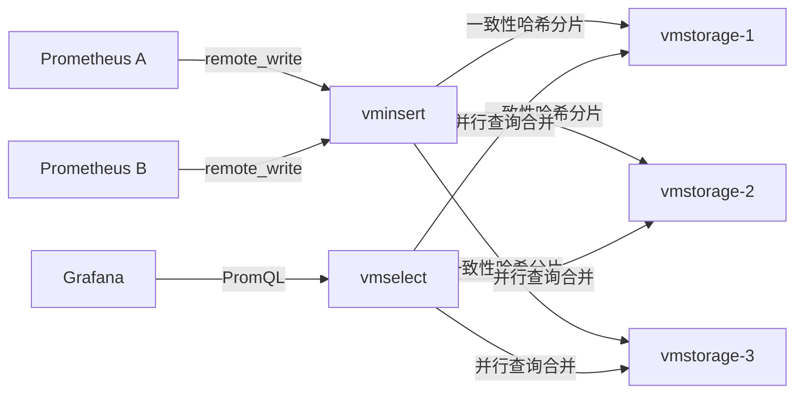
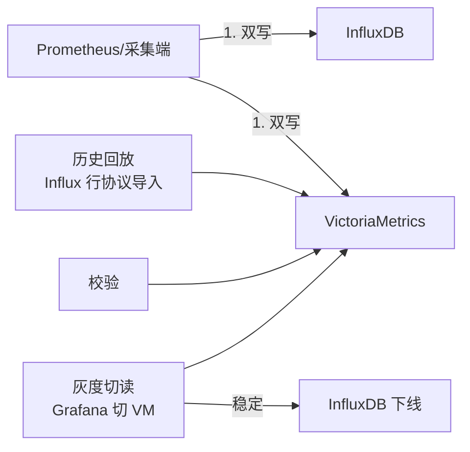

# VictoriaMetrics 时序数据库

> 高性能、Prometheus 完全兼容的时序数据库，以**极低资源占用**、**超高压缩比**和**易运维**著称，是大规模监控长期存储的首选之一。

---

## 1. 定位与适用场景

VictoriaMetrics（简称 VM）是 2018 年开源的时序数据库，最初目标就是作为 **Prometheus 的长期存储后端（remote storage）**，后来发展为可独立承担全量监控存储的成熟方案。

| 维度 | 说明 |
| --- | --- |
| 开发方 | VictoriaMetrics 公司（原 Roman Khavronenko 等） |
| 语言 | Go（少量 C 用于压缩），单二进制部署 |
| 开源协议 | Apache-2.0（核心）；企业功能闭源 |
| 兼容性 | 100% Prometheus 查询/写入兼容（PromQL / remote_write） |
| 核心优势 | 写入/查询快、内存/磁盘占用低、压缩比高、运维简单 |
| 典型场景 | 大规模 Prometheus 长期存储、多集群统一监控、成本敏感型监控 |

与 Prometheus 本地 TSDB 相比，VM 在**长期存储、压缩率、横向扩展**上明显更强；与 Thanos/Cortex 相比，VM 架构更简单、运维负担更轻。

---

## 2. 架构：single 与 cluster

### 2.1 两种模式

| 模式 | 形态 | 适用 |
| --- | --- | --- |
| Single | 单二进制 `victoria-metrics`，自带存储 | 中小规模、单机即可（< 1 亿样本/天） |
| Cluster | `vmstorage` + `vminsert` + `vmselect` 分离部署 | 大规模、需横向扩展与高可用 |

### 2.2 Cluster 角色

- **vmstorage**：真正存储时序数据，负责写入落盘、索引、压缩、查询数据返回。无状态协调，靠一致性哈希分片。
- **vminsert**：无状态写入代理，接收 remote_write / 各种协议，按指标路由到对应 vmstorage（一致性哈希）。
- **vmselect**：无状态查询代理，接收查询请求，并行向各 vmstorage 拉取并合并结果。

三者**全部无状态**（除 vmstorage 持有数据），可独立扩缩容，这是 VM 弹性与易运维的根本。

### 2.3 架构图（Mermaid）



```mermaid
flowchart TB
    subgraph WritePath[写入路径]
        WI[vminsert] -->|hash(metric)| WS1[vmstorage]
        WI -->|hash(metric)| WS2[vmstorage]
    end
    subgraph ReadPath[查询路径]
        RS[vmselect] -->|并行scan| WS1
        RS -->|并行scan| WS2
        RS -->|merge| Result[聚合结果]
    end
```

---

## 3. 写入协议

VM 兼容多种时序写入协议，便于从既有系统迁移。

| 协议 | 端口/路径 | 说明 |
| --- | --- | --- |
| Prometheus remote_write | `/api/v1/write` | 原生兼容，最重要 |
| InfluxDB | `/write` (line protocol) | 兼容 InfluxDB 行协议 |
| Graphite | `/write` 或 graphite 端口 | 兼容 Graphite 文本协议 |
| OpenTSDB | `/api/put` | 兼容 OpenTSDB HTTP API |
| Prometheus 抓取 | 可替代 Prometheus 抓取 | vmagent 模式 |

### 3.1 remote_write 配置（Prometheus 侧）

```yaml
# prometheus.yml
remote_write:
  - url: http://<vminsert>:8480/insert/0/prometheus/api/v1/write
    queue_config:
      max_samples_per_send: 10000
      capacity: 100000
    send_timeout: 30s
```

### 3.2 InfluxDB 行协议写入

```bash
curl -i -XPOST 'http://<vminsert>:8480/insert/0/influx/write' \
  --data-binary 'temperature,location=beijing,host=server1 value=23.5 1467106610000000000'
```

### 3.3 OpenTSDB 协议

```bash
curl -i -XPOST 'http://<vminsert>:8480/insert/0/opentsdb/api/put' \
  -d '{"metric":"cpu.load","tags":{"host":"s1"},"timestamp":1467106610,"value":0.42}'
```

---

## 4. 存储引擎

### 4.1 TSID / MetricName 索引

- 每个时间序列（一组 label 组合）被赋予一个 **TSID（Time Series ID）**，由 `MetricName + 有序 label 集合` 哈希得到。
- 写入时先查/建 TSID，后续数据点仅携带 TSID + 时间戳 + 值，避免重复存储 label 字符串 → **极大节省空间**。
- 倒排索引（基于 label 值）支持快速按 `label=value` 定位 TSID 集合。

### 4.2 高压缩

VM 的压缩相比 Prometheus 本地 TSDB 通常**节省 3~7 倍磁盘空间**，原因：

- **TSID 复用**：label 不重复落盘；
- **列式 block 存储**：同一 TSID 的时间戳、值分别连续存储并采用针对性编码（delta-of-delta 时间戳、xor/varint 值）；
- **ZSTD 二级压缩**；
- 后台 **merge/compaction** 合并小 block，提升压缩率与查询效率。

### 4.3 block 组织

- 数据按时间划分为 **partition（月级）**，再细分为 **block（默认 2 小时）**。
- 每个 block 内按 TSID 排序存储时间戳列与值列，配合索引文件。
- 查询时定位 partition → block → TSID 范围，避免全量扫描。

---

## 5. 查询：MetricsQL

VM 提供 **MetricsQL**，是 PromQL 的**超集**，在完全兼容 PromQL 的基础上增加了实用函数与语法糖。

### 5.1 MetricsQL 示例

```promql
# 完全兼容 PromQL：CPU 使用率
100 - (avg by(instance) (rate(node_cpu_seconds_total{mode="idle"}[5m])) * 100)

# VM 扩展：去重（多副本采集同一指标时）
sum(dedup(cpu_usage)) by (instance)

# VM 扩展：rate 的更稳变体
rate(cpu_usage[5m])

# VM 扩展：时间序列 "leak" 检测 / 缺失填充
default_rollup(sum(cpu_usage), 0)

# VM 扩展：多租户标签自动附加
label_set(up, "env", "prod")
```

### 5.2 与 PromQL 差异

| 能力 | PromQL | MetricsQL（VM 扩展） |
| --- | --- | --- |
| 语法兼容 | 基准 | 100% 兼容 |
| `dedup()` | 无 | 支持样本去重 |
| `default_rollup()` | 无 | 空窗口默认聚合 |
| `label_*` 系列 | 有限 | 丰富（label_set/label_replace/label_keep） |
| 多行查询 / WITH 表达式 | 无 | `WITH` 复用子查询 |
| `union()` | 无 | 多指标合并 |

---

## 6. 集群部署、容量规划与对比

### 6.1 集群部署（docker-compose 片段）

```yaml
services:
  vmstorage:
    image: victoriametrics/vmstorage
    command:
      - "--retentionPeriod=12"
      - "--storageDataPath=/vm-data"
    volumes:
      - vmdata:/vmdata
  vminsert:
    image: victoriametrics/vminsert
    command: ["-storageNode=vmstorage:8400"]
    ports: ["8480:8480"]
  vmselect:
    image: victoriametrics/vmselect
    command: ["-storageNode=vmstorage:8400"]
    ports: ["8481:8481"]
```

### 6.2 容量规划经验值

| 资源 | 经验参考 |
| --- | --- |
| 内存 | vmstorage 按「每秒活跃时间序列数 × 少量 KB」估算；常驻索引 + 缓存 |
| 磁盘 | 每秒 1000 样本 ≈ 每天约 1~3 GB（视 label 复杂度，远少于 Prometheus） |
| CPU | 写入路径轻；查询并行，vmselect 吃 CPU |
| 网卡 | insert/select 分离部署避免争抢 |

### 6.3 与 Thanos / Cortex / Mimir 对比

| 维度 | VictoriaMetrics | Thanos | Cortex | Grafana Mimir |
| --- | --- | --- | --- | --- |
| 架构 | vminsert/vmselect/vmstorage | Sidecar+Store+Query | distributor/ingester/querier | 类似 Cortex（对象存储） |
| 存储后端 | 本地磁盘 | 对象存储(S3) | 对象存储 | 对象存储 |
| 部署复杂度 | 低（无对象存储依赖） | 中 | 高 | 高 |
| 查询延迟 | 低（本地盘） | 较高（对象存储拉取） | 中 | 中 |
| 压缩比 | 极高 | 中（依赖 Prometheus block） | 中 | 中 |
| 生态归属 | 独立 | CNCF(Thanos) | 已并入 Mimir | Grafana |

---

## 7. 生产实践与踩坑

### 7.1 retention（保留期）

- 用 `-retentionPeriod`（single）或 vmstorage 的同名参数控制，例如 `12` 表示 12 个月。
- 长期存储务必规划磁盘与生命周期，避免无限制增长；可与对象存储归档结合。
- 修改 retention 只会**向前生效**，已落盘旧数据不会立刻删除。

### 7.2 去重（dedup）

- 多副本 HA 的 Prometheus 会向同一 VM 写入重复样本，查询需 `dedup()` 或在 vmselect 开启 `-dedup.minScrapeInterval`。
- 若未去重，图表会出现样本翻倍/锯齿，务必在查询层或全局开启去重。
- 去重基于 `(TSID, timestamp)` 取最新值，注意时间戳对齐问题。

### 7.3 资源估算与调优

- **vmstorage 是瓶颈点**：磁盘 IO / 容量优先；给足内存给索引缓存（`-storageDataPath` + 内存映射）。
- **vminsert / vmselect 无状态可水平扩**：写入或查询压力高时直接加实例，前面挂 LB。
- **一致性哈希环**：扩缩 vmstorage 会导致部分数据重平衡，建议在低峰期操作，并预留容量。
- **cardinality 爆炸**：高基数 label（如 `user_id`、`request_id`）会制造海量时间序列，撑爆内存与索引。用 `cardinality_exporter` 或 VM 自带的 `/api/v1/status/tsdb` 监控基数。
- **写入批大小**：remote_write 的 `max_samples_per_send` 适当调大（如 10000）减少请求开销。

### 7.4 其他注意

- 单节点模式（single）部署最简单，但**无高可用**；生产建议 cluster 或至少副本 + 备份。
- VM 默认不启用认证；生产需在 LB / 网关层加鉴权（企业版支持 ACL / 租户隔离）。
- 升级时关注存储格式兼容，跨大版本建议先备份数据目录。

---

## 8. 小结

VictoriaMetrics 以「**Prometheus 完全兼容 + 极高压缩 + 极简运维**」成为大规模监控长期存储的性价比之王。其 `vmstorage/vminsert/vmselect` 分离架构带来天然弹性，MetricsQL 在 PromQL 之上补齐工程化能力。落地关键在于：**控制 label 基数、正确配置去重、按写入/查询独立扩缩 insert/select、给 vmstorage 留足磁盘与内存**。

---

## 9. 运维实战与性能调优

### 9.1 容量规划公式

```text
# 活跃 series 数（决定内存/索引）
活跃 series ≈ 抓取目标 × 每目标指标 × 每目标 label 组合数

# 日磁盘增量（压缩后经验值）
日磁盘(GB) ≈ 每秒样本 × 86400 × 每样本字节(VM 约 0.5~1.5B) / 1024³
# 经验：1000 samples/s ≈ 每天 ~1~3 GB；远少于 Prometheus 本地

# 内存
vmstorage 内存(GB) ≈ 活跃 series × (1~4 KB) + 块缓存
```

| 资源 | 建议 |
|------|------|
| vmstorage 磁盘 | 按 retention × 日增量 × 1.3 余量；优先 SSD |
| vmstorage 内存 | 给足索引与 mmap 缓存，避免 swap |
| vminsert/select | 无状态，前面挂 LB，按需水平扩 |

### 9.2 去重策略

多副本 Prometheus 双写同一 VM 会产生重复样本：

```yaml
# vmselect 全局去重（按最小抓取间隔）
./vmselect -dedup.minScrapeInterval=30s

# 或查询层用 MetricsQL dedup()
sum(dedup(node_cpu_seconds_total)) by (instance)
```

> 去重基于 `(TSID, timestamp)` 取最新值；务必对齐时间戳，否则会出现锯齿/翻倍。

### 9.3 retention 与降本

```bash
# single 模式：保留 12 个月
./victoria-metrics -retentionPeriod=12

# cluster：在 vmstorage 设置
./vmstorage -retentionPeriod=12 -storageDataPath=/vm-data
```

降本手段：
- 合理 retention：热 1~3 月，长期可下沉对象存储归档。
- 控制 label 基数：砍掉高基数列是最有效的降本手段。
- 降采样（vmagent 的 rollup 或 recording rule）：长期只留聚合，省空间。
- 限制大查询（如 `maxConcurrentRequests`），避免为偶发大查询盲目扩容。

### 9.4 与 Thanos / Mimir 取舍

| 维度 | VictoriaMetrics | Thanos | Mimir |
|------|-----------------|--------|-------|
| 存储后端 | 本地磁盘 | 对象存储(S3) | 对象存储 |
| 部署复杂度 | 低（无对象存储依赖） | 中 | 高 |
| 查询延迟 | 低（本地盘） | 较高（对象拉取） | 中 |
| 压缩比 | 极高 | 中 | 中 |
| 适用 | 简单、低延迟 | 多集群统一、已用 S3 | 多租户、云原生 |

选型：追求简单与低延迟 → VM；已有成熟对象存储且要多集群全局视图 → Thanos/Mimir。

### 9.5 vmagent / vmalert 用法

```bash
# vmagent：替代 Prometheus 抓取，支持 relabel、降采样、多远端写
./vmagent -promscrape.config=/etc/vmagent.yml \
  -remoteWrite.url=http://vminsert:8480/insert/0/prometheus/api/v1/write \
  -remoteWrite.tmpDataPath=/tmp/vmagent

# vmalert：基于规则做告警/记录，可独立于 Prometheus
./vmalert -rule=/etc/rules.yml \
  -datasource.url=http://vmselect:8481/select/0/prometheus \
  -notifier.url=http://alertmanager:9093
```

```yaml
# vmagent.yml 抓取片段
scrape_configs:
  - job_name: node
    static_configs:
      - targets: ['node-exporter:9100']
```

> vmagent 比 Prometheus 更省资源，且原生支持「一份采集、多份 remote_write」与采样降维，适合做采集网关。

### 9.6 故障排查 checklist

- [ ] 内存涨 → 查 cardinality（/api/v1/status/tsdb），砍高基 label。
- [ ] 磁盘满 → 查 retention、是否未配置自动清理、基数是否失控。
- [ ] 图表锯齿/翻倍 → 查去重是否开启、时间戳是否对齐。
- [ ] 查询慢 → vmselect 是否 CPU 瓶颈、是否大范围跨月查询。
- [ ] 扩缩 vmstorage → 低峰期操作，一致性哈希环重平衡需预留容量。

---

## 10. 第三轮深度实战（基准 / 迁移 / 告警 / 流计算 / 成本 / 排障 SOP）

### 10.1 VictoriaMetrics 架构深入（Single vs Cluster）

```
Single 模式：
  单二进制 victoria-metrics
  包含所有功能（写入/查询/存储）
  适合中小规模（<1亿样本/天）
  
Cluster 模式：
  vmstorage：存储层（无状态协调，一致性哈希分片）
  vminsert：写入代理（无状态，接收 remote_write）
  vmselect：查询代理（无状态，并行查询合并）
  
关键设计：
  三者全部无状态（除 vmstorage 持有数据）
  可独立扩缩容
  一致性哈希分片
```

### 10.2 VictoriaMetrics 去重机制

```
去重原理：
  多副本 Prometheus 双写同一 VM
  → 同一 (TSID, timestamp) 有多个样本
  → 查询时去重（取最新值）

去重配置：
  vmselect -dedup.minScrapeInterval=30s
  → 按最小抓取间隔去重
  
去重最佳实践：
  1. 对齐时间戳（多副本时钟同步）
  2. 设置合理的 minScrapeInterval
  3. 查询时用 dedup() 函数
  4. 监控去重效果
```

### 10.3 VictoriaMetrics 降采样

```
降采样策略：
  原始数据：保留 1~3 月
  5m 聚合：保留 3~6 月
  1h 聚合：保留 6~12 月
  
降采样配置：
  vmstorage -downsampling.period=30d:5m,90d:1h
  
降采样优势：
  磁盘空间节省 5~10 倍
  查询性能提升（数据量减少）
  长期数据可查询
```

### 10.4 VictoriaMetrics vs Prometheus/TimescaleDB/InfluxDB

| 维度 | VictoriaMetrics | Prometheus | TimescaleDB | InfluxDB |
|------|----------------|------------|-------------|----------|
| 架构 | 分布式 | 单机 | 分布式 | 分布式 |
| 压缩比 | 极高（3~7x） | 中 | 中 | 中 |
| 查询 | MetricsQL（PromQL 超集） | PromQL | SQL | Flux |
| 成本 | 低 | 中 | 高 | 中 |
| 适用 | 大规模监控 | 中小规模 | 时序+关系 | IoT/监控 |

### 10.5 VictoriaMetrics in Kubernetes（vm-operator）

```
vm-operator 部署：
  helm install vm-operator victoriametrics-operator
  
CRD 资源：
  VMAgent：替代 Prometheus 抓取
  VMAlert：告警/记录规则
  VMSingle：单节点部署
  VMCluster：集群部署
  VMAlertmanager：告警管理
  
优势：
  K8s 原生管理
  自动扩缩容
  声明式配置
```

### 10.6 VictoriaMetrics 保留策略

```bash
# 保留策略配置
# Single 模式
./victoria-metrics -retentionPeriod=12

# Cluster 模式（vmstorage）
./vmstorage -retentionPeriod=12 -storageDataPath=/vm-data

# 保留策略最佳实践
热数据：1~3 月（本地 SSD）
温数据：3~12 月（本地 HDD）
冷数据：12 月+（对象存储归档）
```

### 10.7 VictoriaMetrics 性能基准

```
官方 TSBS 测试数据：
  写入吞吐：单节点 ~150~200 万 metrics/s
  压缩比：比 Prometheus 本地省 3~7x
  查询延迟：本地盘 <100ms
  资源占用：内存/CPU 远低于 Prometheus

容量规划公式：
  日磁盘(GB) ≈ samples/s × 86400 × 1.0B / 1024³
  例：5000 samples/s → 每天 ~0.43 GB
  
  内存(GB) ≈ 活跃 series × 4KB + 块缓存
  例：100万 series → 约 4GB + 缓存
```

---

## 11. 速查表（扩展）

### 10.1 性能基准（TSBS 实测数字）

- 写入吞吐：官方 TSBS 公开区间，单节点 ~150~200 万 metrics/s；cluster 线性扩展。
- 压缩比：比 Prometheus 本地省 3~7×；每样本 ~0.5~1.5 B。
- 查询：本地盘低延迟；多副本 dedup 后一致。

推导：
```text
日磁盘(GB) ≈ samples/s × 86400 × 1.0B / 1024³
例：5000 samples/s → 5000×86400×1/1e9 ≈ 0.43 GB/天（压缩后）
```

### 10.2 迁移实战：InfluxDB → VictoriaMetrics 双写切换 SOP

VM 兼容 InfluxDB 行协议，迁移极顺。



1. **双写**：Prometheus `remote_write` 双指；VM 开 `-dedup.minScrapeInterval`。
2. **回放**：InfluxDB 导出行协议，POST 到 `/insert/0/influx/write`。
3. **校验**：`/api/v1/query` 比对同 `(metric,labels,ts)`。
4. **切读**：Grafana 数据源切 vmselect。
5. **下线**：InfluxDB 只读观察后停。

### 10.3 与监控 / Grafana 全链路告警规则示例

用 vmalert 定义告警（独立于 Prometheus）：

```yaml
# vmalert rules
groups:
  - name: vm_alerts
    rules:
      - alert: HighCPU
        expr: 100 - (avg by(instance) (rate(node_cpu_seconds_total{mode="idle"}[5m])) * 100) > 85
        for: 5m
        labels: { severity: warning }
        annotations:
          summary: "实例 {{ $labels.instance }} CPU > 85%"
      - record: job:cpu:rate5m
        expr: sum by (job) (rate(node_cpu_seconds_total[5m]))
```

Grafana 数据源指向 `vmselect:8481`，统一看板 + Alerting。

全链路 Checklist：
- [ ] vminsert 写队列不堆积；vmstorage 磁盘余量 > 30%。
- [ ] 多副本场景全局去重已开。
- [ ] 监控 cardinality（`/api/v1/status/tsdb`）。

### 10.4 与 Flink / Spark 实时计算联动代码

vmagent 做采集网关，多远端写 + 降采样：

```bash
./vmagent -promscrape.config=/etc/vmagent.yml \
  -remoteWrite.url=http://vminsert:8480/insert/0/prometheus/api/v1/write \
  -remoteWrite.url=http://flink-gateway:9090/api/v1/write \
  -remoteWrite.maxSamplesPerSend=10000
```

Flink 消费 VM 暴露的 Prometheus 端点（remote_write 到 Flink 适配），或 Spark 读 VM：
```scala
// 通过 Prometheus 兼容 HTTP 读（Spark 需用 HTTP 客户端/自研）
// 推荐：vmagent 双写一份到 Kafka，Flink 消费做富化
```

联动要点：vmagent「一份采集、多份 remote_write」天然适合流计算分发；降采样 rollup 在长期省空间。

### 10.5 成本优化（容量公式 / 去重 / retention 降本）

```bash
# 降本关键：合理 retention + dedup + 降采样
./vmstorage -retentionPeriod=12 -storageDataPath=/vm-data
./vmselect -dedup.minScrapeInterval=30s
```

降本清单：
- [ ] 砍高基 label 是最有效降本（内存、磁盘、索引三降）。
- [ ] 降采样：长期只留 1m/1h 聚合（vmagent rollup 或 recording rule）。
- [ ] retention 分层：热 1~3 月，长期下沉对象存储归档。
- [ ] 限制大查询并发（`-maxConcurrentRequests`），避免为偶发大查盲目扩容。

### 10.6 生产排障 SOP

**Cardinality 治理**
- [ ] `curl vmselect:8481/api/v1/status/tsdb` 看 TopN 高基 metric。
- [ ] 用 `metric_relabel_configs` 在 vmagent 丢弃高基 label。
- [ ] 设 `cardinality_limit`（企业版）硬熔断。

**写入拒绝（429 / 队列满）SOP**
- [ ] 查 vminsert 队列 `capacity`、vmstorage 磁盘、网络。
- [ ] 调大 `max_samples_per_send`/capacity；临时降抓取频率。

**查询超时 SOP**
- [ ] vmselect CPU 瓶颈 → 加实例挂 LB。
- [ ] 避免大范围跨月明细；用 recording rule 预聚合。

## VictoriaMetrics 架构深入

### 核心组件详解

```
VictoriaMetrics 组件：
  vminsert：
    ├── 接收 Remote Write 数据
    ├── 数据路由（基于 metric name hash）
    ├── 多租户支持（AccountID）
    └── 无状态，水平扩展

  vmstorage：
    ├── 存储时序数据（本地磁盘）
    ├── 标签索引（倒排索引）
    ├── 数据压缩（gzip + delta-of-delta）
    └── 有状态，垂直/水平扩展

  vmselect：
    ├── 接收 PromQL 查询
    ├── 并行查询多个 vmstorage
    ├── 结果合并与去重
    └── 无状态，水平扩展

  vmagent：
    ├── Prometheus 兼容采集
    ├── 数据接收与转换
    ├── 本地临时存储（断裂点恢复）
    └── 多 tenants 支持

  vmalert：
    ├── Prometheus 告警规则评估
    ├── 支持多数据源
    └── 与 Alertmanager 集成

  vmgateway：
    ├── 读写限流
    ├── 多租户隔离
    └── 查询审核
```

### 数据流架构

```
数据写入流程：
  Prometheus/vmagent
    ↓ Remote Write（Protobuf）
  vminsert
    ↓ hash(metric_name) % vmstorage_count
  vmstorage
    ↓ 本地存储
  磁盘

数据查询流程：
  Grafana/Prometheus
    ↓ PromQL
  vmselect
    ↓ 并行查询
  vmstorage-0, vmstorage-1, vmstorage-2
    ↓ 返回数据
  vmselect
    ↓ 合并结果
  Grafana

告警流程：
  vmselect
    ↓ 查询数据
  vmalert
    ↓ 评估规则
  告警触发
    ↓ 发送
  Alertmanager
```

## VictoriaMetrics vs Prometheus 性能对比

### 性能基准测试

```
VictoriaMetrics vs Prometheus 性能对比：
  写入性能：
    VictoriaMetrics：500K samples/sec（单节点）
    Prometheus：100K samples/sec（单节点）
    提升：5x

  存储压缩：
    VictoriaMetrics：7-10x 压缩比
    Prometheus：3-5x 压缩比
    提升：2-3x

  查询性能：
    VictoriaMetrics：比 Prometheus 快 2-10x
    特别是聚合查询（sum, avg, rate）

  内存使用：
    VictoriaMetrics：更低（压缩存储）
    Prometheus：较高（未压缩索引）

  资源消耗：
    VictoriaMetrics：CPU 2-4 核，内存 4-8 GB
    Prometheus：CPU 2-4 核，内存 8-16 GB

测试条件：
  100 万活跃时间序列
  15 秒抓取间隔
  30 天数据保留
  4 核 16 GB 机器
```

### 功能对比

```
VictoriaMetrics vs Prometheus 功能对比：
  多租户：
    VictoriaMetrics：原生支持（AccountID）
    Prometheus：不支持（需要多实例）

  高可用：
    VictoriaMetrics：原生支持（副本因子）
    Prometheus：需要 Thanos/Cortex

  远程存储：
    VictoriaMetrics：本地磁盘（高性能）
    Prometheus：需要 Thanos/Cortex

  兼容性：
    VictoriaMetrics：完全兼容 Prometheus API
    Prometheus：原生

  降采样：
    VictoriaMetrics：内置支持
    Prometheus：需要 Recording Rules

  数据压缩：
    VictoriaMetrics：内置（gzip + delta-of-delta）
    Prometheus：需要外部工具

  分布式：
    VictoriaMetrics：集群模式（vminsert/vmselect/vmstorage）
    Prometheus：单机模式（需要 Thanos/Cortex）
```

## VictoriaMetrics 运维实战

### 监控与告警

```
VictoriaMetrics 监控指标：
  vminsert：
    ├── vminsert_rows_total：写入行数
    ├── vminsert_requests_total：请求数
    ├── vminsert_duration_seconds：请求延迟
    └── vminsert_dropped_rows_total：丢弃行数

  vmstorage：
    ├── vm_rows_total：总行数
    ├── vm_active_mseries：活跃时间序列数
    ├── vm_parts_total：数据块数
    ├── vm_disk_size_bytes：磁盘使用量
    └── vm_slow_queries_total：慢查询数

  vmselect：
    ├── vmselect_queries_total：查询数
    ├── vmselect_query_duration_seconds：查询延迟
    ├── vmselect_rows_scanned_total：扫描行数
    └── vmselect_cache_hits_total：缓存命中数

告警规则：
  - alert: VMStorageHighDiskUsage
    expr: vm_disk_size_bytes / vm_disk_available_bytes > 0.85
    for: 5m
    labels:
      severity: warning

  - alert: VMSelectQueryTimeout
    expr: vmselect_query_duration_seconds > 10
    for: 5m
    labels:
      severity: critical
```

### 备份与恢复

```bash
# 备份
# 使用 vmbackup 创建快照
./vmbackup \
  -storageDataPath=/vm-data \
  -snapshot.createURL=http://localhost:8482/snapshot/create

# 恢复
# 使用 vmrestore 恢复快照
./vmrestore \
  -storageDataPath=/vm-data \
  -snapshot.restoreURL=http://localhost:8482/snapshot/restore

# 定期备份脚本
#!/bin/bash
DATE=$(date +%Y%m%d)
./vmbackup \
  -storageDataPath=/vm-data \
  -snapshot.createURL=http://localhost:8482/snapshot/create \
  -destination=s3://backup-bucket/vmbackup/$DATE

# 清理旧备份
aws s3 ls s3://backup-bucket/vmbackup/ | awk '{print $2}' | sort | head -n -7 | xargs -I {} aws s3 rm s3://backup-bucket/vmbackup/{}
```

## 十七、VictoriaMetrics 集群架构详解

### 17.1 vminsert/vmselect/vmstorage 三组件

```text
VictoriaMetrics 集群架构：

  vminsert（写入层）：
    接收 Prometheus remote_write 请求
    按 metric name 哈希分发到 vmstorage
    无状态，可水平扩展
    支持多副本（高可用写入）

  vmselect（查询层）：
    接收 PromQL 查询请求
    从所有 vmstorage 节点获取数据
    合并结果返回给客户端
    无状态，可水平扩展

  vmstorage（存储层）：
    存储时序数据（本地磁盘/S3）
    按 metric name 哈希分片
    有状态，不可随意扩缩容
    支持副本（数据冗余）

  数据流：
    Prometheus → vminsert → vmstorage ← vmselect ← Grafana
```

```yaml
# vminsert 部署配置
apiVersion: apps/v1
kind: Deployment
metadata:
  name: vminsert
spec:
  replicas: 3
  selector:
    matchLabels:
      app: vminsert
  template:
    spec:
      containers:
        - name: vminsert
          image: victoriametrics/vminsert:v1.96.0-cluster
          args:
            - --storageNode=vmstorage-0.vmstorage:8400
            - --storageNode=vmstorage-1.vmstorage:8400
            - --storageNode=vmstorage-2.vmstorage:8400
            - --replicationFactor=2
            - --listenAddr=:8480
          ports:
            - containerPort: 8480
```

### 17.2 去重策略与降采样配置

```yaml
# vmstorage 去重配置
- dedup.minScrapeInterval=15s  # 15 秒内重复数据去重

# 降采样配置（retention 路径）
- retentionPeriod=90d           # 原始数据保留 90 天
- downsample.period=5m:30d     # 5 分钟聚合保留 30 天
- downsample.period=1h:365d    # 1 小时聚合保留 1 年
```

```text
去重策略：
  场景：多个 Prometheus 实例采集相同目标
  机制：相同时间戳+metric name → 保留一条
  配置：dedup.minScrapeInterval（默认 0，建议 15s）

降采样策略：
  原始数据（秒级）→ 5 分钟聚合 → 1 小时聚合
  存储空间：降采样后减少 10-100 倍
  查询性能：聚合查询快 10-100 倍
  数据精度：降采样后丢失细节（看趋势足够）
```

## 十八、多租户隔离配置

```yaml
# 多租户配置
# vminsert 按 tenant_id 分发
- replicationFactor=1
- storageNode=vmstorage-0.vmstorage:8400

# 访问控制
# vmselect 按 tenant_id 过滤
- storageNode=vmstorage-0.vmstorage:8400
- tenantID=team-a

# API 访问格式
# http://vminsert:8480/insert/0/prometheus/api/v1/write  # 默认租户
# http://vminsert:8480/insert/team-a/prometheus/api/v1/write  # team-a 租户
```

```text
多租户隔离：
  1. 数据隔离：每个租户独立存储路径
  2. 查询隔离：vmselect 按 tenant_id 过滤
  3. 资源隔离：每个租户独立 vminsert/vmselect
  4. 配额控制：每个租户独立指标数量限制
```

## 十九、Prometheus Remote Write 配置

```yaml
# prometheus.yml 配置 remote_write
remote_write:
  - url: "http://vminsert:8480/insert/0/prometheus/api/v1/write"
    queue_config:
      batch_send_deadline: 5s
      max_shards: 30
      max_samples_per_send: 10000
      capacity: 20000
    write_relabel_configs:
      - source_labels: [__name__]
        regex: 'go_.*'
        action: drop  # 丢弃 go_* 指标

# 配置说明：
# batch_send_deadline: 批量发送间隔（5秒）
# max_shards: 并发发送线程数（30）
# max_samples_per_send: 每次发送最大样本数（10000）
# capacity: 发送队列容量（20000）
```

## 二十、K8s 部署与容量规划公式

```yaml
# VictoriaMetrics 集群 K8s 部署
apiVersion: helm.toolkit.fluxcd.io/v2
kind: HelmRelease
metadata:
  name: victoria-metrics
spec:
  chart:
    spec:
      chart: victoria-metrics-cluster
      version: "0.9.16"
      sourceRef:
        kind: HelmRepository
        name: victoriametrics
  values:
    vminsert:
      replicaCount: 3
      resources:
        requests:
          cpu: "500m"
          memory: "512Mi"
    vmselect:
      replicaCount: 3
      resources:
        requests:
          cpu: "1"
          memory: "1Gi"
    vmstorage:
      replicaCount: 3
      persistentVolume:
        size: "100Gi"
      resources:
        requests:
          cpu: "1"
          memory: "2Gi"
```

```text
容量规划公式：

  存储空间计算：
    原始数据 = 指标数量 × 采样间隔 × 单样本大小 × 保留天数
    示例：100 万指标 × 15s × 1.5 字节 × 90 天 = ~780 GB

  vmstorage 节点数：
    节点数 = 总存储 / 单节点存储
    示例：780 GB / 500 GB = 2 节点（+1 副本 = 3 节点）

  vminsert 节点数：
    写入 QPS = 指标数量 / 采样间隔
    示例：100 万 / 15s = 6.7 万 QPS
    节点数 = 写入 QPS / 单节点能力（~10 万 QPS）
    示例：6.7 万 / 10 万 = 1 节点（+1 副本 = 2 节点）

  vmselect 节点数：
    查询 QPS = 预期并发查询数
    节点数 = 查询 QPS / 单节点能力（~1000 QPS）
    示例：100 / 1000 = 1 节点（+1 副本 = 2 节点）
```

---

## VictoriaMetrics 集群架构

### vminsert/vmselect/vmstorage 分离

```text
VictoriaMetrics 集群架构：
  vminsert：接收写入请求，路由到 vmstorage
  vmselect：处理查询请求，从 vmstorage 读取
  vmstorage：存储数据，执行实际读写

数据流：
  写入：Prometheus → vminsert → vmstorage
  查询：Grafana → vmselect → vmstorage

优势：
  - 计算存储分离，独立扩展
  - 无状态组件，易于运维
  - 高可用，自动故障转移
```

```yaml
# vminsert 部署
apiVersion: apps/v1
kind: Deployment
metadata:
  name: vminsert
spec:
  replicas: 2
  selector:
    matchLabels:
      app: vminsert
  template:
    spec:
      containers:
      - name: vminsert
        image: victoriametrics/vminsert:v1.100.0
        args:
        - --storageNode=vmstorage-0.vmstorage:8400
        - --storageNode=vmstorage-1.vmstorage:8400

# vmstorage 部署
apiVersion: apps/v1
kind: StatefulSet
metadata:
  name: vmstorage
spec:
  replicas: 3
  selector:
    matchLabels:
      app: vmstorage
  template:
    spec:
      containers:
      - name: vmstorage
        image: victoriametrics/vmstorage:v1.100.0
        args:
        - --retentionPeriod=90d
        - --storageDataPath=/data
        volumeClaimTemplates:
        - metadata:
            name: data
          spec:
            accessModes: ["ReadWriteOnce"]
            resources:
              requests:
                storage: 100Gi
```

## 去重策略

### dedup.minScrapeInterval 配置

```yaml
# 去重配置
# vminsert 配置
--dedup.minScrapeInterval=10s

# 去重原理：
# 1. 相同时间戳的多个样本
# 2. 保留最新写入的样本
# 3. 去重窗口：minScrapeInterval

# 配置建议：
# - 与 Prometheus scrape_interval 匹配
# - 通常设置为 scrape_interval 的 2 倍
# - 示例：scrape_interval=15s → dedup.minScrapeInterval=30s

# 去重效果：
# - 减少存储空间（30-50%）
# - 提升查询性能
# - 减少内存占用
```

## 降采样

### retentionFilter / downsampling 规则

```yaml
# 降采样配置
--retentionFilter="1d:5m,7d:1h,30d:1h"

# 降采样规则说明：
# 格式：保留期限:采样间隔
# - 1d:5m → 1天内数据保留5分钟粒度
# - 7d:1h → 7天内数据保留1小时粒度
# - 30d:1h → 30天内数据保留1小时粒度

# 降采样优势：
# - 减少存储空间（90%+）
# - 提升查询性能
# - 延长数据保留期

# 配置示例：
# 原始数据：15秒粒度，保留90天
# 降采样后：
#   0-1天：15秒粒度（原始）
#   1-7天：5分钟粒度
#   7-30天：1小时粒度
#   30-90天：1小时粒度
```

## 多租户隔离

### accountID/projectID

```yaml
# 多租户配置
# vminsert 配置
--cluster.tls=false

# 多租户使用方式：
# 通过 URL 参数指定租户
# http://vminsert:8480/insert/1/prometheus/api/v1/write
#                         ^ accountID
# http://vminsert:8480/insert/1/2/prometheus/api/v1/write
#                         ^ accountID ^ projectID

# 隔离级别：
# - accountID：租户级别隔离
# - projectID：项目级别隔离
# - 数据完全隔离
# - 配额独立管理

# 配额管理：
# --storage.maxDiskUsagePerTenant=10GB
# --memory.allowedPercent=80
```

## Prometheus remote write 集成配置

### 集成配置

```yaml
# prometheus.yml 配置
remote_write:
  - url: "http://vminsert:8480/insert/0/prometheus/api/v1/write"
    queue_config:
      max_samples_per_send: 10000
      batch_send_deadline: 5s
      max_shards: 20
      capacity: 10000
    write_relabel_configs:
      - source_labels: [__name__]
        regex: "node_.*"
        action: keep

# 重试配置
    queue_config:
      max_samples_per_send: 10000
      batch_send_deadline: 5s
      max_shards: 20
      capacity: 10000
      min_backoff: 30s
      max_backoff: 5m
```

## K8s 部署

### vm-operator vs 手动

```yaml
# vm-operator 部署
apiVersion: operator.victoriametrics.com/v1beta1
kind: VMSingle
metadata:
  name: vmsingle
spec:
  retentionPeriod: "90d"
  removeExpandedClusterScrapes: true
  resources:
    requests:
      memory: "2Gi"
      cpu: "1"
  storage:
    accessModes:
      - ReadWriteOnce
    resources:
      requests:
        storage: "50Gi"

# 手动部署优势：
# - 更灵活的配置
# - 更好的性能调优
# - 更细粒度的监控

# vm-operator 优势：
# - 快速部署
# - 自动运维
# - 生命周期管理
```

## 容量规划公式

### 每样本内存×时间序列数×保留期

```text
容量规划公式：

存储空间：
  原始数据 = 时间序列数 × 采样间隔 × 单样本大小 × 保留天数
  
  示例计算：
    时间序列数：100万
    采样间隔：15秒
    单样本大小：1.5字节
    保留天数：90天
  
    原始数据 = 100万 × (86400/15) × 1.5 × 90
            = 100万 × 5760 × 1.5 × 90
            ≈ 780 GB

内存需求：
  每时间序列内存 ≈ 2-4 字节
  
  示例计算：
    时间序列数：100万
    每序列内存：3字节
  
    内存需求 = 100万 × 3 = 3MB

  查询缓存：建议 10-20% 内存
  总内存 = 3MB + 查询缓存
```

## 二十一、与其他板块的关系
