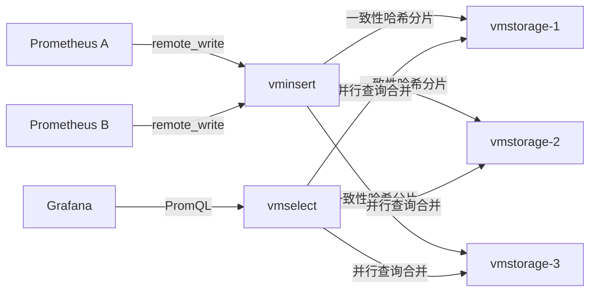

# VictoriaMetrics 时序数据库

> 高性能、Prometheus 完全兼容的时序数据库，以**极低资源占用**、**超高压缩比**和**易运维**著称，是大规模监控长期存储的首选之一。

---

## 1. 定位与适用场景

VictoriaMetrics（简称 VM）是 2018 年开源的时序数据库，最初目标就是作为 **Prometheus 的长期存储后端（remote storage）**，后来发展为可独立承担全量监控存储的成熟方案。

| 维度 | 说明 |
| --- | --- |
| 开发方 | VictoriaMetrics 公司（原 Roman Khavronenko 等） |
| 语言 | Go（少量 C 用于压缩），单二进制部署 |
| 开源协议 | Apache-2.0（核心）；企业功能闭源 |
| 兼容性 | 100% Prometheus 查询/写入兼容（PromQL / remote_write） |
| 核心优势 | 写入/查询快、内存/磁盘占用低、压缩比高、运维简单 |
| 典型场景 | 大规模 Prometheus 长期存储、多集群统一监控、成本敏感型监控 |

与 Prometheus 本地 TSDB 相比，VM 在**长期存储、压缩率、横向扩展**上明显更强；与 Thanos/Cortex 相比，VM 架构更简单、运维负担更轻。

---

## 2. 架构：single 与 cluster

### 2.1 两种模式

| 模式 | 形态 | 适用 |
| --- | --- | --- |
| Single | 单二进制 `victoria-metrics`，自带存储 | 中小规模、单机即可（< 1 亿样本/天） |
| Cluster | `vmstorage` + `vminsert` + `vmselect` 分离部署 | 大规模、需横向扩展与高可用 |

### 2.2 Cluster 角色

- **vmstorage**：真正存储时序数据，负责写入落盘、索引、压缩、查询数据返回。无状态协调，靠一致性哈希分片。
- **vminsert**：无状态写入代理，接收 remote_write / 各种协议，按指标路由到对应 vmstorage（一致性哈希）。
- **vmselect**：无状态查询代理，接收查询请求，并行向各 vmstorage 拉取并合并结果。

三者**全部无状态**（除 vmstorage 持有数据），可独立扩缩容，这是 VM 弹性与易运维的根本。

### 2.3 架构图（Mermaid）



```mermaid
flowchart TB
    subgraph WritePath[写入路径]
        WI[vminsert] -->|hash(metric)| WS1[vmstorage]
        WI -->|hash(metric)| WS2[vmstorage]
    end
    subgraph ReadPath[查询路径]
        RS[vmselect] -->|并行scan| WS1
        RS -->|并行scan| WS2
        RS -->|merge| Result[聚合结果]
    end
```

---

## 3. 写入协议

VM 兼容多种时序写入协议，便于从既有系统迁移。

| 协议 | 端口/路径 | 说明 |
| --- | --- | --- |
| Prometheus remote_write | `/api/v1/write` | 原生兼容，最重要 |
| InfluxDB | `/write` (line protocol) | 兼容 InfluxDB 行协议 |
| Graphite | `/write` 或 graphite 端口 | 兼容 Graphite 文本协议 |
| OpenTSDB | `/api/put` | 兼容 OpenTSDB HTTP API |
| Prometheus 抓取 | 可替代 Prometheus 抓取 | vmagent 模式 |

### 3.1 remote_write 配置（Prometheus 侧）

```yaml
# prometheus.yml
remote_write:
  - url: http://<vminsert>:8480/insert/0/prometheus/api/v1/write
    queue_config:
      max_samples_per_send: 10000
      capacity: 100000
    send_timeout: 30s
```

### 3.2 InfluxDB 行协议写入

```bash
curl -i -XPOST 'http://<vminsert>:8480/insert/0/influx/write' \
  --data-binary 'temperature,location=beijing,host=server1 value=23.5 1467106610000000000'
```

### 3.3 OpenTSDB 协议

```bash
curl -i -XPOST 'http://<vminsert>:8480/insert/0/opentsdb/api/put' \
  -d '{"metric":"cpu.load","tags":{"host":"s1"},"timestamp":1467106610,"value":0.42}'
```

---

## 4. 存储引擎

### 4.1 TSID / MetricName 索引

- 每个时间序列（一组 label 组合）被赋予一个 **TSID（Time Series ID）**，由 `MetricName + 有序 label 集合` 哈希得到。
- 写入时先查/建 TSID，后续数据点仅携带 TSID + 时间戳 + 值，避免重复存储 label 字符串 → **极大节省空间**。
- 倒排索引（基于 label 值）支持快速按 `label=value` 定位 TSID 集合。

### 4.2 高压缩

VM 的压缩相比 Prometheus 本地 TSDB 通常**节省 3~7 倍磁盘空间**，原因：

- **TSID 复用**：label 不重复落盘；
- **列式 block 存储**：同一 TSID 的时间戳、值分别连续存储并采用针对性编码（delta-of-delta 时间戳、xor/varint 值）；
- **ZSTD 二级压缩**；
- 后台 **merge/compaction** 合并小 block，提升压缩率与查询效率。

### 4.3 block 组织

- 数据按时间划分为 **partition（月级）**，再细分为 **block（默认 2 小时）**。
- 每个 block 内按 TSID 排序存储时间戳列与值列，配合索引文件。
- 查询时定位 partition → block → TSID 范围，避免全量扫描。

---

## 5. 查询：MetricsQL

VM 提供 **MetricsQL**，是 PromQL 的**超集**，在完全兼容 PromQL 的基础上增加了实用函数与语法糖。

### 5.1 MetricsQL 示例

```promql
# 完全兼容 PromQL：CPU 使用率
100 - (avg by(instance) (rate(node_cpu_seconds_total{mode="idle"}[5m])) * 100)

# VM 扩展：去重（多副本采集同一指标时）
sum(dedup(cpu_usage)) by (instance)

# VM 扩展：rate 的更稳变体
rate(cpu_usage[5m])

# VM 扩展：时间序列 "leak" 检测 / 缺失填充
default_rollup(sum(cpu_usage), 0)

# VM 扩展：多租户标签自动附加
label_set(up, "env", "prod")
```

### 5.2 与 PromQL 差异

| 能力 | PromQL | MetricsQL（VM 扩展） |
| --- | --- | --- |
| 语法兼容 | 基准 | 100% 兼容 |
| `dedup()` | 无 | 支持样本去重 |
| `default_rollup()` | 无 | 空窗口默认聚合 |
| `label_*` 系列 | 有限 | 丰富（label_set/label_replace/label_keep） |
| 多行查询 / WITH 表达式 | 无 | `WITH` 复用子查询 |
| `union()` | 无 | 多指标合并 |

---

## 6. 集群部署、容量规划与对比

### 6.1 集群部署（docker-compose 片段）

```yaml
services:
  vmstorage:
    image: victoriametrics/vmstorage
    command:
      - "--retentionPeriod=12"
      - "--storageDataPath=/vm-data"
    volumes:
      - vmdata:/vmdata
  vminsert:
    image: victoriametrics/vminsert
    command: ["-storageNode=vmstorage:8400"]
    ports: ["8480:8480"]
  vmselect:
    image: victoriametrics/vmselect
    command: ["-storageNode=vmstorage:8400"]
    ports: ["8481:8481"]
```

### 6.2 容量规划经验值

| 资源 | 经验参考 |
| --- | --- |
| 内存 | vmstorage 按「每秒活跃时间序列数 × 少量 KB」估算；常驻索引 + 缓存 |
| 磁盘 | 每秒 1000 样本 ≈ 每天约 1~3 GB（视 label 复杂度，远少于 Prometheus） |
| CPU | 写入路径轻；查询并行，vmselect 吃 CPU |
| 网卡 | insert/select 分离部署避免争抢 |

### 6.3 与 Thanos / Cortex / Mimir 对比

| 维度 | VictoriaMetrics | Thanos | Cortex | Grafana Mimir |
| --- | --- | --- | --- | --- |
| 架构 | vminsert/vmselect/vmstorage | Sidecar+Store+Query | distributor/ingester/querier | 类似 Cortex（对象存储） |
| 存储后端 | 本地磁盘 | 对象存储(S3) | 对象存储 | 对象存储 |
| 部署复杂度 | 低（无对象存储依赖） | 中 | 高 | 高 |
| 查询延迟 | 低（本地盘） | 较高（对象存储拉取） | 中 | 中 |
| 压缩比 | 极高 | 中（依赖 Prometheus block） | 中 | 中 |
| 生态归属 | 独立 | CNCF(Thanos) | 已并入 Mimir | Grafana |

---

## 7. 生产实践与踩坑

### 7.1 retention（保留期）

- 用 `-retentionPeriod`（single）或 vmstorage 的同名参数控制，例如 `12` 表示 12 个月。
- 长期存储务必规划磁盘与生命周期，避免无限制增长；可与对象存储归档结合。
- 修改 retention 只会**向前生效**，已落盘旧数据不会立刻删除。

### 7.2 去重（dedup）

- 多副本 HA 的 Prometheus 会向同一 VM 写入重复样本，查询需 `dedup()` 或在 vmselect 开启 `-dedup.minScrapeInterval`。
- 若未去重，图表会出现样本翻倍/锯齿，务必在查询层或全局开启去重。
- 去重基于 `(TSID, timestamp)` 取最新值，注意时间戳对齐问题。

### 7.3 资源估算与调优

- **vmstorage 是瓶颈点**：磁盘 IO / 容量优先；给足内存给索引缓存（`-storageDataPath` + 内存映射）。
- **vminsert / vmselect 无状态可水平扩**：写入或查询压力高时直接加实例，前面挂 LB。
- **一致性哈希环**：扩缩 vmstorage 会导致部分数据重平衡，建议在低峰期操作，并预留容量。
- **cardinality 爆炸**：高基数 label（如 `user_id`、`request_id`）会制造海量时间序列，撑爆内存与索引。用 `cardinality_exporter` 或 VM 自带的 `/api/v1/status/tsdb` 监控基数。
- **写入批大小**：remote_write 的 `max_samples_per_send` 适当调大（如 10000）减少请求开销。

### 7.4 其他注意

- 单节点模式（single）部署最简单，但**无高可用**；生产建议 cluster 或至少副本 + 备份。
- VM 默认不启用认证；生产需在 LB / 网关层加鉴权（企业版支持 ACL / 租户隔离）。
- 升级时关注存储格式兼容，跨大版本建议先备份数据目录。

---

## 8. 小结

VictoriaMetrics 以「**Prometheus 完全兼容 + 极高压缩 + 极简运维**」成为大规模监控长期存储的性价比之王。其 `vmstorage/vminsert/vmselect` 分离架构带来天然弹性，MetricsQL 在 PromQL 之上补齐工程化能力。落地关键在于：**控制 label 基数、正确配置去重、按写入/查询独立扩缩 insert/select、给 vmstorage 留足磁盘与内存**。
