# 网络
## TCP和UDP的区别
### 1. 连接的建立

TCP：TCP (Transmission Control Protocol，传输控制协议) 是一种面向连接的协议。这意味着在数据传输开始之前，必须先建立连接。TCP通过三次握手过程来建立连接，确保两端的通信是同步的。

UDP：UDP (User Datagram Protocol，用户数据报协议) 是一种面向数据报的协议。UDP发送数据之前不需要建立连接，它直接将数据包发送给接收方，不保证数据包的顺序、完整性或可靠性。

### 2. 数据传输的可靠性

TCP：提供高可靠性的数据传输。它通过序列号、确认应答、重传机制、流量控制和拥塞控制等技术来确保数据完整无误地传输到接收方。

UDP：不保证数据传输的可靠性。它发送的数据包可能会丢失、重复或到达顺序错乱，不提供错误恢复功能。

### 3. 数据传输的速度和效率

TCP：由于需要进行连接管理、错误检测和恢复，以及维持连接状态，其数据传输速度相对较慢，协议开销较大。

UDP：由于不需要建立连接，且几乎没有错误恢复机制，使得UDP的数据传输速度较快，协议开销小，效率较高。

### 4. 报文段

**TCP**报文段核心数据如下：

- 序列号（Sequence Number）：用于确保报文段的顺序传输，这是TCP提供可靠传输服务的关键部分。

- 确认号（Acknowledgment Number）：接收方用它来告诉发送方已成功接收到的数据，是实现可靠传输的另一机制。

- 数据偏移（Data Offset）：指出TCP头部的长度，这对于解析变长的选项字段是必要的。

- 控制位（Control Bits）：包括SYN、ACK、FIN等标志，用于建立连接、确认收到数据和连接终止。

- 窗口大小（Window Size）：用于流量控制，它告诉发送方可以发送的数据量，以防止接收方被过多数据淹没。

- 校验和（Checksum）：提供端到端的错误检测能力。

- 紧急指针（Urgent Pointer）：当URG标志被设置时，表示报文段中有紧急数据，需要优先处理。

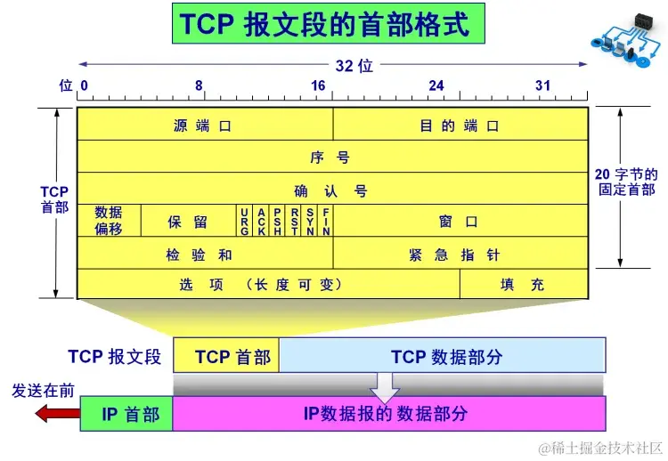
> 图：4. 报文段 相关截图

UDP：UDP报文段核心数据如下：

- 源端口和目的端口：用于标识发送和接收应用程序。

- 长度：指示UDP头部和数据的总长度。

- 校验和：提供端到端的错误检测能力，但在UDP中，这是可选的，因为UDP不保证可靠性。

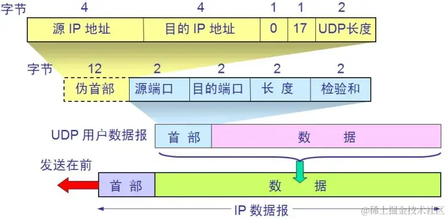
> 图：4. 报文段 相关截图

### 5. 流量控制和拥塞控制

TCP：具有流量控制和拥塞控制机制，可以根据网络条件调整数据传输速率，避免网络拥堵。

UDP：不提供流量控制和拥塞控制机制，发送方的发送速率不会根据网络条件进行调整。

### 6. 使用场景

TCP：适用于需要高可靠性的应用，如网页浏览、电子邮件、文件传输等。

UDP：适用于对传输速度和效率要求高、可以容忍一定数据丢失的应用，如在线视频会议、实时游戏、流媒体等。

## tcp中连接的意义是什么，它是逻辑上的还是物理上的

TCP（传输控制协议）中的连接是一种逻辑上的概念，而不是物理上的。TCP是一种面向连接的协议，它在两个网络终端之间建立一个虚拟的通信链路。这个连接是在应用层软件之间建立的，目的是为了确保数据能够可靠地从发送方传送到接收方。

在TCP连接中，数据以流的形式传输，而这个流是通过三次握手过程建立起来的。一旦建立了TCP连接，双方就可以开始交换数据。TCP连接提供了以下特性：

可靠性：TCP使用确认机制来确保数据包的成功传输。如果一个数据包丢失了，发送方会重新发送该数据包。

有序性：即使数据包在网络中乱序到达，TCP也能将它们按正确的顺序重组，确保接收方接收到的数据与发送方发出的数据顺序一致。

流量控制：TCP通过滑动窗口机制来调节数据的发送速率，防止发送方的数据淹没接收方。

拥塞控制：当网络出现拥塞时，TCP可以减慢数据的发送速度，帮助缓解网络拥塞。

虽然TCP连接是在逻辑上建立的，但它依赖于底层的物理网络设施，如电缆、路由器和交换机等，这些物理设备构成了数据传输的实际路径。但是，对于使用TCP的应用程序来说，它们看到的是一个抽象的、可靠的、全双工的数据传输通道，而不是具体的物理连接。

## tcp如何保证消息可靠性

TCP（传输控制协议）通过多种机制来确保消息传输的可靠性。以下是TCP为保证数据可靠传输所采取的主要措施：

1. 序列号（Sequence Numbers）每个TCP数据段都有一个序列号，用来标识该数据段中的第一个字节。接收方可以通过这些序列号来检查是否有数据段丢失或乱序，并且可以按照正确的顺序重新组装数据。

1. 确认应答（Acknowledgments, ACKs）接收方在成功接收到数据后会发送一个确认应答给发送方。确认应答包含了下一个期望接收到的字节的序列号。如果发送方没有在规定时间内收到确认应答，它会认为数据可能已经丢失，并重新发送该数据段。

1. 重传机制（Retransmission Mechanism）如果发送方没有在一定时间内接收到确认应答，它会自动重传未被确认的数据段。这通常通过超时计时器实现，超时时间根据网络状况动态调整。

1. 校验和（Checksums）每个TCP数据段都包含一个校验和字段，用于检测数据传输过程中可能出现的错误。接收方会计算接收到的数据段的校验和，并与数据段中携带的校验和进行比较。如果不匹配，接收方会丢弃该数据段并请求重传。

1. 流量控制（Flow Control）TCP使用滑动窗口机制来管理数据流的速率，防止发送方发送的数据量超过接收方的处理能力。接收方通过在确认应答中设置窗口大小来告知发送方它可以接受多少数据。

1. 拥塞控制（Congestion Control）TCP通过几种算法（如慢启动、拥塞避免、快重传和快恢复）来管理网络拥塞。当网络拥塞时，TCP会减少数据发送速率，以减轻网络负担并提高整体性能。

1. 连接管理（Connection Management）TCP通过三次握手建立连接，确保双方都准备好进行数据传输。同样，通过四次挥手断开连接，确保所有数据都已正确传输并被接收方确认。

## select、poll、epoll
与多进程和多线程技术相比，I/O多路复用技术的最大优势是系统开销小，系统不必创建进程/线程，也不必维护这些进程/线程，从而大大减小了系统的开销。

文件描述符是从0开始

select的调用过程如下所示：

- （1）使用copy_from_user从用户空间拷贝fd_set到内核空间

- （2）注册回调函数__pollwait

- （3）遍历所有fd，调用其对应的poll方法（对于socket，这个poll方法是sock_poll，sock_poll根据情况会调用到tcp_poll,udp_poll或者datagram_poll）

- （4）以tcp_poll为例，其核心实现就是__pollwait，也就是上面注册的回调函数。

- （5）__pollwait的主要工作就是把current（当前进程）挂到设备的等待队列中，不同的设备有不同的等待队列，对于tcp_poll来说，其等待队列是sk->sk_sleep（注意把进程挂到等待队列中并不代表进程已经睡眠了）。在设备收到一条消息（网络设备）或填写完文件数据（磁盘设备）后，会唤醒设备等待队列上睡眠的进程，这时current便被唤醒了。

- （6）poll方法返回时会返回一个描述读写操作是否就绪的mask掩码，根据这个mask掩码给fd_set赋值。

- （7）如果遍历完所有的fd，还没有返回一个可读写的mask掩码，则会调用schedule_timeout是调用select的进程（也就是current）进入睡眠。当设备驱动发生自身资源可读写后，会唤醒其等待队列上睡眠的进程。如果超过一定的超时时间（schedule_timeout指定），还是没人唤醒，则调用select的进程会重新被唤醒获得CPU，进而重新遍历fd，判断有没有就绪的fd。

- （8）把fd_set从内核空间拷贝到用户空间。

select的几大缺点：

（1）每次调用select，都需要把fd集合从用户态拷贝到内核态，这个开销在fd很多时会很大

（2）同时每次调用select都需要在内核遍历传递进来的所有fd，这个开销在fd很多时也很大

（3）select支持的文件描述符数量太小了，默认是1024

poll实现:

poll的实现和select非常相似，只是描述fd集合的方式不同，poll使用pollfd结构而不是select的fd_set结构，其他的都差不多。

　poll的机制与select类似，与select在本质上没有多大差别，管理多个描述符也是进行轮询，根据描述符的状态进行处理，但是poll没有最大文件描述符数量的限制。poll和select同样存在一个缺点就是，包含大量文件描述符的数组被整体复制于用户态和内核的地址空间之间，而不论这些文件描述符是否就绪，它的开销随着文件描述符数量的增加而线性增大。

epoll实现

epoll操作过程需要三个接口，分别如下：

#include <sys/epoll.h>
int epoll_create(int size);
int epoll_ctl(int epfd, int op, int fd, struct epoll_event *event);
int epoll_wait(int epfd, struct epoll_event * events, int maxevents, int timeout);

而epoll提供了三个函数，epoll_create,epoll_ctl和epoll_wait，epoll_create是创建一个epoll句柄；epoll_ctl是注册要监听的事件类型；epoll_wait则是等待事件的产生。

e

　对于第一个缺点，epoll的解决方案在epoll_ctl函数中。每次注册新的事件到epoll句柄中时（在epoll_ctl中指定EPOLL_CTL_ADD），会把所有的fd拷贝进内核，而不是在epoll_wait的时候重复拷贝。epoll保证了每个fd在整个过程中只会拷贝一次。

　　对于第二个缺点，epoll的解决方案不像select或poll一样每次都把current轮流加入fd对应的设备等待队列中，而只在epoll_ctl时把current挂一遍（这一遍必不可少）并为每个fd指定一个回调函数，当设备就绪，唤醒等待队列上的等待者时，就会调用这个回调函数，而这个回调函数会把就绪的fd加入一个就绪链表）。epoll_wait的工作实际上就是在这个就绪链表中查看有没有就绪的fd（利用schedule_timeout()实现睡一会，判断一会的效果，和select实现中的第7步是类似的）。

　　对于第三个缺点，epoll没有这个限制，它所支持的FD上限是最大可以打开文件的数目，这个数字一般远大于2048,举个例子,在1GB内存的机器上大约是10万左右，具体数目可以cat /proc/sys/fs/file-max察看,一般来说这个数目和系统内存关系很大。

这篇文章比较深入阐述了epoll [https://zhuanlan.zhihu.com/p/484981825](https://zhuanlan.zhihu.com/p/484981825)

## TCP的拥塞控制
### 慢开始

- 当一个 TCP 连接刚启动的时候，或者是超时重传导致的丢包时，需要执行慢开始，慢开始会初始化 cwnd = 1 MSS（初始化窗口值）；

- 然后一点点提速，每当发送端收到一个 ack，cwnd 就会扩大一倍，cwnd = 2^k（k 代表轮次）呈现出指数上升。当遇到 ssthresh（slow start threshold）阈值的时候，就会进入拥塞避免状态，之后呈现线性分布。

### 拥塞避免

当 cwnd 增长过快并且超过了 ssthresh 阈值的话，为了防止网络拥塞，将会进入拥塞避免状态，cwnd 呈现线性增长。

### 超时重传

当遇到超时重传导致的丢包的时候，ssthresh = 当前 cwnd/2，cwnd 值重置为 1，然后重新进入慢开始状态。

### 快速恢复

- 当执行慢开始的时候，收到了 3 个重复的 ack 包，表示现在的网络环境没有那么拥塞了，可以进入快速恢复的状态啦；

- 这个时候 ssthresh = 当前 cwnd/2，cwnd 重置为新的 ssthresh，即 cwnd = ssthresh ，然后进入拥塞避免状态。

    

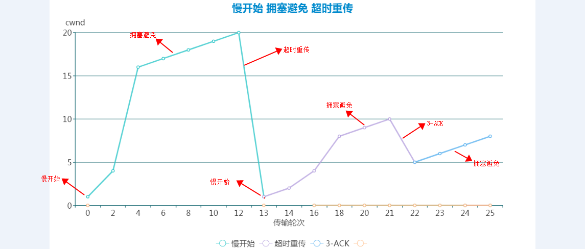
> 图：快速恢复 相关截图

## TCP格式
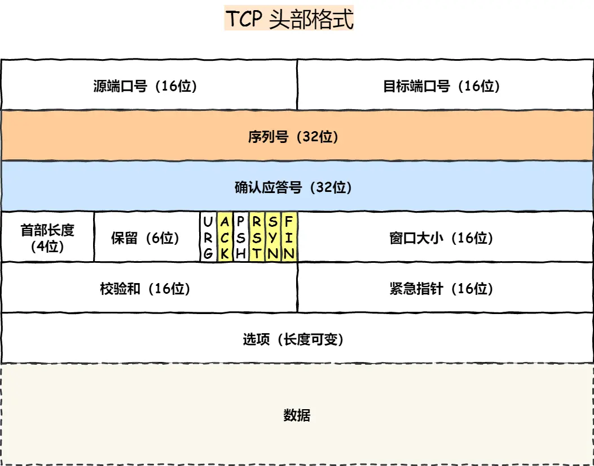
> 图：TCP格式 相关截图

## 三次握手
对于TCP三次握手和四次挥手，我们最主要的就是关注TCP头部的序列号、确认号以及几个标记位（SYN/FIN/ACK/RST）

**序列号**：在初次建立连接的时候，客户端和服务端都会为「本次的连接」随机初始化一个序列号。（纵观整个TCP流程中，序列号可以用来解决网络包乱序的问题）

需要序列化不一样主要原因有两个方面：

- 为了防止历史报文被下一个相同四元组的连接接收（主要方面）；

- 为了安全性，防止黑客伪造的相同序列号的 TCP 报文被对方接收

起始 ISN 是基于时钟的，每 4 微秒 + 1，转一圈要 4.55 个小时。

RFC793 提到初始化序列号 ISN 随机生成算法：ISN = M + F(localhost, localport, remotehost, remoteport)。

- M 是一个计时器，这个计时器每隔 4 微秒加 1

- F 是一个 Hash 算法，根据源 IP、目的 IP、源端口、目的端口生成一个随机数值。要保证 Hash 算法不能被外部轻易推算得出，用 MD5 算法是一个比较好的选择

可以看到，随机数是会基于时钟计时器递增的，基本不可能会随机成一样的初始化序列号

**确认号**：该字段表示「接收端」告诉「发送端」对上一个数据包已经成功接收（确认号可以⽤来解决网络包丢失的问题）

**标记位**：就很好理解啦。SYN为1时，表示希望创建连接。ACK为1时，确认号字段有效。FIN为1时，表示希望断开连接。RST为1时，表示TCP连接出现异常，需要断开。

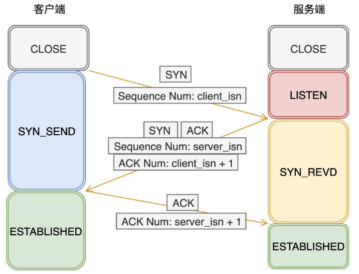
> 图：三次握手 相关截图

**那么为什么要三次呢，2次可以吗？**

我们来看看 RFC 793 指出的 TCP 连接使用三次握手的**首要原因**：

**The principle reason for the three-way handshake is to prevent old duplicate connection initiations from causing confusion.**

简单来说，三次握手的**首要原因是为了防止旧的重复连接初始化造成混乱**

**为了避免客户端第一次发送的连接在网络中滞留了，那么实际上双方已经断开了连接，但是此时服务端又收到了连接请求，如果不需要客户端响应的话，那么又能建立新的连接了**

### 原因二：同步双方初始序列号

TCP 协议的通信双方， 都必须维护一个「序列号」， 序列号是可靠传输的一个关键因素，它的作用：

- 接收方可以去除重复的数据；

- 接收方可以根据数据包的序列号按序接收；

- 可以标识发送出去的数据包中， 哪些是已经被对方收到的（通过 ACK 报文中的序列号知道）；

可见，序列号在 TCP 连接中占据着非常重要的作用，所以当客户端发送携带「初始序列号」的 SYN报文的时候，需要服务端回一个 ACK 应答报文，表示客户端的 SYN 报文已被服务端成功接收，那当服务端发送「初始序列号」给客户端的时候，依然也要得到客户端的应答回应，**这样一来一回，才能确保双方的初始序列号能被可靠的同步**

**两次握手只能保证客户端的序列号成功被服务端接收，而服务端是无法确认自己的序列号是否被客户端成功接收，就是说只能知道客户端的发送能力，却不知道接收能力**

### 原因三：避免资源浪费

如果只有「两次握手」，当客户端发生的 SYN 报文在网络中阻塞，客户端没有接收到 ACK 报文，就会重新发送 SYN ，**由于没有第三次握手，服务端不清楚客户端是否收到了自己回复的 ****ACK**** 报文，所以服务端每收到一个 ****SYN**** 就只能先主动建立一个连接**，这会造成什么情况呢？

如果客户端发送的 SYN 报文在网络中阻塞了，重复发送多次 SYN 报文，那么服务端在收到请求后就会**建立多个冗余的无效链接，造成不必要的资源浪费。**

### 小结

TCP 建立连接时，通过三次握手**能防止历史连接的建立，能减少双方不必要的资源开销，能帮助双方同步初始化序列号**。序列号能够保证数据包不重复、不丢弃和按序传输。

不使用「两次握手」和「四次握手」的原因：

- 「两次握手」：无法防止历史连接的建立，会造成双方资源的浪费，也无法可靠的同步双方序列号；

- 「四次握手」：三次握手就已经理论上最少可靠连接建立，所以不需要使用更多的通信次数。

## 四次挥手
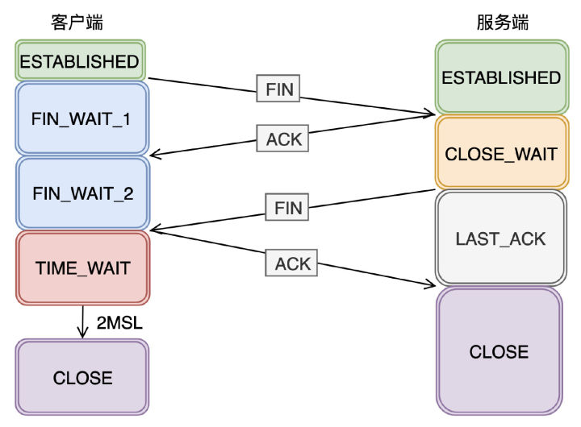
> 图：四次挥手 相关截图

## 为什么要2MSL
MSL 是 Maximum Segment Lifetime，报文最大生存时间，它是任何报文在网络上存在的最长时间，超过这个时间报文将被丢弃

因为 TCP 报文基于是 IP 协议的，而 IP 头中有一个 TTL 字段，是 IP 数据报可以经过的最大[路由数](https://www.zhihu.com/search?q=%E8%B7%AF%E7%94%B1%E6%95%B0&search_source=Entity&hybrid_search_source=Entity&hybrid_search_extra=%7B%22sourceType%22%3A%22answer%22%2C%22sourceId%22%3A2005038284%7D)，每经过一个处理他的路由器此值就减 1，当此值为 0 则[数据报](https://www.zhihu.com/search?q=%E6%95%B0%E6%8D%AE%E6%8A%A5&search_source=Entity&hybrid_search_source=Entity&hybrid_search_extra=%7B%22sourceType%22%3A%22answer%22%2C%22sourceId%22%3A2005038284%7D)将被丢弃，同时发送 ICMP 报文通知源主机。

MSL 与 TTL 的区别： MSL 的单位是时间，而 TTL 是经过[路由跳数](https://www.zhihu.com/search?q=%E8%B7%AF%E7%94%B1%E8%B7%B3%E6%95%B0&search_source=Entity&hybrid_search_source=Entity&hybrid_search_extra=%7B%22sourceType%22%3A%22answer%22%2C%22sourceId%22%3A2005038284%7D)。所以 MSL 应该要大于等于 TTL 消耗为 0 的时间，以确保报文已被自然消亡。

如果在 TIME-WAIT 时间内，因为客户端的 ACK 没有传输到服务端，客户端又接收到了服务端重发的 FIN 报文，那么 2MSL 时间将重新计时。

主要有两个原因吧。1.保证最后的 ACK 报文 「接收方」一定能收到（如果收不到，对方会 重发 FIN 报文）2. 确保在创建新连接时，先前网络中残余的数据都丢失了

## close-wait和time-wait
阻塞在输出操作，导致大量的close-wait，耗尽的不是端口，是fd

1. 资源耗尽：服务器的资源包括文件描述符、内存等，如果资源被耗尽，服务器将无法及时关闭连接，导致close_wait状态堆积。

1. 网络延迟：当服务器与客户端之间的网络连接存在延迟时，可能会导致服务器不能及时关闭连接，从而产生close_wait状态。

1. 客户端异常关闭连接：如果客户端异常关闭连接，服务器无法收到关闭连接的请求，从而导致服务器处于close_wait状态。

1. 服务器应用程序设计问题：服务器应用程序设计不合理，没有及时关闭连接，或者没有正确处理关闭连接的请求，导致close_wait状态堆积。

1. SYN Flood攻击：在网络中，如果服务器遭到大量的SYN请求，但是没有对应的ACK响应，会导致服务器处于close_wait状态。

time_wait 从流程上看， TIME_WAIT 状态 只会出现在 主动发起 关闭连接的一方。危害就是会占用内存资源和端口呗（毕竟在等待嘛），解决的话，有Linux参数可以设置。

目的：优雅的关闭TCP连接，也就是尽量保证被动关闭的一端收到它自己发出去的FIN报文的ACK确认报文；

- 处理延迟的重复报文，这主要是为了避免前后两个使用相同四元组的连接中的前一个连接的报文干扰后一个连接。

需要 TIME-WAIT 状态，主要是两个原因：

- 防止历史连接中的数据，被后面相同四元组的连接错误的接收；

**序列号和初始化序列号并不是无限递增的，会发生回绕为初始值的情况，这意味着无法根据序列号来判断新老数据。**为了防止历史连接中的数据，被后面相同四元组的连接错误的接收，因此 TCP 设计了 TIME_WAIT 状态，状态会持续 2MSL 时长，这个时间**足以让两个方向上的数据包都被丢弃，使得原来连接的数据包在网络中都自然消失，再出现的数据包一定都是新建立连接所产生的。**

- 保证「被动关闭连接」的一方，能被正确的关闭；

那么如何优化time_wait状态？

**方式一：net.ipv4.tcp_tw_reuse 和 tcp_timestamps**

如下的 Linux 内核参数开启后，则可以**复用处于 TIME_WAIT 的 socket 为新的连接所用**。

有一点需要注意的是，**tcp_tw_reuse 功能只能用客户端（连接发起方），因为开启了该功能，在调用 connect() 函数时，内核会随机找一个 time_wait 状态超过 1 秒的连接给新的连接复用**

```
net.ipv4.tcp_tw_reuse = 1
```

使用这个选项，还有一个前提，需要打开对 TCP 时间戳的支持，即

```
net.ipv4.tcp_timestamps=1（默认即为 1）
```

这个时间戳的字段是在 TCP 头部的「选项」里，它由一共 8 个字节表示时间戳，其中第一个 4 字节字段用来保存发送该数据包的时间，第二个 4 字节字段用来保存最近一次接收对方发送到达数据的时间。

由于引入了时间戳，我们在前面提到的 2MSL 问题就不复存在了，因为重复的数据包会因为时间戳过期被自然丢弃。

### 方式二：net.ipv4.tcp_max_tw_buckets

这个值默认为 18000，**当系统中处于 TIME_WAIT 的连接一旦超过这个值时，系统就会将后面的 TIME_WAIT 连接状态重置**，这个方法比较暴力。

### 方式三：程序中使用 SO_LINGER

我们可以通过设置 socket 选项，来设置调用 close 关闭连接行为。

```
struct linger so_linger;
so_linger.l_onoff = 1;
so_linger.l_linger = 0;
setsockopt(s, SOL_SOCKET, SO_LINGER, &so_linger,sizeof(so_linger));

```

如果l_onoff为非 0， 且l_linger值为 0，那么调用close后，会立该发送一个RST标志给对端，该 TCP 连接将跳过四次挥手，也就跳过了TIME_WAIT状态，直接关闭。

但这为跨越TIME_WAIT状态提供了一个可能，不过是一个非常危险的行为，不值得提倡。

前面介绍的方法都是试图越过 TIME_WAIT状态的，这样其实不太好。虽然 TIME_WAIT 状态持续的时间是有一点长，显得很不友好，但是它被设计来就是用来避免发生乱七八糟的事情。

### 谈谈对HTTP的理解

HTTP是Hyper Text Transfer Protocol（超文本传输协议）的缩写

    http的本质是客户端和服务端约定好的一种通信格式；

## 常见的io模型 
**阻塞IO模型****：**假设应用程序的进程发起**IO调用**，但是如果**内核的数据还没准备好**的话，那应用程序进程就一直在**阻塞等待**，一直等到内核数据准备好了，从内核拷贝到用户空间，才返回成功提示，此次IO操作，称之为**阻塞IO**。

**非阻塞IO模型****：**如果内核数据还没准备好，可以先返回错误信息给用户进程，让它不需要等待，而是通过轮询的方式再来请求。

**IO多路复用模型****：  **既然**NIO**无效的轮询会导致CPU资源消耗，我们等到内核数据准备好了，主动通知应用进程再去进行系统调用，那不就好了嘛？在这之前，我们先来复习下，什么是**文件描述符fd**(File Descriptor),它是计算机科学中的一个术语，形式上是一个非负整数。当程序打开一个现有文件或者创建一个新文件时，内核向进程返回一个文件描述符。IO复用模型核心思路：系统给我们提供**一类函数**（如我们耳濡目染的**select、poll、epoll**函数），它们可以同时监控多个fd的操作，任何一个返回内核数据就绪，应用进程再发起recvfrom系统调用。

**IO模型之信号驱动模型****：**信号驱动IO不再用主动询问的方式去确认数据是否就绪，而是向内核发送一个信号（调用sigaction的时候建立一个SIGIO的信号），然后应用用户进程可以去做别的事，不用阻塞。当内核数据准备好后，再通过SIGIO信号通知应用进程，数据准备好后的可读状态。应用用户进程收到信号之后，立即调用recvfrom，去读取数据。

**IO 模型之异步IO(AIO)：**前面讲的BIO，NIO和信号驱动，在数据从内核复制到应用缓冲的时候，都是**阻塞**的，因此都不是真正的异步。AIO实现了IO全流程的非阻塞，就是应用进程发出系统调用后，是立即返回的，但是**立即返回的不是处理结果，而是表示提交成功类似的意思**。等内核数据准备好，将数据拷贝到用户进程缓冲区，发送信号通知用户进程IO操作执行完毕。

## 网络模型 
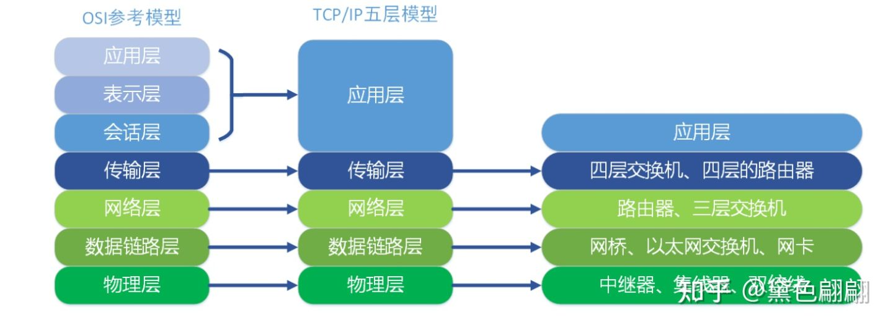
> 图：网络模型 相关截图

### 应用层

应用层是网络应用程序和网络协议存放的分层,因特网的应用层包括许多协议,例如我们学web离不开的**HTTP,**电子邮件传送协议**SMTP**、端系统文件上传协议**FTP**、还有为我们进行域名解析的**DNS**协议。应用层协议分布在多个端系统上,一个端系统应用程序与另外一个端系统应用程序交换信息分组,我们把位于应用层的信息分组称为报文(**message**)。

### 表示与会话

**表示层**主要包括数据压缩和数据加密以及数据描述,数据描述使得应用程序不必担心计算机内部存储格式的问题,。

**会话层**提供了数据交换的定界和同步功能,包括建立检查点和恢复方案。

### 传输层

维护的是端到端的连接，主要的两种不同的传输协议是TCP，UDP 。但是却有很大的不同：

**TCP**：向它的应用程序提供了面向连接的服务,它能够控制并确认报文是否到达,并提供了**拥塞机制**和一些其他的方法来控制网络传输,因此当网络拥塞时或出现一些不可控的情况时候，会抑制其传输速率。

**UDP**：协议向它的应用程序提供了无连接服务。它**不具备可靠性的特征**,就是说提供的是不可靠的连接服务。没有流量控制,也没有拥塞控制。我们把运输层的分组称为报文段( segment)

### 网络层

负责将称为**数据报**的网络分层信息从一台主机移动到另外一台主机上。其上一个非常重要的协议是IP协议：所有具有网络层的因特网组件都必须运行IP协议,IP协议是一种网际协议,除了**IP**协议外,网络层还包括一些其他网际协议和路由选择协议,一般把网络层就称为**IP**层。

### 数据链路层

现在我们有应用程序通信的协议,有了给应用程序提供运输的协议,还有了用于约定发送位置的IP协议,那么如何才能真正的发送数据呢?

为了将分组从一个节点(主机或路由器)运输到另一个节点,网络层必须依靠链路层提供服务。链路层的例子包括以太网、WiFi和电缆接入的D0CSIS协议,因为数据从源目的地传送通常需要经过几条链路,一个数据包可能被沿途不同的链路层协议处理,我们把链路层的分组称为帧( frame)

### 物理层

虽然链路层的作用是将帧从一个端系统运输到另一个端系统,而物理层的作用是将帧中的一个个比特(也叫做比特流传输)从一个节点运输到另一个节点,物理层的协议仍然使用链路层协议,这些协议与实际的物理传输介质有关,例如,以太网有很多物理层协议:关于双绞铜线、关于同轴电缆、关于光纤等等

## CDN
CDN的全称是Content Delivery Network，即内容分发网络。
CDN是构建在现有网络基础之上的智能虚拟网络，依靠部署在各地的边缘服务器，通过中心平台的负载均衡、内容分发、调度等功能模块，使用户就近获取所需内容，降低网络拥塞，提高用户访问响应速度和命中率。

> CDN的实现需要依赖多种网络技术的支持，其中**负载均衡技术**、**动态内容分发与复制技术**、**缓存技术**是比较主要的几个，下面让我们简单看一下这几种技术。

### 负载均衡技术

> 在CDN中，**负载均衡又分为服务器负载均衡和服务器整体负载均衡(也有的称为服务器全局负载均衡)**。服务器负载均衡是指能够在性能不同的服务器之间进行任务分配，既能保证性能差的服务器不成为系统的瓶颈，又能保证性能高的服务器的资源得到充分利用。而服务器整体负载均衡允许Web网络托管商、门户站点和企业根据地理位置分配内容和服务。通过使用多站点内容和服务来提高容错性和可用性，防止因本地网或区域网络中断、断电或自然灾害而导致的故障。在CDN的方案中服务器整体负载均衡将发挥重要作用，其性能高低将直接影响整个CDN的性能。

### 动态内容分发与复制技术

> 大家都知道，网站访问响应速度取决于许多因素，如网络的带宽是否有瓶颈、传输途中的路由是否有阻塞和延迟、网站服务器的处理能力及访问距离等。多数情况下，网站响应速度和访问者与网站服务器之间的距离有密切的关系。如果访问者和网站之间的距离过远的话，它们之间的通信一样需要经过重重的路由转发和处理，网络延误不可避免。一个有效的方法就是利用内容分发与复制技术，将占网站主体的大部分静态网页、图像和流媒体数据分发复制到各地的加速节点上。所以动态内容分发与复制技术也是CDN所需的一个主要技术。

### 缓存技术

> 缓存技术已经不是一种新鲜技术。Web缓存服务通过几种方式来改善用户的响应时间，如代理缓存服务、透明代理缓存服务、使用重定向服务的透明代理缓存服务等。通过Web缓存服务，用户访问网页时可以将广域网的流量降至最低。对于公司内联网用户来说，这意味着将内容在本地缓存，而无须通过专用的广域网来检索网页。对于Internet用户来说，这意味着将内容存储在他们的ISP的缓存器中，而无须通过Internet来检索网页。这样无疑会提高用户的访问速度。CDN的核心作用正是提高网络的访问速度，所以，缓存技术将是CDN所采用的又一个主要技术。

CDN的工作流程

1.当用户输入网址回车后，经过本地DNS系统解析，DNS会将最终的域名解析权交给CNAME 指向的CDN 专用DNS服务器。
2.CDN的DNS服务器将 CDN的全局负载均衡 设备ip 地址返回给浏览器

3.用户向 CDN的全局负载均衡服务器 发起内容url 请求

4.CDN全局负载均衡服务器根据 用户请求的IP地址，url等信息，选择一台用户所属区域的负载均衡设备，告诉用户向这台设备发起请求。

5.CDN区域负载均衡服务器会为用户 选择一台合适的缓存服务器提供服务，选择的依据主要是：离用户距离要近，缓存服务器上是否用户所需内容，以及各个缓存当前的一个负载均衡情况。选择出一个最优的 缓存服务器ip地址。

6.全局负载均衡服务器将 缓存服务器的ip地址给到用户。

7.用户向缓存服务器发起请求。缓存服务器响应用户请求，将用户所需内容传送到用户终端。如果缓存服务器上没有用户想要的内容，那么这台服务器就会向它的上一级缓存服务器请求内容，直至追溯到网站的源服务器，并将内容拉取到本地。

## DNS
简单来说就是：把域名转换成网络可以识别的ip地址，再通过IP地址访问主机。 这种由文字组成的名称，显而易见要更容易记忆。

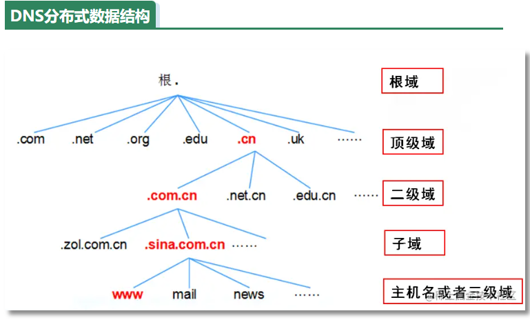
> 图：DNS 相关截图

## PPC与TPC
　　PPC 是 Process Per Connection 的缩写，其含义是指每次有新的连接就新建一个进程去专门处理这个连接的请求，这是传统的 UNIX 网络服务器所采用的模型。基本的流程图是：

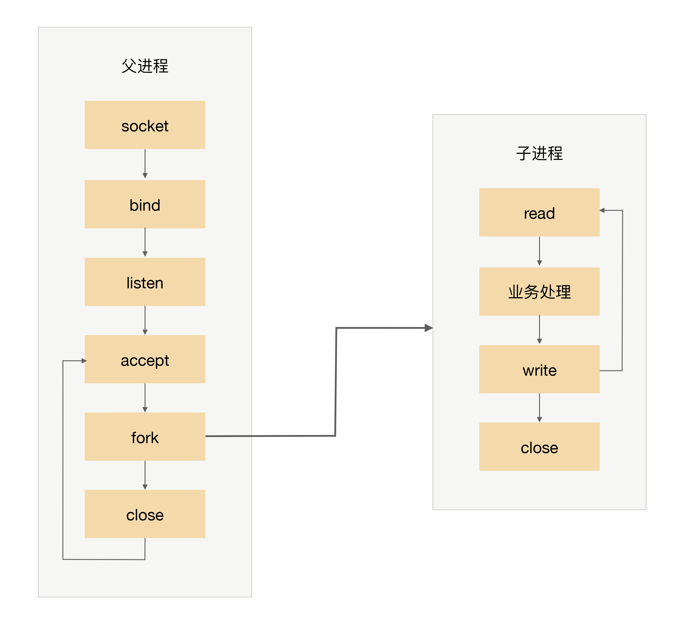
> 图：PPC与TPC 相关截图

注意，图中有一个小细节，父进程“fork”子进程后，直接调用了 close，看起来好像是关闭了连接，其实只是将连接的文件描述符引用计数减一，真正的关闭连接是等子进程也调用 close 后，连接对应的文件描述符引用计数变为 0 后，操作系统才会真正关闭连接

fork 代价高：站在操作系统的角度，创建一个进程的代价是很高的，需要分配很多内核资源，需要将内存映像从父进程复制到子进程。即使现在的操作系统在复制内存映像时用到了 Copy on Write（写时复制）技术，总体来说创建进程的代价还是很大的。

　　父子进程通信复杂：父进程“fork”子进程时，文件描述符可以通过内存映像复制从父进程传到子进程，但“fork”完成后，父子进程通信就比较麻烦了，需要采用 IPC（Interprocess Communication）之类的进程通信方案。例如，子进程需要在 close 之前告诉父进程自己处理了多少个请求以支撑父进程进行全局的统计，那么子进程和父进程必须采用 IPC 方案来传递信息。

　　支持的并发连接数量有限：如果每个连接存活时间比较长，而且新的连接又源源不断的进来，则进程数量会越来越多，操作系统进程调度和切换的频率也越来越高，系统的压力也会越来越大。因此，一般情况下，PPC 方案能处理的并发连接数量最大也就几百。

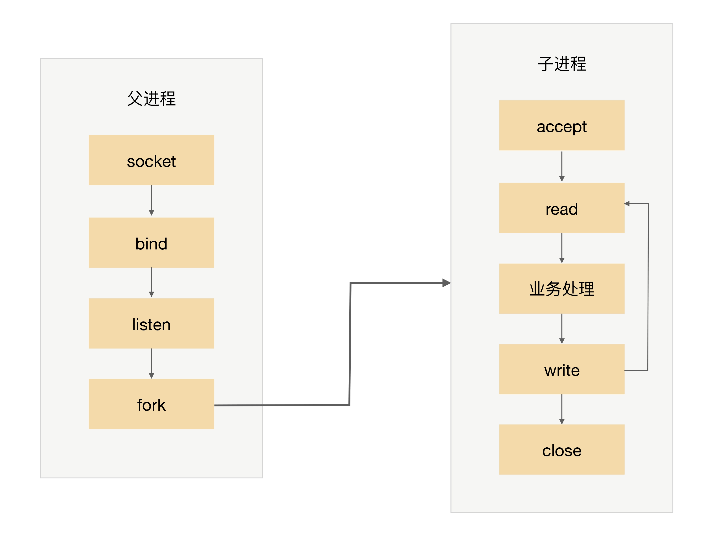
> 图：PPC与TPC 相关截图

PPC 模式中，当连接进来时才 fork 新进程来处理连接请求，由于 fork 进程代价高，用户访问时可能感觉比较慢，prefork 模式的出现就是为了解决这个问题。

　　顾名思义，prefork 就是提前创建进程（pre-fork）。系统在启动的时候就预先创建好进程，然后才开始接受用户的请求，当有新的连接进来的时候，就可以省去 fork 进程的操作，让用户访问更快、体验更好。prefork 的基本示意图是：

　　　prefork 的实现关键就是多个子进程都 accept 同一个 socket，当有新的连接进入时，操作系统保证只有一个进程能最后 accept 成功。但这里也存在一个小小的问题：“惊群”现象，就是指虽然只有一个子进程能 accept 成功，但所有阻塞在 accept 上的子进程都会被唤醒，这样就导致了不必要的进程调度和上下文切换了。幸运的是，操作系统可以解决这个问题，例如 Linux 2.6 版本后内核已经解决了 accept 惊群问题。

　　prefork 模式和 PPC 一样，还是存在父子进程通信复杂、支持的并发连接数量有限的问题，因此目前实际应用也不多。Apache 服务器提供了 MPM prefork 模式，推荐在需要可靠性或者与旧软件兼容的站点时采用这种模式，默认情况下最大支持 256 个并发连接。

　　TPC 是 Thread Per Connection 的缩写，其含义是指每次有新的连接就新建一个线程去专门处理这个连接的请求。与进程相比，线程更轻量级，创建线程的消耗比进程要少得多；同时多线程是共享进程内存空间的，线程通信相比进程通信更简单。因此，TPC 实际上是解决或者弱化了 PPC fork 代价高的问题和父子进程通信复杂的问题。

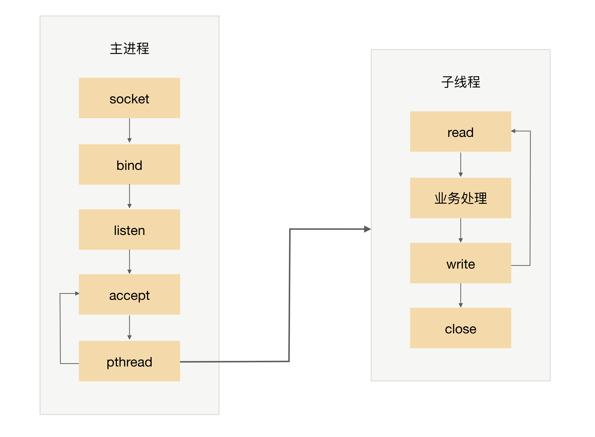
> 图：PPC与TPC 相关截图

## Netty的各种组件及交互

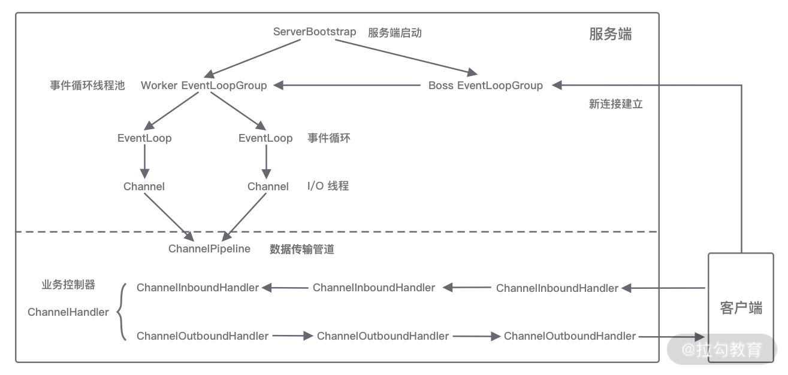
> 图：PPC与TPC 相关截图

- 服务端启动初始化时有 Boss EventLoopGroup 和 Worker EventLoopGroup 两个组件，其中 Boss 负责监听网络连接事件。当有新的网络连接事件到达时，则将 Channel 注册到 Worker EventLoopGroup。

- Worker EventLoopGroup 会被分配一个 EventLoop 负责处理该 Channel 的读写事件。每个 EventLoop 都是单线程的，通过 Selector 进行事件循环。

- 当客户端发起 I/O 读写事件时，服务端 EventLoop 会进行数据的读取，然后通过 Pipeline 触发各种监听器进行数据的加工处理。

- 客户端数据会被传递到 ChannelPipeline 的第一个 ChannelInboundHandler 中，数据处理完成后，将加工完成的数据传递给下一个 ChannelInboundHandler。

- 当数据写回客户端时，会将处理结果在 ChannelPipeline 的 ChannelOutboundHandler 中传播，最后到达客户端。

以上便是 Netty 各个组件的整体交互流程，你只需要对每个组件的工作职责有所了解，心中可以串成一条流水线即可，具体每个组件的实现原理后续课程我们会深入介绍。

## Netty中解决粘包和拆包

### 消息长度固定

每个数据报文都需要一个固定的长度。当接收方累计读取到固定长度的报文后，就认为已经获得一个完整的消息。当发送方的数据小于固定长度时，则需要空位补齐。

### 特定分隔符

既然接收方无法区分消息的边界，那么我们可以在每次发送报文的尾部加上**特定分隔符**，接收方就可以根据特殊分隔符进行消息拆分。

### 消息长度 + 消息内容

是项目开发中最常用的一种协议，如上展示了该协议的基本格式。消息头中存放消息的总长度，例如使用 4 字节的 int 值记录消息的长度，消息体实际的二进制的字节数据。接收方在解析数据时，首先读取消息头的长度字段 Len，然后紧接着读取长度为 Len 的字节数据，该数据即判定为一个完整的数据报文。

## 较为通用的自定义协议格式

### 1. 魔数

魔数是通信双方协商的一个暗号，通常采用固定的几个字节表示。魔数的作用是**防止任何人随便向服务器的端口上发送数据**。服务端在接收到数据时会解析出前几个固定字节的魔数，然后做正确性比对。如果和约定的魔数不匹配，则认为是非法数据，可以直接关闭连接或者采取其他措施以增强系统的安全防护。魔数的思想在压缩算法、Java Class 文件等场景中都有所体现，例如 Class 文件开头就存储了魔数 0xCAFEBABE，在加载 Class 文件时首先会验证魔数的正确性。

### 2. 协议版本号

随着业务需求的变化，协议可能需要对结构或字段进行改动，不同版本的协议对应的解析方法也是不同的。所以在生产级项目中强烈建议预留**协议版本号**这个字段。

### 3. 序列化算法

序列化算法字段表示数据发送方应该采用何种方法将请求的对象转化为二进制，以及如何再将二进制转化为对象，如 JSON、Hessian、Java 自带序列化等。

### 4. 报文类型

在不同的业务场景中，报文可能存在不同的类型。例如在 RPC 框架中有请求、响应、心跳等类型的报文，在 IM 即时通信的场景中有登陆、创建群聊、发送消息、接收消息、退出群聊等类型的报文。

### 5. 长度域字段

长度域字段代表**请求数据**的长度，接收方根据长度域字段获取一个完整的报文。

### 6. 请求数据

请求数据通常为序列化之后得到的**二进制流**，每种请求数据的内容是不一样的。

### 7. 状态

状态字段用于标识**请求是否正常**。一般由被调用方设置。例如一次 RPC 调用失败，状态字段可被服务提供方设置为异常状态。

### 8. 保留字段

保留字段是可选项，为了应对协议升级的可能性，可以预留若干字节的保留字段，以备不时之需。

通过以上协议基本要素的学习，我们可以得到一个较为通用的协议示例：

```
+---------------------------------------------------------------+

| 魔数 2byte | 协议版本号 1byte | 序列化算法 1byte | 报文类型 1byte  |

+---------------------------------------------------------------+

| 状态 1byte |        保留字段 4byte     |      数据长度 4byte     | 

+---------------------------------------------------------------+

|                   数据内容 （长度不定）                          |

+---------------------------------------------------------------+

```

## DNS域名解析

- ①将一个域名解析为一个具体的IP，这种方式被称为A record机制。

- ②将一个域名解析为另一个域名，这种方式就被称为CNAME机制。（这个机制通常使用在cdn上）

## LVS

LVS相较于其他软件负载均衡技术（Nginx、HaProxy）的特点：

- ①工作在网络层，位于系统内核，拥有更高的性能、可用性。

- ②能够将许多低性能的服务器组合在一起形成一个高性能的超级服务器群。

- ③拥有四种工作模式以及十二种调度算法，适用于各类不同的业务场景。

- ④拥有健全的节点健康监测机制，并且拥有很强的拓展性，支持动态伸缩。

同时在LVS中存在大量专业术语，如下：

- Director：负载均衡器，指LVS本身。

- Balancer：请求分发器，也指LVS本身。

- Real Server(RS)：后端负责请求处理的服务器。

- Client IP(CIP)：客户端的IP地址。

- Virtural IP(VIP)：虚拟IP地址。

- Director IP(DIP)：LVS所在的服务器IP地址。

- Real Server IP(RIP)：后端服务器的IP地址。

## HTTPS协议如何解决HTTP协议的安全问题

HTTP**S** 在 HTTP 与 TCP 层之间加入了 SSL/TLS 协议，可以很好的解决了上述的风险：

- 信息加密  交互信息无法被窃取，但你的号会因为「自身忘记」账号而没。

- 校验机制  无法篡改通信内容，篡改了就不能正常显示，但百度「竞价排名」依然可以搜索垃圾广告。

- 身份证书  证明淘宝是真的淘宝网，但你的钱还是会因为「剁手」而没。

> HTTPS 是如何解决上面的三个风险的？

- 混合加密的方式实现信息的**机密性**，解决了窃听的风险**  **

- 摘要算法** **的方式来实现**完整性**，它能够为数据生成独一无二的「指纹」，指纹用于校验数据的完整性，解决了篡改的风险。

- 将服务器公钥放入到**数字证书**中，解决了冒充的风险（本来私钥就能代表身份，但是可能私钥公钥全部被替换，所以需要CA）

## HTTP请求的队头阻塞问题

HTTP/1.1 中的管道（ pipeline）虽然解决了请求的队头阻塞，但是**没有解决响应的队头阻塞**，因为服务端需要按顺序响应收到的请求，如果服务端处理某个请求消耗的时间比较长，那么只能等响应完这个请求后， 才能处理下一个请求，这属于 HTTP 层队头阻塞

HTTP/2 虽然通过多个请求复用一个 TCP 连接解决了 HTTP 的队头阻塞 ，但是**一旦发生丢包，就会阻塞住所有的 HTTP 请求**，这属于 TCP 层队头阻塞

HTTP3 使用了基于UDP传输，从而解决了队头阻塞问题。大家都知道 UDP 是不可靠传输的，但基于 UDP 的 **QUIC 协议** 可以实现类似 TCP 的可靠性传输。

QUIC 有以下 3 个特点。

- 无队头阻塞

- 更快的连接建立

- 连接迁移

### 1、无队头阻塞

QUIC 协议也有类似 HTTP/2 Stream 与多路复用的概念，也是可以在同一条连接上并发传输多个 Stream，Stream 可以认为就是一条 HTTP 请求。

QUIC 有自己的一套机制可以保证传输的可靠性的。**当某个流发生丢包时，只会阻塞这个流，其他流不会受到影响，因此不存在队头阻塞问题**。这与 HTTP/2 不同，HTTP/2 只要某个流中的数据包丢失了，其他流也会因此受影响。

所以，QUIC 连接上的多个 Stream 之间并没有依赖，都是独立的，某个流发生丢包了，只会影响该流，其他流不受影响.

### 2、更快的连接建立

对于 HTTP/1 和 HTTP/2 协议，TCP 和 TLS 是分层的，分别属于内核实现的传输层、openssl 库实现的表示层，因此它们难以合并在一起，需要分批次来握手，先 TCP 握手，再 TLS 握手。

HTTP/3 在传输数据前虽然需要 QUIC 协议握手，但是这个握手过程只需要 1 RTT，握手的目的是为确认双方的「连接 ID」，连接迁移就是基于连接 ID 实现的。

但是 HTTP/3 的 QUIC 协议并不是与 TLS 分层，而是 QUIC 内部包含了 TLS，它在自己的帧会携带 TLS 里的“记录”，再加上 QUIC 使用的是 TLS/1.3，因此仅需 1 个 RTT 就可以「同时」完成建立连接与密钥协商

### 3、连接迁移

基于 TCP 传输协议的 HTTP 协议，由于是通过四元组（源 IP、源端口、目的 IP、目的端口）确定一条 TCP 连接。

那么**当移动设备的网络从 4G 切换到 WIFI 时，意味着 IP 地址变化了，那么就必须要断开连接，然后重新建立连接**。而建立连接的过程包含 TCP 三次握手和 TLS 四次握手的时延，以及 TCP 慢启动的减速过程，给用户的感觉就是网络突然卡顿了一下，因此连接的迁移成本是很高的。

而 QUIC 协议没有用四元组的方式来“绑定”连接，而是通过**连接 ID** 来标记通信的两个端点，客户端和服务器可以各自选择一组 ID 来标记自己，因此即使移动设备的网络变化后，导致 IP 地址变化了，只要仍保有上下文信息（比如连接 ID、TLS 密钥等），就可以“无缝”地复用原连接，消除重连的成本，没有丝毫卡顿感，达到了**连接迁移**的功能。

所以， QUIC 是一个在 UDP 之上的**伪** TCP + TLS + HTTP/2 的多路复用的协议。

QUIC 是新协议，对于很多网络设备，根本不知道什么是 QUIC，只会当做 UDP，这样会出现新的问题，因为有的网络设备是会丢掉 UDP 包的，而 QUIC 是基于 UDP 实现的，那么如果网络设备无法识别这个是 QUIC 包，那么就会当作 UDP包，然后被丢弃

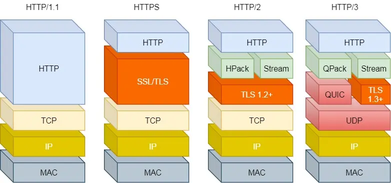
> 图：HTTP请求的队头阻塞问题 相关截图

## HTTP优化

### http1.1优化

- 尽量避免发送 HTTP 请求

- 在需要发送 HTTP 请求时，考虑如何减少请求次数

- 减少服务器的 HTTP 响应的数据大小

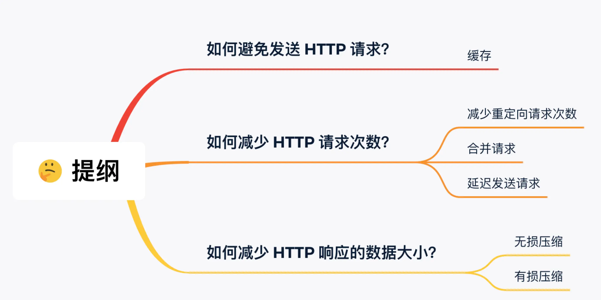
> 图：http1.1优化 相关截图

延迟发送：按需加载，用户滚动的时候再请求加载

第一个思路是，通过缓存技术来避免发送 HTTP 请求。客户端收到第一个请求的响应后，可以将其缓存在本地磁盘，下次请求的时候，如果缓存没过期，就直接读取本地缓存的响应数据。如果缓存过期，客户端发送请求的时候带上响应数据的摘要，服务器比对后发现资源没有变化，就发出不带包体的 304 响应，告诉客户端缓存的响应仍然有效。

第二个思路是，减少 HTTP 请求的次数，有以下的方法：

1. 将原本由客户端处理的重定向请求，交给代理服务器处理，这样可以减少重定向请求的次数；

1. 将多个小资源合并成一个大资源再传输，能够减少 HTTP 请求次数以及 头部的重复传输，再来减少 TCP 连接数量，进而省去 TCP 握手和慢启动的网络消耗；

1. 按需访问资源，只访问当前用户看得到/用得到的资源，当客户往下滑动，再访问接下来的资源，以此达到延迟请求，也就减少了同一时间的 HTTP 请求次数。

第三思路是，通过压缩响应资源，降低传输资源的大小，从而提高传输效率，所以应当选择更优秀的压缩算法

https优化

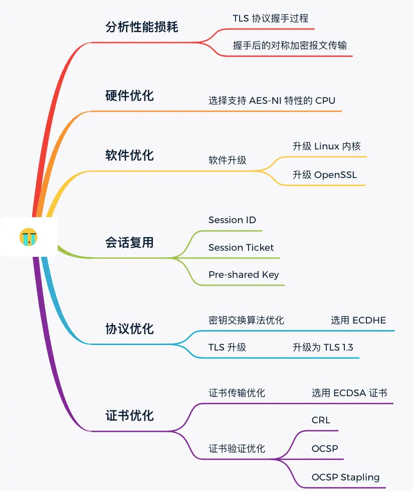
> 图：http1.1优化 相关截图

## ICMP

ICMP代表Internet Control Message Protocol（互联网控制消息协议）。它是TCP/IP协议套件的一部分，用于在IP网络上传输控制消息和错误消息。ICMP报文通常由网络设备（如路由器和主机）用于与其他设备通信和诊断网络问题。

ICMP报文的一些常见用途包括：

1. Ping测试：通过发送ICMP Echo请求消息并等待目标设备的响应，可以测试设备是否在线和可达。

1. 路由故障诊断：当数据包无法正确路由时，路由器可能会发送ICMP报文通知源设备或目标设备有关问题。

1. TTL（生存时间）控制：ICMP Time Exceeded报文通知数据包已经达到其生存时间限制，防止数据包无限制地在网络中循环。

1. 目的地不可达：当尝试到达的目标不可用时，ICMP Destination Unreachable报文用于通知发送方。

1. Redirect报文：用于告知主机要使用更适当的网关路由其数据包。

1. Fragmentation报文：用于处理分段和重组数据包的问题。

总之，ICMP报文在IP网络中起着重要的控制和诊断作用，帮助网络管理员和设备识别和解决问题。

## MTU 和 MSS

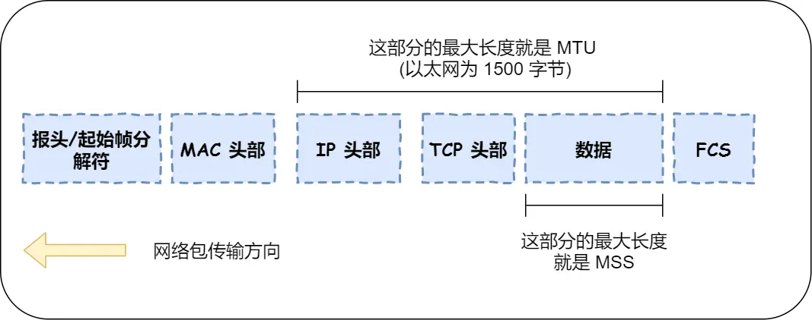
> 图：MTU 和 MSS 相关截图

MTU：一个网络包的最大长度，以太网中一般为 1500 字节

MSS：除去 IP 和 TCP 头部之后，一个网络包所能容纳的 TCP 数据的最大长度

如果在 TCP 的整个报文（头部 + 数据）交给 IP 层进行分片，会有什么异常呢？

当 IP 层有一个超过 MTU 大小的数据（TCP 头部 + TCP 数据）要发送，那么 IP 层就要进行分片，把数据分片成若干片，保证每一个分片都小于 MTU。把一份 IP 数据报进行分片以后，由目标主机的 IP 层来进行重新组装后，再交给上一层 TCP 传输层。

这看起来井然有序，但这存在隐患的，**那么当如果一个 IP 分片丢失，整个 IP 报文的所有分片都得重传**。

因为 IP 层本身没有超时重传机制，它由传输层的 TCP 来负责超时和重传。

当某一个 IP 分片丢失后，接收方的 IP 层就无法组装成一个完整的 TCP 报文（头部 + 数据），也就无法将数据报文送到 TCP 层，所以接收方不会响应 ACK 给发送方，因为发送方迟迟收不到 ACK 确认报文，所以会触发超时重传，就会重发「整个 TCP 报文（头部 + 数据）」。

因此，可以得知由 IP 层进行分片传输，是非常没有效率的。

所以，为了达到最佳的传输效能 TCP 协议在**建立连接的时候通常要协商双方的 MSS 值**，当 TCP 层发现数据超过 MSS 时，则就先会进行分片，当然由它形成的 IP 包的长度也就不会大于 MTU ，自然也就不用 IP 分片了。

## RTO

RTO代表"Retransmission Timeout"（重传超时），是TCP（传输控制协议）中的一个重要概念。RTO是指在没有接收到来自另一端的确认（ACK）时，发送方等待的时间间隔，超过这个时间间隔后，发送方会假定之前发送的数据包丢失或损坏，并尝试重新发送这些数据包。

RTO的计算和管理对于TCP的可靠数据传输非常关键。TCP通过监测网络的往返时间（Round-Trip Time，RTT）来动态地调整RTO的值。通常，RTO的计算基于以下几个因素：

1. RTT的测量：TCP定期测量数据包的往返时间，通常使用三次握手和数据包的ACK来计算RTT。

1. 平滑加权平均：TCP使用平滑加权平均来计算RTT的估计值，以避免对网络抖动的过度敏感。

1. RTO倍增：当发生超时时，TCP会将RTO值加倍，以避免在网络瞬时拥塞的情况下过于频繁地重传。

1. 超时后退：如果连续发生超时，TCP会根据网络状况采取更加保守的策略，逐渐增加RTO的值，以减少网络拥塞的影响。

RTO的正确计算和管理有助于TCP在不同网络条件下实现可靠的数据传输。它是TCP协议的一部分，用于确保数据的可靠性和顺序传输

## TCP 半连接和全连接队列

在 TCP 三次握手的时候，Linux 内核会维护两个队列，分别是：

- 半连接队列，也称 SYN 队列；

- 全连接队列，也称 accept 队列；

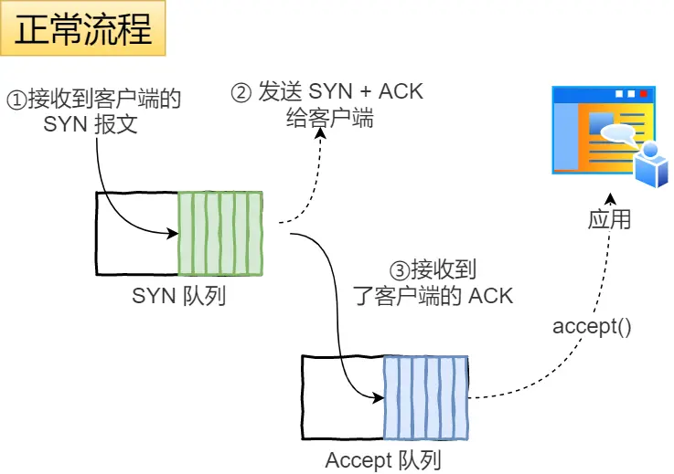
> 图：TCP 半连接和全连接队列 相关截图

正常流程：

- 当服务端接收到客户端的 SYN 报文时，会创建一个半连接的对象，然后将其加入到内核的「 SYN 队列」；

- 接着发送 SYN + ACK 给客户端，等待客户端回应 ACK 报文；

- 服务端接收到 ACK 报文后，从「 SYN 队列」取出一个半连接对象，然后创建一个新的连接对象放入到「 Accept 队列」；

- 应用通过调用 accpet()  socket 接口，从「 Accept 队列」取出连接对象

不管是半连接队列还是全连接队列，都有最大长度限制，超过限制时，默认情况都会丢弃报文。

SYN 攻击方式最直接的表现就会把 TCP 半连接队列打满，这样**当 TCP 半连接队列满了，后续再在收到 SYN 报文就会丢弃**，导致客户端无法和服务端建立连接。

避免 SYN 攻击方式，可以有以下四种方法：

- 调大 netdev_max_backlog；

当网卡接收数据包的速度大于内核处理的速度时，会有一个队列保存这些数据包。控制该队列的最大值如下参数，默认值是 1000，我们要适当调大该参数的值，比如设置为 10000：

```
net.core.netdev_max_backlog = 10000
```

- 增大 TCP 半连接队列；

增大 TCP 半连接队列，要同时增大下面这三个参数：

- 增大 net.ipv4.tcp_max_syn_backlog

- 增大 listen() 函数中的 backlog

- 增大 net.core.somaxconn

- 开启 tcp_syncookies；

开启 syncookies 功能就可以在不使用 SYN 半连接队列的情况下成功建立连接，相当于绕过了 SYN 半连接来建立连接。

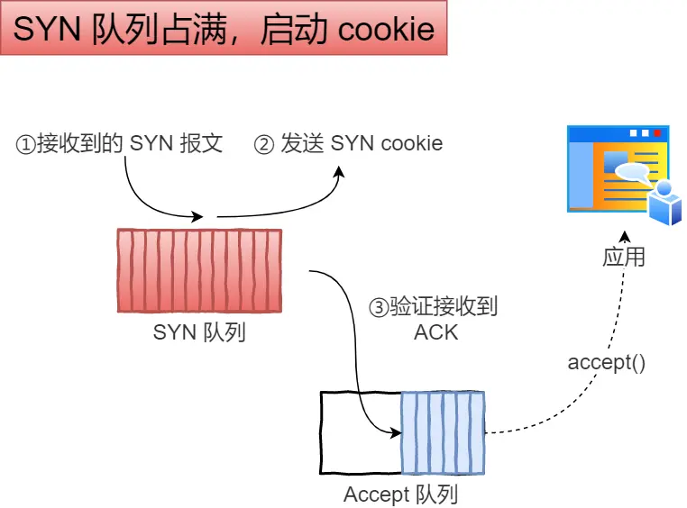
> 图：TCP 半连接和全连接队列 相关截图

具体过程：

- 当 「 SYN 队列」满之后，后续服务端收到 SYN 包，不会丢弃，而是根据算法，计算出一个 cookie 

- 将 cookie 值放到第二次握手报文的「序列号」里，然后服务端回第二次握手给客户端；

- 服务端接收到客户端的应答报文时，服务端会检查这个 ACK 包的合法性。如果合法，将该连接对象放入到「 Accept 队列」。

- 最后应用程序通过调用 accpet() 接口，从「 Accept 队列」取出的连接

可以看到，当开启了 tcp_syncookies 了，即使受到 SYN 攻击而导致 SYN 队列满时，也能保证正常的连接成功建立。

net.ipv4.tcp_syncookies 参数主要有以下三个值：

- 0 值，表示关闭该功能；

- 1 值，表示仅当 SYN 半连接队列放不下时，再启用它；

- 2 值，表示无条件开启功能；

那么在应对 SYN 攻击时，只需要设置为 1 即可。

```
$ echo 1 > /proc/sys/net/ipv4/tcp_syncookies
```

- 减少 SYN+ACK 重传次数

- 当服务端受到 SYN 攻击时，就会有大量处于 SYN_REVC 状态的 TCP 连接，处于这个状态的 TCP 会重传 SYN+ACK ，当重传超过次数达到上限后，就会断开连接。

那么针对 SYN 攻击的场景，我们可以减少 SYN-ACK 的重传次数，以加快处于 SYN_REVC 状态的 TCP 连接断开。

SYN-ACK 报文的最大重传次数由 tcp_synack_retries内核参数决定（默认值是 5 次），比如将 tcp_synack_retries 减少到 2 次：

```
$ echo 2 > /proc/sys/net/ipv4/tcp_synack_retries
```

## HTTP2

帧：HTTP/2 数据通信的最小单位消息：指 HTTP/2 中逻辑上的 HTTP 消息。例如请求和响应等，消息由一个或多个帧组成。

流：存在于连接中的一个虚拟通道。流可以承载双向消息，每个流都有一个唯一的整数ID。

HTTP/2 采用二进制格式传输数据，而非 HTTP 1.x 的文本格式，二进制协议解析起来更高效。 HTTP / 1 的请求和响应报文，都是由起始行，首部和实体正文（可选）组成，各部分之间以文本换行符分隔。HTTP/2 将请求和响应数据分割为更小的帧，并且它们采用二进制编码。

HTTP/2 中，同域名下所有通信都在单个连接上完成，该连接可以承载任意数量的双向数据流。每个数据流都以消息的形式发送，而消息又由一个或多个帧组成。多个帧之间可以乱序发送，根据帧首部的流标识可以重新组装。

## HTTP/3 与 QUIC

HTTP/2 仍基于 TCP，存在**队头阻塞**（丢包时 TCP 层重传会阻塞该连接上所有流）。HTTP/3 将传输层换成 **QUIC（基于 UDP）**：

- **多路复用无队头阻塞**：QUIC 在 UDP 之上实现可靠传输，每个流独立，某个流丢包只重传该流。
- **0-RTT / 1-RTT 建连**：QUIC 将 TLS 1.3 握手与传输握手合并，且支持会话恢复后的 **0-RTT** 发送数据；首次建连 1-RTT。
- **连接迁移**：用 **Connection ID** 标识连接，切换网络（如 Wi-Fi→4G）IP 变了但连接不中断，解决 TCP 基于四元组导致的重连问题。
- **内置拥塞控制与加密**：QUIC 原生加密，避免 TCP 中间设备篡改。

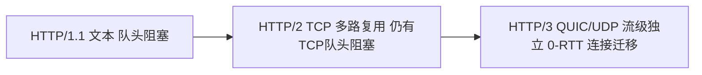

## TLS 握手细节（TLS 1.2 vs 1.3）

- **RSA 密钥交换（1.2 旧式）**：2-RTT；但**不支持前向安全**——服务器私钥泄露可解密历史流量。
- **ECDHE 密钥交换（1.2/1.3）**：服务端签发临时公钥，双方各自生成临时密钥对，ECDHE 协商出会话密钥；支持**前向安全**。
  - TLS 1.2 + ECDHE：1-RTT（ClientHello → ServerHello+证书+ServerKeyExchange → ClientKeyExchange → Finished）。
  - **TLS 1.3**：精简为 1-RTT，并支持 **0-RTT**（会话恢复时客户端首包即带数据）；废除静态 RSA、RC4、SHA1 等弱算法。

握手核心：非对称加密仅用于**协商对称密钥**与**身份认证（证书）**，之后用对称加密（AES-GCM/ChaCha20）传输应用数据，兼顾安全与性能。

## TCP 疑难与生产

- **大量 TIME_WAIT**：高并发短连接服务端常见。调优：`net.ipv4.tcp_tw_reuse=1`（客户端安全复用）、`tcp_max_tw_buckets` 限上限；根本解法——使用长连接 / 连接池。
- **全连接队列溢出**：`ss -lnt` 看 `Recv-Q` 是否持续满；`net.core.somaxconn` 与 `listen()` backlog 调大；溢出则丢弃新连接，表现为偶发连接失败。
- **SYN Flood**：开启 `tcp_syncookies=1`，减小 `tcp_synack_retries`。
- **Nagle 与延迟确认**：小包交互场景关 `TCP_NODELAY` 避免 40ms 延迟。

## 面试高频

1. **HTTPS = HTTP + TLS**，解决窃听/篡改/冒充；证书链验证 + 非对称协商对称密钥。
2. **TCP 可靠靠**：序列号/确认应答、超时重传、滑动窗口（流量控制）、拥塞控制（慢开始/拥塞避免/快重传/快恢复）。
3. **epoll 优势**：红黑树管理 fd + 就绪链表返回事件，O(1) 事件获取，支撑 C10K/C10M；边缘触发（ET）需一次读尽。
4. **IO 模型**：阻塞/非阻塞/IO 多路复用/信号驱动/异步 IO（AIO）；Netty 基于多路复用 + 主从 Reactor。

---

# 第二轮深度优化：QUIC 深入 / eBPF 可观测 / 零拷贝 / BBR / DNS 解析链

> 前文已述 HTTP/3 演进与 TLS 1.3 握手，本节深入 QUIC、补 eBPF、零拷贝、BBR、DNS。

## 一、QUIC 与 HTTP/3 深入

- **为什么需要 QUIC**：TCP 队头阻塞（一个丢包阻塞整个连接的所有流）、建连慢（TCP + TLS 多次 RTT）、连接绑定四元组（IP 变了要重建）。QUIC 跑在 **UDP** 上，把可靠传输、加密、多路复用自己实现。
- **核心特性**：
  - **流级多路复用**：一条 QUIC 连接内多个 stream 独立，某个 stream 丢包**只阻塞该流**，不阻塞其他（解决 HTTP/2 的 TCP 队头阻塞）。
  - **0-RTT 连接迁移**：用连接 ID（Connection ID）标识连接，切换网络（WiFi→4G）IP 变了也不丢连接；会话恢复可 0-RTT 带数据。
  - **1-RTT 握手**：QUIC 把加密与传输握手合并，首次 1-RTT、恢复 0-RTT（比 TCP+TLS 1.3 的 1-RTT 还省，因为不用先建 TCP）。
  - **内置加密**：QUIC 包默认加密（含包头部分），防中间设备篡改/嗅探。
- **代价**：UDP 在部分网络被限流/丢包；用户态实现拥塞控制更灵活但 CPU 略高；NAT 对 UDP 映射不友好。

```mermaid
flowchart LR
    A[应用 HTTP/3] --> B[QUIC(UDP)]
    B --> C[流1 流2 流3 独立]
    C --> D[丢失只影响流1]
    B --> E[Connection ID 标识 连接迁移不中断]
```

## 二、eBPF 可观测（网络排障）

- **eBPF**：Linux 内核虚拟机，可在不改内核源码、不装内核模块的前提下，挂载探针（kprobe/uprobe/tracepoint）到套接字、系统调用、网络栈，安全采集数据。
- **网络排障实战**：
  - `tcpdump`/`libpcap` 抓包（底层也走内核旁路）；
  - **bcc / bpftrace** 工具：看 TCP 重传（`tcpretrans`）、连接延迟、各阶段耗时；
  - **socket 级延迟**：追踪 `tcp_sendmsg`/`tcp_receive` 进内核到出网卡的耗时，定位是应用慢还是网络慢；
  - **服务网格**：Cilium 用 eBPF 做 kube-proxy 替代、网络策略、可观测，性能优于 iptables。
- 价值：生产环境**无侵入**看内核态网络行为，定位"丢包/重传/队头阻塞/延迟发生在哪一段"。

## 三、零拷贝（Zero-Copy）

- **传统读-发**：`read()` 磁盘 → 内核缓冲区 → 用户缓冲区；`write()` 用户缓冲区 → socket 缓冲区 → 网卡。共 **4 次拷贝 + 4 次上下文切换**，且数据在用户态绕了一圈。
- **`sendfile`**（Java `FileChannel.transferTo`）：内核内直接把文件页缓存搬到 socket 缓冲区，**省掉用户态拷贝**（DMA 拷贝仍有，但无 CPU 拷贝）。Kafka、Nginx 静态文件大量使用。
- **`mmap` + `write`**：文件映射到用户态虚拟内存，`write` 时仍要拷到 socket 缓冲区；适合既要读又要处理（如 RocketMQ 消费用 mmap 只读映射）。
- **`splice` / `tee`**：基于内核管道（pipe）在两个 fd 间零拷贝搬运，同样避免用户态往返。
- **`sendfile` with DMA gather**：连 socket 缓冲区的拷贝也省，仅描述符传递，真·零拷贝。结论：大文件/高吞吐传输优先 `sendfile`/`transferTo`，把 CPU 留给业务。

## 四、拥塞控制（BBR）

- **目的**：避免发送方压垮网络（丢包/排队），同时尽量用满带宽。
- **传统（Reno/CUBIC）**：基于**丢包**判断拥塞——丢包才降窗。问题：现代网络（大 BDP、缓冲区大）下，丢包往往是"缓冲膨胀（bufferbloat）"而非真拥塞，导致吞吐骤降、延迟高。
- **BBR（Bottleneck Bandwidth and RTT，Google）**：基于**测量**带宽与最小 RTT，建模出 BDP（带宽×时延），主动把发送量控制在"不排队"的水平（`BtlBw × minRTT`）。收益：高带宽长延迟链路（跨洲、卫星）下吞吐高、延迟低、不依赖丢包信号。Linux 4.9+ 可 `sysctl net.ipv4.tcp_congestion_control=bbr` 开启。
- **对比**：CUBIC 在短肥管道与老网络仍稳；BBR 在长肥管道（高 BDP）优势明显；生产可按链路特征选择。

## 五、DNS 解析链

- **查询类型**：**递归查询**（客户端→本地 DNS，本地 DNS 替你问到底）、**迭代查询**（DNS 服务器间互相指向下一步）。
- **解析链**（以 `www.example.com` 为例）：
  1. 浏览器/OS 缓存 → 命中即返回；
  2. 本地 DNS 解析器（通常是运营商/公共 DNS 如 8.8.8.8 / 223.5.5.5）；
  3. **根 DNS**（`.`）：返回 `.com` 顶级域（TLD）服务器地址；
  4. **TLD 服务器**（`com.`）：返回 `example.com` 的**权威 DNS**（Authoritative）地址；
  5. **权威 DNS**：返回 `www.example.com` 的 A/AAAA 记录（或 CNAME）；
  6. 结果经各级**缓存**（TTL 生效）回到客户端。
- **关键概念**：`A`/`AAAA`（IPv4/IPv6）、`CNAME`（别名）、`TTL`（缓存时长，改解析后生效时间由它决定）、`MX`（邮件）、`NS`（权威服务器）、`TXT`（校验/SPF）。
- **排障**：`dig +trace www.example.com` 看完整链路；`nslookup` 看解析结果；TTL 过大会让切换 IP 生效慢，关键业务用较短 TTL + 灰度切流。

## 六、HTTP 缓存与 WebSocket

- **缓存**：强缓存（`Cache-Control: max-age` / `Expires`）免请求；协商缓存（`ETag` / `Last-Modified`，304 省带宽）；`no-cache`（需校验）/ `no-store`（不存）；`must-revalidate` 过期后必回源。
- **WebSocket**：基于 HTTP `Upgrade` 的全双工长连接；心跳 ping/pong 保活；适合聊天/推送/实时行情；连接数大需 ws 网关横向扩展。
- **长轮询 vs SSE**：SSE（Server-Sent Events）服务端单向推，基于 HTTP，简单；长轮询兼容老浏览器但浪费连接。

## 七、负载均衡 L4 / L7

- **L4**（传输层，IP+端口，如 LVS/DPVS/云 SLB）：性能好、不感知内容；**L7**（应用层，URL/Header/Cookie，如 Nginx/Envoy）：可按内容路由、灰度、rewrite、WAF。
- **算法**：轮询/加权/最少连接/一致性哈希（会话保持、缓存亲和）；gRPC 用 `pick_first`/`round_robin` 或基于方法的 LB。

## 八、CDN 与容器网络

- **CDN**：边缘节点缓存静态/可缓存内容，就近回源，降低源站压力与 RTT；注意缓存刷新策略、回源鉴权、动静分离（动态走源站/网关）。
- **容器网络**：网络命名空间（netns）隔离；veth pair + bridge 连通；iptables/eBPF 做 NAT 与策略；K8s Service 的 ClusterIP 靠 iptables / IPVS 实现负载与转发。

## 九、TCP 保活与连接管理

- **SO_KEEPALIVE**：探测死连接（默认 2 小时，可调 `tcp_keepalive_time`）；但粒度粗，应用层心跳（如 WebSocket ping、MQ heart-beat）更可控。
- **TIME_WAIT**：确保最后 ACK 到达、旧报文消散；高并发短连接服务端用 `tcp_tw_reuse`（客户端）+ 长连接/`tcp_max_tw_buckets` 缓解；`tcp_fin_timeout` 调小加速回收。
- **连接池**：HTTP 客户端/DB 驱动复用长连接，避免每次建连的 TCP+TLS 开销；池大小按并发与后端容量设。

## 十、TCP/TLS/HTTP3 排障与高阶实战（第三轮深度补充）

### 10.1 一次 TCP 重传/丢包导致 RT 飙高排查

**现象**：某接口 RT 偶发从 20ms 飙到 1s+，下游服务端处理很快，问题在链路上。

**排查链路**：
1. `ss -tni` 看连接 `rtt` / `retrans` / `cwnd`，若 `retrans` 持续增长说明在重传。
2. `netstat -s | grep -i retrans` 看系统级重传段数；`cat /proc/net/netstat | grep TcpExt` 看 `TCPLostRetransmit`、`TCPFastRetrans`。
3. `tcpdump -i eth0 -nn 'host <对端IP>' -w cap.pcap` 抓包，Wireshark 看 `TCP Retransmission` / `Duplicate ACK` / `Out-of-Order` → 确认丢包点；`tcp.analysis.rtt` 看实际 RTT。
4. 定位丢包段：`mtr <对端IP>`（结合 `traceroute`）看哪一跳丢包/高延迟；云上多为跨可用区/跨地域链路或中间设备限速。
5. **治理**：启用 BBR（`sysctl net.ipv4.tcp_congestion_control=bbr`）缓解 bufferbloat；调大 `tcp_rmem/tcp_wmem`；长肥管道用 `tcp_window_scaling=1`；必要时换链路/加专线。

### 10.2 TLS 握手失败与证书链问题实战

- **握手超时/失败**：`openssl s_client -connect host:443 -servername host` 看握手详情与证书；`-tls1_2`/`-tls1_3` 指定版本验证兼容性。
- **证书链不全**：服务端只发叶子证书漏了中间 CA → 客户端验证失败（浏览器报 NET::ERR_CERT_AUTHORITY_INVALID）。用 `openssl s_client -showcerts` 确认链完整；Nginx 配 `ssl_trusted_certificate` 带全链。
- **SNI / 域名不匹配**：多域名共用 IP 必须 `servername` 指示，否则返回默认证书导致 SAN 不匹配。
- **证书过期/时钟漂移**：`openssl x509 -in cert.pem -noout -dates` 查有效期；客户端与服务端时钟差 > 5min 也会验签失败。
- **TLS 1.3 0-RTT 重放攻击**：0-RTT 数据可重放，只用于幂等读，禁止用于写/交易。

### 10.3 HTTP/2 队头阻塞与 HTTP/3 QUIC 落地

- **HTTP/2 队头阻塞（HOL）**：应用层多路复用单连接，但**传输层仍是一条 TCP**——任一包丢失，整连接所有流都等重传（TCP 级 HOL）。高丢包链路下 HTTP/2 可能比 HTTP/1.1 多连接还慢。
- **HTTP/3 / QUIC**：基于 **UDP**，在 QUIC 层做可靠传输与流控，流之间独立——一个流丢包不影响其他流（解决传输层 HOL）；0-RTT 建连（首次 1-RTT，恢复 0-RTT）；内置 TLS 1.3、连接迁移（换 IP 不断流，移动端友好）。
- **落地**：Nginx 1.25+ `listen 443 quic; http3 on;` + 证书；客户端（现代浏览器/curl ≥7.66）自动协商；边缘/CDN（Cloudflare/阿里云）已普遍支持。注意 UDP 在部分内网被限速需评估。

### 10.4 eBPF 做网络可观测实战

- **价值**：eBPF 在内核挂载，零侵入观察系统调用/套接字/TCP 事件，无需改代码、几乎零开销。
- **工具**：
  - `bcc`/`bpftrace`：`tcplife`（连接生命周期与吞吐）、`tcpdrop`（看谁丢弃连接及原因）、`tcpconnect`（主动建连）、`biosnoop` 排除磁盘。
  - `cilium`（K8s 网络可观测与网络策略）、`Pixie`（自动抓 pod 间流量与延迟）。
  - `openssl` 层用 `uprobe` 抓 TLS 明文（排障利器，注意合规）。
- **实战**：`/usr/share/bcc/tools/tcplife -p <pid>` 一眼看出某进程每个 TCP 连接的 RTT、吞吐、时长，定位"慢连接"比 `tcpdump` 更聚焦。

### 10.5 TIME_WAIT 堆积治理

- **成因**：主动关闭方进入 `TIME_WAIT`（默认 2*MSL ≈ 60s），高并发短连接（如每次请求新建连接）会堆积上万 `TIME_WAIT`，占满端口范围 → `Cannot assign requested address`。
- **治理**：
  - 首选**复用长连接 / 连接池**（根治，避免频繁建连）。
  - `net.ipv4.tcp_tw_reuse=1`（客户端安全，复用 TIME_WAIT 连接，RFC 允许带时间戳）；
  - 调小 `net.ipv4.tcp_fin_timeout`、`net.ipv4.tcp_max_tw_buckets` 限制总数；
  - **禁止** `tcp_tw_recycle`（已废弃，NAT 下造成连接失败）。
  - 服务端短连接考虑 `SO_REUSEADDR` + 端口范围扩大 `net.ipv4.ip_local_port_range`。

### 10.6 多活跨地域网络延迟优化

- **延迟本质**：光速上限，京沪 ~30ms RTT、跨国 ~150~200ms RTT；物理距离不可压缩，只能"让请求就近 + 减少往返"。

> 协议设计（RPC/gRPC/序列化）、TCP 参数调优与协议选型详见「[网络协议深挖](网络协议深挖.md)」。
- **优化手段**：
  - **就近接入**：DNS 按地域解析 / Anycast，用户连最近接入点。
  - **减少 RTT 次数**：合并请求、pipeline、批量接口，避免"一接口 N 次跨城往返"；用 gRPC 流式替代多次请求。
  - **单元化/就近闭环**：用户请求在本地单元完成，跨城调用只做异步同步（最终一致），而非强一致同步写。
  - **数据同步**：用 MGR/Paxos 跨城异步复制，读本地、写本地单元 + 异步广播；冲突用版本/业务规则解决。
  - **协议层**：跨城用 HTTP/3 QUIC 减少握手与 HOL；BBR 拥塞控制提升长肥管道吞吐。

## 网络协议性能对比

### TCP vs QUIC vs WebSocket

```
TCP vs QUIC vs WebSocket 性能对比：
  TCP：
    ├── 连接建立：1 RTT（三次握手）
    ├── 加密：需要 TLS（1-2 RTT）
    ├── 多路复用：不支持（需要多连接）
    ├── 队头阻塞：单连接阻塞
    └── 连接迁移：不支持

  QUIC：
    ├── 连接建立：0-1 RTT
    ├── 加密：内置 TLS 1.3
    ├── 多路复用：支持（流独立）
    ├── 队头阻塞：无（流级别独立）
    └── 连接迁移：支持（Connection ID）

  WebSocket：
    ├── 连接建立：1 RTT（HTTP Upgrade）
    ├── 加密：需要 TLS
    ├── 多路复用：单连接
    ├── 队头阻塞：有
    └── 连接迁移：不支持

性能测试数据（100ms RTT，1% 丢包）：
  TCP：吞吐下降 40%
  QUIC：吞吐下降 10%
  WebSocket：吞吐下降 40%

适用场景：
  TCP：通用传输、数据库连接
  QUIC：移动应用、CDN、实时应用
  WebSocket：浏览器实时通信、聊天
```

### HTTP 版本对比

```
HTTP/1.0 vs HTTP/1.1 vs HTTP/2 vs HTTP/3 对比：
  HTTP/1.0：
    ├── 连接：短连接（每请求建连）
    ├── 多路复用：不支持
    ├── 头部压缩：不支持
    ├── 服务器推送：不支持
    └── 队头阻塞：严重

  HTTP/1.1：
    ├── 连接：长连接（Keep-Alive）
    ├── 多路复用：管道化（有队头阻塞）
    ├── 头部压缩：不支持
    ├── 服务器推送：不支持
    └── 队头阻塞：有（管道化）

  HTTP/2：
    ├── 连接：长连接
    ├── 多路复用：支持（帧级别）
    ├── 头部压缩：HPACK
    ├── 服务器推送：支持
    └── 队头阻塞：传输层 TCP 阻塞

  HTTP/3：
    ├── 连接：QUIC 长连接
    ├── 多路复用：支持（流级别独立）
    ├── 头部压缩：QPACK
    ├── 服务器推送：支持
    └── 队头阻塞：无

性能对比：
  HTTP/1.1：每连接 1 请求（串行）
  HTTP/2：每连接多请求（并行）
  HTTP/3：并行 + 无 HOL + 快速建连
```

## 网络安全防护

### DDoS 防护策略

```
DDoS 防护层次：
  1. 网络层防护
     ├── 流量清洗：云服务商 DDoS 防护（如阿里云 DDoS 高防）
     ├── 限速：基于 IP/端口/协议限速
     ├── 黑洞：攻击流量直接丢弃
     └── Anycast：分散攻击流量

  2. 应用层防护
     ├── WAF：Web 应用防火墙
     ├── 验证码：人机验证
     ├── 限流：令牌桶/漏桶算法
     └── IP 黑名单：封禁恶意 IP

  3. 架构层防护
     ├── CDN：分散流量
     ├── 负载均衡：分担压力
     ├── 多地域部署：分散攻击
     └── 弹性伸缩：自动扩容

攻击类型与防护：
  ├── SYN Flood：SYN Cookie、减少重试
  ├── UDP Flood：限速、黑洞路由
  ├── HTTP Flood：WAF、验证码、限流
  ├── CC 攻击：IP 限速、行为分析
  └── DNS 放大攻击：关闭递归查询
```

### TLS 1.3 安全配置

```bash
# Nginx TLS 1.3 配置
ssl_protocols TLSv1.2 TLSv1.3;
ssl_ciphers ECDHE-ECDSA-AES128-GCM-SHA256:ECDHE-RSA-AES128-GCM-SHA256:ECDHE-ECDSA-AES256-GCM-SHA384:ECDHE-RSA-AES256-GCM-SHA384;
ssl_prefer_server_ciphers on;

# TLS 1.3 特性
# 1. 握手简化：1-RTT（首次）/ 0-RTT（恢复）
# 2. 密码套件简化：仅保留 AEAD 密码
# 3. 前向保密：所有密码套件都支持 PFS
# 4. 0-RTT 恢复：快速建连（注意重放攻击）

# 证书配置
ssl_certificate /path/to/fullchain.pem;
ssl_certificate_key /path/to/privkey.pem;
ssl_trusted_certificate /path/to/chain.pem;

# OCSP Stapling
ssl_stapling on;
ssl_stapling_verify on;
resolver 8.8.8.8 8.8.4.4 valid=300s;

# HSTS
add_header Strict-Transport-Security "max-age=63072000; includeSubDomains; preload" always;
```

## 网络深度篇

### TCP 三次握手与四次挥手（半连接队列/全连接队列排查）

```
三次握手流程：
  客户端 → SYN → 服务器（半连接队列）
  服务器 → SYN+ACK → 客户端
  客户端 → ACK → 服务器（全连接队列）

四次挥手流程：
  主动方 → FIN → 被动方
  被动方 → ACK → 主动方（半关闭）
  被动方 → FIN → 主动方
  主动方 → ACK → 被动方（TIME_WAIT）

队列排查：
  半连接队列（SYN Queue）：netstat -s | grep "SYNs to LISTEN"
  全连接队列（Accept Queue）：ss -ltn | grep "Send-Q"
  队列满：dmesg | grep " SYN"
```

### HTTP/2 多路复用与 HTTP/3 QUIC 原理

| 特性 | HTTP/1.1 | HTTP/2 | HTTP/3 |
|------|----------|--------|--------|
| 连接 | 一请求一连接 | 多路复用 | 多路复用 |
| 传输 | 文本 | 二进制帧 | 二进制流 |
| 头部 | 重复传输 | HPACK 压缩 | QPACK 压缩 |
| 队头阻塞 | 有 | 有（TCP层） | 无（UDP） |
| 拥塞控制 | TCP | TCP | QUIC 内置 |

### HTTPS/TLS 1.3 握手流程与会话恢复

```
TLS 1.3 握手（1-RTT）：
  客户端 → ClientHello（支持的密码套件、密钥分享）→ 服务器
  服务器 → ServerHello（选定密码套件、密钥分享）→ 客户端
  双方计算主密钥，开始加密通信

TLS 1.3 会话恢复（0-RTT）：
  客户端 → ClientHello + PSK 标签 → 服务器
  服务器 → 验证 PSK，直接加密通信

TLS 1.3 优势：
  握手简化：1-RTT（首次）/ 0-RTT（恢复）
  密码套件简化：仅保留 AEAD 密码
  前向保密：所有密码套件都支持 PFS
```

### DNS 解析（递归/迭代/预解析优化）

```
DNS 解析流程：
  客户端 → 递归解析器（本地DNS）
  递归解析器 → 根域名服务器 → 顶级域名服务器 → 权威域名服务器
  结果返回客户端

预解析优化：
  DNS 预解析：<link rel="dns-prefetch" href="//example.com">
  预连接：<link rel="preconnect" href="https://example.com">
  HTTP/2 Server Push：服务器主动推送资源
```

### CDN 加速原理（回源/缓存/边缘计算）

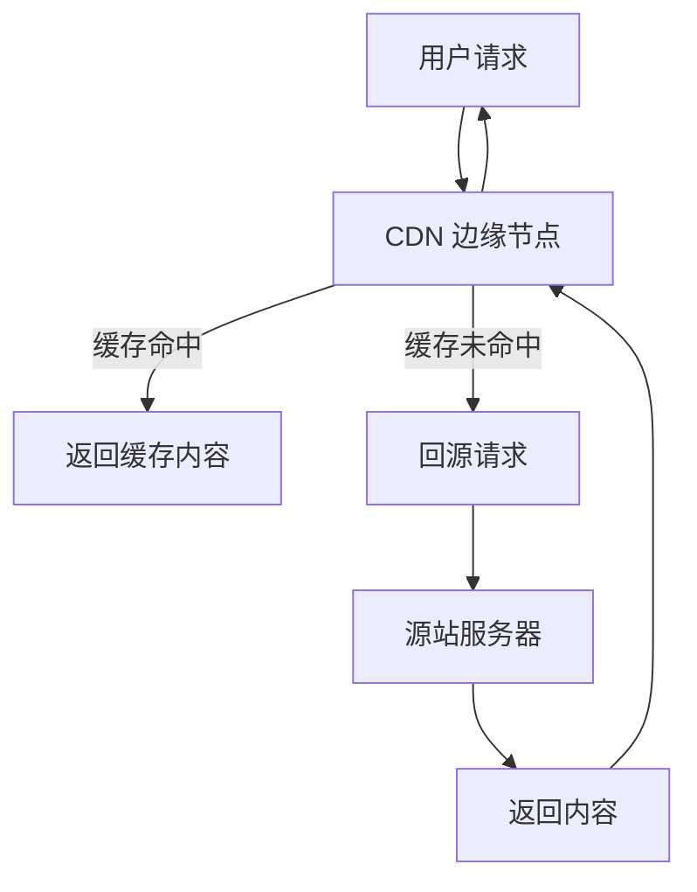

### 负载均衡（L4 vs L7/会话保持/健康检查）

| 维度 | L4 负载均衡 | L7 负载均衡 |
|------|-------------|-------------|
| 工作层 | TCP/UDP 层 | HTTP 层 |
| 性能 | 极高（硬件加速） | 高（软件实现） |
| 功能 | 端口转发、连接数限制 | URL 路由、Header 改写 |
| 会话保持 | IP Hash | Cookie/Session ID |
| 健康检查 | TCP 连接检查 | HTTP 状态码检查 |
| 适用 | 数据库、Redis | Web 应用、API |

## 网络性能测试工具

### 带宽测试

```bash
# iperf3 带宽测试
# 服务端
iperf3 -s

# 客户端（TCP）
iperf3 -c <server-ip> -t 30 -P 8  # 8 并发，30 秒

# 客户端（UDP）
iperf3 -c <server-ip> -u -b 1G -t 30  # 1Gbps UDP

# netperf 延迟测试
netperf -H <server-ip> -t TCP_RR  # 请求响应延迟
netperf -H <server-ip> -t TCP_STREAM  # 吞吐

# 延迟测试
# mtr 综合测试
mtr -r -c 100 <server-ip>

# ping 延迟
ping -c 100 <server-ip>

# HTTP 延迟
curl -o /dev/null -s -w "dns: %{time_namelookup}s\nconnect: %{time_connect}s\nssl: %{time_appconnect}s\nttfb: %{time_starttransfer}s\ntotal: %{time_total}s\n" <url>
```

### 压力测试

```bash
# wrk HTTP 压力测试
wrk -t4 -c100 -d30s http://localhost:8080/api/test

# hey HTTP 压力测试
hey -n 10000 -c 200 -z 30s http://localhost:8080/api/test

# ab (Apache Benchmark)
ab -n 10000 -c 200 http://localhost:8080/api/test

# 压力测试指标
# QPS (Queries Per Second)：每秒请求数
# RT (Response Time)：响应时间（P50/P95/P99）
# 错误率：失败请求比例
# 吞吐：每秒传输数据量

# 分析要点
# 1. QPS 是否达到瓶颈
# 2. 延迟是否稳定（P99 是否飙升）
# 3. 错误率是否可接受
# 4. 资源使用是否合理（CPU/内存/网络）
```

## 与其他板块的关系

- **安全**：网络安全是认证授权、加密传输的基础，与安全板块紧密关联
- **操作系统**：网络协议栈实现依赖操作系统内核，cgroup限制网络带宽
- **Linux排查**：网络故障排查（netstat/ss/tcpdump）是Linux排查核心能力
- **分布式系统**：网络分区、超时、重试是分布式系统设计核心考量
- **微服务**：服务间通信（HTTP/gRPC）基于网络协议，网关是流量入口
- **云平台**：云网络（VPC/子网/安全组）是云上架构基础

---

## 一句话

> 网络是分布式系统的神经系统，理解协议栈每一层的语义与陷阱，是排查线上故障和设计高可用架构的前提。

---

## 回到目录

- [返回计算机基础总览](README.md)
