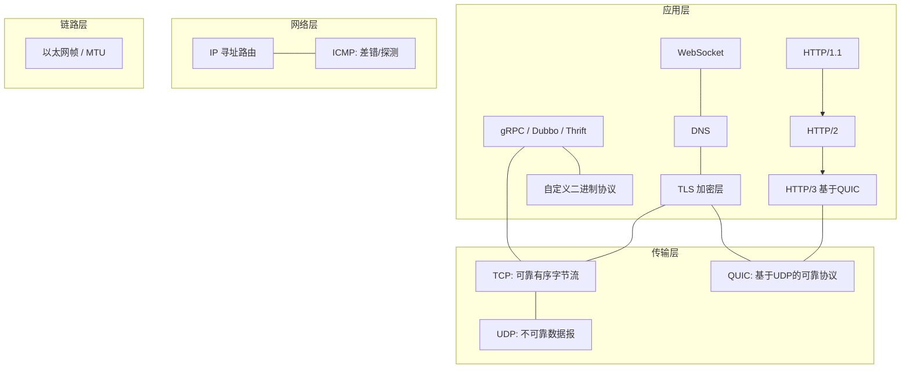
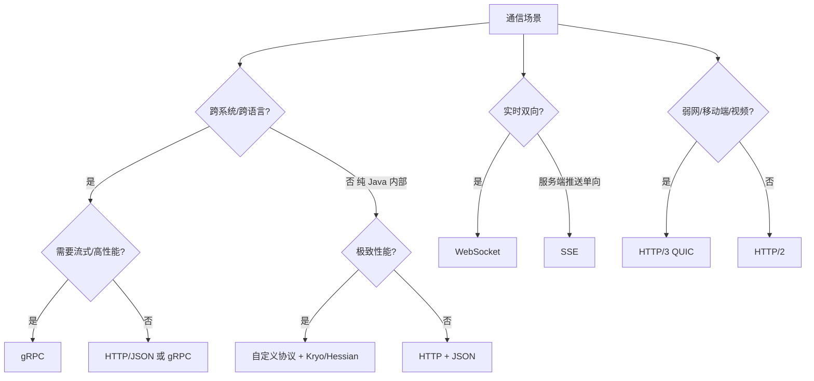
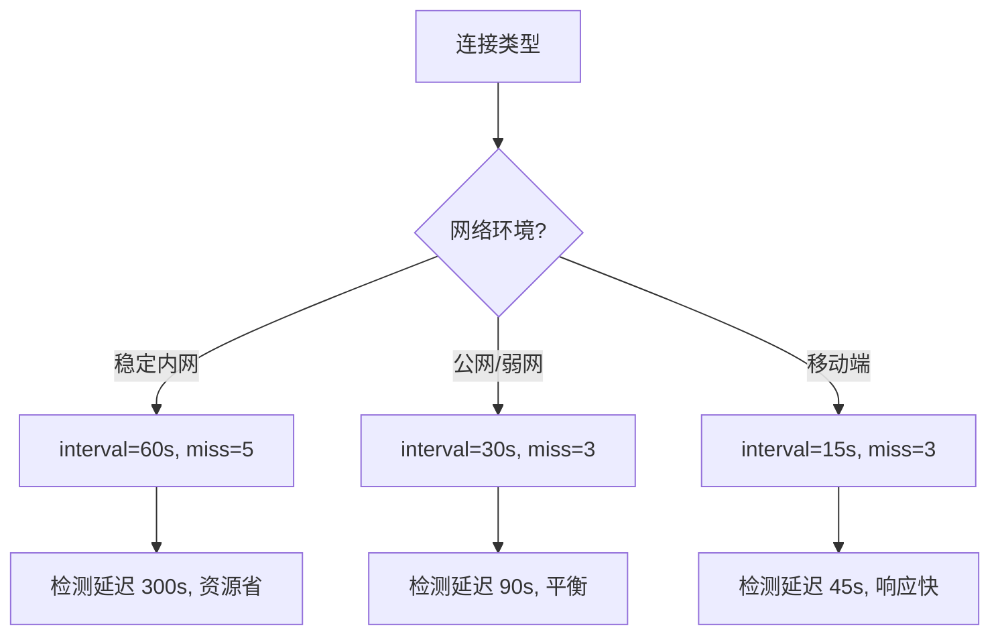

# 网络协议深挖（RPC / 序列化 / 传输细节 / 选型）

> 网络.md 讲清了 TCP/HTTP 的"基本盘"（握手、拥塞控制、HTTP 演进、排障），本文在它之上再深挖四层：**① RPC 与 gRPC 协议设计；② 序列化协议横向对比；③ TCP/HTTP 的传输细节与参数调优；④ 协议选型决策**。目标是把"用对协议、调对参数、说得清为什么"这三个工程能力补齐。
>
> 与基础知识其他文档互补：基础协议与握手见「[网络](网络.md)」、高并发 I/O 模型见「[操作系统](操作系统.md)」、IM/长连接应用层方案见「[场景设计/长连接](../场景设计/长连接.md)」、服务框架见「[源码系列/Dubbo源码](../源码系列/Dubbo源码.md)」。

---

## 一、网络协议全景（一张图定位所有协议）



**报文封装层级**：应用数据 → TLS 记录 → TCP 段（MSS）→ IP 包（MTU）→ 以太网帧。

> 关键词对照：**MTU**（链路层最大帧，典型 1500）> **MSS**（TCP 最大段 = MTU - 40，典型 1460）> **MSL**（报文最长生存，2MSL 决定 TIME_WAIT 时长）。三者是面试常挖的"三连"。

---

## 二、RPC：一次远程调用的完整链路

### 2.1 RPC 是什么

**RPC（Remote Procedure Call）**：让调用远程服务像调用本地方法一样。核心是"本地代理（stub）+ 网络传输 + 协议约定"。


**RPC 四要素**：

| 要素 | 说明 | 代表 |
|------|------|------|
| **IDL/接口契约** | 跨语言描述接口与数据结构 | ProtoBuf(.proto)、Thrift(.thrift)、OpenAPI |
| **序列化** | 对象 ↔ 字节流 | Protobuf、Thrift、Kryo、Hessian |
| **传输协议** | 报文格式 + 编解码 | HTTP/2、自定义长度域协议、TCP |
| **服务治理** | 注册发现/负载均衡/超时重试/熔断 | Nacos、Consul、etcd |

### 2.2 通用 RPC 报文格式（自定义协议模板）

```text
┌────────┬────────┬────────┬────────┬────────────┬──────────────┐
│ 魔数4B │ 版本1B │ 类型1B │ 序列化1B│ 请求ID 8B  │ 长度域4B      │
├────────┴────────┴────────┴────────┴────────────┴──────────────┤
│ 扩展字段(可选) / 业务数据体                                      │
└───────────────────────────────────────────────────────────────┘
```

- **魔数**：快速校验"这是我认识的协议"（防脏数据进入）。
- **请求 ID**：异步/多路复用时把响应匹配回请求（**半包/粘包与乱序都不怕**，靠 ID 对应）。
- **长度域**：解决**粘包/拆包**——一个请求发多少字节，接收方按长度切分（Netty 的 `LengthFieldBasedFrameDecoder` 即此）。
- 这也是很多中间件协议的样子（Dubbo 协议、RocketMQ 协议、Netty 示例）。

---

## 三、gRPC 深讲（HTTP/2 时代的 RPC 事实标准）

### 3.1 gRPC 的技术栈

| 层 | gRPC 用的 |
|----|-----------|
| 传输 | **HTTP/2**（多路复用、二进制帧、流式） |
| 序列化 | **Protobuf**（默认，可换） |
| IDL | `.proto` 文件 + `protoc` 生成各语言代码 |
| 服务发现/LB | 自有 resolver + xDS，或对接 Nacos/Consul |
| 加密 | TLS 内建（HTTP/2 强制要求 TLS 与否可选） |

### 3.2 四种调用模型（面试必问）

| 模型 | 形态 | 典型场景 |
|------|------|----------|
| **Unary（一元）** | 请求-响应，一次往返 | 普通 API、CRUD |
| **Server Streaming** | 发一次，收多条 | 订阅、大列表、日志推送 |
| **Client Streaming** | 发多条，收一次 | 上传大文件、聚合上报 |
| **Bidi Streaming** | 双向流 | 实时交互、聊天、推理中间结果 |

### 3.3 关键机制

- **连接复用**：一个 HTTP/2 连接上并发多个 stream（无队头阻塞于"请求级"，但有 **TCP 层队头阻塞**，故 HTTP/3 出现）。
- **超时与元数据**：`deadline`（截止时间）传播、`metadata` 传 traceId/认证。
- **重试**：幂等方法配置重试 + 指数退避；配合状态码（`UNAVAILABLE` 可重试，`INVALID_ARGUMENT` 不可）。
- **流控**：HTTP/2 窗口 + gRPC 流级窗口，双向。
- **与 Dubbo 对比**：

| 维度 | gRPC | Dubbo |
|------|------|-------|
| 传输 | HTTP/2 标准 | 自定义 TCP 二进制协议 |
| 序列化 | Protobuf（跨语言友好） | Hessian2/Kryo（Java 生态为主） |
| 跨语言 | 好（protoc 多语言） | 主要 Java（2.x 支持弱） |
| 治理 | xDS/第三方接入 | 原生完善（Nacos/ZK 注册、熔断限流） |
| 生态 | 云原生/K8s/服务网格友好 | 老牌微服务，国内 Java 存量 |

> 选型口诀：**"云原生跨语言上 gRPC，纯 Java 存量上 Dubbo；两者不冲突，网关层常并存。"**

---

## 四、序列化协议横向对比（选型关键）

### 4.1 序列化要解决的问题

1. **体积**（带宽/存储成本）；2. **速度**（CPU 成本）；3. **跨语言**（生态）；4. **可读性**（调试）。

### 4.2 主流序列化对比表

| 协议 | 体积 | 速度 | 跨语言 | 可读 | 特点 |
|------|------|------|--------|------|------|
| **JSON** | 大 | 中 | 好 | 好 | 生态无敌、排障方便，性能瓶颈明显 |
| **Protobuf** | 小 | 快 | 好 | 差（需 proto 定义） | gRPC 默认；Varint + 字段编号压缩 |
| **Thrift** | 小 | 快 | 好 | 差 | Facebook 出品，RPC+序列化一体 |
| **MessagePack** | 小 | 快 | 好 | 中 | "二进制 JSON"，Redis 集群、RPC 常用 |
| **Kryo** | 小 | 快 | 差（Java only） | 差 | Java 生态内最高性能之一，需注册类 |
| **Hessian2** | 中 | 中 | 一般 | 差 | Dubbo 默认之一，Java 为主 |
| **Java 原生** | 大 | 慢 | 无 | 差 | 仅内部进程间，有安全问题（反序列化漏洞） |

### 4.3 Protobuf 为什么快和小（原理）

- **Varint**：小整数用 1 字节（7 位 + 1 位续位标志），大整数才展开。
- **字段编号 + 类型**：只传"编号=值"，不传字段名（JSON 传的是字段名字符串）。
- **Tag 结构**：`(field_number << 3) | wire_type`，解码器据此跳过未知字段（前向/后向兼容）。
- **无自描述**：没有 `.proto` 就看不懂 → 调试难、安全上"不可见性"。

> 生产建议：**跨系统/高性能用 Protobuf/MessagePack，纯 Java 内部可用 Kryo，调试期/对外 API 用 JSON**；永远别用 Java 原生序列化对外传输（安全+性能双差）。

---

## 五、TCP 传输细节与参数调优

> 三次握手、四次挥手、拥塞控制在「[网络](网络.md)」已有，这里只补"细节与参数"。

### 5.1 Nagle 算法与延迟确认

- **Nagle**：小包合并再发（等前一个包 ACK），省带宽但引入延迟 → **交互型小请求（IM/游戏）必须 `TCP_NODELAY` 关掉**。
- **延迟确认（Delayed ACK）**：收到数据等 40ms 再 ACK，期望"捎带"回包。
- **经典坑：Nagle + Delayed ACK 死锁**——发小包等 ACK，收方等小包捎带 → 卡 40ms 级延迟。Java `Socket` 默认开 Nagle，**NIO/Netty 默认关**。

### 5.2 TCP keepalive（探测存活，非保活）

| 参数 | 默认 | 说明 |
|------|------|------|
| `tcp_keepalive_time` | 7200s | 空闲多久开始探测 |
| `tcp_keepalive_intvl` | 75s | 探测间隔 |
| `tcp_keepalive_probes` | 9 | 连续失败次数判定死亡 |

- **应用层问题**：2 小时太慢，IM/长连接都要**应用层心跳**（如每 30s ping，见「[场景设计/长连接](../场景设计/长连接.md)」）。
- 应用层心跳优于 TCP keepalive：可控、能带业务数据、能感知"假活"（半开连接）。

### 5.3 半连接 / 全连接队列


- 参数：`net.ipv4.tcp_max_syn_backlog`（半连接）、`net.core.somaxconn` + `listen(fd, backlog)`（全连接，Java `ServerSocket` 第二参）。
- **排查**：`ss -lnt` 看 `Send-Q`（backlog 上限）/ `Recv-Q`（当前排队）；Recv-Q 满 = 应用 accept 太慢，不是网络问题。

### 5.4 TIME_WAIT 与调优

- 主动关闭方进入 TIME_WAIT 2MSL（默认 60s），目的：**保证最后一个 ACK 可达 + 旧报文不串入新连接**。
- 高并发短连接 → TIME_WAIT 堆积。对策（按优到劣）：
  1. **用长连接/连接池**（根治，Netty/HTTP 连接池）；
  2. `net.ipv4.tcp_tw_reuse=1`（仅对发起方出站连接复用，较安全）；
  3. `net.ipv4.ip_local_port_range` 扩端口范围（让可分配端口更多）；
  4. 谨慎用 `SO_LINGER` 发 RST 立即关（**破坏协议语义，除非协议层自带可靠**）。

### 5.5 重传与 RTO

- RTO（重传超时）由 **RTT 采样 + 指数退避**计算，最小值 `tcp_rto_min`（默认 200ms）。
- **重传信号**：`tcpdump` 看 `[TCP Retransmission]`；`ss -s` 看 retrans；`nstat -az` 看 `TcpRetransSegs`。
- **快速重传**：收到 3 个重复 ACK 立即重传（不等 RTO），触发快速恢复。

### 5.6 连接池设计要点

- **池化**：预建 N 条长连接，复用避免握手+慢启动。
- **健康检查**：借出前探测、定期保活、坏连接剔除。
- **容量**：池大小 × 每条连接内存开销（内核 socket 缓冲）→ 别撑爆 `tcp_max_tw_buckets` 和 fd 上限。

> 口诀：**"Nagle 省带宽但卡延迟，交互必关 TCP_NODELAY；keepalive 两小时太慢，应用层心跳 30 秒；短连接 TIME_WAIT 多，连接池根治；backlog 满先看 accept 慢不慢。"**

---

## 六、HTTP 演进机制深挖（HTTP/1.1 → 2 → 3）

> 概述见「[网络](网络.md)」，这里只挖"为什么"。

### 6.1 HTTP/1.1：队头阻塞与优化手段

- **队头阻塞**：同一连接一个请求未响应，后面的排队（浏览器 6 连接并发缓解）。
- 优化：**Keep-Alive 复用**、**pipeline**（仍受队头阻塞限制）、**域名分片/多连接**、**合并请求**（CSS 雪碧图、批量接口）。

### 6.2 HTTP/2：二进制帧 + 多路复用 + HPACK

- **二进制分帧**：一个连接多个 **stream**（逻辑流），帧交错传输，请求级队头阻塞消除。
- **HPACK**：头部压缩（静态表+动态表+哈夫曼），头字段重复场景省 90%+。
- **Server Push**：服务端主动推资源（使用少，有缓存污染问题）。
- **残留问题**：stream 内数据仍需按序组装 → 遇到 TCP 丢包，**整个连接的流都停**（**TCP 层队头阻塞**）。

### 6.3 HTTP/3 = QUIC（基于 UDP）

| 特性 | 解决什么 |
|------|----------|
| **基于 UDP + 自实现可靠传输** | 彻底移除 TCP 层队头阻塞（每个 stream 独立重传） |
| **0-RTT 恢复连接** | 首包带数据，重连/切换网络免握手 |
| **TLS 1.3 内建** | 加密不是附加层，安全默认 |
| **连接迁移（Connection ID）** | 手机切 WiFi/4G 连接不中断 |
| **自定义拥塞控制**（可上 BBR） | 摆脱内核 TCP 栈，可快速演进 |

- 适用：弱网/移动端/视频直播（丢包敏感）；后端内网延迟低、丢包少，**HTTP/2 足够，HTTP/3 收益有限**（C10M 网关层例外）。

### 6.4 WebSocket 协议细节

**握手**：HTTP Upgrade 升级（101 Switching Protocols），完成后双向全双工帧。

```text
Client: GET /chat HTTP/1.1
        Upgrade: websocket
        Connection: Upgrade
        Sec-WebSocket-Key: <base64 随机16字节>
Client ← Server: 101 + Sec-WebSocket-Accept: <SHA1(key+魔数) 的 base64>
```

**帧格式**：`FIN + 4位opcode + 掩码位 + 长度 + 掩码密钥 + 载荷`。

- **分片**：一个消息拆多帧（opcode=1 首帧，0 续帧，8 结束）；每帧有 FIN。
- **掩码**：客户端→服务端必须掩码（防缓存投毒），服务端→客户端可不掩。
- **控制帧**：ping/pong（心跳）、close（关闭协商）。
- **与 HTTP 对比**：

| | HTTP 轮询/长轮询 | SSE | WebSocket |
|--|------------------|-----|-----------|
| 方向 | 单向/半双工 | 服务端→客户端单向 | 全双工 |
| 协议 | HTTP | HTTP | 独立升级协议 |
| 适用 | 低频状态同步 | 通知/流式（AI 输出） | 实时双向交互（IM/游戏/协作） |

> 落地：IM/网关选型见「[场景设计/长连接](../场景设计/长连接.md)」。

---

## 七、网络性能优化方法论

### 7.1 优化维度全景

| 维度 | 手段 |
|------|------|
| **减少往返次数** | 批量接口、pipeline、HTTP/2 多路复用、gRPC 流式、0-RTT |
| **减少数据量** | 序列化选型、压缩（gzip/br）、HPACK、协议精简字段 |
| **复用连接** | 连接池、Keep-Alive、长连接网关 |
| **降低延迟** | 就近接入（CDN/边缘）、HTTP/3 弱网、关 Nagle |
| **加大吞吐** | 多路复用、并发连接、零拷贝、DMA |
| **避免队头阻塞** | HTTP/2、HTTP/3、多路连接 |

### 7.2 协议选型决策树



### 7.3 生产指标盯哪些

- **RTT/延迟分位数**（p99）、**重传率**（>0.5% 就要查）、**连接数/连接建立速率**、**TIME_WAIT/CLOSE_WAIT 堆积**（CLOSE_WAIT 堆积 = 应用没 close，业务 bug！）、**队列溢出**（`netstat -s` 的 SYN drop、`dropwatch`）。

> CLOSE_WAIT 是纯应用层问题：**对端关了，自己代码不关连接** → 查线程池是否处理了 close、连接是否归还连接池。

---

## 八、TCP 拥塞控制深入

### 8.1 CUBIC 算法

```
CUBIC（Linux 默认拥塞控制）：
  拥塞窗口 cwnd 按三次函数增长
  丢包后：ssthresh = cwnd / 2
  新 cwnd 从 ssthresh 开始按立方函数增长

特点：
  高带宽长距离网络表现好
  RTT 不敏感（公平性好）
  适合数据中心间传输
```

### 8.2 BBR 算法

```
BBR（Bottleneck Bandwidth and RTT）：
  不基于丢包，而是基于带宽和 RTT 估算
  维护两个变量：瓶颈带宽（BtlBwd）和最小 RTT（RTprop）
  
优势：
  高延迟网络（跨国/跨云）吞吐提升 2~10x
  不依赖丢包信号
  适合视频/大文件传输

配置：
  sysctl net.ipv4.tcp_congestion_control=bbr
  网络带宽好 + 延迟高 → BBR
  网络丢包率高 → BBR 优于 CUBIC
```

### 8.3 拥塞控制对比

| 算法 | 基于 | 适用 | 特点 |
|------|------|------|------|
| Reno | 丢包 | 低延迟 | 经典，保守 |
| CUBIC | 丢包 | 通用 | Linux 默认，高带宽友好 |
| BBR | 带宽+RTT | 高延迟/高丢包 | Google，吞吐高 |
| Vegas | RTT | 低延迟 | 少用 |

## 九、TCP 连接池深入

### 9.1 连接池设计参数

| 参数 | 说明 | 建议 |
|------|------|------|
| 最大连接数 | 池中最大连接数 | 按并发量 × 1.5 |
| 最小空闲 | 保持的空闲连接数 | 5~10 |
| 最大空闲 | 最大空闲连接数 | 同最大连接数 |
| 连接超时 | 获取连接超时 | 3~5s |
| 空闲超时 | 空闲连接淘汰时间 | 30~60min |
| 验证查询 | 借出前验证 | `SELECT 1` |

### 9.2 连接池实现

```java
// HikariCP 连接池配置
HikariConfig config = new HikariConfig();
config.setJdbcUrl("jdbc:mysql://db:3306/app");
config.setUsername("user");
config.setPassword("pass");
config.setMaximumPoolSize(20);        // 最大连接数
config.setMinimumIdle(5);             // 最小空闲
config.setConnectionTimeout(3000);    // 连接超时 3s
config.setIdleTimeout(600000);        // 空闲超时 10min
config.setMaxLifetime(1800000);       // 最大生命周期 30min
config.setKeepaliveTime(300000);      // 保活间隔 5min
```

## 十、HTTP/2 深入

### 10.1 二进制分帧

```
HTTP/2 二进制分帧层：
  一个 TCP 连接 → 多个 stream（逻辑流）
  每个 stream → 多个 frame（帧）
  帧类型：HEADERS（头部）、DATA（数据）、PRIORITY（优先级）、RST_STREAM（取消）
  
  优势：
    请求级队头阻塞消除（帧可交错传输）
    头部压缩（HPACK）省 90%+
    流优先级控制
```

### 10.2 HPACK 头部压缩

```
HPACK 压缩原理：
  静态表：61 个常用头部（:method GET, :status 200 等）
  动态表：维护最近使用的头部（索引编码）
  哈夫曼编码：对头部值压缩

效果：
  重复头部（Cookie/Accept）省 90%+
  首包带数据（0-RTT）
```

### 10.3 Server Push

```
Server Push（服务端推送）：
  服务端主动推资源给客户端（如 HTML 推 CSS/JS）
  
问题：
  缓存污染（推了客户端已缓存的资源）
  浪费带宽（客户端不需要的资源）
  状态管理复杂
  
现状：使用率低，Chrome 2022 已移除
```

## 十一、HTTP/3 QUIC 深入

### 11.1 QUIC 协议栈

```
QUIC 协议栈：
  应用层 → QUIC（可靠传输） → UDP → IP
  
QUIC 核心特性：
  ① 多路复用：每个 stream 独立重传（无 TCP 队头阻塞）
  ② 0-RTT 恢复：首包带数据
  ③ 连接迁移：Connection ID（切 WiFi/4G 不中断）
  ④ TLS 1.3 内建：加密不是附加层
  ⑤ 自定义拥塞控制：可上 BBR
```

### 11.2 QUIC vs TCP+TLS

| 维度 | TCP+TLS 1.3 | QUIC |
|------|-------------|------|
| 握手 RTT | 2-RTT（TCP+TLS） | 0-RTT（恢复）/ 1-RTT（首次） |
| 队头阻塞 | TCP 层（丢包阻塞所有流） | 无（每流独立） |
| 连接迁移 | 无（IP+端口） | 有（Connection ID） |
| 加密 | TLS 附加层 | 内建 |
| 拥塞控制 | 内核实现 | 用户态可自定义 |

## 十二、TLS 1.3 握手深入

### 12.1 握手流程

```
TLS 1.3 握手（1-RTT）：
  Client → Server：ClientHello + 支持的密码套件 + 密钥共享
  Server → Client：ServerHello + 选定密码套件 + 密钥共享 + 证书 + Finished
  Client → Server：Finished

vs TLS 1.2（2-RTT）：
  需要额外一轮 Key Exchange
```

### 12.2 TLS 1.3 改进

| 改进 | 说明 |
|------|------|
| 0-RTT 恢复 | 会话票据 + PSK |
| 移除弱密码 | RC4、3DES、CBC 等 |
| 前向安全 | 所有密码套件都支持 |
| 加密更多 | Certificate 也加密（隐私保护） |

## 十三、DNS-over-HTTPS

### 13.1 DoH 原理

```
传统 DNS：UDP 53 端口，明文查询
  → 隐私泄露（ISP 可看到查询的域名）
  → 可被劫持/污染

DNS-over-HTTPS（DoH）：
  用 HTTPS 加密 DNS 查询
  客户端 → HTTPS → DoH 服务器（如 Cloudflare 1.1.1.1/dns-query）
  → 隐私保护 + 防篡改
```

### 13.2 DoH vs DoT

| 协议 | 传输 | 端口 | 特点 |
|------|------|------|------|
| DNS（传统） | UDP/TCP | 53 | 明文，易被劫持 |
| DoT | TLS | 853 | 加密，独立端口 |
| DoH | HTTPS | 443 | 加密，与 HTTPS 复用端口 |

## 十四、网络延迟分析

### 14.1 延迟组成

```
总延迟 = 传播延迟 + 传输延迟 + 处理延迟 + 排队延迟

传播延迟：距离 / 光速（光纤 ~5μs/km）
传输延迟：数据大小 / 带宽
处理延迟：路由器处理（微秒级）
排队延迟：拥塞时排队（波动大）
```

### 14.2 延迟测量

```bash
# ping 延迟
ping -c 100 target.com

# traceroute 路径延迟
traceroute target.com

# MTR 综合诊断
mtr target.com

# HTTP 延迟
curl -o /dev/null -s -w "time_connect: %{time_connect}\ntime_starttransfer: %{time_starttransfer}\ntime_total: %{time_total}\n" https://target.com
```

## 十五、MTU/MSS 优化

### 15.1 MTU 与 MSS

```
MTU（Maximum Transmission Unit）：链路层最大帧
  以太网：1500 字节
  Jumbo Frame：9000 字节（数据中心内）

MSS（Maximum Segment Size）：TCP 最大段
  MSS = MTU - 40（TCP 头 20 + IP 头 20）
  标准：1460 字节

路径 MTU 发现（PMTUD）：
  发送 DF（Don't Fragment）标志
  中间路由器超过 MTU → 返回 ICMP "需要分片"
  → 发送方降低 MSS
```

### 15.2 MTU 不匹配问题

```
问题：MTU 不匹配导致黑洞（包被丢弃但无 ICMP 返回）

症状：
  小包通，大包不通
  HTTP 请求卡住（大响应体）
  SSH 正常（小包），scp 慢（大包）

排查：
  ping -M do -s 1472 target  # 测试 MTU
  traceroute -F 1500 target  # 路径 MTU
```

## 十六、TCP 半连接/全连接队列溢出排查

### 16.1 队列模型

```
TCP 连接建立队列：

  SYN 到达
    ↓
  syns_queue（半连接队列）
    ↓ 三次握手完成
  accept_queue（全连接队列）
    ↓ accept() 取出
  应用处理

参数：
  半连接队列：net.ipv4.tcp_max_syn_backlog（默认 1024）
  全连接队列：net.core.somaxconn + listen(fd, backlog)
  Java ServerSocket：new ServerSocket(port, backlog)
```

### 16.2 排查命令

```bash
# 查看队列状态（核心命令）
ss -lnt
# State    Recv-Q  Send-Q  Local Address:Port
# LISTEN   0       128     0.0.0.0:8080
# Recv-Q = 当前排队等待 accept 的连接数
# Send-Q = 全连接队列上限（backlog）

# 队列溢出统计
netstat -s | grep -i "listen\|overflow"
# 1234 times the listen queue of a socket overflowed
# → 全连接队列溢出 1234 次！

# 半连接队列溢出
netstat -s | grep -i "SYNs to LISTEN"
# 或
nstat -az TcpExtListenOverflows TcpExtListenDrops

# 实时监控
watch -n 1 'ss -lnt'
# Recv-Q 持续 > 0 且增长 → accept 慢
# Recv-Q = Send-Q → 队列已满！
```

### 16.3 溢出根因与处理

| 现象 | 根因 | 处理 |
|------|------|------|
| Recv-Q 持续增长 | 应用 accept() 慢（线程池满/死锁） | 优化应用逻辑 |
| Recv-Q = Send-Q | 全连接队列满 | 增大 somaxconn + backlog |
| ListenOverflows 增长 | 队列溢出 | 同上 + 检查应用 |
| SYN 被丢弃 | 半连接队列满 | 增大 tcp_max_syn_backlog + 开启 syncookies |

```bash
# 调优参数
sysctl -w net.core.somaxconn=65535
sysctl -w net.ipv4.tcp_max_syn_backlog=65535

# Java ServerSocket 设置 backlog
new ServerSocket(port, 65535)

# syncookies 防 SYN 洪泛
sysctl -w net.ipv4.tcp_syncookies=1
```

> **口诀：ss -lnt 看 Recv-Q，满 = accept 慢（应用问题），满到 Send-Q = 队列溢出（参数问题）。**

---

## 十七、Nagle 与延迟确认交互问题

### 17.1 问题原理

```
Nagle 算法：
  发送小包时等待前一个包的 ACK → 合并后发送
  目的：减少网络小包，节省带宽

延迟确认（Delayed ACK）：
  收到数据后等 40ms 再 ACK
  目的：期望"捎带"ACK 回包

死锁场景：
  客户端：发小包 → 等 ACK → 超时重发
  服务端：等数据捎带 ACK → 等 40ms
  → 卡 40ms 级延迟！
```

### 17.2 解决方案

```java
// Java Socket 默认开 Nagle → 交互型应用必须关
Socket socket = new Socket();
socket.setTcpNoDelay(true);  // 关闭 Nagle

// Netty 默认已关 TCP_NODELAY
bootstrap.option(ChannelOption.TCP_NODELAY, true);

// HTTP 客户端
HttpClient.newBuilder()
    .connectTimeout(Duration.ofSeconds(5))
    .build();
// HTTP/2 连接默认关 Nagle
```

### 17.3 排查方法

```bash
# 查看 Nagle 状态
ss -ntn | grep :8080
# 状态中有 NOPUSH → Nagle 开启

# tcpdump 抓包看延迟
tcpdump -i any -n port 8080 -tttt
# 如果小包间隔 40ms → Nagle + Delayed ACK 交互问题

# 关闭 Nagle
setsockopt(fd, IPPROTO_TCP, TCP_NODELAY, &val, sizeof(val));
```

> **口诀：交互型应用（IM/游戏/低延迟 API）必须 TCP_NODELAY=true，否则 Nagle+Delayed ACK 死锁卡 40ms。**

---

## 十八、TLS 会话恢复两种方式对比

### 18.1 Session Ticket vs Session ID

| 维度 | Session ID | Session Ticket |
|------|-----------|----------------|
| 存储位置 | 服务端 Session Cache | 客户端持票 |
| 服务端开销 | 需存储 Session 数据 | 无状态（加密 Ticket） |
| 扩展性 | 差（需 Session 共享） | 好（无状态） |
| 安全性 | 依赖服务端存储 | Ticket 密钥轮换 |
| 恢复 RTT | 0-RTT（首次后） | 0-RTT（首次后） |
| 状态规模 | O(N) 会话数 | O(1) 密钥 |

### 18.2 TLS 1.3 0-RTT 恢复

```
TLS 1.3 恢复流程：
  Client → Server：ClientHello + PSK（Pre-Shared Key）+ Early Data
  Server → Client：ServerHello + Finished

  首次连接：1-RTT（TLS 1.3）vs 2-RTT（TLS 1.2）
  恢复连接：0-RTT（携带 PSK + 早期数据）

  0-RTT 安全风险：
    早期数据可能被重放攻击（非幂等请求）
    → 对策：0-RTT 只传幂等请求（GET），非幂等用 1-RTT
```

### 18.3 配置实战

```nginx
# Nginx TLS Session Ticket 配置
ssl_session_cache shared:SSL:10m;
ssl_session_timeout 1h;
ssl_session_tickets on;
ssl_session_ticket_key /etc/nginx/ticket.key;  # 定期轮换

# TLS 1.3 0-RTT
ssl_early_data on;
# Nginx 1.19.4+ 支持，需 upstream 配合
```

> **口诀：TLS 恢复 = "第一次握手记住了，第二次直接说话"——Session Ticket 无状态优于 Session ID，TLS 1.3 的 0-RTT 最快但注意重放风险。**

---

## 十九、QUIC 连接迁移原理

### 19.1 连接迁移机制

```
TCP 连接标识：四元组（源 IP + 源端口 + 目的 IP + 目的端口）
  → 任一变化（如 WiFi 切 4G）连接断开

QUIC 连接标识：Connection ID（随机生成的 64~128 位标识）
  → IP/端口变化不影响连接（Connection ID 不变）

迁移流程：
  ① 客户端连接时获取 Connection ID
  ② 网络切换（WiFi→4G）时发送迁移包
  ③ 服务端识别 Connection ID → 继续通信
  ④ 无需重新握手（0-RTT 恢复）

应用场景：
  手机切 WiFi/4G/5G
  漫游（不同基站切换）
  NAT 重绑定（端口变化）
```

### 19.2 QUIC vs TCP 连接迁移对比

| 维度 | TCP | QUIC |
|------|-----|------|
| 连接标识 | 四元组（IP+端口） | Connection ID |
| 网络切换 | 断开重连（1-RTT+） | 无缝迁移（0-RTT） |
| 适用场景 | 有线网络 | 移动端/弱网 |
| 实现复杂度 | 内核实现 | 用户态实现 |

```bash
# 查看 QUIC 连接（使用 qlog）
# Chrome 开启：chrome://flags/#enable-quic
# 查看：chrome://net-internals/#quic

# 服务端配置（Nginx 1.25.1+）
# 需要 quictls/openssl 3.x
quic_retry on;
add_header Alt-Svc 'h3=":443"; ma=86400';
```

> **口诀：QUIC 用 Connection ID 替代四元组做连接标识——手机切 WiFi/4G 时连接不断，这是 TCP 做不到的。**

---

## 二十、抓包分析实战（tcpdump 过滤表达式）

### 20.1 过滤表达式大全

```bash
# 按端口
tcpdump -i any port 8080

# 按主机
tcpdump -i any host 10.0.0.1

# 按协议
tcpdump -i any tcp
tcpdump -i any udp

# 组合过滤
tcpdump -i any 'host 10.0.0.1 and port 3306'
tcpdump -i any 'src net 10.0.0.0/24 and dst port 80'

# TCP 标志位
tcpdump -i any 'tcp[tcpflags] & tcp-syn != 0'     # SYN 包
tcpdump -i any 'tcp[tcpflags] & tcp-rst != 0'     # RST 包
tcpdump -i any 'tcp[tcpflags] == tcp-syn'          # 纯 SYN（新连接）

# HTTP 抓包
tcpdump -i any -A 'tcp port 80 and (((ip[2:2] - ((ip[0]&0xf)<<2)) - ((tcp[12]&0xf0)>>2)) != 0)'
# 或简化：tcpdump -i any -A port 80 | grep "GET\|POST"

# 重传分析
tcpdump -i any -nn 'tcp[tcpflags] & tcp-rst != 0'  # RST 包
tcpdump -r capture.pcap | grep -c "retransmission"   # 统计重传
```

### 20.2 实战案例

```bash
# 排查连接超时
tcpdump -i any -nn port 8080 -tttt
# 看 SYN 是否发出、SYN-ACK 是否回来

# 排查 RST 问题
tcpdump -i any -nn 'tcp[tcpflags] & tcp-rst != 0' and port 8080
# 大量 RST → 对方拒绝/服务异常/防火墙

# 排查慢查询
tcpdump -i any -nn port 3306 -tttt
# 看请求到响应的时间差

# 排查丢包
tcpdump -i any -nn 'tcp[tcpflags] & tcp-syn != 0' -c 1000
# 统计 SYN / SYN-ACK 比例 → 差值 = 丢包数
```

### 20.3 Wireshark 分析要点

```
Wireshark 过滤器：
  tcp.analysis.retransmission    # 重传包
  tcp.analysis.zero_window       # 零窗口
  tcp.analysis.duplicate_ack     # 重复 ACK
  tcp.flags.reset == 1           # RST 包
  http.response.code >= 400      # HTTP 错误

分析维度：
  ① 时间线：请求→响应时间差
  ② 重传率：重传包/总包（>0.5% 要查）
  ③ 窗口大小：零窗口 = 接收方处理不过来
  ④ RST 分布：集中 RST = 服务异常
```

> **口诀：tcpdump 是"网络的听诊器"——先过滤端口/主机/标志位，再看时间线/重传/RST，最后用 Wireshark 离线深度分析。**

---

## 二十一、长连接网关心跳参数推导

### 21.1 心跳参数计算模型

```
心跳参数推导：
  目标：检测假活连接，避免资源浪费
  
  关键参数：
    ping_interval（心跳间隔）：多久发一次心跳
    ping_timeout（心跳超时）：多久没收到心跳判定死亡
    max_miss_count（最大丢失次数）：连续丢几次判定死亡

  推导公式：
    检测延迟 = ping_interval × max_miss_count
    
  经验值：
    ping_interval = 30s（平衡资源和检测速度）
    ping_timeout = 10s
    max_miss_count = 3
    → 检测延迟 = 30 × 3 = 90s
    
  推荐配置：
    IM 场景：interval=30s, timeout=10s, miss=3 → 90s 检测
    游戏场景：interval=15s, timeout=5s, miss=3 → 45s 检测
    金融场景：interval=10s, timeout=5s, miss=2 → 20s 检测
```

### 21.2 网关心跳配置示例

```yaml
# Nginx 长连接超时
upstream backend {
    server 10.0.0.1:8080;
    keepalive 32;                    # 每 worker 保持的空闲长连接数
    keepalive_timeout 60s;           # 空闲多久关闭长连接
    keepalive_requests 1000;         # 单连接最大请求数
}

server {
    proxy_read_timeout 60s;          # 读超时（含心跳）
    proxy_send_timeout 60s;          # 写超时
    proxy_connect_timeout 5s;        # 连接超时
    proxy_next_upstream_timeout 10s; # 故障切换超时
}

# gRPC 心跳
grpc.keepalive_time_ms=30000        # 30s 发一次 ping
grpc.keepalive_timeout_ms=10000     # 10s 无响应断开
grpc.keepalive_permit_without_calls=true  # 无请求也发心跳
```

### 21.3 心跳参数调优决策树



> **口诀：心跳参数 = "检测速度 vs 资源消耗"的平衡——内网可以慢（60s），公网要快（30s），移动端更快（15s）。**

## 十六、与其他板块的关系

- **网络**：基础握手/拥塞控制/HTTP 演进/排障命令在那边，本文是"协议设计与调优"补充。
- **操作系统**：epoll/收包路径/零拷贝是网络协议的落地底座（「[操作系统](操作系统.md)」第七节）。
- **场景设计/长连接**：WebSocket/心跳/断线重连的工程落地。
- **源码系列/Dubbo**：自定义协议 + 服务治理实现；**Netty**：粘包拆包解码器实现。
- **大模型/工程落地**：AI 流式输出走 SSE/流式 HTTP，与 RPC 选型呼应。

## TCP 半连接/全连接队列溢出排查

```
TCP 队列溢出排查：

  ① 确认队列溢出
    ss -lnt
    # State    Recv-Q   Send-Q   Local Address
    # LISTEN   129      128      0.0.0.0:80      ← Recv-Q > Send-Q = 全连接队列满

  ② 内核统计
    nstat -az | grep -E "ListenOverflows|ListenDrops"
    # TcpExtListenOverflows → 全连接队列溢出次数
    # TcpExtListenDrops → 丢弃次数

  ③ 查看队列大小
    cat /proc/sys/net/core/somaxconn            # 全连接队列上限
    cat /proc/sys/net/ipv4/tcp_max_syn_backlog  # 半连接队列上限
    ss -lnt | grep LISTEN | awk '{print $2, $4}'  # 当前队列大小

  ④ 调优
    sysctl -w net.core.somaxconn=65535
    sysctl -w net.ipv4.tcp_max_syn_backlog=65535
    echo 65535 > /proc/sys/net/core/somaxconn
```

| 指标 | 正常值 | 异常值 | 说明 |
|------|--------|--------|------|
| Recv-Q (LISTEN) | 0 | > 0 | 全连接队列堆积 |
| somaxconn | 128 | 需调大 | 全连接队列上限 |
| tcp_max_syn_backlog | 128 | 需调大 | 半连接队列上限 |
| ListenOverflows | 0 | > 0 | 队列溢出 |

## Nagle 算法与延迟确认死锁

```
Nagle 算法 + 延迟确认 = 40ms 延迟：

  Nagle 算法：
    ├── 有未确认数据 → 缓存小包
    ├── 收到 ACK → 发送缓存数据
    └── 减少网络小包

  延迟确认：
    ├── 接收方不立即发 ACK
    ├── 等待应用数据捎带
    └── 延迟 40ms（Linux 默认）

  死锁场景：
    ├── 发送方：等 ACK（Nagle）
    ├── 接收方：等应用数据（延迟确认）
    └── 结果：卡 40ms

  解决方案：
    ├── 发送方：TCP_NODELAY=1（关闭 Nagle）
    ├── 接收方：TCP_QUICKACK=1（关闭延迟确认）
    └── RPC 框架默认 TCP_NODELAY
```

```java
// Netty 配置
bootstrap.option(ChannelOption.TCP_NODELAY, true);
bootstrap.option(ChannelOption.SO_SNDBUF, 32768);

// Socket 配置
socket.setTcpNoDelay(true);
socket.setSendBufferSize(32768);
```

## TLS 握手与性能优化

```
TLS 1.3 握手流程：

  ① ClientHello
    ├── 支持的密码套件
    ├── 支持的协议版本
    └── 密钥共享（Key Share）

  ② ServerHello
    ├── 选择密码套件
    ├── 证书
    └── 密钥共享

  ③ Finished
    └── 验证握手完整性

  对比 TLS 1.2：
    ├── 握手 RTT：2 → 1（TLS 1.3）
    ├── 0-RTT 恢复：支持
    ├── 密码套件：更少更强
    └── 前向保密：强制

  性能优化：
    ├── TLS 会话恢复（Session Ticket）
    ├── TLS 0-RTT（早期数据）
    ├── 密码套件选择（ECDHE + AES-GCM）
    └── 证书链优化
```

```
# TLS 握手时间
curl -w "TLS handshake: %{time_appconnect}s\n" -o /dev/null -s https://example.com

# TLS 1.3 验证
openssl s_client -connect example.com:443 -tls1_3

# 性能对比
# TLS 1.2: ~2 RTT + 密码计算
# TLS 1.3: ~1 RTT + 密码计算
# TLS 1.3 0-RTT: 0 RTT（有重放风险）
```

## QUIC 与 HTTP/3 深度对比

```
QUIC 架构：

  ┌─────────────────────────────────────┐
  │              HTTP/3                  │
  │  ┌─────────────────────────────┐    │
  │  │           QUIC               │    │
  │  │  ┌──────────┐ ┌──────────┐  │    │
  │  │  │ Stream 1 │ │ Stream 2 │  │    │
  │  │  └──────────┘ └──────────┘  │    │
  │  │       可靠传输 + 流控        │    │
  │  └─────────────────────────────┘    │
  │           UDP                       │
  └─────────────────────────────────────┘

  QUIC vs TCP：
    ├── 连接建立：0-RTT vs 1-RTT
    ├── 队头阻塞：无（流独立） vs 有
    ├── 连接迁移：支持（Connection ID） vs 不支持
    ├── 加密：强制加密 vs 可选
    └── 拥塞控制：可插拔 vs 固定
```

| 特性 | TCP + TLS 1.2 | TCP + TLS 1.3 | QUIC |
|------|--------------|---------------|------|
| 握手 RTT | 3 | 1 | 0 (恢复) |
| 队头阻塞 | 有 | 有 | 无 |
| 连接迁移 | 不支持 | 不支持 | 支持 |
| 加密范围 | 应用数据 | 握手+数据 | 全部 |
| 实现层 | 内核 | 内核 | 用户态 |
| 浏览器支持 | 全部 | 全部 | Chrome/Firefox |

## tcpdump 抓包实战

```
tcpdump 常用过滤表达式：

  # 按主机
  tcpdump host 10.0.0.1
  tcpdump src host 10.0.0.1
  tcpdump dst host 10.0.0.1

  # 按端口
  tcpdump port 80
  tcpdump src port 80
  tcpdump dst port 80

  # 按协议
  tcpdump tcp
  tcpdump udp
  tcpdump icmp

  # 组合过滤
  tcpdump 'host 10.0.0.1 and port 80'
  tcpdump 'tcp[tcpflags] & (tcp-syn) != 0'     # SYN 包
  tcpdump 'tcp[tcpflags] & (tcp-rst) != 0'     # RST 包
  tcpdump 'tcp[tcpflags] & (tcp-fin) != 0'     # FIN 包

  # 保存/读取
  tcpdump -w /tmp/capture.pcap
  tcpdump -r /tmp/capture.pcap
```

```bash
# HTTP 请求抓包
tcpdump -i eth0 -s 0 -A 'tcp port 80 and (((ip[2:2] - ((ip[0]&0xf)<<2)) - ((tcp[12]&0xf0)>>2)) != 0)'

# SYN 重试分析
tcpdump -i eth0 'tcp[tcpflags] & (tcp-syn) != 0' -nn

# 连接建立时间
tcpdump -i eth0 'tcp[tcpflags] == tcp-syn' -ttt

# 保存为 pcap 文件（Wireshark 分析）
tcpdump -i eth0 -w /tmp/traffic.pcap -c 10000
```

## 长连接心跳参数数学推导

```
心跳参数推导：

  检测时间 T = 心跳间隔 × 超时次数

  场景 1：内网服务器
    ├── RTT < 1ms
    ├── 丢包率 < 0.1%
    ├── 心跳间隔：60s
    ├── 超时次数：3
    └── 检测时间：60 × 3 = 180s（3 分钟）

  场景 2：公网服务
    ├── RTT < 50ms
    ├── 丢包率 < 1%
    ├── 心跳间隔：30s
    ├── 超时次数：3
    └── 检测时间：30 × 3 = 90s（1.5 分钟）

  场景 3：移动端
    ├── RTT < 100ms
    ├── 丢包率 < 5%
    ├── 心跳间隔：15s
    ├── 超时次数：3
    └── 检测时间：15 × 3 = 45s

  心跳带宽消耗：
    ├── 心跳包大小：64 bytes
    ├── 心跳频率：1/30 Hz
    ├── 带宽 = 64 × 8 / 30 = 17 bps（可忽略）
    └── 万连接：17 × 10000 = 170 Kbps
```

| 场景 | 心跳间隔 | 超时次数 | 检测时间 | 带宽消耗/万连接 |
|------|---------|---------|---------|----------------|
| 内网 | 60s | 3 | 180s | 17 Kbps |
| 公网 | 30s | 3 | 90s | 34 Kbps |
| 移动 | 15s | 3 | 45s | 68 Kbps |
| IoT | 300s | 5 | 1500s | 3.4 Kbps |

## 抓包分析实战

```
抓包分析流程：

  ① 选择抓包点
    ├── 客户端网卡
    ├── 服务端网卡
    └── 负载均衡

  ② 设置过滤
    ├── 只抓目标流量
    ├── 排除噪声
    └── 限制包大小

  ③ 分析要点
    ├── 握手时间
    ├── 数据传输时间
    ├── 重传次数
    └── RST 包

  ④ 常见问题
    ├── 握手慢 → DNS / 网络 / 防火墙
    ├── 传输慢 → 带宽 / 拥塞 / 磁盘
    ├── 重传多 → 丢包 / 网络质量
    └── RST 多 → 应用异常 / 限流
```

```bash
# 分析 HTTP 延迟
tshark -r capture.pcap -Y "http.request" -T fields \
  -e frame.time_relative -e ip.src -e http.host -e http.request.uri

# 统计 TCP 重传
tshark -r capture.pcap -Y "tcp.analysis.retransmission" -T fields \
  -e tcp.stream | sort | uniq -c | sort -rn

# 分析连接建立时间
tshark -r capture.pcap -Y "tcp.flags.syn==1" -T fields \
  -e tcp.stream -e frame.time_relative
```
- **云原生/ServiceMesh**：gRPC + xDS 是网格数据面的主流协议。

---

## 九、速查表

| 主题 | 一句话 |
|------|--------|
| RPC 四要素 | IDL / 序列化 / 传输协议 / 服务治理 |
| 粘包拆包解法 | 长度域（LengthField）解码器 |
| gRPC 基础 | HTTP/2 + Protobuf，四种调用模型 |
| gRPC vs Dubbo | 云原生跨语言 vs Java 存量生态 |
| Protobuf 快因 | Varint + 字段编号 + 无字段名 |
| 序列化选型 | 跨语言高性能 Protobuf；Java 内 Kryo；对外 JSON |
| Nagle | 小包合并，交互必关 TCP_NODELAY |
| keepalive | 默认 7200s 太慢，应用层心跳 30s |
| 半/全连接队列 | Recv-Q 满=accept 慢 |
| TIME_WAIT | 2MSL 保安全；连接池根治 |
| HTTP/2 | 二进制帧多路复用 + HPACK |
| HTTP/3 | QUIC：UDP 可靠 + 0-RTT + 连接迁移 |
| WebSocket | 101 升级握手，全双工帧，客户端强制掩码 |
| SSE vs WS | 单向推送 SSE，双向交互 WS |
| CLOSE_WAIT | 对端关了不 close，应用 bug |

---

## 面试高频问题（20+ 条）

1. **RPC 和 HTTP 的区别？** RPC 是"调用本地方法"的协议组合（IDL+序列化+传输），HTTP 是通用传输协议；RPC 可基于 HTTP/2 实现（gRPC）。
2. **一次 RPC 调用经历了什么？** 代理→序列化→连接池/超时重试→网络→反序列化→业务→返回。
3. **RPC 为什么要有请求 ID？** 多路复用下把异步响应匹配回请求，防乱序。
4. **怎么解决粘包拆包？** 固定长度/分隔符/长度域；主流用长度域（Netty LengthFieldBasedFrameDecoder）。
5. **gRPC 基于什么？** HTTP/2 + Protobuf，默认 TLS。
6. **gRPC 四种调用模型？** Unary / Server Streaming / Client Streaming / Bidi Streaming。
7. **gRPC 和 Dubbo 怎么选？** 跨语言/云原生用 gRPC；纯 Java 存量/强治理用 Dubbo。
8. **Protobuf 为什么比 JSON 快？** Varint 定长编码、只传字段编号不传名字、无解析歧义。
9. **Hessian/Kryo/Protobuf 区别？** 跨语言 vs Java-only、体积速度梯度不同。
10. **为什么不建议 Java 原生序列化？** 体积大速度慢，且有反序列化漏洞风险。
11. **Nagle 算法是什么？有什么坑？** 小包合并省带宽；与延迟确认叠加死锁卡 40ms；交互关 TCP_NODELAY。
12. **TCP keepalive 和应用层心跳的区别？** 内核探活默认 2h 不可控；应用层心跳可控、带业务数据。
13. **半连接队列和全连接队列满了怎么办？** 半连接队列：调 tcp_max_syn_backlog；全连接队列：加快 accept，调 somaxconn。
14. **怎么判断是全连接队列满而不是应用慢？** ss -lnt 看 Recv-Q 堆积；应用处理正常则是队列参数问题。
15. **TIME_WAIT 过多的危害和对策？** 端口/资源耗尽；连接池、tcp_tw_reuse、扩端口范围。
16. **CLOSE_WAIT 堆积是什么问题？** 对端 close 了自己没关 → 应用层 bug，查代码不 close。
17. **HTTP/1.1 队头阻塞怎么来的？** 同连接串行；靠多连接/合并缓解。
18. **HTTP/2 解决了什么、还有什么问题？** 请求级队头阻塞（二进制帧多路复用）解决；TCP 丢包仍阻塞整连接。
19. **HTTP/3 为什么用 UDP？** QUIC 自实现可靠传输，每 stream 独立重传，消除 TCP 队头阻塞。
20. **0-RTT 是什么？** 携带前次连接参数直接发数据，省握手 RTT；安全上略有重放风险。
21. **WebSocket 握手怎么升级的？** HTTP Upgrade: websocket + Sec-WebSocket-Key，101 响应。
22. **WebSocket 客户端为什么要掩码？** 防代理缓存投毒；服务端到客户端不强制。
23. **SSE 和 WebSocket 区别？** SSE 单向服务端推送（AI 流式输出），WebSocket 全双工双向。
24. **怎么优化网络延迟？** 减少 RTT（批量/流式/0-RTT）、数据压缩、连接复用、就近接入。
25. **重传率怎么看？** tcpdump 看 [TCP Retransmission]、nstat -az 的 TcpRetransSegs、ss -s。
