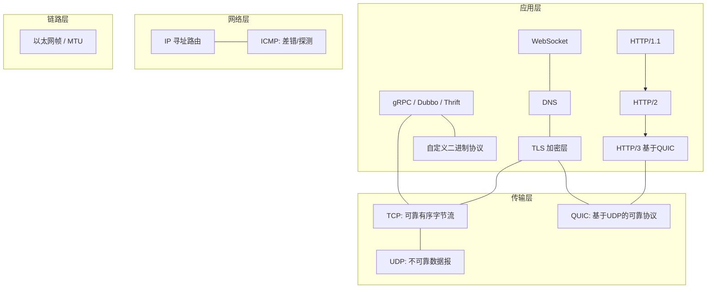
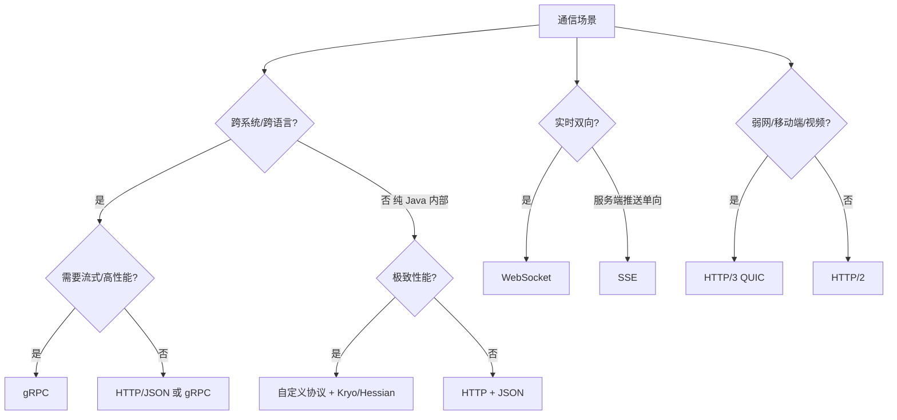

# 网络协议深挖（RPC / 序列化 / 传输细节 / 选型）

> 网络.md 讲清了 TCP/HTTP 的"基本盘"（握手、拥塞控制、HTTP 演进、排障），本文在它之上再深挖四层：**① RPC 与 gRPC 协议设计；② 序列化协议横向对比；③ TCP/HTTP 的传输细节与参数调优；④ 协议选型决策**。目标是把"用对协议、调对参数、说得清为什么"这三个工程能力补齐。
>
> 与基础知识其他文档互补：基础协议与握手见「[网络](网络.md)」、高并发 I/O 模型见「[操作系统](操作系统.md)」、IM/长连接应用层方案见「[场景设计/长连接](../场景设计/长连接.md)」、服务框架见「[源码系列/Dubbo源码](../源码系列/Dubbo源码.md)」。

---

## 一、网络协议全景（一张图定位所有协议）



**报文封装层级**：应用数据 → TLS 记录 → TCP 段（MSS）→ IP 包（MTU）→ 以太网帧。

> 关键词对照：**MTU**（链路层最大帧，典型 1500）> **MSS**（TCP 最大段 = MTU - 40，典型 1460）> **MSL**（报文最长生存，2MSL 决定 TIME_WAIT 时长）。三者是面试常挖的"三连"。

---

## 二、RPC：一次远程调用的完整链路

### 2.1 RPC 是什么

**RPC（Remote Procedure Call）**：让调用远程服务像调用本地方法一样。核心是"本地代理（stub）+ 网络传输 + 协议约定"。


**RPC 四要素**：

| 要素 | 说明 | 代表 |
|------|------|------|
| **IDL/接口契约** | 跨语言描述接口与数据结构 | ProtoBuf(.proto)、Thrift(.thrift)、OpenAPI |
| **序列化** | 对象 ↔ 字节流 | Protobuf、Thrift、Kryo、Hessian |
| **传输协议** | 报文格式 + 编解码 | HTTP/2、自定义长度域协议、TCP |
| **服务治理** | 注册发现/负载均衡/超时重试/熔断 | Nacos、Consul、etcd |

### 2.2 通用 RPC 报文格式（自定义协议模板）

```text
┌────────┬────────┬────────┬────────┬────────────┬──────────────┐
│ 魔数4B │ 版本1B │ 类型1B │ 序列化1B│ 请求ID 8B  │ 长度域4B      │
├────────┴────────┴────────┴────────┴────────────┴──────────────┤
│ 扩展字段(可选) / 业务数据体                                      │
└───────────────────────────────────────────────────────────────┘
```

- **魔数**：快速校验"这是我认识的协议"（防脏数据进入）。
- **请求 ID**：异步/多路复用时把响应匹配回请求（**半包/粘包与乱序都不怕**，靠 ID 对应）。
- **长度域**：解决**粘包/拆包**——一个请求发多少字节，接收方按长度切分（Netty 的 `LengthFieldBasedFrameDecoder` 即此）。
- 这也是很多中间件协议的样子（Dubbo 协议、RocketMQ 协议、Netty 示例）。

---

## 三、gRPC 深讲（HTTP/2 时代的 RPC 事实标准）

### 3.1 gRPC 的技术栈

| 层 | gRPC 用的 |
|----|-----------|
| 传输 | **HTTP/2**（多路复用、二进制帧、流式） |
| 序列化 | **Protobuf**（默认，可换） |
| IDL | `.proto` 文件 + `protoc` 生成各语言代码 |
| 服务发现/LB | 自有 resolver + xDS，或对接 Nacos/Consul |
| 加密 | TLS 内建（HTTP/2 强制要求 TLS 与否可选） |

### 3.2 四种调用模型（面试必问）

| 模型 | 形态 | 典型场景 |
|------|------|----------|
| **Unary（一元）** | 请求-响应，一次往返 | 普通 API、CRUD |
| **Server Streaming** | 发一次，收多条 | 订阅、大列表、日志推送 |
| **Client Streaming** | 发多条，收一次 | 上传大文件、聚合上报 |
| **Bidi Streaming** | 双向流 | 实时交互、聊天、推理中间结果 |

### 3.3 关键机制

- **连接复用**：一个 HTTP/2 连接上并发多个 stream（无队头阻塞于"请求级"，但有 **TCP 层队头阻塞**，故 HTTP/3 出现）。
- **超时与元数据**：`deadline`（截止时间）传播、`metadata` 传 traceId/认证。
- **重试**：幂等方法配置重试 + 指数退避；配合状态码（`UNAVAILABLE` 可重试，`INVALID_ARGUMENT` 不可）。
- **流控**：HTTP/2 窗口 + gRPC 流级窗口，双向。
- **与 Dubbo 对比**：

| 维度 | gRPC | Dubbo |
|------|------|-------|
| 传输 | HTTP/2 标准 | 自定义 TCP 二进制协议 |
| 序列化 | Protobuf（跨语言友好） | Hessian2/Kryo（Java 生态为主） |
| 跨语言 | 好（protoc 多语言） | 主要 Java（2.x 支持弱） |
| 治理 | xDS/第三方接入 | 原生完善（Nacos/ZK 注册、熔断限流） |
| 生态 | 云原生/K8s/服务网格友好 | 老牌微服务，国内 Java 存量 |

> 选型口诀：**"云原生跨语言上 gRPC，纯 Java 存量上 Dubbo；两者不冲突，网关层常并存。"**

---

## 四、序列化协议横向对比（选型关键）

### 4.1 序列化要解决的问题

1. **体积**（带宽/存储成本）；2. **速度**（CPU 成本）；3. **跨语言**（生态）；4. **可读性**（调试）。

### 4.2 主流序列化对比表

| 协议 | 体积 | 速度 | 跨语言 | 可读 | 特点 |
|------|------|------|--------|------|------|
| **JSON** | 大 | 中 | 好 | 好 | 生态无敌、排障方便，性能瓶颈明显 |
| **Protobuf** | 小 | 快 | 好 | 差（需 proto 定义） | gRPC 默认；Varint + 字段编号压缩 |
| **Thrift** | 小 | 快 | 好 | 差 | Facebook 出品，RPC+序列化一体 |
| **MessagePack** | 小 | 快 | 好 | 中 | "二进制 JSON"，Redis 集群、RPC 常用 |
| **Kryo** | 小 | 快 | 差（Java only） | 差 | Java 生态内最高性能之一，需注册类 |
| **Hessian2** | 中 | 中 | 一般 | 差 | Dubbo 默认之一，Java 为主 |
| **Java 原生** | 大 | 慢 | 无 | 差 | 仅内部进程间，有安全问题（反序列化漏洞） |

### 4.3 Protobuf 为什么快和小（原理）

- **Varint**：小整数用 1 字节（7 位 + 1 位续位标志），大整数才展开。
- **字段编号 + 类型**：只传"编号=值"，不传字段名（JSON 传的是字段名字符串）。
- **Tag 结构**：`(field_number << 3) | wire_type`，解码器据此跳过未知字段（前向/后向兼容）。
- **无自描述**：没有 `.proto` 就看不懂 → 调试难、安全上"不可见性"。

> 生产建议：**跨系统/高性能用 Protobuf/MessagePack，纯 Java 内部可用 Kryo，调试期/对外 API 用 JSON**；永远别用 Java 原生序列化对外传输（安全+性能双差）。

---

## 五、TCP 传输细节与参数调优

> 三次握手、四次挥手、拥塞控制在「[网络](网络.md)」已有，这里只补"细节与参数"。

### 5.1 Nagle 算法与延迟确认

- **Nagle**：小包合并再发（等前一个包 ACK），省带宽但引入延迟 → **交互型小请求（IM/游戏）必须 `TCP_NODELAY` 关掉**。
- **延迟确认（Delayed ACK）**：收到数据等 40ms 再 ACK，期望"捎带"回包。
- **经典坑：Nagle + Delayed ACK 死锁**——发小包等 ACK，收方等小包捎带 → 卡 40ms 级延迟。Java `Socket` 默认开 Nagle，**NIO/Netty 默认关**。

### 5.2 TCP keepalive（探测存活，非保活）

| 参数 | 默认 | 说明 |
|------|------|------|
| `tcp_keepalive_time` | 7200s | 空闲多久开始探测 |
| `tcp_keepalive_intvl` | 75s | 探测间隔 |
| `tcp_keepalive_probes` | 9 | 连续失败次数判定死亡 |

- **应用层问题**：2 小时太慢，IM/长连接都要**应用层心跳**（如每 30s ping，见「[场景设计/长连接](../场景设计/长连接.md)」）。
- 应用层心跳优于 TCP keepalive：可控、能带业务数据、能感知"假活"（半开连接）。

### 5.3 半连接 / 全连接队列


- 参数：`net.ipv4.tcp_max_syn_backlog`（半连接）、`net.core.somaxconn` + `listen(fd, backlog)`（全连接，Java `ServerSocket` 第二参）。
- **排查**：`ss -lnt` 看 `Send-Q`（backlog 上限）/ `Recv-Q`（当前排队）；Recv-Q 满 = 应用 accept 太慢，不是网络问题。

### 5.4 TIME_WAIT 与调优

- 主动关闭方进入 TIME_WAIT 2MSL（默认 60s），目的：**保证最后一个 ACK 可达 + 旧报文不串入新连接**。
- 高并发短连接 → TIME_WAIT 堆积。对策（按优到劣）：
  1. **用长连接/连接池**（根治，Netty/HTTP 连接池）；
  2. `net.ipv4.tcp_tw_reuse=1`（仅对发起方出站连接复用，较安全）；
  3. `net.ipv4.ip_local_port_range` 扩端口范围（让可分配端口更多）；
  4. 谨慎用 `SO_LINGER` 发 RST 立即关（**破坏协议语义，除非协议层自带可靠**）。

### 5.5 重传与 RTO

- RTO（重传超时）由 **RTT 采样 + 指数退避**计算，最小值 `tcp_rto_min`（默认 200ms）。
- **重传信号**：`tcpdump` 看 `[TCP Retransmission]`；`ss -s` 看 retrans；`nstat -az` 看 `TcpRetransSegs`。
- **快速重传**：收到 3 个重复 ACK 立即重传（不等 RTO），触发快速恢复。

### 5.6 连接池设计要点

- **池化**：预建 N 条长连接，复用避免握手+慢启动。
- **健康检查**：借出前探测、定期保活、坏连接剔除。
- **容量**：池大小 × 每条连接内存开销（内核 socket 缓冲）→ 别撑爆 `tcp_max_tw_buckets` 和 fd 上限。

> 口诀：**"Nagle 省带宽但卡延迟，交互必关 TCP_NODELAY；keepalive 两小时太慢，应用层心跳 30 秒；短连接 TIME_WAIT 多，连接池根治；backlog 满先看 accept 慢不慢。"**

---

## 六、HTTP 演进机制深挖（HTTP/1.1 → 2 → 3）

> 概述见「[网络](网络.md)」，这里只挖"为什么"。

### 6.1 HTTP/1.1：队头阻塞与优化手段

- **队头阻塞**：同一连接一个请求未响应，后面的排队（浏览器 6 连接并发缓解）。
- 优化：**Keep-Alive 复用**、**pipeline**（仍受队头阻塞限制）、**域名分片/多连接**、**合并请求**（CSS 雪碧图、批量接口）。

### 6.2 HTTP/2：二进制帧 + 多路复用 + HPACK

- **二进制分帧**：一个连接多个 **stream**（逻辑流），帧交错传输，请求级队头阻塞消除。
- **HPACK**：头部压缩（静态表+动态表+哈夫曼），头字段重复场景省 90%+。
- **Server Push**：服务端主动推资源（使用少，有缓存污染问题）。
- **残留问题**：stream 内数据仍需按序组装 → 遇到 TCP 丢包，**整个连接的流都停**（**TCP 层队头阻塞**）。

### 6.3 HTTP/3 = QUIC（基于 UDP）

| 特性 | 解决什么 |
|------|----------|
| **基于 UDP + 自实现可靠传输** | 彻底移除 TCP 层队头阻塞（每个 stream 独立重传） |
| **0-RTT 恢复连接** | 首包带数据，重连/切换网络免握手 |
| **TLS 1.3 内建** | 加密不是附加层，安全默认 |
| **连接迁移（Connection ID）** | 手机切 WiFi/4G 连接不中断 |
| **自定义拥塞控制**（可上 BBR） | 摆脱内核 TCP 栈，可快速演进 |

- 适用：弱网/移动端/视频直播（丢包敏感）；后端内网延迟低、丢包少，**HTTP/2 足够，HTTP/3 收益有限**（C10M 网关层例外）。

### 6.4 WebSocket 协议细节

**握手**：HTTP Upgrade 升级（101 Switching Protocols），完成后双向全双工帧。

```text
Client: GET /chat HTTP/1.1
        Upgrade: websocket
        Connection: Upgrade
        Sec-WebSocket-Key: <base64 随机16字节>
Client ← Server: 101 + Sec-WebSocket-Accept: <SHA1(key+魔数) 的 base64>
```

**帧格式**：`FIN + 4位opcode + 掩码位 + 长度 + 掩码密钥 + 载荷`。

- **分片**：一个消息拆多帧（opcode=1 首帧，0 续帧，8 结束）；每帧有 FIN。
- **掩码**：客户端→服务端必须掩码（防缓存投毒），服务端→客户端可不掩。
- **控制帧**：ping/pong（心跳）、close（关闭协商）。
- **与 HTTP 对比**：

| | HTTP 轮询/长轮询 | SSE | WebSocket |
|--|------------------|-----|-----------|
| 方向 | 单向/半双工 | 服务端→客户端单向 | 全双工 |
| 协议 | HTTP | HTTP | 独立升级协议 |
| 适用 | 低频状态同步 | 通知/流式（AI 输出） | 实时双向交互（IM/游戏/协作） |

> 落地：IM/网关选型见「[场景设计/长连接](../场景设计/长连接.md)」。

---

## 七、网络性能优化方法论

### 7.1 优化维度全景

| 维度 | 手段 |
|------|------|
| **减少往返次数** | 批量接口、pipeline、HTTP/2 多路复用、gRPC 流式、0-RTT |
| **减少数据量** | 序列化选型、压缩（gzip/br）、HPACK、协议精简字段 |
| **复用连接** | 连接池、Keep-Alive、长连接网关 |
| **降低延迟** | 就近接入（CDN/边缘）、HTTP/3 弱网、关 Nagle |
| **加大吞吐** | 多路复用、并发连接、零拷贝、DMA |
| **避免队头阻塞** | HTTP/2、HTTP/3、多路连接 |

### 7.2 协议选型决策树



### 7.3 生产指标盯哪些

- **RTT/延迟分位数**（p99）、**重传率**（>0.5% 就要查）、**连接数/连接建立速率**、**TIME_WAIT/CLOSE_WAIT 堆积**（CLOSE_WAIT 堆积 = 应用没 close，业务 bug！）、**队列溢出**（`netstat -s` 的 SYN drop、`dropwatch`）。

> CLOSE_WAIT 是纯应用层问题：**对端关了，自己代码不关连接** → 查线程池是否处理了 close、连接是否归还连接池。

---

## 八、与其他板块的关系

- **网络**：基础握手/拥塞控制/HTTP 演进/排障命令在那边，本文是"协议设计与调优"补充。
- **操作系统**：epoll/收包路径/零拷贝是网络协议的落地底座（「[操作系统](操作系统.md)」第七节）。
- **场景设计/长连接**：WebSocket/心跳/断线重连的工程落地。
- **源码系列/Dubbo**：自定义协议 + 服务治理实现；**Netty**：粘包拆包解码器实现。
- **大模型/工程落地**：AI 流式输出走 SSE/流式 HTTP，与 RPC 选型呼应。
- **云原生/ServiceMesh**：gRPC + xDS 是网格数据面的主流协议。

---

## 九、速查表

| 主题 | 一句话 |
|------|--------|
| RPC 四要素 | IDL / 序列化 / 传输协议 / 服务治理 |
| 粘包拆包解法 | 长度域（LengthField）解码器 |
| gRPC 基础 | HTTP/2 + Protobuf，四种调用模型 |
| gRPC vs Dubbo | 云原生跨语言 vs Java 存量生态 |
| Protobuf 快因 | Varint + 字段编号 + 无字段名 |
| 序列化选型 | 跨语言高性能 Protobuf；Java 内 Kryo；对外 JSON |
| Nagle | 小包合并，交互必关 TCP_NODELAY |
| keepalive | 默认 7200s 太慢，应用层心跳 30s |
| 半/全连接队列 | Recv-Q 满=accept 慢 |
| TIME_WAIT | 2MSL 保安全；连接池根治 |
| HTTP/2 | 二进制帧多路复用 + HPACK |
| HTTP/3 | QUIC：UDP 可靠 + 0-RTT + 连接迁移 |
| WebSocket | 101 升级握手，全双工帧，客户端强制掩码 |
| SSE vs WS | 单向推送 SSE，双向交互 WS |
| CLOSE_WAIT | 对端关了不 close，应用 bug |

---

## 面试高频问题（20+ 条）

1. **RPC 和 HTTP 的区别？** RPC 是"调用本地方法"的协议组合（IDL+序列化+传输），HTTP 是通用传输协议；RPC 可基于 HTTP/2 实现（gRPC）。
2. **一次 RPC 调用经历了什么？** 代理→序列化→连接池/超时重试→网络→反序列化→业务→返回。
3. **RPC 为什么要有请求 ID？** 多路复用下把异步响应匹配回请求，防乱序。
4. **怎么解决粘包拆包？** 固定长度/分隔符/长度域；主流用长度域（Netty LengthFieldBasedFrameDecoder）。
5. **gRPC 基于什么？** HTTP/2 + Protobuf，默认 TLS。
6. **gRPC 四种调用模型？** Unary / Server Streaming / Client Streaming / Bidi Streaming。
7. **gRPC 和 Dubbo 怎么选？** 跨语言/云原生用 gRPC；纯 Java 存量/强治理用 Dubbo。
8. **Protobuf 为什么比 JSON 快？** Varint 定长编码、只传字段编号不传名字、无解析歧义。
9. **Hessian/Kryo/Protobuf 区别？** 跨语言 vs Java-only、体积速度梯度不同。
10. **为什么不建议 Java 原生序列化？** 体积大速度慢，且有反序列化漏洞风险。
11. **Nagle 算法是什么？有什么坑？** 小包合并省带宽；与延迟确认叠加死锁卡 40ms；交互关 TCP_NODELAY。
12. **TCP keepalive 和应用层心跳的区别？** 内核探活默认 2h 不可控；应用层心跳可控、带业务数据。
13. **半连接队列和全连接队列满了怎么办？** 半连接队列：调 tcp_max_syn_backlog；全连接队列：加快 accept，调 somaxconn。
14. **怎么判断是全连接队列满而不是应用慢？** ss -lnt 看 Recv-Q 堆积；应用处理正常则是队列参数问题。
15. **TIME_WAIT 过多的危害和对策？** 端口/资源耗尽；连接池、tcp_tw_reuse、扩端口范围。
16. **CLOSE_WAIT 堆积是什么问题？** 对端 close 了自己没关 → 应用层 bug，查代码不 close。
17. **HTTP/1.1 队头阻塞怎么来的？** 同连接串行；靠多连接/合并缓解。
18. **HTTP/2 解决了什么、还有什么问题？** 请求级队头阻塞（二进制帧多路复用）解决；TCP 丢包仍阻塞整连接。
19. **HTTP/3 为什么用 UDP？** QUIC 自实现可靠传输，每 stream 独立重传，消除 TCP 队头阻塞。
20. **0-RTT 是什么？** 携带前次连接参数直接发数据，省握手 RTT；安全上略有重放风险。
21. **WebSocket 握手怎么升级的？** HTTP Upgrade: websocket + Sec-WebSocket-Key，101 响应。
22. **WebSocket 客户端为什么要掩码？** 防代理缓存投毒；服务端到客户端不强制。
23. **SSE 和 WebSocket 区别？** SSE 单向服务端推送（AI 流式输出），WebSocket 全双工双向。
24. **怎么优化网络延迟？** 减少 RTT（批量/流式/0-RTT）、数据压缩、连接复用、就近接入。
25. **重传率怎么看？** tcpdump 看 [TCP Retransmission]、nstat -az 的 TcpRetransSegs、ss -s。
