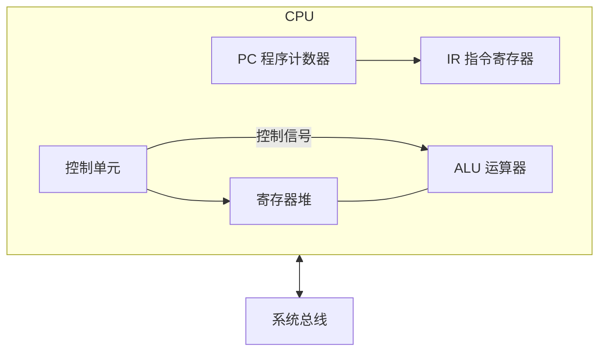
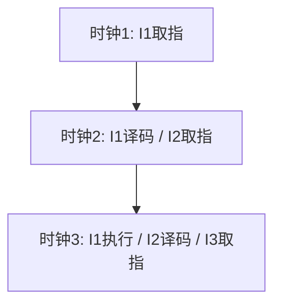
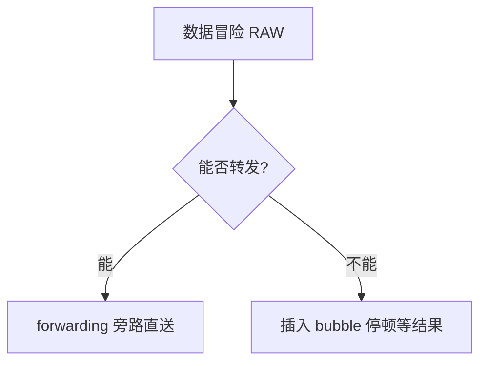
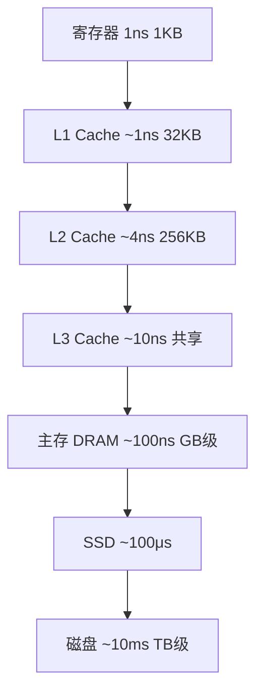
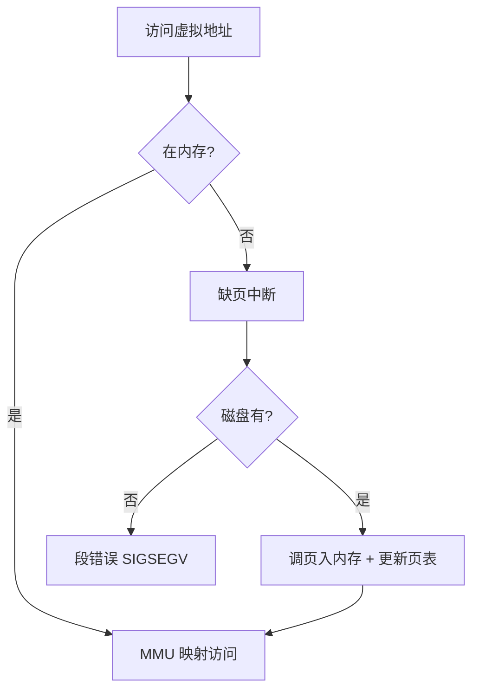
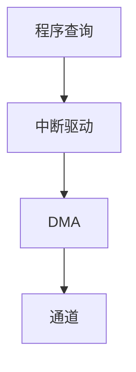
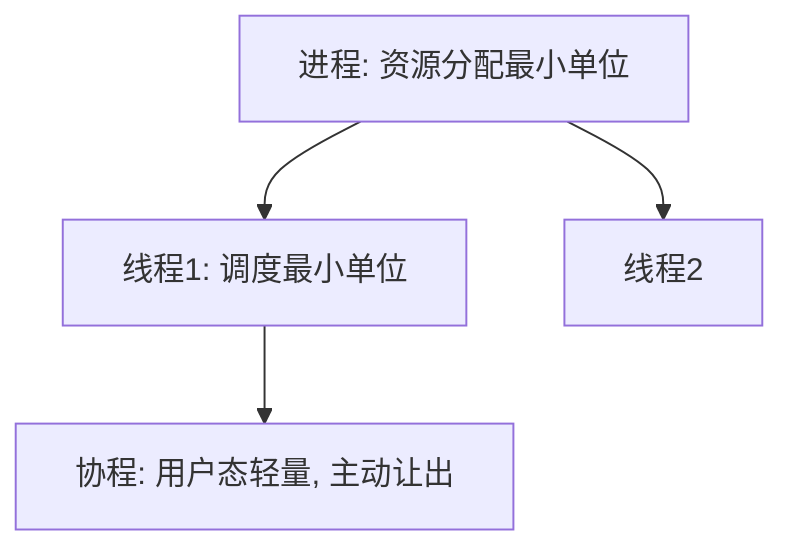
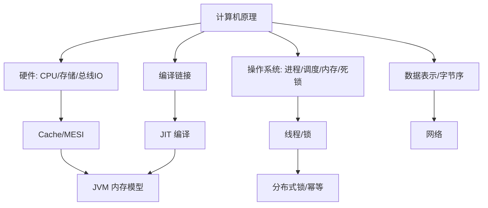

# 计算机原理

> 计算机原理（计算机组成原理 + 操作系统核心 + 编译链接基础）是后端工程师的"底层内功"。本文从**硬件组成 → 数据表示 → CPU 指令 → 存储体系 → I/O → 操作系统 → 编译链接**逐层拆解，把"为什么这样设计"讲清楚。
>
> 与基础知识其他文档互补：网络见「[网络](网络.md)」、数据结构见「[数据结构](数据结构.md)」、JVM 内存模型见「[Java虚拟机](Java虚拟机.md)」、并发与锁见「[场景设计/分布式锁](../../场景设计/分布式锁.md)」「[场景设计/幂等设计](../../场景设计/幂等设计.md)」。本文聚焦更底层的硬件与 OS 机制。

---

## 一、计算机系统概览

### 1.1 冯·诺依曼体系结构

现代计算机几乎都基于冯·诺依曼（存储程序）思想，五大部件：

```mermaid
flowchart LR
    subgraph 主机
        CU[控制器] --- ALU[运算器]
        CPU[CPU: 控制器+运算器]
        MEM[存储器(内存)]
    end
    IN[输入设备] --> CPU
    CPU --> OUT[输出设备]
    CPU <--> MEM
    MEM -.总线.-> CPU
```

| 部件 | 职责 |
|------|------|
| 运算器(ALU) | 算术/逻辑运算 |
| 控制器(CU) | 取指、译码、发出控制信号 |
| 存储器 | 存放指令与数据（**指令和数据同等对待，二进制存储**） |
| 输入/输出 | 人机/外部交互 |

**两大核心思想**：
- **存储程序**：指令以二进制形式存放在存储器中，机器自动取指执行。
- **指令与数据共享总线**：CPU 通过同一组地址/数据总线访问指令和数据（von Neumann 瓶颈：取指与取数争用总线）。

> 对比哈佛结构：指令与数据分开存储、分开总线（DSP/单片机常用），可并行取指取数，无此瓶颈。

### 1.2 计算机层次结构

```text
应用层（高级语言程序）
   ↓ 编译/解释
操作系统层（OS 系统调用）
   ↓ 机器指令
指令系统层（ISA：x86/ARM/RISC-V）
   ↓ 微程序/硬布线
微体系结构层（流水线/Cache/分支预测）
   ↓
硬件逻辑层（门电路/触发器）
   ↓
器件层（晶体管/集成电路）
```

### 1.3 性能指标

| 指标 | 含义 | 公式 |
|------|------|------|
| 时钟周期 | 最小时间单位 | 1 / 主频 |
| CPI | 每条指令平均时钟周期数 | 总时钟数 / 指令数 |
| CPU 时间 | 程序耗时 | 指令数 × CPI × 时钟周期 |
| MIPS | 每秒百万指令 | 主频 / (CPI×10⁶) |
| IPC | 每周期指令数 | 1 / CPI |
| 吞吐 vs 延迟 | 单位时间处理量 vs 单次响应时间 | 一快一慢可并存 |

> 口诀：**"CPU 时间三件套：指令数 × CPI × 周期；想提速就减任意一项。"**

---

## 二、数据表示与运算

### 2.1 进制与转换

- 二进制(B)、八进制(O)、十进制(D)、十六进制(H)互转。
- 小数转二进制：乘 2 取整（如 0.625 → 0.101）。
- 八/十六进制是二进制的紧凑写法（1 位十六进制 = 4 位二进制）。

### 2.2 原码 / 反码 / 补码

计算机用**补码**存储有符号整数，原因：
1. **0 的唯一表示**：原码有 +0(0000) 和 -0(1000) 两种，补码只有 0000。
2. **加减统一**：`a - b = a + (-b)`，符号位参与运算，无需单独减法电路。
3. **符号位自然参与**：最高位为符号，运算规则统一。

| 表示 | 正数 | 负数 |
|------|------|------|
| 原码 | 符号位0 + 真值 | 符号位1 + 真值 |
| 反码 | 同原码 | 原码按位取反 |
| 补码 | 同原码 | 反码 + 1 |

```java
// 8 位：+5 = 0000 0101，-5 = 1111 1011（补码）
// 验证：5 + (-5) = 0000 0101 + 1111 1011 = 1 0000 0000 → 溢出丢弃 → 0 ✓
// 范围：n 位补码 ∈ [-2^(n-1), 2^(n-1)-1]，如 8 位 ∈ [-128, 127]
```

**溢出判断**（有符号加法）：
- 正+正得负，或 负+负得正 → 溢出。
- 硬件用「符号位进位 ⊕ 最高数值位进位」= 1 表示溢出。

### 2.3 定点数与浮点数（IEEE 754）

**定点数**：小数点位置固定（纯小数/纯整数），表示范围小。

**浮点数（IEEE 754）**：`V = (-1)^S × M × 2^E`
- **单精度(float, 32位)**：1位符号 S + 8位阶码 E + 23位尾数 M。
- **双精度(double, 64位)**：1位符号 S + 11位阶码 E + 52位尾数 M。

```mermaid
flowchart TD
    A[浮点数] --> S[符号位 S: 1位]
    A --> E[阶码 E: 偏置表示 bias=2^(k-1)-1]
    A --> M[尾数 M: 隐含前导1, 即 1.M]
```

| 阶码 E | 含义 |
|--------|------|
| 全 0 | 非规格化数（E=1-bias，M 无前导1，表示接近 0） |
| 正常 | E = e + bias（bias: float=127, double=1023） |
| 全 1 | M=0 为 ±∞；M≠0 为 NaN |

**经典坑：0.1 + 0.2 ≠ 0.3**
```java
System.out.println(0.1 + 0.2); // 0.30000000000000004
// 原因：0.1、0.2 在二进制下是无限循环小数，尾数截断产生误差
// 金额场景必须用 BigDecimal 或整数分存储，禁用 double
BigDecimal a = new BigDecimal("0.1");
BigDecimal b = new BigDecimal("0.2");
System.out.println(a.add(b)); // 0.3
```

**精度与范围**：float 约 7 位十进制有效位，double 约 15–17 位；大数相加小数可能"被吞"（大数吃小数）。

### 2.4 字符编码

| 编码 | 说明 |
|------|------|
| ASCII | 7 位，128 字符（英文字符/控制符） |
| GBK | 中文双字节，兼容 ASCII |
| Unicode | 统一码，给每个字符分配码点（如 '中' = U+4E2D） |
| UTF-8 | Unicode 的变长编码（1–4 字节），兼容 ASCII，中文通常 3 字节 |
| UTF-16 | 2 或 4 字节，Java `char` 内部用 UTF-16 |
| BOM | 字节序标记（UTF-8 BOM 可能导致脚本解析异常，建议无 BOM） |

```java
// 中文 "中" 的 UTF-8 编码
"中".getBytes(StandardCharsets.UTF_8); // [-28, -72, -83] = E4 B8 AD
```

### 2.5 大小端（Endianness）

- **大端(Big-Endian)**：高位字节存低地址（人读顺序，网络字节序用大端）。
- **小端(Little-Endian)**：低位字节存低地址（x86 用，转换/存取高效）。

```java
// 判断本机大小端
int x = 0x00000001;
boolean littleEndian = ((byte)(x & 0xFF)) == 1; // true = 小端
// 网络传输必须统一字节序：htonl/htons 转大端，ntohl/ntohs 转回
```

> 跨语言/跨网络读写二进制（如自定义协议、文件格式）必须约定字节序，否则出现"乱码数字"。

### 2.6 校验

| 方式 | 原理 | 用途 |
|------|------|------|
| 奇偶校验 | 加 1 位使 1 的个数为奇/偶 | 简单检 1 位错 |
| CRC | 多项式除法余数 | 网络/存储检错 |
| 海明码 | 多校验位定位 | 内存 ECC 纠错 |
| 校验和 | 累加和取模 | 网络/IP/TCP 校验 |

> 口诀：**"负数用补码，浮点 IEEE；0.1 加 0.2 坑，金额别用 double；跨网络大小端，中文 UTF-8。"**

---

## 三、CPU 与指令系统

### 3.1 CPU 组成



- **PC**：下一条指令地址。
- **IR**：当前指令。
- **MAR/MDR**：地址/数据寄存器，连接总线。
- **通用寄存器**：eax/rax 等，访问速度远快于内存。
- **标志寄存器**：零标志/进位/溢出/中断允许。

### 3.2 指令格式与寻址

**指令格式**：`操作码(OP) | 地址码(操作数)`。

**常见寻址方式**：
| 方式 | 含义 | 例子 |
|------|------|------|
| 立即寻址 | 操作数在指令中 | `MOV AX, 5` |
| 直接寻址 | 地址字段即内存地址 | `MOV AX, [1000]` |
| 寄存器寻址 | 操作数在寄存器 | `MOV AX, BX` |
| 间接寻址 | 地址字段指向地址 | `MOV AX, [[1000]]` |
| 基址寻址 | 基址寄存器 + 偏移 | 访问结构体/数组 |
| 变址寻址 | 变址寄存器 + 偏移 | 循环遍历数组 |
| 相对寻址 | PC + 偏移 | 转移指令（位置无关） |

### 3.3 指令周期


- **取指**：PC→MAR→内存→MDR→IR，PC+1。
- **间址**：若指令含间接地址，先取有效地址。
- **执行**：ALU 运算。
- **中断**：执行后查中断请求，有则进入中断周期。

### 3.4 流水线（Pipelining）

把指令执行分成多个阶段并行（类似工厂流水线），提高吞吐。



- **吞吐率**：单位时间完成的指令数，理想 = 1 / 时钟周期（每段等长）。
- **加速比**：`k 段流水线 / 非流水 ≈ k`（理想，忽略建立时间）。

**三类冒险（Hazard）**：
| 冒险 | 原因 | 解决 |
|------|------|------|
| 结构冒险 | 硬件资源冲突（如取指与访存争内存） | 分离指令/数据 Cache（哈佛） |
| 数据冒险 | 指令间数据依赖（写后读 RAW 等） | ** forwarding 转发**（旁路）/ 流水线停顿 stall / 乱序 |
| 控制冒险 | 分支跳转导致预取错误 | **分支预测** / 延迟槽 |



**分支预测**：
- 静态：编译期预测（如向后跳大概率循环）。
- 动态：BTB（分支目标缓冲）+ 两位饱和计数器（预测"跳转/不跳转"），预测失败则清空流水线（flush）有代价。

### 3.5 超标量 / 乱序执行 / 投机执行

- **超标量**：一个周期发射多条指令（多套执行单元）。
- **乱序执行(Out-of-Order)**：在不破坏数据依赖前提下，先执行就绪的指令（Tomasulo 算法 + 重排序缓冲 ROB）。
- **投机执行(Speculative)**：预测分支后提前执行，预测错则回滚。
- **SIMD**：单指令多数据（MMX/SSE/AVX），向量化批量计算（如图像/矩阵）。

> 口诀：**"流水提速靠并行，冒险三类要分清；数据转发旁路送，控制靠分支预测。"**

---

## 四、存储系统

### 4.1 存储层次（金字塔）



**设计依据：局部性原理**
- **时间局部性**：刚访问的数据很可能再访问（循环变量、Cache）。
- **空间局部性**：访问某地址，附近地址很可能也被访问（数组、预取）。

### 4.2 Cache

CPU 与主存速度差千倍，Cache 是"用小而快的存储挡在中间"。

**映射方式**：
| 方式 | 特点 | 优点/缺点 |
|------|------|-----------|
| 直接映射 | 主存块只映射到固定 Cache 行 | 简单，但冲突率高 |
| 全相联 | 任意位置 | 命中率高，查找慢（需比较全部） |
| 组相联 | 分组，组内全相联 | 折中（主流，如 8-way） |

**替换算法**：LRU（最近最少用）、FIFO、随机。LRU 最常用但要硬件维护。

**写策略**：
- **写直达(Write-Through)**：同时写 Cache 和内存，一致但慢。
- **写回(Write-Back)**：只写 Cache，淘汰时写回内存，快但需脏位。
- **写分配 / 写不分配**：写缺失时是否先调入 Cache。

**Cache 一致性（多核）**：
多核各自有私有 Cache，需协议保证看到一致数据。**MESI** 状态机：
- **M**(Modified) 已修改，独占且脏
- **E**(Exclusive) 独占干净
- **S**(Shared) 共享
- **I**(Invalid) 无效


**伪共享(False Sharing)**：两个 CPU 核心修改**同一 Cache 行**的不同变量，导致该行在核心间反复失效（颠簸）。
```java
// 解决：Cache 行填充对齐（通常 64 字节）
@Contended  // JDK8+ 注解，自动填充（需 -XX:-RestrictContended）
class Counter { volatile long value; /* 填充至 64B */ }
```
> 详见「[Java虚拟机](Java虚拟机.md)」中对象内存布局与 @Contended。

### 4.3 主存与虚拟内存

**DRAM vs SRAM**：SRAM（Cache，贵快、掉电丢）；DRAM（主存，密便宜、需刷新）。

**虚拟内存**：每个进程有独立的虚拟地址空间，由 MMU 映射到物理内存。
- **分页**：固定大小页（如 4KB），页表映射「虚拟页号→物理页框」。
- **分段**：按逻辑段（代码/数据/堆/栈），段表 + 偏移。
- **段页式**：先分段再分页，兼顾两者。
- **TLB（快表）**：页表缓存，加速地址翻译（TLB 命中=1 周期，未命中需多级页表游走）。

**缺页中断(Page Fault)**：


**页面置换算法**：
| 算法 | 思想 | 缺点 |
|------|------|------|
| OPT | 置换最远将来用 | 不可实现（理论最优） |
| FIFO | 先入先出 | Belady 异常（给更多帧反而缺页更多） |
| LRU | 最近最少用 | 近似实现（计数/栈） |
| Clock(二次机会) | 环形链表 + 访问位 | LRU 的工程近似，常用 |

**抖动(Thrashing)**：内存不足，进程频繁换入换出，CPU 利用率暴跌。解决：增加内存、减少并发、工作集模型。

### 4.4 磁盘与 RAID

**访问时间 = 寻道时间 + 旋转延迟 + 传输时间**。SSD 无机械，随机访问远快于 HDD。

**RAID**：
| 级别 | 特点 | 冗余 |
|------|------|------|
| RAID 0 | 条带，提速 | 无，一块坏全丢 |
| RAID 1 | 镜像 | 100% 冗余 |
| RAID 5 | 条带 + 奇偶校验（单盘容错） | 允 1 块坏 |
| RAID 10 | 镜像+条带 | 容错且快，成本高 |

> 口诀：**"存储金字塔，局部性撑腰；Cache 组相联 MESI，虚拟内存分页 TLB；缺页置换 LRU，抖动要警惕。"**

---

## 五、总线与 I/O

### 5.1 总线

总线是各部件共享的传输通道，分**数据总线/地址总线/控制总线**。

**总线仲裁**（多个主设备争用）：
- 集中式：链式查询、计数器定时、独立请求。
- 分布式：各设备自 arbitration。

### 5.2 I/O 控制方式



| 方式 | CPU 参与度 | 特点 |
|------|-----------|------|
| 程序查询 | 全程轮询 | 简单，CPU 空转浪费 |
| 中断驱动 | I/O 完成发中断 | CPU 可并行做别的事 |
| DMA | 硬件直接搬数据到内存 | 大块传输不占 CPU |
| 通道 | 专用 I/O 处理器 | 大型机，独立执行通道程序 |

**DMA 流程**：CPU 设好源/目的/长度 → 启动 DMA → DMA 控制器直接搬数据到内存 → 完成发中断通知 CPU。

### 5.3 中断

- **硬件中断**：外设（网卡/磁盘/时钟）请求，异步。
- **软件中断(异常/陷阱)**：指令引发（除零、缺页、系统调用 `int 0x80`/`syscall`）。
- **中断向量表**：中断号 → 处理程序入口。
- **中断优先级 + 嵌套**：高优先级可打断低优先级。

> 系统调用本质是从**用户态陷入内核态**的软中断（陷阱），是应用访问 OS 服务的唯一合法入口。

---

## 六、操作系统核心

> 本节衔接「[Java虚拟机](Java虚拟机.md)」「[场景设计/分布式锁](../../场景设计/分布式锁.md)」，讲清进程线程、调度、死锁、系统调用的底层机制。

### 6.1 进程 / 线程 / 协程



| 概念 | 资源 | 切换成本 | 通信 |
|------|------|----------|------|
| 进程 | 独立地址空间 | 高（切换页表/TLB） | IPC（管道/共享内存/消息队列） |
| 线程 | 共享进程内存 | 中（保存寄存器/栈） | 共享内存（需锁） |
| 协程 | 用户态，单线程内 | 极低（用户态切换） | 共享变量 |

- **上下文切换**：保存/恢复寄存器、PC、栈等。进程切换还要切页表（刷 TLB），更贵。
- **协程**：在用户态由 runtime 调度（Go goroutine、Java Loom、Kotlin），适合高并发 I/O。

### 6.2 进程调度

| 算法 | 思想 | 适用 |
|------|------|------|
| FCFS | 先来先服务 | 简单，长作业霸占 |
| SJF | 最短作业优先 | 平均等待最短，需预知时长 |
| RR | 时间片轮转 | 分时系统，公平 |
| 多级反馈队列 | 多级优先级+时间片 | 通用 OS（Linux CFS 近似） |

- **Linux CFS**（完全公平调度）：按虚拟运行时间 `vruntime` 选最小者，红黑树组织。

### 6.3 同步与通信

- **临界区**：同一时间只允许一个线程进入的代码段。
- **互斥**：锁（互斥量）、自旋锁、信号量。
- **同步**：条件变量、信号量（`P/V` 操作）、管程(Monitor)。
- **死锁**：四个必要条件——**互斥、占有并等待、不可剥夺、循环等待**。
  - 预防：破坏任一条件（如一次性申请全部资源、按序加锁）。
  - 避免：银行家算法（安全序列）。
  - 检测+恢复：资源分配图找环，剥夺/回滚。

```java
// 死锁经典：交叉加锁顺序不一致
// 线程1: lock(A) -> lock(B)
// 线程2: lock(B) -> lock(A)  → 互相等待，死锁
// 解决：全局统一加锁顺序；或用 tryLock + 超时
```

> 分布式场景的锁与并发见「[场景设计/分布式锁](../../场景设计/分布式锁.md)」「[场景设计/幂等设计](../../场景设计/幂等设计.md)」。

### 6.4 内存管理

- **连续分配**：单一/分区（产生外部碎片）。
- **分页/分段**：见 4.3。
- **伙伴系统 / slab**：内核内存分配器（对象缓存，减少碎片）。
- **碎片**：外部碎片（空闲但不连续）、内部碎片（分配单元内浪费，如页内碎片）。

### 6.5 系统调用与用户态/内核态


- **用户态**：受限执行，不能直接访问硬件。
- **内核态**：特权执行，可访问所有资源。
- **切换开销**：保存用户上下文、权限切换、可能 TLB/Cache 影响。
- 频繁系统调用（如每次写 1 字节）很慢，故用缓冲区（`BufferedWriter`/`BufferedInputStream`）。

> 口诀：**"进程管资源，线程管调度，协程用户态；死锁四条件，加锁须有序；系统调用陷内核，缓冲减切换。"**

---

## 七、编译与链接

### 7.1 编译过程（以 C 为例）


| 阶段 | 输入→输出 | 做什么 |
|------|-----------|--------|
| 预处理 | `.c` → `.i` | 宏替换、`#include` 展开、条件编译 |
| 编译 | `.i` → `.s` | 词法/语法/语义分析，生成汇编 |
| 汇编 | `.s` → `.o` | 汇编指令 → 机器码（可重定位目标文件） |
| 链接 | `.o` + 库 → 可执行 | 符号解析、重定位、合并段 |

### 7.2 静态链接 vs 动态链接

| 方式 | 特点 | 优点/缺点 |
|------|------|-----------|
| 静态链接 | 库代码拷进可执行 | 独立部署，但体积大、库升级需重编 |
| 动态链接 | 运行时加载 `.so`/`.dll` | 共享省内存、热升级，但依赖运行时存在 |

- **符号表(Symbol Table)**：记录函数/变量名与地址，链接时解析。
- **重定位(Relocation)**：把相对地址改成最终虚拟地址。
- **PIC(位置无关代码)**：动态库常用，GOT(全局偏移表) + PLT(过程链接表) 延迟绑定。

### 7.3 与 Java 的衔接

Java 走 `源码(.java) → 字节码(.class) → JVM 解释/JIT 编译 → 机器码`，JVM 的 JIT 把热点字节码**运行时编译**为本地机器码（见「[Java虚拟机](Java虚拟机.md)」中 JIT/C1/C2）。这与 C 的"编译期静态链接"不同，是**运行期动态编译**。

---

## 八、高频面试题速记

| 问题 | 要点 |
|------|------|
| 为什么用补码？ | 0 唯一、加减统一、符号位自然参与 |
| 0.1+0.2 为什么不等于 0.3？ | 二进制无限循环，尾数截断误差；金额用 BigDecimal |
| 大小端是什么？ | 多字节存储顺序，网络用大端，x86 小端 |
| 流水线三类冒险？ | 结构/数据/控制；转发 + 分支预测解决 |
| Cache 映射方式？ | 直接/全相联/组相联；LRU 替换 |
| MESI 干什么？ | 多核 Cache 一致性协议 |
| 伪共享怎么解决？ | Cache 行填充对齐（@Contended） |
| 虚拟内存好处？ | 隔离、扩展、按需调页 |
| 缺页置换 LRU？ | 最近最少用，Clock 为工程近似 |
| 死锁四条件？ | 互斥/占有等待/不可剥夺/循环等待 |
| 进程 vs 线程？ | 资源 vs 调度单位，切换成本不同 |
| 系统调用开销？ | 用户态↔内核态切换，用缓冲减少 |
| 静态 vs 动态链接？ | 拷贝进文件 vs 运行时加载 |

---

## 九、知识关联图



> 参考：
> - 唐朔飞《计算机组成原理》、Patterson《计算机组成与设计：硬件/软件接口》(量化方法)
> -  Bryant《深入理解计算机系统》(CSAPP)、Silberschatz《操作系统概念》
> - 基础知识「[网络](网络.md)」「[数据结构](数据结构.md)」「[Java虚拟机](Java虚拟机.md)」
> - 场景设计「[分布式锁](../../场景设计/分布式锁.md)」「[幂等设计](../../场景设计/幂等设计.md)」「[生产问题排查实战](../../场景设计/生产问题排查实战：常见故障与处置步骤.md)」
