# 计算机原理

> 计算机原理（计算机组成原理 + 操作系统核心 + 编译链接基础）是后端工程师的"底层内功"。本文从**硬件组成 → 数据表示 → CPU 指令 → 存储体系 → I/O → 操作系统 → 编译链接**逐层拆解，把"为什么这样设计"讲清楚。
>
> 与基础知识其他文档互补：网络见「[网络](网络.md)」、数据结构见「[数据结构](数据结构.md)」、JVM 内存模型见「[Java虚拟机](Java虚拟机.md)」、并发与锁见「[场景设计/分布式锁](../场景设计/分布式锁.md)」「[场景设计/幂等设计](../场景设计/幂等设计.md)」。本文聚焦更底层的硬件与 OS 机制。

---

## 一、计算机系统概览

### 1.1 冯·诺依曼体系结构

现代计算机几乎都基于冯·诺依曼（存储程序）思想，五大部件：

```mermaid
flowchart LR
    subgraph 主机
        CU[控制器] --- ALU[运算器]
        CPU[CPU: 控制器+运算器]
        MEM[存储器(内存)]
    end
    IN[输入设备] --> CPU
    CPU --> OUT[输出设备]
    CPU <--> MEM
    MEM -.总线.-> CPU
```

| 部件 | 职责 |
|------|------|
| 运算器(ALU) | 算术/逻辑运算 |
| 控制器(CU) | 取指、译码、发出控制信号 |
| 存储器 | 存放指令与数据（**指令和数据同等对待，二进制存储**） |
| 输入/输出 | 人机/外部交互 |

**两大核心思想**：
- **存储程序**：指令以二进制形式存放在存储器中，机器自动取指执行。
- **指令与数据共享总线**：CPU 通过同一组地址/数据总线访问指令和数据（von Neumann 瓶颈：取指与取数争用总线）。

> 对比哈佛结构：指令与数据分开存储、分开总线（DSP/单片机常用），可并行取指取数，无此瓶颈。

### 1.2 计算机层次结构

```text
应用层（高级语言程序）
   ↓ 编译/解释
操作系统层（OS 系统调用）
   ↓ 机器指令
指令系统层（ISA：x86/ARM/RISC-V）
   ↓ 微程序/硬布线
微体系结构层（流水线/Cache/分支预测）
   ↓
硬件逻辑层（门电路/触发器）
   ↓
器件层（晶体管/集成电路）
```

### 1.3 性能指标

| 指标 | 含义 | 公式 |
|------|------|------|
| 时钟周期 | 最小时间单位 | 1 / 主频 |
| CPI | 每条指令平均时钟周期数 | 总时钟数 / 指令数 |
| CPU 时间 | 程序耗时 | 指令数 × CPI × 时钟周期 |
| MIPS | 每秒百万指令 | 主频 / (CPI×10⁶) |
| IPC | 每周期指令数 | 1 / CPI |
| 吞吐 vs 延迟 | 单位时间处理量 vs 单次响应时间 | 一快一慢可并存 |

> 口诀：**"CPU 时间三件套：指令数 × CPI × 周期；想提速就减任意一项。"**

---

## 二、数据表示与运算

### 2.1 进制与转换

- 二进制(B)、八进制(O)、十进制(D)、十六进制(H)互转。
- 小数转二进制：乘 2 取整（如 0.625 → 0.101）。
- 八/十六进制是二进制的紧凑写法（1 位十六进制 = 4 位二进制）。

### 2.2 原码 / 反码 / 补码

计算机用**补码**存储有符号整数，原因：
1. **0 的唯一表示**：原码有 +0(0000) 和 -0(1000) 两种，补码只有 0000。
2. **加减统一**：`a - b = a + (-b)`，符号位参与运算，无需单独减法电路。
3. **符号位自然参与**：最高位为符号，运算规则统一。

| 表示 | 正数 | 负数 |
|------|------|------|
| 原码 | 符号位0 + 真值 | 符号位1 + 真值 |
| 反码 | 同原码 | 原码按位取反 |
| 补码 | 同原码 | 反码 + 1 |

```java
// 8 位：+5 = 0000 0101，-5 = 1111 1011（补码）
// 验证：5 + (-5) = 0000 0101 + 1111 1011 = 1 0000 0000 → 溢出丢弃 → 0 ✓
// 范围：n 位补码 ∈ [-2^(n-1), 2^(n-1)-1]，如 8 位 ∈ [-128, 127]
```

**溢出判断**（有符号加法）：
- 正+正得负，或 负+负得正 → 溢出。
- 硬件用「符号位进位 ⊕ 最高数值位进位」= 1 表示溢出。

### 2.3 定点数与浮点数（IEEE 754）

**定点数**：小数点位置固定（纯小数/纯整数），表示范围小。

**浮点数（IEEE 754）**：`V = (-1)^S × M × 2^E`
- **单精度(float, 32位)**：1位符号 S + 8位阶码 E + 23位尾数 M。
- **双精度(double, 64位)**：1位符号 S + 11位阶码 E + 52位尾数 M。

```mermaid
flowchart TD
    A[浮点数] --> S[符号位 S: 1位]
    A --> E[阶码 E: 偏置表示 bias=2^(k-1)-1]
    A --> M[尾数 M: 隐含前导1, 即 1.M]
```

| 阶码 E | 含义 |
|--------|------|
| 全 0 | 非规格化数（E=1-bias，M 无前导1，表示接近 0） |
| 正常 | E = e + bias（bias: float=127, double=1023） |
| 全 1 | M=0 为 ±∞；M≠0 为 NaN |

**经典坑：0.1 + 0.2 ≠ 0.3**
```java
System.out.println(0.1 + 0.2); // 0.30000000000000004
// 原因：0.1、0.2 在二进制下是无限循环小数，尾数截断产生误差
// 金额场景必须用 BigDecimal 或整数分存储，禁用 double
BigDecimal a = new BigDecimal("0.1");
BigDecimal b = new BigDecimal("0.2");
System.out.println(a.add(b)); // 0.3
```

**精度与范围**：float 约 7 位十进制有效位，double 约 15–17 位；大数相加小数可能"被吞"（大数吃小数）。

### 2.4 字符编码

| 编码 | 说明 |
|------|------|
| ASCII | 7 位，128 字符（英文字符/控制符） |
| GBK | 中文双字节，兼容 ASCII |
| Unicode | 统一码，给每个字符分配码点（如 '中' = U+4E2D） |
| UTF-8 | Unicode 的变长编码（1–4 字节），兼容 ASCII，中文通常 3 字节 |
| UTF-16 | 2 或 4 字节，Java `char` 内部用 UTF-16 |
| BOM | 字节序标记（UTF-8 BOM 可能导致脚本解析异常，建议无 BOM） |

```java
// 中文 "中" 的 UTF-8 编码
"中".getBytes(StandardCharsets.UTF_8); // [-28, -72, -83] = E4 B8 AD
```

### 2.5 大小端（Endianness）

- **大端(Big-Endian)**：高位字节存低地址（人读顺序，网络字节序用大端）。
- **小端(Little-Endian)**：低位字节存低地址（x86 用，转换/存取高效）。

```java
// 判断本机大小端
int x = 0x00000001;
boolean littleEndian = ((byte)(x & 0xFF)) == 1; // true = 小端
// 网络传输必须统一字节序：htonl/htons 转大端，ntohl/ntohs 转回
```

> 跨语言/跨网络读写二进制（如自定义协议、文件格式）必须约定字节序，否则出现"乱码数字"。

### 2.6 校验

| 方式 | 原理 | 用途 |
|------|------|------|
| 奇偶校验 | 加 1 位使 1 的个数为奇/偶 | 简单检 1 位错 |
| CRC | 多项式除法余数 | 网络/存储检错 |
| 海明码 | 多校验位定位 | 内存 ECC 纠错 |
| 校验和 | 累加和取模 | 网络/IP/TCP 校验 |

> 口诀：**"负数用补码，浮点 IEEE；0.1 加 0.2 坑，金额别用 double；跨网络大小端，中文 UTF-8。"**

---

## 三、CPU 与指令系统

### 3.1 CPU 组成

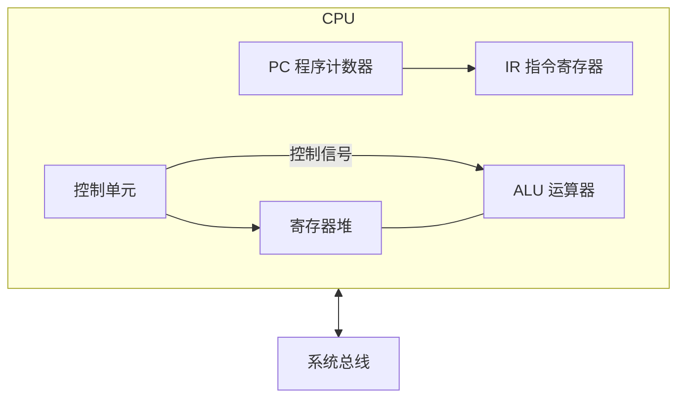

- **PC**：下一条指令地址。
- **IR**：当前指令。
- **MAR/MDR**：地址/数据寄存器，连接总线。
- **通用寄存器**：eax/rax 等，访问速度远快于内存。
- **标志寄存器**：零标志/进位/溢出/中断允许。

### 3.2 指令格式与寻址

**指令格式**：`操作码(OP) | 地址码(操作数)`。

**常见寻址方式**：
| 方式 | 含义 | 例子 |
|------|------|------|
| 立即寻址 | 操作数在指令中 | `MOV AX, 5` |
| 直接寻址 | 地址字段即内存地址 | `MOV AX, [1000]` |
| 寄存器寻址 | 操作数在寄存器 | `MOV AX, BX` |
| 间接寻址 | 地址字段指向地址 | `MOV AX, [[1000]]` |
| 基址寻址 | 基址寄存器 + 偏移 | 访问结构体/数组 |
| 变址寻址 | 变址寄存器 + 偏移 | 循环遍历数组 |
| 相对寻址 | PC + 偏移 | 转移指令（位置无关） |

### 3.3 指令周期


- **取指**：PC→MAR→内存→MDR→IR，PC+1。
- **间址**：若指令含间接地址，先取有效地址。
- **执行**：ALU 运算。
- **中断**：执行后查中断请求，有则进入中断周期。

### 3.4 流水线（Pipelining）

把指令执行分成多个阶段并行（类似工厂流水线），提高吞吐。

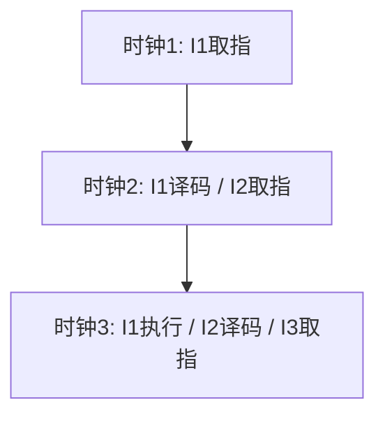

- **吞吐率**：单位时间完成的指令数，理想 = 1 / 时钟周期（每段等长）。
- **加速比**：`k 段流水线 / 非流水 ≈ k`（理想，忽略建立时间）。

**三类冒险（Hazard）**：
| 冒险 | 原因 | 解决 |
|------|------|------|
| 结构冒险 | 硬件资源冲突（如取指与访存争内存） | 分离指令/数据 Cache（哈佛） |
| 数据冒险 | 指令间数据依赖（写后读 RAW 等） | ** forwarding 转发**（旁路）/ 流水线停顿 stall / 乱序 |
| 控制冒险 | 分支跳转导致预取错误 | **分支预测** / 延迟槽 |

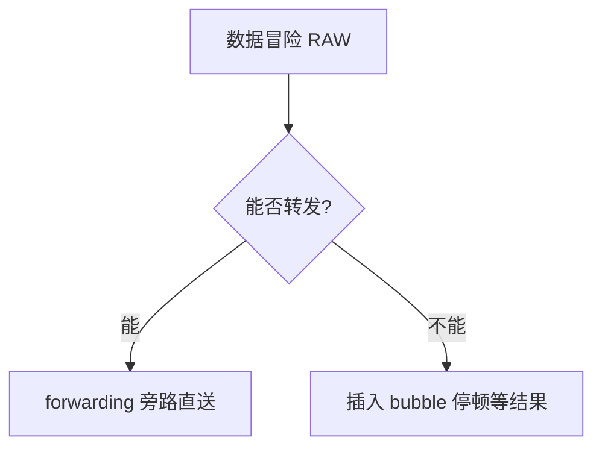

**分支预测**：
- 静态：编译期预测（如向后跳大概率循环）。
- 动态：BTB（分支目标缓冲）+ 两位饱和计数器（预测"跳转/不跳转"），预测失败则清空流水线（flush）有代价。

### 3.5 超标量 / 乱序执行 / 投机执行

- **超标量**：一个周期发射多条指令（多套执行单元）。
- **乱序执行(Out-of-Order)**：在不破坏数据依赖前提下，先执行就绪的指令（Tomasulo 算法 + 重排序缓冲 ROB）。
- **投机执行(Speculative)**：预测分支后提前执行，预测错则回滚。
- **SIMD**：单指令多数据（MMX/SSE/AVX），向量化批量计算（如图像/矩阵）。

> 口诀：**"流水提速靠并行，冒险三类要分清；数据转发旁路送，控制靠分支预测。"**

---

## 四、存储系统

### 4.1 存储层次（金字塔）

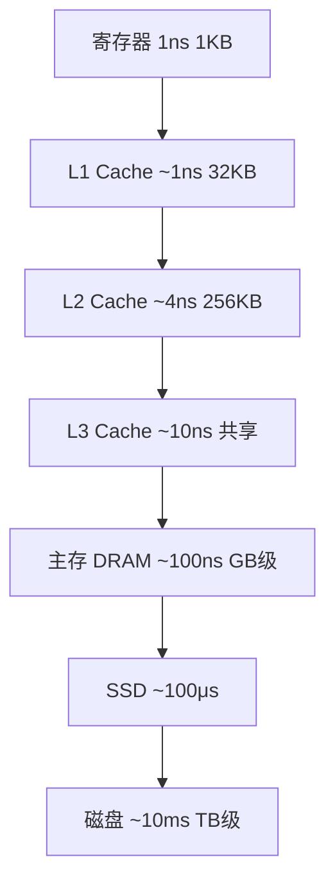

**设计依据：局部性原理**
- **时间局部性**：刚访问的数据很可能再访问（循环变量、Cache）。
- **空间局部性**：访问某地址，附近地址很可能也被访问（数组、预取）。

### 4.2 Cache

CPU 与主存速度差千倍，Cache 是"用小而快的存储挡在中间"。

**映射方式**：
| 方式 | 特点 | 优点/缺点 |
|------|------|-----------|
| 直接映射 | 主存块只映射到固定 Cache 行 | 简单，但冲突率高 |
| 全相联 | 任意位置 | 命中率高，查找慢（需比较全部） |
| 组相联 | 分组，组内全相联 | 折中（主流，如 8-way） |

**替换算法**：LRU（最近最少用）、FIFO、随机。LRU 最常用但要硬件维护。

**写策略**：
- **写直达(Write-Through)**：同时写 Cache 和内存，一致但慢。
- **写回(Write-Back)**：只写 Cache，淘汰时写回内存，快但需脏位。
- **写分配 / 写不分配**：写缺失时是否先调入 Cache。

**Cache 一致性（多核）**：
多核各自有私有 Cache，需协议保证看到一致数据。**MESI** 状态机：
- **M**(Modified) 已修改，独占且脏
- **E**(Exclusive) 独占干净
- **S**(Shared) 共享
- **I**(Invalid) 无效


**伪共享(False Sharing)**：两个 CPU 核心修改**同一 Cache 行**的不同变量，导致该行在核心间反复失效（颠簸）。
```java
// 解决：Cache 行填充对齐（通常 64 字节）
@Contended  // JDK8+ 注解，自动填充（需 -XX:-RestrictContended）
class Counter { volatile long value; /* 填充至 64B */ }
```
> 详见「[Java虚拟机](Java虚拟机.md)」中对象内存布局与 @Contended。

### 4.3 主存与虚拟内存

**DRAM vs SRAM**：SRAM（Cache，贵快、掉电丢）；DRAM（主存，密便宜、需刷新）。

**虚拟内存**：每个进程有独立的虚拟地址空间，由 MMU 映射到物理内存。
- **分页**：固定大小页（如 4KB），页表映射「虚拟页号→物理页框」。
- **分段**：按逻辑段（代码/数据/堆/栈），段表 + 偏移。
- **段页式**：先分段再分页，兼顾两者。
- **TLB（快表）**：页表缓存，加速地址翻译（TLB 命中=1 周期，未命中需多级页表游走）。

**缺页中断(Page Fault)**：
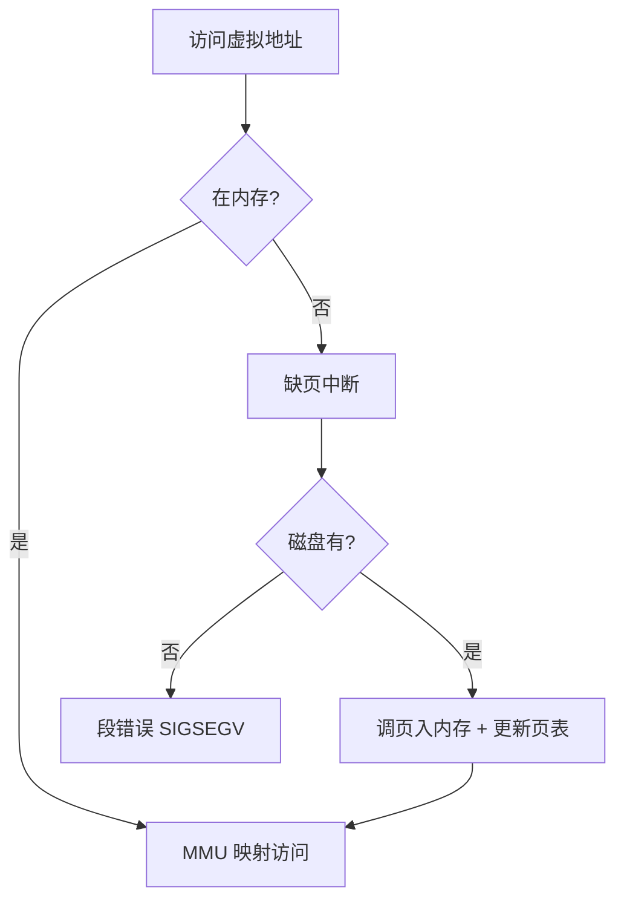

**页面置换算法**：
| 算法 | 思想 | 缺点 |
|------|------|------|
| OPT | 置换最远将来用 | 不可实现（理论最优） |
| FIFO | 先入先出 | Belady 异常（给更多帧反而缺页更多） |
| LRU | 最近最少用 | 近似实现（计数/栈） |
| Clock(二次机会) | 环形链表 + 访问位 | LRU 的工程近似，常用 |

**抖动(Thrashing)**：内存不足，进程频繁换入换出，CPU 利用率暴跌。解决：增加内存、减少并发、工作集模型。

### 4.4 磁盘与 RAID

**访问时间 = 寻道时间 + 旋转延迟 + 传输时间**。SSD 无机械，随机访问远快于 HDD。

**RAID**：
| 级别 | 特点 | 冗余 |
|------|------|------|
| RAID 0 | 条带，提速 | 无，一块坏全丢 |
| RAID 1 | 镜像 | 100% 冗余 |
| RAID 5 | 条带 + 奇偶校验（单盘容错） | 允 1 块坏 |
| RAID 10 | 镜像+条带 | 容错且快，成本高 |

> 口诀：**"存储金字塔，局部性撑腰；Cache 组相联 MESI，虚拟内存分页 TLB；缺页置换 LRU，抖动要警惕。"**

---

## 五、总线与 I/O

### 5.1 总线

总线是各部件共享的传输通道，分**数据总线/地址总线/控制总线**。

**总线仲裁**（多个主设备争用）：
- 集中式：链式查询、计数器定时、独立请求。
- 分布式：各设备自 arbitration。

### 5.2 I/O 控制方式

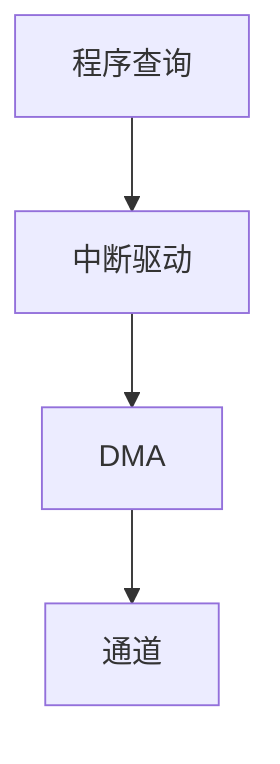

| 方式 | CPU 参与度 | 特点 |
|------|-----------|------|
| 程序查询 | 全程轮询 | 简单，CPU 空转浪费 |
| 中断驱动 | I/O 完成发中断 | CPU 可并行做别的事 |
| DMA | 硬件直接搬数据到内存 | 大块传输不占 CPU |
| 通道 | 专用 I/O 处理器 | 大型机，独立执行通道程序 |

**DMA 流程**：CPU 设好源/目的/长度 → 启动 DMA → DMA 控制器直接搬数据到内存 → 完成发中断通知 CPU。

### 5.3 中断

- **硬件中断**：外设（网卡/磁盘/时钟）请求，异步。
- **软件中断(异常/陷阱)**：指令引发（除零、缺页、系统调用 `int 0x80`/`syscall`）。
- **中断向量表**：中断号 → 处理程序入口。
- **中断优先级 + 嵌套**：高优先级可打断低优先级。

> 系统调用本质是从**用户态陷入内核态**的软中断（陷阱），是应用访问 OS 服务的唯一合法入口。

---

## 六、操作系统核心

> 本节衔接「[Java虚拟机](Java虚拟机.md)」「[场景设计/分布式锁](../场景设计/分布式锁.md)」，讲清进程线程、调度、死锁、系统调用的底层机制。进程/调度/内存/文件/IO 的内核级深挖见「[操作系统](操作系统.md)」。

### 6.1 进程 / 线程 / 协程

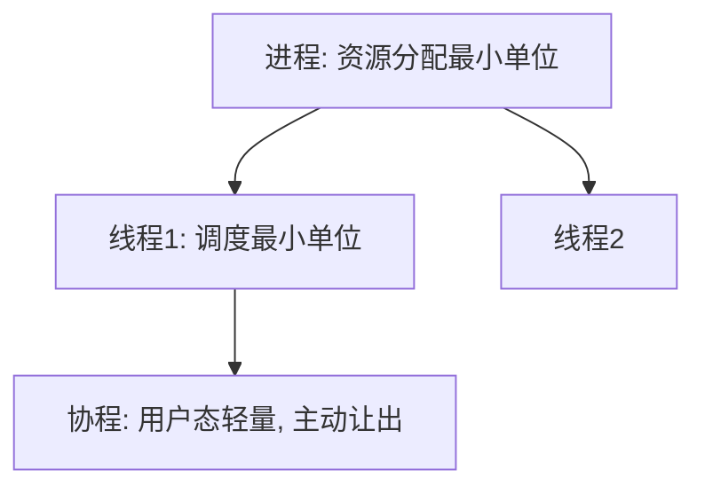

| 概念 | 资源 | 切换成本 | 通信 |
|------|------|----------|------|
| 进程 | 独立地址空间 | 高（切换页表/TLB） | IPC（管道/共享内存/消息队列） |
| 线程 | 共享进程内存 | 中（保存寄存器/栈） | 共享内存（需锁） |
| 协程 | 用户态，单线程内 | 极低（用户态切换） | 共享变量 |

- **上下文切换**：保存/恢复寄存器、PC、栈等。进程切换还要切页表（刷 TLB），更贵。
- **协程**：在用户态由 runtime 调度（Go goroutine、Java Loom、Kotlin），适合高并发 I/O。

### 6.2 进程调度

| 算法 | 思想 | 适用 |
|------|------|------|
| FCFS | 先来先服务 | 简单，长作业霸占 |
| SJF | 最短作业优先 | 平均等待最短，需预知时长 |
| RR | 时间片轮转 | 分时系统，公平 |
| 多级反馈队列 | 多级优先级+时间片 | 通用 OS（Linux CFS 近似） |

- **Linux CFS**（完全公平调度）：按虚拟运行时间 `vruntime` 选最小者，红黑树组织。

### 6.3 同步与通信

- **临界区**：同一时间只允许一个线程进入的代码段。
- **互斥**：锁（互斥量）、自旋锁、信号量。
- **同步**：条件变量、信号量（`P/V` 操作）、管程(Monitor)。
- **死锁**：四个必要条件——**互斥、占有并等待、不可剥夺、循环等待**。
  - 预防：破坏任一条件（如一次性申请全部资源、按序加锁）。
  - 避免：银行家算法（安全序列）。
  - 检测+恢复：资源分配图找环，剥夺/回滚。

```java
// 死锁经典：交叉加锁顺序不一致
// 线程1: lock(A) -> lock(B)
// 线程2: lock(B) -> lock(A)  → 互相等待，死锁
// 解决：全局统一加锁顺序；或用 tryLock + 超时
```

> 分布式场景的锁与并发见「[场景设计/分布式锁](../场景设计/分布式锁.md)」「[场景设计/幂等设计](../场景设计/幂等设计.md)」。

### 6.4 内存管理

- **连续分配**：单一/分区（产生外部碎片）。
- **分页/分段**：见 4.3。
- **伙伴系统 / slab**：内核内存分配器（对象缓存，减少碎片）。
- **碎片**：外部碎片（空闲但不连续）、内部碎片（分配单元内浪费，如页内碎片）。

### 6.5 系统调用与用户态/内核态


- **用户态**：受限执行，不能直接访问硬件。
- **内核态**：特权执行，可访问所有资源。
- **切换开销**：保存用户上下文、权限切换、可能 TLB/Cache 影响。
- 频繁系统调用（如每次写 1 字节）很慢，故用缓冲区（`BufferedWriter`/`BufferedInputStream`）。

> 口诀：**"进程管资源，线程管调度，协程用户态；死锁四条件，加锁须有序；系统调用陷内核，缓冲减切换。"**

---

## 七、编译与链接

### 7.1 编译过程（以 C 为例）


| 阶段 | 输入→输出 | 做什么 |
|------|-----------|--------|
| 预处理 | `.c` → `.i` | 宏替换、`#include` 展开、条件编译 |
| 编译 | `.i` → `.s` | 词法/语法/语义分析，生成汇编 |
| 汇编 | `.s` → `.o` | 汇编指令 → 机器码（可重定位目标文件） |
| 链接 | `.o` + 库 → 可执行 | 符号解析、重定位、合并段 |

### 7.2 静态链接 vs 动态链接

| 方式 | 特点 | 优点/缺点 |
|------|------|-----------|
| 静态链接 | 库代码拷进可执行 | 独立部署，但体积大、库升级需重编 |
| 动态链接 | 运行时加载 `.so`/`.dll` | 共享省内存、热升级，但依赖运行时存在 |

- **符号表(Symbol Table)**：记录函数/变量名与地址，链接时解析。
- **重定位(Relocation)**：把相对地址改成最终虚拟地址。
- **PIC(位置无关代码)**：动态库常用，GOT(全局偏移表) + PLT(过程链接表) 延迟绑定。

### 7.3 与 Java 的衔接

Java 走 `源码(.java) → 字节码(.class) → JVM 解释/JIT 编译 → 机器码`，JVM 的 JIT 把热点字节码**运行时编译**为本地机器码（见「[Java虚拟机](Java虚拟机.md)」中 JIT/C1/C2）。这与 C 的"编译期静态链接"不同，是**运行期动态编译**。

---

## 八、高频面试题速记

| 问题 | 要点 |
|------|------|
| 为什么用补码？ | 0 唯一、加减统一、符号位自然参与 |
| 0.1+0.2 为什么不等于 0.3？ | 二进制无限循环，尾数截断误差；金额用 BigDecimal |
| 大小端是什么？ | 多字节存储顺序，网络用大端，x86 小端 |
| 流水线三类冒险？ | 结构/数据/控制；转发 + 分支预测解决 |
| Cache 映射方式？ | 直接/全相联/组相联；LRU 替换 |
| MESI 干什么？ | 多核 Cache 一致性协议 |
| 伪共享怎么解决？ | Cache 行填充对齐（@Contended） |
| 虚拟内存好处？ | 隔离、扩展、按需调页 |
| 缺页置换 LRU？ | 最近最少用，Clock 为工程近似 |
| 死锁四条件？ | 互斥/占有等待/不可剥夺/循环等待 |
| 进程 vs 线程？ | 资源 vs 调度单位，切换成本不同 |
| 系统调用开销？ | 用户态↔内核态切换，用缓冲减少 |
| 静态 vs 动态链接？ | 拷贝进文件 vs 运行时加载 |

---

## 补充：CPU 流水线与分支预测对代码影响

### 流水线对代码性能的影响

现代 CPU 流水线深度 14-20 级，分支预测失败代价昂贵：

| 流水线深度 | 预测失败代价 | 影响 |
|-----------|------------|------|
| 14 级（Skylake） | ~14 周期清空 | 循环分支预测很重要 |
| 20 级（Zen 3） | ~20 周期清空 | 分支密集代码性能骤降 |

### 分支预测友好的代码模式

```java
// ❌ 分支预测不友好：数据随机分布
for (int i = 0; i < n; i++) {
    if (data[i] > threshold)  // 50% 随机分支
        sum += data[i];
}

// ✅ 分支预测友好：先排序再处理
Arrays.sort(data);  // 数据有序化
for (int i = 0; i < n; i++) {
    if (data[i] > threshold)  // 前半段全 false，后半段全 true
        sum += data[i];
}
```

### 内存访问模式

```java
// ❌ 列优先遍历（缓存不友好，stride = 行长 × 4 字节）
for (int j = 0; j < cols; j++)
    for (int i = 0; i < rows; i++)
        sum += matrix[i][j];

// ✅ 行优先遍历（缓存友好，连续内存访问）
for (int i = 0; i < rows; i++)
    for (int j = 0; j < cols; j++)
        sum += matrix[i][j];
```

## 补充：缓存行伪共享 @Contended

### 伪共享问题

多个 CPU 核心修改同一缓存行（64 字节）的不同变量，导致缓存行在核心间反复失效：

```
Core 0 修改变量 A（同一缓存行）
Core 1 修改变量 B（同一缓存行）
→ 缓存行在两个核心间反复 invalidate，性能骤降 10-100 倍
```

### @Contended 解决方案

```java
// JDK 8+ @Contended 注解：自动填充至缓存行边界（64 字节）
@sun.misc.Contended
class PaddedAtomicLong {
    volatile long value;
    // 自动填充 56 字节（value 8 字节 + 56 = 64 字节缓存行）
}

// 需启动参数：-XX:-RestrictContended
```

### 缓存行大小与对齐

| 平台 | 缓存行大小 | @Contended 填充 |
|------|-----------|-----------------|
| x86_64 | 64 字节 | 56 字节 |
| ARM64 | 64 字节 | 56 字节 |
| Apple M1/M2 | 128 字节 | 120 字节 |

> **注意**：Apple Silicon 缓存行 128 字节，JDK 的 @Contended 按 64 字节填充可能不够。

## 补充：NUMA 对内存分配影响

### NUMA 架构

多路服务器上，每个 CPU 有本地内存和远程内存：

| 访问类型 | 延迟 | 带宽 |
|---------|------|------|
| 本地内存 | ~100ns | 高 |
| 远程内存 | ~150-300ns | 低（需跨互联总线） |

### NUMA 感知的内存分配

```bash
# 查看 NUMA 拓扑
numactl --hardware
numactl --membind=0 java -jar app.jar  # 绑定 NUMA 节点 0

# JVM NUMA 感知
-XX:+UseNUMA           # 启用 NUMA 感知分配
-XX:+UseParallelGC     # NUMA 感知的 GC
```

### Redis 与 NUMA

```bash
# Redis 绑定 NUMA 节点（避免跨节点访问）
numactl --cpunodebind=0 --membind=0 redis-server
```

> **工程建议**：大内存应用（Redis/数据库/JVM）应绑定 NUMA 节点，避免跨节点访问导致延迟翻倍。

## 补充：虚拟内存页错误类型排查

### 页错误类型

| 类型 | 原因 | 处理 |
|------|------|------|
| **Minor Fault（次要缺页）** | 页面在内存但页表未映射 | 更新页表，几乎无开销 |
| **Major Fault（主要缺页）** | 页面在磁盘（swap）需读入 | 磁盘 IO，延迟高（~10ms） |
| **Invalid Fault（非法访问）** | 访问未映射地址 | SIGSEGV（段错误） |

### 排查工具

```bash
# 查看进程缺页统计
cat /proc/<pid>/stat | awk '{print "minflt="$10, "majflt="$12}'

# perf 缺页分析
perf stat -e page-faults,minor-faults,major-faults -p <pid>
perf record -e page-faults -p <pid> -- sleep 10
perf report

# vmstat 查看系统级缺页
vmstat 1
# si/so 列表示 swap 换入/换出频率
```

### 常见缺页场景

| 场景 | 缺页类型 | 优化 |
|------|---------|------|
| Java 大堆启动 | Major（从磁盘加载） | 预热 / -XX:+AlwaysPreTouch |
| Redis 恢复 RDB | Major | AOF 替代 / 大页支持 |
| mmap 大文件 | Major（按需加载） | madvise MADV_SEQUENTIAL |
| 容器冷启动 | Major | 镜像预热 / 资源预分配 |

## 补充：指令集演进（AVX/NEON）

### SIMD 指令集演进

| 指令集 | 位宽 | 寄存器 | 典型用途 |
|--------|------|--------|---------|
| SSE2 | 128-bit | XMM (8个) | 整数/浮点基础 SIMD |
| AVX2 | 256-bit | YMM (16个) | 浮点密集计算 |
| AVX-512 | 512-bit | ZMM (32个) | 科学计算/AI 推理 |
| NEON | 128-bit | Q (16个) | ARM 移动端/嵌入式 |
| SVE | 可变 | Z (32个) | ARM 服务器/AI |

### Java 中的 SIMD

```java
// JDK 9+ Vector API（孵化中）
import jdk.incubator.vector.*;

IntVector sum = IntVector.zero();
for (int i = 0; i < array.length; i += IntVector.SPECIES_PREFERRED.length()) {
    var v = IntVector.fromArray(IntVector.SPECIES_PREFERRED, array, i);
    sum = v.add(sum);
}
```

> **工程建议**：AVX-512 在 Intel Ice Lake+ 上可用，AI 推理场景性能提升显著；ARM NEON 是移动/边缘计算的基础。

## 补充：存储金字塔各级延迟量级表

### 存储层次延迟量级

| 层次 | 存储介质 | 典型延迟 | 容量 | 成本/GB |
|------|---------|---------|------|---------|
| L1 Cache | SRAM | ~1ns | 32-64KB | 极高 |
| L2 Cache | SRAM | ~3-5ns | 256KB-1MB | 极高 |
| L3 Cache | SRAM | ~10-20ns | 4-64MB（共享） | 高 |
| 主存 | DRAM | ~100ns | 16-512GB | 中 |
| 持久内存 | Optane PMem | ~300ns | 128GB-6TB | 中高 |
| NVMe SSD | 3D NAND | ~10-100μs | 1-30TB | 低 |
| SATA SSD | 3D NAND | ~100-500μs | 1-8TB | 低 |
| HDD 机械盘 | 磁盘 | ~5-10ms | 4-20TB | 极低 |
| 网络存储 | NFS/S3 | ~1-10ms | PB 级 | 按需 |

### 延迟对比直觉

```
1μs  = 1,000ns     （L1 Cache 1000 次访问）
1ms  = 1,000μs     （HDD 1 次寻道 = L1 1000万次访问）
1s   = 1,000ms     （网络往返 = L1 10亿次访问）
```

> **工程直觉**：L1 到主存差 100 倍，主存到 HDD 差 10 万倍。这就是为什么 Cache 命中率从 99% 提升到 99.9% 能带来巨大性能提升。

## 九、磁盘 IO 调度算法详解

### 9.1 Linux IO 调度器对比

| 调度器 | 算法 | 特点 | 适用场景 |
|--------|------|------|---------|
| none/noop | 无调度 | 直接下发 | SSD/NVMe/虚拟化 |
| cfq | 完全公平队列 | 按进程公平分配 | 传统 HDD 桌面 |
| deadline | 截止时间优先 | 读优先+写饥饿保护 | 数据库（HDD） |
| mq-deadline | 多队列+截止时间 | 多核优化 | 数据库（SSD/HDD） |
| bfq | 预算公平队列 | 响应优先+带宽控制 | 桌面/交互式 |
| kyber | 双队列 | 读写分离+目标延迟 | 快速设备（NVMe） |
| none | 无调度 | 直接下发 | 多数现代场景 |

```bash
# 查看当前调度器
cat /sys/block/sda/queue/scheduler
# [mq-deadline] kyber bfq none

# 切换调度器
echo mq-deadline > /sys/block/sda/queue/scheduler

# 数据库推荐：mq-deadline（平衡读写延迟）
# SSD/NVMe 推荐：none（减少调度开销）
```

### 9.2 IO 调度器选择决策

```text
选择流程：
  SSD/NVMe？
    → yes → none（无调度）
    → no → HDD
      → 数据库/OLTP？
        → yes → mq-deadline
        → no → 桌面/交互？
          → yes → bfq
          → no → cfq
```

## 十、内存大页（THP/HugePages）配置与调优

### 10.1 HugePages 两种模式

| 模式 | 说明 | 特点 | 适用 |
|------|------|------|------|
| 透明大页（THP） | 内核自动管理 | 配置简单，可能引起延迟抖动 | 通用应用 |
| 静态大页（HugePages） | 应用手动分配 | 性能最优，需应用支持 | 数据库/DPDK |

```bash
# 检查 THP 状态
cat /sys/kernel/mm/transparent_hugepage/enabled
# [always] madvise never

# 禁用 THP（数据库推荐）
echo never > /sys/kernel/mm/transparent_hugepage/enabled
echo never > /sys/kernel/mm/transparent_hugepage/defrag

# 静态 HugePages 配置
echo 1024 > /proc/sys/vm/nr_hugepages  # 分配 1024 个 2MB 大页
# 总内存 = 1024 × 2MB = 2GB

# 查看 HugePages 使用情况
cat /proc/meminfo | grep Huge
# HugePages_Total:    1024
# HugePages_Free:     512
# HugePages_Rsvd:     256
# Hugepagesize:       2048 kB
```

### 10.2 数据库 HugePages 配置

```text
MySQL/PostgreSQL HugePages 配置：
  1. 计算所需大页数：
     innodb_buffer_pool_size / hugepage_size
     例：64GB / 2MB = 32768 大页

  2. 预留大页：
     sysctl -w vm.nr_hugepages=32768

  3. 应用启动时自动使用大页
     → 减少 TLB Miss → 提升缓冲池访问性能

  4. 验证：
     cat /proc/meminfo | grep HugePages_Total
     # HugePages_Total: 32768
```

## 十一、CPU Cache Line 对齐与伪共享

### 11.1 Cache Line 基础

```text
Cache Line（缓存行）：
  CPU 缓存的最小数据单元（通常 64 字节）
  CPU 读取数据时按 Cache Line 整行读取
  相邻内存地址共享同一 Cache Line

伪共享（False Sharing）：
  不同 CPU 核心访问同一 Cache Line 的不同变量
  → 缓存一致性协议（MESI）频繁触发
  → 性能下降 10-100 倍

示例：
  变量 A（4字节）+ 变量 B（4字节）在相邻地址
  → 同一 Cache Line（64字节）
  → 核心1修改A，核心2读取B → 触发缓存一致性
```

### 11.2 伪共享解决方案

```java
// 伪共享问题示例
public class FalseSharing {
    volatile long counter1;  // 8 字节
    volatile long counter2;  // 8 字节（相邻地址 → 同一 Cache Line）
    // 两个线程分别修改 counter1 和 counter2 → 伪共享

// 解决方案 1：填充（Padding）
public class PaddedCounter {
    volatile long counter1;
    long p1, p2, p3, p4, p5, p6, p7; // 填充 56 字节（64-8=56）
    volatile long counter2;
    // counter1 和 counter2 在不同 Cache Line → 无伪共享
}

// 解决方案 2：@Contended 注解（Java 8+）
public class ContendedCounter {
    @sun.misc.Contended
    volatile long counter1;

    @sun.misc.Contended
    volatile long counter2;
    // JVM 自动填充到不同 Cache Line
}
```

```bash
# 验证 Cache Line 大小
getconf LEVEL1_DCACHE_LINESIZE
# 64

# 查看 CPU Cache 拓扑
lscpu | grep cache
# L1d cache:             48K (per core)
# L1i cache:             32K (per core)
# L2 cache:              1.2MB (per core)
# L3 cache:              36MB (shared)
```

## 十二、中断亲和性（IRQ Affinity）配置

```bash
# 查看中断分布
cat /proc/interrupts | head -5
#            CPU0   CPU1   CPU2   CPU3
#  18:   123456      0      0      0   PCI-MSI  nvme0q0

# 设置中断亲和性（将网络中断绑定到 CPU3）
echo 8 > /proc/irq/18/smp_affinity  # 8 = 二进制 1000 = CPU3

# 自动平衡脚本
#!/bin/bash
for irq in $(grep eth0 /proc/interrupts | awk -F: '{print $1}'); do
    cpu=$((irq % $(nproc)))
    echo $((1 << cpu)) > /proc/irq/$irq/smp_affinity
done

# 验证
cat /proc/irq/18/smp_affinity_list
# 3
```

```text
中断亲和性最佳实践：
  1. 网络密集型：网络中断绑定到专用 CPU
  2. 数据库：磁盘中断绑定到专用 CPU
  3. 避免中断集中在 CPU0（默认行为）
  4. 使用 irqbalance 自动平衡（桌面环境）
  5. 生产环境手动配置（精确控制）
```

## 十三、NUMA 内存分配策略

### 13.1 NUMA 架构

```text
NUMA（Non-Uniform Memory Access）：
  多 CPU 插槽 → 每个 CPU 有本地内存
  访问本地内存快（~100ns）
  访问远程内存慢（~150-300ns）

  NUMA 节点：
    Node 0：CPU 0-15 + 本地内存 64GB
    Node 1：CPU 16-31 + 本地内存 64GB
    跨节点访问：QPI/UPI 互联（延迟增加 50-200%）
```

```bash
# 查看 NUMA 拓扑
numactl --hardware
# available: 2 nodes (0-1)
# node 0 cpus: 0 1 2 3 4 5 6 7 8 9 10 11 12 13 14 15
# node 0 size: 65536 MB
# node 1 cpus: 16 17 18 19 20 21 22 23 24 25 26 27 28 29 30 31
# node 1 size: 65536 MB

# 查看内存访问距离
numactl --hardware | grep dist
# node distances:
# node   0   1
#   0:  10  21
#   1:  21  10

# NUMA 策略配置
numactl --cpunodebind=0 --membind=0 ./mysql  # 绑定到 NUMA 节点 0
numactl --interleave=all ./mysql             # 内存交织（推荐大内存应用）
```

### 13.2 数据库 NUMA 配置

```text
MySQL NUMA 配置：
  方案 1：numactl --interleave=all mysqld
    内存均匀分配到所有节点
    避免单节点内存耗尽
    推荐：大内存服务器（>128GB）

  方案 2：numactl --cpunodebind=0 --membind=0 mysqld
    绑定到单个 NUMA 节点
    性能最优（无跨节点访问）
    适用：内存 < 节点容量

  方案 3：MySQL 8.0 内置 NUMA 支持
    innodb_numa_interleave=ON
    自动使用 interleave 策略
```

## 十四、SSD 特性（TRIM/WA/FTL）

### 14.1 SSD 关键特性

| 特性 | 说明 | 影响 |
|------|------|------|
| TRIM | 通知 SSD 哪些块已删除 | 保持写入性能 |
| WA（Write Amplification） | 实际写入量/逻辑写入量 | WA 越低越好 |
| FTL | 闪存转换层（逻辑→物理映射） | 隐藏随机写 |
| 磨损均衡 | 均匀使用所有块 | 延长寿命 |
| Over-Provisioning | 预留空间（7-28%） | 提升性能和寿命 |

```bash
# 检查 TRIM 支持
fstrim -v /
# /: 123456789 bytes (118 MiB) trimmed

# 启用自动 TRIM
# 方式 1：fstab 挂载选项
# /dev/sda1 / ext4 defaults,discard 0 0

# 方式 2：定期 fstrim（推荐生产环境）
# crontab: 0 2 * * * fstrim /

# 检查 SSD 健康度
smartctl -a /dev/nvme0n1 | grep -E "percentage_used|data_units"
# percentage_used: 5%
# data_units_written: 123456789
```

### 14.2 SSD 性能优化

```text
SSD 优化 Checklist：
  1. 文件系统：ext4/xfs（避免 btrfs 在 SSD 上的 CoW 问题）
  2. 挂载选项：discard,noatime,nodiratime
  3. IO 调度器：none/noop（减少调度开销）
  4. 预留空间：7-28% OP（提升性能和寿命）
  5. TRIM：定期 fstrim（保持性能）
  6. 对齐：分区 4K 对齐（避免读写放大）
  7. 写缓存：开启 Write Cache（危险：断电丢数据）
  8. 告警：监控 percentage_used（SMART）
```

## 十五、知识关联图


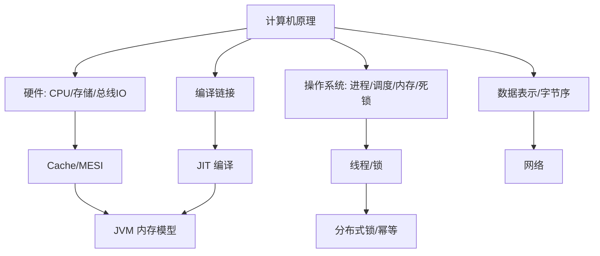

## 指令集架构对比

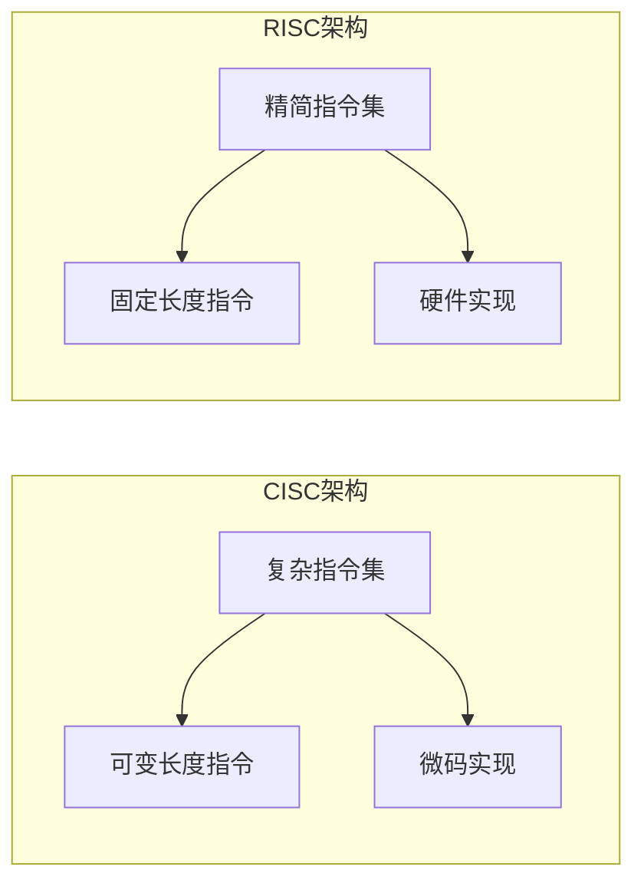

### 架构对比表

| 特性 | CISC (x86) | RISC (ARM/RISC-V) |
|------|------------|-------------------|
| 指令长度 | 可变 | 固定 |
| 指令数量 | 200+ | 50-100 |
| 寻址方式 | 多种 | 少量 |
| 流水线 | 复杂 | 简单 |
| 功耗 | 高 | 低 |
| 应用场景 | 桌面/服务器 | 移动/嵌入式 |

## 流水线技术

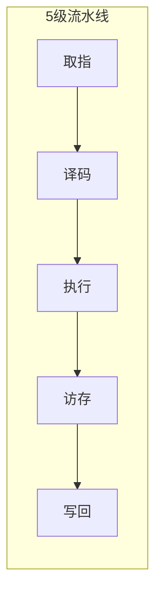

### 流水线冒险

| 冒险类型 | 原因 | 解决方案 |
|----------|------|----------|
| 数据冒险 | 数据依赖 | 前递、流水线停顿 |
| 控制冒险 | 分支指令 | 分支预测、延迟槽 |
| 结构冒险 | 资源冲突 | 资源复制 |

### 分支预测

```
静态预测：
  总是预测跳转（Forward Not Taken）
  总是预测不跳转（Backward Taken）

动态预测：
  1-bit预测器：简单但易抖动
  2-bit预测器：饱和计数器
  相关预测器：基于历史模式
```

## Cache 优化策略

```bash
# 查看CPU Cache信息
lscpu | grep cache
getconf -a | grep CACHE

# 查看Cache未命中
perf stat -e cache-misses,cache-references ./myapp
```

### Cache 性能指标

| 指标 | 说明 | 优化方向 |
|------|------|----------|
| 命中率 | Cache命中比例 | 提高局部性 |
| 未命中代价 | 访问内存延迟 | 减少未命中 |
| 替换策略 | LRU/LFU/FIFO | 选择合适策略 |

### 优化技巧

```c
// 数组访问优化（行优先 vs 列优先）
// 慢：列优先访问（缓存不友好）
for (int j = 0; j < N; j++) {
    for (int i = 0; i < N; i++) {
        sum += matrix[i][j];  // 步长为N
    }
}

// 快：行优先访问（缓存友好）
for (int i = 0; i < N; i++) {
    for (int j = 0; j < N; j++) {
        sum += matrix[i][j];  // 步长为1
    }
}
```

## 总线技术

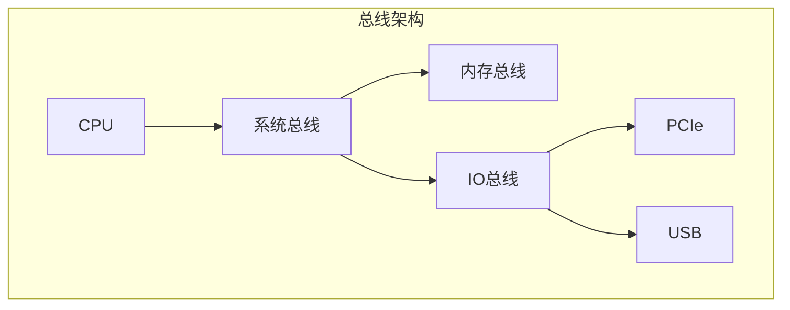

### 总线类型对比

| 总线类型 | 带宽 | 延迟 | 用途 |
|----------|------|------|------|
| PCIe 4.0 | 32GB/s | 低 | 显卡/SSD |
| PCIe 5.0 | 64GB/s | 极低 | 高速设备 |
| DDR4 | 25GB/s | 极低 | 内存 |
| DDR5 | 50GB/s | 极低 | 内存 |

## 磁盘存储技术

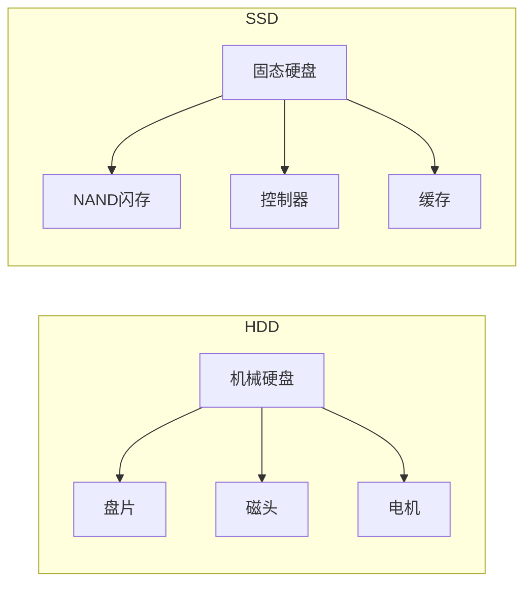

### HDD vs SSD

| 特性 | HDD | SSD |
|------|-----|-----|
| 随机读写 | 慢(ms级) | 快(μs级) |
| 顺序读写 | 中等 | 快 |
| 延迟 | 5-10ms | 0.1ms |
| 寿命 | 有限(机械磨损) | 有限(写入次数) |
| 成本 | 低 | 高 |
| 应用场景 | 冷存储/归档 | 系统盘/热数据 |

### SSD 优化

```bash
# 启用TRIM
fstrim -v /

# 查看SSD健康
smartctl -a /dev/sda

# 配置Noop调度器（SSD推荐）
echo noop > /sys/block/sda/queue/scheduler
```

## 多核架构

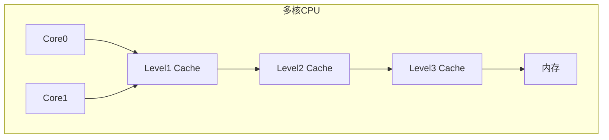

### 缓存一致性协议

| 协议 | 状态 | 说明 |
|------|------|------|
| MESI | Modified/Exclusive/Shared/Invalid | Intel协议 |
| MOESI | 增加Owned状态 | AMD协议 |
| MSI | 三状态简化版 | 基础协议 |

## 功耗管理

```bash
# CPU功耗管理
cat /proc/cpuinfo | grep "cpu MHz"
cpupower frequency-info

# 节能模式
echo powersave > /sys/devices/system/cpu/cpu0/cpufreq/scaling_governor
echo performance > /sys/devices/system/cpu/cpu0/cpufreq/scaling_governor
```

### 功耗管理技术

| 技术 | 说明 | 适用场景 |
|------|------|----------|
| DVFS | 动态电压频率调整 | 通用 |
| C-State | CPU空闲状态 | 低负载 |
| P-State | CPU性能状态 | 高性能 |
| Sleep | 深度睡眠 | 移动设备 |

> 口诀：**"功耗管理要平衡，性能与省电；DVFS 动态调，C-State 空闲睡。"**

---

## 十六、CPU 分支预测深度

### 16.1 静态分支预测

```
静态预测策略：
  1. Forward Not Taken：向前跳转预测不跳（循环退出）
  2. Backward Taken：向后跳转预测跳（循环进入）
  3. 编译器提示：likely/unlikely 注解（Linux 内核常用）
  4. Profile-Guided：基于运行时 profile 做最优预测
```

### 16.2 动态分支预测

```
动态预测器演进：
  1-bit 预测器：简单但易抖动
  2-bit 饱和计数器：需连续两次误判才翻转
  相关预测器：基于历史模式（Gshare/TAGE）
  神经分支预测器：感知器（Perceptron）

Gshare 预测器：
  分支地址 XOR 全局历史寄存器
  → 索引到分支预测表（BHT）
  → 减少别名冲突（aliasing）

TAGE（TAgged GEometric）预测器：
  多个历史长度的表（几何递增）
  长历史捕获远依赖，短历史捕获近依赖
  现代 CPU 主流实现（Intel/AMD/ARM）
```

### 16.3 分支预测对代码影响

```java
// ❌ 分支预测不友好：数据随机分布
for (int i = 0; i < n; i++) {
    if (data[i] > threshold)  // 50% 随机分支
        sum += data[i];
}

// ✅ 分支预测友好：先排序再处理
Arrays.sort(data);
for (int i = 0; i < n; i++) {
    if (data[i] > threshold)  // 前半段全 false，后半段全 true
        sum += data[i];
}
```

## 十七、虚拟内存四级页表

### 17.1 x86-64 四级页表

```text
虚拟地址结构（48 位虚拟地址，64 位系统）：
  PML4 Index (9位) → PDPT Index (9位) → PD Index (9位) → PT Index (9位) → Offset (12位)

页表层级：
  PML4 (Page Map Level 4) → 1 个条目覆盖 512GB
  PDPT (Page Directory Pointer Table) → 1 个条目覆盖 1GB
  PD (Page Directory) → 1 个条目覆盖 2MB
  PT (Page Table) → 1 个条目覆盖 4KB
  Offset → 页内偏移（4KB 页）

CR3 寄存器 → 当前进程的 PML4 基地址
```

### 17.2 TLB Miss 处理流程

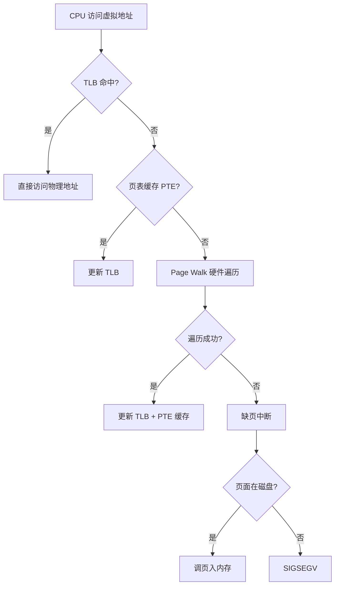

## 十八、内存模型（TSO/x86/ARM）

### 18.1 内存一致性模型对比

| 模型 | 架构 | 特点 | 编程影响 |
|------|------|------|----------|
| TSO (Total Store Order) | x86 | 强一致性，Store-Load 重排 | 低（大多数程序无感知） |
| PSO (Partial Store Order) | SPARC | 弱一些，Store 可重排 | 需要 barrier |
| Weak Ordering | ARM/RISC-V | 弱一致性，所有操作可重排 | 必须显式 barrier |

### 18.2 内存屏障（Memory Barrier）

```java
// Java 内存模型中的屏障
// Store Barrier: 保证 Store 之前的写对其他 CPU 可见
// Load Barrier: 保证 Load 之后的读看到最新的写

// volatile 语义：StoreLoad 屏障
// synchronized：进入时 Acquire 屏障，退出时 Release 屏障
// final：构造函数的 Store 屏障
```

## 十九、进程调度（CFS/RT/SCHED_DEADLINE）

### 19.1 Linux 调度器对比

| 调度器 | 策略 | 适用 |
|--------|------|------|
| CFS (Completely Fair Scheduler) | 虚拟运行时间，红黑树 | 普通进程 |
| SCHED_FIFO | 实时 FIFO，同优先级轮转 | 实时任务 |
| SCHED_RR | 实时轮转，时间片 | 实时任务 |
| SCHED_DEADLINE | 最高优先级，截止时间调度 | 硬实时 |

### 19.2 CFS 核心原理

```
CFS 核心概念：
  vruntime（虚拟运行时间）：
    = 实际运行时间 × (NICE_0_WEIGHT / 进程权重)
    权重越高 → vruntime 增长越慢 → 获得更多 CPU

  红黑树：
    所有可运行进程按 vruntime 排序
    最左节点（最小 vruntime）→ 下一个执行
    插入/删除 O(log N)

  nice 值：
    -20（最高优先级）到 19（最低）
    每级 nice 对应不同权重
    nice 每增加 1，权重约减少 10%
```

## 二十、I/O 模型

### 20.1 五种 I/O 模型

```mermaid
flowchart TD
    A[I/O 模型] --> B[阻塞 I/O]
    A --> C[非阻塞 I/O]
    A --> D[IO 多路复用]
    A --> E[信号驱动 I/O]
    A --> F[异步 I/O]
```

| 模型 | 特点 | 适用 |
|------|------|------|
| 阻塞 I/O | 等待数据就绪 | 简单场景 |
| 非阻塞 I/O | 轮询检查 | 低并发 |
| IO 多路复用 | select/poll/epoll 监听多个 fd | 高并发网络 |
| 信号驱动 I/O | 内核通知就绪 | 特殊场景 |
| 异步 I/O | 内核完成通知 | 高性能 |

### 20.2 epoll 机制

```text
epoll 三系统调用：
  epoll_create：创建 epoll 实例
  epoll_ctl：注册/修改/删除监听 fd
  epoll_wait：等待事件

epoll 优势（vs select/poll）：
  1. 事件驱动，非轮询
  2. 支持百万级 fd
  3. 内核与用户空间共享内存（mmap）
  4. 支持 ET/LT 两种触发模式

ET（Edge Trigger）：状态变化时触发，高效但需一次读完
LT（Level Trigger）：只要就绪就触发，简单但可能重复通知
```

## 二十一、GPU 并行计算基础

### 21.1 SIMT 架构

```text
GPU 执行模型（SIMT: Single Instruction Multiple Thread）：
  线程束（Warp）：32 个线程执行相同指令
  流多处理器（SM）：多个 Warp 并发执行
  全局内存（Global Memory）：所有线程共享

  Warp 调度：
    每个 SM 有多个 Warp
    Warp 内所有线程执行同一指令
    分支发散（Branch Divergence）：Warp 内线程走不同分支 → 串行执行

  Shared Memory：
    每个 SM 的共享内存（16-64KB）
    速度快于全局内存（~10x）
    线程协作的关键
```

### 21.2 GPU 应用场景

| 场景 | 说明 | 加速比 |
|------|------|--------|
| 深度学习训练 | 矩阵运算并行 | 10-100x |
| 科学计算 | 流体/碰撞模拟 | 10-50x |
| 图像处理 | 像素级并行 | 5-20x |
| 密码破解 | 暴力枚举并行 | 100x+ |
| 区块链挖矿 | 哈希计算并行 | 100x+ |

## CPU 分支预测深度

### 分支预测原理

```text
分支预测类型：
  静态预测：总是预测不跳转（Not Taken）
  动态预测：基于历史行为预测

动态预测算法：
  1 位预测器：记录上次跳转状态
  2 位饱和计数器：需要两次错误才改变预测
  相关预测器：考虑前N次分支结果
  TAGE：多历史长度组合预测（现代CPU）
```

### 分支预测对代码的影响

```java
// 好的代码：分支可预测
for (int i = 0; i < 1000; i++) {
    if (i % 2 == 0) {  // 50%可预测
        process(i);
    }
}

// 差的代码：分支不可预测
Random rand = new Random();
for (int i = 0; i < 1000; i++) {
    if (rand.nextBoolean()) {  // 随机，不可预测
        process(i);
    }
}
```

## 虚拟内存四级页表

### 页表结构

```text
x86-64 四级页表：
  PGD（页全局目录）→ PUD（页上级目录）→ PMD（页中间目录）→ PTE（页表项）

  虚拟地址拆分：
    PGD 索引：9位（512项）
    PUD 索引：9位（512项）
    PMD 索引：9位（512项）
    PTE 索引：9位（512项）
    页内偏移：12位（4KB页）

  总共：9+9+9+9+12 = 48位虚拟地址
```

### TLB 优化

| TLB 层级 | 大小 | 延迟 | 说明 |
|----------|------|------|------|
| L1 dTLB | 64项 | 1周期 | 数据TLB |
| L1 iTLB | 128项 | 1周期 | 指令TLB |
| L2 sTLB | 1024-2048项 | 7周期 | 统一TLB |

## 内存模型（TSO/x86/ARM）

### 内存一致性模型

| 模型 | 处理器 | 特点 |
|------|--------|------|
| TSO | x86 | 有保证的存储顺序 |
| PSO | SPARC | 允许存储重排 |
| 弱一致性 | ARM/RISC-V | 最小保证 |

```text
TSO（Total Store Order）：
  写-写：保证顺序
  写-读：允许重排
  读-读：保证顺序
  读-写：允许重排
```

## 进程调度（CFS/RT/SCHED_DEADLINE）

### 调度算法对比

| 算法 | 适用 | 特点 |
|------|------|------|
| CFS | 普通进程 | 公平调度 |
| RT | 实时进程 | 优先级调度 |
| SCHED_DEADLINE | 硬实时 | 截止时间保证 |

```c
// 设置调度策略
struct sched_param param;
param.sched_priority = 50;
sched_setscheduler(pid, SCHED_FIFO, &param);
```

## I/O 模型

### 五种 I/O 模型

| 模型 | 阻塞 | 非阻塞 | 多路复用 | 异步 |
|------|------|--------|----------|------|
| 阻塞I/O | ✅ | ❌ | ❌ | ❌ |
| 非阻塞I/O | ❌ | ✅ | ❌ | ❌ |
| I/O多路复用 | ❌ | ❌ | ✅ | ❌ |
| 信号驱动I/O | ❌ | ❌ | ❌ | ❌ |
| 异步I/O | ❌ | ❌ | ❌ | ✅ |

### epoll 实现

```c
// epoll 使用示例
int epfd = epoll_create1(0);
struct epoll_event ev;
ev.events = EPOLLIN;
ev.data.fd = sockfd;
epoll_ctl(epfd, EPOLL_CTL_ADD, sockfd, &ev);

struct epoll_event events[10];
int nfds = epoll_wait(epfd, events, 10, -1);
for (int i = 0; i < nfds; i++) {
    if (events[i].data.fd == sockfd) {
        // 处理连接
    }
}
```

## 补充：CPU分支预测深度原理

### 静态/动态/Gshare/TAGE原理

| 预测类型 | 算法 | 准确率 | 硬件开销 | 适用场景 |
|----------|------|--------|----------|----------|
| 静态预测 | Always Not Taken | ~60% | 无 | 简单CPU |
| 静态预测 | Backward Taken | ~70% | 无 | 循环代码 |
| 动态预测 | 1-bit | ~85% | 极低 | 嵌入式 |
| 动态预测 | 2-bit饱和计数 | ~90% | 低 | 通用CPU |
| 动态预测 | Gshare | ~93% | 中 | 现代CPU |
| 动态预测 | TAGE | ~96% | 高 | 高端CPU |

```text
TAGE（TAgged GEometric）预测器原理：
  多个历史长度表（几何递增）：
    T0: 无历史（静态）
    T1: 4位历史
    T2: 8位历史
    T3: 16位历史
    T4: 32位历史
  
  预测流程：
    1. 用全局历史索引所有表
    2. 找到最长匹配的表
    3. 用该表的预测结果
    4. 未命中时用最短历史表
  
  优势：
    长历史捕获远依赖（循环）
    短历史捕获近依赖（分支）
    多表组合提高准确率
```

### 分支预测对代码影响

```java
// ❌ 分支预测不友好：数据随机分布
int sum = 0;
for (int i = 0; i < n; i++) {
    if (data[i] > threshold)  // 50%随机分支
        sum += data[i];
}
// 预测准确率~50%，流水线频繁flush

// ✅ 分支预测友好：先排序再处理
Arrays.sort(data);  // 数据有序化
int sum = 0;
for (int i = 0; i < n; i++) {
    if (data[i] > threshold)  // 前半段全false，后半段全true
        sum += data[i];
}
// 预测准确率~99%，流水线高效运行
```

## 补充：虚拟内存四级页表

### 四级页表结构

```text
x86-64四级页表结构：
  虚拟地址（48位）：
    PML4 Index (9位) → 512个条目
    PDPT Index (9位) → 每个PML4条目512个子条目
    PD Index (9位) → 每个PDPT条目512个子条目
    PT Index (9位) → 每个PD条目512个子条目
    Offset (12位) → 4KB页内偏移
  
  CR3寄存器 → 当前进程的PML4基地址
  每次上下文切换 → 切换CR3 → 刷新TLB
  
  页表项（PTE）格式：
    63: NX (不可执行位)
    62: 保留
    12:11: AVL (软件可用)
    11:0: 物理页框号
  
  TLB（快表）：
    L1 dTLB: 64项, 1周期
    L1 iTLB: 128项, 1周期
    L2 sTLB: 1024-2048项, 7周期
```

### TLB Miss处理流程

```text
TLB Miss处理流程：
  1. CPU访问虚拟地址
  2. TLB未命中（TLB Miss）
  3. 硬件Page Walk遍历四级页表
  4. 每级访问内存（~100ns）
  5. 找到物理页框号
  6. 计算物理地址
  7. 访问数据
  8. 更新TLB缓存
  
  Page Fault（缺页）：
    1. 页表项Present位=0
    2. 触发缺页中断
    3. 内核检查是否在磁盘
    4. 在磁盘 → 调页入内存
    5. 不在磁盘 → SIGSEGV
```

## 补充：内存模型（TSO/x86/ARM差异）

### 内存一致性模型对比

| 模型 | 处理器 | 重排序规则 | 编程影响 |
|------|--------|-----------|----------|
| TSO | x86 | Store-Load可重排 | 低（大多数程序无感知） |
| PSO | SPARC | Store可重排 | 需要barrier |
| Weak Ordering | ARM/RISC-V | 所有操作可重排 | 必须显式barrier |

```java
// x86 TSO模型（强一致性）
// Store-Store不会重排
// Load-Load不会重排
// 但Store-Load可能重排

// ARM弱一致性模型
// 所有操作都可能重排
// 必须用内存屏障保证顺序

// Java内存模型（JMM）
// volatile: StoreLoad屏障
// synchronized: Acquire+Release屏障
// final: 构造函数Store屏障
```

## 补充：进程调度（CFS vruntime/RT/SCHED_DEADLINE）

### Linux调度器对比

| 调度器 | 策略 | 适用 | 延迟 |
|--------|------|------|------|
| CFS | 虚拟运行时间，红黑树 | 普通进程 | 中 |
| SCHED_FIFO | 实时FIFO，同优先级轮转 | 实时任务 | 低 |
| SCHED_RR | 实时轮转，时间片 | 实时任务 | 低 |
| SCHED_DEADLINE | 最高优先级，截止时间调度 | 硬实时 | 最低 |

```c
// CFS核心原理
// vruntime = 实际运行时间 × (NICE_0_WEIGHT / 进程权重)
// 权重越高 → vruntime增长越慢 → 获得更多CPU

// 红黑树组织所有可运行进程
// 最左节点（最小vruntime）→ 下一个执行
// 插入/删除 O(log N)

// nice值：
// -20（最高优先级）到 19（最低）
// 每级nice对应不同权重
// nice每增加1，权重约减少10%
```

## 补充：I/O模型（阻塞/非阻塞/IO多路复用/异步IO对比）

| 模型 | 阻塞 | 非阻塞 | 多路复用 | 异步 | 适用场景 |
|------|------|--------|----------|------|----------|
| 阻塞I/O | ✅ | ❌ | ❌ | ❌ | 简单场景 |
| 非阻塞I/O | ❌ | ✅ | ❌ | ❌ | 低并发 |
| I/O多路复用 | ❌ | ❌ | ✅ | ❌ | 高并发网络 |
| 信号驱动I/O | ❌ | ❌ | ❌ | ❌ | 特殊场景 |
| 异步I/O | ❌ | ❌ | ❌ | ✅ | 高性能 |

```c
// epoll机制
// epoll_create: 创建epoll实例
// epoll_ctl: 注册/修改/删除监听fd
// epoll_wait: 等待事件

// epoll优势（vs select/poll）：
// 1. 事件驱动，非轮询
// 2. 支持百万级fd
// 3. 内核与用户空间共享内存（mmap）
// 4. 支持ET/LT两种触发模式

// ET（Edge Trigger）：状态变化时触发，高效但需一次读完
// LT（Level Trigger）：只要就绪就触发，简单但可能重复通知
```

## 补充：GPU并行（SIMT/Warp/Shared Memory/Block/Grid）

### GPU执行模型

```text
GPU执行模型（SIMT）：
  Thread（线程）：最小执行单元
  Warp（线程束）：32个线程执行相同指令
  SM（流多处理器）：多个Warp并发执行
  Block（线程块）：共享Shared Memory的线程组
  Grid（线程网格）：多个Block组成的全局
  
  Warp调度：
    每个SM有多个Warp
    Warp内所有线程执行同一指令
    分支发散（Branch Divergence）：Warp内线程走不同分支→串行执行
  
  Shared Memory：
    每个SM的共享内存（16-64KB）
    速度快于全局内存（~10x）
    线程协作的关键
```

### GPU应用场景

| 场景 | 说明 | 加速比 |
|------|------|--------|
| 深度学习训练 | 矩阵运算并行 | 10-100x |
| 科学计算 | 流体/碰撞模拟 | 10-50x |
| 图像处理 | 像素级并行 | 5-20x |
| 密码破解 | 暴力枚举并行 | 100x+ |
| 区块链挖矿 | 哈希计算并行 | 100x+ |

## 补充：CPU流水线（超分支/超标量/乱序执行）

### 流水线技术对比

| 技术 | 说明 | 优点 | 缺点 |
|------|------|------|------|
| 超流水线 | 增加流水线级数 | 提高主频 | 分支惩罚大 |
| 超标量 | 多发射（多执行单元） | 每周期多条指令 | 硬件复杂 |
| 乱序执行 | 打破程序顺序 | 隐藏延迟 | 硬件复杂 |
| 投机执行 | 预测分支后提前执行 | 提高指令级并行 | 预测错浪费资源 |

```text
乱序执行原理：
  1. 取指队列（Instruction Queue）
  2. 重命名寄存器（消除WAW/WAR冒险）
  3. 保留站（Reservation Station）等待操作数
  4. 就绪指令送执行单元
  5. 重排序缓冲（ROB）保证提交顺序
  
  Tomasulo算法：
    每个指令分配保留站条目
    操作数就绪后执行
    结果广播给等待的指令
    无WAW/WAR冒险
```

## 补充：缓存层次（L1/L2/L3/预取策略）

### 缓存层次延迟量级

| 层次 | 存储介质 | 典型延迟 | 容量 | 成本/GB |
|------|---------|---------|------|---------|
| L1 Cache | SRAM | ~1ns | 32-64KB | 极高 |
| L2 Cache | SRAM | ~3-5ns | 256KB-1MB | 极高 |
| L3 Cache | SRAM | ~10-20ns | 4-64MB（共享） | 高 |
| 主存 | DRAM | ~100ns | 16-512GB | 中 |
| NVMe SSD | 3D NAND | ~10-100μs | 1-30TB | 低 |
| HDD | 磁盘 | ~5-10ms | 4-20TB | 极低 |

### 预取策略

```text
CPU预取策略：
  硬件预取：
    流预取：检测连续访问，预取后续cache line
    步长预取：检测固定步长，预取下一个位置
    关联预取：记录访问模式，预测后续访问
  
  软件预取：
    __builtin_prefetch()：GCC内置函数
    PRAGMA prefetch：编译器指令
    手动循环展开：减少预取开销
  
  预取调优：
    预取距离：太近来不及，太远浪费带宽
    预取粒度：单cache line vs 多cache line
    预取触发：首次访问 vs 第N次访问
```

## 补充：总线架构（PCIe/NUMA）

### PCIe代际对比

| 代际 | 带宽/通道 | x16带宽 | 延迟 | 适用 |
|------|----------|---------|------|------|
| PCIe 3.0 | 8GT/s | 16GB/s | ~1μs | 传统设备 |
| PCIe 4.0 | 16GT/s | 32GB/s | ~0.5μs | NVMe SSD |
| PCIe 5.0 | 32GT/s | 64GB/s | ~0.25μs | 高速网络 |
| PCIe 6.0 | 64GT/s | 128GB/s | ~0.1μs | 未来设备 |

### NUMA架构

```text
NUMA（Non-Uniform Memory Access）：
  多CPU插槽 → 每个CPU有本地内存
  访问本地内存快（~100ns）
  访问远程内存慢（~150-300ns）
  
  NUMA节点：
    Node 0: CPU 0-15 + 本地内存64GB
    Node 1: CPU 16-31 + 本地内存64GB
    跨节点访问：QPI/UPI互联（延迟增加50-200%）
  
  最佳实践：
    大内存应用绑定NUMA节点
    使用numactl工具绑定
    监控跨节点访问比例
```

### 进程vs线程vs协程

| 特性 | 进程 | 线程 | 协程 |
|------|------|------|------|
| 资源消耗 | 高 | 中 | 低 |
| 调度方式 | OS调度 | OS调度 | 用户态调度 |
| 内存空间 | 独立 | 共享 | 共享 |
| 适用场景 | 独立任务 | 并发任务 | IO密集 |
| 切换开销 | 高 | 中 | 低 |

### 虚拟内存

```text
虚拟内存流程：
  CPU → 虚拟地址 → 页表 → 物理地址

页表结构：
  页号 → 物理块号
  偏移量不变

TLB（快表）：
  缓存常用页表项
  命中：直接获取物理地址
  未命中：查页表，更新TLB

缺页中断：
  访问的页不在内存 → 触发缺页
  从磁盘调入 → 更新页表

Copy-on-Write：
  fork()时不复制数据
  写入时才复制
  优化：fork性能
```

### CPU缓存

| 缓存级别 | 大小 | 延迟 | 适用场景 |
|----------|------|------|----------|
| L1 | 32-64KB | 1-4ns | 热数据 |
| L2 | 256KB-1MB | 4-10ns | 温数据 |
| L3 | 数MB | 10-30ns | 共享数据 |

```text
伪共享问题：
  同一缓存行不同变量
  多核修改导致缓存失效
  解决：填充到缓存行大小（64字节）

缓存友好算法：
  1. 顺序访问（空间局部性）
  2. 小数据结构（适配缓存）
  3. 避免随机访问
```

### 内存对齐

```c
// 结构体对齐
struct A {
    char a;    // 1字节
    int b;     // 4字节（填充3字节）
    char c;    // 1字节
};  // 大小：12字节（对齐后）

struct B {
    char a;
    char c;
    int b;
};  // 大小：8字节（紧凑）

// 陷阱
struct C {
    int a;
    char b;
    short c;
};  // 大小：8字节（非6字节）
```

### I/O模型

| 模型 | 阻塞 | 非阻塞 | 多路复用 | 事件驱动 |
|------|------|--------|----------|----------|
| 阻塞I/O | 是 | 否 | 否 | 否 |
| 非阻塞I/O | 否 | 是 | 否 | 否 |
| select/poll | 是 | 否 | 是 | 否 |
| epoll | 是 | 否 | 是 | 是 |
| io_uring | 否 | 否 | 否 | 异步 |

### 并发原语

```c
// 原子操作
__sync_fetch_and_add(&counter, 1);

// CAS操作
bool compare_and_swap(int *ptr, int old_val, int new_val) {
    return __sync_bool_compare_and_swap(ptr, old_val, new_val);
}

// 自旋锁
while (__sync_lock_test_and_set(&lock, 1)) {
    // 忙等待
}
__sync_lock_release(&lock);
```

### 编译优化

| 优化类型 | 说明 | 影响 |
|----------|------|------|
| 内联 | 函数体替换调用 | 减少调用开销 |
| 常量折叠 | 编译期计算常量 | 减少运行时计算 |
| 循环展开 | 减少循环控制开销 | 增加代码体积 |
| 分支预测 | 预测分支走向 | 减少分支失败 |

### 安全基础

| 安全机制 | 说明 | 防护目标 |
|----------|------|----------|
| ASLR | 地址空间随机化 | 缓冲区溢出 |
| DEP | 数据执行保护 | 代码注入 |
| 栈溢出 | 栈保护 | 栈攻击 |
| Spectre | 分支预测攻击 | 侧信道 |
| Meltdown | 乱序执行攻击 | 内存访问 |

### 性能分析

| 工具 | 用途 | 指标 |
|------|------|------|
| perf | CPU性能 | 指令数/缓存命中 |
| valgrind | 内存分析 | 内存泄漏 |
| iostat | I/O分析 | IOPS/延迟 |
| vmstat | 系统分析 | CPU/内存/IO |

### 计算机组件

```text
CPU → 总线 → 内存
  ↓
磁盘 ← I/O控制器
  ↓
网络 ← 网卡
```

> 参考：
> - 唐朔飞《计算机组成原理》、Patterson《计算机组成与设计：硬件/软件接口》(量化方法)
> -  Bryant《深入理解计算机系统》(CSAPP)、Silberschatz《操作系统概念》
> - 基础知识「[网络](网络.md)」「[数据结构](数据结构.md)」「[Java虚拟机](Java虚拟机.md)」「[操作系统](操作系统.md)」
> - 场景设计「[分布式锁](../场景设计/分布式锁.md)」「[幂等设计](../场景设计/幂等设计.md)」「[生产问题排查实战](../场景设计/生产问题排查实战：常见故障与处置步骤.md)」
