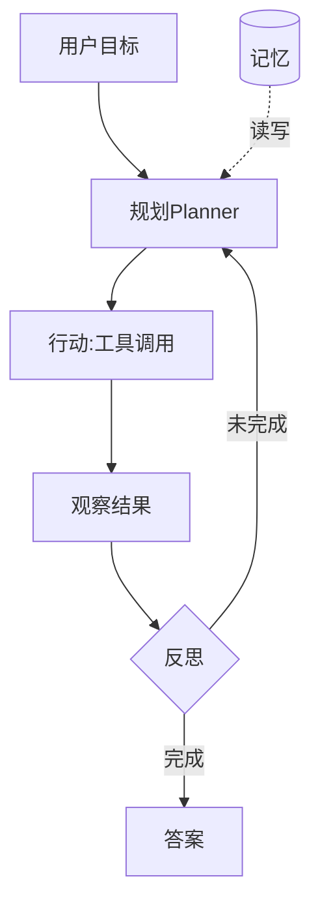

# Agent 工程化实战

> 把大模型从"会聊天"变成"能干活"，靠的是 Agent 工程化：规划、工具调用、记忆、反思、多步执行。工程化要解决可靠性（不稳定）、可观测（黑盒）、可控性（跑偏）、成本（token 爆炸）四大问题。

## 1. Agent 结构

## 2. 核心组件

| 组件 | 作用 |
| --- | --- |
| 规划 | 任务分解、步骤排序 |
| 工具 | 搜索/计算/API/代码执行 |
| 记忆 | 短期上下文 + 长期检索 |
| 反思 | 自检、纠错、重试 |
| 编排 | 单 Agent / 多 Agent 协作 |

## 3. 工程化要点

- **工具契约**：明确输入输出 schema，减少误调用。
- **失败重试**：工具失败自动换策略，限制重试次数。
- **可观测**：记录每一步思考、工具调用、token。
- **护栏**：敏感操作需确认，输出做安全过滤。
- **成本**：压缩历史、按需检索记忆。

## 4. 多 Agent 协作

- 角色分工（规划者/执行者/校验者）。
- 通过消息/共享状态协作。
- 避免无限循环：设最大步数。

## 5. 常见坑

| 坑 | 现象 | 对策 |
| --- | --- | --- |
| 跑偏 | 死循环 | 步数上限 |
| 工具误用 | 结果错 | schema 约束 |
| 成本高 | token 爆 | 历史压缩 |
| 黑盒 | 难排查 | 全链路日志 |
| 不安全 | 误执行 | 护栏确认 |

## 6. 面试题

1. Agent 与单纯 LLM 调用区别？
2. 如何防止 Agent 死循环？
3. 工具调用如何保证可靠？
4. Agent 成本如何控制？
5. 多 Agent 如何协作？

## 7. 小结

Agent 工程化 = 规划 + 工具 + 记忆 + 反思 + 护栏。核心是把"概率生成"变成"可控执行"，用可观测和护栏兜住不确定性。
