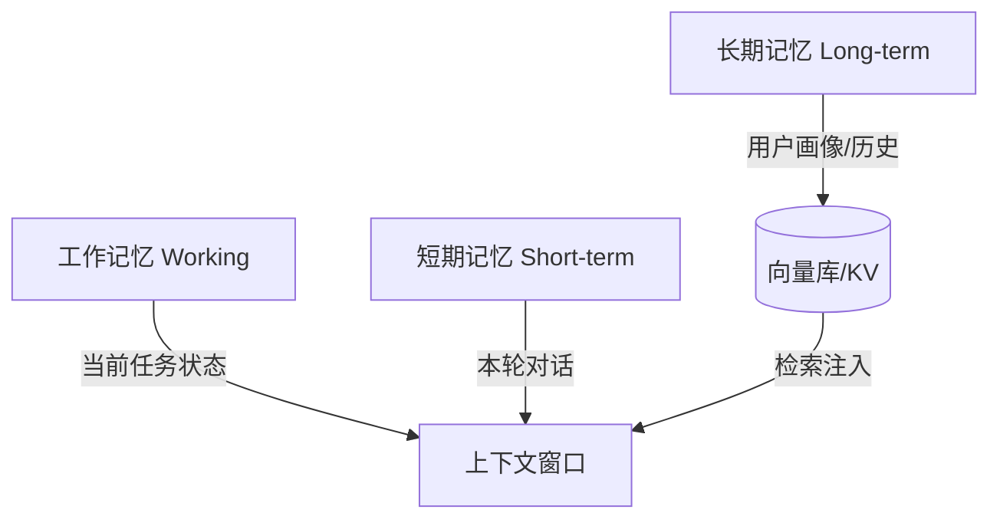

# Agent 记忆与长期上下文管理

> 记忆让 Agent 跨轮次、跨会话保持"连贯性"与"个性化"。本文拆解短期/长期/工作记忆三层结构，以及检索、压缩、更新等工程实现。

## 1. 记忆的三层模型



| 类型 | 内容 | 存储 | 生命周期 |
| --- | --- | --- | --- |
| 工作记忆 | 当前任务进度、待办 | 运行时状态对象 | 任务级 |
| 短期记忆 | 本会话对话 | 会话历史（可压缩） | 会话级 |
| 长期记忆 | 用户偏好、历史决策、知识 | 向量库/DB | 永久/可调 |

## 2. 长期记忆的写入

- **抽取式写入**：对话结束后用模型抽取"用户偏好、事实、待办"等结构化条目。
- **反思式写入（Reflection）**：对一段时间记忆做摘要反思，提炼高价值结论（如 Generative Agents 的 reflection）。
- **去重与合并**：相似记忆合并，避免冗余。

```python
def extract_memory(turns, llm):
    prompt = f"从对话中抽取可长期记住的事实/偏好/待办，JSON 列表:\n{turns}"
    return parse_json(llm(prompt))
```

## 3. 长期记忆的检索

- **语义检索**：将当前上下文 embedding，召回相关记忆（向量库 Top-K）。
- **时间衰减**：近期记忆权重更高，老记忆衰减。
- **重要性加权**：高重要性条目优先注入。

## 4. 短期记忆的压缩

当会话超出窗口：
- **滚动摘要**：把早期对话压成摘要保留。
- **关键事件保留**：决策、实体、未完成任务不被压缩。
- **检索回灌**：压缩后若需细节，从全量日志检索。

## 5. 更新与遗忘

- **显式更新**：用户纠正时，更新对应记忆条目。
- **遗忘机制**：设 TTL 或用户主动删除，保护隐私。
- **一致性**：同一事实多来源冲突时，采信最新/高置信。

## 6. 隐私与合规

- 记忆中敏感信息（PII）脱敏存储。
- 用户可查看、导出、删除自己的记忆。
- 企业场景按租户隔离记忆库。

## 7. 落地架构示例

```text
用户消息
  → 检索长期记忆(embedding Top-K)
  → 组装[指令+记忆+检索知识+工具结果]
  → LLM 推理
  → 执行工具
  → 会话结束抽取新记忆(去重写入)
```

## 8. 常见坑

| 坑 | 现象 | 对策 |
| --- | --- | --- |
| 记忆污染 | 旧错误记忆误导 | 置信度+时效性权重 |
| 检索噪音 | 无关记忆占窗口 | 相关性阈值过滤 |
| 无限膨胀 | 成本随时间涨 | 压缩+遗忘+TTL |
| 隐私泄露 | 跨用户串记忆 | 严格租户隔离 |
| 更新丢失 | 纠正不生效 | 写入即合并更新 |

## 9. 面试题

1. 短期记忆与长期记忆如何分工？
2. Reflection 机制是什么？
3. 长期记忆检索如何兼顾相关性与时效？
4. 记忆过多导致成本上升怎么办？
5. 多用户场景如何隔离记忆？

## 10. 小结

记忆 = 分层存储 + 智能检索 + 压缩更新 + 隐私管控。它是 Agent "成长性"的来源，应从第一天就设计而非事后补丁。
