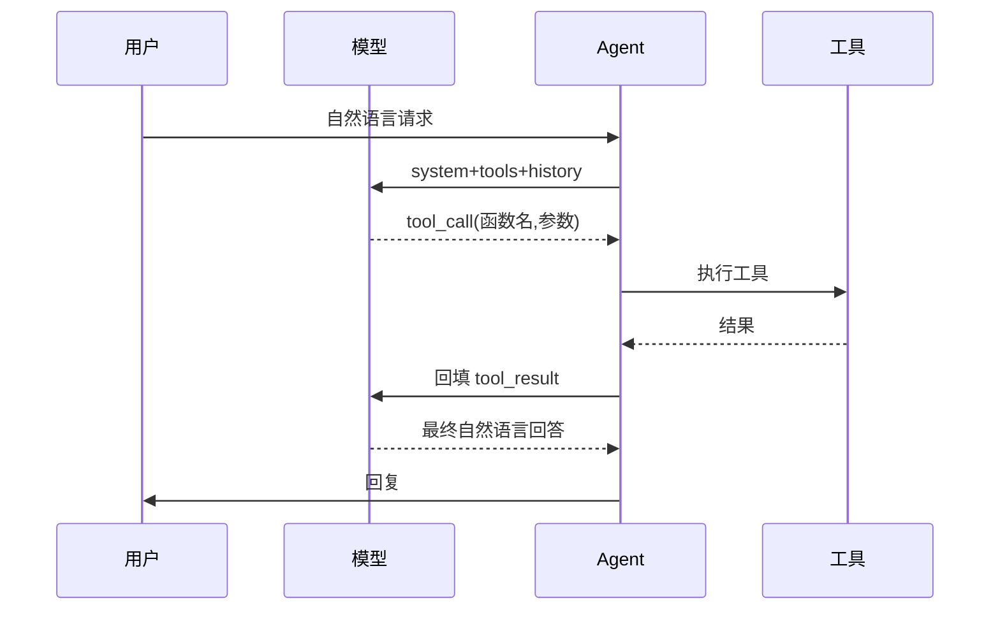
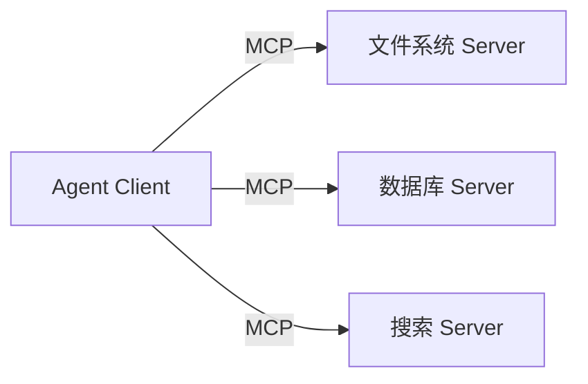

# Function Calling 与工具调用实战

> 工具调用（Tool/Function Calling）让大模型从"文本生成器"变成"能操作系统的执行器"。掌握工具定义、调用循环、结果回填与错误处理，是构建 Agent 的基础。

## 1. 工作原理



模型本身**不执行**函数，只输出"应该调用哪个函数、参数是什么"的结构化结果；Agent 负责真实执行并把结果回填。

## 2. 工具定义规范

```json
{
  "name": "query_weather",
  "description": "查询指定城市当前天气，返回温度与天气状况",
  "parameters": {
    "type": "object",
    "properties": {
      "city": {"type": "string", "description": "城市名，如 北京"},
      "unit": {"type": "string", "enum": ["celsius","fahrenheit"]}
    },
    "required": ["city"]
  }
}
```

规范要点：
- **description 写清"何时用"**：模型靠描述决定是否调用。
- **参数强类型 + enum**：降低参数错误。
- **required 最小化**：只把不可替代的设为必填。

## 3. 调用循环（核心骨架）

```python
def run_agent(user_msg, tools, tool_map):
    messages = [{"role":"user","content":user_msg}]
    for _ in range(MAX_TURNS):
        resp = llm.chat(messages=messages, tools=tools)
        msg = resp.choices[0].message
        if not msg.tool_calls:
            return msg.content
        messages.append(msg)  # 携带 tool_calls
        for tc in msg.tool_calls:
            fn = tool_map[tc.function.name]
            try:
                result = fn(**json.loads(tc.function.arguments))
            except Exception as e:
                result = f"ERROR: {e}"
            messages.append({
                "role":"tool",
                "tool_call_id": tc.id,
                "content": str(result)
            })
    return "超出最大轮次"
```

## 4. 并行工具调用

当多个工具无依赖（如"查北京天气 + 查上海天气"），模型可一次返回多个 `tool_calls`。Agent 应并行执行（asyncio/线程池）再统一回填，降低延迟。需注意：并行结果回填顺序要与 `tool_call_id` 一一对应。

## 5. 错误处理与重试

| 错误类型 | 处理 |
| --- | --- |
| 参数 JSON 非法 | 捕获后要求模型修正（附带错误提示） |
| 工具执行超时 | 设超时，返回超时信息让模型决定重试/换法 |
| 工具返回过大 | 截断/摘要后回填，避免撑爆上下文 |
| 工具不存在 | 拒绝并记录，防止 prompt injection 伪造工具 |

## 6. 安全：防止工具滥用

- **权限分级**：只读工具 vs 写操作工具（发邮件、删数据）需二次确认。
- **输入校验**：工具参数做白名单/范围校验，防止注入。
- **沙箱执行**：代码类工具（Python 解释器）在隔离环境运行，限制网络/文件系统。
- **审计日志**：记录每次工具调用的参数与结果。

## 7. MCP（模型上下文协议）

MCP 把"工具提供方"标准化：Server 暴露 tools/resources/prompts，Client（Agent）通过统一协议发现并调用。好处是工具可复用、跨模型、跨语言，避免为每个模型重写集成。



## 8. 常见坑

| 坑 | 现象 | 对策 |
| --- | --- | --- |
| 工具描述模糊 | 该调用时不调用 | 写清触发条件与示例 |
| 无限调用 | 反复调同一工具 | 最大轮次 + 结果去重 |
| 参数幻觉 | 编造不存在的参数 | 强 schema + 校验 + 修正循环 |
| 回填格式错 | 模型误读结果 | 结构化输出 + 明确 role=tool |
| 上下文污染 | 大结果淹没指令 | 结果分区 + 截断 |

## 9. 面试题

1. 模型真的会执行函数吗？Agent 在其中扮演什么角色？
2. 如何设计工具的 description 提高调用准确率？
3. 并行工具调用如何保证结果正确回填？
4. 工具返回超大结果怎么处理？
5. MCP 解决了什么问题？

## 10. 小结

工具调用 = 结构化函数声明 + 调用循环 + 结果回填 + 安全管控。它是 Agent 的"手"，健壮的错误处理与权限控制决定了系统能否上线。
