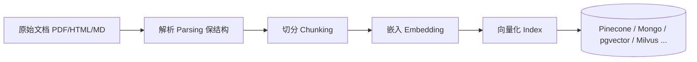

# RAG 概述与基础管线

> 本节先讲「为什么要有 RAG」，再给出一条可落地的标准管线，最后落到两个最影响效果的基础旋钮：**分块（chunking）** 与 **嵌入（embedding）**。

## 一、RAG 是什么

RAG（Retrieval-Augmented Generation，检索增强生成）的做法是：在让模型回答之前，**先从知识库里检索出与问题最相关的片段，拼到用户提问前面**，作为模型这次推理的「可见上下文」。

直觉上：模型训练时没见过你公司的内部文档，但你可以把相关片段在调用时临时塞给它——相当于给模型发了一份「开卷考试参考资料」。

```text
用户问题
   │
   ▼
[检索] 从知识库找出最相关的 k 个片段
   │
   ▼
[拼接] 问题 + 检索片段 → 组成最终提示
   │
   ▼
[生成] 大模型基于「问题 + 片段」作答
```

## 二、什么时候需要 RAG，什么时候不需要

**关键阈值（据官方/权威来源）**：当知识库规模 **小于约 20 万 token（约 500 页）** 时，直接把整库放进提示词（上下文学习 / in-context learning）**更简单、也更有效**——无需分块、无需向量化、无需检索。

| 场景 | 建议做法 | 理由 |
| --- | --- | --- |
| 知识库 < ~20 万 token（≈500 页） | 整库塞进提示词 | 省掉一整套检索基建，且全量可见不漏召回 |
| 知识库 > ~20 万 token | 上 RAG 分块检索 | 超出上下文窗口，或塞进去成本/噪声过高 |
| 知识频繁更新 | 上 RAG | 改知识库即可，不必重新微调或重训 |
| 需要引用出处 / 可核查 | 上 RAG | 检索片段天然带来源，便于 grounding |

> 💡 一句话决策：小知识库直接「整库进提示」，大知识库才值得为检索付出工程复杂度。

> ⚠️ 「20 万 token / 500 页」是经验阈值，不是硬边界。模型上下文窗口、单次成本、召回质量要求都会影响实际选型。

## 三、基础管线（七步）

标准 RAG 由「离线建库」+「在线问答」两段组成，常被概括为下面七步：

```text
load（加载）
  → chunk（分块）
    → embed（嵌入向量化）
      → index（建索引：向量 + BM25）
        ────────── 在线 ──────────
        → retrieve（检索 top-k）
          → rerank（重排序）
            → generate（生成答案）
```

| 阶段 | 步骤 | 做什么 | 典型工具 |
| --- | --- | --- | --- |
| 离线 | load | 读取文档（PDF/HTML/Markdown…） | LangChain / LlamaIndex Loader |
| 离线 | chunk | 切成可检索的块 | 字符/句子/段落级切分 |
| 离线 | embed | 每块转成向量 | Voyage / HuggingFace bge |
| 离线 | index | 建向量索引 + BM25 索引 | Pinecone / MongoDB |
| 在线 | retrieve | 按 query 取 top-k 块 | 向量检索 + BM25 |
| 在线 | rerank | 精排到更小的 top-n | cross-encoder |
| 在线 | generate | 拼提示让 LLM 作答 | Claude / GPT |

## 四、分块策略（Chunking）

分块是把长文档切成「检索单元」。块太大→噪声多、命中不精准；块太小→上下文缺失、语义被切碎。

| 策略 | 说明 | 适用 |
| --- | --- | --- |
| 字符级（character） | 按固定字符数滑动切分 | 通用，最简单 |
| 句子级（sentence） | 按句子边界切分 | 答案以句子为单位 |
| 段落级（section） | 按章节/标题结构切分 | 文档层级清晰（如技术手册） |

**两个关键参数（据 LlamaIndex 默认与官方实践）：**

- **`chunk_size = 512`**：LlamaIndex 的默认块大小，是个稳妥起点，再按召回效果调。
- **`temperature = 0`**：检索、重排等「检索侧」步骤要保证**确定性**——同样的 query 每次得到同样的块，便于评测与排障；不要在这里用随机采样。

```python
# LlamaIndex 风格的分块配置示意
from llama_index.core import SimpleDirectoryReader
from llama_index.core.node_parser import SentenceSplitter

documents = SimpleDirectoryReader("./docs").load_data()

parser = SentenceSplitter(
    chunk_size=512,      # LlamaIndex 默认块大小
    chunk_overlap=64,    # 块间重叠，减少切分处信息丢失
)

nodes = parser.get_nodes_from_documents(documents)
# 注：temperature=0 用于检索/重排侧，保证结果可复现
```

> 💡 块之间加一点 `chunk_overlap`（重叠）能缓解「答案被切在两半」的问题。

## 五、嵌入模型（Embedding）与向量库

### 1. 嵌入模型选型

| 模型 | 提供方 | 备注 |
| --- | --- | --- |
| `voyage-2` | Voyage AI | 官方推荐的检索嵌入之一 |
| `BAAI/bge-base-en-v1.5` | HuggingFace（BAAI） | 开源常用基线，中英文均可用 |

```python
# 伪代码：用嵌入模型把块向量化
embeddings = embed_model.get_text_embedding_batch(
    [node.get_content() for node in nodes]
)
# 推荐：对向量做 L2 归一化，便于用「点积 = 余弦相似度」计算
```

### 2. 向量库与索引

**Pinecone（据官方实践）：**

- 相似度用 `metric="dotproduct"`（点积），前提是向量已**归一化**（归一化后点积等价于余弦相似度）。
- 同时维护一份 **BM25 索引** 用于混合检索（见 02 进阶）。

```python
# Pinecone 建索引示意
import pinecone

pc = pinecone.Pinecone(api_key="YOUR_KEY")
index = pc.create_index(
    name="rag-demo",
    dimension=1024,            # 与嵌入模型维度一致
    metric="dotproduct",       # 需配合「归一化向量」
)
```

**MongoDB Atlas（`$vectorSearch`，据官方实践）：**

- 用 `numCandidates` 控制初筛候选数，**取 `limit` 的 10–20 倍**，兼顾召回与性能。

```text
// MongoDB $vectorSearch 关键参数
{
  $vectorSearch: {
    index: "vector_index",
    path: "embedding",
    queryVector: <query_embedding>,
    numCandidates: <limit * 10 ~ limit * 20>,  // 候选数 = limit 的 10–20 倍
    limit: <k>
  }
}
```

> ⚠️ 选 embedding 与向量库是「数据/模型相关」的决策：上述模型与参数来自来源推荐，具体维度、metric、候选倍数都要用你自己的评测集验证。

## 六、本节速记

- RAG = 检索片段 + 拼进提示 + 生成；小库（<20 万 token）直接整库进提示更高效。
- 基础管线：load → chunk → embed → index(向量+BM25) → retrieve → rerank → generate。
- 分块 `chunk_size=512` 起步；检索侧 `temperature=0` 保证确定性。
- 嵌入常用 Voyage `voyage-2` / HuggingFace `BAAI/bge-base-en-v1.5`；Pinecone 用 dotproduct + 归一化，MongoDB 用 `numCandidates = limit × 10~20`。

## 七、文档解析（Parsing）策略进阶

切分之前，先要把原始文档变成「干净、保结构的文本」。**解析质量直接决定块的质量**——解析丢了的标题层级、表格、代码块，后面怎么切都补不回来。

| 文档类型 | 解析要点 | 常用工具 |
| --- | --- | --- |
| PDF（扫描 / 排版复杂） | 保留版面、表格、标题层级；必要时 OCR | PyMuPDF、pdfplumber、Unstructured、LlamaParse |
| HTML / 网页 | 去导航 / 广告噪声，保留正文与标题 | trafilatura、readability、BeautifulSoup |
| Markdown / 代码 | 天然结构化，按标题 / 代码块切 | 自带解析即可 |
| Office（docx / xlsx） | 表格、批注、样式映射 | python-docx、openpyxl、Unstructured |

```python
# 解析 + 保留结构的示意（Unstructured）
from unstructured.partition.pdf import partition_pdf

elements = partition_pdf(
    "doc.pdf",
    strategy="hi_res",          # 保留版面
    infer_table_structure=True, # 保留表格结构
)
for el in elements:
    print(el.category, "->", el.text[:50])  # Title / Table / NarrativeText ...
```

> 💡 关键原则：**解析阶段尽量保留「标题层级 / 表格 / 章节」等结构信号**，后面切分才能按语义边界走，而不是粗暴按字符数切。能用「结构感知切分」（按标题层级递归切）就别用纯字符滑动窗口。

## 八、向量库选型对比

选向量库是「数据规模 + 团队运维能力 + 是否需要混合检索」共同决定的事。下面是常见选项的横向对比：

| 向量库 | 形态 | 特点 | 适用 |
| --- | --- | --- | --- |
| **Pinecone** | 托管 SaaS | 免运维、`dotproduct`+归一化、易上手 | 快速上线、无运维团队 |
| **MongoDB Atlas** | 文档库 + `$vectorSearch` | 已有 Mongo 栈可复用 | 已有 Mongo 业务 |
| **pgvector** | Postgres 扩展 | SQL 友好、事务一致、易备份 | 偏好关系库、中小规模 |
| **Milvus** | 专用向量库 | 十亿级、高吞吐、可分布式 | 大规模、高性能检索 |
| **Chroma** | 轻量嵌入式 | 本地 / 测试最快、API 简单 | 原型、单机 |
| **Qdrant** | 专用向量库 | Rust 实现、过滤强、易部署 | 生产级、需强过滤 |
| **Weaviate** | 专用向量库 | 内置混合检索、模块化 | 混合检索开箱即用 |



> ⚠️ 选型没有银弹：小项目 Chroma/pgvector 足够；要混合检索优先 Weaviate/Qdrant；要免运维上 Pinecone。具体维度、metric、候选倍数都要用你自己的评测集验证。

## 九、分块进阶：父子文档与语义分块

基础管线用固定 `chunk_size` 切分，但「检索粒度」与「生成粒度」往往不一致：太小检索准但生成缺上下文，太大生成全但检索噪。两种进阶切法：

**父子文档（Parent-Child / Small-to-Big）**：用小块检索、大块生成。先切成小「子块」建索引做精准召回，命中后回帖其所属「父块」（更大上下文）喂给 LLM。

| 块 | 用途 | 大小 |
| --- | --- | --- |
| 子块（child） | 建索引、做检索 | 128~256 token |
| 父块（parent） | 召回后注入生成 | 512~1024 token |

```python
# 父子文档示意（LlamaIndex）
from llama_index.core.node_parser import SentenceWindowNodeParser

parser = SentenceWindowNodeParser.from_defaults(
    window_size=3,        # 子块前后各取 3 句作为父上下文
    window_metadata_key="window",
    original_text_metadata_key="original_sentence",
)
nodes = parser.get_nodes_from_documents(documents)
# 检索时命中子块，生成时替换回 window 父上下文
```

**语义分块（Semantic Chunking）**：不按字符/标题，而按「语义边界」切——计算相邻句向量的相似度，相似度骤降处断块。

```python
# 语义分块示意
import numpy as np
def semantic_split(sentences, embeds, threshold=0.5):
    chunks, cur = [], [sentences[0]]
    for i in range(1, len(sentences)):
        sim = np.dot(embeds[i-1], embeds[i])  # 余弦相似度
        if sim < threshold:                    # 语义跳变 → 断块
            chunks.append(" ".join(cur)); cur = []
        cur.append(sentences[i])
    return chunks
```

> 💡 父子文档是性价比最高的「检索准 + 生成全」方案，强烈建议作为默认；语义分块适合长叙事型文档。

## 十、知识库增量更新与版本

RAG 不是「建一次就完」。知识频繁更新时要有增量机制，否则会答出过时内容（失败模式之一）。

| 机制 | 做法 | 适用 |
| --- | --- | --- |
| 全量重建 | 定期重新切块+嵌入+建索引 | 数据量小、日更 |
| 增量 upsert | 只对新增/变更文档做嵌入并 upsert | 大部分生产场景 |
| 版本标记 | 块带 `doc_version` 字段，过期块打标停用 | 需审计/回滚 |

```python
# 增量 upsert 示意（Pinecone）
index.upsert(
    vectors=[(id, vec, {"source": "doc_a", "version": 2})],
    namespace="kb",
)
# 删除旧版本
index.delete(filter={"source": "doc_a", "version": 1}, namespace="kb")
```

> ⚠️ 务必给块打「来源 + 版本 + 更新时间」元数据，既便于增量更新，也便于线上出问题回放与合规溯源。
