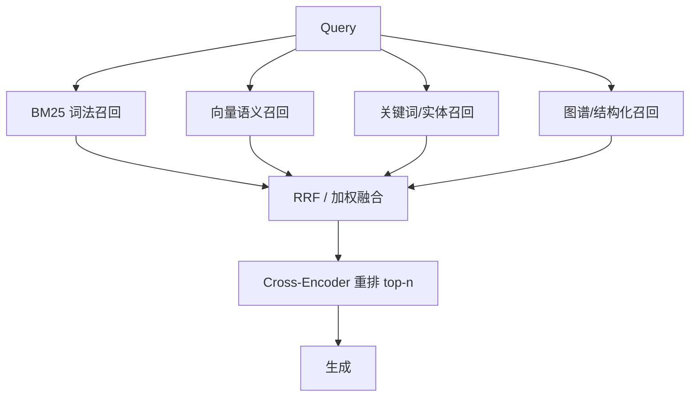
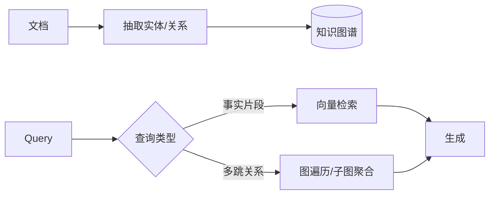

# RAG 进阶检索技术

> 基础管线能把 RAG 跑起来，但「召回得准不准、排得对不对」才是效果分水岭。本节覆盖四种提效手段与六种常见 RAG 模式。

## 一、上下文检索（Contextual Retrieval，Anthropic）

来源：Anthropic 官方博客 https://www.anthropic.com/news/contextual-retrieval

**问题**：单独一个块脱离原文时，模型和检索器都难判断它属于哪份文档、在什么语境下——尤其块很小的时候。

**做法**：在「嵌入」和「建 BM25 索引」**之前**，用 LLM 为每个块生成**一句简短的「情境说明」（context）**，说明它属于哪份文档、在什么情境下，并把这句说明**拼在块内容前面**再嵌入/建索引。

它由两个子技术组成：

- **Contextual Embeddings**：带情境说明的块去做嵌入。
- **Contextual BM25**：带情境说明的块去建 BM25。

```python
# 上下文检索：给每个块生成情境说明（示意）
SYSTEM = "你是一个帮检索系统写块摘要的助手。"
USER_TMPL = f"""<document>{whole_doc}</document>
下面是文档中的一个块。
<chunk>{chunk}</chunk>
请写一句简短说明：这个块属于哪份文档、在什么情境下被提及。只输出说明本身。"""

context_hint = llm.generate(system=SYSTEM, user=USER_TMPL, temperature=0)
contextual_chunk = context_hint + "\n" + chunk   # 拼在块前，再嵌入/建 BM25
```

**官方实验结果（据 Anthropic）：**

- 仅用上下文检索，**top-20 检索失败率降低约 49%**。
- 再结合 **Reranking（重排序）**，失败率可进一步降到约 **67%**。
- 成本用 **Prompt Caching** 控制（整份文档做缓存前缀，反复生成各块的情境说明时复用）。

| 方案 | top-20 检索失败率下降 |
| --- | --- |
| 基础嵌入/BM25 | 基线（0%） |
| + 上下文检索 | 约 49% |
| + 上下文检索 + Reranking | 约 67% |

> ⚠️ 49% / 67% 是 Anthropic 在自家实验设定的数据，具体提升因你的数据集、模型与块大小而异。

## 二、混合检索（Hybrid Search：BM25 + 向量 + RRF）

单一向量检索擅长「语义相似」，但在专有名词、ID、精确短语上容易翻车；BM25（词法检索）正好补这块短板。

**做法**：同时跑 BM25 与向量检索，再用 **Reciprocal Rank Fusion（RRF）** 融合两份排序结果。

```text
RRF 公式：score(d) = Σ  1 / (k + rank_i(d))    其中 k 常取 60
                  i∈{BM25, vector}
```

```python
# 混合检索 + RRF 融合（示意）
def rrf(results_list, k=60):
    scores = {}
    for results in results_list:          # results_list = [bm25_rank, vector_rank]
        for rank, doc_id in enumerate(results):
            scores[doc_id] = scores.get(doc_id, 0.0) + 1.0 / (k + rank + 1)
    return sorted(scores, key=scores.get, reverse=True)

fused = rrf([bm25_top20, vector_top20])   # 融合后取 top-k
```

> 某生产级 advanced-rag 项目称：混合检索可带来 **10–20% 的相关性提升**（据该生产项目自述，非官方基准）。

> ⚠️ 10–20% 是特定生产项目的实测口径，不同语料差异很大；建议先用评测集确认在你的数据上是否真的有增益。

## 三、重排序（Re-ranking：cross-encoder）

检索阶段为快，先用便宜的 bi-encoder（嵌入）粗召回；精排阶段用更准但更慢的 **cross-encoder** 重排。

| 类型 | 机制 | 速度 | 精度 |
| --- | --- | --- | --- |
| bi-encoder（嵌入） | query、doc 各自编码后算相似度 | 快（可离线建索引） | 较低 |
| cross-encoder | query 与 doc **联合输入**一个模型同时编码 | 慢（需实时算） | 更高 |

**cross-encoder 更准的原因**：它能同时「看到」query 与 doc 两边再做判断，而不是各算各的再比距离。

```python
# 重排序：先粗召回 top-20，再用 cross-encoder 精排到 top-5（示意）
from sentence_transformers import CrossEncoder

retrieved = vector_search(query, top_k=20)            # 粗召回
reranker = CrossEncoder("cross-encoder/ms-marco-MiniLM-L-12-v2")
pairs = [(query, doc.text) for doc in retrieved]
scores = reranker.predict(pairs)
ranked = [doc for _, doc in sorted(zip(scores, retrieved), reverse=True)]
final = ranked[:5]                                    # 精排到 top-5
```

> 💡 套路固定：**嵌入粗召回（top-20）→ cross-encoder 精排（top-5）**。先把范围收窄再精排，成本可接受。

## 四、查询变换（Query Transformation）

原问题有时表述得不好、或和答案用词差太远，直接检索会漏。两种常用变换：

### 1. Multi-Query（多查询）
从**多个角度重新表述同一个问题**，分别检索再合并，扩大召回面。

```python
# Multi-Query 示意：把原问题扩写成多个子问法
variants = llm.generate(f"把这个问题改写成 3 个不同角度的表述：{query}", temperature=0)
for v in variants:
    results.extend(retrieve(v))
merged = dedupe_and_fuse(results)     # 去重 + 融合
```

### 2. HyDE（Hypothetical Document Embeddings）
先让 LLM **生成一段「假设答案」**，再用这段假设答案去做向量检索——因为「答案」和「答案」的用词往往比「问题」和「答案」更接近。

```python
# HyDE 示意：用假设答案做检索
hypo_answer = llm.generate(f"请回答：{query}", temperature=0)   # 假设答案
hypo_vec = embed(hypo_answer)                                   # 嵌入假设答案
results = vector_search_by_vector(hypo_vec, top_k=5)            # 用假设答案检索
```

> 💡 HyDE 对「问题与答案词汇差异很大」的技术类问题特别有效（比如用户问「怎么做 X」，答案里却用了一堆术语/API 名）。

## 五、六种 RAG 模式（据 anthropic-cookbook 归纳）

| 模式 | 思路 | 适用 |
| --- | --- | --- |
| **Basic Pipeline** | 单库、单检索、单生成 | 入门与小规模 |
| **Pinecone + LangChain** | 用 Pinecone 存向量、LangChain 编排 | 生产常用的标准栈 |
| **Router Query Engine** | 多个索引/工具，路由到最合适的一个 | 多主题知识库 |
| **ReAct Agent** | 模型边思考边调用检索工具迭代 | 需要多步、自反式检索 |
| **Sub-Question** | 把复杂问题拆成子问题分别检索再汇总 | 一个问题要跨多源 |
| **Multi-Document Hierarchical** | 顶层选择器 + 每文档 agent 的两层结构 | **文档数 > 5–10** |

> 💡 **Multi-Document Hierarchical** 的触发条件：当文档数量超过 **5–10 个**，平铺检索会互相干扰，改用「先选文档、再进文档内检索」的两层结构更稳。

## 六、本节速记

- **上下文检索**：每块加一句 LLM 生成的情境说明，top-20 失败率↓约 49%，叠加 Reranking ↓约 67%（据 Anthropic）；用 Prompt Caching 控成本。
- **混合检索**：BM25 + 向量，用 RRF 融合；生产项目称相关性 +10–20%。
- **重排序**：cross-encoder 比 bi-encoder 慢但更准，套路 top-20 → top-5。
- **查询变换**：Multi-Query 扩角度、HyDE 用假设答案检索（技术问答利器）。
- **六种模式**：从基础管线到 Multi-Document Hierarchical（>5–10 文档用两层结构）。

## 七、Rerank 模型与多路召回（深化）

上文已给出混合检索与 cross-encoder 重排的套路，这里补充工程选型与「多路召回」的全貌。

### 1. 常用 Rerank（重排）模型

| 模型 | 提供方 | 说明 |
| --- | --- | --- |
| `bge-reranker-v2-m3` | BAAI | 开源、多语言、常作基线 |
| `Cohere Rerank`（rerank-english / multilingual） | Cohere | 托管 API、效果好、按量计费 |
| `jina-reranker` | Jina AI | 长上下文、多语言 |
| `ms-marco-MiniLM-L-12-v2` | sentence-transformers | 经典轻量 cross-encoder |

> 💡 选型：有合规/私有化要求用开源 `bge-reranker`；想省事且语料杂用 Cohere/Jina 托管 API。重排只在粗召回的 top-20~50 上跑，成本可控。

### 2. 多路召回（Multi-path Retrieval）

不要只靠「向量」一条路。生产系统常并行跑多条召回通道，再融合——不同通道有不同归纳偏置，互相补盲。



### 3. 融合权重与调参

- RRF 的 `k=60` 是经验起点，可针对不同通道设不同权重（如向量 0.6、BM25 0.4）。
- 重排阶段建议取粗召回的 top-20~50 再精排到 top-5~10，平衡精度与成本。

```python
# 带权重的多路融合示意
fused = {}
for doc_id, score in bm25_top.items():
    fused[doc_id] = fused.get(doc_id, 0.0) + 0.4 * score
for doc_id, score in vec_top.items():
    fused[doc_id] = fused.get(doc_id, 0.0) + 0.6 * score
ranked = sorted(fused, key=fused.get, reverse=True)[:50]   # 粗召回 top-50
final = rerank(ranked, query, top_n=5)                     # 精排到 top-5
```

> 💡 多路召回的核心是「用不同归纳偏置互相补盲」：向量补语义、BM25 补精确词、图谱补关系。通道越多，融合策略（RRF vs 加权）越要认真调。

## 八、自查询检索（Self-Query Retrieval）

当知识库带了结构化元数据（如 `category`、`date`、`lang`），纯向量检索没法利用这些字段过滤。Self-Query 让 LLM **先把自然语言问题拆成「语义查询 + 元数据过滤条件」，再执行「带 filter 的向量检索」**。

```python
# 自查询示意（伪代码）
query = "2024 年发布的 Python 教程"
plan = llm.generate(f"把问题拆成 search_text 与 metadata filter：{query}")
# → {"search_text": "Python 教程", "filter": {"year": 2024, "lang": "zh"}}
results = vector_search(
    text=plan["search_text"],
    filter={"year": 2024, "lang": "zh"},   # 元数据过滤
)
```

> 💡 Self-Query 适合「带条件的检索」（时间/类别/作者/语言），比在提示里让模型自己筛更可靠，且能下推到向量库原生 filter。

## 九、GraphRAG（图谱检索增强）

传统 RAG 检索「片段」，GraphRAG 检索「实体与关系」。先离线从文档抽取实体/关系构建知识图谱，在线时既可向量检索文本，也可沿图做多跳推理，擅长回答「谁和谁什么关系」「某事件的来龙去脉」等需要聚合全局信息的问题。



| 维度 | 传统 RAG | GraphRAG |
| --- | --- | --- |
| 检索单元 | 文本块 | 实体/关系/子图 |
| 擅长 | 局部事实问答 | 全局聚合、多跳推理 |
| 成本 | 低 | 建图成本高、查询重 |
| 工具 | LlamaIndex PropertyGraph / Neo4j |

> ⚠️ GraphRAG 建图与查询成本高，仅在「需要跨文档聚合/多跳推理」时上；普通事实问答用传统 RAG 足够。

## 十、重排序模型实测对比（Cohere vs BGE）

重排是「top-20→top-5」的关键一步。下面给常见模型在语言、成本、部署上的横向参考：

| 模型 | 语言 | 部署 | 成本 | 说明 |
| --- | --- | --- | --- | --- |
| Cohere Rerank v3 | 多语 | 托管 API | 按 token | 效果好、省心、需外发数据 |
| BAAI `bge-reranker-v2-m3` | 多语 | 自托管 | 算力自有 | 开源基线、可私有化 |
| Jina `jina-reranker-v2` | 多语 | 托管/自托管 | 中等 | 长上下文友好 |
| `ms-marco-MiniLM-L-12-v2` | 英 | 自托管 | 极低 | 轻量、快、精度一般 |

```python
# Cohere 重排调用示意
import cohere
co = cohere.Client("KEY")
resp = co.rerank(
    query=query,
    documents=[d.text for d in retrieved_top20],
    model="rerank-multilingual-v3.0",
    top_n=5,
)
final = [retrieved_top20[r.index] for r in resp.results]
```

> 💡 实测结论（社区共识，非权威基准）：英文场景 Cohere 常略优；中文/合规私有化优先 `bge-reranker-v2-m3`。无论哪个，**重排只在粗召回 top-20~50 上跑**，成本可控、收益明显。具体以你自己的评测集为准。
