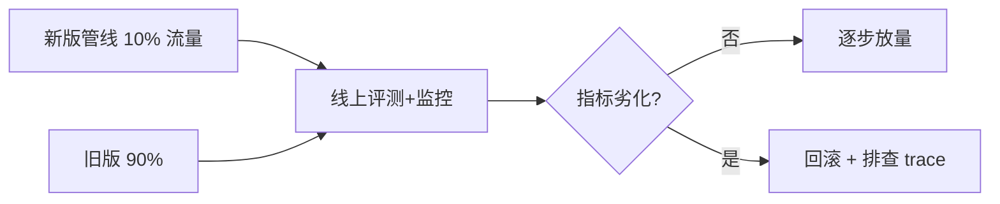
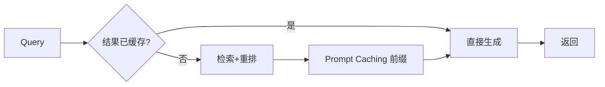

# RAG 评估与最佳实践

> 「能跑起来」和「效果好」之间差着一套评估。本节先讲怎么用 RAGAS 量化质量，再给落地清单与避坑。

## 一、用 RAGAS 做评估

RAGAS 是一套面向 RAG 的自动化评测指标，核心看「答案是否忠于检索内容、检索是否真的命中」。

| 指标 | 衡量什么 | 直觉 |
| --- | --- | --- |
| **faithfulness（忠实度）** | 答案是否**忠于上下文**，没有编造 | 答案每句话都能在检索片段里找到依据 |
| **answer_relevancy（答案相关性）** | 答案是否切题 | 直接回应了用户问题 |
| **context_precision（上下文精度）** | 检索到的块里，相关的是否排得靠前 | 前几个块就得是命中的 |
| **context_recall（上下文召回）** | 该检索到的相关信息是否都被捞到了 | 没漏掉关键片段 |

```python
# RAGAS 评估示意（需准备：questions、answers、contexts、参考 ground_truth）
from ragas import evaluate
from ragas.metrics import (
    faithfulness, answer_relevancy, context_precision, context_recall
)

result = evaluate(
    dataset=my_dataset,                 # 含 question / answer / contexts / ground_truth
    metrics=[faithfulness, answer_relevancy, context_precision, context_recall],
)
print(result)
```

> 💡 上线前先建一个**评测集**（几十到上百条真实问答即可），把上面四个指标当回归看板，每次改管线都跑一遍。

## 二、cookbook 的结论：索引 + 重排最划算

据 Anthropic Cookbook 的对比实验：

- **基础实现**：端到端准确率约 **71%**。
- **最佳方案（Summary Indexing + Re-Ranking）**：端到端准确率约 **81%**。

| 方案 | 端到端准确率 |
| --- | --- |
| 基础实现 | 约 71% |
| Summary Indexing + Re-Ranking | 约 81% |

> ⚠️ 81% vs 71% 是 cookbook 在其设定评测集上的结果，**具体提升因你的数据、模型与评测口径而异**，不能直接外推。

## 三、Prompt Caching 降本

上下文检索、重复拼接系统提示等场景会反复发送大段相同内容（如整份文档作为生成情境说明的前缀）。用 **Prompt Caching** 把这些「不变的前缀」缓存起来，可显著降低 token 成本与延迟。

- 上下文检索：整份文档作为缓存前缀，反复生成各块情境说明时复用。
- 固定 system / 长文档上下文：同样适合缓存。

> 💡 凡是「多次调用、前缀不变」的地方，都值得接 Prompt Caching。

## 四、落地清单（Checklist）

1. **先判断要不要 RAG**：知识库 < ~20 万 token（≈500 页）直接整库进提示。
2. **定分块**：`chunk_size=512` 起步，加 `chunk_overlap`，检索侧 `temperature=0`。
3. **选嵌入 + 向量库**：Voyage `voyage-2` / HuggingFace `BAAI/bge-base-en-v1.5`；Pinecone 用 `dotproduct`+归一化，MongoDB `numCandidates = limit×10~20`。
4. **加混合检索**：BM25 + 向量 + RRF，必要时上上下文检索。
5. **加重排**：cross-encoder 把 top-20 精排到 top-5。
6. **（可选）查询变换**：Multi-Query / HyDE 提升难问题召回。
7. **建评测集 + 跑 RAGAS**：faithfulness / answer_relevancy / context_precision / context_recall 当回归看板。
8. **接 Prompt Caching** 控成本。
9. **选 RAG 模式**：文档 > 5–10 用 Multi-Document Hierarchical；复杂问题用 Sub-Question / ReAct。

## 五、避坑：只部署，不评估

> ⚠️ **最大的坑**：很多团队把 RAG 部署上线后，**从不评估**效果。没有评测集，就不知道准确率掉了、幻觉多了、召回漏了——出了问题只能靠用户投诉发现。

正确做法：**先建评测集（RAGAS），再上线；之后每次改管线都回归一遍**。评估的成本远低于「线上 quietly 出错」的代价。

> ⚠️ 本文所有百分比（49% / 67% / 10–20% / 81% vs 71%）均来自引用来源、原样保留；**具体提升因数据、模型与实现而异，务必用你自己的评测集验证**。

## 六、本节速记

- 用 **RAGAS** 四指标量化：faithfulness / answer_relevancy / context_precision / context_recall。
- cookbook 最佳方案 **Summary Indexing + Re-Ranking ≈ 81%**，基础 ≈ 71%。
- **Prompt Caching** 给上下文检索、固定前缀降本。
- 落地按九步清单走；**别只部署不评估**。

## 七、评测指标详解（召回率 / 忠实度 / 正确性）

RAGAS 四类之外，落地时还需关注更直白的工程指标，才能定位「到底是哪一步掉链子」：

| 指标 | 定义 | 怎么算 |
| --- | --- | --- |
| **检索召回率（Recall@k）** | 相关片段落在 top-k 的比例 | 人工 / 标注 ground truth 比对召回集合 |
| **答案忠实度（Faithfulness）** | 答案是否完全基于检索内容、无编造 | LLM-as-judge 或 NLI 校验每句是否有据 |
| **答案正确性（Answer Correctness）** | 答案与标准答案的吻合度 | 带 ground truth 的 F1 / 语义相似度 |
| **上下文精度（Precision@k）** | 前 k 个是否都是相关的 | 人工标注前 k 的相关性 |
| **延迟 / 成本** | 端到端耗时、token 花费 | 线上埋点统计 |

```python
# 离线评测最小闭环
for q in eval_set:
    ctx = retrieve(q, top_k=5)
    ans = generate(q, ctx)
    log(
        recall_at_k(q, ctx),       # 检索召回率
        faithfulness(ans, ctx),    # 答案忠实度
        correctness(ans, q.gold),  # 答案正确性
    )
```

> 💡 召回率低 → 查检索/切分；忠实度低 → 查 grounding/约束；正确性低 → 查生成/重排。指标分工能帮你精准排障。

### 7.1 评测集与公开基准（让看板有根）

- **公开基准**：MS MARCO（检索）、BEIR（跨域 zero-shot 检索）、MTEB/MTEB-RAG（嵌入与 RAG 综合）、RAGBench（答案质量）、RGB（中文 RAG 基准）——用于**横向对标**，证明你的管线不掉队；
- **自建黄金集（最重要）**：从真实线上 query 抽样 → 人工标注「相关片段 + 标准答案 + 是否可拒绝」→ 100~500 条覆盖边界（多跳、否定、时效、空检索）——**评估集必须贴近你的真实分布**，公开基准只是参考；
- **LLM-as-judge 校准**：judge 有自偏好/位置偏差/冗长偏好——先用 30~50 条人工标注样本对 judge 做一致性校验（Kappa），judge 与人工一致率 ≥80% 才可信；greedy + rubric（评分标准说明）比裸打分稳。

## 八、灰度与监控（上线后也要盯）

- **灰度发布**：新管线先放 5%~10% 流量，对比旧版在忠实度 / 正确性上的差异，再逐步放量。
- **在线监控**：对线上每次回答记录「检索命中数、重排分数、答案长度、是否触发 fallback」，用看板盯异常。
- **LLM-as-judge 常态化**：用强模型对抽样回答打「是否幻觉 / 是否离题」，发现劣化即时告警。
- **Trace / 链路追踪**：把 `query → 召回 → 重排 → 生成` 全链路存下来，出问题可回放定位。



## 九、常见失败模式（Failure Modes）

| 失败模式 | 表现 | 对策 |
| --- | --- | --- |
| 检索漏召 | 相关片段没进 top-k | 加多路召回、调 chunk、上上下文检索 |
| 检索噪声 | 召回了不相关块 | 加重排、过滤低分、RRF 调权 |
| 上下文腐烂 | 块太多淹没关键句 | 限制 top-n、压缩、按需注入 |
| 答案编造 | 出现检索内容外的信息 | 强约束 grounding、faithfulness 校验 |
| 过时知识 | 知识库未更新 | 建增量更新与版本机制 |
| 成本 / 延迟爆炸 | 重排或长上下文过贵 | Prompt Caching、限制召回数、子代理 |

> ⚠️ 失败模式往往叠加出现：漏召 + 噪声一起导致答案编造。排障时按「召回 → 重排 → 生成」顺序逐步看指标，别一上来就怪模型。

## 十、多模态 RAG（Multi-modal RAG）

当知识库含图片/表格/图表/PDF 扫描件，纯文本 RAG 会丢信息。多模态 RAG 用多模态嵌入（如 CLIP、bge-m3 图文）或「视觉模型先转述」让检索覆盖非文本：

| 路线 | 做法 | 适用 |
| --- | --- | --- |
| 图文联合嵌入 | 图与文映射到同一向量空间，跨模态检索 | 图+文混合库 |
| OCR/VLM 转述 | 图片先用 OCR/视觉模型出文字描述，再走文本 RAG | 扫描件/图表为主 |
| 多向量索引 | 一页存「文本块 + 图表摘要」多向量 | 版式复杂文档 |

```python
# 多模态检索示意（CLIP 风格）
img_vec = clip_image_embed(image)        # 图 → 向量
txt_vec = clip_text_embed("某某流程图")   # 文 → 同一空间向量
hits = index.query(img_vec)              # 以图搜文 / 以文搜图
```

> 💡 非技术文档、含大量图表的场景优先多模态 RAG；若图表少，VLM 转述 + 文本 RAG 更省成本。

## 十一、RAG 与微调（Fine-tuning）怎么选

两者都能「补知识」，但补的层不同：

| 维度 | RAG | 微调 |
| --- | --- | --- |
| 补什么 | 外部事实/最新知识 | 风格/格式/领域语言习惯 |
| 知识更新 | 改库即可，快 | 需重训，慢 |
| 可核查 | 天然带出处 | 难溯源 |
| 成本 | 推理时多检索+上下文 | 训练成本高、推理便宜 |
| 适合 | 事实易变、需引用 | 固定风格/私有语料格式化 |

> 💡 经验法则：**知识该「外挂」用 RAG，能力该「内化」用微调**。多数业务先上 RAG；当 RAG 稳定后仍有「回答风格/格式不对」的问题，再叠加微调。二者可组合。

## 十二、生产化：成本与延迟优化

RAG 上量后成本和延迟是硬约束，常用手段：

| 优化点 | 手段 | 效果 |
| --- | --- | --- |
| 重复前缀 | Prompt Caching | 降本+降延迟 |
| 重排开销 | 只在 top-20~50 跑 cross-encoder | 控成本 |
| 检索频次 | 会话记忆缓存高频 query 结果 | 降延迟 |
| 大上下文 | 子代理/按需注入，避免全量 | 控 token |
| 向量库 | 托管 vs 自建权衡运维 | 控总成本 |



> ⚠️ 生产化先把「成本/延迟/质量」三者量化成看板，再优化；别为了省 token 牺牲召回导致编造。具体取舍以你自己的业务指标为准。
