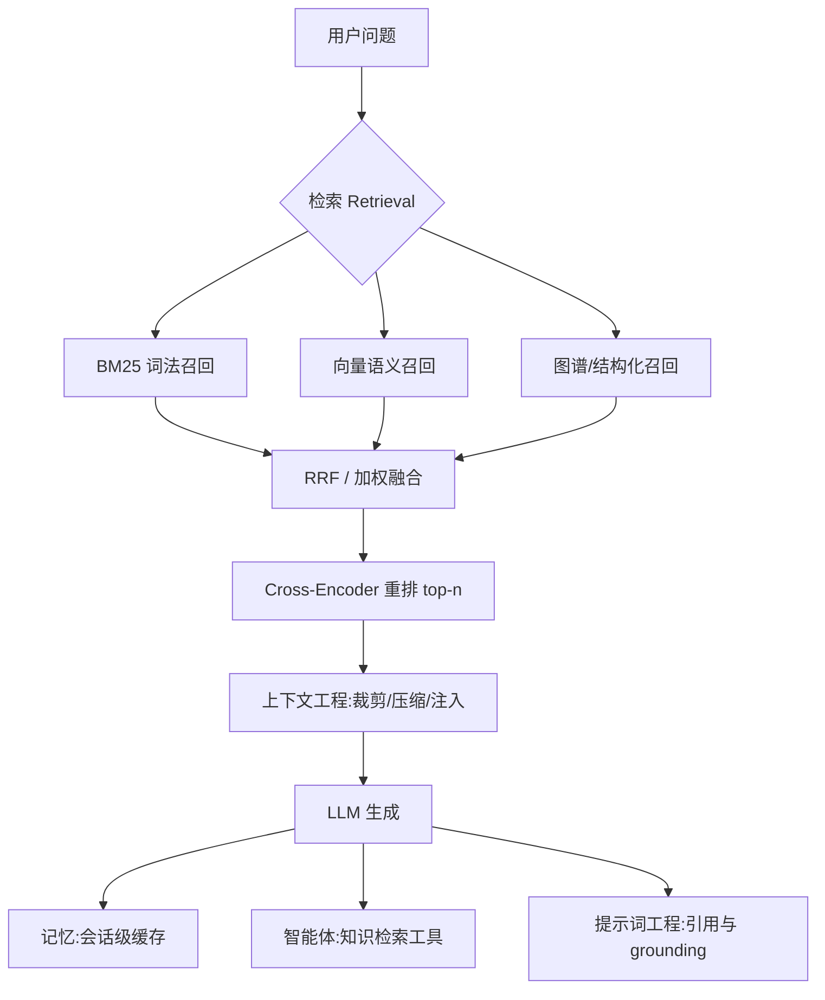
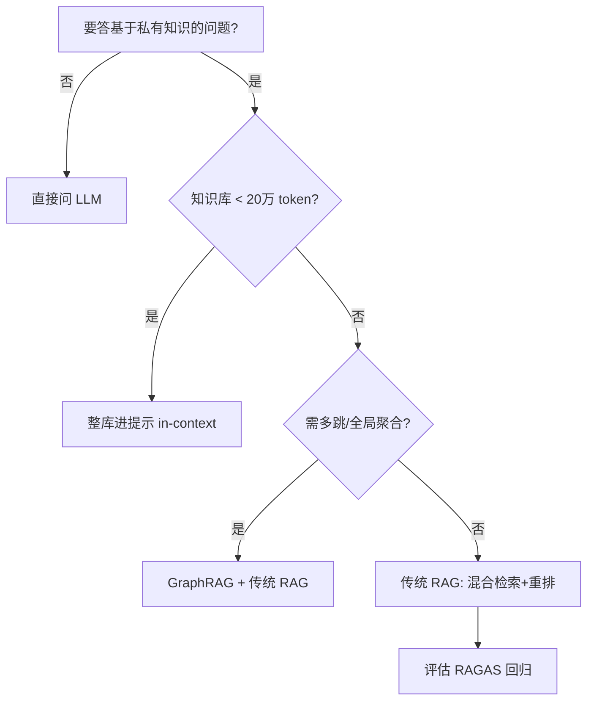

# RAG（检索增强生成，Retrieval-Augmented Generation）

> 本模块整理自 Anthropic Cookbook、Anthropic 官方博客、生产实践文章与开源指南，聚焦「如何让大模型在回答时先用检索补足知识」。定位为后端工程师的学习笔记：重管线、重参数、重可评估，少谈玄学。

RAG 的核心一句话：**从知识库检索出与问题相关的片段，拼接在用户提问之前，从而扩展模型「可见」的上下文**——把「模型该知道但没记住」的东西，在推理时临时喂给它。

## 内容索引

| 文件 | 内容 | 形态 |
| --- | --- | --- |
| [01-概述与基础管线.md](./01-概述与基础管线.md) | RAG 是什么、何时需要/不需要、基础管线、分块策略、嵌入与向量库 | 📝 文字 |
| [02-进阶检索技术.md](./02-进阶检索技术.md) | 上下文检索、混合检索、重排序、查询变换、六种 RAG 模式 | 📝 文字 |
| [03-评估与最佳实践.md](./03-评估与最佳实践.md) | RAGAS 评估、cookbook 结论、Prompt Caching、落地清单与避坑 | 📝 文字 |

## 主要参考来源

- **Anthropic Cookbook《Retrieval Augmented Generation》**：https://deepwiki.com/anthropics/anthropic-cookbook/5-retrieval-augmented-generation
- **Anthropic《Contextual Retrieval》博客（上下文检索）**：https://www.anthropic.com/news/contextual-retrieval （若不可达，可用 https://2048ai.net/69a912220a2f6a37c595345a.html 的梳理作补充，但原始来源为 Anthropic）
- **RAG 生产最佳实践（2026）**：https://devstarsj.github.io/2026/03/22/rag-retrieval-augmented-generation-production-best-practices-2026
- **dair-ai/Prompt-Engineering-Guide（含 RAG 章节）**：https://github.com/dair-ai/Prompt-Engineering-Guide

> ⚠️ 本模块为「整理 + 个人化注解」，非原创理论。文中所有百分比（49% / 67% / 10–20% / 81% vs 71% / 512 / 20 万 token / 500 页）均来自上述来源，原样保留；**具体效果因你的数据、模型与检索实现而异，请以你自己的评测为准**。

## 本子模块学习路径

建议按以下顺序阅读，由浅入深：

1. 读本文「概述」建立 RAG 直觉，先判断你的场景到底需不需要 RAG。
2. `01-概述与基础管线.md`：掌握七步管线、文档解析、分块、嵌入与向量库选型。
3. `02-进阶检索技术.md`：上下文检索、混合检索、重排序、查询变换、六种模式。
4. `03-评估与最佳实践.md`：用 RAGAS 量化效果，落地清单、灰度监控与避坑。

```text
入门路径：概述(本文) → 01 基础管线 → 02 进阶检索 → 03 评估与最佳实践
```

## 核心要点速览

- RAG = 检索片段 + 拼进提示 + 生成；小知识库（<20 万 token）直接整库进提示更高效。
- 基础管线：`load → chunk → embed → index(向量+BM25) → retrieve → rerank → generate`。
- 提效四件套：上下文检索、混合检索（BM25+向量+RRF）、cross-encoder 重排、查询变换（Multi-Query / HyDE）。
- 没有评估的 RAG 等于裸奔：用 RAGAS 四指标（faithfulness / answer_relevancy / context_precision / context_recall）当回归看板。

## 推荐延伸阅读

- Anthropic《Contextual Retrieval》官方博客（上下文检索来源）
- Anthropic Cookbook《Retrieval Augmented Generation》
- RAGAS 官方文档（评估指标与用法）
- dair-ai/Prompt-Engineering-Guide 的 RAG 章节
- LangChain / LlamaIndex 检索相关文档（管线编排与切分实现）

## 一、核心概念地图（Mermaid 概念全景）



> 上图把 RAG 放在五个子模块的交叉点：它产出「要注入的上下文」（上下文工程）、结果拼进提示（提示词工程）、可被会话记忆缓存（记忆）、也可被 Agent 当作工具调用（智能体）。

## 二、速查表（Cheat Sheet）

| 决策点 | 默认值 | 何时调整 |
| --- | --- | --- |
| 要不要 RAG | 库 > 20 万 token 才上 | < 20 万 token 直接整库进提示 |
| chunk_size | 512，overlap=64 | 长文/代码调大，QA 对调小 |
| chunk 策略 | 父子文档（小检大生） | 单一粒度召回/生成冲突时 |
| embedding | voyage-2 / bge | 私有化换开源 bge |
| 检索 | 混合 BM25+向量 + RRF(k=60) | 单一向量召回不足时 |
| 重排 | cross-encoder top-20→top-5 | 噪声大、精度要求高 |
| 高级检索 | 上下文检索 + 多路召回 | 多主题/多文档库 |
| 评估 | RAGAS 四指标 + 离线闭环 | 每次改管线回归 |
| 降本 | Prompt Caching + 结果缓存 | 前缀重复/高频 query |

## 三、常见误区清单

1. **小库硬上 RAG**：库小于 20 万 token 还搞检索，噪声与成本双高，不如整库进提示。
2. **只部署不评估**：没有评测集就不知道准确率掉了、幻觉多了，出问题只能靠投诉发现。
3. **块太大或太小**：大块噪声淹没关键句，小块切碎语义；先用 512 起步再调，或上父子文档。
4. **忽视解析质量**：PDF 表格/标题丢了，后面再怎么切都补不回，解析阶段要保结构。
5. **只靠向量检索**：专有名词/ID 漏召，必须混合 BM25。
6. **重排后还喂满 top-k**：重排到 top-5~10 即可，太多块反而「上下文腐烂」。
7. **检索侧 temperature 调高**：检索/重排要确定性，temperature=0。
8. **知识库不更新**：过时知识导致编造，需增量 upsert + 版本标记。
9. **把 RAG 当微调用**：知识该外挂用 RAG，风格/格式才靠微调，二者补的层不同。
10. **为省 token 牺牲召回**：生产化先把质量量化，别为了省成本引入编造。

## 四、与其它子模块关系

- **与上下文工程**：RAG 检索出的块是「注入上下文」的主要来源；上下文工程决定如何裁剪、排序、压缩这些块后再喂给模型。
- **与提示词工程**：检索结果拼进提示，提示模板决定「如何引用片段、如何约束 grounding 不编造」。
- **与记忆**：会话级记忆可缓存高频 query 的检索结果避免重复检索；长期记忆与 RAG 知识库边界见记忆子模块。
- **与智能体**：RAG 常作为 Agent 的「知识检索工具」，由 Agent 决定是否调用、何时调用（ReAct / Sub-Question 模式）。

## 五、面试高频问题（速记）

- RAG 解决什么问题？为什么小库直接整库进提示更高效？
- 基础管线七步是什么？哪一步对效果影响最大（检索/重排）？
- 上下文检索（Anthropic）怎么做的，失败率降多少？
- 混合检索为什么优于纯向量？RRF 是什么？
- bi-encoder 与 cross-encoder 的区别？为什么重排只在 top-20~50 跑？
- HyDE / Multi-Query 适用什么场景？
- RAGAS 四个指标分别衡量什么？
- RAG 和微调怎么取舍？
- GraphRAG 相比传统 RAG 适合什么？
- 生产化怎么控成本与延迟（Prompt Caching / 结果缓存 / 子代理）？

## 六、一句话决策树



> 以上为 RAG 子模块的全局速查与导航。各篇（01/02/03）提供更细的管线、检索技术与评估落地细节。
