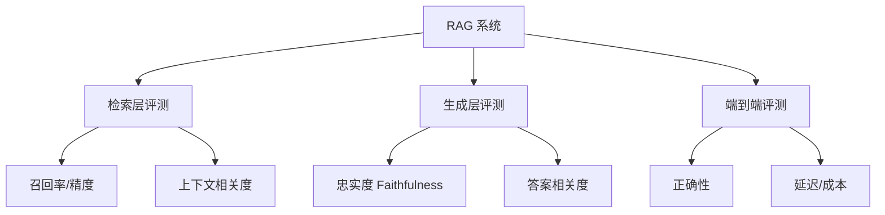

# RAG 评估与离线评测体系

> RAG 系统上线容易、做好难，核心难点在"可量化评测"。本文给出从组件级到端到端的评测框架，帮助定位检索与生成各自的瓶颈。

## 1. 评测的分层



## 2. 检索层指标

- **Recall@K / NDCG@K**：标准信息检索指标，看相关文档是否进入 Top-K。
- **Context Relevance（上下文相关度）**：用 LLM-as-judge 评判检索片段与问题的相关性（0~1）。
- **缺失率**：标准答案所需证据未被检索到的比例。

```python
# 用 LLM 评判单条检索相关性
def context_relevance(question, chunk, judge_llm):
    prompt = f"问题:{question}\n片段:{chunk}\n该片段是否有助于回答问题? 仅答 yes/no 并给0-1分"
    return float(judge_llm(prompt).score)
```

## 3. 生成层指标

| 指标 | 含义 | 判定方式 |
| --- | --- | --- |
| Faithfulness 忠实度 | 答案是否仅基于给定上下文 | LLM 逐句检查是否有依据 |
| Answer Relevance 答案相关度 | 答案是否回应问题 | LLM 打分 |
| Correctness 正确性 | 与标准答案是否一致 | 精确匹配 / 语义相似 / LLM 比对 |
| Hallucination 幻觉率 | 无依据陈述占比 | 反向忠实度 |

## 4. 端到端评测集构建

1. **黄金集（Golden）**：问题 + 标准答案 + 期望证据文档。
2. **合成数据**：用强模型基于知识库生成 Q&A（需人工抽检去噪）。
3. **生产回流**：线上真实问题 + 用户反馈（点赞/纠正）作为评测。

## 5. 评测自动化（RAGAS 思路）

RAGAS 用三个无参考指标闭环评测：
- **Faithfulness**：把答案拆句，验证每句能否由上下文推导。
- **Context Precision / Recall**：上下文与标准证据的交集。
- **Answer Correctness**：与参考答案对比（需参考时用）。

```python
# 伪代码：批量评测
for q, gold in dataset:
    ctx = retrieve(q)
    ans = generate(q, ctx)
    scores.append({
        "recall": recall_at_k(ctx, gold.docs),
        "faithfulness": faithfulness(ans, ctx),
        "correctness": correctness(ans, gold.answer),
    })
report(mean(scores))
```

## 6. 回归与版本门禁

- 每次更换 Embedding / 检索器 / 重排器 / 模型，跑同一评测集做**回归对比**。
- 设质量门禁：忠实度 < 0.9 或正确性下降 > 2% 则阻断发布。
- 评测集纳入版本管理，随知识库更新而扩展。

## 7. 常见坑

| 坑 | 现象 | 对策 |
| --- | --- | --- |
| 只看端到端 | 不知检索还是生成背锅 | 分层评测定位 |
| 评测集太小 | 指标抖动大 | 扩充 + 多次取平均 |
| 指标单一 | 忠实度高但答非所问 | 多指标联合 |
| LLM-judge 偏见 | 自家模型打分偏袒 | 多模型交叉 + 人工校准 |
| 线上离线脱节 | 离线好线上差 | 引入生产回流样本 |

## 8. 面试题

1. 如何区分 RAG 失败是检索问题还是生成问题？
2. Faithfulness 与 Correctness 的区别？
3. 没有标准答案时如何评测 RAG？
4. RAGAS 的三个核心指标是什么？
5. 如何防止评测集泄漏到训练/检索？

## 9. 小结

RAG 评测要"分层 + 可回归 + 有门禁"。先建黄金集，再分层打分，最后把评测作为 CI 一环，才能持续迭代而不退化。
