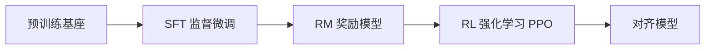

# RLHF 与偏好优化实战

> RLHF（基于人类反馈的强化学习）是让大模型"对齐人类意图"的关键技术。本文梳理从 SFT → RM → RL 的完整链路，以及更轻量的 DPO 等新范式。

## 1. 训练三段式



1. **SFT（Supervised Fine-Tuning）**：用高质量指令数据微调，让模型学会基本格式。
2. **RM（Reward Model）**：训练一个打分模型，对"同一问题的多个回答"给出符合人类偏好的分数。
3. **RL（PPO 等）**：以 RM 为奖励信号，用强化学习优化策略模型，同时用 KL 散度约束不偏离 SFT 太远。

## 2. 偏好数据构造

- **对比对（pairwise）**：对同一 prompt 收集多个回答，标注"哪个更好"，形成 `(chosen, rejected)`。
- **多维度标注**：有用性、真实性、安全性分别打分。
- **数据质量 > 数量**：噪声偏好会误导 RM。

## 3. PPO 核心

```python
# 概念流程（非可运行完整代码）
for batch in dataloader:
    prompts = batch.prompts
    responses = policy.generate(prompts)        # 当前策略
    rewards = reward_model(prompts, responses)   # RM 打分
    kl = kl_div(policy, ref_policy)              # 与参考模型距离
    loss = - (rewards - beta * kl)               # 目标
    optimizer.step(loss)
```

- **参考模型（ref）**：SFT 模型冻结，作为 KL 锚点，防止策略跑偏。
- **价值网络（critic）**：估计优势函数，降低方差。
- **beta**：KL 惩罚系数，平衡对齐强度与多样性。

## 4. DPO：省去 RL 的偏好优化

DPO（Direct Preference Optimization）把"训练 RM + RL"合并为一步监督式分类，直接优化策略使 chosen 概率高于 rejected：

```
L_DPO = -log σ( β * (log π(y_w|x) - log π_ref(y_w|x))
              - β * (log π(y_l|x) - log π_ref(y_l|x)) )
```

优点：无需 RM、无需 RL 循环、训练稳定；缺点：对数据质量与超参敏感，复杂对齐仍可用 RLHF。

## 5. 其他变体

| 方法 | 特点 |
| --- | --- |
| RRHF | 用排序损失统一偏好 |
| RLAIF | 用 AI 反馈替代人类标注，降本 |
| ORPO | 把偏好对齐融入 SFT，无需单独阶段 |
| KTO | 仅用"好/坏"单边信号，标注更省 |

## 6. 工程挑战

- **奖励黑客（reward hacking）**：策略找到 RM 漏洞刷高分但质量差 → 需 RM 正则、定期迭代 RM。
- **分布偏移**：RL 后分布偏离训练分布，需在线数据补充。
- **成本**：PPO 需同时驻留 4 个模型（policy/ref/critic/RM），显存与算力昂贵。
- **评估**：需独立红队与基准（如 MT-Bench、RewardBench）。

## 7. 安全对齐

- 在偏好数据中引入"拒答有害请求"样本。
- 安全奖励与有用性奖励联合，避免"过度拒答"。
- 红队评测验证越狱鲁棒性。

## 8. 常见坑

| 坑 | 现象 | 对策 |
| --- | --- | --- |
| 奖励黑客 | 分数高但废话 | RM 正则 + 人工抽检 |
| KL 过大 | 输出退化 | 调小 beta、加强 ref 约束 |
| 数据偏置 | 只迎合标注者 | 多源标注、去偏 |
| 训练不稳定 | loss 震荡 | 小学习率、梯度裁剪 |

## 9. 面试题

1. RLHF 三个阶段分别做什么？
2. 为什么需要参考模型（ref）？
3. DPO 相比 PPO 的优势与局限？
4. 什么是奖励黑客？如何缓解？
5. RLAIF 是什么？

## 10. 小结

RLHF 是偏好对齐的工业标准，但成本高、易 hack；DPO 等直接优化方法在多数场景已能替代，落地时按数据规模与对齐复杂度选择。
