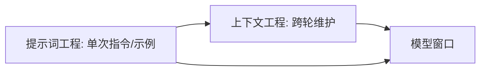

# 上下文工程概述

> 一句话：上下文工程关注的是「在每次采样时，往上下文窗口里放什么、怎么维护」，是提示词工程向「动态、系统级」的自然演进。

## 一、什么是上下文工程

上下文工程（Context Engineering）是一门**学科**，研究如何在 LLM 采样的每一步，对「包含在上下文窗口里的所有 token」进行**策划（curation）与维护（maintenance）**。

它关注的不是单次提示词怎么写，而是贯穿整个会话 / 任务生命周期：上下文里有哪些内容、何时加入、何时丢弃、如何压缩、如何持久化。

> 概念由 Andrej Karpathy 于 2025 年 6 月带火，他建议使用「上下文工程」来取代「提示词工程」这一说法。

## 二、与提示词工程的区别

| 维度 | 提示词工程 | 上下文工程 |
| --- | --- | --- |
| 关注点 | 单次提示词怎么写 | 整个会话 / 任务生命周期的 token 管理 |
| 范围 | 静态指令、示例、格式 | 动态增删、压缩、记忆、子代理 |
| 视角 | 「我这次怎么问」 | 「模型每一步看到什么」 |

> 二者不是对立关系：提示词工程是上下文工程的基础，上下文工程是其在系统层面的扩展（详见模块 README 的 ⚠️ 说明）。

## 三、为什么重要

### 1. 上下文窗口是有限资源

上下文窗口有上限，且不是「越大越好用」。窗口里的每个 token 都占用量与注意力预算。

### 2. 边际收益递减

「往上下文里塞更多内容」并不会线性提升效果。**上下文腐烂**研究表明：随着窗口内 token 数增加，模型从上下文中准确回忆信息的能力会下降（详见 02-核心原理与杠杆.md）。因此，盲目堆内容往往得不偿失。

> 核心心法：把上下文当作**宝贵且有限**的资源来经营，而不是无脑的「垃圾桶」。

## 四、与提示词工程的边界（厘清）

两者常被混为一谈，但边界清晰——前者决定「单次往窗口里放什么指令」，后者决定「在长任务里窗口内容如何被动态维护」。

| 维度 | 提示词工程 | 上下文工程 |
| --- | --- | --- |
| 作用时刻 | 单次调用前写提示 | 贯穿会话 / 任务生命周期 |
| 操作对象 | 指令、示例、格式文本 | 窗口内全部 token 的增删 / 压缩 / 持久化 |
| 典型动作 | 写角色、给 few-shot、定输出格式 | compaction、tool-result clearing、memory、子代理 |
| 关注问题 | 「这次怎么问」 | 「模型每一步看到什么、怎么维护」 |

> 一句话边界：**提示词工程是上下文工程的「输入之一」**。一个高质量的上下文工程系统，底层仍依赖良好的提示词；但光写好提示词，解决不了多轮 / 多工具下的窗口膨胀与腐烂。



> 实务建议：先打磨单轮提示词（见提示词工程模块），再把「跨轮怎么管窗口」交给上下文工程。两者叠加，而非二选一。

## 五、长文档处理策略（分块 / 摘要链 / Map-Reduce / Refine）

上下文窗口有限，遇到超长文档（报告、代码库、书籍）不能整篇硬塞，否则触发上下文腐烂。四种主流处理路线：

| 路线 | 做法 | 适用 |
| --- | --- | --- |
| 分块 + 检索 | 切小块建索引，按需召回（即 RAG） | 知识库类、可定位 |
| 摘要链 Map-Reduce | 先逐块摘要，再汇总摘要成总摘要 | 需全局理解但不可定位 |
| Refine（滚动摘要） | 读一块就更新一次总摘要，串行推进 | 强依赖顺序、逐步收敛 |
| 分而治之子代理 | 各子代理读不同段，只回传摘要 | 可并行、跨段综合 |

**Map-Reduce 摘要链示意**：

```python
# Map: 逐块出局部摘要
partials = [llm.summarize(chunk) for chunk in chunks]
# Reduce: 合并为全局摘要
final = llm.summarize("\n".join(partials))
```

**Refine 滚动摘要示意**：

```python
summary = ""
for chunk in chunks:
    summary = llm.refine(existing=summary, new_chunk=chunk)
# 每读一块更新一次，适合顺序强依赖
```

> 💡 选型：可定位的事实问答走「分块+检索」；需要全局概括且不可定位走「摘要链/Refine」；可并行探索走「子代理」。三者都遵循同一心法——窗口里只留高信号 token。

> ⚠️ 摘要会丢细节，关键数字/结论建议同时落外部存储（NOTES.md / 向量库）以便回查。
