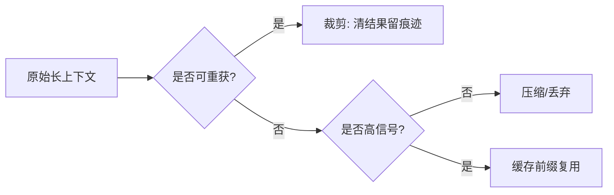
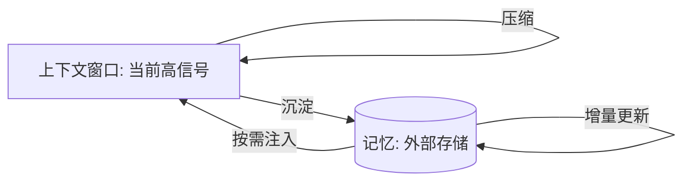

# 核心原理与杠杆

> 本节先讲「为什么会失效」（上下文腐烂），再讲核心原则，最后展开 Anthropic 提出的三大上下文管理杠杆，以及子代理架构、按需上下文、token 高效工具等工程手法。

## 一、上下文腐烂（Context Rot / Needle-in-a-Haystack）

**上下文腐烂**：随着上下文窗口内 token 数量增加，模型从上下文中**准确回忆信息的能力下降**。

- 这类现象由 needle-in-a-haystack（大海捞针）类基准揭示：把关键信息埋进长上下文，看模型能否回忆出来。
- 关键结论：**即使没到上下文的硬上限**，每个 token 的效用也在递减——窗口越长，单个 token 的「信噪比」越低。

> 这解释了为什么「把所有资料都塞进上下文」通常不是好主意（见 03-实战策略与选型.md 避坑）。

## 二、核心原则

> **用最少的高信号 token，最大化期望结果。**

展开来说：

- 目标是找到**最小的高信号 token 集合**，足以让模型给出期望输出。
- 把上下文当作**宝贵且有限**的资源，而不是越多越好。
- 每一次往窗口里加内容，都要问：「这个 token 真的高信号吗？有没有更省的替代（如按需拉取、压缩、外部存储）？」

## 三、Anthropic 三大上下文管理杠杆

来源：https://www.anthropic.com/engineering/effective-context-engineering-for-ai-agents

### 1. Compaction（压缩）

把上下文窗口**蒸馏为高保真摘要**，让长对话能够继续，而不必保留全部原始 token。

- Claude Code 用此机制处理长会话。
- Anthropic 平台提供 server-side compaction（服务端压缩）。

```text
长会话原始上下文 ──蒸馏──▶ 高保真摘要 + 近期关键 token
（保留语义，丢弃冗余细节）
```

### 2. Tool-result clearing（工具结果清理）

**丢弃**旧的、可重新获取的工具结果，但**保留「调用发生过」这条记录**。

- 好处：降低工具使用带来的上下文膨胀（工具返回往往很大）。
- 平台提供 context editing / `clear_tool_uses` 能力。

```text
before: [tool_call] [巨大工具结果] [tool_call] [巨大工具结果] ...
after : [tool_call] [已清理]   [tool_call] [已清理]   ...
        ↑ 仅保留「调用发生过」的记录，结果可重新获取
```

> ⚠️ 清理的是「结果」，不是「调用记录」。务必保留调用痕迹，否则模型会误以为工具没调用过。

### 3. Memory / 结构化笔记（Structured Note-taking / Agentic Memory）

智能体把**笔记持久化到上下文窗口之外的存储**（如 `NOTES.md`、memory tool），之后按需拉回。

- Claude Code 的 to-do、自定义 agent 的 `NOTES.md` 是典型例子。
- Claude 在 **Sonnet 4.5** 推出文件式 memory tool（public beta），可**跨会话维护项目状态**。

```text
上下文窗口（小、快）      │     外部存储（大、持久）
─────────────────        │     ─────────────────
当前任务 + 精简摘要  ◀──拉取── NOTES.md / memory
                        └──写入── 里程碑、决策、状态
```

## 四、子代理架构（Sub-agent Architecture）

用一个**主代理协调** + 多个**专注子代理**：

- 每个子代理在**各自干净的上下文窗口**里做深度工作，只返回**精简摘要**（常 1000–2000 token）。
- 主代理负责**综合**各子代理的摘要。
- 适合**复杂研究 / 并行探索**：不同子代理并行检索不同方向，互不污染上下文。

```text
        主代理（协调 + 综合）
       /      |       \
  子代理A  子代理B  子代理C
  (干净上下文) (干净上下文) (干净上下文)
    │          │          │
  摘要~1-2k  摘要~1-2k  摘要~1-2k
```

> 本质：用「隔离的上下文窗口 + 精简回传」对抗上下文腐烂。

## 五、按需（Just-in-time）上下文

不要在任务开始时把所有内容预加载进上下文。需要某段内容时**再拉取**（如检索、读文件、调工具），用完后该内容可清理或沉淀到外部存储。

这与三大杠杆一脉相承：compaction 压缩旧的、tool-result clearing 清掉可重获的、memory 沉淀跨会话的，都是为了「窗口里只留当下高信号 token」。

## 六、Token 高效工具（Token-efficient Tools）

设计工具与返回结构时，优先考虑**减少 token 占用**：

- 工具结果只返回必要字段，而非整条大对象。
- 可重新获取的结果，倾向用 tool-result clearing 清理。
- 让工具「说得少而准」，降低上下文膨胀。

> ⚠️ 本文所列数字（如子代理摘要 1000–2000 token、Claude Sonnet 4.5 推出文件式 memory tool）均来自上述官方来源；具体效果因模型版本与任务而异。

## 七、上下文压缩、选择性注入与缓存裁剪（深化）

上文三大杠杆是「做什么」，这里给更细、可直接落地的工程手法。

### 1. 上下文压缩（Compression）

- **逐级摘要**：把早期轮次蒸馏为「要点 + 关键决策」，而非逐字保留。
- **结构化压缩**：用固定 schema（如 JSON）记录状态，丢弃自由文本冗余。
- **触发时机**：对话轮次超过阈值、或窗口占用超预算时自动触发。

```python
# 压缩示意：把历史轮次蒸馏为结构化摘要
summary = llm.generate(
    f"把以下对话历史压缩为 JSON 状态：{history}",
    schema={"decisions": "list", "open_tasks": "list", "key_facts": "list"},
)
```

### 2. 选择性注入（Selective Injection）

不是「全部相关都注入」，而是按**当前子任务**挑高信号片段，在 token 预算内取分最高的：

```python
def select_context(task, candidates, budget_tokens=4000):
    scored = [(c, relevance(task, c) - cost(c)) for c in candidates]
    scored.sort(key=lambda x: x[1], reverse=True)
    ctx, used = [], 0
    for c, _ in scored:
        if used + len(c) > budget_tokens:
            break
        ctx.append(c)
        used += len(c)
    return ctx   # 只注入预算内最高分的片段
```

### 3. 缓存与裁剪（Caching & Pruning）

- **缓存**：不变前缀（system、长文档、代码库摘要）用 Prompt Caching，避免每次重传。
- **裁剪**：工具结果、过期中间态在「可重获」前提下清掉，仅留调用痕迹。



> ⚠️ 压缩会丢细节——务必保证「可重获」的内容才裁剪，关键决策落 Memory / NOTES.md 而非只留在窗口里。

## 八、上下文预算计算（Context Budgeting）

把窗口当成「预算」来算，才能定量决策。一个朴素的预算拆法：

```text
上下文预算 = system 前缀 + 指令/示例 + 检索/工具上下文 + 历史/记忆 + 预留输出
   │             │            │              │                │
  固定/可缓存    小且稳      波动最大        受 compaction 控   按任务留 10~30%
```

| 组成部分 | 典型占比 | 优化手段 |
| --- | --- | --- |
| system 前缀 | 5~15% | Prompt Caching 固化 |
| 指令 / few-shot | 5~10% | 精简、按需注入 |
| 检索 / 工具结果 | 30~60% | 重排截断、tool-result clearing |
| 历史 / 记忆 | 10~30% | compaction、memory 沉淀 |
| 输出预留 | 10~30% | 按任务上限设 max_tokens |

```python
# 预算守卫示意
def guard(ctx_parts, limit=200_000):
    used = sum(len(p) for p in ctx_parts)
    if used > limit * 0.9:                # 超 90% 触发压缩
        ctx_parts["history"] = compact(ctx_parts["history"])
    return ctx_parts
```

> 💡 先量「各组成部分占比」，再决定压哪块。多数系统里「检索/工具结果」是最肥的可压缩项。

## 九、压缩与裁剪策略对比表

不同「减 token」手法适用不同对象，别混用：

| 手法 | 作用对象 | 是否可重获 | 丢细节? | 触发时机 |
| --- | --- | --- | --- | --- |
| Compaction 压缩 | 长历史对话 | 否（已蒸馏） | 丢冗余、保语义 | 轮次/占用超阈值 |
| Tool-result clearing | 工具返回 | 是（可重调） | 仅清结果留痕迹 | 调用完成后即清 |
| 选择性注入 | 候选上下文 | 是（外部仍在） | 未注入的暂不取 | 每个子任务挑 top |
| 结构化压缩 | 自由状态文本 | 否 | 按 schema 保关键 | 状态更新时 |
| Prompt Caching | 不变前缀 | 是（缓存中） | 否 | 前缀稳定即上 |

> 💡 口诀：**可重获的清（clearing）、可外部的移（memory）、只剩精华的压（compaction）、不变的缓存（caching）**。

## 十、缓存与增量更新

- **Prompt Caching**：把稳定前缀（system、长文档、代码库摘要）标记为缓存断点，跨调用复用，降本降延迟。适合「多次调用、前缀不变」。
- **增量更新**：外部存储（NOTES.md / 向量库 / KV）的内容**增量写入**而非全量重建——只追加新增决策/事实，避免每次重算全量上下文。

```python
# 增量写记忆（append-only）
def update_notes(path, delta):
    with open(path, "a") as f:
        f.write(f"\n- {delta}")     # 只追加，不清空
# 读取时只取相关行，而非全量灌入窗口
```

> ⚠️ 缓存要求前缀 byte 级稳定，system 一旦改动缓存即失效；增量更新要保证「回读时按相关性过滤」，别又把全量拉回窗口。

## 十一、与 Agent 记忆的关系

上下文工程与「记忆」子模块是同一枚硬币的两面：

- **上下文工程**管「窗口内当下怎么维护」（compaction / clearing / 子代理）。
- **记忆**管「窗口外怎么持久化与回取」（写入 NOTES.md / memory / 向量库，按需拉回）。

二者通过「**窗口 ↔ 外部存储**」的拉取/写入闭环联动：窗口里的高信号决策，沉淀到记忆；记忆里相关片段，按当前任务选择性注入窗口。



> 💡 实务上：把「跨会话要保留的」交给记忆，「单次任务要维护的」交给上下文工程。割裂二者会让 Agent 要么「记不住」，要么「窗口爆」。
