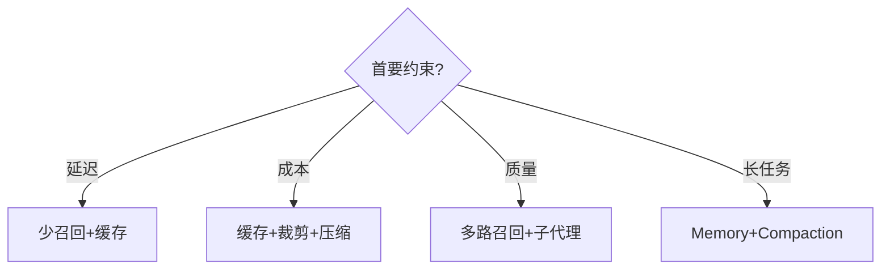
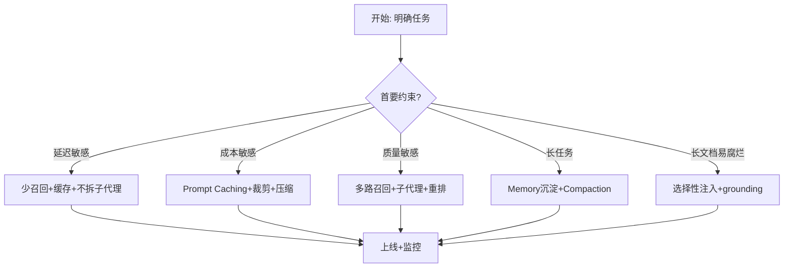

# 实战策略与选型

> 本节把 02 的三大杠杆落到「怎么选、怎么用」，并补充长上下文摆位、可套用清单与避坑。

## 一、三种杠杆适用场景对比

| 杠杆 | 适合场景 | 要点 |
| --- | --- | --- |
| **Compaction（压缩）** | 大量来回的对话 | 长会话蒸馏为高保真摘要，继续推进；Claude Code 用于长会话 |
| **Memory / 结构化笔记** | 有明确里程碑的迭代开发 | 把决策 / 状态持久化到外部存储（NOTES.md / memory），跨会话维护 |
| **Multi-agent（子代理架构）** | 需并行探索的复杂研究 | 子代理在干净上下文做深度工作，只回传精简摘要，主代理综合 |

> 选型来源：Anthropic《Effective context engineering for AI agents》。三者可组合使用，并非互斥。

## 二、与长上下文摆位的关系

长上下文摆位（与提示词工程模块呼应）是「单次提示内」的排布技巧，和本模块的「跨轮次 / 生命周期」管理互补：

- **长文档 / 数据放提示最上方**，指令、示例放下面，**查询放最后**（来自提示词工程模块的最佳实践）。
- 要求模型**先引用原文再作答（grounding）**，帮它穿过噪声。

```xml
First, pull relevant quotes from the source in <quotes> tags.
Then write a concise, factual response in <answer> tags, grounded in those quotes.
```

> 摆位解决「一次提示里怎么排」；上下文工程解决「多轮 / 多工具下窗口怎么管」。两者叠加效果最好。

## 三、可套用清单

- [ ] 写提示 / 搭系统前，先想清楚：**这次真正需要哪些高信号 token？**
- [ ] 长会话：是否用 **compaction** 把历史蒸馏成摘要？
- [ ] 工具调用多：是否对**可重获的结果**做 tool-result clearing，但**保留调用记录**？
- [ ] 迭代开发：是否把**里程碑 / 决策**沉淀到 NOTES.md 或 memory，跨会话复用？
- [ ] 复杂研究：是否拆成**子代理**，各自干净上下文 + 精简回传？
- [ ] 是否避免**预加载全部内容**，改为**按需（just-in-time）**拉取？
- [ ] 单次长提示：是否**长文档在上、查询在末尾**，并要求 grounding？

## 四、避坑

### ❌ 不要把所有内容预加载进上下文

这是最常见的反模式：在任务开始就把全部文档 / 数据 / 历史塞进窗口。

- 触发**上下文腐烂**：窗口越长，单 token 效用越低，关键信息反而被稀释。
- 浪费 token 预算与注意力。

✅ 正确做法：**按需（just-in-time）** 拉取，用完即清 / 即沉淀。

> ⚠️ 上下文工程与提示词工程是**互补**关系而非替代；具体效果因模型版本与任务而异，请以你自己的评测为准。

## 五、成本与延迟权衡

上下文工程每个选择都有代价，选型本质是「质量 / 成本 / 延迟」三角权衡：

- **多召回 / 多路检索**：效果更好，但延迟与 token 成本上升。
- **子代理**：并行深搜、上下文干净，但多一次 LLM 调用开销。
- **压缩 / 裁剪**：省 token，但可能丢细节（需要时可重获）。
- **Prompt Caching**：降成本降延迟，但要求前缀稳定。

### 决策表：怎么选上下文策略

| 你的首要约束 | 优先策略 | 理由 |
| --- | --- | --- |
| 延迟敏感（实时对话） | 少召回 + 缓存 + 不拆子代理 | 减少调用次数与传输量 |
| 成本敏感（大流量） | Prompt Caching + 裁剪 + 压缩 | 砍掉重复 token |
| 质量敏感（研究 / 分析） | 多路召回 + 子代理 + 重排 | 可接受更高开销换精度 |
| 长任务（迭代开发） | Memory 沉淀 + Compaction | 跨轮保持状态不丢 |
| 上下文易腐烂（长文档） | 选择性注入 + grounding | 只留当前高信号 |



> 口诀：**先定约束（延迟 / 成本 / 质量），再选杠杆组合**。没有银弹，只有权衡——且权衡要随流量与预算变化动态调整。

## 六、成本-质量权衡决策树（细化）

把 05 的决策表落成可执行的判断流程：先定首要约束，再逐层选杠杆组合。



> 口诀：**约束决定组合，组合决定成本**。上线后盯「忠实度/正确性/延迟/成本」四张看板，随流量动态调整。

## 七、上下文工程评测与回归

上下文工程做得好不好，要量化而非拍脑袋：

| 评测项 | 怎么测 | 目标 |
| --- | --- | --- |
| 窗口利用率 | 实际高信号 token / 总 token | 越高越好 |
| 任务成功率 | 端到端跑基准任务 | 不退化 |
| 成本 | 单次任务平均 token / 花费 | 可控、下降 |
| 延迟 | 首 token / 端到端耗时 | 达标 |
| 腐烂率 | 长窗口下关键信息召回率 | 不随长度骤降 |

```python
# 最简回归：同一任务集，对比改前改后
for task in task_set:
    before = run(task, old_ctx_strategy)
    after  = run(task, new_ctx_strategy)
    assert after.success >= before.success
    assert after.cost   <= before.cost * 1.1   # 成本不暴涨
```

> ⚠️ 任何上下文策略改动都要跑回归：压缩省了 token 但不能牺牲成功率；子代理提了质量但不能让延迟爆表。
