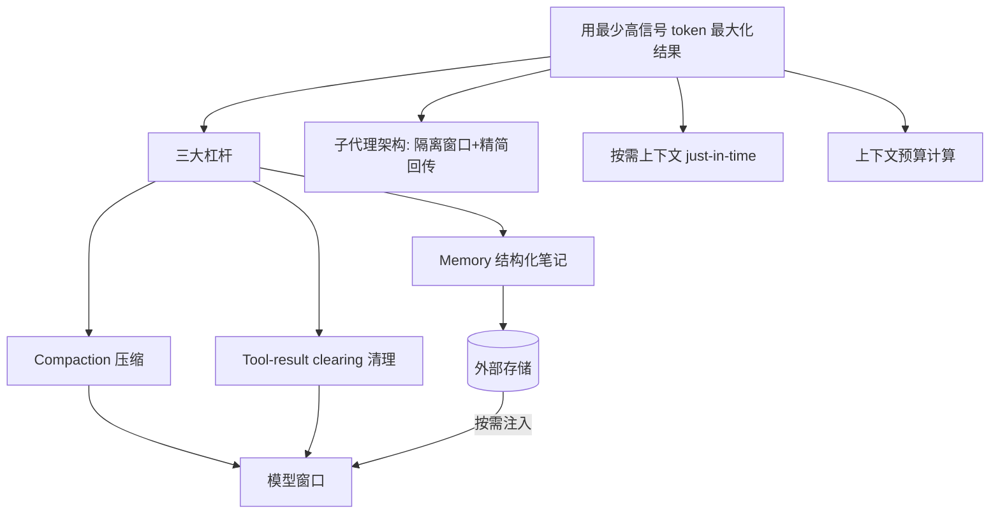
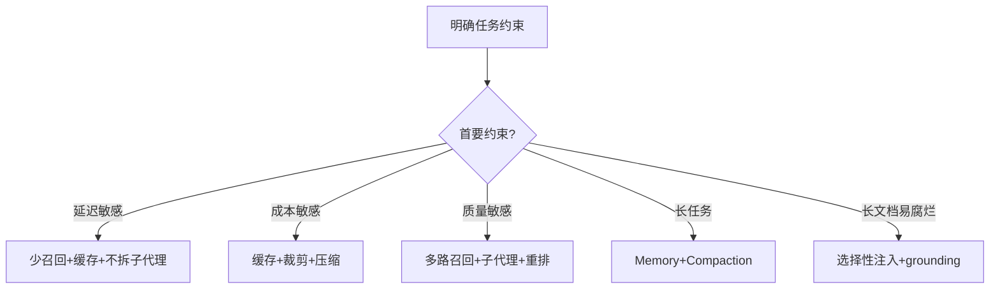

# 上下文工程（Context Engineering）

> 上下文工程是在 LLM 采样时包含的所有 token 的「策划与维护」学科，是提示词工程的自然演进。本模块整理 Anthropic 官方工程实践与社区指南，作为后端工程师视角的学习笔记。
>
> 内容立场：上下文工程不是「把更多内容塞进窗口」，而是**用最少的高信号 token 最大化期望结果**。

## 内容索引

| 文件 | 内容 | 形态 |
| --- | --- | --- |
| [01-概述.md](./01-概述.md) | 什么是上下文工程、与提示词工程的区别、为什么重要 | 📝 文字 |
| [02-核心原理与杠杆.md](./02-核心原理与杠杆.md) | 上下文腐烂、核心原则、Anthropic 三大杠杆、子代理架构、按需上下文、token 高效工具 | 📝 文字 |
| [03-实战策略与选型.md](./03-实战策略与选型.md) | 三种杠杆适用场景对比、长上下文摆位、可套用清单、避坑 | 📝 文字 |

## 主要参考来源

- **Anthropic《Effective context engineering for AI agents》**：https://www.anthropic.com/engineering/effective-context-engineering-for-ai-agents
- **Anthropic Cookbook《Context engineering: memory, compaction, and tool clearing》**：https://platform.claude.com/cookbook/tool-use-context-engineering-context-engineering-tools
- **dair-ai/Prompt-Engineering-Guide（含 context engineering 章节）**：https://github.com/dair-ai/Prompt-Engineering-Guide

> ⚠️ 本模块为「整理 + 个人化注解」，非原创理论。文中数字与机制均来自上述官方来源；具体效果因模型版本与任务而异。上下文工程与提示词工程是**互补**关系而非替代关系。

## 本子模块学习路径

1. `01-概述.md`：建立上下文工程直觉，分清它与提示词工程的关系与边界。
2. `02-核心原理与杠杆.md`：理解上下文腐烂，掌握三大杠杆、子代理架构、压缩/注入/缓存裁剪。
3. `03-实战策略与选型.md`：把杠杆落到选型、长上下文摆位、成本延迟权衡与避坑。

## 核心要点速览

- 上下文工程 = 对「每次采样时窗口里的所有 token」做策划与维护。
- 心法：**用最少的高信号 token 最大化期望结果**。
- 三大杠杆：Compaction（压缩）、Tool-result clearing（清理）、Memory（结构化笔记）。
- 子代理 + 按需上下文 + token 高效工具，共同对抗上下文腐烂。
- 与提示词工程互补，不是替代；成本是永恒的权衡维度。

## 推荐延伸阅读

- Anthropic《Effective context engineering for AI agents》
- Anthropic Cookbook《Context engineering: memory, compaction, and tool clearing》
- dair-ai/Prompt-Engineering-Guide 的 context engineering 章节
- 本知识库「提示词工程」「记忆」模块（上下文工程 ↔ 记忆 ↔ 提示词工程三位一体）

## 一、核心概念地图（Mermaid 概念全景）

> 上图表明：上下文工程 = 杠杆（压缩/清理/记忆）+ 架构（子代理）+ 方法（按需/预算），共同对抗上下文腐烂。与提示词工程、记忆、RAG、智能体四个子模块两两联动。

## 二、速查表（Cheat Sheet）

| 决策点 | 默认 | 何时调整 |
| --- | --- | --- |
| 窗口心智 | 有限宝贵资源 | 永远别无脑堆内容 |
| 第一杠杆 | compaction（长会话） | 短对话用不上 |
| 工具多 | tool-result clearing | 保留调用痕迹 |
| 跨会话状态 | Memory / NOTES.md | 迭代开发必上 |
| 复杂研究 | 子代理 + 摘要回传 | 可并行才拆 |
| 减 token | 缓存 + 裁剪 + 压缩 | 成本敏感时 |
| 长文档 | 分块检索 / 摘要链 | 不可定位走摘要 |

## 三、常见误区清单

1. **把所有内容预加载进窗口**：最常见反模式，直接触发上下文腐烂。
2. **以为窗口越大越好**：边际效用递减，长窗口单 token 信噪比更低。
3. **清理工具结果时连调用记录一起删**：模型会误以为没调用过，必须留痕。
4. **只压缩不沉淀**：关键决策只留窗口里，会话一清就丢，应落 Memory。
5. **混淆与提示词工程**：认为二选一；实为互补，提示词是上下文工程的输入之一。
6. **不分场景硬上子代理**：简单任务拆子代理徒增调用开销与延迟。
7. **缓存前缀不稳定**：system 一改缓存失效，降本落空。
8. **为省 token 牺牲成功率**：压缩/裁剪要回归验证不退化。

## 四、与其它子模块关系

- **与提示词工程**：提示词决定「单次往窗口放什么指令」，上下文工程决定「跨轮窗口怎么维护」；前者是后者的输入之一。
- **与记忆**：记忆管「窗口外持久化与回取」，上下文工程管「窗口内当下维护」，二者通过拉取/写入闭环联动。
- **与 RAG**：RAG 产出的检索块是「注入上下文」的主要来源，受压缩/选择性注入约束。
- **与智能体**：智能体是上下文工程的主战场（多轮/多工具/子代理），杠杆直接服务于 Agent 稳定。

## 五、面试高频问题（速记）

- 上下文工程是什么？与提示词工程的区别与边界？
- 什么是上下文腐烂？为什么窗口不是越大越好？
- Anthropic 三大杠杆各解决什么问题？
- Tool-result clearing 为什么必须保留调用记录？
- 子代理架构如何对抗上下文腐烂？摘要回传多大合适？
- 怎么算上下文预算？最该压的是哪块？
- 压缩 / 裁剪 / 缓存 / 记忆 四种手法怎么区分？
- 长文档有哪些处理路线（分块/摘要链/Refine/子代理）？
- 上下文工程怎么量化评估（回归看板）？
- 成本-质量-延迟三角怎么权衡？

## 六、成本-质量权衡决策树

> 以上为上下文工程子模块全局速查与导航。各篇（01/02/03）给出概述、原理杠杆与实战选型的细节。
