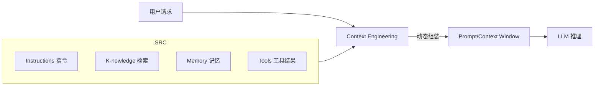

# 上下文工程 Context Engineering 实战

> 上下文工程（Context Engineering）是指"为每次推理动态地筛选、组装、压缩与调度信息，使大模型在有限上下文窗口内获得完成任务所需的最相关、最准确、最低噪声的信息"。它取代了早期"把能塞的都塞进 prompt"的朴素做法，是 Agent 与 RAG 系统从 demo 走向生产的关键工程能力。

## 1. 为什么需要上下文工程

| 朴素 Prompt 做法 | 上下文工程做法 |
| --- | --- |
| 把所有历史对话拼进 prompt | 按相关性/时效性/重要性分层检索与裁剪 |
| 静态 system prompt | 动态合成 system + 检索片段 + 工具结果 + 记忆 |
| 长上下文=更好 | 长上下文带来注意力稀释、成本上升、噪声增加 |
| 人工调 prompt | 可观测、可评测、可自动优化的管道 |

核心结论：**上下文质量比上下文长度更重要**。研究（如 Stanford "RULER"、Anthropic "Effective context" 系列）表明，模型在窗口中部的信息利用率显著低于首尾，过长上下文反而降低准确率（lost-in-the-middle 现象）。

## 2. 上下文的四大来源



- **Instructions**：系统指令、角色、约束、输出格式。
- **Knowledge（K）**：RAG 检索得到的外部知识片段。
- **Memory（M）**：短期（本轮对话）/ 长期（跨会话用户画像、历史决策）。
- **Tools（T）**：工具调用参数与返回结果（往往体积最大、噪声最高）。

## 3. 上下文压缩与路由策略

### 3.1 压缩手段
1. **检索前压缩**：query 改写 / 假设性文档嵌入（HyDE）。
2. **检索后压缩**：
   - **重排序（Rerank）**：用 cross-encoder 对候选重排取 Top-K。
   - **上下文压缩（Contextual Compression）**：用一个小模型对检索片段做摘要抽取（如 LangChain `ContextualCompressionRetriever`）。
3. **对话历史压缩**：
   - 滚动摘要（rolling summary）：超出窗口的历史由模型压缩为摘要。
   - 关键事件抽取：只保留决策、实体、未完成事项。
4. **Token 预算分配**：为 I/K/M/T 各设预算上限，超预算按权重裁剪。

### 3.2 路由策略（少则精）
- **问题分类路由**：简单问题走短链（无检索），复杂问题走 RAG+工具。
- **记忆路由**：用 embedding 相似度召回相关长期记忆，而非全量注入。

## 4. 实战：可观测的上下文管道

```python
from dataclasses import dataclass, field

@dataclass
class ContextBudget:
    instruction: int = 1500
    knowledge: int = 3000
    memory: int = 2000
    tools: int = 4000

@dataclass
class ContextPiece:
    kind: str
    text: str
    score: float = 1.0
    tokens: int = 0

class ContextAssembler:
    def __init__(self, budget: ContextBudget):
        self.budget = budget

    def assemble(self, pieces: list[ContextPiece]) -> str:
        # 按类型预算裁剪，再按 score 排序
        by_kind: dict[str, list[ContextPiece]] = {}
        for p in pieces:
            by_kind.setdefault(p.kind, []).append(p)
        out = []
        for kind, limit in self.budget.__dict__.items():
            items = sorted(by_kind.get(kind, []),
                           key=lambda x: x.score, reverse=True)
            used = 0
            for it in items:
                if used + it.tokens > limit:
                    continue
                out.append(f"[{kind}]\n{it.text}")
                used += it.tokens
        return "\n\n".join(out)
```

## 5. 常见坑与对策

| 坑 | 现象 | 对策 |
| --- | --- | --- |
| 上下文污染 | 工具返回的大段 HTML/JSON 冲掉指令 | 工具结果单独分区 + 截断 + 结构化解析 |
| 指令遗忘 | 长上下文后模型忽略 system 约束 | 关键约束重复置于首尾；用 guardrail 校验 |
| 幻觉放大 | 检索片段错误被当作事实 | 片段标注来源与置信度，要求引用 |
| 成本爆炸 | 每次都带全量历史 | Token 预算 + 历史压缩 + 缓存 prompt |
| 顺序偏差 | 重要信息落在窗口中部 | 重要项置顶/置底；主动重排 |

## 6. 与 Prompt Caching 协同

将稳定部分（Instructions、常驻知识）放在上下文前部并打上 cache 标记（Anthropic `cache_control`、OpenAI `prompt caching`、Gemini `context cache`），可变部分（工具结果、本轮检索）放后部。可降本 70%~90%，并让缓存命中时指令始终在稳定区，避免被压缩影响。

## 7. 评测方法

- **上下文利用率评测**：构造"答案只在特定位置"的探针集，测模型能否定位（lost-in-the-middle 基准）。
- **信噪比评测**：注入无关片段，看准确率下降幅度。
- **成本-质量权衡曲线**：随上下文长度增加，画准确率 vs token 成本曲线，找拐点。

## 8. 面试题

1. 什么是 lost-in-the-middle？生产中如何缓解？
2. 上下文工程与 RAG 的区别与联系？
3. 如何给 Instruction/Knowledge/Memory/Tools 分配 token 预算？
4. Prompt Caching 与上下文压缩如何协同？
5. 工具返回体积巨大时，有哪几种压缩/隔离手段？

## 9. 小结

上下文工程是"把对的信息，在对的位置，用对的预算，给对的模型"。它包含检索、压缩、路由、缓存、评测五个环节，是 Agent 可靠性的底层支柱，应作为独立模块建设并纳入可观测体系。
