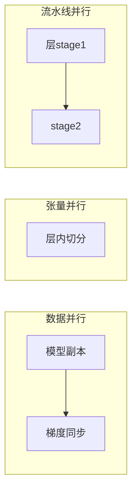

# 分布式训练实战

> 大模型训练是算力、通信、工程的综合考验：单卡放不下、训练太慢、显存溢出。分布式训练用数据并行、流水线并行、张量并行把训练切分到多卡多机，同时要与显存优化、通信拓扑协同。

## 1. 并行策略

| 策略 | 切什么 | 通信 |
| --- | --- | --- |
| 数据并行 DP | 数据分片，复制模型 | 梯度 AllReduce |
| 张量并行 TP | 单层参数切分 | 高带宽 intra |
| 流水线并行 PP | 层分 stage | stage 间激活 |
| ZeRO | 优化器状态分片 | 中等 |

## 2. 显存优化

- **混合精度**：FP16/BF16 降低显存与算力。
- **梯度检查点**：用计算换显存。
- **卸载**：优化器状态 offload 到 CPU。
- **ZeRO**：分片优化器/梯度/参数。

## 3. 通信与拓扑

- 同机 NVLink 高带宽，跨机走 IB/RDMA。
- 张量并行尽量放同机，流水线跨机。
- 梯度累加减少同步频率。

## 4. 常见坑

| 坑 | 现象 | 对策 |
| --- | --- | --- |
| 显存溢出 | OOM | 检查点 + ZeRO |
| 通信瓶颈 | 慢 | 拓扑优化 |
| 负载不均 | 空等 | PP 平衡 stage |
| 精度崩 | loss 飞 | 缩放 + 稳定 |
| 断点丢失 | 重训 | 定期 checkpoint |

## 5. 面试题

1. DP/TP/PP 区别？
2. ZeRO 解决了什么？
3. 混合精度为什么省显存？
4. 通信瓶颈如何缓解？
5. 显存不够怎么优化？

## 6. 小结

分布式训练 = 三维并行 + 显存优化 + 通信拓扑协同。核心是"把算力用满、把显存压住、把通信压低"。
