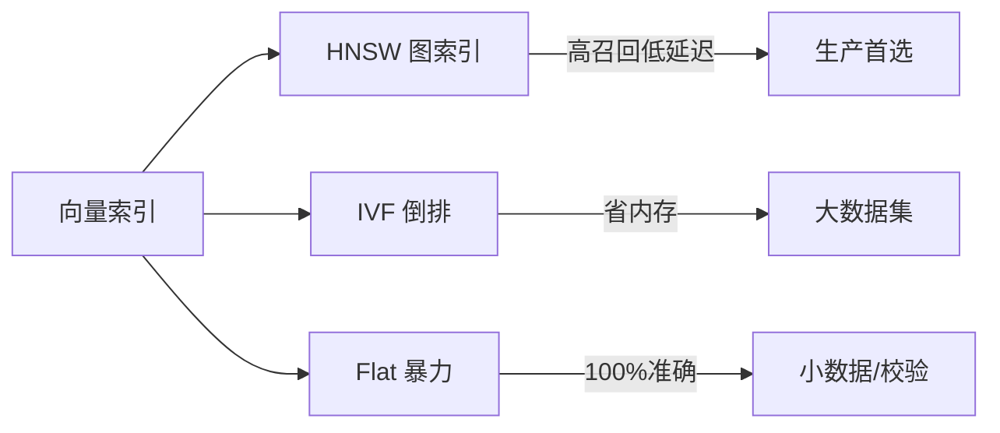

# 向量数据库选型与调优实战

> 向量数据库是 RAG 与语义检索的底座。选型不仅要看"支持多大量"，还要看索引类型、混合检索、过滤能力、成本与运维复杂度。

## 1. 主流产品定位

| 产品 | 定位 | 优势 | 注意 |
| --- | --- | --- | --- |
| Milvus | 大规模专用 | 分布式、性能好、索引全 | 运维重 |
| Qdrant | 云原生专用 | Rust、易部署、过滤强 | 超大规模需集群 |
| Weaviate | 一体化 | 内置向量化、GraphQL | 资源占用高 |
| pgvector | 数据库内 | 复用 Postgres、事务一致 | 极大量需调优 |
| Chroma | 轻量原型 | 嵌入式、上手快 | 生产需外部化 |
| Elasticsearch | 混合检索 | BM25+向量一体 | 向量非原生 |
| Redis | 低延迟 | 内存级速度 | 成本/容量受限 |

## 2. 索引类型与权衡



- **HNSW**：默认首选，召回高、查询快，但建索引占内存、增删有代价。
- **IVF_FLAT / IVF_PQ**：PQ 压缩省内存，适合十亿级，召回略降。
- **Flat**：暴力精确，用于小数据或评测基线。

## 3. 距离度量

- **余弦（Cosine）**：最常用，关注方向，需先归一化。
- **内积（IP）**：归一化后近似余弦，未归一化则受模长影响。
- **欧氏（L2）**：关注绝对距离，适合某些编码向量。

> 选择必须与 Embedding 模型训练时使用的度量一致，否则召回异常。

## 4. 混合检索（Hybrid Search）

纯向量检索对"精确词"（型号、代号、专名）不敏感，应结合：
- **BM25 / 全文**：捕捉关键词匹配。
- **向量**：捕捉语义。
- **RRF（Reciprocal Rank Fusion）** 或加权融合两路结果。

```python
# RRF 融合示例
def rrf(rank_lists, k=60):
    score = {}
    for ranks in rank_lists:
        for i, doc in enumerate(ranks):
            score[doc] = score.get(doc, 0) + 1/(k + i + 1)
    return sorted(score, key=score.get, reverse=True)
```

## 5. 元数据过滤与性能

- **预过滤（pre-filter）**：先按 metadata 过滤再向量检索，结果更准但可能减少候选。
- **后过滤（post-filter）**：先向量检索再过滤，可能召回不足。
- 小众值过滤（如租户ID）务必走索引列，避免全表扫描。

## 6. 调优清单

1. **维度与模型**：固定 Embedding 模型与维度；高维更准但更贵。
2. **分块策略**：chunk size 256~512 token 常见，重叠 10%~20%。
3. **HNSW 参数**：`ef_construction` 越高越准越慢；`ef_search` 调查询精度。
4. **量化**：PQ/SQ 压缩显存，权衡召回。
5. **批量写入**：建索引时批量导入，避免逐条。
6. **副本与分片**：按 QPS 与数据量横向扩展。

## 7. 成本与运维

| 维度 | 建议 |
| --- | --- |
| 小规模原型 | Chroma / pgvector 快速起步 |
| 中大规模生产 | Qdrant / Milvus 集群 |
| 已有 ES 栈 | 直接启用 ES 向量字段 |
| 多租户隔离 | 用 collection 或分区键隔离 |

## 8. 常见坑

| 坑 | 现象 | 对策 |
| --- | --- | --- |
| 度量不一致 | 召回离谱 | 对齐模型与索引度量 |
| 只向量无关键词 | 专名漏检 | 混合检索 |
| 过滤后为空 | 召回不足 | 预/后过滤结合，放宽 |
| 索引未重建 | 新数据不命中 | 增量写入并定期优化 |
| 维度漂移 | 向量不兼容 | 锁定模型版本 |

## 9. 面试题

1. HNSW 与 IVF 的区别与适用？
2. 为什么需要混合检索？RRF 是什么？
3. 预过滤与后过滤的取舍？
4. pgvector 与专用向量库的边界？
5. 十亿级向量如何控制内存？

## 10. 小结

向量库选型 = 规模 × 检索质量 × 过滤 × 运维成本。生产推荐"专用向量库 + 混合检索 + 元数据过滤 + 固定模型版本"，并以评测集验证召回。
