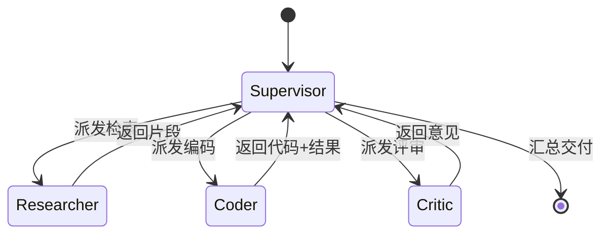

# 多 Agent 编排与协作框架实战

> 当单一 Agent 的提示与工具集过于臃肿时，拆分成多个职责单一、可协作的 Agent 是必然选择。多 Agent 系统的核心问题是：**如何划分角色、如何通信、如何编排控制流、如何保证整体可控可观测**。

## 1. 多 Agent 的三种范式

| 范式 | 代表 | 特点 | 适用 |
| --- | --- | --- | --- |
| 流水线（Pipeline） | 固定 DAG | 确定性强、易调试 | ETL 式任务、文档处理 |
| 主管-下属（Supervisor） | LangGraph、AutoGen GroupChat | 中心调度、灵活 | 复杂多步骤任务 |
| 去中心化（Swarm） | OpenAI Swarm、CrewAI | 自主交接、轻量 | 探索型、开放任务 |

## 2. 角色划分原则

- **单一职责**：每个 Agent 只负责一类子任务，system prompt 聚焦、工具集最小。
- **能力正交**：避免两个 Agent 都能做同一件事导致推诿/重复。
- **接口清晰**：Agent 间通过结构化消息（而非自然语言全文）传递结果。

## 3. 通信与状态



- **共享状态（State）**：用结构化状态对象（如 TypedDict）在节点间传递，而非仅靠聊天历史。
- **消息总线**：复杂场景用消息队列/事件流解耦（如 Kafka + 每个 Agent 一个 consumer group）。

## 4. 实战：LangGraph Supervisor

```python
from langgraph.graph import StateGraph, END
from typing import TypedDict, Annotated
import operator

class TeamState(TypedDict):
    task: str
    research: str
    code: str
    review: str
    messages: Annotated[list, operator.add]

def supervisor(state: TeamState):
    # 根据当前缺口决定下一步
    if not state.get("research"):
        return "researcher"
    if not state.get("code"):
        return "coder"
    if not state.get("review"):
        return "critic"
    return END

def researcher(state: TeamState):
    state["research"] = "检索到的关键资料..."
    return state

def coder(state: TeamState):
    state["code"] = "生成的代码与运行结果..."
    return state

def critic(state: TeamState):
    state["review"] = "评审意见：建议补充边界测试"
    return state

g = StateGraph(TeamState)
g.add_node("researcher", researcher)
g.add_node("coder", coder)
g.add_node("critic", critic)
g.add_conditional_edges("supervisor", supervisor,
    {"researcher":"researcher","coder":"coder",
     "critic":"critic", END:END})
# 各子节点完成后回到 supervisor
for n in ["researcher","coder","critic"]:
    g.add_edge(n, "supervisor")
g.set_entry_point("supervisor")
app = g.compile()
```

## 5. 控制流关键点

1. **终止条件**：最大轮次、显式 `done` 信号、质量门禁，防止无限循环。
2. **回滚与重规划**：子任务失败时，主管重新派发或降级方案。
3. ** human-in-the-loop**：高风险操作（发消息、改库）插入人工确认节点。
4. **并发边界**：无依赖的子任务可并行，但有共享写状态时需串行或加锁。

## 6. 可观测与成本

- 每个 Agent 调用记录：输入/输出 token、耗时、工具调用、成本。
- 用 trace（LangSmith / OpenTelemetry）串联多 Agent 调用链。
- 设置单任务预算上限，超限自动停止并报告。

## 7. 常见坑

| 坑 | 现象 | 对策 |
| --- | --- | --- |
| 角色重叠 | 多 Agent 抢同一任务 | 明确职责边界，主管强调度 |
| 死循环 | A 派 B，B 派 A | 最大轮次 + 状态机去重 |
| 上下文膨胀 | 每个 Agent 都带全量历史 | 仅传必要状态字段 |
| 不可复现 | 结果随调度抖动 | 固定种子、记录调度轨迹 |
| 成本失控 | 子 Agent 反复重试 | 预算上限 + 熔断 |

## 8. 框架选型对比

| 框架 | 编程模型 | 状态管理 | 适用规模 |
| --- | --- | --- | --- |
| LangGraph | 图/状态机 | 强（持久化） | 中大型、需回放 |
| AutoGen | 对话/GroupChat | 中 | 快速原型 |
| CrewAI | 角色/流程 | 轻 | 业务流清晰 |
| OpenAI Swarm | 轻量 handoff | 轻 | 探索/演示 |

## 9. 面试题

1. 多 Agent 与单 Agent + 多工具有什么本质区别？
2. 如何避免多 Agent 死循环？
3. Supervisor 模式与 Swarm 模式各适合什么场景？
4. 多 Agent 的上下文如何共享又不膨胀？
5. 生产级多 Agent 系统必备的可观测能力有哪些？

## 10. 小结

多 Agent 不是"越多越好"，而是"职责清晰、通信结构化、编排可控、全程可观测"。先从一个强 Supervisor + 2~3 个专业化下属起步，再逐步扩展。
