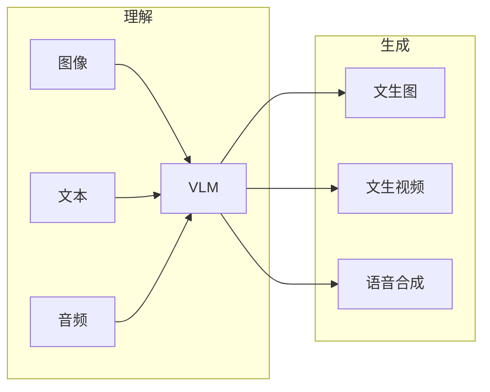

# 多模态理解与生成实战

> 多模态让模型同时"看懂图、听懂话、读出字、生成画"。它覆盖理解（视觉问答、文档 OCR、视频理解）与生成（文生图、文生视频、语音合成）。工程上要解决模态对齐、上下文组织、生成质量与成本。

## 1. 能力版图

## 2. 理解场景

- **视觉问答（VQA）**：图 + 问题 → 答案，需图像编码器与文本对齐。
- **文档理解**：PDF/表格/扫描件 OCR + 结构化抽取。
- **视频理解**：抽帧 + 时序建模，做摘要/检索。

## 3. 生成场景

| 任务 | 要点 |
| --- | --- |
| 文生图 | 提示词、风格、分辨率、安全过滤 |
| 文生视频 | 一致性、时长、成本极高 |
| 语音合成 | 自然度、音色、延迟 |

## 4. 工程要点

- **模态对齐**：统一 token 空间，避免错配。
- **上下文组织**：图放哪、多图如何排、token 预算。
- **质量与安全**：生成内容做审核，防违规。
- **成本**：高分辨率图/视频极耗资源，按需降采样。

## 5. 常见坑

| 坑 | 现象 | 对策 |
| --- | --- | --- |
| 图文错配 | 答非所问 | 对齐校验 |
| 幻觉 | 图里没有的细节 | 约束 + 引用 |
| 成本高 | 跑不起 | 降采样 |
| 安全风险 | 违规图 | 审核过滤 |
| 长视频崩 | 一致性差 | 分段 + 锚定 |

## 6. 面试题

1. 多模态对齐是什么？
2. 文档理解如何实现？
3. 文生视频难点？
4. 多模态如何控成本？
5. 生成内容如何安全过滤？

## 7. 小结

多模态 = 理解（看/听/读）+ 生成（图/视频/声）+ 对齐 + 安全。核心是"让不同模态在同一语义空间协作，且可控可信"。
