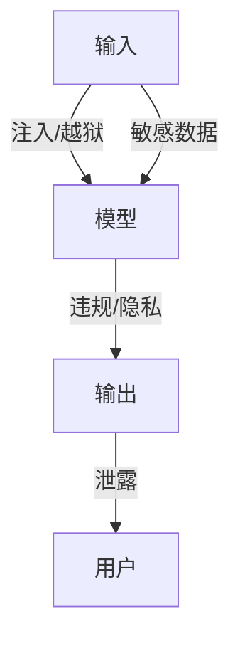

# 大模型内容安全与合规实战

> 大模型是强大的生成器，也是被攻击的高价值目标：提示注入、越狱、数据泄露、违规内容生成。内容安全与合规是上线的"硬门槛"，需要输入端过滤、输出端审核、全过程审计三层防护。

## 1. 风险面



| 风险 | 表现 |
| --- | --- |
| 提示注入 | 诱导模型忽略指令 |
| 越狱 | 绕过安全护栏 |
| 内容违规 | 暴恐、色情、政治敏感 |
| 隐私泄露 | 训练数据/上下文泄露 |
| 数据出域 | 合规违规 |

## 2. 防护层次

- **输入层**：敏感词、越狱模板检测、意图识别。
- **模型层**：系统提示固化安全边界、拒绝策略。
- **输出层**：内容审核（分类模型 + 规则）拦截违规。
- **审计层**：全量日志、可追溯、可复盘。

## 3. 提示注入应对

```python
def guard(prompt, system):
    if detect_injection(prompt):     # 识别"忽略上述指令"等
        return refuse()
    # 把用户内容当数据而非指令（分隔符/结构化）
    return call_llm(system, user_data=prompt)
```

- 用分隔符明确区分指令与数据。
- 对不可信内容降级处理，不执行其中指令。

## 4. 合规要点

- 数据不出境（按地区法规）。
- 用户数据隔离，不进训练。
- 生成内容留痕，满足审计。
- 未成年人、敏感领域特殊管控。

## 5. 常见坑

| 坑 | 现象 | 对策 |
| --- | --- | --- |
| 越狱成功 | 护栏失效 | 多层校验 |
| 泄露 | 敏感外泄 | 隔离 + 脱敏 |
| 误杀 | 正常被拦 | 分级 + 人工 |
| 无审计 | 出事无据 | 全量日志 |
| 合规缺 | 违规 | 地区策略 |

## 6. 面试题

1. 提示注入如何防范？
2. 输出审核层做什么？
3. 数据合规要点？
4. 越狱为什么难防？
5. 如何平衡安全与体验？

## 7. 小结

内容安全 = 输入过滤 + 模型边界 + 输出审核 + 合规审计。核心是"多层纵深防御、不可信内容不执行、全程可追溯"。
