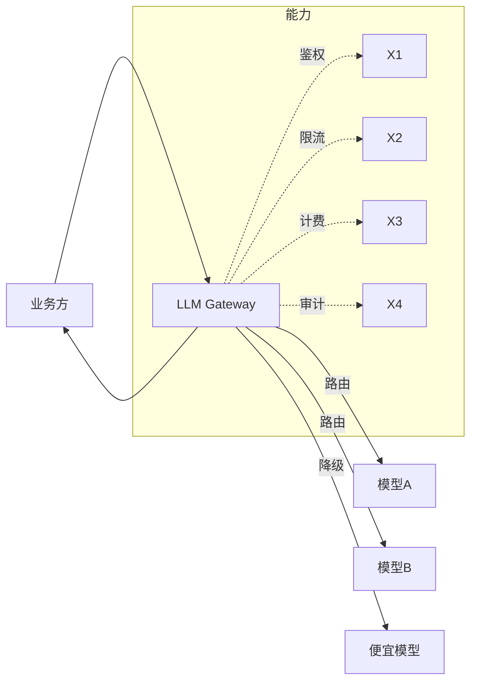

# 大模型网关与流量管控实战

> 当多个业务、多个模型、多个 Key 同时打向 LLM 时，需要一层"网关"统一做鉴权、限流、路由、降级、计费与审计。大模型网关是 LLM 应用的生产化刚需。

## 1. 网关的核心职责



| 能力 | 说明 |
| --- | --- |
| 统一鉴权 | API Key 管理、租户隔离 |
| 限流/配额 | 按租户/用户/QPS 限流，防滥用 |
| 智能路由 | 按成本/延迟/质量选模型 |
| 降级熔断 | 主模型故障时切备用 |
| 成本控制 | 按 token 计费、预算上限 |
| 审计日志 | 谁、何时、调了什么、花多少 |

## 2. 路由策略

- **成本优先**：默认小模型，复杂请求升级大模型。
- **延迟优先**：就近/低负载模型。
- **质量优先**：关键任务直连最强模型。
- **灰度**：新模型小流量验证后再全量。

## 3. 限流实现

```python
import time
from collections import defaultdict

class TokenBucket:
    def __init__(self, rate, capacity):
        self.rate = rate          # 每秒补充
        self.capacity = capacity  # 桶容量
        self.tokens = capacity
        self.ts = time.time()
    def allow(self, n=1):
        now = time.time()
        self.tokens = min(self.capacity,
            self.tokens + (now - self.ts) * self.rate)
        self.ts = now
        if self.tokens >= n:
            self.tokens -= n
            return True
        return False
```

按 token 而非仅按请求数限流更合理——一次长生成可能消耗上万 token。

## 4. 降级与熔断

- **降级**：主模型超时/限流时，自动切到次优模型并标注"降级"。
- **熔断**：某模型连续失败超阈值，短暂熔断，避免雪崩。
- **兜底**：返回缓存答案或模板话术，保证可用性。

## 5. 成本控制

- 为每租户设月度 token/金额预算，超限截断或进入队列。
- 缓存高频相同请求（prompt caching + 结果缓存）。
- 实时看板展示各业务线消耗。

## 6. 安全与合规

- 输入/输出内容审核（敏感词、PII 脱敏）。
- 防止 prompt injection 通过网关层规则拦截。
- 审计日志满足合规追溯。

## 7. 开源方案参考

| 方案 | 特点 |
| --- | --- |
| LiteLLM | 统一多模型 API、路由、限流、计费，部署简单 |
| APISIX AI Gateway | 基于 APISIX，插件化强 |
| Claude/GPT 官方网关 | 云厂商托管，少运维 |

## 8. 常见坑

| 坑 | 现象 | 对策 |
| --- | --- | --- |
| 只按请求限流 | 长文本击穿 | 按 token 限流 |
| 无降级 | 单模型故障全挂 | 多模型异构降级 |
|  cost 失控 | 某业务跑飞 | 租户预算 + 实时告警 |
| 缓存误用 | 个性化答案被串 | 缓存键含上下文指纹 |
| 审计缺失 | 出问题无法溯源 | 全链路日志 |

## 9. 面试题

1. 大模型网关相比普通 API 网关多了哪些能力？
2. 为什么限流要按 token 而非请求数？
3. 模型故障时的降级策略有哪些？
4. 如何在网关层做成本控制？
5. 多模型路由如何兼顾成本与质量？

## 10. 小结

大模型网关是"生产化守门员"：统一入口、管控成本与风险、提升可用性。小型团队可从 LiteLLM 起步，逐步补足审计与多模型路由。
