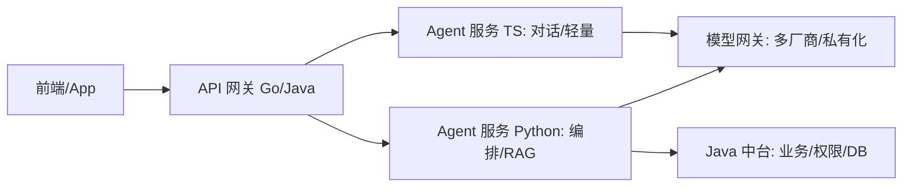

# 01 技术选型与语言栈

> 企业级 Agent 的第一步不是选模型，而是**定技术栈约束**。约束来自：企业现有语言栈、合规（数据出境/内网）、GPU 资源、团队能力、延迟预算。本章给出主流语言与模型接入层的工程化选型。

## 一、主流编程语言对比

### 1.1 选型维度

| 语言 | LLM 生态成熟度 | 企业存量 | 性能/并发 | 类型安全 | 适合角色 |
|------|----------------|----------|-----------|----------|----------|
| **Python** | ⭐⭐⭐⭐⭐ 最全（LangChain/LangGraph/OpenAI/各类库） | 中（算法/数据团队多） | 中（GIL，IO 密集靠异步） | 中（type hint，运行时弱） | Agent 核心逻辑、RAG、实验 |
| **TypeScript/Node** | ⭐⭐⭐⭐（Vercel AI SDK、LangGraph.js、OpenAI SDK） | 高（前端/全栈团队） | 高（事件循环、适合 IO） | 高（TS 编译期） | 前端集成、轻量 Agent 服务、全栈 |
| **Go** | ⭐⭐⭐（少但精：eino、原生 HTTP 容易） | 高（云原生/中台团队） | ⭐⭐⭐⭐⭐ 极佳 | 高 | 高并发网关、模型代理、基础设施 |
| **Java / Kotlin** | ⭐⭐⭐（Spring AI、LangChain4j） | ⭐⭐⭐⭐⭐ 极高（遗留+中台） | ⭐⭐⭐⭐（JVM） | 高 | 接入现有 Java 中台、合规金融系统 |
| **.NET / C#** | ⭐⭐（Microsoft Agent Framework、Semantic Kernel） | ⭐⭐⭐⭐（传统企业） | ⭐⭐⭐⭐ | 高 | 微软栈企业、内部系统打通 |

### 1.2 工程建议

- **没有"最好"，只有"最贴合存量"**：若企业主体是 Java/.NET 中台，硬上 Python 全栈会带来团队割裂与运维双栈成本。推荐模式——
  - **Python 做 Agent 大脑 + Go/Java 做网关/集成层**：Python 跑 LLM 编排逻辑，Go 做高并发模型代理/限流，Java 接现有中台业务。
  - **全栈 TS**：小团队/前端主导场景，用 Vercel AI SDK + Next.js 一把梭，上线最快。
  - **Java 兜底**：强合规金融，用 Spring AI / LangChain4j 在现有 Spring 体系内嵌 Agent，审计与权限复用现成体系。
- **类型安全**：Agent 输入输出是 LLM 生成的非结构化文本，强类型语言 + 结构化输出（JSON Schema / Pydantic）能兜住大量边界错误。

### 1.3 混合架构示例



---

## 二、模型接入层（关键：抽象！）

### 2.1 为什么必须抽象

业务代码**绝不能直接耦合**具体厂商 SDK。否则换模型 = 改全栈。正确做法：建**统一模型网关（LLM Gateway）**，向上提供统一接口，向下适配多厂商。

### 2.2 网关能力清单

- **统一接口**：chat / embed / rerank / function-call 统一签名。
- **多厂商路由**：OpenAI / Anthropic / Google / 国产（Qwen/DeepSeek/GLM）/ 本地（vLLM/Ollama）。
- **私有化兜底**：内网 vLLM 部署开源模型，合规数据不出域。
- **降级与熔断**：主模型超时/限流 → 自动切备用模型（能力对齐的前提下）。
- **统一密钥管理**：密钥在网关层注入，业务无感；按租户/项目隔离配额。
- **统一埋点**：所有模型调用经网关，自动落 tracing + token 成本。
- **限速/配额**：按应用/用户限流，防滥用与成本爆炸。

### 2.3 可选方案

| 方案 | 说明 | 适用 |
|------|------|------|
| 自研轻量 Gateway | Go/Python 包一层，适配 OpenAI 兼容协议 | 中小团队、可控性强 |
| LiteLLM | 开箱即用的多模型代理（统一 OpenAI 格式、路由、成本） | 快速接入多厂商 |
| 云厂商 Bedrock/Vertex AI | 托管多模型 + 合规 | 已上云且接受云锁定 |
| 私有化 vLLM + 网关 | 内网推理，数据不出 | 强合规/金融/政务 |

### 2.3.1 LiteLLM 深化（生产怎么用它）

- **两种形态**：`LiteLLM Proxy`（独立服务，OpenAI 兼容端点，团队共享，推荐生产形态）vs `litellm` SDK（进程内调用，适合单机脚本）；
- **核心能力**：100+ 厂商统一格式 / 路由策略（成本优先、延迟优先、轮询）/ 自动重试与超时 / 请求与 token 计量 / 虚拟 key + 预算管理（`/key/generate` 分配子 key 限额）；
- **典型部署**：`docker compose` 起 proxy → 业务方只配一个 base_url，换模型/加厂商零代码改动；
- **与可观测集成**：proxy 原生对接 Langfuse/OpenTelemetry（token、成本、延迟全量落库，见 06 篇）；
- **踩坑**：当自定义路由/鉴权/审计要求复杂时（多租户细粒度策略），自研或加一层总网关包 LiteLLM 更稳——它擅长「接入」，不擅长「企业治理」。

> 一句话：**「模型在变、接口不变」是 LLM 应用的底线——LiteLLM 解决「接入多厂商」，企业治理（租户、审计、配额）仍要你自己的网关兜底。**

### 2.4 代码示例（统一调用，伪代码）

```python
# 业务侧只依赖统一接口，不关心背后是哪家模型
from llm_gateway import chat

resp = chat(
    model="auto",            # 网关按策略路由
    messages=messages,
    tools=tools,
    fallback=["claude-sonnet", "qwen-plus"],  # 降级链
    tenant_id="acme",        # 租户隔离配额
)
```

---

## 三、私有化与合规约束

### 3.1 数据是否可出内网

- **强硬合规（金融/政务/医疗）**：数据（含提示与知识）不得出境 → 必须私有化部署（vLLM + 本地嵌入 + 本地向量库），或仅用经认证的国内云模型（数据隔离承诺）。
- **一般企业**：可用公有云 API，但需在网关层做**脱敏**（PII 识别/掩码）再外发。

### 3.2 合规清单

- 数据分类分级：哪些知识/字段绝对不能进模型。
- 跨境限制：境外模型 API 是否允许（很多行业不允许）。
- 留痕审计：所有 Agent 行为可回放、可追溯（满足监管）。
- 模型备案：国内上线生成式 AI 服务需按规定备案/登记。

### 3.3 私有化推理栈

- **推理引擎**：vLLM（高吞吐、PagedAttention）、SGLang、TensorRT-LLM。
- **模型**：Qwen / DeepSeek / GLM / Llama（需确认 license 与商用条款）。
- **部署**：单机多卡 → 多机张量/流水并行；K8s 用推理 Operator（如 KServe / Ray Serve）。

---

## 四、选型决策表（Cheat Sheet）

| 约束 | 默认 | 调整 |
|------|------|------|
| 企业语言栈 | 贴合存量优先 | Python 仅用于 Agent 大脑，集成层复用存量 |
| 模型接入 | 统一网关抽象 | 强合规→私有化 vLLM 兜底 |
| 类型安全 | TS/Go/Java 优先 | Python 用 Pydantic 兜结构化输出 |
| 并发性能 | Go/Java 做网关 | Python 靠异步 + 横向扩容 |
| 合规数据出境 | 默认禁止 | 脱敏 + 私有化 |
| 团队能力 | 不会的别硬上 | 全栈 TS 最快，Java 兜底合规 |

---

## 五、常见误区

1. **语言洁癖**：非要"统一一种语言"，忽视存量中台与团队。混合架构才是常态。
2. **直连厂商 SDK**：换模型改全栈，几个月后推倒重来。
3. **无视合规先接公有云**：金融/政务上线前才被发现数据出境，全盘返工。
4. **只看模型能力忽略成本**：GPT-4 级模型跑全量日志摘要，成本爆炸；应分层（重活用小模型）。
5. **私有化拍脑袋**：没评估 GPU 资源与运维能力就上 vLLM，部署即卡死。

---

## 六、与其他篇关系

- 框架选型见「[02-开发框架与整体架构](./02-开发框架与整体架构.md)」（网关之上用什么框架编排）。
- RAG 落地见「[03-RAG 工程化](./03-RAG-工程化.md)」（嵌入/向量库依赖模型接入层的 embed 能力）。
- 企业集成见「[04-企业系统集成](./04-企业系统集成.md)」（网关如何接 SSO/权限）。

> 一句话：**先把"语言栈 + 模型网关 + 合规边界"这三件定死，再谈 Agent 怎么写。** 这三件定错，后面全返工。
