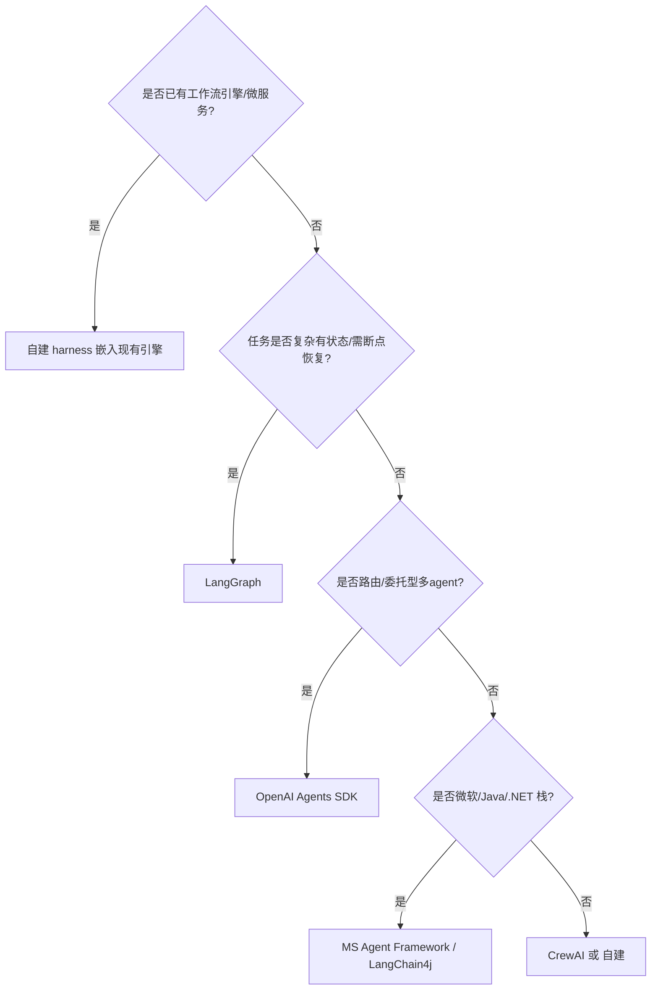
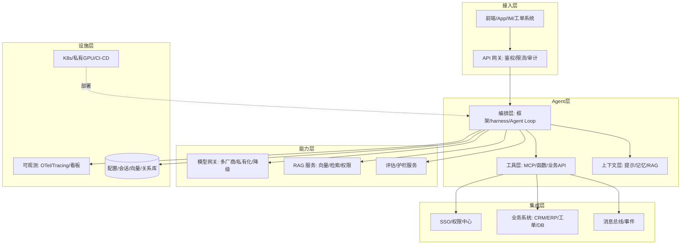

# 02 开发框架与整体架构

> 上一章定了语言与模型网关，这一章定**编排框架**与**系统整体分层**。注意：框架选型要贴合企业场景，不要按 GitHub star 选（详见「智能体/05-主流框架与生态」的概念对比）。本章从工程落地角度补强：自建 harness 何时更合适、企业分层架构怎么画、与现有系统边界在哪。

## 一、框架选型（工程视角）

| 框架 | 工程亮点 | 企业落地注意 |
|------|----------|--------------|
| **LangGraph** | 持久化执行（断点恢复）、时间旅行调试、HITL interrupt 节点 | 复杂有状态长任务首选；但学习曲线陡，简单场景杀鸡用牛刀 |
| **OpenAI Agents SDK** | 极简四原语（Agents/Handoffs/Guardrails/Tracing），provider 无关 | 路由/委托型多 agent 最快；无内置跨进程 checkpoint，长流程需自建 |
| **CrewAI** | 角色+任务+流程，Skills 一等公民，从原型到生产快 | 专家团队型工作流；A2A 已支持 |
| **Google ADK** | 唯一四语言（Py/TS/Go/Java）、原生 A2A、Vertex 集成 | 多语言企业/Google Cloud 栈；注意 CVE-2026-4810 及时升级 |
| **Microsoft Agent Framework** | .NET/C# parity、图工作流、AutoGen 迁移目标 | 微软栈/传统企业；GA 2026 Q1 |
| **自建 harness** | 完全可控、零框架债、贴合既有微服务 | 团队需有能力自研 Agent Loop + 状态机 |

### 1.1 何时自建而非用框架

框架带来抽象也带来约束。以下情况建议**自建轻量 harness**（在网关之上用少量代码实现 Agent Loop）：

- 企业已有成熟微服务/工作流引擎（如 Temporal/Camunda/自研流程），Agent 只是其中一个节点。
- 需求非常垂直（固定几步流水线），不需要通用图编排。
- 强合规要求"可解释的控制流"，不想被框架黑盒封装。
- 团队不愿引入额外重依赖（Python 包体积/供应链风险）。

> 经验：**80% 的企业 Agent 用 "LLM 网关 + 少量编排代码 + 现有工作流引擎" 就够**，剩下 20% 复杂有状态多 agent 才上 LangGraph 之类。

### 1.2 框架选型决策树

---

## 二、企业整体分层架构

### 2.1 推荐分层

### 2.2 各层职责边界（避免耦合）

- **接入层**：只做鉴权/限流/审计/协议转换，不碰 Agent 逻辑。
- **Agent 层**：纯编排，依赖注入工具与上下文；**不直接写 SQL / 直连业务库**（经工具层）。
- **工具层（ACI）**：Agent 与企业的唯一边界，所有对外部系统的操作都收敛到这里，便于权限/审计/限流。
- **模型网关**：屏蔽模型差异（见 01 篇）。
- **集成层**：企业既有系统，Agent 通过 MCP/API 访问，权限由 SSO/RBAC 控制。

### 2.3 为什么"工具层是边界"这么重要

- **安全**：所有外发/写操作经工具层，统一做最小权限 + HITL（见 05/06 篇）。
- **可测**：工具可 mock，Agent 逻辑可单测。
- **可审计**：每次工具调用落日志，满足合规回放。
- **解耦**：业务系统升级不影响 Agent 代码。

---

## 三、常见架构反模式

1. **Agent 直连数据库**：绕过权限中心，越权读全表；应是"工具层按 RBAC 封装的安全查询"。
2. **把 LLM 当数据库**：让模型"记住"业务状态，而非用外部会话/状态存储。
3. **过度编排**：简单顺序步骤硬套 LangGraph 复杂图，维护成本高。
4. **框架锁死业务**：Agent 逻辑散落框架特定 DSL，换框架即重写——应保持编排与业务解耦。
5. **无状态进程跑长任务**：进程重启丢上下文，需 checkpoint（LangGraph 持久化或自建）。

---

## 四、与其他篇关系

- 框架概念对比见「智能体/05-主流框架与生态」。
- RAG 工程见「[03-RAG 工程化](./03-RAG-工程化.md)」（RAG 服务在能力层）。
- 工具层/集成见「[04-企业系统集成](./04-企业系统集成.md)」。
- 长任务/状态/审批见「[05-企业级 Agent 架构](./05-企业级Agent架构.md)」。

> 一句话：**框架只是 Agent Loop 的实现手段，真正决定落地成败的是"分层边界 + 工具层收敛 + 与既有系统集成"。**
