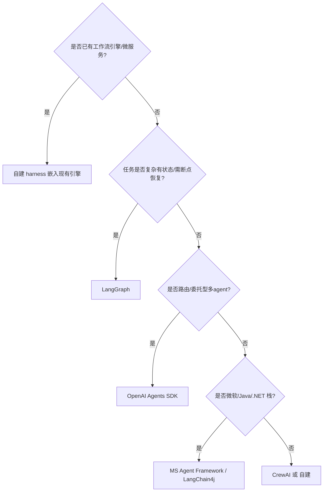
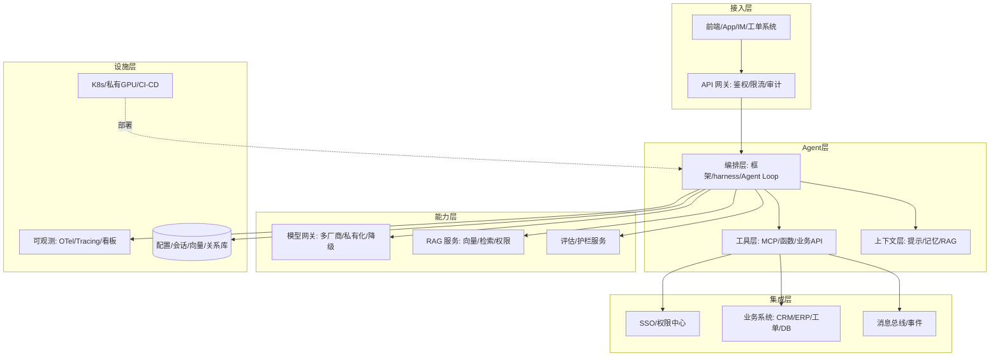

# 02 开发框架与整体架构（深入：Agent Loop 实现 / 工具层 ACI / 会话状态 / 观测与成本）

> 上一章定了语言与模型网关，这一章定**编排框架**与**系统整体分层**。本篇深入拆解：Agent Loop 实现细节、工具层（ACI）设计、会话/状态管理、可观测性与成本控制。

---

## 一、框架选型（工程视角）

| 框架 | 工程亮点 | 企业落地注意 |
|------|----------|--------------|
| **LangGraph** | 持久化执行（断点恢复）、时间旅行调试、HITL interrupt 节点 | 复杂有状态长任务首选；学习曲线陡 |
| **OpenAI Agents SDK** | 极简四原语（Agents/Handoffs/Guardrails/Tracing），provider 无关 | 路由/委托型最快；长流程需自建 checkpoint |
| **CrewAI** | 角色+任务+流程，Skills 一等公民 | 专家团队型工作流；A2A 已支持 |
| **Google ADK** | 唯一四语言、原生 A2A、Vertex 集成 | 多语言企业/Google 栈 |
| **Microsoft Agent Framework** | .NET parity、图工作流 | 微软栈/传统企业 |
| **自建 harness** | 完全可控、零框架债 | 需自研 Agent Loop + 状态机 |

### 1.1 何时自建而非用框架

- 企业已有成熟微服务/工作流引擎（Temporal/Camunda），Agent 只是其中一个节点；
- 需求非常垂直（固定几步流水线），不需要通用图编排；
- 强合规要求"可解释的控制流"；
- 团队不愿引入额外重依赖（供应链风险）。

> 经验：**80% 的企业 Agent 用 "LLM 网关 + 少量编排代码 + 现有工作流引擎" 就够**。

### 1.2 框架选型决策树



---

## 二、Agent Loop 实现（自建核心）

### 2.1 循环结构

```python
# 自建 Agent Loop 最小实现
def agent_loop(query: str, max_iterations: int = 10):
    messages = [{"role": "user", "content": query}]
    
    for step in range(max_iterations):
        # 1. 调用模型（带工具定义）
        response = llm.call(messages, tools=TOOL_SCHEMAS)
        
        # 2. 判断是否需要工具调用
        if not response.tool_calls:
            return response.content  # 结束
        
        # 3. 执行工具调用
        for tool_call in response.tool_calls:
            result = execute_tool(tool_call.name, tool_call.args)
            messages.append({
                "role": "tool",
                "tool_call_id": tool_call.id,
                "content": result
            })
    
    raise MaxIterationsExceeded(query)
```

### 2.2 循环关键设计

| 设计点 | 说明 |
|--------|------|
| 迭代上限 | 防止死循环（默认 10~30 次） |
| 工具执行超时 | 单个工具默认 30s，超时返回错误 |
| 错误注入 | 工具失败 → 错误信息喂回模型 → 自主重试 |
| 中断（HITL） | 高风险操作 interrupt 等人工确认 |
| Checkpoint | 每步持久化，进程重启可恢复 |
| 预算控制 | token 计数，超预算强制终止 |

---

## 三、工具层（ACI）设计

### 3.1 为什么工具层是唯一边界

- **安全**：所有外发/写操作经工具层，统一最小权限 + HITL；
- **可测**：工具可 mock，Agent 逻辑可单测；
- **可审计**：每次工具调用落日志，满足合规回放；
- **解耦**：业务系统升级不影响 Agent 代码。

### 3.2 工具定义规范

```python
from pydantic import BaseModel

class QueryOrderParams(BaseModel):
    order_id: str
    fields: list[str] | None = None  # 限制返回字段

TOOL_SCHEMAS = [
    {
        "type": "function",
        "function": {
            "name": "query_order",
            "description": "查询订单详情（权限：仅本部门订单）",
            "parameters": QueryOrderParams.model_json_schema()
        }
    }
]
```

### 3.3 工具设计原则

| 原则 | 说明 |
|------|------|
| 原子化 | 一个工具只做一件事（易测试/易审计） |
| 参数收敛 | 参数最少化（减少模型出错空间） |
| 返回结构化 | 返回 JSON（模型易理解） |
| 权限最小化 | 工具内嵌 RBAC 校验 |
| 幂等设计 | 写操作支持重试（幂等键） |
| 超时与限流 | 防止模型滥用/拖垮下游 |

### 3.4 工具注册与发现

```
集中注册表（Registry）：
  工具名 → 实现 + Schema + 权限 + 审计

MCP 对接：
  Model Context Protocol 统一工具协议
  企业系统暴露 MCP Server → Agent 动态发现
  跨框架复用（一次实现，多处调用）
```

---

## 四、企业整体分层架构



### 4.1 各层职责边界

| 层 | 职责 | 红线 |
|----|------|------|
| 接入层 | 鉴权/限流/审计/协议转换 | 不碰 Agent 逻辑 |
| Agent 层 | 纯编排，依赖注入 | 不直接写 SQL/直连业务库 |
| 工具层 | 与企业的唯一边界 | 所有外部操作收敛于此 |
| 模型网关 | 屏蔽模型差异 | 统一降级/路由 |
| 集成层 | 企业既有系统 | 经 MCP/API，SSO/RBAC 控制 |

---

## 五、会话与状态管理

### 5.1 三层状态

```
会话级（Session）：
  单次对话的上下文（messages）
  存储：Redis（TTL）或内存

任务级（Task/Thread）：
  一个业务任务的执行状态（步骤/工具结果/中间变量）
  存储：DB（LangGraph checkpointer / 自建）

持久级（User Profile）：
  用户偏好/历史/长期记忆
  存储：向量库/DB（RAG 检索）
```

### 5.2 上下文管理

| 策略 | 说明 |
|------|------|
| 截断 | 超长丢弃最早消息（简单粗暴） |
| 摘要 | 定期压缩历史为摘要（信息保留） |
| 关键消息保留 | 系统提示 + 最近 N 条 + 摘要 |
| 检索注入 | 长期记忆走 RAG 检索 |

### 5.3 Checkpoint（断点恢复）

```
LangGraph 持久化：
  checkpoint 每步保存（状态 + 消息）
  进程重启 → 从最后 checkpoint 恢复
  时间旅行：回退到任意历史步骤

自建方案：
  状态机 + DB 快照（每步更新）
  幂等重放（工具幂等设计保证）
```

---

## 六、可观测性

### 6.1 Agent 观测三件套

| 信号 | 指标 |
|------|------|
| 指标 | 请求量/成功率/延迟/token 消耗/工具调用次数 |
| 日志 | 每步消息/工具调用/决策原因 |
| 链路 | trace 贯穿：入口 → Agent Loop → 工具 → LLM 调用 |

### 6.2 关键监控指标

```
业务指标：
  任务完成率 / 平均轮数 / 人工介入率

成本指标：
  每次任务 token 消耗 / 调用费用 / 缓存命中率

质量指标：
  工具调用成功率 / 重试次数 / 幻觉率（抽样评估）
```

### 6.3 调试手段

```
Replay：保存完整会话，离线重放（LangSmith/自研）
Step 级日志：每步输入输出可见
Token 计费归因：按用户/按任务/按工具
A/B 对比：提示词/工具变更前后指标对比
```

---

## 七、成本控制

| 策略 | 说明 |
|------|------|
| 模型路由 | 简单任务用小模型，复杂任务用大模型 |
| 缓存 | 相同/相似请求命中缓存（语义缓存） |
| 上下文压缩 | 摘要替代全量历史 |
| 预算上限 | 每用户/每任务 token 配额 |
| 批量推理 | 非实时场景批量（Batching 折扣） |
| 私有化部署 | 高频场景本地模型（成本可控） |

---

## 八、常见架构反模式

| 反模式 | 危害 | 正确做法 |
|--------|------|----------|
| Agent 直连数据库 | 越权读全表 | 工具层按 RBAC 封装安全查询 |
| 把 LLM 当数据库 | 状态易失/幻觉 | 外部会话/状态存储 |
| 过度编排 | 维护成本高 | 简单步骤用线性流程 |
| 框架锁死业务 | 换框架即重写 | 编排与业务解耦 |
| 无状态进程跑长任务 | 重启丢上下文 | Checkpoint 持久化 |
| 无预算控制 | 成本失控 | token 配额 + 告警 |

---

## 九、与其他篇关系

- 框架概念对比见「智能体/05-主流框架与生态」；
- RAG 工程见「[03-RAG 工程化](./03-RAG-工程化.md)」；
- 工具层/集成见「[04-企业系统集成](./04-企业系统集成.md)」；
- 长任务/状态/审批见「[05-企业级 Agent 架构](./05-企业级Agent架构.md)」。

> 一句话：**框架只是 Agent Loop 的实现手段，真正决定落地成败的是"分层边界 + 工具层收敛 + 会话状态管理 + 观测与成本控制"。**
