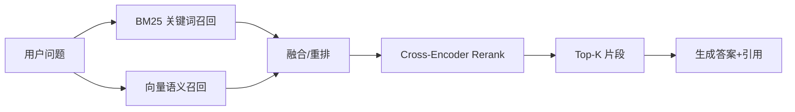

# 03 RAG 工程化（企业知识接入）

> RAG 概念（检索增强生成）在「RAG」子模块已讲透。本章专讲**企业工程化落地**：怎么把企业散落的知识（文档/工单/FAQ/库表）安全接进来，怎么做到**不同人看到不同知识（权限隔离）**，怎么增量更新，怎么评测检索质量。这是企业 RAG 与"玩具 RAG"的分水岭。

## 一、企业知识源梳理

| 知识类型 | 来源 | 处理难点 |
|----------|------|----------|
| 文档（Word/PDF/Markdown） | 共享盘/Wiki/Confluence | 版式解析、表格/图片、权限继承 |
| FAQ / 工单 | 客服系统/知识库 | 口语化、重复、需去噪 |
| 结构化数据 | 数据库/数据仓库 | 需转自然语言描述 + 权限映射 |
| 网页/内网门户 | CMS/门户 | 爬取、去重、失效链接 |
| 代码/API 文档 | Git/API 网关 | 语义检索 + 代码示例 |

---

## 二、向量库选型（工程视角）

| 向量库 | 形态 | 规模 | 企业适配 |
|--------|------|------|----------|
| **Milvus** | 独立服务/分布式 | 十亿级 | 大规模、可私有化、K8s 友好 |
| **Qdrant** | 独立服务 | 千万~亿级 | Rust、过滤强、易运维 |
| **Weaviate** | 独立服务 | 千万级 | 内置混合检索、GraphQL |
| **pgvector** | Postgres 扩展 | 千万级 | **复用现有 PG**、事务一致、权限复用 | ⭐企业推荐起点 |
| **Elasticsearch** | 搜索平台 | 亿级 | 已有 ES 栈、BM25+向量混合 |
| **Redis / Faiss** | 内存/库 | 中小 | 低延迟、轻量 |

> 工程建议：**已有 Postgres 的中小企业直接用 pgvector**，省一套独立基础设施，还能复用行级权限（RLS）做权限隔离（见下）。规模上亿再上 Milvus/Qdrant。

---

## 三、分块 / 嵌入 / 混合检索

### 3.1 分块策略

- **按语义切**：标题/段落/表格感知，而非固定字符数。
- **父子块（Parent-Child）**：小块检索、大块喂给模型（保上下文）。
- **重叠切**：相邻块重叠防割裂。
- **结构化保留**：表格转 Markdown、代码块保留语法。

### 3.2 嵌入模型

- 选型：OpenAI text-embedding / BGE（智源，开源）/ M3E / 本地 bge-large。
- 私有化：强合规用本地嵌入（BGE 等），数据不出域。
- 维度与成本：维度越高越准但存储大；按场景选 768/1024/1536。

### 3.3 混合检索（必做）

单纯向量检索召回不准，**BM25（关键词）+ 向量 + 可选 Rerank** 三件套：



- Rerank：用 cross-encoder（如 BGE-Reranker）对候选重排，显著提升精度。
- 元数据过滤：先按权限/时间/部门过滤再检索（权限隔离关键，见下）。

---

## 四、权限隔离 RAG（企业核心难点）

### 4.1 问题

企业知识有密级：财务文档 HR 不能看，A 部门合同 B 部门不能看。**直接把所有文档向量化全员可查 = 数据泄露**。

### 4.2 方案：元数据 + 行级过滤

每个 chunk 带 ACL 元数据（部门/角色/密级/owner）。检索时：

1. 先拿到**当前用户的可访问范围**（来自 SSO/RBAC，见 04 篇）。
2. 检索 query 加 **metadata filter**：只召回该用户有权限的 chunk。
3. 生成时若引用了无权片段，直接丢弃。

```python
# 伪代码：带权限过滤的检索
user_scope = auth.get_scope(user_id)   # {dept:"finance", role:"manager", clearance:"L3"}
hits = vector_store.search(
    query,
    filter={"and": [
        {"dept": user_scope.dept},
        {"clearance": {"lte": user_scope.clearance}},
    ]},
    top_k=10,
)
```

> **pgvector + Postgres RLS（行级安全）** 是优雅解：在 DB 层用 RLS 策略按用户角色自动过滤，应用层无需逐个判断，权限中心一处配置全局生效。

### 4.3 越权防护

- 不要在 prompt 里塞"用户不可见的过滤后内容"再让模型"假装不知道"——应在检索阶段物理隔离。
- 审计：记录每次检索命中的文档与用户，便于事后核查越权。

---

## 五、增量更新与时效

- **增量索引**：文档变更只重索引受影响 chunk，不重建全库。
- **版本与失效**：文档删除/过期 → 软删除对应向量，避免检索到旧内容。
- **时效策略**：合规类知识设 TTL，到期强制重校验。
- **去重**：同一文档多版本去重，防召回冲突。

---

## 六、检索质量评测（必须做）

RAG 上线前必须建**评测集**：

- **检索召回率（Recall@K）**：相关问题能否召回正确 chunk。
- **上下文相关性（Context Relevance）**：召回片段是否真相关（防噪声）。
- ** groundedness（有据性）**：答案是否真来自检索内容（防模型编造）。
- **端到端答案正确率**：人工或 LLM-as-judge 打分。

> 没有检索评测的 RAG = 瞎调。建议用「模型评测与基准」子模块的 eval 方法论，建固定测试集持续回归。

---

## 七、企业 RAG 反模式

1. **全员共享一个无权限知识库**：严重越权泄露。
2. **只向量不 BM25**：召回漏关键词精确匹配。
3. **不评测检索质量**：上线后"偶尔答非所问"查不到原因。
4. **全量重建索引**：文档小改全库重算，耗时且影响服务。
5. **把机密字段也向量化**：合同金额/身份证进向量库，扩大泄露面——应先脱敏再索引。

---

## 八、与其他篇关系

- RAG 原理见「RAG」子模块（01 概述 / 02 进阶 / 03 评估）。
- 权限来自「[04-企业系统集成](./04-企业系统集成.md)」的 SSO/RBAC。
- 评测见「[06-可观测性、成本与安全](./06-可观测性、成本与安全.md)」与「模型评测与基准」。
- 嵌入/向量依赖「01-技术选型」的模型网关 embed 能力。

> 一句话：**企业 RAG 的成败 80% 在"权限隔离 + 检索质量评测"，不在向量库本身。**
