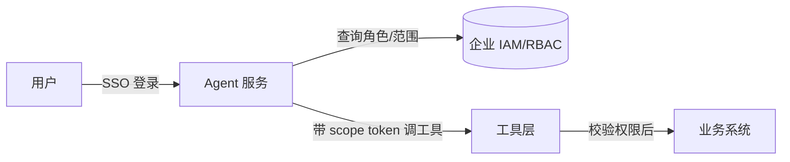
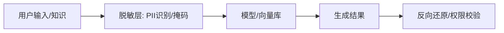

# 04 企业系统集成

> Agent 脱离企业系统就是玩具。本章讲怎么把 Agent **安全地接进企业的身份、权限、业务系统、数据流**，让它能"办事"而不是只能"聊天"。核心原则：**一切对外操作收敛到工具层，权限由企业既有体系控制，敏感数据先脱敏**。

## 一、身份与权限打通（SSO / RBAC）

### 1.1 统一身份

- Agent 服务作为**企业应用**接入 SSO（OIDC/SAML/LDAP），用户身份来自统一目录（如企业微信/钉钉/AD）。
- 每次对话/操作携带**经过验证的用户身份**（不可由前端伪造）。

### 1.2 权限映射

- 用户的角色/部门/密级来自 RBAC 系统（如企业 IAM）。
- Agent 的"能看什么知识、能调什么工具、能写什么业务"都由该身份决定。
- **最小权限**：默认无权限，按需显式授权；工具调用前二次校验。

### 1.3 作用域凭证（Scope Token）

工具层调用业务系统时使用**短期、最小权限**的凭证（IAM 角色 / 细粒度 JWT），到期自动撤销，避免长期密钥泄露。

---

## 二、业务系统接入方式

| 系统 | 接入方式 | 注意 |
|------|----------|------|
| CRM/ERP/工单 | 官方 OpenAPI / SDK | 走工具层封装，带权限过滤 |
| 数据库 | 只读视图 / 安全查询工具 | **禁止 Agent 直连 DB 写**；用参数化查询防注入 |
| 消息/IM | 企业微信/钉钉/飞书机器人 Webhook | 异步通知、审批触达 |
| 文件/对象存储 | 受限访问签名 URL | 按用户权限生成临时链接 |
| 内部服务 | 服务网格 / 内部 API 网关 | 服务间 mTLS |

---

## 三、MCP 企业化

### 3.1 MCP 是什么（回顾）

模型上下文协议（MCP）把"工具/数据源"标准化为 **Server**，LLM 通过统一协议调用。企业落地时，把内部业务系统封装成**内部 MCP Server**，Agent 即插即用。

### 3.2 企业 MCP 实践

- **内部 MCP 注册中心**：各业务域暴露 MCP Server，Agent 按需发现。
- **网关鉴权**：MCP Server 前置网关，统一做 SSO 透传与限流。
- **审计中间件**：所有 MCP 调用落审计日志（谁、调了什么、参数、结果）。
- **私有部署**：MCP Server 跑在内网，不暴露公网。

> 注意：MCP 让工具接入变简单，但也放大了**越权风险**——必须配齐 RBAC + 审计 + HITL（见 05/06 篇）。否则"人人都能让 Agent 调所有系统"。

---

## 四、数据脱敏与防泄露

### 4.1 为什么必须脱敏

强合规场景下，提示/知识外发公有云模型前，必须剥离 PII（身份证/手机号/银行卡/合同金额）。否则既违规又泄露。

### 4.2 脱敏策略

| 策略 | 说明 | 适用 |
|------|------|------|
| 正则/词典识别 | 手机号/身份证模式匹配打码 | 结构化字段 |
| NER 模型 | 命名实体识别抽 PII | 自由文本 |
| 字段级掩码 | 只留后四位/哈希 | 日志/检索 |
| 本地化 | 敏感数据不进模型，仅本地处理 | 核心机密 |

### 4.3 脱敏在管道的位置

- 检索前脱敏入库；生成后若需回显真实值，按用户权限反向还原（或根本不还原，只给脱敏视图）。

---

## 五、消息总线与事件驱动

- Agent 可作为**事件消费者**：监听业务事件（订单异常/告警）自动触发分析。
- Agent 可作为**事件生产者**：把决策/工单写入总线，下游系统消费。
- 用 Kafka/RabbitMQ/企业 MQ，保证可靠投递与幂等（重复事件不重复办事）。

---

## 六、集成反模式

1. **Agent 直连生产库写操作**：无权限控制、无审计、易误删——应经工具层 + HITL。
2. **硬编码密钥**：写在配置里泄露；用密钥管理（Vault/KMS）+ scope token。
3. **不脱敏直接外发**：合规事故；网关层强制脱敏。
4. **MCP 裸奔**：工具随便调、无审计；MCP 前置鉴权网关。
5. **同步长任务阻塞**：调用慢业务系统卡死 Agent；用异步 + 超时 + 重试 + 幂等。

---

## 七、与其他篇关系

- 工具层边界见「[02-开发框架与整体架构](./02-开发框架与整体架构.md)」。
- 权限隔离知识检索见「[03-RAG 工程化](./03-RAG-工程化.md)」。
- 审批/HITL 见「[05-企业级 Agent 架构](./05-企业级Agent架构.md)」。
- 安全护栏/越权漏洞见「[06-可观测性、成本与安全](./06-可观测性、成本与安全.md)」。

> 一句话：**Agent 的企业价值 = 它能不能安全地"办事"；办事的前提是身份可信、权限最小、操作可审计、敏感数据不裸奔。**
